# 31.2.5 Connector friction behavior


**Products: **Abaqus/Standard  Abaqus/Explicit  Abaqus/CAE  

##### **References**

- ["Connectors: overview," Section 31.1.1](pt06ch31s01abo28.md)
- ["Connector behavior," Section 31.2.1](pt06ch31s02alm27.md)
- ["Connector functions for coupled behavior," Section 31.2.4](pt06ch31s02alm30.md)
- [*CHANGE FRICTION](../key/key-link.md#usb-kws-hchangefriction)
- [*CONNECTOR BEHAVIOR](../key/key-link.md#usb-kws-mconnectorbehavior)
- [*CONNECTOR DERIVED COMPONENT](../key/key-link.md#usb-kws-mconnectorderivedcomp)
- [*CONNECTOR FRICTION](../key/key-link.md#usb-kws-mconnectorfriction)
- [*CONNECTOR POTENTIAL](../key/key-link.md#usb-kws-mconnectorpotential)
- [*FRICTION](../key/key-link.md#usb-kws-hfriction)
- ["Defining friction," Section 15.17.3 of the Abaqus/CAE User's Guide](../usi/usi-link.md#usi-itn-help-friction)

### Overview

Frictional effects can be defined in any connector with available components of relative motion. A typical connector might have several pieces that are in relative motion and are contacting with friction. Therefore, both frictional forces and frictional moments may develop in the connector available components of relative motion.

To define connector friction in Abaqus, you must specify the following:
- the friction law as governed by a friction coefficient;
- the contributions to the friction-generating connector contact forces or moments; and
- the local "tangent" direction in which the friction forces/moments act.

The friction coefficient can be- expressed in a general form in terms of slip rate, contact force, temperature, and field variables;
- defined by a static and kinetic term with a smooth transition zone defined by an exponential curve; and
- limited by a tangential maximum force, , which is the maximum value of tangential force that can be carried by the connector before sliding occurs.

Abaqus provides two alternatives for specifying the other aspects of friction interactions in connectors:- Predefined friction interactions for which you need to specify a set of parameters that are characteristic of the connection type for which friction is modeled. Abaqus automatically defines the contact force contributions and the local "tangent" directions in which friction occurs. Predefined friction interactions represent common cases and are available for many connection types (see ["Connection-type library," Section 31.1.5](pt06ch31s01aus114.md)). If desired, known internal contact forces (such as from a press-fit assembly) can be defined as well.
- User-defined friction interactions for which you define all friction-generating contact force contributions and the local "tangent" directions along which friction occurs. The user-defined friction interactions can be used if predefined friction is not available for the connection type of interest or if the predefined friction interaction does not adequately describe the mechanism being analyzed. Although more complicated to utilize, user-defined interactions: - are very general in nature due to flexibility in defining arbitrary sliding directions via connector potentials and contact forces via connector derived components; - allow for the specification of sliding directions, contact forces, and additional internal contact forces as functions of connector relative position or motion, temperature, and field variables (the internal contact forces can also be dependent on accumulated slip); and - allow for several friction definitions to be used in the same connection applied in different components of relative motion.

### Friction formulation in connectors

The basic concept of Coulomb friction between two contacting bodies is the relation of the maximum allowable frictional (shear) force across an interface to the contact force between the contacting bodies. In the basic form of the Coulomb friction model, two contacting surfaces can carry shear forces, 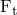, up to a certain magnitude across their interface before they start sliding relative to one another; this state is known as sticking. The Coulomb friction model defines this critical shear force as , where  is the coefficient of friction and  is the contact force. The stick/slip calculations determine when a point transitions from sticking to slipping or from slipping to sticking. Mathematically, the relationship can be formalized as 

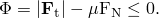

 Frictional stick occurs if ; and sliding occurs if , in which case the friction force is . 

Friction in connectors is based on the analogy that contacting surfaces of various parts inside a connector device transmit tangential as well as normal forces across their interfaces. The normal (contact) forces, , are typically generated by kinematic constraints or by elastic forces/moments in the connector. Connector friction can be used to model tangential (shear) forces, , in the space spanned by the available components of relative motion for both stick and slip conditions. [Figure 31.2.5--1](pt06ch31s02alm31.md#usb-elm-econnect-fricslot) illustrates the simplest frictional mechanism in connectors, a SLOT connector in a two-dimensional analysis. 

**Figure 31.2.5–1** Friction in a two-dimensional SLOT connection.

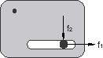

The local tangent direction in which frictional sliding occurs is the 1-direction (tangential traction 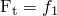), and the normal force is developed by the kinematic constraint enforcing the SLOT constraint in the 2-direction, 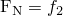. The friction model is defined in this case by 


which in case of slip predicts a friction force  as expected. In this case the friction model is straightforward to understand as the slip direction is along an intrinsic (1 through 6) component of relative motion and the normal force is given only by the force in one other single component orthogonal to the sliding direction.

In many connectors the definition of the tangential tractions is more complex. For example, friction may develop in a tangent direction that spans two or more available components of relative motion. Consider the case of frictional sliding in a SLIDE-PLANE connection as illustrated in ["Connector functions for coupled behavior," Section 31.2.4](pt06ch31s02alm30.md). In this case the friction-generating normal force is given by the constraint force in the 1-direction, 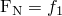. However, the magnitude of the tangential tractions is given by 


thus including contributions from two components of relative motion. The instantaneous direction of frictional slip in the 2–3 plane is not known a priori.

In many connectors the normal force may have contributions from several connector components. Consider the case of a three-dimensional SLOT as illustrated in ["Connector functions for coupled behavior," Section 31.2.4](pt06ch31s02alm30.md). In this case the magnitude of the tangential tractions is given by , but the normal force is generated by constraint forces in both the 2- and 3-directions and can be written as


In the most general case both the tangential tractions and the normal force may have contributions from several components. Further, the component directions may include both translations (forces) and rotations (moments). Thus, friction modeling in connectors is defined in a more general form, as follows. First, the function  governing the stick-slip condition is defined as 


where  is the collection of forces in the connector;  is the connector potential (see ["Connector functions for coupled behavior," Section 31.2.4](pt06ch31s02alm30.md)), which represents the magnitude of the frictional tangential tractions in the connector in a direction tangent to the surface on which contact occurs; and  is the friction-producing normal (contact) force on the same contact surface. Frictional stick occurs if ; and sliding occurs if , in which case the friction force is . 

The normal force, , is the sum of a magnitude measure of contact force-producing connector forces, , and a self-equilibrated internal contact force (such as from a press-fit assembly), :


The function 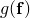 is given by a connector derived component definition as illustrated in ["Connector functions for coupled behavior," Section 31.2.4](pt06ch31s02alm30.md). Using this formalism, we can easily reconstruct the examples illustrated above: - In the two-dimensional SLOT case, 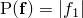 and .
- In the SLIDE-PLANE case, 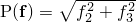 and .
- In the three-dimensional SLOT case,  and 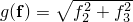.

See the examples at the end of this section for more complex illustrations of friction definitions in connectors.

If frictional effects are defined for a rotational component of relative motion (such as in a HINGE connector), it is often more convenient to define “tangential” moments and “normal” moments instead of tangential tractions/forces and normal forces. The pseudo-yield function governing the stick/slip behavior is defined in a similar fashion:


where the “normal” moment   is written as


 is the self-equilibrated friction-generating internal “contact” moment (for example, from press fit). See ["Specifying friction in a HINGE connection](pt06ch31s02alm31.md#usb-elm-econnectbehav-fric-hinge)” at the end of this section for an illustration.

### Predefined friction behavior

Predefined friction interactions allow you to model typical frictional mechanisms in commonly used connector types without having to define the mechanics of the frictional response.  Instead of specifying the potential, , directly to define the magnitude measure of the tangential tractions and the contact force 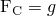 via a derived component, you specify:
- a set of friction-related parameters associated with the connection type, which include geometric parameters specific to the connection type and, optionally, the internal contact force  or contact moment ; and
- the friction law (governed by the friction coefficient) as described in ["Defining the friction coefficient](pt06ch31s02alm31.md#usb-elm-econnectbehav-friccoef)."

Abaqus then automatically generates internally the potential, , and the contact force, , based on the connection type and geometric parameters provided. [Table 31.2.5--1](pt06ch31s02alm31.md#usb-elm-econnectbehav-predef-params) shows the connection types for which predefined friction interactions are available and the associated friction-related parameters. The meanings of the geometric parameters as well as the corresponding potentials and derived components automatically generated by Abaqus are described in ["Connection-type library," Section 31.1.5](pt06ch31s01aus114.md). 

**Table 31.2.5–1** Predefined friction-related parameters.
| Connection type | Friction-related parameters |
| --- | --- |
| Geometric parameters | Internal contact force/moment |
| CYLINDRICAL | *R*, *L* |  |
| HINGE | 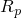, 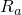,  |  |
| PLANAR | *R* | ,  |
| SLIDE-PLANE | None |  |
| SLOT | None |  |
| TRANSLATOR | , *L* |  |
| UJOINT | , 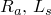,  | ,  |
| SLIPRING | None | None |

See the examples at the end of this section for illustrations of predefined friction.

| **Input File Usage: ** | ``` [*CONNECTOR FRICTION](../key/key-link.md#usb-kws-mconnectorfriction), PREDEFINED *friction-related parameters outlined in [Table 31.2.5--1](pt06ch31s02alm31.md#usb-elm-econnectbehav-predef-params)* ``` |
| --- | --- |

| **Abaqus/CAE Usage: ** | Interaction module: connector section editor: ****Add****Friction****: **Friction model: Predefined**, **Predefined Friction Parameters**, *enter the friction-related parameters outlined in [Table 31.2.5--1](pt06ch31s02alm31.md#usb-elm-econnectbehav-predef-params) in the data table* |
| --- | --- |

### User-defined friction behavior

User-defined friction behavior can be used if predefined friction is not available for the connection type of interest or if the predefined friction interaction does not describe adequately the mechanism being analyzed. For user-defined friction you must specify:
- "tangent" direction information, as follows: - if the slip direction is known, you specify directly the direction in which friction forces/moments act, from which Abaqus constructs the potential ; - if the slip direction is unknown, you specify the potential  from which Abaqus computes the instantaneous slip direction;
- the friction-producing normal force, , or normal moment, , by defining at least one of the following: - the contact force  or contact moment ; and/or - the internal contact force  or contact moment ; and
- the friction law (governed by the friction coefficient) as described in ["Defining the friction coefficient](pt06ch31s02alm31.md#usb-elm-econnectbehav-friccoef)."

#### Specifying the slip direction aligned with an available component of relative motion

The friction tangent direction is identified by specifying an available component (1–6) to define friction forces or moments in a specified intrinsic connector local direction. This is the natural choice in cases when the connector element has only one available component of relative motion (for example, SLOT, REVOLUTE, or TRANSLATOR); in these cases the relative slip between the various parts forming the physical connection occurs in one local direction only. In connections with two or more available components of relative motion, specifying a particular available component of relative motion allows you to specify frictional effects in that direction only, if desired. For example, in the case of a CYLINDRICAL connection, specifying component 1 defines frictional effects only in translation while rotation around the axis is ignored for friction.

Abaqus constructs the potential, , automatically as 

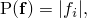

 where  is the force/moment in the specified component *i*.

| **Input File Usage: ** | ``` [*CONNECTOR FRICTION](../key/key-link.md#usb-kws-mconnectorfriction), COMPONENT=*i* ``` |
| --- | --- |

| **Abaqus/CAE Usage: ** | Interaction module: connector section editor: ****Add****Friction****: **Friction model: User-defined**, **Slip direction: Specify direction**, *component* |
| --- | --- |

#### Specifying the potential when the slip direction is unknown

In connection types with two or more available components of relative motion, frictional slipping is not necessarily solely along one of the available components of relative motion. In such cases the instantaneous slip direction is not known, as illustrated in the SLIDE-PLANE case in ["Friction formulation in connectors](pt06ch31s02alm31.md#usb-elm-econnectbehav-fricform).” Another example is the CYLINDRICAL connection in which frictional sliding occurs in a direction tangent to the cylindrical surface, thus involving simultaneously a translational slip in the local 1-direction and a rotational slip about the same axis (see the first example at the end of this section for an illustration). Thus, frictional slip may occur in a coupled fashion spanning several available components simultaneously.

In such cases you must specify the magnitude measure of the tangential tractions on the assumed contact surface using a connector potential definition, . Abaqus then computes the instantaneous slip direction  simultaneously with the stick-slip determination similar to the surface-based three-dimensional frictional contact computations described in ["Coulomb friction," Section 5.2.3 of the Abaqus Theory Guide](../stm/stm-link.md#stm-ifc-coulombfric). This procedure is best illustrated for the SLIDE-PLANE case, as follows:
- First, the potential  is evaluated.
- Slipping occurs if the pseudo-yield function 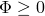.
- The two vector components (the local 2- and 3-directions) of the instantaneous slip direction are given by the ratios of the two shear forces,  and , normalized by the magnitude of the potential.

In general, this strategy is extended to the space spanned by the available components of relative motion associated with the connection type that ultimately participate in the potential definition (see ["Connector functions for coupled behavior," Section 31.2.4](pt06ch31s02alm30.md)). For example, up to two components for SLIDE-PLANE or CYLINDRICAL connections, three components for CARDAN connections, and six components for a user-assembled connection using CARTESIAN and CARDAN connections can be included in the potential. See the examples below for several illustrations.

| **Input File Usage: ** | Use the following two options to specify coupled user-defined friction: |
| --- | --- |
|  | ``` [*CONNECTOR FRICTION](../key/key-link.md#usb-kws-mconnectorfriction) [*CONNECTOR POTENTIAL](../key/key-link.md#usb-kws-mconnectorpotential) ``` |

| **Abaqus/CAE Usage: ** | Interaction module: connector section editor: ****Add****Friction****: **Friction model: User-defined**, **Slip direction: Compute using force potential**, **Force Potential** |
| --- | --- |

#### Specifying the contact force

You specify the friction-generating user-defined contact force, , or contact moment, , by referring to either an intrinsic component of relative motion number (1 through 6) or a named connector derived component (see ["Defining derived components for connector elements" in "Connector functions for coupled behavior," Section 31.2.4](pt06ch31s02alm30.md#usb-elm-econnectbehav-derivedcomps)).

In the latter case the scaling parameters used in the definition of  can be made functions of identified local directions, temperature, and field variables. It is often desirable to include contributions from both connector forces and moments in the definition of the derived component. In these cases the scaling parameters used to define the derived components should have units of length or one over length for meaningful contact force/moment definitions.

| **Input File Usage: ** | Use the following option to define a contact force for connector friction using an intrinsic connector component: |
| --- | --- |
|  | ``` [*CONNECTOR FRICTION](../key/key-link.md#usb-kws-mconnectorfriction), CONTACT FORCE=*component number (1--6)* ``` Use the following options to define a contact force for connector friction using a connector derived component: ``` [*CONNECTOR DERIVED COMPONENT](../key/key-link.md#usb-kws-mconnectorderivedcomp), NAME=*derived_component_name* [*CONNECTOR FRICTION](../key/key-link.md#usb-kws-mconnectorfriction), CONTACT FORCE=*derived_component_name* ``` |

| **Abaqus/CAE Usage: ** | Interaction module: connector section editor: ****Add****Friction****: **Friction model: User-defined**, **Contact Force**, **Specify component: Intrinsic component** or **Derived component**, *component* or specify derived component |
| --- | --- |
|  | Connector derived component names are not supported in Abaqus/CAE. |

#### Specifying the internal contact force

Internal contact forces such as contact interference may occur in connectors during the physical assembly of the various pieces forming the connector (for example, a press-fit shaft into the sleeve of a CYLINDRICAL connection). When relative motion occurs between the connector parts, these self-equilibrating contact stresses will produce contact forces, , or contact moments, ; see ["Friction formulation in connectors](pt06ch31s02alm31.md#usb-elm-econnectbehav-fricform).”

The internal contact forces/moments are created by specifying a contact force/moment curve (positive values only) as a function of accumulated slip, temperature, and field variables. The accumulated slip is computed as the sum of the absolute values of all slip increments in an instantaneous slip direction. Consequently, the accumulated slip is monotonically increasing for oscillatory or periodic motion and can be used to model dependencies related to wear or heat generation in the connection. 

| **Input File Usage: ** | ``` The internal contact forces limiting curve is defined on the data lines of the [*CONNECTOR FRICTION](../key/key-link.md#usb-kws-mconnectorfriction) option. ``` |
| --- | --- |

| **Abaqus/CAE Usage: ** | Interaction module: connector section editor: ****Add****Friction****: **Friction model: User-defined**, **Contact Force**, and enter the **Internal Contact Force** in the data table |
| --- | --- |

##### Specifying the internal contact force to depend on local directions

The internal contact force can also be defined as dependent on either connector relative positions or constitutive relative motions.

| **Input File Usage: ** | Use the following option to define an internal contact force that depends on components of relative position: |
| --- | --- |
|  | ``` [*CONNECTOR FRICTION](../key/key-link.md#usb-kws-mconnectorfriction), INDEPENDENT COMPONENTS=POSITION ``` Use the following option to define an internal contact force that depends on components of constitutive displacements or rotations: ``` [*CONNECTOR FRICTION](../key/key-link.md#usb-kws-mconnectorfriction), INDEPENDENT COMPONENTS=CONSTITUTIVE MOTION ``` |

| **Abaqus/CAE Usage: ** | Interaction module: connector section editor: ****Add****Friction****: **Friction model: User-defined**, **Contact Force**, **Use independent components: Position** or **Motion** |
| --- | --- |

### Defining the friction coefficient

The connector friction definition uses the standard friction model described in ["Frictional behavior," Section 37.1.5](pt09ch37s01aus169.md), to define the friction coefficient. The anisotropic friction and friction data associated with the second contact direction are ignored for connector elements. If the friction coefficients are not specified or are set to zero, the connector friction has no effect on the connector behavior. If the equivalent shear force/moment limit, , is specified (see ["Using the optional shear stress limit" in "Frictional behavior," Section 37.1.5](pt09ch37s01aus169.md#usb-cni-afriction-taumax)), the limiting friction force  in the pseudo-yield function  (see ["Friction formulation in connectors](pt06ch31s02alm31.md#usb-elm-econnectbehav-fricform)”) is replaced by 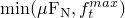.

Rough, Lagrange, and user-defined friction cannot be used in connector elements. 

| **Input File Usage: ** | Use the following options: |
| --- | --- |
|  | ``` [*CONNECTOR BEHAVIOR](../key/key-link.md#usb-kws-mconnectorbehavior), NAME=*name* [*CONNECTOR FRICTION](../key/key-link.md#usb-kws-mconnectorfriction) [*FRICTION](../key/key-link.md#usb-kws-hfriction) ``` |

| **Abaqus/CAE Usage: ** | Interaction module: connector section editor: ****Add****Friction****: **Tangential Behavior**, **Friction Coefficient**, and enter the **Friction Coeff.** in the data table |
| --- | --- |

#### Changing the friction coefficients during an Abaqus/Standard analysis

In Abaqus/Standard the friction coefficients can be changed during the analysis as for any analysis including friction (see ["Changing friction properties during an Abaqus/Standard analysis" in "Frictional behavior," Section 37.1.5](pt09ch37s01aus169.md#usb-cni-afriction-change-std), for details).

#### Controlling the unsymmetric solver in Abaqus/Standard

In Abaqus/Standard friction constraints produce unsymmetric terms when the connector nodes are sliding relative to each other. These terms have a strong effect on the convergence rate if frictional stresses have a substantial influence on the overall displacement field and the magnitude of the frictional stresses is highly solution dependent. Abaqus/Standard will automatically use the unsymmetric solution method if the coefficient of friction is greater than 0.2. If desired, you can turn off the unsymmetric solution method as described in ["Defining an analysis," Section 6.1.2](pt03ch06s01abo05.md).

### Defining the stick stiffness

Abaqus determines whether the connector is sticking or slipping in a similar fashion as for all contact interactions (see ["Frictional behavior," Section 37.1.5](pt09ch37s01aus169.md)), as outlined in ["Friction formulation in connectors](pt06ch31s02alm31.md#usb-elm-econnectbehav-fricform).” If the model is sticking, the elastic stiffness of the response is determined by the optional stick stiffness that is specified as part of the connector friction definition.

If the stick stiffness is not specified, Abaqus will compute a usually appropriate stick stiffness. In Abaqus/Standard a maximum allowable elastic slip length (or angle) is first defined using either the value of the slip tolerance, , together with an automatically computed characteristic length (angle) in the model or the absolute magnitude of the allowable elastic slip, , to be used in the stiffness method for sticking friction directly (see ["Stiffness method for imposing frictional constraints in Abaqus/Standard" in "Frictional behavior," Section 37.1.5](pt09ch37s01aus169.md#usb-cni-afriction-stiffness-std)). The elastic stick stiffness is then determined by simply dividing the current connector limiting friction force by this maximum allowable elastic slip length (angle). In Abaqus/Explicit the elastic stick stiffness is determined from the Courant (stability) condition.

| **Input File Usage: ** | ``` [*CONNECTOR FRICTION](../key/key-link.md#usb-kws-mconnectorfriction), STICK STIFFNESS=*elastic stiffness* ``` |
| --- | --- |

| **Abaqus/CAE Usage: ** | Interaction module: connector section editor: ****Add****Friction****: **Stick stiffness: Specify**: *elastic stiffness* |
| --- | --- |

### Using multiple connector friction definitions

Multiple connector frictions can be used as part of the same connector behavior definition. However, only one connector friction definition can be used to define friction interactions for each available component of relative motion. If predefined friction is used, only one connector friction definition can be associated with a connector behavior definition. At most one coupled user-defined friction definition can be associated with a connector behavior definition. Additional connector friction definitions are permitted for the same connector behavior definition only if the component relative motion spaces for each definition do not overlap; for example, you could define uncoupled connector friction in components 1, 2, and 6 and coupled connector friction (by defining a potential) using components 3, 4, and 5. All connector friction definitions act in parallel and will be summed if necessary. For a particular connector element there will be as many stick-slip calculations as connector friction definitions. See the examples below.

### Examples

The following examples illustrate how to define friction in connector elements.

#### Equivalent ways of specifying friction behavior in a CYLINDRICAL connection

In the example in [Figure 31.2.5--2](pt06ch31s02alm31.md#usb-elm-econnect-fricshock) assume Coulomb-like friction affects the translational motion along the shock and the rotational motion about the shock axis.

**Figure 31.2.5–2** Simplified connector model of a shock absorber.


The coefficient of friction is , and the overlapping length for the two parts of the shock is 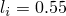 length units in the undeformed configuration. An average radius of the two cylinders is considered to be 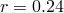 units. It is also assumed that the axial motion in the connection is relatively small so that the overlapping length between the connector parts does not change much. The friction-generating contact force has contributions from two sources: - the normal force from the inner walls pushing against each other (the vector magnitude of the Lagrange multipliers imposing the SLOT constraint), and
- the "bending" in the REVOLUTE constraint (the vector magnitude of the Lagrange multipliers imposing the REVOLUTE constraint).

See ["Connection-type library," Section 31.1.5](pt06ch31s01aus114.md), for a detailed discussion of predefined contact forces and tangential tractions in the CYLINDRICAL connection. Two equivalent alternatives to model these frictional effects are shown below:

1. Using the Abaqus predefined friction behavior: ``` [*PARAMETER](../key/key-link.md#usb-kws-mparameter) *r*=0.24 =0.55 *...* [*CONNECTOR FRICTION](../key/key-link.md#usb-kws-mconnectorfriction), PREDEFINED ,  [*FRICTION](../key/key-link.md#usb-kws-hfriction) 0.15 ``` Using a predefined connector friction behavior yields the most compact definition of frictional effects. This definition requires only the specification of the two friction-relevant geometrical scaling constants.
2. Using a user-defined frictional behavior: ``` [*PARAMETER](../key/key-link.md#usb-kws-mparameter) *r*=0.24 =0.55 =1.0 =2.0/ *...* [*CONNECTOR BEHAVIOR](../key/key-link.md#usb-kws-mconnectorbehavior), NAME=*shock* [*CONNECTOR DERIVED COMPONENT](../key/key-link.md#usb-kws-mconnectorderivedcomp), NAME=normal 2, 3 ,  **() [*CONNECTOR DERIVED COMPONENT](../key/key-link.md#usb-kws-mconnectorderivedcomp), NAME=normal, 5, 6 ,  **() [*CONNECTOR FRICTION](../key/key-link.md#usb-kws-mconnectorfriction), CONTACT FORCE=normal [*CONNECTOR POTENTIAL](../key/key-link.md#usb-kws-mconnectorpotential) 1, 4,  [*FRICTION](../key/key-link.md#usb-kws-hfriction) 0.15 ``` The contact force "normal" is defined by 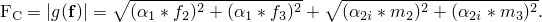 The connector potential defines the magnitude of the tangential tractions as  This force magnitude is tangent to the cylindrical surface of the connector on which contact occurs. The choice of normal force definition and potential in this case ensures that the same frictional effects defined in Case A are modeled.

#### Specifying friction interactions in a CYLINDRICAL connection accounting for position dependencies

In the example in [Figure 31.2.5--2](pt06ch31s02alm31.md#usb-elm-econnect-fricshock) assume that large axial motion occurs between the two connector parts and, hence, the overlapping length will change significantly during the analysis. For the sake of discussion, assume that the two connector nodes are specified to be overlapped in the initial configuration. Thus, at CP1=0.0 the initial overlap is  as specified above. If during the analysis the connector relative position along the 1-component reaches CP1=0.45 units, the final overlap would be 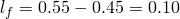. If the connection is subjected to a “bending-like” loading, one can argue that as the overlapping length decreases, the contact forces developed between the two parts become increasingly higher. Use the following user-defined friction behavior definitions to model this dependence of the contact force on relative positions:

```
[*PARAMETER](../key/key-link.md#usb-kws-mparameter) 
*r*=0.24
=0.55
=0.1
=1.0
=2.0/ 
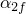=2.0/ 
*...*
[*CONNECTOR BEHAVIOR](../key/key-link.md#usb-kws-mconnectorbehavior), NAME=*shock*
[*CONNECTOR DERIVED COMPONENT](../key/key-link.md#usb-kws-mconnectorderivedcomp), NAME=normal
2, 3
,  
**()
[*CONNECTOR DERIVED COMPONENT](../key/key-link.md#usb-kws-mconnectorderivedcomp), NAME=normal, 
INDEPENDENT COMPONENTS=POSITION
1
5, 6
, , 0
**( at CP1=0.0)
, , 0.45
**(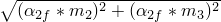 at CP1=0.45)
[*CONNECTOR FRICTION](../key/key-link.md#usb-kws-mconnectorfriction), CONTACT FORCE=normal
[*CONNECTOR POTENTIAL](../key/key-link.md#usb-kws-mconnectorpotential)
1,
4,  
[*FRICTION](../key/key-link.md#usb-kws-hfriction)
 0.15
```

#### Specifying friction due to assembly contact interference

Assume a CYLINDRICAL connector element in which the shaft was press-fit into the sleeve, as shown in the initial configuration (relative motion = 0.0) in [Figure 31.2.5--3](pt06ch31s02alm31.md#usb-elm-econnect-friccylpres).

**Figure 31.2.5–3** CYLINDRICAL connection with slightly conical pin.

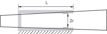

The shaft is not perfectly cylindrical but slightly conical so that its cross-section diameter is increasing in a linear fashion along the shaft direction. If the relative displacement along the shaft direction becomes positive, the contact forces will increase (more contact interference); if the  relative displacements become negative (less interference), they will decrease. An exponential decay model is assumed to model the transition from a static coefficient of friction to a kinetic one. Only the positive contact force versus displacement values need to be specified. The following user-defined friction behavior definitions can be used:
```
[*PARAMETER](../key/key-link.md#usb-kws-mparameter) 
*r*=0.24
*...*
[*CONNECTOR FRICTION](../key/key-link.md#usb-kws-mconnectorfriction), INDEPENDENT COMPONENTS=CONSTITUTIVE MOTION 
1 
** (independent component 1)
0.70, -0.7854
0.85, -0.3927
1.0 ,  0.0
1.15,  0.3927
1.30,  0.7854
[*CONNECTOR POTENTIAL](../key/key-link.md#usb-kws-mconnectorpotential)
1,
4, ...
[*FRICTION](../key/key-link.md#usb-kws-hfriction), EXPONENTIAL DECAY
 0.25, 0.10, 0.2
```
The internal contact forces are specified directly on the data lines to model known contact interference forces as a function of the connector constitutive component of relative motion along component 1. Since no intrinsic component of relative motion number or named connector derived component was specified to define the contact force, the only contribution to the contact force is the specified internal contact force.

#### Specifying friction in a HINGE connection

This example illustrates the use of a connector friction definition to specify frictional effects in a HINGE connection. The friction behavior defines friction moments about the 1-direction, since there are no other available components of relative motion. As illustrated in ["Connection-type library," Section 31.1.5](pt06ch31s01aus114.md), the three geometrical scaling constants that need to be specified for predefined friction are the radius of the pin cross-section, =0.12; the effective friction arm in the axial direction, =0.14; and the overlapping length between the pin and the sleeve, =0.65. The friction coefficient is assumed to be =0.15. It is assumed that the connector has been assembled with initial known contact interference-producing contact moments of 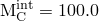 units. The following input could be used to specify the predefined friction behavior in the HINGE connection:

```
[*PARAMETER](../key/key-link.md#usb-kws-mparameter) 
=0.12
=0.14
=0.65
*...*
[*CONNECTOR FRICTION](../key/key-link.md#usb-kws-mconnectorfriction), PREDEFINED
, , , 100.0 
[*FRICTION](../key/key-link.md#usb-kws-hfriction)
 0.15
```

Alternatively, a user-defined friction behavior could be specified to define identical frictional effects (see ["Connection-type library," Section 31.1.5](pt06ch31s01aus114.md)). Moreover, a reduction of the interference contact forces as the pin wears due to accumulated sliding can be modeled in this case by specifying the internal contact forces/moments to be functions of accumulated slip. The following input can be used:

```
[*PARAMETER](../key/key-link.md#usb-kws-mparameter) 
=0.12 
=0.14 
=0.65 
=  
=  
=2.0*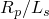 
*...* 
[*CONNECTOR DERIVED COMPONENT](../key/key-link.md#usb-kws-mconnectorderivedcomp), NAME=contact_moment 
1, 
, 
** () 
[*CONNECTOR DERIVED COMPONENT](../key/key-link.md#usb-kws-mconnectorderivedcomp), NAME=contact_moment 
2, 3 
,  
**() 
[*CONNECTOR DERIVED COMPONENT](../key/key-link.md#usb-kws-mconnectorderivedcomp), NAME=contact_moment 
5, 6 
,  
**() 
[*CONNECTOR FRICTION](../key/key-link.md#usb-kws-mconnectorfriction), COMPONENT=4, CONTACT FORCE=contact_moment 
100, 0.0 
90 , 1000.0 
** *interference contact moments decreasing due to wear effects*
[*FRICTION](../key/key-link.md#usb-kws-hfriction)
0.15
```

The additional friction moments due to contact interference are modeled by specifying decreasing internal contact moments as a function of accumulated rotational slip about the 1-direction. The connector derived component definitions are used to define a contact moment-producing friction in the same direction (component 4). The contact moment is defined by 


The connector potential is defined automatically by Abaqus as .

#### Specifying friction in a ball-in-socket connection

This example illustrates the specification of frictional effects in a ball-in-socket connection. While the first choice in defining a ball-in-socket connection is JOIN and ROTATION, other rotation parameterizations could be used (JOIN and CARDAN, JOIN and EULER, or JOIN and FLEXION-TORSION). Assuming that the radius of the ball is 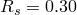 and the coefficient of friction is , the following lines can be used to define the friction interactions:

```
[*PARAMETER](../key/key-link.md#usb-kws-mparameter) 
=0.30 
*...*
[*CONNECTOR DERIVED COMPONENT](../key/key-link.md#usb-kws-mconnectorderivedcomp), NAME=normal 
1, 2, 3
1.0, 1.0, 1.0
**(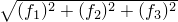)
[*CONNECTOR FRICTION](../key/key-link.md#usb-kws-mconnectorfriction), CONTACT FORCE=normal 
[*CONNECTOR POTENTIAL](../key/key-link.md#usb-kws-mconnectorpotential)
4, 
5, 
6, 
[*FRICTION](../key/key-link.md#usb-kws-hfriction)
 0.15
```
The computed connector friction moments and the friction-induced moments at the connector nodes are dependent on the connection type.

### Defining connector friction behavior in linear perturbation procedures

Frictional slipping is not allowed in linear perturbation procedures. If a connector is slipping at the end of the last general analysis step, it will slip freely during the current linear perturbation step. Otherwise, Abaqus will allow the connector to slip elastically with the specified stick stiffness or enforce a sticking condition if a stick stiffness is not specified.

### Output

The Abaqus output variables available for connectors are listed in ["Abaqus/Standard output variable identifiers," Section 4.2.1](pt02ch04s02abv01.md), and ["Abaqus/Explicit output variable identifiers," Section 4.2.2](pt02ch04s02xbv01.md). The following variables are of particular interest when defining friction in connectors:

| CSF | Connector friction forces/moments. In addition to the usual six components associated with connector output variables, CSF includes the scalar CSFC, which is the friction force generated by a coupled friction definition. |
| --- | --- |

| CNF | Connector normal forces/moments. CNF includes the scalar CNFC, which is the friction-generating normal force associated with a coupled friction definition. |
| --- | --- |

| CASU | Connector accumulated slip. CASU includes the scalar CASUC, which is the accumulated slip associated with a coupled friction definition. |
| --- | --- |

| CIVC | Connector instantaneous velocity associated with a coupled friction definition. |
| --- | --- |


