# 31.2.6 Connector plastic behavior


**Products: **Abaqus/Standard  Abaqus/Explicit  Abaqus/CAE  

##### **References**

- ["Connectors: overview," Section 31.1.1](pt06ch31s01abo28.md)
- ["Connector behavior," Section 31.2.1](pt06ch31s02alm27.md)
- ["Connector elastic behavior," Section 31.2.2](pt06ch31s02alm28.md)
- ["Connector functions for coupled behavior," Section 31.2.4](pt06ch31s02alm30.md)
- [*CONNECTOR BEHAVIOR](../key/key-link.md#usb-kws-mconnectorbehavior)
- [*CONNECTOR DERIVED COMPONENT](../key/key-link.md#usb-kws-mconnectorderivedcomp)
- [*CONNECTOR ELASTICITY](../key/key-link.md#usb-kws-mconnectorelasticity)
- [*CONNECTOR HARDENING](../key/key-link.md#usb-kws-mconnectorhardening)
- [*CONNECTOR PLASTICITY](../key/key-link.md#usb-kws-mconnectorplasticity)
- [*CONNECTOR POTENTIAL](../key/key-link.md#usb-kws-mconnectorpotential)
- ["Defining plasticity," Section 15.17.6 of the Abaqus/CAE User's Guide](../usi/usi-link.md#usi-itn-help-plasticity)

### Overview

Connector plasticity in Abaqus:
- can be used to model plastic/irreversible deformations of parts forming an actual connection device; for example, - the pin or the sleeve in a door hinge may deform plastically if the forces/moments acting on them are large enough; - connection elements in automotive suspension systems may deform irreversibly due to abusive loading; or - spot welds in a car frame and rivets in an airplane could undergo inelastic deformations if the forces acting on the structural members they are a part of are larger than intended;
- is defined in terms of resultant forces and moments in the connector;
- uses perfect plasticity or isotropic/kinematic hardening behavior models;
- can be used when rate-dependent effects are important;
- can be specified in any connectors with available components of relative motion;
- can be used for available components of relative motion for which either elastic or rigid behavior was specified;
- can be used in an uncoupled fashion to define elastic-plastic or rigid plastic response in individual available components of relative motion; and
- can be used to specify coupled elastic-plastic or rigid plastic behavior, in which case the responses in several available components of relative motion are involved simultaneously in a coupled fashion to define plasticity effects.

To define connector plasticity in Abaqus, the following are necessary:- the elastic or rigid behavior prior to the onset of plasticity;
- a yield function upon which plastic flow will be initiated; and
- hardening behavior to define the initial yield value and, optionally, the yield value evolution after plastic motion initiation.

### Plasticity formulation in connectors

The plasticity formulation in connectors is similar to the plasticity formulation in metal plasticity (see ["Classical metal plasticity," Section 23.2.1](pt05ch23s02abm17.md)). In connectors the stress () corresponds to the force (), the strain () corresponds to the constitutive motion (), the plastic strain () corresponds to the plastic relative motion (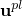), and the equivalent plastic strain () corresponds to the equivalent plastic relative motion (). The yield function  is defined as 

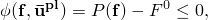

 where  is the collection of forces and moments in the available components of relative motion that ultimately contribute to the yield function; the connector potential, 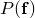, defines a magnitude of connector tractions similar to defining an equivalent state of stress in Mises plasticity and is either automatically defined by Abaqus or user-defined; and 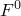 is the yield force/moment. The connector relative motions, , remain elastic as long as ; and when plastic flow occurs, .

If yielding occurs, the plastic flow rule is assumed to be associated; thus, the plastic relative motions are defined by 


 where 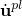 is the rate of plastic relative motion and 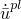 is the equivalent plastic relative motion rate.

#### Loading and unloading behavior

Abaqus allows for the following three types of behaviors associated with a plasticity definition when the connector is not actively yielding:
- Linear elastic behavior, shown in [Figure 31.2.6--1](pt06ch31s02alm32.md#usb-elm-econnectbehav-linnonlin-elast)(a), is the most common case since similar behavior can be modeled in metal plasticity, for example, by specifying the Young's modulus. Elastic motion occurs prior to plasticity onset, and unloading from a plastic state occurs on a straight line parallel to the initial loading. **Figure 31.2.6--1** Linear elastic-plastic (a), rigid plastic (b), and nonlinear elastic-plastic (c) response. 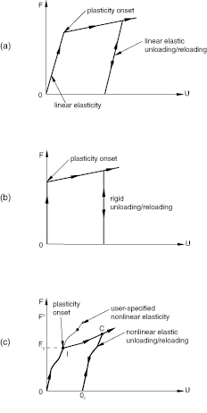
- Rigid behavior, shown in [Figure 31.2.6--1](pt06ch31s02alm32.md#usb-elm-econnectbehav-linnonlin-elast)(b), assumes that the slope in the linear elastic behavior is infinite; thus, the elastic motion prior to plasticity onset is zero, and unloading from a plastic state occurs on a vertical line. In practice, the rigid behavior is enforced using an automatically chosen high penalty stiffness.
- Nonlinear elastic behavior, shown in [Figure 31.2.6--1](pt06ch31s02alm32.md#usb-elm-econnectbehav-linnonlin-elast)(c), in which the initial elastic loading occurs along the defined nonlinear path. Elastic unloading occurs along a nonlinear curve (C 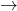 Oc) that is simply the user-defined nonlinear elastic curve motion shifted such that it passes through point C. The user-defined nonlinear elastic behavior must be such that the unloading path (C  Oc) does not intersect with the loading path (O  I  C); otherwise, a local instability will occur.

Other behaviors (such as damping or friction) can be specified in addition to the elastic/rigid/plastic specifications but will not be considered in the plasticity calculations since they are considered to be in parallel with the elastic-plastic/rigid plastic behavior (see the conceptual model in ["Connector behavior," Section 31.2.1](pt06ch31s02alm27.md)).

### Defining elastic-plastic or rigid plastic behavior

As is the case with any other connector behavior type, connector plasticity can be defined only for available components of relative motion. For example, you cannot define plastic behavior in a BEAM connector or in components 2 and 3 of a SLOT connector since these components are not available for behavior definitions. The solution to this problem is to:
- define a connection type with available components of relative motion that best models the kinematics of your connection device both before and after plasticity onset;
- define the desired components as rigid (see ["Connector elastic behavior," Section 31.2.2](pt06ch31s02alm28.md)); and
- specify rigid plastic behavior in some or all of these components.

For example, to define rigid plasticity for an otherwise rigid beam-like connector, you could use a PROJECTION CARTESIAN connection together with a PROJECTION FLEXION-TORSION connection, define all components as rigid, and proceed with your plasticity definitions.

Elastic-plastic behavior is usually specified for available components of relative motion for which spring-like behavior is specified and for which plastic deformation may occur.

| **Input File Usage: ** | Use the following options to define rigid plasticity in connectors: |
| --- | --- |
|  | ``` [*CONNECTOR BEHAVIOR](../key/key-link.md#usb-kws-mconnectorbehavior), NAME=*name* [*CONNECTOR ELASTICITY](../key/key-link.md#usb-kws-mconnectorelasticity), RIGID [*CONNECTOR PLASTICITY](../key/key-link.md#usb-kws-mconnectorplasticity) [*CONNECTOR HARDENING](../key/key-link.md#usb-kws-mconnectorhardening) ``` Use the following options to define elastic-plasticity in connectors: ``` [*CONNECTOR BEHAVIOR](../key/key-link.md#usb-kws-mconnectorbehavior), NAME=*name* [*CONNECTOR ELASTICITY](../key/key-link.md#usb-kws-mconnectorelasticity) [*CONNECTOR PLASTICITY](../key/key-link.md#usb-kws-mconnectorplasticity) [*CONNECTOR HARDENING](../key/key-link.md#usb-kws-mconnectorhardening) ``` |

| **Abaqus/CAE Usage: ** | Use the following input to define rigid plasticity in connectors: |
| --- | --- |
|  | Interaction module: connector section editor: ****Add****Elasticity****, **Definition: Rigid**; ****Add****Plasticity**** Use the following input to define elastic-plasticity in connectors: Interaction module: connector section editor: ****Add****Elasticity****; ****Add****Plasticity**** |

### Defining uncoupled plastic behavior

Uncoupled elastic-plastic or rigid plastic behavior, specified for each component of relative motion independently, is similar to one-dimensional plasticity. You must define elastic or rigid behavior in the specified component of relative motion. In this case the connector potential function is chosen automatically as 


where  is the force or moment in the  available component of relative motion for which plastic behavior is specified. The associated plastic flow in this case becomes


where  is the rate of plastic relative motion and  is the equivalent plastic relative motion rate in the  component.

| **Input File Usage: ** | Use the following options to define uncoupled rigid plastic connector behavior: |
| --- | --- |
|  | ``` [*CONNECTOR BEHAVIOR](../key/key-link.md#usb-kws-mconnectorbehavior), NAME=*name* [*CONNECTOR ELASTICITY](../key/key-link.md#usb-kws-mconnectorelasticity), RIGID, COMPONENT=*i* [*CONNECTOR PLASTICITY](../key/key-link.md#usb-kws-mconnectorplasticity), COMPONENT=*i* [*CONNECTOR HARDENING](../key/key-link.md#usb-kws-mconnectorhardening) ``` Use the following options to define uncoupled elastic-plastic connector behavior: ``` [*CONNECTOR BEHAVIOR](../key/key-link.md#usb-kws-mconnectorbehavior), NAME=*name* [*CONNECTOR ELASTICITY](../key/key-link.md#usb-kws-mconnectorelasticity), COMPONENT=*i* [*CONNECTOR PLASTICITY](../key/key-link.md#usb-kws-mconnectorplasticity), COMPONENT=*i* [*CONNECTOR HARDENING](../key/key-link.md#usb-kws-mconnectorhardening) ``` |

| **Abaqus/CAE Usage: ** | Use the following input to define uncoupled rigid plastic connector behavior: |
| --- | --- |
|  | Interaction module: connector section editor: ****Add****Elasticity****, **Definition: Rigid**; ****Add****Plasticity****, **Coupling: Uncoupled** Use the following input to define uncoupled elastic-plastic connector behavior: Interaction module: connector section editor: ****Add****Elasticity****, **Definition: Linear** or **Nonlinear**, **Coupling: Uncoupled**; ****Add****Plasticity****, **Coupling: Uncoupled** |

### Defining coupled plastic behavior

You should define coupled plasticity in connectors when several available components of relative motion are involved simultaneously in a coupled fashion in the definition of the yield function . In this case you must define the potential, *P*, via a connector potential definition. Plastic flow eventually occurs only in the intrinsic components of relative motion that are ultimately involved in the potential. Elastic or rigid behavior should be specified for all components of relative motion that are involved in the potential definition. The elastic/rigid behavior for these components can be specified in an uncoupled fashion, in a coupled fashion, or in a combination of both. All elasticity definitions specified in a connector behavior that are pertinent to the components of relative motion involved in the potential definition are used collectively to define the elasticity for the coupled elastic-plastic or rigid plastic definition.

| **Input File Usage: ** | Use the following options to define coupled elastic-plastic or rigid plastic connector behavior: |
| --- | --- |
|  | ``` [*CONNECTOR BEHAVIOR](../key/key-link.md#usb-kws-mconnectorbehavior), NAME=*name* [*CONNECTOR ELASTICITY](../key/key-link.md#usb-kws-mconnectorelasticity) [*CONNECTOR PLASTICITY](../key/key-link.md#usb-kws-mconnectorplasticity) [*CONNECTOR POTENTIAL](../key/key-link.md#usb-kws-mconnectorpotential) [*CONNECTOR HARDENING](../key/key-link.md#usb-kws-mconnectorhardening) ``` |

| **Abaqus/CAE Usage: ** | Interaction module: connector section editor: ****Add****Elasticity****; ****Add****Plasticity****, **Coupling: Coupled**, **Force Potential** |
| --- | --- |

#### Mode-mix ratio

If the coupled plasticity definition includes at least two terms in the associated potential definition (see ["Defining derived components for connector elements" in "Connector functions for coupled behavior," Section 31.2.4](pt06ch31s02alm30.md#usb-elm-econnectbehav-derivedcomps)), a mode-mix ratio can be defined to reflect the relative weight of the first two terms in their contribution to the potential. The mode-mix ratio can be used in plastic motion-based connector damage definitions (see ["Connector damage behavior," Section 31.2.7](pt06ch31s02alm33.md)) to specify dependencies in both damage initiation and damage evolution. It is defined as 

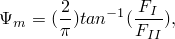

where  is the force/moment in the first component specified for the plasticity potential and 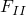 is the force/moment in the second component specified for the same potential. 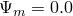 if 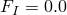,  if 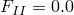, and  is somewhere in between 1.0 and 1.0 if neither is 0.0.

### Defining the plastic hardening behavior

Abaqus provides a number of hardening models varying from simple perfect plasticity to nonlinear isotropic/kinematic hardening. Connector hardening is analogous to the hardening models used in Abaqus for metals subjected to cyclic loading and described in ["Models for metals subjected to cyclic loading," Section 23.2.2](pt05ch23s02abm18.md).

#### Defining perfect plasticity

Perfect plasticity means that the yield force does not change with plastic relative motion.

| **Input File Usage: ** | Use the following option to define perfect plasticity: |
| --- | --- |
|  | ``` [*CONNECTOR HARDENING](../key/key-link.md#usb-kws-mconnectorhardening)  ``` |

| **Abaqus/CAE Usage: ** | Interaction module: connector section editor: ****Add****Plasticity****: **Specify isotropic hardening**, **Isotropic Hardening**, and enter the **Yield Force/Moment** in the data table |
| --- | --- |

#### Defining nonlinear isotropic hardening

Isotropic hardening behavior defines the evolution of the yield surface size, , as a function of the equivalent plastic relative motion, . This evolution can be introduced by specifying  directly as a function of  in tabular form or by using the simple exponential law


where 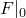 is the yield value at zero plastic relative motion and 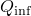 and *b* are material parameters.  is the maximum change in the size of the yield surface, and *b* defines the rate at which the size of the yield surface changes as plastic deformation develops. When the equivalent force defining the size of the yield surface remains constant (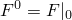), there is no isotropic hardening.

##### Defining the isotropic hardening component by specifying tabular data

Isotropic hardening can be introduced by specifying the equivalent force defining the size of the yield surface, , as a tabular function of the equivalent relative plastic motion, , and, if required, of the equivalent relative plastic motion rate, , temperature, and/or other predefined field variables. The yield value at a given state is simply interpolated from this table of data.

| **Input File Usage: ** | ``` [*CONNECTOR HARDENING](../key/key-link.md#usb-kws-mconnectorhardening), TYPE=ISOTROPIC, DEFINITION=TABULAR (default) ``` |
| --- | --- |

| **Abaqus/CAE Usage: ** | Interaction module: connector section editor: ****Add****Plasticity****: **Specify isotropic hardening**, **Isotropic Hardening**, **Definition: Tabular** |
| --- | --- |

##### Defining the isotropic hardening component using the exponential law

Specify the material parameters of the exponential law (, , and *b*) directly if they are already calibrated from test data. These parameters can be specified as functions of temperature and/or field variables.

| **Input File Usage: ** | ``` [*CONNECTOR HARDENING](../key/key-link.md#usb-kws-mconnectorhardening), TYPE=ISOTROPIC, DEFINITION=EXPONENTIAL LAW ``` |
| --- | --- |

| **Abaqus/CAE Usage: ** | Interaction module: connector section editor: ****Add****Plasticity****: **Specify isotropic hardening**, **Isotropic Hardening**, **Definition: Exponential law** |
| --- | --- |

#### Defining nonlinear kinematic hardening

When nonlinear kinematic hardening is specified, the center of the yield surface is allowed to translate in the force space. The backforce, , is the current center of the yield surface and is interpreted similar to the backstress 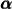 discussed in ["Classical metal plasticity," Section 23.2.1](pt05ch23s02abm17.md).

The yield surface is defined by the function 

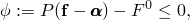

where  is the yield value and  is the potential with respect to the backforce .

The kinematic hardening component is defined to be an additive combination of a purely kinematic term (the linear Ziegler hardening law) and a relaxation term (the recall term) that introduces the nonlinearity. When temperature and field variable dependencies are omitted, the hardening law is 

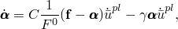

where *C* and  are material parameters that must be calibrated from cyclic test data. *C* is the initial kinematic hardening modulus, and  determines the rate at which the kinematic hardening modulus decreases with increasing plastic deformation. When *C* and  are zero, the model reduces to an isotropic hardening model. When  is zero, the linear Ziegler hardening law is recovered. Refer to ["Models for metals subjected to cyclic loading," Section 23.2.2](pt05ch23s02abm18.md), for a discussion of calibrating the material parameters.

##### Defining the kinematic hardening component by specifying half-cycle test data

If limited test data are available, *C* and  can be based on the force-constitutive motion data obtained from the first half cycle of a unidirectional tension or compression experiment. An example of such test data is shown in [Figure 31.2.6--2](pt06ch31s02alm32.md#usb-elm-econnect-half-cycle). 

**Figure 31.2.6–2** Half-cycle of force-motion data.

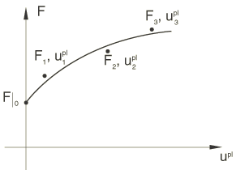

This approach is usually adequate when the simulation will involve only a few cycles of loading.

For each data point (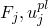) a value of  is obtained from the test data as 


where 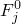 is the user-defined size of the yield surface at the corresponding plastic motion for the isotropic hardening definition or the initial yield force if the isotropic hardening component is not defined.

Integration of the backforce evolution law over a half cycle yields the expression 

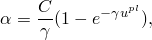

which is used for calibrating *C* and .

When test data are given as functions of temperature and/or field variables, it is recommended that a data check analysis be run first. During the data check run, Abaqus will determine several pairs of material parameters (*C*, ), where each pair will correspond to a given combination of temperature and/or field variables. Since Abaqus requires the parameter  to be a constant, the data check analysis will terminate with an error message if  is not a constant. However, an appropriate constant value of  may be determined from the information provided in the data file during the data check run. The values for the parameter *C* and the constant  can then be entered directly as described below.

| **Input File Usage: ** | ``` [*CONNECTOR HARDENING](../key/key-link.md#usb-kws-mconnectorhardening), TYPE=KINEMATIC, DEFINITION=HALF CYCLE (default) ``` |
| --- | --- |

| **Abaqus/CAE Usage: ** | Interaction module: connector section editor: ****Add****Plasticity****: **Specify kinematic hardening**, **Kinematic Hardening**, **Definition: Half-cycle** |
| --- | --- |

##### Defining the kinematic hardening component by specifying test data from a stabilized cycle

Force-constitutive motion data can be obtained from the stabilized cycle of a specimen that is subjected to symmetric cycles. A stabilized cycle is obtained by cycling the specimen over a fixed motion range  until a steady-state condition is reached; that is, until the force-motion curve no longer changes shape from one cycle to the next. Such a stabilized cycle is shown in [Figure 31.2.6--3](pt06ch31s02alm32.md#usb-elm-econnect-stable-cycle). 

**Figure 31.2.6–3** Force-motion data for a stabilized cycle.


See ["Models for metals subjected to cyclic loading," Section 23.2.2](pt05ch23s02abm18.md), for information on how the data should be processed before they are specified in the connector hardening definition.

| **Input File Usage: ** | ``` [*CONNECTOR HARDENING](../key/key-link.md#usb-kws-mconnectorhardening), TYPE=KINEMATIC, DEFINITION=STABILIZED ``` |
| --- | --- |

| **Abaqus/CAE Usage: ** | Interaction module: connector section editor: ****Add****Plasticity****: **Specify kinematic hardening**, **Kinematic Hardening**, **Definition: Stabilized** |
| --- | --- |

##### Defining the kinematic hardening component by specifying the material parameters directly

The parameters *C* and  can be specified directly if they are already calibrated from test data. The parameter *C* can be provided as a function of temperature and/or field variables, but temperature and field variable dependence of  is not available. The algorithm currently used to integrate the nonlinear isotropic/kinematic hardening model does not provide accurate solutions if the value of  changes significantly in an increment due to temperature and/or field variable dependence.

| **Input File Usage: ** | ``` [*CONNECTOR HARDENING](../key/key-link.md#usb-kws-mconnectorhardening), TYPE=KINEMATIC, DEFINITION=PARAMETERS ``` |
| --- | --- |

| **Abaqus/CAE Usage: ** | Interaction module: connector section editor: ****Add****Plasticity****: **Specify kinematic hardening**, **Kinematic Hardening**, **Definition: Parameters** |
| --- | --- |

#### Defining nonlinear isotropic/kinematic hardening

The evolution law of the combined isotropic/kinematic model consists of two components: an isotropic hardening component, which describes the change in the equivalent force defining the size of the yield surface, , as a function of plastic relative motion, and a nonlinear kinematic hardening component, which describes the translation of the yield surface in force space through the backforce, .

At most two connector hardening definitions, one isotropic and one kinematic, can be associated with a connector plasticity definition. If only one connector hardening definition is specified, it can be either isotropic or kinematic.

| **Input File Usage: ** | Use the following two options to define nonlinear isotropic/kinematic hardening: |
| --- | --- |
|  | ``` [*CONNECTOR HARDENING](../key/key-link.md#usb-kws-mconnectorhardening), TYPE=KINEMATIC [*CONNECTOR HARDENING](../key/key-link.md#usb-kws-mconnectorhardening), TYPE=ISOTROPIC ``` |

| **Abaqus/CAE Usage: ** | Interaction module: connector section editor: ****Add****Plasticity****: **Specify isotropic hardening** and **Specify kinematic hardening** |
| --- | --- |

### Using multiple plasticity definitions

Multiple connector plasticity definitions can be used as part of the same connector behavior definition. However, only one connector plasticity definition can be used to define plasticity for each available component of relative motion. At most one coupled plasticity definition can be associated with a connector behavior definition. Additional connector plasticity definitions are permitted for the same connector behavior definition only if the two spaces do not overlap; for example, you could define uncoupled connector plasticity for components 1, 2, and 6 and have one coupled connector plasticity definition involving components 3, 4, and 5.

Each connector plasticity definition must have its own hardening definition.

### Examples

Illustrations of uncoupled and coupled plasticity behaviors are shown in the following examples.

#### Uncoupled plasticity in a SLOT-like connector

Consider a SLOT connector that you have used to model a physical device efficiently. You have examined the reaction forces enforcing the SLOT constraint in the local 2- and 3-directions; since they appear to be quite large, you need to assess whether plastic deformations in the device may occur. One option that you have is to create detailed meshes for the slot and the pin in the device, define the contact interactions between them, and use elastic-plastic material definitions for the underlying materials. While this is the most accurate modeling solution, it may be impractical, especially when the device you are modeling is part of a larger model. Alternatively, you can do the following:
- use a CARTESIAN connection type instead of the SLOT connection with the first axis aligned with the slot direction;
- define components 2 and 3 as rigid; and
- define rigid plasticity separately in each of the components.

The following input can be used:

```
[*CONNECTOR SECTION](../key/key-link.md#usb-kws-mconnectorsection), BEHAVIOR=slot
CARTESIAN
 orientation at node a
[*CONNECTOR BEHAVIOR](../key/key-link.md#usb-kws-mconnectorbehavior), NAME=slot
[*CONNECTOR ELASTICITY](../key/key-link.md#usb-kws-mconnectorelasticity), RIGID
 2, 3
[*CONNECTOR PLASTICITY](../key/key-link.md#usb-kws-mconnectorplasticity), COMPONENT=2
[*CONNECTOR HARDENING](../key/key-link.md#usb-kws-mconnectorhardening), TYPE=ISOTROPIC
 100, 0.0
 110, 0.12
[*CONNECTOR PLASTICITY](../key/key-link.md#usb-kws-mconnectorplasticity), COMPONENT=3
[*CONNECTOR HARDENING](../key/key-link.md#usb-kws-mconnectorhardening), TYPE=ISOTROPIC
 50, 0.0
 75, 0.23
```
The yield forces that you specify in the connector hardening definitions are obtained from an experimental result or are assessed from a “virtual experiment,” as follows:- Use the meshed model of the slot discussed above.
- Run two simple separate analyses by constraining the slot part of the device and driving the pin into the slot walls using a boundary condition.
- Plot the reaction force at the pin node against its motion.
- Use these data to create the force-motion hardening curve to be specified in the connector hardening definition.

#### Coupled plasticity in a spot weld

Referring to the spot weld shown in [Figure 31.2.6--4](pt06ch31s02alm32.md#usb-elm-econnect-weldexample-plast) and to the yield function described in ["Defining connector potentials" in "Connector functions for coupled behavior," Section 31.2.4](pt06ch31s02alm30.md#usb-elm-econnectbehav-potential),


you could complete the plasticity definition, for example, by specifying tabular isotropic hardening and kinematic hardening via parameters.

**Figure 31.2.6–4** Spot weld connection.


```
[*PARAMETER](../key/key-link.md#usb-kws-mparameter)
=0.02
=0.05
[*CONNECTOR ELASTICITY](../key/key-link.md#usb-kws-mconnectorelasticity), RIGID
[*CONNECTOR PLASTICITY](../key/key-link.md#usb-kws-mconnectorplasticity)
[*CONNECTOR POTENTIAL](../key/key-link.md#usb-kws-mconnectorpotential), EXPONENT=a
normal, , , MACAULEY
shear, , , ABS
[*CONNECTOR HARDENING](../key/key-link.md#usb-kws-mconnectorhardening), TYPE=ISOTROPIC
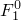, 
, 
[*CONNECTOR HARDENING](../key/key-link.md#usb-kws-mconnectorhardening), TYPE=KINEMATIC, DEFINITION=PARAMETERS
*C*, 
```

### Defining plastic connector behavior in linear perturbation procedures

Plastic relative motions are not allowed during linear perturbation analyses. Therefore, the connector relative motions will be linear elastic perturbations about the plastically deformed base state, similar to metal plasticity.

### Output

The Abaqus output variables available for connectors are listed in ["Abaqus/Standard output variable identifiers," Section 4.2.1](pt02ch04s02abv01.md), and ["Abaqus/Explicit output variable identifiers," Section 4.2.2](pt02ch04s02xbv01.md). The following output variables are of particular interest when defining plasticity in connectors:

| CUE | Connector elastic displacements/rotations. |
| --- | --- |

| CUP | Connector plastic displacements/rotations. |
| --- | --- |

| CUPEQ | Connector equivalent plastic relative displacements/rotations. In addition to the usual six components associated with connector output variables, CUPEQ includes the scalar CUPEQC, which is the equivalent plastic relative motion associated with a coupled plasticity definition. |
| --- | --- |

| CALPHAF | Connector kinematic hardening shift forces/moments. |
| --- | --- |


