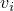

# 31.2.9 Connector failure behavior


**Products: **Abaqus/Standard  Abaqus/Explicit  Abaqus/CAE  

##### **References**

- ["Connectors: overview," Section 31.1.1](pt06ch31s01abo28.md)
- ["Connector behavior," Section 31.2.1](pt06ch31s02alm27.md)
- [*CONNECTOR BEHAVIOR](../key/key-link.md#usb-kws-mconnectorbehavior)
- [*CONNECTOR FAILURE](../key/key-link.md#usb-kws-mconnectorfailure)
- ["Defining failure," Section 15.17.11 of the Abaqus/CAE User's Guide](../usi/usi-link.md#usi-itn-help-failure)

### Overview

Connector failure behavior: 
- can be defined in any connector with available components of relative motion in Abaqus/Standard;
- can be defined in any connector in Abaqus/Explicit;
- can be used in Abaqus/Standard to fail all or specified components of relative motion if a failure criterion is met;
- can be used in Abaqus/Explicit to fail all or specified components if a failure criterion is met;
- can be triggered if either a connector relative motion or connector force in a specified component is outside a specified range; and
- can be replaced in most cases by the more sophisticated connector damage initiation/evolution behavior (see ["Connector damage behavior," Section 31.2.7](pt06ch31s02alm33.md)).

### Defining connector failure behavior

A typical connector might have pieces that break if a relative motion component, force, or moment becomes too large. Abaqus provides a way to define which components of relative motion will break and the criteria used to release these components. You can select the component of relative motion on which the failure criterion is based.

In Abaqus/Standard connector failure can be used to specify connector behavior based on available components of relative motion. In Abaqus/Explicit connector failure can be used to specify connector behavior based on constrained as well as available components of relative motion. Limit values for force or moment can be specified for all components of relative motion involved in the connection. In addition, for connectors with available components of relative motion, limit values can be specified for the relative positions corresponding to an available component.

In Abaqus/Standard if the failure criterion specified for the selected component of relative motion is met, either all components of relative motion fail or a single available component fails. By default, all components of relative motion are released upon meeting the failure criterion. The nodal force contributions for all released components from the connector element will be removed during the increment when the failure criterion is met.

In Abaqus/Explicit if the failure criterion specified for the selected component is met, either all components or a single available component fails. By default, all components are released upon meeting the failure criterion. The nodal force contributions for all released components from the connector element will be removed during the increment when the failure criterion is met.

| **Input File Usage: ** | Use the following options to define connector failure: |
| --- | --- |
|  | ``` [*CONNECTOR BEHAVIOR](../key/key-link.md#usb-kws-mconnectorbehavior), NAME=*name* [*CONNECTOR FAILURE](../key/key-link.md#usb-kws-mconnectorfailure), COMPONENT=*component number*, RELEASE=ALL or *component number* ``` |

| **Abaqus/CAE Usage: ** | Interaction module: connector section editor: ****Add****Failure****: **Components:** *component or components*, **Release: All** or **Specify** *component* |
| --- | --- |

#### Viscous damping in Abaqus/Standard

In Abaqus/Standard the sudden release of the failed connection may lead to convergence problems. To avoid convergence problems, you can add viscous damping to the components. Damping forces in the component are calculated as , where  is the user-defined damping coefficient and  is the velocity of the failed component. Viscous damping is applied only if a selected available component of relative motion is released.

| **Input File Usage: ** | Use the following options to add viscous damping to failed components in Abaqus/Standard: |
| --- | --- |
|  | ``` [*SECTION CONTROLS](../key/key-link.md#usb-kws-msectioncontrols), NAME=*name*, VISCOSITY= [*CONNECTOR SECTION](../key/key-link.md#usb-kws-mconnectorsection), CONTROLS=*name* ``` |

| **Abaqus/CAE Usage: ** | Viscous regularization is not supported in Abaqus/CAE. |
| --- | --- |

### Example

In the example in [Figure 31.2.9--1](pt06ch31s02alm35.md#econnectorbehavior-shock-fail) assume that the shock absorber pulls apart if the tensile force in the shock exceeds 800.0 units of force.

**Figure 31.2.9–1** Simplified connector model of a shock absorber.


```
*...*
[*CONNECTOR BEHAVIOR](../key/key-link.md#usb-kws-mconnectorbehavior), NAME=sbehavior
[*CONNECTOR FAILURE](../key/key-link.md#usb-kws-mconnectorfailure), COMPONENT=1, RELEASE=ALL
, , , 800.0
```

### Output

The Abaqus output variables available for connectors are listed in ["Abaqus/Standard output variable identifiers," Section 4.2.1](pt02ch04s02abv01.md), and ["Abaqus/Explicit output variable identifiers," Section 4.2.2](pt02ch04s02xbv01.md). The following output variables are of particular interest when defining failure in connectors:

| CFAILST | Flags for connector failure status. |
| --- | --- |

| ALLVD | Energy dissipated by viscous damping added to failed components. |
| --- | --- |

At any given time and for a particular component of relative motion *i*, the output variable CFAILST*i* is 1 if the connector fails in that particular component of relative motion (failure criteria are met).

If the failure criteria are not met at a given time for a particular component *i*, the output variable CFAILST*i* is 0.


