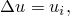
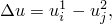
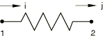
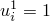
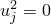
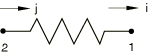
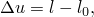
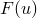
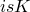

# 32.1.1 Springs


**Products: **Abaqus/Standard  Abaqus/Explicit  Abaqus/CAE  

##### **References**

- ["Spring element library," Section 32.1.2](pt06ch32s01ael26.md)
- [*SPRING](../key/key-link.md#usb-kws-mspring)
- ["Defining springs and dashpots," Section 37.1 of the Abaqus/CAE User's Guide](../usi/usi-link.md#usi-eng-springs-overview)

### Overview

Spring elements: 
- can couple a force with a relative displacement;
- in Abaqus/Standard can couple a moment with a relative rotation;
- can be linear or nonlinear;
- if linear, can be dependent on frequency in direct-solution steady-state dynamic analysis;
- can be dependent on temperature and field variables; and
- can be used to assign a structural damping factor to form the imaginary part of spring stiffness.

The terms “force” and “displacement” are used throughout the description of spring elements. When the spring is associated with displacement degrees of freedom, these variables are the force and relative displacement in the spring. If the springs are associated with rotational degrees of freedom, they are torsional springs; these variables will then be the moment transmitted by the spring and the relative rotation across the spring.

Viscoelastic spring behavior can be modeled in Abaqus/Standard by combining frequency-dependent springs and frequency-dependent dashpots.

### Typical applications

Spring elements are used to model actual physical springs as well as idealizations of axial or torsional components. They can also model restraints to prevent rigid body motion.

They are also used to represent structural dampers by specifying structural damping factors to form the imaginary part of the spring stiffness.

### Choosing an appropriate element

SPRING1 and SPRING2 elements are available only in Abaqus/Standard. SPRING1 is between a node and ground, acting in a fixed direction. SPRING2 is between two nodes, acting in a fixed direction.

The SPRINGA element is available in both Abaqus/Standard and Abaqus/Explicit. SPRINGA acts between two nodes, with its line of action being the line joining the two nodes, so that this line of action can rotate in large-displacement analysis.

The spring behavior can be linear or nonlinear in any of the spring elements in Abaqus.

Element types SPRING1 and SPRING2 can be associated with displacement or rotational degrees of freedom (in the latter case, as torsional springs). However, the use of torsional springs in large-displacement analysis requires careful consideration of the definition of total rotation at a node; therefore, connector elements (["Connectors: overview," Section 31.1.1](pt06ch31s01abo28.md)) are usually a better approach to providing torsional springs for large-displacement cases.

| **Input File Usage: ** | Use the following option to specify a spring element between a node and ground, acting in a fixed direction: |
| --- | --- |
|  | ``` [*ELEMENT](../key/key-link.md#usb-kws-melement), TYPE=SPRING1 ``` Use the following option to specify a spring element between two nodes, acting in a fixed direction: ``` [*ELEMENT](../key/key-link.md#usb-kws-melement), TYPE=SPRING2 ``` Use the following option to specify a spring element between two nodes with its line of action being the line joining the two nodes: ``` [*ELEMENT](../key/key-link.md#usb-kws-melement), TYPE=SPRINGA ``` |

| **Abaqus/CAE Usage: ** | Property or Interaction module: ****Special****Springs/Dashpots****Create****, then select one of the following:**Connect points to ground**: select points: toggle on **Spring stiffness**(*equivalent to SPRING1*)**Connect two points**: select points: **Axis**: **Specify fixed direction**: toggle on **Spring stiffness**(*equivalent to SPRING2*)**Connect two points**: select points: **Axis**: **Follow line of action**: toggle on **Spring stiffness **(*equivalent to SPRINGA*) |
| --- | --- |

### Stability considerations in Abaqus/Explicit

A SPRINGA element introduces a stiffness between two degrees of freedom without introducing an associated mass. In an explicit dynamic procedure this represents an unconditionally unstable element. The nodes to which the spring is attached must have some mass contribution from adjacent elements;  if this condition is not satisfied, Abaqus/Explicit will issue an error message. If the spring is not too stiff (relative to the stiffness of the adjacent elements), the stable time increment determined by the explicit dynamics procedure (["Explicit dynamic analysis," Section 6.3.3](pt03ch06s03at08.md)) will suffice to ensure stability of the calculations.

Abaqus/Explicit does not use the springs in the determination of the stable time increment. During the data check phase of the analysis, Abaqus/Explicit computes the minimum of the stable time increment for all the elements in the mesh except the spring elements. The program then uses this minimum stable time increment and the stiffness of each of the springs to determine the mass required for each spring to give the same stable time increment. If this mass is too large compared to the mass of the model, Abaqus/Explicit will issue an error message that the spring is too stiff compared to the model definition.

### Relative displacement definition

The relative displacement definition depends on the element type.

#### SPRING1 elements

The relative displacement across a SPRING1 element is the *i*th component of displacement of the spring's node: 



where *i* is defined as described below and can be in a local direction (see ["Defining the direction of action for SPRING1 and SPRING2 elements](pt06ch32s01alm37.md#usb-elm-espring-orient)”).

#### SPRING2 elements

The relative displacement across a SPRING2 element is the difference between the *i*th component of displacement of the spring's first node and the *j*th component of displacement of the spring's second node: 



where *i* and *j* are defined as described below and can be in local directions (see ["Defining the direction of action for SPRING1 and SPRING2 elements](pt06ch32s01alm37.md#usb-elm-espring-orient)”).

It is important to understand how the SPRING2 element will behave according to the above relative displacement equation since the element can produce counterintuitive results. For example, a SPRING2 element set up in the following way will be a “compressive” spring:



If the nodes displace so that  and , the spring appears to be in compression, while the force in the SPRING2 element is positive. To obtain a “tensile” spring, the SPRING2 element should be set up in the following way:



#### SPRINGA elements

For geometrically linear analysis the relative displacement is measured along the direction of the SPRINGA element in the reference configuration:


where  is the reference position of the first node of the spring and  is the reference position of its second node.

For geometrically nonlinear analysis the relative displacement across a SPRINGA element is the change in length in the spring between the initial and the current configuration: 



where  is the current length of the spring and  is the value of *l* in the initial configuration. Here  and  are the current positions of the nodes of the spring.

In either case the force in a SPRINGA element is positive in tension.

### Defining spring behavior

The spring behavior can be linear or nonlinear. In either case you must associate the spring behavior with a region of your model.

| **Input File Usage: ** | ``` [*SPRING](../key/key-link.md#usb-kws-mspring), ELSET=*name* ``` |
| --- | --- |
|  | where the ELSET parameter refers to a set of spring elements. |

| **Abaqus/CAE Usage: ** | Property or Interaction module: ****Special****Springs/Dashpots****Create****: select connectivity type: select points |
| --- | --- |

#### Defining linear spring behavior

You define linear spring behavior by specifying a constant spring stiffness (force per relative displacement).

The spring stiffness can depend on temperature and field variables. See ["Input syntax rules," Section 1.2.1](pt01ch01s02aus01.md), for further information about defining data as functions of temperature and independent field variables.

For direct-solution steady-state dynamic analysis the spring stiffness can depend on frequency, as well as on temperature and field variables. If a frequency-dependent spring stiffness is specified for any other analysis procedure in Abaqus/Standard, the data for the lowest frequency given will be used.

| **Input File Usage: ** | ``` [*SPRING](../key/key-link.md#usb-kws-mspring), DEPENDENCIES=*n* *first data line* *spring stiffness*, *frequency*, *temperature*, *field variable 1*, etc. ... ``` |
| --- | --- |

| **Abaqus/CAE Usage: ** | Property or Interaction module: ****Special****Springs/Dashpots****Create****: select connectivity type: select points: **Property**: **Spring stiffness**: *spring stiffness* |
| --- | --- |
|  | Defining the spring stiffness as a function of frequency, temperature, and field variables is not supported in Abaqus/CAE when you define springs as engineering features; instead, you can define connectors that have spring-like elastic behavior (see ["Connector elastic behavior," Section 31.2.2](pt06ch31s02alm28.md)). |

#### Defining nonlinear spring behavior

You define nonlinear spring behavior by giving pairs of force–relative displacement values. These values should be given in ascending order of relative displacement and should be provided over a sufficiently wide range of relative displacement values so that the behavior is defined correctly. Abaqus assumes that the force remains constant (which results in zero stiffness) outside the range given (see [Figure 32.1.1--1](pt06ch32s01alm37.md#espring-nonlinear-usb-elm-espring)).

**Figure 32.1.1–1** Nonlinear spring force–relative displacement relationship.


Initial forces in nonlinear springs should be defined as part of the  relationship by giving a nonzero force, , at zero relative displacement.

The spring stiffness can depend on temperature and field variables. See ["Input syntax rules," Section 1.2.1](pt01ch01s02aus01.md), for further information about defining data as functions of temperature and independent field variables.

Abaqus/Explicit will regularize the data into tables that are defined in terms of even intervals of the independent variables. In some cases where the force is defined at uneven intervals of the independent variable (relative displacement) and the range of the independent variable is large compared to the smallest interval, Abaqus/Explicit may fail to obtain an accurate regularization of your data in a reasonable number of intervals. In this case the program will stop after all data are processed with an error message that you must redefine the material data. See ["Material data definition," Section 21.1.2](pt05ch21s01aus109.md), for a more detailed discussion of data regularization.

| **Input File Usage: ** | ``` [*SPRING](../key/key-link.md#usb-kws-mspring), NONLINEAR, DEPENDENCIES=*n* *first data line* *force*, *relative displacement*, *temperature*, *field variable 1*, etc. ... ``` |
| --- | --- |

| **Abaqus/CAE Usage: ** | Defining nonlinear spring behavior is not supported in Abaqus/CAE when you define springs as engineering features; instead, you can define connectors that have spring-like elastic behavior (see ["Connector elastic behavior," Section 31.2.2](pt06ch31s02alm28.md)). |
| --- | --- |

### Defining the direction of action for SPRING1 and SPRING2 elements

You define the direction of action for SPRING1 and SPRING2 elements by giving the degree of freedom at each node of the element. This degree of freedom may be in a local coordinate system (["Orientations," Section 2.2.5](pt01ch02s02aus15.md)). The local system is assumed to be fixed: even in large-displacement analysis SPRING1 and SPRING2 elements act in a fixed direction throughout the analysis.

| **Input File Usage: ** | ``` [*SPRING](../key/key-link.md#usb-kws-mspring), ORIENTATION=*name* *dof at node 1*, *dof at node 2* ``` |
| --- | --- |

| **Abaqus/CAE Usage: ** | Property or Interaction module: ****Special****Springs/Dashpots****Create****, then select one of the following:**Connect points to ground**: select points: **Orientation**: **Edit**: select orientation**Connect two points**: select points: **Axis**: **Specify fixed direction**: **Orientation**: **Edit**: select orientation |
| --- | --- |

### Defining linear spring behavior with complex stiffness

Springs can be used to simulate structural dampers that contribute to the imaginary part of the element stiffness forming an elemental structural damping matrix. You specify both the real part of the spring stiffness for particular degrees of freedom and the structural damping factor, *s*. The imaginary part of the spring stiffness is calculated as  and represents structural damping. These data can be frequency dependent.

| **Input File Usage: ** | ``` [*SPRING](../key/key-link.md#usb-kws-mspring), COMPLEX STIFFNESS *first data line* *real spring stiffness*, *structural damping factor*, *frequency* ``` |
| --- | --- |

| **Abaqus/CAE Usage: ** | Linear spring behavior with complex stiffness is not supported in Abaqus/CAE. |
| --- | --- |


