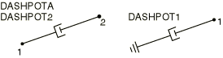

# 32.2.2 Dashpot element library

**Products: **Abaqus/Standard  Abaqus/Explicit  Abaqus/CAE  

##### **References**

- ["Dashpots," Section 32.2.1](pt06ch32s02alm38.md)
- [*DASHPOT](../key/key-link.md#usb-kws-mdashpot)

### Overview

This section provides a reference to the dashpot elements available in Abaqus/Standard and Abaqus/Explicit.

### Element types

| DASHPOTA | Axial dashpot between two nodes, whose line of action is the line joining the two nodes |
| --- | --- |
|  |

| DASHPOT1(S) | Dashpot between a node and ground, acting in a fixed direction |
| --- | --- |
|  |

| DASHPOT2(S) | Dashpot between two nodes, acting in a fixed direction |
| --- | --- |
|  |

##### Active degrees of freedom

DASHPOTA: 1, 2, 3. The translational degree of freedom in the 3-direction is not activated in an Abaqus/Standard analysis if both nodes of the element are connected to two-dimensional entities such as two-dimensional analytical rigid surfaces, two-dimensional beam elements, etc. 

DASHPOT1 or DASHPOT2: 1, 2, 3, 4, 5, or 6. If you specify a local orientation for the dashpot, these are local degrees of freedom. Otherwise, these are global degrees of freedom.

##### Additional solution variables

None.

### Nodal coordinates required

DASHPOTA: *X*, *Y*, *Z*. These coordinates are used in the calculation of the action of the element.

DASHPOT1 or DASHPOT2: None. The element nodes do not need to have coordinates defined since the action associated with these elements is defined by specifying the degrees of freedom involved. 

### Element property definition

| **Input File Usage: ** | [*DASHPOT](../key/key-link.md#usb-kws-mdashpot) |
| --- | --- |

| **Abaqus/CAE Usage: ** | Property or Interaction module: ****Special****Springs/Dashpots****Create**** |
| --- | --- |

### Element-based loading

None.

### Element output

| S11 | The force in the dashpot. |
| --- | --- |

| E11 | The relative displacement across the dashpot. |
| --- | --- |

| ER11 | The relative velocity across the dashpot (available only from Abaqus/Standard). |
| --- | --- |

### Node ordering on elements

