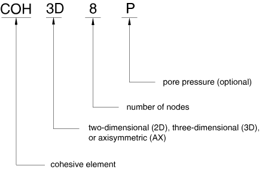

# 32.5.2 Choosing a cohesive element

**Products: **Abaqus/Standard  Abaqus/Explicit  

##### **References**

- ["Cohesive elements: overview," Section 32.5.1](pt06ch32s05abo29.md)
- ["Two-dimensional cohesive element library," Section 32.5.8](pt06ch32s05ael30.md)
- ["Three-dimensional cohesive element library," Section 32.5.9](pt06ch32s05ael31.md)
- ["Axisymmetric cohesive element library," Section 32.5.10](pt06ch32s05ael32.md)

### Overview

The Abaqus cohesive element library includes:
- elements for two-dimensional analyses;
- elements for three-dimensional analyses; and
- elements for axisymmetric analyses.

### Naming convention

The cohesive elements used in Abaqus are named as follows: 

For example, COH2D4 is a 4-node, two-dimensional cohesive element.   

