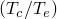

# 32.5.3 Modeling with cohesive elements


**Products: **Abaqus/Standard  Abaqus/Explicit  Abaqus/CAE  

##### **References**

- ["Cohesive elements: overview," Section 32.5.1](pt06ch32s05abo29.md)
- ["Choosing a cohesive element," Section 32.5.2](pt06ch32s05alm41.md)
- [*COHESIVE SECTION](../key/key-link.md#usb-kws-mcohesivesection)
- [Chapter 21, "Adhesive joints and bonded interfaces," of the Abaqus/CAE User's Guide](../usi/usi-link.md#usi-adv-cohesive)

### Overview

Cohesive elements:
- are used to model adhesives between two components, each of which may be deformable or rigid;
- are used to model interfacial debonding using a cohesive zone framework;
- are used to model gaskets and/or small adhesive patches;
- can be connected to the adjacent components by sharing nodes, by using mesh tie constraints, or by using MPCs type TIE or PIN; and
- may interact with other components via contact for gasket applications.

This section discusses the techniques that are available to discretize cohesive zones and assemble them in a model representing several components that are bonded to one another. It also discusses several common modeling issues related to cohesive elements.

### Discretizing cohesive zones using cohesive elements

The cohesive zone must be discretized with a single layer of cohesive elements  through the thickness. If the cohesive zone represents an adhesive material with a finite thickness, the continuum macroscopic properties of this material can be used directly for modeling the constitutive response of the cohesive zone. Alternatively, if the cohesive zone represents an infinitesimally thin layer of adhesive at a bonded interface, it may be more relevant to define the response of the interface directly in terms of the traction at the interface versus the relative motion across the interface. Finally, if the cohesive zone represents a small adhesive patch or a gasket with no lateral constraint, a uniaxial stress state provides a good approximation to the state of these elements. Abaqus provides modeling capabilities for all the above cases. The details are discussed in later sections.

### Connecting cohesive elements to other components

At least one of either the top or the bottom face of the cohesive element must be constrained to another component. In most applications it is appropriate to have both faces of the cohesive elements tied to neighboring components. If only one face of the cohesive element is constrained and the other face is free, the cohesive element exhibits one or (for three-dimensional elements) more singular modes of deformation due to the lack of membrane stiffness. The singular modes can propagate from one cohesive element to the adjacent one but can be suppressed by constraining the nodes on the side face at the end of a series of cohesive elements.

In some cases it may be convenient and appropriate to have cohesive elements share nodes with the elements on the surfaces of the adjacent components. More generally, when the mesh in the cohesive zone is not matched to the mesh of the adjacent components, cohesive elements can be tied to other components. When cohesive elements are used to model gaskets, it may be more appropriate to tie or share nodes on one side and define contact on the other side as discussed below. This will prevent the gaskets from being subjected to tensile stresses.

#### Having cohesive elements share nodes with other elements

When the cohesive elements and their neighboring parts have matched meshes, it is straightforward to connect cohesive elements to other components in a model simply by sharing nodes (see [Figure 32.5.3--1](pt06ch32s05alm42.md#ecohesive-share-node)). 

**Figure 32.5.3–1** Cohesive elements sharing nodes with other Abaqus elements.


When these elements are used as adhesives or to model debonding, this method can be used to obtain initial results from a model—more accurate local results (in the decohesion zone) would typically be obtained with the cohesive zone more refined than the elements of the surrounding components. When these elements are used to model gaskets, this approach is suitable in situations when no frictional slip occurs between the gaskets and the surrounding components. The method of sharing nodes in gasket applications will lead to tensile stresses in the gasket should the parts connected to the gasket be pulled apart. Defining contact on one side of the cohesive elements will avoid such tensile stresses.

#### Connecting cohesive elements to other components by using surface-based tie constraints

If the two neighboring parts do not have matched meshes, such as when the discretization level in the cohesive layer is different (typically finer) from the discretization level in the surrounding structures, the top and/or bottom surfaces of the cohesive layer can be tied to the surrounding structures using a tie constraint (["Mesh tie constraints," Section 35.3.1](pt08ch35s03aus132.md)). [Figure 32.5.3--2](pt06ch32s05alm42.md#ecohesive-tied) shows an example in which a finer discretization is used for the cohesive layer than for the neighboring parts.

**Figure 32.5.3–2** Independent meshes with tie constraints.


#### Contact interactions between cohesive elements and other components

For some applications involving gaskets it is appropriate to define contact on one side of the cohesive element (see [Figure 32.5.3--3](pt06ch32s05alm42.md#ecohesive-contact-tied)). 

**Figure 32.5.3–3** Contact interaction on one side of a cohesive zone.


Contact can be defined with either the general contact algorithm in Abaqus/Explicit (["Defining general contact interactions in Abaqus/Explicit," Section 36.4.1](pt09ch36s04aus155.md)) or the contact pair algorithm in Abaqus/Standard (["Defining contact pairs in Abaqus/Standard," Section 36.3.1](pt09ch36s03aus145.md)) or Abaqus/Explicit (["Defining contact pairs in Abaqus/Explicit," Section 36.5.1](pt09ch36s05aus160.md)). If pure master-slave contact is used, typically the surface of the cohesive elements should be the slave surface and the surface of the neighboring part should be the master surface. This choice of master and slave is based on the cohesive zone typically being composed of softer materials and having a finer discretization. The second consideration also suggests that mismatched meshes will often be used in analyses involving cohesive elements. If mismatched meshes are used, the pressure distribution on the cohesive elements may not be predicted accurately; submodeling (["Submodeling: overview," Section 10.2.1](pt04ch10s02aus60.md)) may be required to obtain accurate local results.

### Using cohesive elements in large-displacement analyses

Cohesive elements can be used in large-displacement analyses. The assembly containing the cohesive elements can undergo finite displacement as well as finite rotation.

### Selecting the broad class of the constitutive response of cohesive elements

As discussed earlier, cohesive elements can be used to model finite-thickness adhesives, negligibly thin adhesive layers for debonding applications, as well as gaskets and/or small adhesive patches. You must choose one of these broad classes of applications when you define the section properties of cohesive elements. The detailed implications of each choice are discussed in ["Defining the constitutive response of cohesive elements using a continuum approach," Section 32.5.5](pt06ch32s05alm44.md), and ["Defining the constitutive response of cohesive elements using a traction-separation description," Section 32.5.6](pt06ch32s05alm45.md).

| **Input File Usage: ** | Use the following option to model a finite-thickness adhesive layer using a continuum-based constitutive response: |
| --- | --- |
|  | ``` [*COHESIVE SECTION](../key/key-link.md#usb-kws-mcohesivesection), RESPONSE=CONTINUUM ``` Use the following option to model a negligibly (geometrically) thin layer of adhesive using a traction-separation-based response: ``` [*COHESIVE SECTION](../key/key-link.md#usb-kws-mcohesivesection), RESPONSE=TRACTION SEPARATION ``` Use the following option to use cohesive elements as gaskets and/or small adhesive patches: ``` [*COHESIVE SECTION](../key/key-link.md#usb-kws-mcohesivesection), RESPONSE=GASKET ``` |

| **Abaqus/CAE Usage: ** | Property module: **Create Section**: select **Other** as the section **Category** and **Cohesive** as the section **Type**: **Response**: **Continuum**, **Traction Separation**, or **Gasket** |
| --- | --- |

### Assigning a material behavior to a cohesive element

You assign the name of a material definition to a particular element set. The constitutive behavior for this element set is defined entirely by the constitutive thickness of the cohesive layer (discussed in ["Specifying the constitutive thickness" in "Defining the cohesive element's initial geometry," Section 32.5.4](pt06ch32s05alm43.md#usb-elm-ecohesiveinit-thickmag)) and the material properties referring to the same name.

The constitutive behavior of the cohesive elements can be defined either in terms of a material model provided in Abaqus or a user-defined material model (see ["User-defined mechanical material behavior," Section 26.7.1](pt05ch26s07abm69.md)). When cohesive elements are used in applications involving a finite-thickness adhesive, any available material model in Abaqus, including material models for progressive damage, can be used. For applications involving gasket and/or small finite-thickness adhesive patches, any material model that can be used with one-dimensional elements (such as beams, trusses, and rebars), including material models for progressive damage, can be used. For further details, see ["Defining the constitutive response of cohesive elements using a continuum approach," Section 32.5.5](pt06ch32s05alm44.md). For applications in which the behavior of cohesive elements is defined directly in terms of traction versus separation, the response can be defined only in terms of a linear elastic relation (between the traction and the separation) along with progressive damage (see ["Defining the constitutive response of cohesive elements using a traction-separation description," Section 32.5.6](pt06ch32s05alm45.md)).

To define the constitutive behavior of cohesive elements, you assign the name of a material model to a particular element set through the section definition. The actual material model for a user-defined material model is defined in user subroutine [`UMAT`](../sub/sub-link.md#sub-xsl-umat) in Abaqus/Standard or [`VUMAT`](../sub/sub-link.md#sub-xsl-vumat) in Abaqus/Explicit.

| **Input File Usage: ** | ``` [*COHESIVE SECTION](../key/key-link.md#usb-kws-mcohesivesection), ELSET=*name*, MATERIAL=*name* ``` |
| --- | --- |

| **Abaqus/CAE Usage: ** | Property module: cohesive section editor: **Material**: *name* |
| --- | --- |

### Using cohesive elements in coupled pore fluid diffusion/stress analyses

Cohesive elements with, or without, pore pressure degrees of freedom can be used in coupled pore fluid diffusion/stress analyses. Cohesive elements without pore pressure degrees of freedom will only contribute mechanically, and surfaces exposed when cohesive elements open will be impermeable to fluid flow.

Cohesive elements with pore pressure degrees of freedom provide a more general response, including the ability to model tangential flow and leakage flow from the gap into the adjacent material. These elements have additional pore pressure nodes in the gap interior, and you can choose to define these nodes explicitly or have them generated automatically by Abaqus/Standard.

In a typical use you will have these gap interior nodes generated for you for the majority of cohesive elements in the model. You invoke automatic node generation as discussed in ["By defining the bottom-face element connectivity and an integer offset" in "Defining the cohesive element's initial geometry," Section 32.5.4](pt06ch32s05alm43.md#usb-elm-ecohesiveinit-offset).

### Defining contact between surrounding components

Cohesive elements are used to bond two different components. Often the cohesive elements completely degrade in tension and/or shear as a result of the deformation. Subsequently, the components that are initially bonded together by cohesive elements may come into contact with each other. Approaches for modeling this kind of contact include the following:
- In certain situations this kind of contact can be handled by the cohesive element itself. By default, cohesive elements retain their resistance to compression even if their resistance to other deformation modes is completely degraded. As a result, the cohesive elements resist interpenetration of the surrounding components even after the cohesive element has completely degraded in tension and/or shear. This approach works best when the top and the bottom faces of the cohesive element do not displace tangentially by a significant amount relative to each other during the deformation. In other words, to model the situation described above, the deformation of the cohesive elements should be limited to "small sliding."
- Another possible approach is to define contact between the surfaces of the surrounding components that could potentially come into contact and to delete the cohesive elements once they are completely damaged. Thus, contact is modeled throughout the analysis. This approach is not recommended if the geometric thickness of the cohesive elements in the model is very small or zero (the geometric thickness of the cohesive elements may be different from the constitutive thickness you specify while defining the section properties of the cohesive elements---see ["Specifying the constitutive thickness" in "Defining the cohesive element's initial geometry," Section 32.5.4](pt06ch32s05alm43.md#usb-elm-ecohesiveinit-thickmag)) because contact will effectively cause nonphysical resistance to compression of the cohesive layer while the cohesive elements are still active. If frictional contact is modeled, there may also be nonphysical shearing forces. This is the behavior that will occur by default with the general contact algorithm in Abaqus/Explicit. [Figure 32.5.3--4](pt06ch32s05alm42.md#ecohesive-gencontact1), [Figure 32.5.3--5](pt06ch32s05alm42.md#ecohesive-gencontact2), and [Figure 32.5.3--6](pt06ch32s05alm42.md#ecohesive-gencontact3) show the default surface for general contact. This surface: - is insensitive to whether the cohesive elements and neighboring elements share nodes, are tied together, or are not connected; and - does not include faces of cohesive elements. **Figure 32.5.3--4** Default surface when cohesive elements share nodes with surrounding elements.  **Figure 32.5.3--5** Default surface when cohesive elements are tied to the surrounding elements.  **Figure 32.5.3--6** Default surface when cohesive elements are tied on one side and interact through contact on the other side.  [Figure 32.5.3--7](pt06ch32s05alm42.md#ecohesive-gencontact4) shows the situation when the surfaces of the cohesive elements are also added to the default surface. Abaqus/Explicit generates a contact exclusion automatically so that the general contact algorithm avoids consideration of contact between the bottom surface of the cohesive elements and the top surface of Part 2 since these surfaces are tied together. **Figure 32.5.3--7** Top and bottom faces of the cohesive element along with the default surface when cohesive elements are tied on one side and interact through contact on the other side.  | **Input File Usage: ** | Use the following options to add the top and bottom faces of the cohesive elements to the default general contact surface (the cohesive elements are included in the element set *COH_ELEMS*): | | --- | --- | | | ``` [*SURFACE](../key/key-link.md#usb-kws-msurface), NAME=*DEFAULT_PLUS_COH* , *COH_ELEMS*, [*CONTACT](../key/key-link.md#usb-kws-hcontact) [*CONTACT INCLUSIONS](../key/key-link.md#usb-kws-hcontactinclusions) *DEFAULT_PLUS_COH*, ``` | | **Abaqus/CAE Usage: ** | Any module except Sketch, Job, and Visualization: ****Tools****Surface****Create****: **Name:** *default_plus_coh*: pick faces in viewport | | --- | --- | | | Interaction module: **Create Interaction**: **General contact (Explicit)**: **Included surface pairs: Selected surface pairs: Edit**, select the surfaces in the columns on the left, and click the arrows in the middle to transfer them to the list of included pairs |
- For general contact in Abaqus/Explicit, yet another approach for modeling contact between the surrounding structures involves activating contact only when the cohesive elements are completely degraded and deleted from the model (see ["Maximum degradation and choice of element removal" in "Defining the constitutive response of cohesive elements using a traction-separation description," Section 32.5.6](pt06ch32s05alm45.md#usb-elm-ecohesivebehavior-deletion)). For this approach the cohesive elements must share nodes with the neighboring element and the general contact definition must include surfaces on the top and bottom faces of the cohesive elements, as shown in [Figure 32.5.3--8](pt06ch32s05alm42.md#ecohesive-gencontact5). Since each surface face of the cohesive elements directly opposes a surface face of a neighboring element, the general contact algorithm does not consider these faces active while both parent elements are active. However, if the cohesive element fails, the opposing surface faces become active. | **Input File Usage: ** | Use the following options to include the top and bottom faces of the cohesive elements in the general contact definition (the cohesive elements are included in the element set *COH_ELEMS*): | | --- | --- | | | ``` [*SURFACE](../key/key-link.md#usb-kws-msurface), NAME=*gc_surf* , *COH_ELEMS*, [*CONTACT](../key/key-link.md#usb-kws-hcontact) [*CONTACT INCLUSIONS](../key/key-link.md#usb-kws-hcontactinclusions) *gc_surf*, ``` | | **Abaqus/CAE Usage: ** | Any module except Sketch, Job, and Visualization: ****Tools****Surface****Create****: **Name:** *gc_surf*: pick faces in viewport | | --- | --- | | | Interaction module: **Create Interaction**: **General contact (Explicit)**: **Included surface pairs: Selected surface pairs: Edit**, select the surfaces in the columns on the left, and click the arrows in the middle to transfer them to the list of included pairs |

**Figure 32.5.3–8** Surfaces that are involved in general contact when cohesive elements are included in the surface definition and erosion is used.


### Stable time increment in Abaqus/Explicit

The stable time increment for a cohesive element in Abaqus/Explicit is equal to the time, , required for a stress wave to travel across the constitutive thickness, , of the cohesive layer:


where  is the wave speed and  and  represent the bulk stiffness and the density, respectively, of the adhesive material. In terms of the expression for the wave speed, the stable time increment can be written as


For cases in which the constitutive response is defined in terms of traction versus separation, the slope of the traction versus separation relationship is  and the density is specified as mass per unit area rather than per unit volume:  (see ["Defining the constitutive response of cohesive elements using a traction-separation description," Section 32.5.6](pt06ch32s05alm45.md), for further details on this issue). Therefore, for traction versus separation the expression for the time increment becomes


It is quite common that the time increment of cohesive elements will be significantly less than that of the other elements in the model, unless you take some action to alter one or more of the factors influencing the time increment. This requires some judgement on your part. The following discussions provide some recommendations for controlling the time increment for the different methods of defining the material response. However, Abaqus/Standard may be preferable in some applications where it is necessary to model a thin, stiff cohesive layer without approximations.

#### Constitutive response defined in terms of a continuum or uniaxial stress-state approach

For constitutive response defined in terms of a continuum or uniaxial stress-state approach, the ratio of the stable time increment of the cohesive elements to that of the other elements is given by


where the subscripts “c” and “e” stand for the cohesive elements and the surrounding elements, respectively. The thickness of the cohesive layer is often smaller than a characteristic length of the other elements in the model, so the quantity  is often small. The quantity under the radical will depend on the materials involved. For an epoxy adhesive between steel components, the quantity under the radical is on the order of unity. The stable time increment of the cohesive element can be increased by artificially- increasing the constitutive thickness, ;
- increasing the density, ;
- reducing the stiffness, ; or
- some combination of the above.

In many cases the most attractive option will be to increase the density, which is also referred to as mass scaling (["Mass scaling," Section 11.6.1](pt04ch11s06aus74.md)). However, if the thickness of the cohesive zone is very small, the mass scaling required to achieve a reasonable time increment may affect the results significantly. In such cases it may be necessary to artificially reduce the cohesive stiffness in addition to some mass scaling. This approach involves the use of a stiffness that is different from the measured stiffness of the interface; however, if the peak strength and the fracture energy remain unchanged, the global response will not be affected significantly in many cases.

#### Constitutive response defined in terms of traction versus separation

For constitutive response defined in terms of traction versus separation, the ratio of the stable time increment of the cohesive elements to that for the other elements is given by


where the subscripts “c” and “e” stand for the cohesive elements and the surrounding elements, respectively.

One way to ensure that the cohesive elements will have no adverse effect on the stable time increment is to choose material properties such that , which implies


This is accomplished if, for example, the cohesive element stiffness and density per unit area are chosen such that


 where  represents the characteristic length of the neighboring non-cohesive elements. By choosing , the stiffness in the cohesive layer relative to the surrounding elements will be similar to the default stiffness used by penalty contact in Abaqus/Explicit (relative to the equivalent one-dimensional stiffness of the surrounding elements). This approach involves the use of a stiffness that is likely to be different from the measured stiffness of the interface; however, if the peak strength and the fracture energy remain unchanged, the global response will not be affected significantly in many cases.

### Convergence issues in Abaqus/Standard

In many problems cohesive elements are modeled as undergoing progressive damage leading to failure. The modeling of progressive damage involves softening in the material response, which is known to lead to convergence difficulties in an implicit solution procedure, such as in Abaqus/Standard. Convergence difficulties may also occur during unstable crack propagation, when the energy available is higher than the fracture toughness of the material. Several methods are available to help avoid these convergence problems.

#### Using viscous regularization

Abaqus/Standard provides a viscous regularization capability that helps in improving the convergence for these kinds of problems. This capability is discussed in detail in ["Using viscous regularization with cohesive elements, connector elements, and elements that can be used with the damage evolution models for ductile metals and fiber-reinforced composites in Abaqus/Standard" in "Section controls," Section 27.1.4](pt06ch27s01aus113.md#usb-elm-esectioncontrol-viscosity), and ["Viscous regularization in Abaqus/Standard" in "Defining the constitutive response of cohesive elements using a traction-separation description," Section 32.5.6](pt06ch32s05alm45.md#usb-elm-ecohesivebehavior-regularize).

#### Using automatic stabilization

Another approach to help convergence behavior is the use of automatic stabilization (see ["Static stress analysis," Section 6.2.2](pt03ch06s02at01.md), and ["Solving nonlinear problems," Section 7.1.1](pt03ch07s01aus49.md), for further details), which is useful when a problem is unstable due to local instabilities. Generally, if sufficient viscous regularization is used (as measured by the viscosity coefficient—see ["Viscous regularization in Abaqus/Standard" in "Defining the constitutive response of cohesive elements using a traction-separation description," Section 32.5.6](pt06ch32s05alm45.md#usb-elm-ecohesivebehavior-regularize), for further details), the use of the automatic stabilization technique is not necessary. In problems where a small amount or no viscous regularization is used, automatic stabilization will improve the convergence characteristics.

#### Using nondefault solution controls

The use of nondefault solution controls (see ["Commonly used control parameters," Section 7.2.2](pt03ch07s02aus50.md), and ["Convergence criteria for nonlinear problems," Section 7.2.3](pt03ch07s02aus51.md), for further details) and activation of the line search technique (["Improving the efficiency of the solution by using the line search algorithm" in "Convergence criteria for nonlinear problems," Section 7.2.3](pt03ch07s02aus51.md#usb-anl-aconvergcriteria-linesearch)) may be useful in improving the solution efficiency. 


