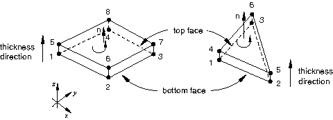
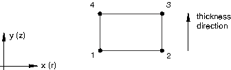
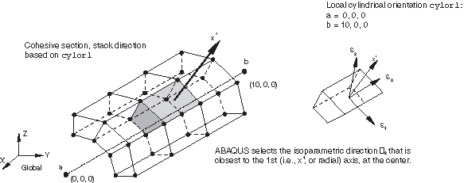
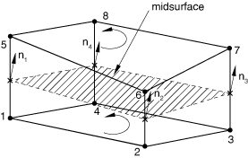
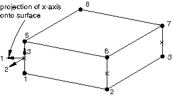

# 32.5.4 Defining the cohesive element's initial geometry


**Products: **Abaqus/Standard  Abaqus/Explicit  Abaqus/CAE  

##### **References**

- ["Cohesive elements: overview," Section 32.5.1](pt06ch32s05abo29.md)
- [Chapter 21, "Adhesive joints and bonded interfaces," of the Abaqus/CAE User's Guide](../usi/usi-link.md#usi-adv-cohesive)

### Overview

The initial geometry of a cohesive element is defined:
- by the nodal connectivity of the element and the position of these nodes;
- by the stack direction, which can be used to specify the top and the bottom faces of the cohesive element independent of the nodal connectivity; and
- by the magnitude of the initial constitutive thickness, which can either correspond to the geometric thickness implied by the nodal positions and stack direction or be specified directly.

### Defining the element connectivity

The connectivity of a cohesive element is like that of a continuum element; however, it is useful to think of a cohesive element as being composed of two faces (a bottom and a top face) separated by the cohesive zone thickness. The element has nodes on its bottom face and corresponding nodes on its top face. Pore pressure cohesive elements include a third, middle face, which is used to model fluid flow within the element.

Three methods are available to define the element connectivity.

#### By directly defining the element's complete connectivity

The complete connectivity of a cohesive element can be given directly (see ["Defining cohesive elements" in "Element definition," Section 2.2.1](pt01ch02s02aus11.md#usb-int-ielement-cohesive)).

#### By defining the bottom-face element connectivity and an integer offset

Alternatively, you can specify the connectivity of the bottom face plus a positive integer offset (see ["Defining cohesive elements" in "Element definition," Section 2.2.1](pt01ch02s02aus11.md#usb-int-ielement-cohesive)) that will be used to determine the remaining cohesive element nodes.

| **Input File Usage: ** | ``` [*ELEMENT](../key/key-link.md#usb-kws-melement), OFFSET=*n* ``` |
| --- | --- |

| **Abaqus/CAE Usage: ** | Element offsets are not supported in Abaqus/CAE. |
| --- | --- |

##### Use with displacement cohesive elements

The integer offset will be used to define node numbers of the top face of the cohesive element. Abaqus will automatically position the nodes of the top face to be coincident with those of the bottom face unless the nodes of the top face have already been assigned coordinates directly with a node definition (["Node definition," Section 2.1.1](pt01ch02s01aus05.md)).

##### Use with pore pressure-displacement cohesive elements

When you define only the bottom face nodes, the integer offset will first be used to define the node numbers of the top face of the cohesive element, with the numbering of the top-face nodes offset from the bottom face node numbers. The integer offset will again be used to define the middle surface node numbers offset, with the numbering of the middle-face nodes offset from the top face node numbers. Abaqus will automatically position the nodes of the top and middle faces to be coincident with those of the bottom face unless the nodes of the top face have already been assigned coordinates directly with a node definition (["Node definition," Section 2.1.1](pt01ch02s01aus05.md)).

#### By defining the bottom- and top-face element connectivities and an integer offset

For pore pressure cohesive elements, you also can specify the connectivity of the bottom and top faces plus a positive integer offset (see ["Defining cohesive elements" in "Element definition," Section 2.2.1](pt01ch02s02aus11.md#usb-int-ielement-cohesive)) that will be used to determine the middle face cohesive element nodes.

When you define the bottom and top face nodes, the integer offset will be used to define the node numbers of the middle face, with the numbering of the middle-face nodes offset from the bottom face node numbers. Abaqus will automatically position the nodes of the middle face to be halfway between those of the bottom and top faces unless the nodes of the middle face have already been assigned coordinates directly with a node definition (["Node definition," Section 2.1.1](pt01ch02s01aus05.md)).

| **Input File Usage: ** | ``` [*ELEMENT](../key/key-link.md#usb-kws-melement), OFFSET=*n* ``` |
| --- | --- |

| **Abaqus/CAE Usage: ** | Element offsets are not supported in Abaqus/CAE. |
| --- | --- |

### Specifying the out-of-plane thickness for two-dimensional elements

For two-dimensional cohesive elements the out-of-plane thickness is required. You specify this additional information in the cohesive section definition; the default value is 1.0.

| **Input File Usage: ** | ``` [*COHESIVE SECTION](../key/key-link.md#usb-kws-mcohesivesection) *first data line* *out-of-plane thickness* ``` |
| --- | --- |

| **Abaqus/CAE Usage: ** | Property module: cohesive section editor: toggle on **Out-of-plane thickness:** and specify the out-of-plane thickness |
| --- | --- |

### Specifying the constitutive thickness

You can specify the constitutive thickness of the cohesive element directly or allow Abaqus to compute it based on nodal coordinates such that the constitutive thickness is equal to the geometric thickness. The default behavior depends on the nature of the application.

If the geometric thickness of the cohesive element is very small compared to its surface dimensions, the thickness computed from the nodal coordinates may be inaccurate. In such cases you can specify a constant thickness directly when defining the section properties of these elements.

The characteristic element length of a cohesive element is equal to its constitutive thickness. The characteristic element length is often useful in defining the evolution of damage in materials (see ["Mesh dependency" in "Progressive damage and failure," Section 24.1.1](pt05ch24s01abo21.md#usb-mat-cdamageoverview-meshdep)).

#### When the cohesive element response is based on a continuum approach

When the response of the cohesive elements is based on a continuum approach, by default the constitutive thickness of the element is computed by Abaqus based on the nodal coordinates. You can override this default by specifying the constitutive thickness directly.

| **Input File Usage: ** | Use the following option to have Abaqus compute the thickness based on the nodal coordinates: |
| --- | --- |
|  | ``` [*COHESIVE SECTION](../key/key-link.md#usb-kws-mcohesivesection), RESPONSE=CONTINUUM, THICKNESS=GEOMETRY (default) ``` Use the following option to specify the thickness directly: ``` [*COHESIVE SECTION](../key/key-link.md#usb-kws-mcohesivesection), RESPONSE=CONTINUUM, THICKNESS=SPECIFIED *thickness (1.0 by default)* ``` |

| **Abaqus/CAE Usage: ** | Property module: cohesive section editor: **Response**: **Continuum**: **Initial thickness**: **Use nodal coordinates**, **Specify**: *thickness*, or **Use analysis default** |
| --- | --- |

#### When the cohesive element response is based on a traction-separation approach

When the response of the cohesive elements is based on a traction-separation approach, Abaqus assumes by default that the constitutive thickness is equal to one. This default value is motivated by the fact that the geometric thickness of cohesive elements is often equal to (or very close to) zero for the kinds of applications in which a traction-separation-based constitutive response is appropriate. This default choice ensures that nominal strains are equal to the relative separation displacements (see ["Defining the constitutive response of cohesive elements using a traction-separation description," Section 32.5.6](pt06ch32s05alm45.md), for further details). You can override this default by specifying another value or specifying that the constitutive thickness should be equal to the geometric thickness.

| **Input File Usage: ** | Use the following option to specify the thickness directly: |
| --- | --- |
|  | ``` [*COHESIVE SECTION](../key/key-link.md#usb-kws-mcohesivesection), RESPONSE=TRACTION SEPARATION, THICKNESS=SPECIFIED (default) *thickness (1.0 by default)* ``` Use the following option to have Abaqus compute the thickness based on the nodal coordinates: ``` [*COHESIVE SECTION](../key/key-link.md#usb-kws-mcohesivesection), RESPONSE=TRACTION SEPARATION, THICKNESS=GEOMETRY ``` |

| **Abaqus/CAE Usage: ** | Property module: cohesive section editor: **Response**: **Traction Separation**: **Initial thickness**: **Specify**: *thickness*, **Use analysis default**, or **Use nodal coordinates** |
| --- | --- |

#### When the cohesive element response is based on a uniaxial stress state

When the response of the cohesive elements is based on a uniaxial stress state, there is no default method for computing the constitutive thickness. You must indicate your choice of the method of determining the constitutive thickness.

| **Input File Usage: ** | Use the following option to specify the thickness: |
| --- | --- |
|  | ``` [*COHESIVE SECTION](../key/key-link.md#usb-kws-mcohesivesection), RESPONSE=GASKET, THICKNESS=SPECIFIED *thickness (1.0 by default)* ``` Use the following option to have Abaqus compute the thickness based on the nodal coordinates: ``` [*COHESIVE SECTION](../key/key-link.md#usb-kws-mcohesivesection), RESPONSE=GASKET, THICKNESS=GEOMETRY ``` |

| **Abaqus/CAE Usage: ** | Property module: cohesive section editor: **Response**: **Gasket**: **Initial thickness**: **Specify**: *thickness* or **Use nodal coordinates** |
| --- | --- |

### Element thickness direction definition

It is important to define the orientation of cohesive elements correctly, since the behavior of the elements is different in the thickness and in-plane directions. By default, the top and bottom faces of cohesive elements are as shown  in [Figure 32.5.4--1](pt06ch32s05alm43.md#ecohesive-3d-stackori) for three-dimensional cohesive elements and [Figure 32.5.4--2](pt06ch32s05alm43.md#ecohesive-2d-stackori) for two-dimensional and axisymmetric cohesive elements. Options for overriding the default orientation of cohesive elements are discussed below along with an explanation of how the local thickness direction and in-plane direction vectors are established. 

**Figure 32.5.4–1** Default thickness direction for three-dimensional cohesive elements.



**Figure 32.5.4–2** Default thickness direction for two-dimensional and axisymmetric cohesive elements.



#### Setting the stack direction equal to an isoparametric direction

The “stack direction” refers to the isoparametric direction along which the top and bottom faces of a cohesive element are stacked. By default, the top and bottom faces are stacked along the third isoparametric direction in three-dimensional cohesive elements and along the second isoparametric direction in two-dimensional and axisymmetric cohesive elements. You can choose to stack the top and bottom faces along an alternate isoparametric direction for most element types (the COH3D6 element can have only the third isoparametric direction as the stack direction). The choice of the isoparametric direction depends on the element connectivity. For a mesh-independent specification, use an orientation-based method as described below. The isoparametric direction choices for three-dimensional cohesive elements are shown in [Figure 32.5.4--3](pt06ch32s05alm43.md#ecohesive-scon-stackdir). 

**Figure 32.5.4–3** Stack directions for COH3D8 (left) and COH3D6 (right) elements.


| **Input File Usage: ** | Use the following option to define the element top and bottom faces based on the element's isoparametric directions: |
| --- | --- |
|  | ``` [*COHESIVE SECTION](../key/key-link.md#usb-kws-mcohesivesection), STACK DIRECTION=*n* ``` |

| **Abaqus/CAE Usage: ** | You cannot define the stack direction based on isoparametric directions in Abaqus/CAE. The stack direction will correspond to the default discussed above. |
| --- | --- |

#### Setting the stack direction based on a user-defined orientation

You can also control the orientation of the stack direction through a user-defined local orientation (["Orientations," Section 2.2.5](pt01ch02s02aus15.md)). When you define an orientation for cohesive elements, you also specify an axis about which the local 1 and 2 material directions may be rotated. This axis also defines an approximate normal direction. The stack direction will be the element isoparametric direction that is closest to this approximate normal (see [Figure 32.5.4--4](pt06ch32s05alm43.md#ecohesive-stackori)).

**Figure 32.5.4–4** Example illustrating the use of a cylindrical system to define the stack direction.



| **Input File Usage: ** | Use the following option to define the element thickness direction based on a user-defined orientation: |
| --- | --- |
|  | ``` [*COHESIVE SECTION](../key/key-link.md#usb-kws-mcohesivesection), STACK DIRECTION=ORIENTATION, ORIENTATION=*name* ``` |

| **Abaqus/CAE Usage: ** | You cannot define the stack direction based on an orientation definition in Abaqus/CAE. The stack direction will correspond to the default discussed above. |
| --- | --- |

#### Verifying the stack direction

The stack direction can be verified visually in Abaqus/CAE by using the stack direction query tool (see ["Understanding the role of the Query toolset," Section 71.1 of the Abaqus/CAE User's Guide](../usi/usi-link.md#usi-qre-role)). For three-dimensional elements Abaqus/CAE colors the top face purple and the bottom face brown. For two-dimensional and axisymmetric elements, arrows indicate the orientation of the element. In addition, Abaqus/CAE highlights any element faces and edges that have inconsistent orientations.

Alternatively, the material axes can be plotted in the Visualization module of Abaqus/CAE to verify that the 3-axis points in the desired normal direction for three-dimensional elements; and if the element is oriented improperly, one of the in-plane axes (either the 1- or 2-axis) will point in the normal direction. For two-dimensional and axisymmetric elements, the stack direction is consistent with the 2-axis material direction.

#### Thickness direction computation for two-dimensional and axisymmetric elements

To compute the thickness direction for two-dimensional and axisymmetric elements, Abaqus forms a midsurface by averaging the coordinates of the node pairs forming the bottom and top surfaces of the element. This midsurface passes through the integration points of the element, as shown in [Figure 32.5.4--5](pt06ch32s05alm43.md#ecohesive-2d-axi-normal) for the default choice of the bottom and top surfaces. For each integration point Abaqus computes a tangent whose direction is defined by the sequence of nodes given on the bottom and top surfaces. The thickness direction is then obtained as the cross product of the out-of-plane and tangent directions.

**Figure 32.5.4–5** Thickness direction for a two-dimensional or axisymmetric element.


#### Thickness direction computation for three-dimensional elements

To compute the thickness direction for three-dimensional elements, Abaqus forms a midsurface by averaging the coordinates of the node pairs forming the bottom and top surfaces of the element. This midsurface passes through the integration points of the element, as shown in [Figure 32.5.4--6](pt06ch32s05alm43.md#ecohesive-3d-normal) for the default choice of the bottom and top surfaces. Abaqus computes the thickness direction as the normal to the midsurface at each integration point; the positive direction is obtained with the right-hand rule going around the nodes of the element on the bottom or top surface.

**Figure 32.5.4–6** Thickness direction for a three-dimensional element.



### Local directions at integration points

Abaqus computes default local directions at each integration point. The local directions are used for output of all quantities that describe the current deformation state of a cohesive element. Details of local directions are discussed separately below for cohesive elements with two versus three local directions.

#### Local directions for two-dimensional and axisymmetric cohesive elements

The local 2-direction for two-dimensional and axisymmetric cohesive elements corresponds to the thickness direction, which is computed as discussed above in ["Element thickness direction definition](pt06ch32s05alm43.md#usb-elm-ecohesiveinit-thickdir).” The local 1-direction is defined such that the cross product between the local 1- and 2-directions gives the out-of-plane direction (see [Figure 32.5.4--7](pt06ch32s05alm43.md#ecohesive-2d-axi-local-dir)). You cannot modify either local direction for these elements for a given stack orientation. Transverse shear behavior is defined in the 1–2 plane for these elements.

**Figure 32.5.4–7** Local directions for two-dimensional and axisymmetric cohesive elements.


#### Local directions for three-dimensional cohesive elements

The local 3-direction for three-dimensional cohesive elements corresponds to the thickness direction, which is computed as discussed above in ["Element thickness direction definition](pt06ch32s05alm43.md#usb-elm-ecohesiveinit-thickdir)” and cannot be modified for a given stack orientation. The local 1- and 2-directions are normal to the thickness direction and, by default, are defined by the standard Abaqus convention for local directions on surfaces (["Conventions," Section 1.2.2](pt01ch01s02aus02.md)). The default local directions for a three-dimensional cohesive element are shown in [Figure 32.5.4--8](pt06ch32s05alm43.md#ecohesive-3d-local-dir). 

**Figure 32.5.4–8** Local directions for three-dimensional cohesive elements.



Transverse shear behavior is defined in the local 1–3 and 2–3 planes for these elements. You can modify the local 1- and 2-directions for three-dimensional cohesive elements in the plane normal to the thickness direction by using a local orientation definition (["Orientations," Section 2.2.5](pt01ch02s02aus15.md)).

| **Input File Usage: ** | ``` [*COHESIVE SECTION](../key/key-link.md#usb-kws-mcohesivesection), ELSET=*name*, ORIENTATION=*name* ``` |
| --- | --- |

| **Abaqus/CAE Usage: ** | Property module: ****Assign****Material Orientation****: select region: select orientation |
| --- | --- |


