# 32.5.6 Defining the constitutive response of cohesive elements using a traction-separation description


**Products: **Abaqus/Standard  Abaqus/Explicit  Abaqus/CAE  

##### **References**

- ["Cohesive elements: overview," Section 32.5.1](pt06ch32s05abo29.md)
- ["Defining the constitutive response of cohesive elements using a continuum approach," Section 32.5.5](pt06ch32s05alm44.md)
- [*COHESIVE SECTION](../key/key-link.md#usb-kws-mcohesivesection)
- [*DAMAGE EVOLUTION](../key/key-link.md#usb-kws-mdamageevolution)
- [*DAMAGE INITIATION](../key/key-link.md#usb-kws-mdamageinitiation)
- ["Defining damage," Section 12.9.3 of the Abaqus/CAE User's Guide](../usi/usi-link.md#usi-prp-mechanical-damage)
- [Chapter 21, "Adhesive joints and bonded interfaces," of the Abaqus/CAE User's Guide](../usi/usi-link.md#usi-adv-cohesive)

### Overview

The features described in this section are primarily intended for bonded interfaces where the interface thickness is negligibly small. In such cases it may be straightforward to define the constitutive response of the cohesive layer directly in terms of traction versus separation. If the interface adhesive layer has a finite thickness and macroscopic properties (such as stiffness and strength) of the adhesive material are available, it may be more appropriate to model the response using conventional material models. The former approach is discussed in this section, while the latter approach is discussed in ["Defining the constitutive response of cohesive elements using a continuum approach," Section 32.5.5](pt06ch32s05alm44.md).

Cohesive behavior defined directly in terms of a traction-separation law:
- can be used to model the delamination at interfaces in composites directly in terms of traction versus separation;
- allows specification of material data such as the fracture energy as a function of the ratio of normal to shear deformation (mode mix) at the interface;
- assumes a linear elastic traction-separation law prior to damage;
- can be used in combination with linear viscoelasticity in Abaqus/Explicit (["Defining viscoelastic behavior for traction-separation elasticity in Abaqus/Explicit" in "Time domain viscoelasticity," Section 22.7.1](pt05ch22s07abm12.md#usb-mat-ctimevisco-cohesive)) to describe rate-dependent delamination behavior;
- assumes that failure of the elements is characterized by progressive degradation of the material stiffness, which is driven by a damage process;
- allows multiple damage mechanisms; and
- can be used with user subroutine [`UMAT`](../sub/sub-link.md#sub-xsl-umat) in Abaqus/Standard or [`VUMAT`](../sub/sub-link.md#sub-xsl-vumat) in Abaqus/Explicit to specify user-defined traction-separation laws.

### Defining constitutive response in terms of traction-separation laws

To define the constitutive response of the cohesive element directly in terms of traction versus separation, you choose a traction-separation response when defining the section behavior of the cohesive elements.

| **Input File Usage: ** | ``` [*COHESIVE SECTION](../key/key-link.md#usb-kws-mcohesivesection), RESPONSE=TRACTION SEPARATION ``` |
| --- | --- |

| **Abaqus/CAE Usage: ** | Property module: **Create Section**: select **Other** as the section **Category** and **Cohesive** as the section **Type**: **Response**: **Traction Separation** |
| --- | --- |

### Linear elastic traction-separation behavior

The available traction-separation model in Abaqus assumes initially linear elastic behavior (see ["Defining elasticity in terms of tractions and separations for cohesive elements" in "Linear elastic behavior," Section 22.2.1](pt05ch22s02abm02.md#usb-mat-clinearelastic-traction)) followed by the initiation and evolution of damage. The elastic behavior is written in terms of an elastic constitutive matrix that relates the nominal stresses to the nominal strains across the interface. The nominal stresses are the force components divided by the original area at each integration point, while the nominal strains are the separations divided by the original thickness at each integration point. The default value of the original constitutive thickness is 1.0 if traction-separation response is specified, which ensures that the nominal strain is equal to the separation (i.e., relative displacements of the top and bottom faces). The constitutive thickness used for traction-separation response is typically different from the geometric thickness (which is typically close or equal to zero). See ["Specifying the constitutive thickness" in "Defining the cohesive element's initial geometry," Section 32.5.4](pt06ch32s05alm43.md#usb-elm-ecohesiveinit-thickmag), for a discussion on how to modify the constitutive thickness.

The nominal traction stress vector, , consists of three components (two components in two-dimensional problems): , , and (in three-dimensional problems) , which represent the normal (along the local 3-direction in three dimensions and along the local 2-direction in two dimensions) and the two shear tractions (along the local 1- and 2-directions in three dimensions and along the local 1-direction in two dimensions), respectively. The corresponding separations are denoted by , , and . Denoting by  the original thickness of the cohesive element, the nominal strains can be defined as

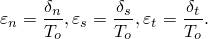

 The elastic behavior can then be written as


The elasticity matrix provides fully coupled behavior between all components of the traction vector and separation vector and can depend on temperature and/or field variables. Set the off-diagonal terms in the elasticity matrix to zero if uncoupled behavior between the normal and shear components is desired.

Optionally, for the uncoupled traction behavior a compression factor can be specified; this ensures that the compressive stiffness is equal to the specified factor times the tensile stiffness, . This factor affects only the traction response for separation in the normal direction; the shear behavior is not affected.

| **Input File Usage: ** | Use the following option to define uncoupled traction-separation behavior: |
| --- | --- |
|  | ``` [*ELASTIC](../key/key-link.md#usb-kws-melastic), TYPE=TRACTION ``` Use the following option to define uncoupled traction-separation behavior with a compression factor: ``` [*ELASTIC](../key/key-link.md#usb-kws-melastic), TYPE=TRACTION, COMPRESSION FACTOR=*f* ``` Use the following option to define coupled traction-separation behavior: ``` [*ELASTIC](../key/key-link.md#usb-kws-melastic), TYPE=COUPLED TRACTION ``` |

| **Abaqus/CAE Usage: ** | Use the following option to define uncoupled traction-separation behavior: |
| --- | --- |
|  | Property module: material editor: ****Mechanical****Elasticity****Elastic****: **Type**: **Traction** Use the following option to define coupled traction-separation behavior: Property module: material editor: ****Mechanical****Elasticity****Elastic****: **Type**: **Coupled Traction** Specifying a compression factor for uncoupled traction-separation behavior is not supported in Abaqus/CAE. |

### Interpretation of material properties

The material parameters, such as the interfacial elastic stiffness, for a traction-separation model can be better understood by studying the equation that represents the displacement of a truss of length *L*, elastic stiffness *E*, and original area *A*, due to an axial load *P*:

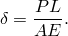

This equation can be rewritten as

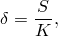

 where  is the nominal stress and  is the stiffness that relates the nominal stress to the displacement. Likewise, the total mass of the truss, assuming a density , is given by 

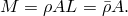

The above equations suggest that the actual length *L* may be replaced with 1.0 (to ensure that the strain is the same as the displacement) if the stiffness and the density are appropriately reinterpreted. In particular, the stiffness is  and the density is , where the true length of the truss is used in these equations. The density represents mass per unit area instead of mass per unit volume.

These ideas can be carried over to a cohesive layer of initial thickness . If the adhesive material has stiffness 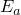 and density , the stiffness of the interface (relating the nominal traction to the nominal strain) is given by  and the density of the interface is given by 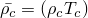. As discussed earlier, the default choice of the constitutive thickness  for modeling the response in terms of traction versus separation is 1.0 regardless of the actual thickness of the cohesive layer. With this choice, the nominal strains are equal to the corresponding separations. When the constitutive thickness of the cohesive layer is “artificially” set to 1.0, ideally you should specify  and 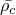 (if needed) as the material stiffness and density, respectively, as calculated with the true thickness of the cohesive layer.

The above formulae provide a recipe for estimating the parameters required for modeling the traction-separation behavior of an interface in terms of the material properties of the bulk adhesive material. As the thickness of the interface layer tends to zero, the above equations imply that the stiffness, , tends to infinity and the density, , tends to zero. This stiffness is often chosen as a penalty parameter. A very large penalty stiffness is detrimental to the stable time increment in Abaqus/Explicit and may result in ill-conditioning of the element operator in Abaqus/Standard. Recommendations for the choice of the stiffness and density of an interface for an Abaqus/Explicit analysis such that the stable time increment is not adversely affected are provided in ["Stable time increment in Abaqus/Explicit" in "Modeling with cohesive elements," Section 32.5.3](pt06ch32s05alm42.md#usb-elm-ecohesiveusage-stabletime).

### Modeling rate-dependent traction-separation behavior in Abaqus/Explicit

Time domain viscoelasticity can be used in Abaqus/Explicit to model rate-dependent behavior of cohesive elements with traction-separation elasticity. The evolution equation for the normal and two shear nominal tractions take the form:


where , , and  are the instantaneous  nominal tractions at time *t* in the normal and the two local shear directions, respectively. The functions  and  represent the dimensionless shear and normal relaxation moduli, respectively. See ["Defining viscoelastic behavior for traction-separation elasticity in Abaqus/Explicit" in "Time domain viscoelasticity," Section 22.7.1](pt05ch22s07abm12.md#usb-mat-ctimevisco-cohesive), for additional details and usage information. 

You can also combine time domain viscoelasticity with the models for progressive damage and failure described in the next sections. This combination allows modeling rate-dependent behavior both during the initial elastic response (prior to damage initiation), as well as during damage progression.

### Damage modeling

Both Abaqus/Standard and Abaqus/Explicit allow modeling of progressive damage and failure in cohesive layers whose response is defined in terms of traction-separation. By comparison, only Abaqus/Explicit allows modeling of progressive damage and failure for cohesive elements modeled with conventional materials (["Defining the constitutive response of cohesive elements using a continuum approach," Section 32.5.5](pt06ch32s05alm44.md)). Damage of the traction-separation response is defined within the same general framework used for conventional materials (see ["Progressive damage and failure," Section 24.1.1](pt05ch24s01abo21.md)). This general framework allows the combination of several damage mechanisms acting simultaneously on the same material. Each failure mechanism consists of three ingredients: a damage initiation criterion, a damage evolution law, and a choice of element removal (or deletion) upon reaching a completely damaged state. While this general framework is the same for traction-separation response and conventional materials, many details of how the various ingredients are defined are different. Therefore, the details of damage modeling for traction-separation response are presented below.

The initial response of the cohesive element is assumed to be linear as discussed above. However, once a damage initiation criterion is met, material damage can occur according to a user-defined damage evolution law. [Figure 32.5.6--1](pt06ch32s05alm45.md#ecohesive-traction-separation) shows a typical traction-separation response with a failure mechanism. If the damage initiation criterion is specified without a corresponding damage evolution model, Abaqus will evaluate the damage initiation criterion for output purposes only; there is no effect on the response of the cohesive element (i.e., no damage will occur). The cohesive layer does not undergo damage under pure compression.

**Figure 32.5.6–1** Typical traction-separation response.


### Damage initiation

As the name implies, damage initiation refers to the beginning of degradation of the response of a material point. The process of degradation begins when the stresses and/or strains satisfy certain damage initiation criteria that you specify. Several damage initiation criteria are available and are discussed below. Each damage initiation criterion also has an output variable associated with it to indicate whether the criterion is met. A value of 1 or higher indicates that the initiation criterion has been met (see ["Output](pt06ch32s05alm45.md#usb-elm-ecohesivebehavior-output),” for further details). Damage initiation criteria that do not have an associated evolution law affect only output. Thus, you can use these criteria to evaluate the propensity of the material to undergo damage without actually modeling the damage process (i.e., without actually specifying damage evolution). 

In the discussion below, , , and  represent the peak values of the nominal stress when the deformation is either purely normal to the interface or purely in the first or the second shear direction, respectively. Likewise, 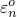, 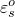, and  represent the peak values of the nominal strain when the deformation is either purely normal to the interface or purely in the first or the second shear direction, respectively. With the initial constitutive thickness , the nominal strain components are equal to the respective components of the relative displacement—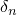, , and 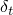—between the top and bottom of the cohesive layer. The symbol  used in the discussion below represents the Macaulay bracket with the usual interpretation. The Macaulay brackets are used to signify that a pure compressive deformation or stress state does not initiate damage.

#### Maximum nominal stress criterion

Damage is assumed to initiate when the maximum nominal stress ratio (as defined in the expression below) reaches a value of one. This criterion can be represented as


| **Input File Usage: ** | ``` [*DAMAGE INITIATION](../key/key-link.md#usb-kws-mdamageinitiation), CRITERION=MAXS ``` |
| --- | --- |

| **Abaqus/CAE Usage: ** | Property module: material editor: ****Mechanical****Damage for Traction-Separation Laws****Maxs Damage**** |
| --- | --- |

#### Maximum nominal strain criterion

Damage is assumed to initiate when the maximum nominal strain ratio (as defined in the expression below) reaches a value of one. This criterion can be represented as


| **Input File Usage: ** | ``` [*DAMAGE INITIATION](../key/key-link.md#usb-kws-mdamageinitiation), CRITERION=MAXE ``` |
| --- | --- |

| **Abaqus/CAE Usage: ** | Property module: material editor: ****Mechanical****Damage for Traction-Separation Laws****Maxe Damage**** |
| --- | --- |

#### Quadratic nominal stress criterion

Damage is assumed to initiate when a quadratic interaction function involving the nominal stress ratios (as defined in the expression below) reaches a value of one. This criterion can be represented as


| **Input File Usage: ** | ``` [*DAMAGE INITIATION](../key/key-link.md#usb-kws-mdamageinitiation), CRITERION=QUADS ``` |
| --- | --- |

| **Abaqus/CAE Usage: ** | Property module: material editor: ****Mechanical****Damage for Traction-Separation Laws****Quads Damage**** |
| --- | --- |

#### Quadratic nominal strain criterion

Damage is assumed to initiate when a quadratic interaction function involving the nominal strain ratios (as defined in the expression below) reaches a value of one. This criterion can be represented as


| **Input File Usage: ** | ``` [*DAMAGE INITIATION](../key/key-link.md#usb-kws-mdamageinitiation), CRITERION=QUADE ``` |
| --- | --- |

| **Abaqus/CAE Usage: ** | Property module: material editor: ****Mechanical****Damage for Traction-Separation Laws****Quade Damage**** |
| --- | --- |

### Damage evolution

The damage evolution law describes the rate at which the material stiffness is degraded once the corresponding initiation criterion is reached. The general framework for describing the evolution of damage in bulk materials (as opposed to interfaces modeled using cohesive elements) is described in ["Damage evolution and element removal for ductile metals," Section 24.2.3](pt05ch24s02abm43.md). Conceptually, similar ideas apply for describing damage evolution in cohesive elements with a constitutive response that is described in terms of traction versus separation; however, many details are different.

A scalar damage variable, *D*, represents the overall damage in the material and captures the combined effects of all the active mechanisms. It initially has a value of 0. If damage evolution is modeled, *D* monotonically evolves from 0 to 1 upon further loading after the initiation of damage. The stress components of the traction-separation model are affected by the damage according to


 where ,  and  are the stress components predicted by the elastic traction-separation behavior for the current strains without damage.

To describe the evolution of damage under a combination of normal and shear deformation across the interface, it is useful to introduce an effective displacement (Camanho and Davila, 2002) defined as


#### Mixed-mode definition

The mode mix of the deformation fields in the cohesive zone quantify the relative proportions of normal and shear deformation. Abaqus uses three measures of mode mix, two that are based on energies and one that is based on tractions. You can choose one of these measures when you specify the mode dependence of the damage evolution process. Denoting by , , and  the work done by the tractions and their conjugate relative displacements in the normal, first, and second shear directions, respectively, and defining , the mode-mix definitions based on energies are as follows:


Clearly, only two of the three quantities defined above are independent. It is also useful to define the quantity  to denote the portion of the total work done by the shear traction and the corresponding relative displacement components. As discussed later, Abaqus requires that you specify material properties related to damage evolution as functions of  (or, equivalently, ) and . 

Abaqus computes the energy quantities described above either based on the current state of deformation (nonaccumulative measure of energy) or based on the deformation history (accumulative measure of energy) at an integration point. The former approach is useful in mixed-mode simulations where the primary energy dissipation mechanism is associated with the creation of new surfaces due to failure in the cohesive zone. Such problems are typically adequately described utilizing the methods of linear elastic fracture mechanics. The latter approach provides an alternate way of defining the mode-mix and may be useful in situations where other significant dissipation mechanisms also govern the overall structural response.

The corresponding definitions of the mode mix based on traction components are given by


 where  is a measure of the effective shear traction. The angular measures used in the above definition (before they are normalized by the factor ) are illustrated in [Figure 32.5.6--2](pt06ch32s05alm45.md#ecohesive-mode-mix-traction).

**Figure 32.5.6–2** Mode mix measures based on traction.


| **Input File Usage: ** | Use the following option to use the mode-mix definition based on nonaccumulated energies: |
| --- | --- |
|  | ``` [*DAMAGE EVOLUTION](../key/key-link.md#usb-kws-mdamageevolution), MODE MIX RATIO=ENERGY ``` Use the following option to use the mode-mix definition based on accumulated energies: ``` [*DAMAGE EVOLUTION](../key/key-link.md#usb-kws-mdamageevolution), MODE MIX RATIO=ACCUMULATED ENERGY ``` Use the following option to use the mode-mix definition based on tractions: ``` [*DAMAGE EVOLUTION](../key/key-link.md#usb-kws-mdamageevolution), MODE MIX RATIO=TRACTION ``` |

| **Abaqus/CAE Usage: ** | Property module: material editor: ****Mechanical****Damage for Traction-Separation Laws****Quade Damage****, **Maxe Damage**, **Quads Damage**, or **Maxs Damage**: ****Suboptions****Damage Evolution****: **Mode mix ratio:** **Energy** or **Traction** |
| --- | --- |
|  | Specifying a mode-mix definition based on accumulated energies is not supported in Abaqus/CAE. |

##### Comparison of mixed-mode definitions

The mode-mix ratios defined in terms of the different energy quantities and tractions can be quite different in general. The following examples illustrate this point. In terms of energies a deformation in the purely normal direction is one for which  and , irrespective of the values of the normal and the shear tractions. In particular, for a material with coupled traction-separation behavior both the normal and shear tractions may be nonzero for a deformation in the purely normal direction. For this case the definition of mode mix based on energies would indicate a purely normal deformation, while the definition based on tractions would suggest a mix of both normal and shear deformation. 

When the mode mix is defined based on accumulated energies, an artificial path-dependence may be introduced in the mixed-mode behavior that may not be consistent, for example, with predictions that are based on linear elastic fracture mechanics. Therefore, if an interface is first loaded purely in the normal deformation mode, unloaded, and subsequently loaded in a purely shear deformation mode, the mode-mix ratios based on accumulated energies at the end of the above deformation path evaluate to (assuming the shear deformation to be in the local-1 direction only)  and . On the other hand, the mode-mix ratios based on nonaccumulated energies evaluate to  and  at the end of the above deformation path.

#### Damage evolution definition

There are two components to the definition of the evolution of damage. The first component involves specifying either the effective displacement at complete failure, , relative to the effective displacement at the initiation of damage, ; or the energy dissipated due to failure,  (see [Figure 32.5.6--3](pt06ch32s05alm45.md#ecohesive-linear-softening)). 

**Figure 32.5.6–3** Linear damage evolution.


The second component to the definition of damage evolution is the specification of the nature of the evolution of the damage variable, *D*, between initiation of damage and final failure. This can be done by either defining linear or exponential softening laws or specifying *D* directly as a tabular function of the effective displacement relative to the effective displacement at damage initiation. The material data described above will in general be functions of the mode mix, temperature, and/or field variables.

[Figure 32.5.6--4](pt06ch32s05alm45.md#ecohesive-mixed-mode-response) is a schematic representation of the dependence of damage initiation and evolution on the mode mix, for a traction-separation response with isotropic shear behavior. The figure shows the traction on the vertical axis and the magnitudes of the normal and the shear separations along the two horizontal axes. The unshaded triangles in the two vertical coordinate planes represent the response under pure normal and pure shear deformation, respectively. All intermediate vertical planes (that contain the vertical axis) represent the damage response under mixed mode conditions with different mode mixes. The dependence of the damage evolution data on the mode mix can be defined either in tabular form or, in the case of an energy-based definition, analytically. The manner in which the damage evolution data are specified as a function of the mode mix is discussed later in this section.

**Figure 32.5.6–4** Illustration of mixed-mode response in cohesive elements.


Unloading subsequent to damage initiation is always assumed to occur linearly toward the origin of the traction-separation plane, as shown in [Figure 32.5.6--3](pt06ch32s05alm45.md#ecohesive-linear-softening). Reloading subsequent to unloading also occurs along the same linear path until the softening envelope (line AB) is reached. Once the softening envelope is reached, further reloading follows this envelope as indicated by the arrow in [Figure 32.5.6--3](pt06ch32s05alm45.md#ecohesive-linear-softening).

#### Evolution based on effective displacement

You specify the quantity  (i.e., the effective displacement at complete failure,  , relative to the effective displacement at damage initiation, , as shown in [Figure 32.5.6--3](pt06ch32s05alm45.md#ecohesive-linear-softening)) as a tabular function of the mode mix, temperature, and/or field variables. In addition, you also choose either a linear or an exponential softening law that defines the detailed evolution (between initiation and complete failure) of the damage variable, *D*, as a function of the effective displacement beyond damage initiation. Alternatively, instead of using linear or exponential softening, you can specify the damage variable, *D*, directly as a tabular function of the effective displacement after the initiation of damage, ; mode mix; temperature; and/or field variables.

##### Linear damage evolution

For linear softening (see [Figure 32.5.6--3](pt06ch32s05alm45.md#ecohesive-linear-softening)) Abaqus uses an evolution of the damage variable, *D*, that reduces (in the case of damage evolution under a constant mode mix, temperature, and field variables) to the expression proposed by Camanho and Davila (2002), namely:


In the preceding expression and in all later references,  refers to the maximum value of the effective displacement attained during the loading history. The assumption of a constant mode mix at a material point between initiation of damage and final failure is customary for problems involving monotonic damage (or monotonic fracture).

| **Input File Usage: ** | Use the following option to specify linear damage evolution: |
| --- | --- |
|  | ``` [*DAMAGE EVOLUTION](../key/key-link.md#usb-kws-mdamageevolution), TYPE=DISPLACEMENT, SOFTENING=LINEAR ``` |

| **Abaqus/CAE Usage: ** | Property module: material editor: ****Mechanical****Damage for Traction-Separation Laws****Quade Damage****, **Maxe Damage**, **Quads Damage**, or **Maxs Damage**: ****Suboptions****Damage Evolution****: **Type:** **Displacement**: **Softening:** **Linear** |
| --- | --- |

##### Exponential damage evolution

For exponential softening (see [Figure 32.5.6--5](pt06ch32s05alm45.md#ecohesive-exponential-softening)) Abaqus uses an evolution of the damage variable, *D*, that reduces (in the case of damage evolution under a constant mode mix, temperature, and field variables) to


 In the expression above  is a non-dimensional material parameter that defines the rate of damage evolution and  is the exponential function. 

**Figure 32.5.6–5** Exponential damage evolution.


| **Input File Usage: ** | Use the following option to specify exponential softening: |
| --- | --- |
|  | ``` [*DAMAGE EVOLUTION](../key/key-link.md#usb-kws-mdamageevolution), TYPE=DISPLACEMENT, SOFTENING=EXPONENTIAL ``` |

| **Abaqus/CAE Usage: ** | Property module: material editor: ****Mechanical****Damage for Traction-Separation Laws****Quade Damage****, **Maxe Damage**, **Quads Damage**, or **Maxs Damage**: ****Suboptions****Damage Evolution****: **Type:** **Displacement**: **Softening:** **Exponential** |
| --- | --- |

##### Tabular damage evolution

For tabular softening you define the evolution of *D* directly in tabular form. *D* must be specified as a function of the effective displacement relative to the effective displacement at initiation, mode mix, temperature, and/or field variables.

| **Input File Usage: ** | Use the following option to define the damage variable directly in tabular form: |
| --- | --- |
|  | ``` [*DAMAGE EVOLUTION](../key/key-link.md#usb-kws-mdamageevolution), TYPE=DISPLACEMENT, SOFTENING=TABULAR ``` |

| **Abaqus/CAE Usage: ** | Property module: material editor: ****Mechanical****Damage for Traction-Separation Laws****Quade Damage****, **Maxe Damage**, **Quads Damage**, or **Maxs Damage**: ****Suboptions****Damage Evolution****: **Type:** **Displacement**: **Softening:** **Tabular** |
| --- | --- |

#### Evolution based on energy

Damage evolution can be defined based on the energy that is dissipated as a result of the damage process, also called the fracture energy. The fracture energy is equal to the area under the traction-separation curve (see [Figure 32.5.6--3](pt06ch32s05alm45.md#ecohesive-linear-softening)). You specify the fracture energy as a material property and choose either a linear or an exponential softening behavior. Abaqus ensures that the area under the linear or the exponential damaged response is equal to the fracture energy. 

The dependence of the fracture energy on the mode mix can be specified either directly in tabular form or by using analytical forms as described below. When the analytical forms are used, the mode-mix ratio is assumed to be defined in terms of energies.

##### Tabular form

The simplest way to define the dependence of the fracture energy is to specify it directly as a function of the mode mix in tabular form.

| **Input File Usage: ** | Use the following option to specify fracture energy as a function of the mode mix in tabular form: |
| --- | --- |
|  | ``` [*DAMAGE EVOLUTION](../key/key-link.md#usb-kws-mdamageevolution), TYPE=ENERGY, MIXED MODE BEHAVIOR=TABULAR ``` |

| **Abaqus/CAE Usage: ** | Property module: material editor: ****Mechanical****Damage for Traction-Separation Laws****Quade Damage****, **Maxe Damage**, **Quads Damage**, or **Maxs Damage**: ****Suboptions****Damage Evolution****: **Type:** **Energy**: **Mixed mode behavior:** **Tabular** |
| --- | --- |

##### Power law form

The dependence of the fracture energy on the mode mix can be defined based on a power law fracture criterion. The power law criterion states that failure under mixed-mode conditions is governed by a power law interaction of the energies required to cause failure in the individual (normal and two shear) modes. It is given by

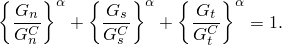

The mixed-mode fracture energy  when the above condition is satisfied. In other words, 


You specify the quantities , , and , which refer to the critical fracture energies required to cause failure in the normal, the first, and the second shear directions, respectively.

| **Input File Usage: ** | Use the following option to define the fracture energy as a function of the mode mix using the analytical power law fracture criterion: |
| --- | --- |
|  | ``` [*DAMAGE EVOLUTION](../key/key-link.md#usb-kws-mdamageevolution), TYPE=ENERGY, MIXED MODE BEHAVIOR=POWER LAW, POWER= ``` |

| **Abaqus/CAE Usage: ** | Property module: material editor: ****Mechanical****Damage for Traction-Separation Laws****Quade Damage****, **Maxe Damage**, **Quads Damage**, or **Maxs Damage**: ****Suboptions****Damage Evolution****: **Type:** **Energy**: **Mixed mode behavior:** **Power Law**: Toggle on **Power** and enter the exponent value |
| --- | --- |

##### Benzeggagh-Kenane (BK) form

The Benzeggagh-Kenane fracture criterion (Benzeggagh and Kenane, 1996) is particularly useful when the critical fracture energies during deformation purely along the first and the second shear directions are the same; i.e., . It is given by


 where , , and  is a material parameter. You specify , , and .

| **Input File Usage: ** | Use the following option to define the fracture energy as a function of the mode mix using the analytical BK fracture criterion: |
| --- | --- |
|  | ``` [*DAMAGE EVOLUTION](../key/key-link.md#usb-kws-mdamageevolution), TYPE=ENERGY, MIXED MODE BEHAVIOR=BK, POWER= ``` |

| **Abaqus/CAE Usage: ** | Property module: material editor: ****Mechanical****Damage for Traction-Separation Laws****Quade Damage****, **Maxe Damage**, **Quads Damage**, or **Maxs Damage**: ****Suboptions****Damage Evolution****: **Type:** **Energy**: **Mixed mode behavior:** **Bk**: Toggle on **Power** and enter the exponent value |
| --- | --- |

##### Linear damage evolution

For linear softening (see [Figure 32.5.6--3](pt06ch32s05alm45.md#ecohesive-linear-softening)) Abaqus uses an evolution of the damage variable, *D*, that reduces to


where  with  as the effective traction at damage initiation.  refers to the maximum value of the effective displacement attained during the loading history.

| **Input File Usage: ** | Use the following option to specify linear damage evolution: |
| --- | --- |
|  | ``` [*DAMAGE EVOLUTION](../key/key-link.md#usb-kws-mdamageevolution), TYPE=ENERGY, SOFTENING=LINEAR ``` |

| **Abaqus/CAE Usage: ** | Property module: material editor: ****Mechanical****Damage for Traction-Separation Laws****Quade Damage****, **Maxe Damage**, **Quads Damage**, or **Maxs Damage**: ****Suboptions****Damage Evolution****: **Type:** **Energy**: **Softening:** **Linear** |
| --- | --- |

##### Exponential damage evolution

For exponential softening Abaqus uses an evolution of the damage variable, *D*, that reduces to


 In the expression above  and  are the effective traction and displacement, respectively.  is the elastic energy at damage initiation. In this case the traction might not drop immediately after damage initiation, which is different from what is seen in [Figure 32.5.6--5](pt06ch32s05alm45.md#ecohesive-exponential-softening).

| **Input File Usage: ** | Use the following option to specify exponential softening: |
| --- | --- |
|  | ``` [*DAMAGE EVOLUTION](../key/key-link.md#usb-kws-mdamageevolution), TYPE=ENERGY, SOFTENING=EXPONENTIAL ``` |

| **Abaqus/CAE Usage: ** | Property module: material editor: ****Mechanical****Damage for Traction-Separation Laws****Quade Damage****, **Maxe Damage**, **Quads Damage**, or **Maxs Damage**: ****Suboptions****Damage Evolution****: **Type:** **Energy**: **Softening:** **Exponential** |
| --- | --- |

#### Defining damage evolution data as a tabular function of mode mix

As discussed earlier, the material data defining the evolution of damage can be tabular functions of the mode mix. The manner in which this dependence must be defined in Abaqus is outlined below for mode-mix definitions based on energy and traction, respectively. In the following discussion it is assumed that the evolution is defined in terms of energy. Similar observations can also be made for evolution definitions based on effective displacement.

##### Mode mix based on energy

For an energy-based definition of mode mix, in the most general case of a three-dimensional state of deformation with anisotropic shear behavior the fracture energy, , must be defined as a function of  and . The quantity  is a measure of the fraction of the total deformation that is shear, while  is a measure of the fraction of the total shear deformation that is in the second shear direction. [Figure 32.5.6--6](pt06ch32s05alm45.md#ecohesive-mode-mix-energy) shows a schematic of the fracture energy versus mode mix behavior. 

**Figure 32.5.6–6** Fracture energy as a function of mode mix.


The limiting cases of pure normal and pure shear deformations in the first and second shear directions are denoted in [Figure 32.5.6--6](pt06ch32s05alm45.md#ecohesive-mode-mix-energy) by , , and , respectively. The lines labeled “Modes n-s,” “Modes n-t,” and “Modes s-t” show the transition in behavior between the pure normal and the pure shear in the first direction, pure normal and pure shear in the second direction, and pure shears in the first and second directions, respectively. In general,  must be specified as a function of  at various fixed values of . In the discussion that follows we refer to a data set of  versus  corresponding to a fixed  as a “data block.” The following guidelines are useful in defining the fracture energy as a function of the mode mix:- For a two-dimensional problem  needs to be defined as a function of  ( in this case) only. The data column corresponding to  must be left blank. Hence, essentially only one "data block" is needed.
- For a three-dimensional problem with isotropic shear response, the shear behavior is defined by the sum  and not by the individual values of  and . Therefore, in this case a single "data block" (the "data block" for ) also suffices to define the fracture energy as a function of the mode mix.
- In the most general case of three-dimensional problems with anisotropic shear behavior, several "data blocks" would be needed. As discussed earlier, each "data block" would contain  versus  at a fixed value of . In each "data block"  can vary between *0* and . The case  (the first data point in any "data block"), which corresponds to a purely normal mode, can never be achieved when  (i.e., the only valid point on line OB in [Figure 32.5.6--6](pt06ch32s05alm45.md#ecohesive-mode-mix-energy) is the point O, which corresponds to a purely normal deformation). However, in the tabular definition of the fracture energy as a function of mode mix, this point simply serves to set a limit that ensures a continuous change in fracture energy as a purely normal state is approached from various combinations of normal and shear deformations. Hence, the fracture energy of the first data point in each "data block" must always be set equal to the fracture energy in a purely normal mode of deformation (). As an example of the anisotropic shear case, consider that you want to input three "data blocks" corresponding to fixed values of  0., 0.2, and 1.0, respectively. For each of the three "data blocks," the first data point must be  for the reasons discussed above. The rest of the data points in each "data block" define the variation of the fracture energy with increasing proportions of shear deformation.

##### Mode mix based on traction

The fracture energy needs to be specified in tabular form of  versus  and . Thus,  needs to be specified as a function of  at various fixed values of . A “data block” in this case corresponds to a set of data for  versus , at a fixed value of . In each “data block”  may vary from 0 (purely normal deformation) to 1 (purely shear deformation). An important restriction is that each data block must specify the same value of the fracture energy for . This restriction ensures that the energy required for fracture as the traction vector approaches the normal direction does not depend on the orientation of the projection of the traction vector on the shear plane (see [Figure 32.5.6--2](pt06ch32s05alm45.md#ecohesive-mode-mix-traction)).

#### Evaluating damage when multiple criteria are active

When multiple damage initiation criteria and associated evolution definitions are used for the same material, each evolution definition results in its own damage variable, 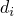, where the subscript *i* represents the *i*th damage system. The overall damage variable, *D*, is computed based on the individual  as explained in ["Evaluating overall damage when multiple criteria are active" in "Damage evolution and element removal for ductile metals," Section 24.2.3](pt05ch24s02abm43.md#usb-mat-cdamageevol-multcrit), for damage in bulk materials.

### Maximum degradation and choice of element removal

You have control over how Abaqus treats cohesive elements with severe damage. By default, the upper bound to the overall damage variable at a material point is . You can reduce this upper bound as discussed in ["Controlling element deletion and maximum degradation for materials with damage evolution" in "Section controls," Section 27.1.4](pt06ch27s01aus113.md#usb-elm-esectioncontrol-deletion). You can control what happens to the cohesive element when the damage reaches this limit, as discussed below.

By default, once the overall damage variable reaches 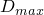 at all of its material points and none of its material points are in compression, the cohesive elements, except for the pore pressure cohesive elements, are removed (deleted). See ["Controlling element deletion and maximum degradation for materials with damage evolution" in "Section controls," Section 27.1.4](pt06ch27s01aus113.md#usb-elm-esectioncontrol-deletion), for details. This element removal approach is often appropriate for modeling complete fracture of the bond and separation of components. Once removed, cohesive elements offer no resistance to subsequent penetration of the components, so it may be necessary to model contact between the components as discussed in ["Defining contact between surrounding components" in "Modeling with cohesive elements," Section 32.5.3](pt06ch32s05alm42.md#usb-elm-ecohesiveusage-contact).

Alternatively, you can specify that a cohesive element should remain in the model even after the overall damage variable reaches . In this case the stiffness of the element in tension and/or shear remains constant (degraded by a factor of 1   over the initial undamaged stiffness). This choice is appropriate if the cohesive elements must resist interpenetration of the surrounding components even after they have completely degraded in tension and/or shear (see ["Defining contact between surrounding components" in "Modeling with cohesive elements," Section 32.5.3](pt06ch32s05alm42.md#usb-elm-ecohesiveusage-contact)). In Abaqus/Explicit it is recommended that you suppress bulk viscosity in the cohesive elements by setting the scale factors for the linear and quadratic bulk viscosity parameters to zero using section controls (see ["Section controls," Section 27.1.4](pt06ch27s01aus113.md)).

### Uncoupled transverse shear response

An optional linear elastic transverse shear behavior can be defined to provide additional stability to cohesive elements, particularly after damage has occurred. The transverse shear behavior is assumed to be independent of the regular material response and does not undergo any damage.

| **Input File Usage: ** | Use the following options: |
| --- | --- |
|  | ``` [*COHESIVE SECTION](../key/key-link.md#usb-kws-mcohesivesection), RESPONSE=TRACTION SEPARATION [*TRANSVERSE SHEAR STIFFNESS](../key/key-link.md#usb-kws-mtransshearstiff) ``` |

| **Abaqus/CAE Usage: ** | Transverse shear behavior is not supported in Abaqus/CAE for cohesive sections. |
| --- | --- |

### Viscous regularization in Abaqus/Standard

Material models exhibiting softening behavior and stiffness degradation often lead to severe convergence difficulties in implicit analysis programs, such as Abaqus/Standard. A common technique to overcome some of these convergence difficulties is the use of viscous regularization of the constitutive equations, which causes the tangent stiffness matrix of the softening material to be positive for sufficiently small time increments.

The traction-separation laws can be regularized in Abaqus/Standard using viscosity by permitting stresses to be outside the limits set by the traction-separation law. The regularization process involves the use of a viscous stiffness degradation variable, , which is defined by the evolution equation:


where  is the viscosity parameter representing the relaxation time of the viscous system and *D* is the degradation variable evaluated in the inviscid backbone model. The damaged response of the viscous material is given as

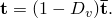

Using viscous regularization with a small value of the viscosity parameter (small compared to the characteristic time increment) usually helps improve the rate of convergence of the model in the softening regime, without compromising results. The basic idea is that the solution of the viscous system relaxes to that of the inviscid case as , where *t* represents time. You can specify the value of the viscosity parameter as part of the section controls definition (see ["Using viscous regularization with cohesive elements, connector elements, and elements that can be used with the damage evolution models for ductile metals and fiber-reinforced composites in Abaqus/Standard" in "Section controls," Section 27.1.4](pt06ch27s01aus113.md#usb-elm-esectioncontrol-viscosity)).  If the viscosity parameter is different from zero, output results of the stiffness degradation refer to the viscous value, . The default value of the viscosity parameter is zero so that no viscous regularization is performed. Use of viscous regularization for improving the convergence behavior of delamination and debonding problems is discussed in ["Delamination analysis of laminated composites," Section 2.7.1 of the Abaqus Benchmarks Guide](../bmk/bmk-link.md#bmk-elm-alfanodelamination), and ["Analysis of skin-stiffener debonding under tension," Section 1.4.5 of the Abaqus Example Problems Guide](../exa/exa-link.md#exa-sta-skinflangedebond).

The approximate amount of energy associated with viscous regularization over the whole model or over an element set is available using output variable ALLCD.

### Output

In addition to the standard output identifiers available in Abaqus (["Abaqus/Standard output variable identifiers," Section 4.2.1](pt02ch04s02abv01.md), and ["Abaqus/Explicit output variable identifiers," Section 4.2.2](pt02ch04s02xbv01.md)), the following variables have special meaning for cohesive elements with traction-separation behavior:

| STATUS | Status of element (the status of an element is 1.0 if the element is active, 0.0 if the element is not). |
| --- | --- |

| SDEG | Overall value of the scalar damage variable, *D*. |
| --- | --- |

| DMICRT | All damage initiation criteria components. |
| --- | --- |

| MAXSCRT | Maximum value of the nominal stress damage initiation criterion at a material point during the analysis. It is evaluated as 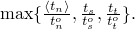 |
| --- | --- |

| MAXECRT | Maximum value of the nominal strain damage initiation criterion at a material point during the analysis. It is evaluated as 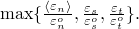 |
| --- | --- |

| MMIXDME | Mode mix ratio during damage evolution. It is evaluated as . In general, it varies with time at a given integration point. This variable is set to 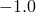 before initiation of damage. |
| --- | --- |

| MMIXDMI | Mode mix ratio at damage initiation. It is evaluated as  at the time of damage initiation at an integration point for the very first time. It remains constant with time at a given integration point. This variable is set to  before initiation of damage. |
| --- | --- |

| QUADSCRT | Maximum value of the quadratic nominal stress damage initiation criterion at a material point during the analysis. It is evaluated as  |
| --- | --- |

| QUADECRT | Maximum value of the quadratic nominal strain damage initiation criterion at a material point during the analysis. It is evaluated as 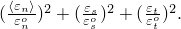 |
| --- | --- |

| ALLCD | The approximate amount of energy over the whole model or over an element set that is associated with viscous regularization in Abaqus/Standard. Corresponding output variables (such as CENER, ELCD, and ECDDEN) represent the energy associated with viscous regularization at the integration point level and element level (the last quantity represents the energy per unit volume in the element), respectively. |
| --- | --- |

For the variables above that indicate whether a certain damage initiation criterion has been satisfied or not, a value that is less than 1.0 indicates that the criterion has not been satisfied, while a value of 1.0 or higher indicates that the criterion has been satisfied. If damage evolution is specified for this criterion, the maximum value of this variable does not exceed 1.0. However, if damage evolution is not specified for the initiation criterion, this variable can have values higher than 1.0. The extent to which the variable is higher than 1.0 may be considered to be a measure of the extent to which this criterion has been violated.

#### Additional references

- Benzeggagh, M. L., and M. Kenane, "Measurement of Mixed-Mode Delamination Fracture Toughness of Unidirectional Glass/Epoxy Composites with Mixed-Mode Bending Apparatus," Composites Science and Technology, vol. 56, pp. 439--449, 1996.
- Camanho, P. P., and C. G. Davila, "Mixed-Mode Decohesion Finite Elements for the Simulation of Delamination in Composite Materials," NASA/TM-2002--211737, pp. 1--37, 2002.


