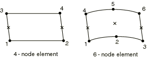
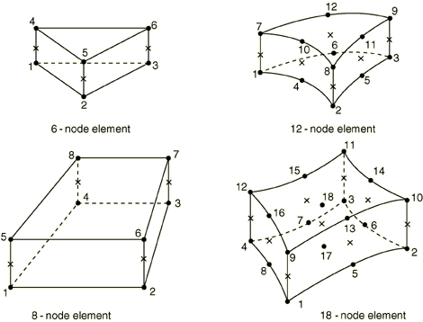

# 32.6.8 Three-dimensional gasket element library


**Products: **Abaqus/Standard  Abaqus/CAE  

##### **References**

- ["Gasket elements: overview," Section 32.6.1](pt06ch32s06abo30.md)
- ["Choosing a gasket element," Section 32.6.2](pt06ch32s06alm47.md)
- [*GASKET SECTION](../key/key-link.md#usb-kws-mgasketsection)

### Overview

This section provides a reference to the three-dimensional gasket elements available in Abaqus/Standard.

### Element types

#### Link elements

| GK3D2 | 2-node, three-dimensional gasket element |
| --- | --- |
|  |

| GK3D2N | 2-node, three-dimensional gasket element with thickness-direction behavior only |
| --- | --- |
|  |

##### Active degrees of freedom

1 for gasket elements with thickness-direction behavior only.

1, 2, 3 for other gasket elements.

##### Additional solution variables

None.

#### Line elements

| GK3D4L | 4-node, three-dimensional line gasket element |
| --- | --- |
|  |

| GK3D4LN | 4-node, three-dimensional line gasket element with thickness-direction behavior only |
| --- | --- |
|  |

| GK3D6L | 6-node, three-dimensional line gasket element |
| --- | --- |
|  |

| GK3D6LN | 6-node, three-dimensional line gasket element with thickness-direction behavior only |
| --- | --- |
|  |

##### Active degrees of freedom

1 for gasket elements with thickness-direction behavior only.

1, 2, 3 for other gasket elements.

##### Additional solution variables

None.

#### Area elements

| GK3D6 | 6-node, three-dimensional gasket element |
| --- | --- |
|  |

| GK3D6N | 6-node, three-dimensional gasket element with thickness-direction behavior only |
| --- | --- |
|  |

| GK3D8 | 8-node, three-dimensional gasket element |
| --- | --- |
|  |

| GK3D8N | 8-node, three-dimensional gasket element with thickness-direction behavior only |
| --- | --- |
|  |

| GK3D12M | 12-node, three-dimensional gasket element |
| --- | --- |
|  |

| GK3D12MN | 12-node, three-dimensional gasket element with thickness-direction behavior only |
| --- | --- |
|  |

| GK3D18 | 18-node, three-dimensional gasket element |
| --- | --- |
|  |

| GK3D18N | 18-node, three-dimensional gasket element with thickness-direction behavior only |
| --- | --- |
|  |

##### Active degrees of freedom

1 for gasket elements with thickness-direction behavior only.

1, 2, 3 for other gasket elements.

##### Additional solution variables

None.

### Nodal coordinates required


### Element property definition

You must define the element's initial gap and initial void, as well as the cross-sectional area (for link elements) or width (for line elements).

You can specify the thickness direction as part of the gasket section definition or by specifying a normal direction at the nodes; you can specify the element thickness as part of the gasket section definition. Otherwise, Abaqus/Standard will calculate the thickness direction and the thickness. For link elements the thickness direction is the direction from the first to the second node and the thickness is the distance between the nodes. For line elements the thickness direction is the direction from the bottom node to the top node associated with the integration point and the thicknesses are the distances between these same bottom and top nodes. For area elements the thickness direction is based on the midsurface of the element and the thicknesses at the integration points are based on the nodal positions. See ["Defining the gasket element's initial geometry," Section 32.6.4](pt06ch32s06alm49.md), for more details.

| **Input File Usage: ** | ``` [*GASKET SECTION](../key/key-link.md#usb-kws-mgasketsection) ``` |
| --- | --- |

| **Abaqus/CAE Usage: ** | Property module: **Create Section**: select **Other** as the section **Category** and **Gasket** as the section **Type** |
| --- | --- |

### Element-based loading

None.

### Element output

#### GK3D2 elements

| S11 | Pressure or thickness-direction force in the gasket element. |
| --- | --- |

| CS11 | Contact pressure in the gasket element (only available if S11 is a force and the gasket response is not defined using a material model). |
| --- | --- |

| S12 | Shear stress or shear force. |
| --- | --- |

| S13 | Shear stress or shear force. |
| --- | --- |

| E11 | Gasket closure if the gasket response is defined directly using a gasket behavior model; strain if the gasket response is defined using a material model. |
| --- | --- |

| E12 | Shear motion if the gasket response is defined directly using a gasket behavior model; strain if the gasket response is defined using a material model. |
| --- | --- |

| E13 | Shear motion if the gasket response is defined directly using a gasket behavior model; strain if the gasket response is defined using a material model. |
| --- | --- |

| NE11 | Effective thickness-direction strain in the gasket element. |
| --- | --- |

| NE12 | Effective shear strain. |
| --- | --- |

| NE13 | Effective shear strain. |
| --- | --- |

#### GK3D2N elements

| S11 | Pressure or thickness-direction force in the gasket element. |
| --- | --- |

| CS11 | Contact pressure in the gasket element (only available if S11 is a force and the gasket response is not defined using a material model.) |
| --- | --- |

| E11 | Gasket closure if the gasket response is defined directly using a gasket behavior model; strain if the gasket response is defined using a material model. |
| --- | --- |

| NE11 | Effective thickness-direction strain in the gasket element. |
| --- | --- |

#### Line elements with thickness-direction behavior only

| S11 | Pressure or thickness-direction force per unit length in the gasket element. |
| --- | --- |

| CS11 | Contact pressure in the gasket element (only available if S11 is a force per unit length and the gasket response is not defined using a material model). |
| --- | --- |

| E11 | Gasket closure if the gasket response is defined directly using a gasket behavior model; strain if the gasket response is defined using a material model. |
| --- | --- |

| NE11 | Effective thickness-direction strain in the gasket element. |
| --- | --- |

#### Other line elements

| S11 | Pressure or thickness-direction force per unit length in the gasket element. |
| --- | --- |

| CS11 | Contact pressure in the gasket element (only available if S11 is a force per unit length and the gasket response is not defined using a material model). |
| --- | --- |

| S22 | Direct membrane stress. |
| --- | --- |

| S12 | Shear stress or shear force per unit length. |
| --- | --- |

| S13 | Shear stress or shear force per unit length. |
| --- | --- |

| E11 | Gasket closure if the gasket response is defined directly using a gasket behavior model; strain if the gasket response is defined using a material model. |
| --- | --- |

| E22 | Direct membrane strain. |
| --- | --- |

| E12 | Shear motion if the gasket response is defined directly using a gasket behavior model; strain if the gasket response is defined using a material model. |
| --- | --- |

| E13 | Shear motion if the gasket response is defined directly using a gasket behavior model; strain if the gasket response is defined using a material model. |
| --- | --- |

| NE11 | Effective thickness-direction strain in the gasket element. |
| --- | --- |

| NE22 | Direct membrane strain. |
| --- | --- |

| NE12 | Effective shear strain. |
| --- | --- |

| NE13 | Effective shear strain. |
| --- | --- |

#### Area elements with thickness-direction behavior only

| S11 | Pressure in the gasket element. |
| --- | --- |

| E11 | Gasket closure if the gasket response is defined directly using a gasket behavior model; strain if the gasket response is defined using a material model. |
| --- | --- |

| NE11 | Effective thickness-direction strain in the gasket element. |
| --- | --- |

#### Other area elements

| S11 | Pressure in the gasket element. |
| --- | --- |

| S22 | Direct membrane stress. |
| --- | --- |

| S33 | Direct membrane stress. |
| --- | --- |

| S12 | Transverse shear stress. |
| --- | --- |

| S13 | Transverse shear stress. |
| --- | --- |

| S23 | Membrane shear stress. |
| --- | --- |

| E11 | Gasket closure if the gasket response is defined directly using a gasket behavior model; strain if the gasket response is defined using a material model. |
| --- | --- |

| E22 | Direct membrane strain. |
| --- | --- |

| E33 | Direct membrane strain. |
| --- | --- |

| E12 | Transverse shear motion if the gasket response is defined directly using a gasket behavior model; strain if the gasket response is defined using a material model. |
| --- | --- |

| E13 | Transverse shear motion if the gasket response is defined directly using a gasket behavior model; strain if the gasket response is defined using a material model. |
| --- | --- |

| E23 | Membrane shear strain. |
| --- | --- |

| NE11 | Effective thickness-direction strain in the gasket element. |
| --- | --- |

| NE22 | Direct membrane strain. |
| --- | --- |

| NE33 | Direct membrane strain. |
| --- | --- |

| NE12 | Effective shear strain. |
| --- | --- |

| NE13 | Effective shear strain. |
| --- | --- |

| NE12 | Membrane shear strain. |
| --- | --- |

### Node ordering and integration point numbering

#### Link elements


#### Line elements



#### Area elements



Integration points are indicated with an X and have the same numbers as the bottom face nodes, except that the point between nodes 17 and 18 in the 18-node gasket element is integration point number 9.


