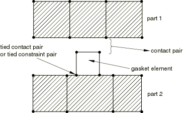
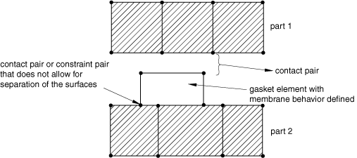
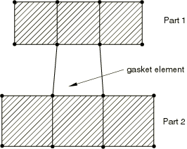

# 32.6.3 Including gasket elements in a model

**Products: **Abaqus/Standard  Abaqus/CAE  

##### **References**

- ["Gasket elements: overview," Section 32.6.1](pt06ch32s06abo30.md)
- ["Choosing a gasket element," Section 32.6.2](pt06ch32s06alm47.md)
- ["Contact interaction analysis: overview," Section 36.1.1](pt09ch36s01abo33.md)
- ["General multi-point constraints," Section 35.2.2](pt08ch35s02aus130.md)
- [Chapter 32, "Gaskets," of the Abaqus/CAE User's Guide](../usi/usi-link.md#usi-adv-gasket)

### Overview

Gasket elements:
- are used to model gaskets and other seals between two components, each of which may be deformable or rigid; and
- are connected to the adjacent components by sharing nodes, by using surface-based tie constraints, by using MPCs type TIE or PIN, or by using contact pairs.

This section discusses the techniques that are available to discretize gaskets and assemble them in a model representing several components, such as an internal combustion engine. The methods described all apply to gasket elements that have all displacement degrees of freedom active at their nodes. For the most part they also apply to gasket elements with only thickness-direction behavior; exceptions are discussed later in this section.

### Discretizing gaskets using gasket elements

Gaskets are generally manufactured as independent components. The gasket behavior is usually measured by performing a compression experiment on the gasket. In this case the gasket can be discretized as a single layer of gasket elements.

Gaskets are sometimes made of several layers of materials. If the behavior of the gasket is obtained by compression testing of the entire gasket, the gasket can again be discretized as a single layer of gasket elements. However, if the behavior of the gasket is obtained by compression testing of each layer constituting the gasket, the gasket can be discretized with a corresponding set of layers of gasket elements.

#### Discretizing gaskets with multiple layers

If layers of gasket elements are used in the thickness direction and these layers do not have the same element layout in the plane of the gasket, use surface-based tie constraints, mesh refinement MPCs, or tied contact pairs to connect the different layers of the gasket. If tied contact pairs are used, assign a positive value to the adjustment zone depth, *a*, for the contact pairs (see ["Adjusting initial surface positions and specifying initial clearances in Abaqus/Standard contact pairs," Section 36.3.5](pt09ch36s03aus149.md)) so that all slave nodes are properly tied at the beginning of the analysis.

### Assembling gaskets to other components in a model

The easiest method to connect gasket elements that use all displacement components at their nodes to other components in a model is to define the mesh so that the gasket elements can share nodes with the elements on the surfaces of the adjacent components. More generally, when the gasket mesh is not matched to the meshing of the surfaces of the adjacent components or when the gasket elements that consider only thickness-direction behavior are used, gasket elements can be connected to other components by using contact pairs.

#### Connecting gaskets to other components by using contact pairs or surface-based constraints

Gaskets are usually composed of materials that are softer than the materials that compose the neighboring components. In addition, the discretization of gaskets will usually be finer than the discretization of neighboring parts. These two facts suggest that the contacting surfaces of a gasket should be the slave surfaces and that the contacting surfaces of neighboring parts should be the master surfaces. The second consideration also suggests that mismatched meshes will often be used in analyses involving gaskets. If mismatched meshes are used, the pressure distribution on a compressed gasket may not be predicted accurately; submodeling (["Submodeling: overview," Section 10.2.1](pt04ch10s02aus60.md)) may be required to obtain accurate local results. Two techniques are available to connect gasket elements to other parts in the model when surface-based constraints are used.

##### Using a regular contact pair and a tied contact pair or a surface-based constraint

This technique is required when the gasket membrane behavior is not defined. Use a tied contact pair (["Defining tied contact in Abaqus/Standard," Section 36.3.7](pt09ch36s03aus151.md)) or a tie constraint (["Mesh tie constraints," Section 35.3.1](pt08ch35s03aus132.md)) on one side of the gasket and a regular contact pair on the other side, as shown in [Figure 32.6.3--1](pt06ch32s06alm48.md#egasket-contact-tied). 

**Figure 32.6.3–1** Connecting gaskets to other parts using contact pairs.

Because a regular contact pair is used on one side of the gasket, tensile stresses cannot develop in the gasket thickness direction should the components surrounding the gasket be pulled apart.

Assign a positive value to the adjustment zone depth, *a*, for the tied contact pair (see ["Adjusting initial surface positions and specifying initial clearances in Abaqus/Standard contact pairs," Section 36.3.5](pt09ch36s03aus149.md)) or, if necessary, specify a position tolerance for the tie constraint (see ["Mesh tie constraints," Section 35.3.1](pt08ch35s03aus132.md)) so that all slave nodes are properly tied at the beginning of the analysis. This technique allows for frictional slip on only one side of the gasket.

##### Using a regular contact pair and a contact pair that does not allow separation

This technique allows for frictional slip to be transmitted on both sides of the gasket. It is recommended when membrane behavior is defined for the gasket since it allows for the gasket membrane to stretch or contract as a result of frictional effects considered on both sides of the gasket. A contact pair or a constraint pair that does not allow for separation of the surfaces (["Contact pressure-overclosure relationships," Section 37.1.2](pt09ch37s01aus166.md)) should be used on one side of the gasket and a regular contact pair on the other, as shown in [Figure 32.6.3--2](pt06ch32s06alm48.md#egasket-contact-nosepara). 

**Figure 32.6.3–2** Connecting gaskets to other parts when the gasket membrane behavior is defined.

Assign a positive value to the adjustment zone depth, *a*, for the contact pair (see ["Adjusting initial surface positions and specifying initial clearances in Abaqus/Standard contact pairs," Section 36.3.5](pt09ch36s03aus149.md)) so that the surfaces are in contact at the beginning of the analysis. Use the no separation contact pressure-overclosure relationship (see ["Contact pressure-overclosure relationships," Section 37.1.2](pt09ch37s01aus166.md)) so that these surfaces do not separate during the analysis. This technique will prevent rigid body modes of the gasket in its thickness direction. You may still need to prevent rigid body modes in the plane of the gasket until frictional forces develop between the gasket and the adjacent components.

#### Having gasket elements share nodes with other elements

When the gaskets and their neighboring parts have matched meshes, it is straightforward to connect gaskets to other components in a model simply by sharing nodes (see [Figure 32.6.3--3](pt06ch32s06alm48.md#egasket-share-node)). 

**Figure 32.6.3–3** Gasket elements sharing nodes with other Abaqus elements.

This method of connecting gaskets to other components is suited for cases when no frictional slip occurs between the gasket and the other components. It can be used whether or not the membrane behavior of the gasket elements is defined; however, if the gasket membrane behavior is defined, using a contact pair approach will lead to more realistic results since the difference in membrane stiffness between the gasket and its neighboring parts may lead to frictional slip. The method of sharing nodes will also lead to some small tensile stresses in the gasket should the parts connected to the gasket be pulled apart, as a result of the numerical stabilization technique added to the gasket thickness-direction behavior (see ["Defining the gasket behavior directly using a gasket behavior model," Section 32.6.6](pt06ch32s06alm51.md)). The contact pair approach will avoid such tensile stresses. This node-sharing approach cannot be used with the gasket elements that consider only thickness-direction behavior.

### Using gasket elements that model thickness-direction behavior only

In general, the modeling techniques discussed earlier can be used with gasket elements that model thickness-direction behavior only. However, these elements have only one displacement degree of freedom per node and cannot share nodes with elements that have all displacement degrees of freedom active at a node. They can, however, share nodes with other gasket elements that model thickness-direction behavior only.

#### Discretizing a gasket with gasket elements that model thickness-direction behavior only

When discretizing a gasket with several layers of gasket elements along the gasket direction, it is recommended that all the nodes belonging to a cross-section of the gasket have the same thickness direction (see [Figure 32.6.3--4](pt06ch32s06alm48.md#egasket-layer-crosssection)). An approximate solution will be generated if the thickness direction changes, since only the magnitude of the force is transmitted from one gasket element to the next through the thickness of the gasket.

**Figure 32.6.3–4** Discretizing a gasket using several layers of elements with thickness-direction behavior only.

#### Connecting gaskets to other components when gasket elements with thickness-direction behavior only are chosen

Contact pairs can be used to connect the gasket mesh to adjacent components, as explained above, but only frictionless, small-sliding contact can be used.

MPC type PIN or TIE can also be used to connect a one degree of freedom node of a gasket element to another coincident node that has all its displacement degrees of freedom active (see [Figure 32.6.3--5](pt06ch32s06alm48.md#egasket-mpc-pin)). Abaqus/Standard automatically constrains the single displacement degree of freedom node to the global displacements of the other node. 

Surface-based tie constraints cannot be used to connect gasket elements that model thickness-direction behavior only.

**Figure 32.6.3–5** Connecting gasket elements with thickness-direction behavior only to other parts by using MPCs.

### Additional considerations when using gasket elements

Several cases require special consideration when using gasket elements.

#### Using gasket elements in large-displacement analyses

Gasket elements are small-strain, small-displacement elements. They can be used in large-displacement analyses. However, the local directions of the gasket elements are not updated with the solution, so incorrect results will be generated if the assembly containing the gasket elements undergoes any significant amount of rotation.

#### Using 12-node gasket elements

These elements are primarily for use when the adjacent components are modeled with modified 10-node tetrahedral elements (element type C3D10M). When the contact pair approach is used, such elements can also be placed adjacent to other three-dimensional solid continuum elements; however, if the meshes are badly mismatched, the solution may be noisy.

#### Using 18-node gasket elements

These elements are intended to share nodes with 21 to 27-node brick elements. They can also be connected to a mesh composed of 21 to 27-node brick elements or a mesh composed of 20-node brick elements when the contact pair approach is used. 

Abaqus/Standard allows the node numbers and the coordinates of the midface nodes in the 18-node gasket elements to be generated automatically if the faces are part of contact surfaces, similar to the way that midface nodes are generated for 20-node brick element faces on which a contact surface is defined. This feature is invoked by leaving the entries for nodes 17 and 18 in the element connectivity blank.

#### Using the three-dimensional line gasket elements

Three-dimensional line gasket elements are typically used to model narrow, thicker features in gaskets, such as an elastomeric insert around a hole. A typical mesh for such a case is presented in [Figure 32.6.3--6](pt06ch32s06alm48.md#egasket-insert-line). The gasket is discretized mainly with three-dimensional area elements. The insert is modeled with three-dimensional line elements that may or may not be connected to the area elements. These gasket elements are connected to surrounding components using two sets of contact pairs, and the area elements will typically have initial gaps specified in the gasket property definition so that the thicker inserts develop pressure on contact before the area elements do.

**Figure 32.6.3–6** Typical use of three-dimensional line gasket elements to model inserts in gaskets.

If three-dimensional line gasket elements that have all displacement degrees of freedom active at their nodes are used to discretize a gasket and the local 3-direction is the same at all the nodes of these elements (this is the case when all elements lie in a plane), the nodes of these elements can move in the local 3-direction without creating any strain in the elements (see ["Defining the gasket behavior directly using a gasket behavior model," Section 32.6.6](pt06ch32s06alm51.md), for additional details about the local direction of three-dimensional line elements). In such a case you should make sure that these elements are restrained properly in the local 3-direction.

