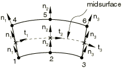
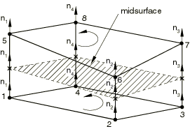

# 32.6.4 Defining the gasket element's initial geometry


**Products: **Abaqus/Standard  Abaqus/CAE  

##### **References**

- ["Gasket elements: overview," Section 32.6.1](pt06ch32s06abo30.md)
- [*GASKET SECTION](../key/key-link.md#usb-kws-mgasketsection)
- ["Creating gasket sections," Section 12.13.15 of the Abaqus/CAE User's Guide](../usi/usi-link.md#usi-prp-section-gasket)

### Overview

The initial gasket geometry:
- is defined by the nodal coordinates of the element; and
- is also defined by the thickness direction and initial thickness, each of which can be calculated by Abaqus/Standard or user-defined.

### Defining the element geometry

A gasket element is basically composed of two surfaces (a bottom and a top surface) separated by the gasket thickness. The element has nodes on its bottom face and corresponding nodes on its top face.

Two methods are available to define the element geometry.

#### By defining the element's nodes

You can define the geometry of the gasket element by defining the coordinates of all the element's nodes. You can define elements with constant or varying thickness. If the gasket element is very thin in comparison to dimensions in its surfaces, the thickness of the element calculated from the nodal coordinates may be inaccurate. In this case you can specify a constant thickness directly.

#### By defining the bottom surface of the element

You can specify a list of only the nodes on the bottom surface of the gasket element and the positive offset number that will be used to define the corresponding nodes on the top surface of the gasket element. Abaqus/Standard will create the nodes of the top face coincident with those of the bottom face unless the nodes of the top face have already been assigned coordinates. If the bottom and top nodes coincide, you must specify the thickness of the gasket element.

#### Specifying the element thickness

You can specify the gasket element thickness as part of its section property definition.

| **Input File Usage: ** | ``` [*GASKET SECTION](../key/key-link.md#usb-kws-mgasketsection) *thickness* ``` |
| --- | --- |

| **Abaqus/CAE Usage: ** | Property module: **Create Section**: select **Other** as the section **Category** and **Gasket** as the section **Type**: **Initial thickness: Specify:** *thickness* |
| --- | --- |

#### Additional quantities needed to specify the element geometry

For three-dimensional area elements, the element geometry is defined entirely by the location of the top and bottom surfaces and the element thickness. For two- and three-dimensional link elements (elements with two nodes, one on each face) you should specify the cross-sectional area of the element. For axisymmetric link elements you should specify the width of the element. For general two-dimensional elements the out-of-plane thickness is required. For three-dimensional line elements you should also specify the width of the element. This additional information is specified as part of the gasket section property definition; if it is not specified but is needed, it is assumed to have a value of 1.0.

| **Input File Usage: ** | ``` [*GASKET SECTION](../key/key-link.md#usb-kws-mgasketsection) , , , *additional geometric data (cross-sectional area, width, or out-of-plane thickness)* ``` |
| --- | --- |

| **Abaqus/CAE Usage: ** | Property module: **Create Section**: select **Other** as the section **Category** and **Gasket** as the section **Type**: **Cross-sectional area, width, or out-of-plane thickness:** *additional geometric data* |
| --- | --- |

### Default element thickness-direction definition

Gaskets are usually manufactured to have a desired behavior in their thickness direction. Therefore, it is important to define the thickness directions of gasket elements accurately. Abaqus/Standard computes these directions by default. The method that Abaqus/Standard uses depends on the gasket element type.

#### Link elements

Abaqus/Standard computes the thickness direction for a two-dimensional, three-dimensional, or axisymmetric link element by subtracting the coordinates of node 1 from those of node 2, as shown in [Figure 32.6.4--1](pt06ch32s06alm49.md#egasket-link-normal). The computed thickness direction is then assigned to each node. If the gasket element is very thin, the thickness direction may not be predicted accurately. You can overwrite this direction, as explained below in ["Specifying the thickness direction explicitly](pt06ch32s06alm49.md#usb-elm-egasketinit-thicknessdir-specify).”

**Figure 32.6.4–1** Thickness direction for a link element.


#### Two-dimensional and axisymmetric elements

To compute the thickness direction for two-dimensional and axisymmetric elements, Abaqus/Standard forms a midsurface by averaging the coordinates of the node pairs forming the bottom and top surfaces of the element. This midsurface passes through the integration points of the element, as shown in [Figure 32.6.4--2](pt06ch32s06alm49.md#egasket-2d-axi-normal). For each integration point Abaqus/Standard computes a tangent whose direction is defined by the sequence of nodes given on the bottom and top surfaces. The thickness direction is then obtained as the cross product of the out-of-plane and tangent directions. The thickness direction computed at each integration point is then assigned to the nodes on either side of the integration point.

**Figure 32.6.4–2** Thickness direction for a two-dimensional or axisymmetric element.



#### Three-dimensional area elements

To compute the thickness direction for three-dimensional area elements, Abaqus/Standard forms a midsurface by averaging the coordinates of the node pairs forming the bottom and top surfaces of the element. This midsurface passes through the integration points of the element, as shown in [Figure 32.6.4--3](pt06ch32s06alm49.md#egasket-3d-normal). Abaqus/Standard computes the thickness direction to the midsurface at each integration point; the positive direction is obtained with the right-hand rule going around the nodes of the element on the bottom or top surface. The thickness direction computed at each integration point is assigned to the nodes on either side of the integration point.

**Figure 32.6.4–3** Thickness direction for a three-dimensional area element.



#### Three-dimensional line elements

To compute the thickness direction for three-dimensional line elements, Abaqus/Standard computes the thickness direction at each integration point of the line element by differencing the coordinates of the element's surface nodes associated with the integration point. The thickness direction will point from the node on the bottom face to the node on the top face of the element. The thickness direction computed at each integration point is then assigned to the nodes on either side of the integration point (see [Figure 32.6.4--4](pt06ch32s06alm49.md#egasket-3d-line-normal)). 

**Figure 32.6.4–4** Thickness direction for a three-dimensional line element.


If the gasket element is very thin, the computation of the thickness direction may not be accurate. You can overwrite this definition as explained below in ["Specifying the thickness direction explicitly](pt06ch32s06alm49.md#usb-elm-egasketinit-thicknessdir-specify).”

### Creating a smooth gasket

Gasket elements can be used in a single layer or can be stacked in multiple layers (see ["Including gasket elements in a model," Section 32.6.3](pt06ch32s06alm48.md), for further details). The thickness directions computed at the nodes of gasket elements on an element-by-element basis are averaged at nodes shared by two or more gasket elements. This averaging process ensures that, if the gasket is not planar, it has a thickness direction that varies smoothly even though the gasket has been discretized by elements. You must ensure that the connectivities of the elements are such that the thickness direction does not reverse from one element to the next for this process to work properly. Once the averaging process is complete, the thickness directions at the nodes of a given element may vary significantly along the gasket midsurface and through its thickness, as shown in [Figure 32.6.4--5](pt06ch32s06alm49.md#egasket-normal-avg). The thickness directions at any of the nodes of an element should not vary in direction by more than 20. In addition, the thickness directions of two associated nodes through the thickness direction should not vary in direction by more than 5. Abaqus/Standard will require that the gasket be remeshed when such conditions are not met.

**Figure 32.6.4–5** Result of the averaging process.


#### Specifying the thickness direction explicitly

For cases when the above averaging process is not satisfactory, two methods are provided to specify the thickness direction of gasket elements.

##### Specifying the thickness direction as part of the gasket section definition

You can specify the components of the thickness direction as part of the gasket section definition. In this case all nodes of the gasket elements using this section definition are assigned the same thickness direction. The thickness direction specified at the nodes of the element will be averaged at nodes shared by two or more elements.

| **Input File Usage: ** | ``` [*GASKET SECTION](../key/key-link.md#usb-kws-mgasketsection) , , , , *component 1*, *component 2*, *component 3* ``` |
| --- | --- |

| **Abaqus/CAE Usage: ** | You cannot specify the gasket thickness direction in Abaqus/CAE. |
| --- | --- |

##### Specifying the thickness direction by specifying a normal direction at the nodes

You can define the thickness direction at a particular integration point of a gasket element by specifying a normal direction for the node on the bottom face of the element that is associated with the integration point (see ["Normal definitions at nodes," Section 2.1.4](pt01ch02s01aus08.md)). The thickness direction will not be averaged if this node belongs to more than one element. The thickness direction specified at the bottom node will also be assigned at the top node associated with the same integration point. This thickness direction will not be averaged if the top node belongs to more than one element; however, you can overwrite this thickness direction by specifying a normal at this node if it is the bottom node of another element. This last situation can occur only in cases when gasket elements are stacked up through the thickness direction of the gasket. If this method is used to specify conflicting thickness directions at the same node, Abaqus/Standard will issue an error message. Thickness directions specified using this method will overwrite any thickness directions specified at a gasket node as part of the gasket section definition.

| **Input File Usage: ** | ``` [*NORMAL](../key/key-link.md#usb-kws-mnormal) ``` |
| --- | --- |

| **Abaqus/CAE Usage: ** | User-specified nodal normals are not supported in Abaqus/CAE. |
| --- | --- |

#### Creating fold lines

It is possible to introduce a fold line in a gasket by creating gaskets with coincident nodes and using MPC type TIE or PIN (["General multi-point constraints," Section 35.2.2](pt08ch35s02aus130.md)) to constrain the displacement of these nodes. However, fold lines are rarely needed in the analysis of gaskets, since almost all gaskets are manufactured with smoothly varying surfaces.

#### Verifying the thickness direction

Thickness direction definitions can be checked by examining the analysis input file processor output. The direction cosines of the thickness directions obtained at the nodes of gasket elements are listed under `GASKET THICKNESS DIRECTIONS` in the data (`.dat`) file.

### Specifying an initial gap and an initial void in the thickness direction of a gasket element

The construction of gaskets in their through-thickness direction may be complex; for example, certain automotive gaskets are usually composed of several layers of metal and/or elastomeric inserts, and it is likely that the layers do not all touch until the gasket is compressed. The inter-layer spaces in a gasket are referred to in Abaqus as the initial void. The initial void is used only for calculating thermal strain and creep strain. It is also possible that the gasket surface geometry is such that pressure will not start building up until the gasket has been compressed by a certain amount. The gasket closure that is needed to generate a pressure is referred to in Abaqus as the initial gap. [Figure 32.6.4--6](pt06ch32s06alm49.md#egasket-init-gap-void) shows a schematic representation of the initial gap and initial void in a typical gasket. You can specify both the initial gap and initial void as part of the gasket section property definition. The initial thickness of the element should include the initial gap and the initial void.

**Figure 32.6.4–6** Schematic representation of an initial gap and an initial void in a typical gasket.


| **Input File Usage: ** | ``` [*GASKET SECTION](../key/key-link.md#usb-kws-mgasketsection) , *initial gap*, *initial void* ``` |
| --- | --- |

| **Abaqus/CAE Usage: ** | Property module: **Create Section**: select **Other** as the section **Category** and **Gasket** as the section **Type**: **Initial gap:** *initial gap*, **Initial void:** *initial void* |
| --- | --- |

### Stability of unsupported gasket elements

Gasket elements that extend outside neighboring components (unsupported gasket elements) can be troublesome and should be avoided. If a gasket element is completely or partially unsupported, incorrect areas can result in an incorrect stiffness, and numerical singularity problems can occur in the equation solver. Minor extensions (caused by numerical roundoff in mesh generation) will not usually cause a problem because Abaqus/Standard automatically extends the master surfaces a small amount beyond the edge of the model. Numerical problems can occur in the direction tangential to the gasket (if general gasket elements are used and no membrane stiffness is specified) as well as in the direction normal to the gasket. The numerical singularity problems normal to the gasket can be treated by stabilizing the elements with a small artificial stiffness. By default, Abaqus/Standard automatically applies a small stabilization stiffness (on the order of 109 times the initial compressive stiffness in the thickness direction) to all types of gasket elements except the link elements. For persistent numerical singularity problems in unsupported gasket elements the following treatment methods can be considered. First, make sure that an adequate membrane elasticity is specified. Second, specify a higher value for the artificial stiffness for the gasket section. If problems still persist, consider trimming, “skinning,” and using MPCs (see ["General multi-point constraints," Section 35.2.2](pt08ch35s02aus130.md)).

| **Input File Usage: ** | Use the following option to change the artificial stiffness for a gasket section: |
| --- | --- |
|  | ``` [*GASKET SECTION](../key/key-link.md#usb-kws-mgasketsection), STABILIZATION STIFFNESS=*stiffness_value* ``` |

| **Abaqus/CAE Usage: ** | Use the following option to change the artificial stiffness for a gasket section: |
| --- | --- |
|  | Property module: **Create Section**: select **Other** as the section **Category** and **Gasket** as the section **Type**: **Stabilization stiffness: Specify:** *stiffness_value* |


