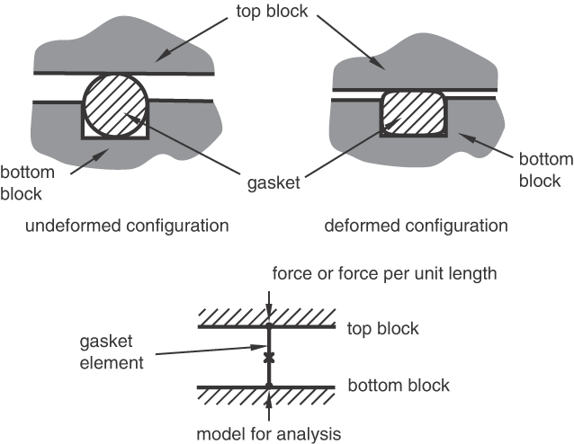
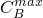
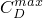
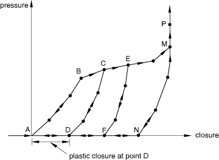
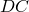
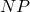
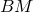
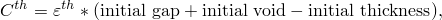
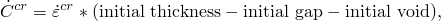
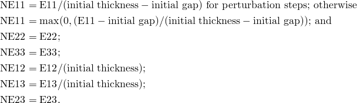

# 32.6.6 Defining the gasket behavior directly using a gasket behavior model


**Products: **Abaqus/Standard  Abaqus/CAE  

##### **References**

- ["Gasket elements: overview," Section 32.6.1](pt06ch32s06abo30.md)
- ["Defining the gasket element's initial geometry," Section 32.6.4](pt06ch32s06alm49.md)
- ["Defining gasket behavior," Section 12.12.4 of the Abaqus/CAE User's Guide](../usi/usi-link.md#usi-prp-other-gasket)

### Overview

The gasket behavior defined by a gasket behavior model:
- can be specified in terms of uncoupled thickness direction, membrane, and transverse shear behavior only;
- can be nonlinear elastic with damage or nonlinear elastic-plastic in the thickness direction;
- can consider creep effects in the thickness direction when rate-independent elastic-plastic modeling is used;
- can consider the dynamic stiffness and damping characteristics in the thickness direction when elastic-damage modeling is used;
- will be linear elastic in the membrane and transverse shear directions; and
- can consider thermal effects in the thickness and membrane directions.

### Assigning a gasket behavior to a gasket element

To define the gasket behavior by a gasket behavior model, you must assign a gasket section definition to a region of your model and assign the name of a gasket behavior definition to the gasket section definition. The gasket behavior for this region is defined entirely by the properties specified by the gasket behavior definition referring to the same name.

| **Input File Usage: ** | Use both of the following options to define the gasket behavior in terms of a gasket behavior model: |
| --- | --- |
|  | ``` [*GASKET SECTION](../key/key-link.md#usb-kws-mgasketsection), ELSET=*name*, BEHAVIOR=*name* [*GASKET BEHAVIOR](../key/key-link.md#usb-kws-mgasketbehavior), NAME=*name* ``` |

| **Abaqus/CAE Usage: ** | Property module: Material editor: **Name:** *name*, enter data for any materials found under ****Other****Gasket******Create Section**: select **Other** as the section **Category** and **Gasket** as the section **Type**: **Material:** *name* |
| --- | --- |

### Specifying a gasket behavior

The thickness-direction, transverse shear, and membrane behaviors are defined to be uncoupled. Each behavior is specified independently.

You must specify the thickness-direction behavior. You can specify multiple thickness-direction behaviors to define the loading and unloading characteristics. You can obtain an average contact pressure output when the thickness-direction behavior is defined as force or force per unit length versus closure.

The transverse shear and membrane behaviors are optional for gasket elements that have all displacement degrees of freedom active at their nodes. You can define one or both of these behaviors.

When thermal and rate-dependent effects are important, you can define thermal expansion and creep behavior for gaskets; user subroutines [`UEXPAN`](../sub/sub-link.md#sub-xsl-uexpan) and [`CREEP`](../sub/sub-link.md#sub-xsl-creep) can be used to define these behaviors.

You cannot specify density for gasket elements since they have no mass matrix.

| **Input File Usage: ** | Use the first two options and any of the following options to specify a gasket behavior: |
| --- | --- |
|  | ``` [*GASKET BEHAVIOR](../key/key-link.md#usb-kws-mgasketbehavior), NAME=*name* [*GASKET THICKNESS BEHAVIOR](../key/key-link.md#usb-kws-mgasketnormal) [*GASKET ELASTICITY](../key/key-link.md#usb-kws-mgasketelastic) [*GASKET CONTACT AREA](../key/key-link.md#usb-kws-mgasketcontactarea) [*EXPANSION](../key/key-link.md#usb-kws-mexpansion) [*CREEP](../key/key-link.md#usb-kws-mcreep) [*DEPVAR](../key/key-link.md#usb-kws-mdepvar) [*USER OUTPUT VARIABLES](../key/key-link.md#usb-kws-museroutputvar) ``` The [*GASKET THICKNESS BEHAVIOR](../key/key-link.md#usb-kws-mgasketnormal) option can be repeated to define the loading and unloading characteristics of the thickness-direction behavior. The [*GASKET ELASTICITY](../key/key-link.md#usb-kws-mgasketelastic) option can be repeated to define both transverse shear and membrane behaviors. The other options cannot be repeated within a single behavior definition. The order in which these options are specified has no importance, but they must appear immediately after the [*GASKET BEHAVIOR](../key/key-link.md#usb-kws-mgasketbehavior) option. |

| **Abaqus/CAE Usage: ** | Use the first option and any of the following options to specify a gasket behavior: |
| --- | --- |
|  | Property module: material editor: ****Other****Gasket****Gasket Thickness Behavior********Other****Gasket****Gasket Transverse Shear Elasticity**** and/or **Gasket ****Membrane Elasticity******Mechanical****Expansion********Mechanical****Plasticity****Creep********General****Depvar********General****User Output Variables**** |

### Defining the thickness-direction behavior of the gasket

To define the thickness-direction behavior of gaskets, Abaqus/Standard offers a nonlinear elastic model with damage and a nonlinear elastic-plastic model with the possibility of considering creep effects. Thermal effects in the thickness direction can also be accounted for.

Abaqus/Standard measures the thickness-direction deformation as the closure between the bottom and top faces of the gasket element; therefore, the thickness-direction behavior must always be defined in terms of closure. The closure is the sum of the elastic closure, plastic closure, creep closure, thermal closure, plus any initial gap in the thickness direction. As explained below, the behavior can be defined as pressure versus closure, force versus closure, or force per unit length versus closure. In all cases the thickness-direction behavior can be defined as a function of temperature and/or field variables.

| **Input File Usage: ** | ``` [*GASKET THICKNESS BEHAVIOR](../key/key-link.md#usb-kws-mgasketnormal), DEPENDENCIES ``` |
| --- | --- |

| **Abaqus/CAE Usage: ** | Property module: material editor: ****Other****Gasket****Gasket Thickness Behavior**** |
| --- | --- |

#### Choosing a unit system used to define the thickness-direction behavior

The thickness-direction behavior can be defined in terms of pressure versus closure, force versus closure, or force per unit length versus closure.

##### Prescribing the thickness-direction behavior as pressure versus closure

You can define the thickness-direction behavior in terms of pressure and closure for all gasket element types. The pressure is available for output or visualization.

| **Input File Usage: ** | ``` [*GASKET THICKNESS BEHAVIOR](../key/key-link.md#usb-kws-mgasketnormal), VARIABLE=STRESS ``` |
| --- | --- |

| **Abaqus/CAE Usage: ** | Property module: material editor: ****Other****Gasket****Gasket Thickness Behavior****: **Units: Stress** |
| --- | --- |

##### Prescribing the thickness-direction behavior as force or force per unit length versus closure

You can define the thickness-direction behavior in terms of force or force per unit length and closure only for link elements and three-dimensional line elements. This method is suited for cases where the gasket cross-section in the 1–2 or 1–3 plane varies greatly with deformation because it would be too expensive to model such a deformation with a full two- or three-dimensional model. In such cases a model with link elements or three-dimensional line elements can give meaningful answers as long as the deformation is quantified in terms of force or force per unit length (see [Figure 32.6.6--1](pt06ch32s06alm51.md#egasket-complex-def)).

**Figure 32.6.6–1** Modeling complex deformations with link or three-dimensional line elements.



When using two- or three-dimensional link elements, you must specify the thickness-direction behavior as force versus closure. When using axisymmetric link elements or three-dimensional line elements, you must specify the thickness-direction behavior as force per unit length versus closure.

| **Input File Usage: ** | ``` [*GASKET THICKNESS BEHAVIOR](../key/key-link.md#usb-kws-mgasketnormal), VARIABLE=FORCE ``` |
| --- | --- |

| **Abaqus/CAE Usage: ** | Property module: material editor: ****Other****Gasket****Gasket Thickness Behavior****: **Units: Force** |
| --- | --- |

#### Defining a nonlinear elastic model with damage

The nonlinear elastic model with damage is illustrated in [Figure 32.6.6--2](pt06ch32s06alm51.md#egasket-elastic-damage). 

**Figure 32.6.6–2** Elastic model with damage.


As the gasket is compressed, the pressure (or force, or force per unit length) follows the path given by the loading curve. If the gasket is unloaded, for example at point *B*, the pressure follows the unloading curve . Reloading after unloading follows the unloading curve  until the loading is such that the closure becomes greater than , after which the loading path follows the loading curve . The arrows shown in the figure illustrate the loading/unloading paths of this model.

##### Defining the loading curve

To define the loading curve in piecewise linear form, you provide data points of pressure versus elastic closure, starting with point *A*. For negative elastic closures, the model gives zero pressure (or force). For closures larger than the last user-specified closure, the pressure-closure relationship is extrapolated based on the last slope computed from the user-specified data.

| **Input File Usage: ** | ``` [*GASKET THICKNESS BEHAVIOR](../key/key-link.md#usb-kws-mgasketnormal), TYPE=DAMAGE, DIRECTION=LOADING ``` |
| --- | --- |

| **Abaqus/CAE Usage: ** | Property module: material editor: ****Other****Gasket****Gasket Thickness Behavior****: **Type: Damage**, **Loading** |
| --- | --- |

##### Defining the unloading curve

To define the unloading curves (, , and so on), you provide data points of pressure (or force) versus elastic closure up to a given maximum closure (, or , and so on). You can specify as many unloading curves as are necessary. Each unloading curve always starts at point *A*, the point of zero pressure for zero elastic closure, since the damaged elasticity model does not allow any permanent deformation. If unloading occurs from a maximum closure for which an unloading curve is not specified, the unloading is interpolated from neighboring unloading curves. The unloading curves are stored in normalized form so that they intersect the loading curve at a unit stress (or unit force) for a unit elastic closure, and the interpolation occurs between these normalized curves. If unloading curves are not specified, the loading/unloading will follow the loading curve.

| **Input File Usage: ** | ``` [*GASKET THICKNESS BEHAVIOR](../key/key-link.md#usb-kws-mgasketnormal), TYPE=DAMAGE, DIRECTION=UNLOADING ``` |
| --- | --- |

| **Abaqus/CAE Usage: ** | Property module: material editor: ****Other****Gasket****Gasket Thickness Behavior****: **Type: Damage**, **Unloading**, toggle on **Include user-specified unloading curves** |
| --- | --- |

##### Defining the behavior for elements with an initial gap

For cases when the load in the gasket does not increase as soon as the gasket is compressed (see [Figure 32.6.6--3](pt06ch32s06alm51.md#egasket-elastic-damage-gap)), you can specify an initial gap as part of the gasket section property definition (see ["Defining the gasket element's initial geometry," Section 32.6.4](pt06ch32s06alm49.md)) and define the loading/unloading curves as if the initial gap were not present (the case of [Figure 32.6.6--2](pt06ch32s06alm51.md#egasket-elastic-damage)). This method is convenient when many gasket elements refer to the same gasket behavior and the only difference is the initial gap.

**Figure 32.6.6–3** Elastic model with damage and initial gap.


#### Defining a nonlinear elastic-plastic model

The nonlinear elastic-plastic model is illustrated in [Figure 32.6.6--4](pt06ch32s06alm51.md#egasket-elasto-plastic). 

**Figure 32.6.6–4** Elastic-plastic model.



As the gasket is compressed, the pressure (or force) follows the path given by the loading curve . The loading curve is a nonlinear elastic curve until point *B* is reached. At point *B* the slope of the loading curves decreases by more than 10%, which is assumed to correspond with the onset of plastic deformation. The value of 10% was chosen as a reasonable minimum value that can be expected at the onset of yield. If yield starts at a point at which no decrease in the slope occurs, numerical difficulties may occur. If the elastic part of the loading curve has a changing slope, the curve should be defined such that the slope does not decrease by more than 10% at any given point. After point *B* plastic deformation starts taking place. If unloading occurs before point *B* is reached, unloading will take place along the initial loading curve. Once loading has gone beyond point *B*, unloading will take place along an unloading curve such as curve . The unloading is assumed to be entirely elastic. The amount of closure at point *D* represents the plastic closure for the unloading curve . Reloading after unloading follows the same curve  until the gasket yields, after which the loading curve  is followed. Plastic deformation takes place until the last point *M* on the loading curve is reached. Beyond point *M*, the curve  is followed for both loading and unloading; this behavior represents the behavior of a crushed gasket, which is assumed to be entirely elastic and can be specified in a piecewise-linear fashion, even beyond point *M*. The arrows shown in the figure illustrate the loading/unloading paths for the elastic-plastic model.

Abaqus/Standard will automatically convert the curves so that the unloading curves become curves of pressure (or force) versus elastic closure for a given plastic closure. The loading curve will be transformed into an elastic loading/unloading curve defined at zero plastic closure (the portion  of the curve) and a yield curve (the portion  of the curve). By default, the onset of yield (point *B*) will be obtained as soon as the slope of the loading curve decreases by 10% from the maximum slope recorded up to that point while traveling along the loading curve from point *A* to point *M*. Abaqus/Standard offers two alternatives to allow you to override this default method of determining the onset of yield as described below. If only a loading curve is provided, the unloading will be based on the curve , independent of the level of plasticity.

##### Defining the loading curve

To define the loading curve in piecewise linear form, you provide data points of pressure (or force, or force per unit length) versus closure (where closure represents the elastic plus the plastic closure), starting with point *A*. The last closure value given represents the closure at which the gasket is assumed crushed (point *M* in [Figure 32.6.6--4](pt06ch32s06alm51.md#egasket-elasto-plastic)); at this point, the maximum permanent deformation is reached. For negative closures the model gives zero pressure (or force).

To override the default method of determining the onset of yield, you can specify either a value for the decrease in slope other than the default value of 10% or the closure value at which onset of yield occurs. The specified value must correspond to a point on the loading curve at which the slope decreases.

| **Input File Usage: ** | Use the following option to define the loading curve and use the default method for determining the onset of yield: |
| --- | --- |
|  | ``` [*GASKET THICKNESS BEHAVIOR](../key/key-link.md#usb-kws-mgasketnormal), TYPE=ELASTIC-PLASTIC, DIRECTION=LOADING ``` Use the following option to define the loading curve and specify a nondefault value for the decrease in slope that defines the onset of yield: ``` [*GASKET THICKNESS BEHAVIOR](../key/key-link.md#usb-kws-mgasketnormal), TYPE=ELASTIC-PLASTIC, DIRECTION=LOADING, SLOPE DROP=*drop* ``` Use the following option to define the loading curve and specify the closure value that defines the onset of yield: ``` [*GASKET THICKNESS BEHAVIOR](../key/key-link.md#usb-kws-mgasketnormal), TYPE=ELASTIC-PLASTIC, DIRECTION=LOADING, YIELD ONSET=*closure_value* ``` |

| **Abaqus/CAE Usage: ** | Property module: material editor: ****Other****Gasket****Gasket Thickness Behavior****: **Type: Elastic-Plastic**, **Loading**, **Yield onset method: Relative slope drop** *drop* or **Yield onset method: Closure value** *closure_value* |
| --- | --- |

##### Defining the unloading curve

To define the unloading curves (, , and so on), you provide data points of pressure (or force, or force per unit length) versus closure (elastic plus plastic) for each given plastic closure (closure at points *D*, *F*, and so on) in ascending values of closure. You can specify as many unloading curves as are necessary. If unloading occurs at a plastic closure for which an unloading curve is not specified, the unloading curve is interpolated from neighboring unloading curves. If no unloading curves are specified, unloading is assumed to follow a curve similar to the initial nonlinear elastic segment of the loading curve. The unloading curves are stored in normalized form so that they intersect the yield curve at a unit stress (or unit force) for a unit elastic closure, and the interpolation occurs between these normalized curves.

If the loading curve includes highly nonlinear behavior after the onset of yield, the interpolated unloading may give unreasonable behavior (such as the interpolated unloading path crossing over the user-defined loading curve). You should specify as many user-defined unloading curves as are needed to create regions for which interpolated unloading response is appropriate. For example, [Figure 32.6.6--5](pt06ch32s06alm51.md#egasket-ep-unloading) illustrates a loading curve that includes a sharp decrease in the hardening slope well after the onset of yield. 

**Figure 32.6.6–5** Elastic-plastic behavior with complex loading curve.


In this case it is insufficient to specify only one unloading curve at the gasket crush point (the end of the loading data). If unloading were to take place from point *C*, the unloading path would cross over the loading path. At least one additional unloading curve is required, after the sharp decrease in hardening slope, to prevent the interpolated unloading path crossing the loading curve.

| **Input File Usage: ** | ``` [*GASKET THICKNESS BEHAVIOR](../key/key-link.md#usb-kws-mgasketnormal), TYPE=ELASTIC-PLASTIC, DIRECTION=UNLOADING ``` |
| --- | --- |

| **Abaqus/CAE Usage: ** | Property module: material editor: ****Other****Gasket****Gasket Thickness Behavior****: **Type: Elastic-Plastic**, **Unloading**, toggle on **Include user-specified unloading curves** |
| --- | --- |

##### Defining the behavior for elements with an initial gap

For cases when the load in the gasket does not increase as soon as the gasket is compressed (see [Figure 32.6.6--6](pt06ch32s06alm51.md#egasket-elasto-plastic-gap)), you can specify an initial gap as part of the gasket section property definition (see ["Defining the gasket element's initial geometry," Section 32.6.4](pt06ch32s06alm49.md)) and define the loading/unloading curves as if the initial gap were not present (the case of [Figure 32.6.6--4](pt06ch32s06alm51.md#egasket-elasto-plastic)). This method is convenient when many gasket elements refer to the same gasket behavior and the only difference is the initial gap.

**Figure 32.6.6–6** Elastic-plastic model with initial gap.


#### Numerical stabilization of the thickness-direction behavior

The damage and elastic-plastic models described above have zero stiffness at zero pressure. To overcome numerical problems caused by this zero stiffness, Abaqus/Standard automatically adds a small stiffness (by default, equal to 103 times the initial compressive stiffness) in the thickness direction of the gasket when the pressure obtained from the specified gasket thickness behavior is zero. This numerical stabilization ensures that the gasket element always returns to its stress-free thickness when it is totally unloaded. Hence, if the gasket surfaces are pulled apart, a small force will arise from the stabilization process. You can change the default stiffness.

| **Input File Usage: ** | ``` [*GASKET THICKNESS BEHAVIOR](../key/key-link.md#usb-kws-mgasketnormal), DIRECTION=LOADING, TENSILE STIFFNESS FACTOR=*factor* ``` |
| --- | --- |

| **Abaqus/CAE Usage: ** | Property module: material editor: ****Other****Gasket****Gasket Thickness Behavior****: **Loading**, **Tensile stiffness factor:** *factor* |
| --- | --- |

### Defining the transverse shear behavior of the gasket

You can define the elastic transverse shear stiffness of the gasket. Abaqus/Standard measures the relative displacement between the bottom and top of the gasket element along the local 2- or 3-directions to define the transverse shear in the gasket. Therefore, you should always define the elastic transverse stiffness as stress (or force, or force per unit length) per unit displacement. You can specify the stiffness as a function of temperature and field variables. The same stiffness is used for the shear in the 1–2 plane and the shear in the 1–3 plane. For each set of temperature and/or field variables, the first slope of the initial loading curve for the gasket's thickness-direction behavior will be used to compute the transverse shear stiffness if the transverse shear behavior is not defined explicitly.

| **Input File Usage: ** | ``` [*GASKET ELASTICITY](../key/key-link.md#usb-kws-mgasketelastic), COMPONENT=TRANSVERSE SHEAR, DEPENDENCIES ``` |
| --- | --- |

| **Abaqus/CAE Usage: ** | Property module: material editor: ****Other****Gasket****Gasket Transverse Shear Elasticity**** |
| --- | --- |

#### Choosing a unit system to define the transverse shear behavior

The transverse shear stiffness is defined with units of stress per unit displacement, force per unit displacement, or force per unit length per unit displacement. The unit system used to define the transverse shear behavior must be consistent with the unit system used for the thickness-direction behavior.

##### Providing the stiffness with units of stress per unit displacement

You can define the transverse shear stiffness in units of stress per unit displacement for all gasket element types. The stiffness will be used to compute transverse shear stresses, which are available for output or visualization.

| **Input File Usage: ** | ``` [*GASKET ELASTICITY](../key/key-link.md#usb-kws-mgasketelastic), COMPONENT=TRANSVERSE SHEAR, VARIABLE=STRESS ``` |
| --- | --- |

| **Abaqus/CAE Usage: ** | Property module: material editor: ****Other****Gasket****Gasket Transverse Shear Elasticity****: **Units: Stress** |
| --- | --- |

##### Providing the stiffness with other units

You can define the transverse shear stiffness in units of force (or force per unit length) per unit displacement only for link elements and three-dimensional line elements. This method is suited for cases where the gasket cross-section in the 1–2 or 1–3 plane varies greatly with deformation because it would be too expensive to model such a deformation mechanism with a full two- or three-dimensional model, as explained earlier.

When using two- or three-dimensional link elements, you must specify the stiffness in terms of units of force per unit displacement. Abaqus/Standard will use this stiffness to compute transverse shear forces, which are available for output or visualization. When using axisymmetric link elements and three-dimensional line elements, you must specify the stiffness in terms of units of force per unit length per unit displacement. Abaqus/Standard will use this stiffness to compute transverse shear forces per unit length, which are available for output or visualization.

| **Input File Usage: ** | ``` [*GASKET ELASTICITY](../key/key-link.md#usb-kws-mgasketelastic), COMPONENT=TRANSVERSE SHEAR, VARIABLE=FORCE ``` |
| --- | --- |

| **Abaqus/CAE Usage: ** | Property module: material editor: ****Other****Gasket****Gasket Transverse Shear Elasticity****: **Units: Force** |
| --- | --- |

### Defining the membrane behavior of the gasket

You can define the linear elastic behavior of the gasket by giving Young's modulus and Poisson's ratio. These data can be provided as a function of temperature and/or field variables. If you do not specify the linear elastic behavior of the gasket, the gasket has no membrane stiffness. In this case you must ensure that the nodes of the elements are restrained adequately in the directions orthogonal to the thickness direction of the gasket.

| **Input File Usage: ** | ``` [*GASKET ELASTICITY](../key/key-link.md#usb-kws-mgasketelastic), COMPONENT=MEMBRANE, DEPENDENCIES ``` |
| --- | --- |

| **Abaqus/CAE Usage: ** | Property module: material editor: ****Other****Gasket****Gasket Membrane Elasticity**** |
| --- | --- |

### Defining thermal expansion for the membrane and thickness-direction behaviors

You can define isotropic thermal expansion to specify the same coefficient of thermal expansion for the membrane and thickness-direction behaviors.

Alternatively, you can define orthotropic thermal expansion to specify three different coefficients of thermal expansion. The first coefficient will apply to the thermal expansion of the gasket in the thickness direction; the other two coefficients will apply to the expansion of the gasket in the local 2- and 3-directions, respectively.

The membrane thermal strains, , are obtained as explained in ["Thermal expansion," Section 26.1.2](pt05ch26s01abm52.md). Abaqus/Standard computes the thermal closure for the thickness direction as 



so that the “mechanical” closure is obtained as 


You can specify the initial gap and initial void as part of the gasket section definition; the initial thickness is obtained directly from the nodal coordinates of the gasket elements, or you can specify it as part of the gasket section definition (see ["Defining the gasket element's initial geometry," Section 32.6.4](pt06ch32s06alm49.md)).

If user subroutine [`UEXPAN`](../sub/sub-link.md#sub-xsl-uexpan) is used to define the thermal expansion of the gasket, the incremental thermal strains must be provided in the subroutine. The thermal closure will be obtained from the thermal strain in the thickness direction, as described above.

| **Input File Usage: ** | Use either of the following options to define the thermal expansion directly: |
| --- | --- |
|  | ``` [*EXPANSION](../key/key-link.md#usb-kws-mexpansion), TYPE=ISO [*EXPANSION](../key/key-link.md#usb-kws-mexpansion), TYPE=ORTHO ``` Use either of the following options to define the thermal expansion in user subroutine [`UEXPAN`](../sub/sub-link.md#sub-xsl-uexpan): ``` [*EXPANSION](../key/key-link.md#usb-kws-mexpansion), TYPE=ISO, USER [*EXPANSION](../key/key-link.md#usb-kws-mexpansion), TYPE=ORTHO, USER ``` |

| **Abaqus/CAE Usage: ** | Property module: material editor: ****Mechanical****Expansion****: **Use user subroutine UEXPAN** (optional) |
| --- | --- |

### Defining creep behavior for the thickness-direction behavior

You can define creep behavior in the thickness direction of the gasket only when the elastic-plastic model (see ["Defining a nonlinear elastic-plastic model](pt06ch32s06alm51.md#usb-elm-egasketbehavior-thickness-elastplast)” above) is used. The creep closure rate will be obtained as 



where  is obtained as explained in ["Rate-dependent plasticity: creep and swelling," Section 23.2.4](pt05ch23s02abm20.md). You can specify the initial gap and initial void as part of the gasket section definition; the initial thickness is obtained directly from the nodal coordinates of the gasket elements, or you can specify it as part of the gasket section definition (see ["Defining the gasket element's initial geometry," Section 32.6.4](pt06ch32s06alm49.md)).

If user subroutine [`CREEP`](../sub/sub-link.md#sub-xsl-creep) is used to define the rate-dependent thickness-direction response of the gasket, the compressive creep strain increment must be provided in the subroutine. The creep closure will be obtained from the creep strain, as described above.

| **Input File Usage: ** | Use the following option to define the creep behavior directly: |
| --- | --- |
|  | ``` [*CREEP](../key/key-link.md#usb-kws-mcreep) ``` Use the following option to define the creep behavior in user subroutine [`CREEP`](../sub/sub-link.md#sub-xsl-creep): ``` [*CREEP](../key/key-link.md#usb-kws-mcreep), LAW=USER ``` |

| **Abaqus/CAE Usage: ** | Property module: material editor: ****Mechanical****Plasticity****Creep****: **Law: User-defined** (optional) |
| --- | --- |

### Defining viscoelastic behavior for the thickness-direction behavior

You can define viscoelastic behavior in the thickness direction of the gasket only when the elastic-damage model (see ["Defining a nonlinear elastic model with damage](pt06ch32s06alm51.md#usb-elm-egasketbehavior-thickness-elastdamage)” above) is used. Only frequency domain viscoelastic behavior is supported. This behavior is useful for modeling the steady-state dynamic response of automotive components with gaskets about some pre-loaded base state, such as would be obtained at the end of a nonlinear sealing analysis, to determine the noise-vibration-harshness (NVH) characteristics of the system. 

During the nonlinear sealing analysis step the frequency-domain viscoelastic behavior is ignored, and the material response is determined by the long-term elastic properties of the material. It is generally accepted (Zubeck and Marlow, 2002) that the dynamic stiffness and damping characteristics of automotive components such as gaskets and grommets vary with the frequency of excitation as well as the level of preload. These structural properties also depend on the geometry and the level of confinement of the gasket. This capability allows the direct specification of such dynamic properties as quantified by the effective storage and loss moduli in the thickness-direction, as tabular functions of the frequency of excitation and the level of preload. The preload is quantified by the amount of closure in the base state about which the steady-state dynamic response is desired.

In determining the dynamic response of the gasket, the long-term elastic response is assumed to be defined by the nonlinear elastic model with damage. The steady-state dynamic response is assumed to be a perturbation about a base state defined by this elastic damage behavior at a certain value of closure. The viscoelastic response can be specified using two approaches, as discussed below.

#### Direct specification of the properties

The first approach involves direct (tabular) specification of the thickness-direction loss and storage moduli as functions of excitation frequency at different levels of closure. 

| **Input File Usage: ** | ``` [*VISCOELASTIC](../key/key-link.md#usb-kws-mviscoelast), TYPE=TRACTION, PRELOAD=UNIAXIAL ``` |
| --- | --- |

| **Abaqus/CAE Usage: ** | Property module: material editor: ****Mechanical****Elasticity****Viscoelastic****: **Domain: Frequency** and **Frequency: Tabular** |
| --- | --- |

#### Specification of properties in terms of ratios

The second approach allows the specification of the ratio of both the thickness-direction storage and the loss moduli to the long-term thickness-direction elastic modulus. These ratios can be specified as tabular functions of the excitation frequency but are assumed to be independent of the amount of closure. The actual storage or loss modulus at any given level of closure is computed by multiplying the appropriate ratio with the long-term elastic modulus at the current value of closure (of the base state). See ["Frequency domain viscoelasticity," Section 22.7.2](pt05ch22s07abm13.md), for a summary of the second approach in the context of continuum material viscoelastic properties (the approach used here is just a one-dimensional specialization of the more general approach presented there).

| **Input File Usage: ** | ``` [*VISCOELASTIC](../key/key-link.md#usb-kws-mviscoelast), TYPE=TRACTION ``` |
| --- | --- |

| **Abaqus/CAE Usage: ** | Property module: material editor: ****Mechanical****Elasticity****Viscoelastic****: **Domain: Frequency** and **Frequency: Tabular** |
| --- | --- |

### Defining the contact area for average contact pressure output

When the thickness-direction behavior of the gasket is defined in terms of force or force per unit length versus closure, Abaqus/Standard will provide the thickness-direction force or force per unit length as output variable S11. In this case you can define either a contact width or contact area versus closure curve that will be used to obtain the average “contact” pressure at each integration point as output variable CS11. This average pressure considers the changing contact area that occurs as a result of the deformation of a gasket, as shown in [Figure 32.6.6--1](pt06ch32s06alm51.md#egasket-complex-def). The closure used for input of this curve corresponds to the total mechanical closure, defined as the sum of the elastic, plastic, and creep closures.

When two- and three-dimensional link gasket elements are used, you should specify the contact area versus mechanical closure in tabular form. When axisymmetric link and three-dimensional line elements are used, you should specify the contact width versus mechanical closure in tabular form. A typical curve is shown in [Figure 32.6.6--7](pt06ch32s06alm51.md#egasket-contact-area). 

**Figure 32.6.6–7** Specification of contact area versus mechanical closure for output of average pressure.


You must specify the area at zero closure, then the area at increasing closures. The area is constant when the mechanical closure is negative and is extrapolated from the slope computed from the last two user-specified data points if the closure reaches values that are greater than the last user-specified closure. Area versus closure curves can be provided as a function of temperature and field variables.

| **Input File Usage: ** | ``` [*GASKET CONTACT AREA](../key/key-link.md#usb-kws-mgasketcontactarea), DEPENDENCIES ``` |
| --- | --- |

| **Abaqus/CAE Usage: ** | Property module: material editor: ****Other****Gasket****Gasket Thickness Behavior****: **Units: Force**, ****Suboptions****Contact Area**** |
| --- | --- |

### Specific output for directly defined gasket behavior

Output variable E is usually used in Abaqus/Standard to output strain. For gasket elements with behavior defined by a gasket behavior model this output variable has thickness-direction and transverse shear components with units of displacement and membrane strains. Output variable NE is used to output an effective strain. The effective strain components are computed as follows:



The output variables THE, PE, or CE can also be used for gasket elements to output generalized thermal strains, plastic strains, or creep strains, respectively. 

For all stress/strain output variables the 11-component refers to the through-thickness direction; the 22-, 33- and 23-components refer to two direct and one shear membrane component, respectively; the remaining 12- and 13-components refer to the transverse shear components. For details about these definitions, see ["Gasket elements: overview," Section 32.6.1](pt06ch32s06abo30.md).

The output of the elastic strain energy (output variable ALLSE) also contains the energy due to damage or change in elasticity as a function of plasticity. Therefore, this energy is usually not fully recoverable.

#### Additional reference

- Zubeck, M. W., and R. S. Marlow, "Local-Global Finite Element Analysis for Cam Cover Noise Reduction," Society of Automotive Engineering, Inc., no.SAE 2003--01--1725, 2003.


