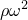
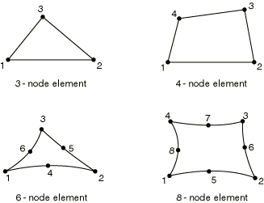
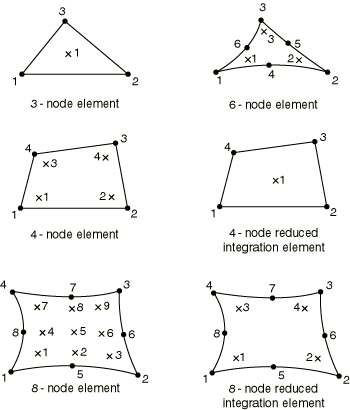

# 32.7.2 General surface element library


**Products: **Abaqus/Standard  Abaqus/Explicit  Abaqus/CAE  Abaqus/Aqua  

##### **References**

- ["Surface elements," Section 32.7.1](pt06ch32s07alm52.md)
- [*SURFACE SECTION](../key/key-link.md#usb-kws-msurfacesection)
- [*REBAR LAYER](../key/key-link.md#usb-kws-mrebarlayer)

### Overview

This section provides a reference to the surface elements available in Abaqus/Standard, Abaqus/Explicit and Abaqus/Aqua.

### Element types

| SFM3D3 | 3-node triangle |
| --- | --- |
|  |

| SFM3D4(S) | 4-node quadrilateral |
| --- | --- |
|  |

| SFM3D4R | 4-node quadrilateral, reduced integration |
| --- | --- |
|  |

| SFM3D6(S) | 6-node triangle |
| --- | --- |
|  |

| SFM3D8(S) | 8-node quadrilateral |
| --- | --- |
|  |

| SFM3D8R(S) | 8-node quadrilateral, reduced integration |
| --- | --- |
|  |

##### Active degrees of freedom

1, 2, 3

##### Additional solution variables

None.

### Nodal coordinates required

*X*, *Y*, *Z*

### Element property definition

| **Input File Usage: ** | Use the following option to define surface element properties: |
| --- | --- |
|  | ``` [*SURFACE SECTION](../key/key-link.md#usb-kws-msurfacesection) ``` If rebar are being defined, use the following option in conjunction with the [*SURFACE SECTION](../key/key-link.md#usb-kws-msurfacesection) option: ``` [*REBAR LAYER](../key/key-link.md#usb-kws-mrebarlayer) ``` Use the following option to define a mass density per unit area: ``` [*SURFACE SECTION](../key/key-link.md#usb-kws-msurfacesection), DENSITY=*number* ``` Use the following option to define the free surface of water in an Abaqus/Aqua analysis: ``` [*SURFACE SECTION](../key/key-link.md#usb-kws-msurfacesection), AQUAVISUALIZATION=YES ``` |

| **Abaqus/CAE Usage: ** | Property module: **Create Section**: select **Shell** as the section **Category** and **Surface** as the section **Type**, **Rebar Layers** (optional) |
| --- | --- |
|  | You cannot define the mass per unit area or the free surface of water for a surface section in Abaqus/CAE. |

### Element-based loading

### Distributed loads

Distributed loads are specified as described in ["Distributed loads," Section 34.4.3](pt07ch34s04aus122.md). Gravity, centrifugal, rotary acceleration, and Coriolis force loads apply only if the surface elements have rebar defined or if the elements have a defined density.

**Load ID (*DLOAD):**  BX**Abaqus/CAE Load/Interaction:**  **Body force****Units:**  [FL2](../popups/usb-int-iconventions-unitsym.md)**Description:  **Body force in the global *X*-direction.

**Load ID (*DLOAD):**  BY**Abaqus/CAE Load/Interaction:**  **Body force****Units:**  [FL2](../popups/usb-int-iconventions-unitsym.md)**Description:  **Body force in the global *Y*-direction.

**Load ID (*DLOAD):**  BZ**Abaqus/CAE Load/Interaction:**  **Body force****Units:**  [FL2](../popups/usb-int-iconventions-unitsym.md)**Description:  **Body force in the global *Z*-direction.

**Load ID (*DLOAD):**  BXNU**Abaqus/CAE Load/Interaction:**  **Body force****Units:**  [FL2](../popups/usb-int-iconventions-unitsym.md)**Description:  **Nonuniform body force in the global *X*-direction with magnitude supplied via user subroutine [`DLOAD`](../sub/sub-link.md#sub-xsl-dload) in Abaqus/Standard and [`VDLOAD`](../sub/sub-link.md#sub-xsl-vdload) in Abaqus/Explicit.

**Load ID (*DLOAD):**  BYNU**Abaqus/CAE Load/Interaction:**  **Body force****Units:**  [FL2](../popups/usb-int-iconventions-unitsym.md)**Description:  **Nonuniform body force in the global *Y*-direction with magnitude supplied via user subroutine [`DLOAD`](../sub/sub-link.md#sub-xsl-dload) in Abaqus/Standard  and [`VDLOAD`](../sub/sub-link.md#sub-xsl-vdload) in Abaqus/Explicit.

**Load ID (*DLOAD):**  BZNU**Abaqus/CAE Load/Interaction:**  **Body force****Units:**  [FL2](../popups/usb-int-iconventions-unitsym.md)**Description:  **Nonuniform body force in the global *Z*-direction with magnitude supplied via user subroutine [`DLOAD`](../sub/sub-link.md#sub-xsl-dload) in Abaqus/Standard and [`VDLOAD`](../sub/sub-link.md#sub-xsl-vdload) in Abaqus/Explicit.

**Load ID (*DLOAD):**  CENT(S)**Abaqus/CAE Load/Interaction:**  Not supported**Units:**  [FL3 (ML2T2)](../popups/usb-int-iconventions-unitsym.md)**Description:  **Centrifugal load (magnitude is input as , where  is the mass density per unit area,  is the angular speed).

**Load ID (*DLOAD):**  CENTRIF(S)**Abaqus/CAE Load/Interaction:**  **Rotational body force****Units:**  [T2](../popups/usb-int-iconventions-unitsym.md)**Description:  **Centrifugal load (magnitude is input as , where  is the angular speed).

**Load ID (*DLOAD):**  CORIO(S)**Abaqus/CAE Load/Interaction:**  **Coriolis force****Units:**  [FL3T (ML2T1)](../popups/usb-int-iconventions-unitsym.md)**Description:  **Coriolis force (magnitude is input as , where  is the mass density per unit area,  is the angular speed). The load stiffness due to Coriolis loading is not accounted for in direct steady-state dynamics analysis.

**Load ID (*DLOAD):**  GRAV**Abaqus/CAE Load/Interaction:**  **Gravity****Units:**  [LT2](../popups/usb-int-iconventions-unitsym.md)**Description:  **Gravity loading in a specified direction (magnitude is input as acceleration).

**Load ID (*DLOAD):**  HP(S)**Abaqus/CAE Load/Interaction:**  Not supported**Units:**  [FL2](../popups/usb-int-iconventions-unitsym.md)**Description:  **Hydrostatic pressure applied to the element reference surface and linear in global *Z*. The pressure is positive in the direction of the positive element normal.

**Load ID (*DLOAD):**  P**Abaqus/CAE Load/Interaction:**  **Pressure****Units:**  [FL2](../popups/usb-int-iconventions-unitsym.md)**Description:  **Pressure applied to the element reference surface. The pressure is positive in the direction of the positive element normal.

**Load ID (*DLOAD):**  PNU**Abaqus/CAE Load/Interaction:**  Not supported**Units:**  [FL2](../popups/usb-int-iconventions-unitsym.md)**Description:  **Nonuniform pressure applied to the element reference surface with magnitude supplied via user subroutine [`DLOAD`](../sub/sub-link.md#sub-xsl-dload) in Abaqus/Standard and [`VDLOAD`](../sub/sub-link.md#sub-xsl-vdload) in Abaqus/Explicit. The pressure is positive in the direction of the positive element normal.

**Load ID (*DLOAD):**  ROTA(S)**Abaqus/CAE Load/Interaction:**  **Rotational body force****Units:**  [T2](../popups/usb-int-iconventions-unitsym.md)**Description:  **Rotary acceleration load (magnitude is input as , where  is the rotary acceleration).

**Load ID (*DLOAD):**  SBF(E)**Abaqus/CAE Load/Interaction:**  Not supported**Units:**  [FL5T2](../popups/usb-int-iconventions-unitsym.md)**Description:  **Stagnation body force in global *X*-, *Y*-, and *Z*-directions.

**Load ID (*DLOAD):**  SP(E)**Abaqus/CAE Load/Interaction:**  Not supported**Units:**  [FL4T2](../popups/usb-int-iconventions-unitsym.md)**Description:  **Stagnation pressure applied to the element reference surface.

**Load ID (*DLOAD):**  TRSHR**Abaqus/CAE Load/Interaction:**  **Surface traction****Units:**  [FL2](../popups/usb-int-iconventions-unitsym.md)**Description:  **Shear traction on the element reference surface.

**Load ID (*DLOAD):**  TRSHRNU(S)**Abaqus/CAE Load/Interaction:**  Not supported**Units:**  [FL2](../popups/usb-int-iconventions-unitsym.md)**Description:  **Nonuniform shear traction on the element reference surface with magnitude and direction supplied via user subroutine [`UTRACLOAD`](../sub/sub-link.md#sub-xsl-utracload).

**Load ID (*DLOAD):**  TRVEC**Abaqus/CAE Load/Interaction:**  **Surface traction****Units:**  [FL2](../popups/usb-int-iconventions-unitsym.md)**Description:  **General traction on the element reference surface.

**Load ID (*DLOAD):**  TRVECNU(S)**Abaqus/CAE Load/Interaction:**  Not supported**Units:**  [FL2](../popups/usb-int-iconventions-unitsym.md)**Description:  **Nonuniform general traction on the element reference surface with magnitude and direction supplied via user subroutine [`UTRACLOAD`](../sub/sub-link.md#sub-xsl-utracload).

**Load ID (*DLOAD):**  VBF(E)**Abaqus/CAE Load/Interaction:**  Not supported**Units:**  [FL4T](../popups/usb-int-iconventions-unitsym.md)**Description:  **Viscous body force in global *X*-, *Y*-, and *Z*-directions.

**Load ID (*DLOAD):**  VP(E)**Abaqus/CAE Load/Interaction:**  Not supported**Units:**  [FL3T](../popups/usb-int-iconventions-unitsym.md)**Description:  **Viscous surface pressure applied to the element reference surface. The pressure is proportional to the velocity normal to the element face and opposing the motion.

### Foundations

Foundations are available only in Abaqus/Standard and are specified as described in ["Element foundations," Section 2.2.2](pt01ch02s02aus12.md).

**Load ID (*FOUNDATION):**  F**Abaqus/CAE Load/Interaction:**  **Elastic foundation****Units:**  [FL2](../popups/usb-int-iconventions-unitsym.md)**Description:  **Elastic foundation.

### Surface-based loading

### Distributed loads

Surface-based distributed loads are specified as described in ["Distributed loads," Section 34.4.3](pt07ch34s04aus122.md).

**Load ID (*DSLOAD):**  HP(S)**Abaqus/CAE Load/Interaction:**  **Pressure****Units:**  [FL2](../popups/usb-int-iconventions-unitsym.md)**Description:  **Hydrostatic pressure on the element reference surface and linear in global *Z*. The pressure is positive in the direction opposite to the surface normal.

**Load ID (*DSLOAD):**  P**Abaqus/CAE Load/Interaction:**  **Pressure****Units:**  [FL2](../popups/usb-int-iconventions-unitsym.md)**Description:  **Pressure on the element reference surface. The pressure is positive in the direction opposite to the surface normal.

**Load ID (*DSLOAD):**  PNU**Abaqus/CAE Load/Interaction:**  **Pressure****Units:**  [FL2](../popups/usb-int-iconventions-unitsym.md)**Description:  **Nonuniform pressure on the element reference surface with magnitude supplied via user subroutine [`DLOAD`](../sub/sub-link.md#sub-xsl-dload) in Abaqus/Standard and [`VDLOAD`](../sub/sub-link.md#sub-xsl-vdload) in Abaqus/Explicit. The pressure is positive in the direction opposite to the surface normal.

**Load ID (*DSLOAD):**  SP(E)**Abaqus/CAE Load/Interaction:**  **Pressure****Units:**  [FL4T2](../popups/usb-int-iconventions-unitsym.md)**Description:  **Stagnation pressure applied to the element reference surface.

**Load ID (*DSLOAD):**  TRSHR**Abaqus/CAE Load/Interaction:**  **Surface traction****Units:**  [FL2](../popups/usb-int-iconventions-unitsym.md)**Description:  **Shear traction on the element reference surface.

**Load ID (*DSLOAD):**  TRSHRNU(S)**Abaqus/CAE Load/Interaction:**  **Surface traction****Units:**  [FL2](../popups/usb-int-iconventions-unitsym.md)**Description:  **Nonuniform shear traction on the element reference surface with magnitude and direction supplied via user subroutine [`UTRACLOAD`](../sub/sub-link.md#sub-xsl-utracload).

**Load ID (*DSLOAD):**  TRVEC**Abaqus/CAE Load/Interaction:**  **Surface traction****Units:**  [FL2](../popups/usb-int-iconventions-unitsym.md)**Description:  **General traction on the element reference surface.

**Load ID (*DSLOAD):**  TRVECNU(S)**Abaqus/CAE Load/Interaction:**  **Surface traction****Units:**  [FL2](../popups/usb-int-iconventions-unitsym.md)**Description:  **Nonuniform general traction on the element reference surface with magnitude and direction supplied via user subroutine [`UTRACLOAD`](../sub/sub-link.md#sub-xsl-utracload).

**Load ID (*DSLOAD):**  VP(E)**Abaqus/CAE Load/Interaction:**  **Pressure****Units:**  [FL3T](../popups/usb-int-iconventions-unitsym.md)**Description:  **Viscous surface pressure applied to the element reference surface. The pressure is proportional to the velocity normal to the element surface and opposing the motion.

### Incident wave loading

Surface-based incident wave loading is also available for these elements. See ["Acoustic and shock loads," Section 34.4.6](pt07ch34s04aus125.md). 

### Element output

Output is currently available only when the surface element is used to carry rebar layers. See ["Defining reinforcement," Section 2.2.3](pt01ch02s02aus13.md), for details.

### Node ordering on elements



### Numbering of integration points for output




