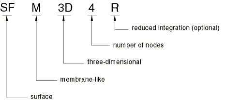
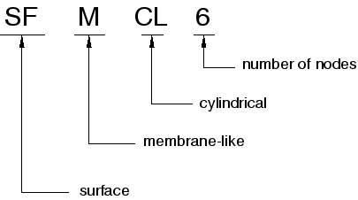
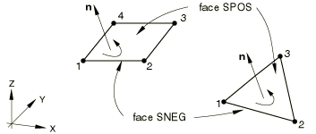

# 32.7.1 Surface elements


**Products: **Abaqus/Standard  Abaqus/Explicit  Abaqus/CAE  Abaqus/Aqua  

##### **References**

- ["General surface element library," Section 32.7.2](pt06ch32s07ael36.md)
- ["Cylindrical surface element library," Section 32.7.3](pt06ch32s07ael37.md)
- ["Axisymmetric surface element library," Section 32.7.4](pt06ch32s07ael38.md)
- [*SURFACE SECTION](../key/key-link.md#usb-kws-msurfacesection)
- ["Creating surface sections," Section 12.13.9 of the Abaqus/CAE User's Guide](../usi/usi-link.md#usi-prp-section-surface)

### Overview

Surface elements:
- are defined just like membrane elements---as surfaces in space;
- have no inherent stiffness;
- may have mass per unit area;
- may be used to define rigid bodies;
- may be used in the definition of surfaces and surface-based tie constraints;
- behave just like membrane elements with zero thickness;
- may be used with rebar layers;
- can be embedded in solid elements;
- can transmit only in-plane forces; and
- have no bending stiffness or transverse shear stiffness.

### Typical applications

Surface elements are useful in several special modeling cases:
- They are used to carry rebar layers to represent thin stiffening components in solid structures. The stiffness and mass of the rebar layers are added to the surface elements (see ["Defining reinforcement," Section 2.2.3](pt01ch02s02aus13.md)). The reinforced surface elements can also be embedded in "host" solid elements (see ["Embedded elements," Section 35.4.1](pt08ch35s04aus136.md)).
- They are used to bring additional mass into the model in the form of a mass per unit area; for example, to spread the mass of fuel in a tank over the tank surface, particularly when the tank is modeled with solid elements.
- They are used to specify a surface used in a constraint, when that surface does not have structural properties.
- When used in conjunction with a surface-based tie constraint, they are used to specify distributed surface loading, such as incident wave loading, on beam elements.
- In Abaqus/Explicit (when used in conjunction with a surface-based tie constraint) they can be used to specify a complex surface on beam elements for use in general contact. The stiffness of the penalty springs used to enforce contact constraints is approximately proportional to the mass of the surface nodes. Contact will not be enforced if the surface nodes have no mass.
- In Abaqus/Explicit they can be used to define all or part of the boundary for a surface-based fluid cavity (for example, see ["Hydrostatic fluid elements: modeling an airspring," Section 1.1.9 of the Abaqus Example Problems Guide](../exa/exa-link.md#exa-sta-hydrofluidairspring)).
- In Abaqus/Aqua analysis they can be used to visualize gravity waves.

### Choosing an appropriate element

In addition to the general surface elements available in both Abaqus/Standard and Abaqus/Explicit, cylindrical surface elements and axisymmetric surface elements are available in Abaqus/Standard only.

#### General surface elements

General surface elements should be used in three-dimensional models in which the deformation of the structure can evolve in three dimensions.

#### Cylindrical surface elements

Cylindrical surface elements are available in Abaqus/Standard for precise modeling of regions in a structure with circular geometry, such as a tire. The elements make use of trigonometric functions to interpolate displacements along the circumferential direction and use regular isoparametric interpolation in the in-plane direction. They use three nodes along the circumferential direction and can span a segment between 0 and 180. Elements with both first-order and second-order interpolation in the in-plane direction are available. 

The geometry of the element is defined by specifying nodal coordinates in a global Cartesian system. 

These elements can be used in the same mesh with regular surface elements. They can also be embedded in general solid and cylindrical elements.

#### Axisymmetric surface elements

The axisymmetric surface elements available in Abaqus/Standard are divided into two categories: those that do not allow twist about the symmetry axis and those that do. These elements are referred to as the regular and generalized axisymmetric surface elements, respectively.

The generalized axisymmetric surface elements (axisymmetric surface elements with twist) allow a circumferential component of loading, which may cause twist about the symmetry axis. The circumferential load component is independent of the circumferential coordinate . Since there is no dependence of the loading on the circumferential coordinate, the deformation is axisymmetric.

The generalized axisymmetric surface elements cannot be used in dynamic or eigenfrequency extraction procedures.

### Naming convention

The naming convention for surface elements depends on the element dimensionality.

#### General surface elements

General surface elements in Abaqus are named as follows:



For example, SFM3D4R is a three-dimensional, 4-node surface element with reduced integration.

#### Cylindrical surface elements

Cylindrical surface elements in Abaqus/Standard are named as follows:



For example, SFMCL6 is a 6-node cylindrical surface element with circumferential interpolation.

#### Axisymmetric surface elements

Axisymmetric surface elements in Abaqus/Standard are named as follows:


For example, SFMAX2 is a regular axisymmetric, quadratic-interpolation surface element.

### Element normal definition

The “top” surface of a surface element is the surface in the positive normal direction (defined below) and is called the SPOS face for contact definition. The “bottom” surface is in the negative direction along the normal and is called the SNEG face for contact definition.

#### General surface elements

For general surface elements the positive normal direction is defined by the right-hand rule going around the nodes of the element in the order that they are specified in the element definition. See [Figure 32.7.1--1](pt06ch32s07alm52.md#esurface-gen-normal).

**Figure 32.7.1–1** Positive normals for general surface elements.



#### Cylindrical surface elements

The positive normal direction is defined by the right-hand rule going around the nodes of the element in the order that they are specified in the element definition. See [Figure 32.7.1--2](pt06ch32s07alm52.md#esurface-cyl-normal).

**Figure 32.7.1–2** Positive normals for cylindrical surface elements.


#### Axisymmetric surface elements

For axisymmetric surface elements the positive normal is defined by a 90 counterclockwise rotation from the direction going from node 1 to node 2. See [Figure 32.7.1--3](pt06ch32s07alm52.md#esurface-axi-normal).

**Figure 32.7.1–3** Positive normals for axisymmetric surface elements.


### Defining the element's section properties

You must associate the surface section properties with a region of your model.

| **Input File Usage: ** | ``` [*SURFACE SECTION](../key/key-link.md#usb-kws-msurfacesection), ELSET=*name* ``` |
| --- | --- |
|  | where the ELSET parameter refers to a set of surface elements. |

| **Abaqus/CAE Usage: ** | Property module: **Create Section**: select **Shell** as the section **Category** and **Surface** as the section **Type** ****Assign****Section****: select regions |
| --- | --- |

#### Using a surface element to carry rebar layers

You can define layers of reinforcement that are carried by the surface element. The stiffness and mass due to the rebar layers are added to the surface element.

| **Input File Usage: ** | Use both of the following options: |
| --- | --- |
|  | ``` [*SURFACE SECTION](../key/key-link.md#usb-kws-msurfacesection), ELSET=*name* [*REBAR LAYER](../key/key-link.md#usb-kws-mrebarlayer) ``` |

| **Abaqus/CAE Usage: ** | Property module: **Create Section**: select **Shell** as the section **Category** and **Surface** as the section **Type**, **Rebar Layers** |
| --- | --- |

#### Using a surface element to bring additional mass into the model

You can define the mass per unit area carried by the surface element.

| **Input File Usage: ** | ``` [*SURFACE SECTION](../key/key-link.md#usb-kws-msurfacesection), ELSET=*name*, DENSITY=*number* ``` |
| --- | --- |

| **Abaqus/CAE Usage: ** | Property module: **Create Section**: select **Shell** as the section **Category** and **Surface** as the section **Type**, toggle on **Density**: *number* |
| --- | --- |

#### Using a surface element in a constraint

Surface elements can be used to define a surface in Abaqus, and this surface can be used in a surface-based tie constraint (see ["Mesh tie constraints," Section 35.3.1](pt08ch35s03aus132.md)).

| **Input File Usage: ** | Use the following options: |
| --- | --- |
|  | ``` [*SURFACE](../key/key-link.md#usb-kws-msurface), NAME=*surface_name* [*TIE](../key/key-link.md#usb-kws-mtie), NAME=*name* *surface_name*, *master_name* ``` |

| **Abaqus/CAE Usage: ** | In Abaqus/CAE you can select one or more faces directly in the viewport when you are prompted to select a surface. In addition, you can define surfaces as collections of faces and edges using the Surface toolset. |
| --- | --- |
|  | Interaction module: **Create Constraint**: **Tie** |

#### Using a surface element to visualize gravity waves

You can define a surface element set at the still water height to visualize the gravity waves during an Abaqus/Aqua analysis.

| **Input File Usage: ** | ``` [*SURFACE SECTION](../key/key-link.md#usb-kws-msurfacesection), ELSET=*name*, AQUAVISUALIZATION=YES ``` |
| --- | --- |

| **Abaqus/CAE Usage: ** | Specifying a wave surface for visualization is not supported in Abaqus/CAE. |
| --- | --- |


