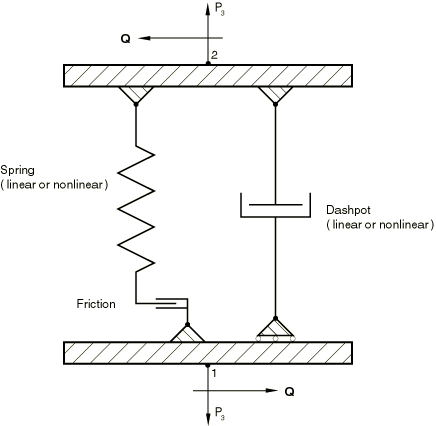
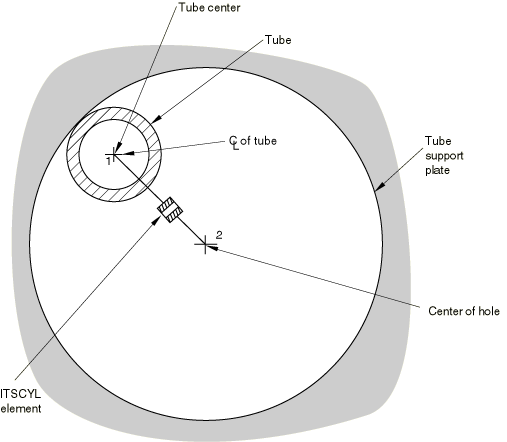
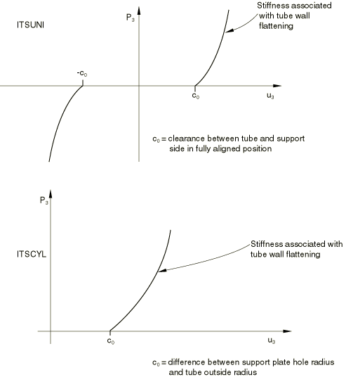

# 32.8.1 Tube support elements


**Product: **Abaqus/Standard  

##### **References**

- ["Tube support element library," Section 32.8.2](pt06ch32s08ael39.md)
- [*ITS](../key/key-link.md#usb-kws-mits)
- [*DASHPOT](../key/key-link.md#usb-kws-mdashpot)
- [*FRICTION](../key/key-link.md#usb-kws-hfriction)
- [*SPRING](../key/key-link.md#usb-kws-mspring)

### Overview

Tube support elements:
- are provided to model the interaction of a tube with a closely adjacent tube support, for cases where intermittent contact between the tube and the support may occur; and
- are made up of a spring/friction link (to simulate direct contact between the tube and the support) and a parallel dashpot (to simulate the effect of the fluid in the annulus between the tube and the support), as shown in [Figure 32.8.1--1](pt06ch32s08alm53.md#eits-elem-behav).

 Details of the element formulations can be found in ["Tube support elements," Section 3.9.4 of the Abaqus Theory Guide](../stm/stm-link.md#stm-elm-tubetubeelem).

### Typical applications

An ITSCYL element can be used to model a drilled hole support (see [Figure 32.8.1--2](pt06ch32s08alm53.md#eits-drilled-hole)).

Several ITSUNI elements can be attached to the same node of the beam elements representing the tube to model the case of a tube support made up of a series of straight segments, as in an “egg-crate” design (see [Figure 32.8.1--3](pt06ch32s08alm53.md#eits-egg-crate)).

### Choosing an appropriate element

Two types of tube support elements are provided.

#### ITSUNI elements

ITSUNI is a “unidirectional” element, which always acts in a fixed direction in space. One node of the element must be located on the axis of the tube, which is modeled using beam elements; and the other node must be located equidistant between the two parallel support plates. The support plates are built into the ITSUNI element definition. 

**Figure 32.8.1–1** Tube support element behavior.



#### ITSCYL elements

ITSCYL is a “cylindrical” element, which can be used to simulate the interaction between a circular tube and a circular hole. One node of the element must be located on the axis of the tube, which is modeled using beam elements, and the other node must be located at the center of the hole in the circular tube support plate. The circular hole is built into the ITSCYL element definition.

**Figure 32.8.1–2** Use of an ITSCYL element for a drilled hole support.



**Figure 32.8.1–3** Use of ITSUNI elements for an “egg-crate” support.


### Defining the behavior of ITS elements

You define the diameter of the tube and other geometric quantities that define the ITS element. You must associate these quantities with a set of ITS elements. In addition, you must define the behavior of the spring, friction link, and dashpot that make up a tube support element.

The spring behavior of an ITS element is shown in [Figure 32.8.1--4](pt06ch32s08alm53.md#tube-tube-elem). Relative displacements in the element are measured from the position where the tube and the hole in the support plate are aligned exactly—when the nodes of the element are at the same location. As indicated in [Figure 32.8.1--4](pt06ch32s08alm53.md#tube-tube-elem), the spring behavior of an ITS element is modified from that of the assigned spring definition to account for any clearance between the tube and support when the nodes of the element are at the same location. When there is no contact between the tube and the support, no force is transmitted by the spring; when the tube is in contact with the support, the force increases as the tube wall is deformed. This force can be modeled as a linear or a nonlinear function of the relative displacement between the axis of the tube and the center of the hole in the support.

Friction between the tube and support will generate a moment at the tube node if the tube diameter is greater than zero and a moment at the hole node if the hole size is greater than zero. At least one of the following should be true for any node of an ITS element that will have a moment acting on it:
- the node should be associated with a beam or other element that can carry a moment;
- the nodal rotation should be set to zero with a boundary condition.

| **Input File Usage: ** | Use the following options to define the behavior of ITS elements: |
| --- | --- |
|  | ``` [*ITS](../key/key-link.md#usb-kws-mits), ELSET=*name* [*DASHPOT](../key/key-link.md#usb-kws-mdashpot) [*SPRING](../key/key-link.md#usb-kws-mspring) [*FRICTION](../key/key-link.md#usb-kws-hfriction) ``` |

**Figure 32.8.1–4** Nonlinear spring behavior in ITS elements to model clearance and tube flattening.




