# 32.10.1 Elastic-plastic joints


**Product: **Abaqus/Aqua  

##### **References**

- [*EPJOINT](../key/key-link.md#usb-kws-mepjoint)
- ["Elastic-plastic joint element library," Section 32.10.2](pt06ch32s10ael41.md)

### Overview

JOINT2D and JOINT3D elements:
- are available for use only in Abaqus/Aqua used in conjunction with Abaqus/Standard (["Abaqus/Aqua analysis," Section 6.11.1](pt03ch06s11at30.md));
- can be used to model flexible joints between structural members or the interaction between spud cans and the ocean floor;
- are valid for small displacements and rotations; and
- can be purely elastic or elastic-plastic.

### Elastic-plastic joint elements

Abaqus/Standard provides JOINT2D and JOINT3D elements for modeling a joint between structural members or between a structural member and a fixed support. They can be used in an Abaqus/Aqua analysis to model the interaction between a “spud can” and the sea floor for jack-up foundation analysis in offshore applications.

The joint has two nodes. One of these nodes should be constrained fully (by using a boundary condition) if the joint is between a structural member and a fixed support.

#### Kinematics and local coordinate system

The deformation of the joint is characterized by joint “strains,” which are relative displacements and rotations between the nodes of the joint. The joint must be associated with a user-defined local orientation system (see ["Orientations," Section 2.2.5](pt01ch02s02aus15.md)) that is defined by three orthonormal directions: , , and .

The joint, when strained by relative extension or rotation of the two nodes, responds by applying equal and opposite forces and/or moments to the nodes. These forces and moments, or joint “stresses,” can be a linear (elastic) or nonlinear (elastic-plastic) function of the “strains,” depending on the type of constitutive model used in the joint.

The stresses and strains are named as shown in [Figure 32.10.1--1](pt06ch32s10alm55.md#eepjoint-local-axis). Positive stress indicates tension; positive strain indicates extension. 

**Figure 32.10.1–1** Local axis definition for joint elements.

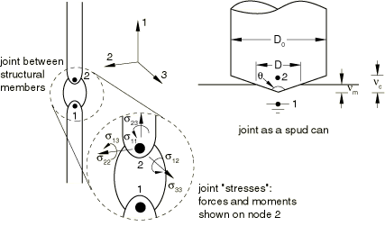

Even when geometrically nonlinear analysis is requested (["Geometric nonlinearity" in "General and linear perturbation procedures," Section 6.1.3](pt03ch06s01aus44.md#usb-anl-alinearnonlinear-nlgeom)), the element kinematics are defined with the assumption of small relative displacements and small rotations; therefore, these elements should not be used when these assumptions are violated. If large rotations are required and there is no plasticity, JOINTC elements can be used (see ["Flexible joint element," Section 32.3.1](pt06ch32s03alm39.md)).

The “extensional” strains are defined through 

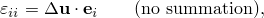

and the “bending” strains through 


where 


are the relative displacements and rotations of the two nodes of the joint, respectively.

For two-dimensional elements only the axial strains , , and the bending strain  exist. For three-dimensional elements all six components exist.

| **Input File Usage: ** | Use the following option to associate a local orientation system with an elastic-plastic joint element: |
| --- | --- |
|  | ``` [*EPJOINT](../key/key-link.md#usb-kws-mepjoint), ORIENTATION=*name* ``` |

#### Joint constitutive models

The elastic moduli for joint elasticity can be entered in one of two ways. You can specify a general, anisotropic relation between the forces/moments and elastic extensions. Alternatively, you can enter moduli specific for a spud can; the elastic stiffness matrix is diagonal and depends on the diameter of the spud can at the soil surface, *D*, which can vary if spud can plasticity is defined and the spud can is conical. See ["Joint elasticity models](pt06ch32s10alm55.md#usb-elm-eepjoint-elasticity)” below for details.

Three joint plasticity models are provided. Two are specific to spud cans. The third is a parabolic model for structural joints or members. See ["Joint plasticity](pt06ch32s10alm55.md#usb-elm-eepjoint-plasticity)” below for details.

If plasticity is included, the plastic straining is assumed to occur in the local 1–2 plane so that the only nonzero plastic strains are , , and . It is assumed that plasticity in the 3-direction can be neglected. In a three-dimensional model strains out of the 1–2 plane produce purely elastic response.

If the parabolic plasticity model for structural joints or members is used, the 1-direction is the axial direction along the members, while the 2-direction is the transverse direction (see [Figure 32.10.1--1](pt06ch32s10alm55.md#eepjoint-local-axis)). In the spud can plasticity models the 1-direction is the vertical direction, and the 2-direction is the horizontal direction in which plastic extension can take place. In three-dimensional models the 3-direction is the horizontal direction in which only elastic extension can take place.

Any combination of elastic and plastic models can be used. For example, usually spud can elastic moduli will be used with spud can plasticity, but the use of general moduli with spud can plasticity is allowed.

If plasticity is used in a three-dimensional model, coupling is not allowed through the elastic modulus between the strains or stresses in the 1–2 plane (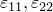, ) and the remaining, out-of-plane, strains (, ). Thus, in this case many of the general elastic moduli must be set to zero.

| **Input File Usage: ** | Use one or both of the following options immediately after the related [*EPJOINT](../key/key-link.md#usb-kws-mepjoint) option to define the joint constitutive model: |
| --- | --- |
|  | ``` [*JOINT ELASTICITY](../key/key-link.md#usb-kws-mjointelastic) [*JOINT PLASTICITY](../key/key-link.md#usb-kws-mjointplastic) ``` |

#### Orientation

Care must be taken in defining the local directions and node numbering so that the motion of node 2 relative to node 1 in the positive 1-direction of the local axis corresponds to extension. Incorrect specification of the local directions or element node numbering can produce incorrect results in plastic analysis because compression will be interpreted as extension.

If one of the nodes must be fixed to represent the ground, it is most convenient to let this node be the first node of the element; extension is then represented by the motion of node 2 of the element in the positive local 1-direction. If a spud can is being modeled in this way, the local 1-direction should be the outward normal to the ocean floor. For a two-dimensional analysis that uses Abaqus/Aqua structural loads, this direction must be the global *y*-direction.

For a three-dimensional analysis that uses Abaqus/Aqua structural loads, the local 1-direction should point in the global *z*-direction. If plasticity is being used, the local 2-direction should be set so that the 1–2 plane is the plane of greatest deformation.

| **Input File Usage: ** | Use the following orientation definition to model a spud can with the first node fixed: |
| --- | --- |
|  | ``` [*ORIENTATION](../key/key-link.md#usb-kws-morientation), NAME=*name*, TYPE=RECTANGULAR 0, 1, 0, 1, 0, 0 ``` Use the following orientation definition for a three-dimensional Abaqus/Aqua analysis with plasticity: ``` [*ORIENTATION](../key/key-link.md#usb-kws-morientation), NAME=*name*, TYPE=RECTANGULAR 0, 0, 1, *x*, *y*, 0 ``` where (*x*, *y*, 0) defines the local 2-direction. |

### Spud can geometry

If either spud can elasticity or spud can plasticity is used, you must specify the constants to define the spud can geometry. The entire spud can section definition has no effect if there is neither spud can elasticity nor spud can plasticity.

The spud can, illustrated in [Figure 32.10.1--1](pt06ch32s10alm55.md#eepjoint-local-axis), can be either conical-based or flat-based. The spud can geometry is defined by , the diameter of the cylindrical portion, and , the planar angle of the conical portion, where 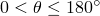. You can specify a flat-based spud can by omitting the specification of  or by giving a value of 0 or 180 for .

| **Input File Usage: ** | ``` [*EPJOINT](../key/key-link.md#usb-kws-mepjoint), SECTION=SPUD CAN ,  ``` |
| --- | --- |

### Spud can initial embedment

If spud can plasticity is defined or if there is spud can elasticity and the spud can is conical, you must specify the initial embedment of the spud can, .

The embedment can be prescribed directly or by specifying a “preload” that produces the embedment, as discussed below. Specification of both embedment and preload is not allowed. If either embedment or preload is given, both embedment and equivalent preload (in the case of plasticity) can be examined in the data file at the start of the analysis.

At any time in the analysis the spud can has a total (plastic) embedment of , where  is the plastic embedment between the start of the analysis and time *t*. (The negative sign in this equation reflects the fact that the sign convention for strain in Abaqus is positive for tensile strain. Most often for spud can plasticity, 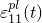 will be compressive, or negative.) The joint can be purely elastic, in which case 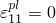, so 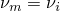 always.

The height of the conical portion of the spud can is given by . The effective diameter of the spud can at the soil surface, *D*, is defined by

1. For a flat-based spud can: 
2. For a conical-based spud can: 1. Cone portion partially penetrating (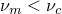): 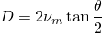 2. Penetration beyond cone-cylinder transition (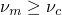): 

The current spud can area at the soil surface, *A*, is defined through . The effective diameter can vary throughout the analysis only for a conical spud can with plasticity.

The embedment has no effect and is not required if the spud can is cylindrical and spud can plasticity is not defined.

#### Specifying the embedment directly

The embedment value can be prescribed directly using initial conditions (see ["Initial conditions in Abaqus/Standard and Abaqus/Explicit," Section 34.2.1](pt07ch34s02aus116.md)).

| **Input File Usage: ** | ``` [*INITIAL CONDITIONS](../key/key-link.md#usb-kws-minitialcond), TYPE=SPUD EMBEDMENT ``` |
| --- | --- |

#### Specifying the spud can preload

If spud can plasticity is defined, you can specify the initial compressive capacity (“preload”), , instead of the embedment. In this case Abaqus/Aqua will use the hardening law to calculate the plastic embedment that follows when the preload is applied vertically.

The preload initial condition is used only to calculate the initial plastic embedment; the spud can starts the analysis in a zero strain and stress state at this initial plastic embedment, and the preload is assumed to be removed. You must apply any operational vertical load through loading within the history definition.

| **Input File Usage: ** | ``` [*INITIAL CONDITIONS](../key/key-link.md#usb-kws-minitialcond), TYPE=SPUD PRELOAD ``` |
| --- | --- |

#### Embedment in an elastic spud can analysis

If the spud can model is purely elastic, the spud can geometry is needed only for calculating the embedded diameter of the spud can for spud can elastic moduli. The embedment is required for this calculation only if the spud can is conical.

### Output

Force and moment output in the element local system is available through the “stress” output variable S. Extension and relative rotation are available through the “strain” output variable E. Elastic and plastic strains are available through the output variables EE and PE. For spud cans the plastic embedment since the start of the analysis is available through the vertical component of plastic strain, PE11, and will usually be negative, indicating compression; the total vertical embedment, , is available through output variable PEEQ. Element nodal force (the force the element places on its nodes, in the global system) is available through element variable NFORC.

### Joint elasticity models

The elastic load-displacement behavior of the JOINT2D and JOINT3D elements is characterized by elastic spring stiffnesses, which are assembled to form the elastic element stiffness matrix. A special diagonal modulus for spud cans can be specified or, alternatively, a fully populated (general) elastic modulus can be specified.

#### Spud can moduli

Spud can moduli can be prescribed for either two-dimensional or three-dimensional elements.

##### Two-dimensional spud can moduli

The elastic stiffness for a two-dimensional spud can is 

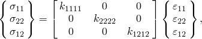

where 

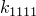

is the vertical elastic spring stiffness, 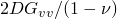;


is the horizontal elastic spring stiffness, 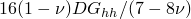;


is the elastic spring stiffness in bending, 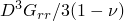;

in which , 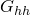, and 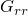 are equivalent elastic shear moduli for vertical, horizontal, and rotational displacements, respectively;  is the Poisson's ratio of the soil (suggested value: 0.2 for sand and 0.5 for clay).

| **Input File Usage: ** | ``` [*JOINT ELASTICITY](../key/key-link.md#usb-kws-mjointelastic), MODULI=SPUD CAN, NDIM=2 ``` |
| --- | --- |

##### Three-dimensional spud can moduli

For a three-dimensional spud can the moduli are

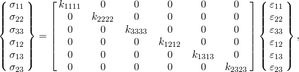

where 


is the vertical elastic spring stiffness, ;


is a horizontal elastic spring stiffness, ;


is a horizontal elastic spring stiffness, ;


is an elastic spring stiffness in bending, ;

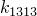

is an elastic spring stiffness in bending, ;


is the torsional elastic spring stiffness, ;

in which , , , and  are as before and  is a user-specified torsional stiffness value.

Straining out of the 1–2 plane through the strains , and  produces purely elastic response in the three-dimensional model regardless of plasticity. The moduli related to these strains are assumed not to be affected by the plasticity so that , and  are based on the initial embedded diameter, while the other moduli depend on the current embedded diameter.

| **Input File Usage: ** | ``` [*JOINT ELASTICITY](../key/key-link.md#usb-kws-mjointelastic), MODULI=SPUD CAN, NDIM=3 ``` |
| --- | --- |

#### General moduli

General moduli can be specified for either two-dimensional or three-dimensional elements.

##### Two-dimensional general moduli

For the two-dimensional case six independent elastic moduli are needed. The stress-strain relations are as follows: 

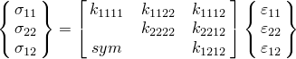

| **Input File Usage: ** | ``` [*JOINT ELASTICITY](../key/key-link.md#usb-kws-mjointelastic), MODULI=GENERAL, NDIM=2 ``` |
| --- | --- |

##### Three-dimensional general moduli

For the three-dimensional case 21 independent elastic moduli are needed. The stress-strain relations are as follows: 

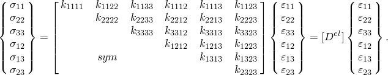

| **Input File Usage: ** | ``` [*JOINT ELASTICITY](../key/key-link.md#usb-kws-mjointelastic), MODULI=GENERAL, NDIM=3 ``` |
| --- | --- |

### Joint plasticity

In what follows 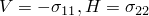, and 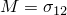 represent the vertical *compressive* load, the horizontal load in the 1–2 plane, and the bending moment in the local 1–2 plane, respectively.

If plasticity is defined, the joint can yield axially, horizontally, or rotationally. The stress depends linearly on the elastic strain. The elastic moduli can depend on the plasticity in the case of a conical spud can, through the diameter at the surface, *D*.

The models are rate independent, with a yield equation of the form 

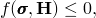

where *f* is the yield function and  is a set of hardening parameters, which in these models depend on total vertical plastic embedment, ; the form of *f* and the definition of  defines the type of plasticity model.

The flow rule requires that the plastic flow direction is normal to the contours of the flow potential, *g*. Associated flow is assumed in all of these models (except at vertices in the yield surface, as discussed below).

#### Yield surface

The three available plasticity models all use parabolic yield surfaces. Each has a compressive and a tensile limit for the stress in the 1-direction, which are termed  and , respectively;  is zero for the clay model. The sign convention for  and  is such that they are always positive; thus, 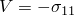 always obeys 


The yield surface is most conveniently drawn in 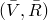-space, where 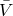 is normalized compressive vertical load and is defined as 


where 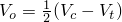 is the middle value of the limiting elastic range for *V*, and 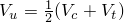 is the length of the limiting range for *V*. The normalized load is, therefore, always within the range 

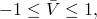

with  representing the tensile limit 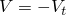 and  representing the compressive limit 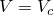.  is the normalized equivalent horizontal load and is defined through 

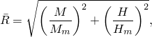

where  and  are the moment and horizontal yield stresses. The normalized moment and normalized horizontal force are defined through 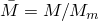 and .

The normalized yield function in -space for each model is defined through 

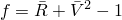

and is a parabola as plotted in [Figure 32.10.1--2](pt06ch32s10alm55.md#eepjoint-yield-flow). The yield surface in the space of the three normalized stresses  is the surface of revolution of this parabola.

**Figure 32.10.1–2** Yield surface and flow potential contour.

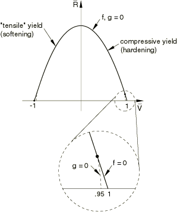

#### Flow potential

The flow potential is the same as the yield function (associated flow) except that some smoothing is done to the flow potential where the yield function has corners.

The yield surface has corners and, therefore, nonunique normals at points where it is intersected by the -axis.

To avoid problems with the indeterminate flow directions at these corners, Abaqus/Standard uses a flow potential whose contours are rounded in the region of the vertex, as indicated in the detail of a vertex shown in [Figure 32.10.1--2](pt06ch32s10alm55.md#eepjoint-yield-flow). This rounding is achieved by fitting an elliptical segment to the flow potential contour for 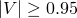.

#### Integration of the plasticity equations

Abaqus/Aqua uses fully implicit integration for the plasticity equations. The corresponding tangent stiffness is unsymmetric for these plasticity models. By default, the symmetrized tangent is used in the global Newton loop. If the convergence rate seems to be poor, you may get some benefit out of using the unsymmetric matrix storage and solution scheme for the step (see ["Defining an analysis," Section 6.1.2](pt03ch06s01abo05.md)).

#### Joint plasticity models

The three models differ only in the definitions of , , , and  and in the hardening definitions. We present the yield function for each model as it is presented in the literature rather than in normalized form. The equivalent normalized form can be obtained by identifying  and , which are explicit in the given yield functions for clay and member plasticity; for the sand model they are provided for reference.

##### Sand model

1. Yield function: 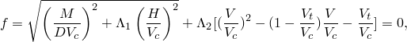 where  and 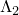 are constant coefficients that determine the geometric shape of the yield function. The special case of 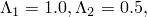 and  gives the yield function as proposed by Osborne, et al.
2. Work hardening equations: 1. Flat-base spud can:  where  is soil unit weight;  is an experimentally determined constant; and  and  are classical bearing capacity factors, which can be calculated as:  where  is the soil friction angle. 2. Conical-base spud can: 1. Cone portion partially penetrating: 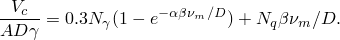 2. Penetration beyond cone-cylinder transition:  where  is a "cone equivalency coefficient."

The constants  and  are based on the following empirical relation, which has been derived from centrifuge data: 


in which the soil friction angle  is in degrees.

The sand model yield function can be put in normalized form by using  and  where . For the model of Osborne et al. 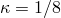.

This model requires a nonzero initial embedment or equivalent preload.

| **Input File Usage: ** | ``` [*JOINT PLASTICITY](../key/key-link.md#usb-kws-mjointplastic), TYPE=SAND ``` |
| --- | --- |

##### Clay model

1. Yield function:  where 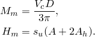  is the undrained shear strength of clay; and 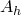 is the elevation area of the embedded portion of the spud can, defined through: 1. Flat-base spud can: 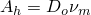 2. Conical-base spud can: 1. Cone portion penetrating: 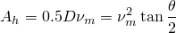 2. Penetration beyond cone-cylinder transition: 
2. Work hardening equations: 1. Flat-base spud can:  2. Conical-base spud can:  where 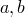, and *c* are user-defined empirical constants.

This model has zero yield strength in tension 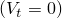 and requires a nonzero initial embedment or equivalent preload.

| **Input File Usage: ** | ``` [*JOINT PLASTICITY](../key/key-link.md#usb-kws-mjointplastic), TYPE=CLAY ``` |
| --- | --- |

##### Parabolic model for structural joints/members

1. Yield function:  where 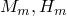 are horizontal and moment capacities, respectively.
2. Work hardening: no work hardening is assumed (the model is perfectly plastic).

| **Input File Usage: ** | ``` [*JOINT PLASTICITY](../key/key-link.md#usb-kws-mjointplastic), TYPE=MEMBER ``` |
| --- | --- |

#### Plasticity analysis issues

Because associated flow is assumed in the spud can plasticity models, tensile vertical plastic strain can occur whenever the yield surface is encountered with 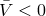. It is not required that the vertical force itself be tensile for tensile plastic yield to occur; tensile plastic yield can occur on any part of the yield surface where . The spud can models soften during this tensile plastic yield; if there is insufficient support from the rest of the model, an instability can occur and the analysis may fail to converge. When this happens, the spud can is likely to be lifting out of the sea floor.

To make it easier to diagnose analysis problems that may arise due to these issues, a message is printed to the message file in the following cases: if tensile plastic yield occurs for a spud can, if yield occurs near the top of the parabolic yield surface () where there is very little hardening, or if the embedment of a spud can becomes less than 10% of the initial embedment. These messages are not printed more than once in a given step.

The plasticity algorithm can fail in an iteration if the strain increment is excessively large. Some details that may be of help in diagnosing failure in joint elements can be obtained by requesting detailed printout to the message file of problems with the plasticity algorithms (see ["The Abaqus/Standard message file" in "Output," Section 4.1.1](pt02ch04s01aus38.md#usb-out-ooutput-message-std)).


