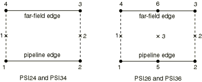

# 32.12.2 Pipe-soil interaction element library


**Product: **Abaqus/Standard  

##### **References**

- ["Pipe-soil interaction elements," Section 32.12.1](pt06ch32s12alm57.md)
- [*PIPE-SOIL INTERACTION](../key/key-link.md#usb-kws-mpipesoilinter)

### Overview

This section provides a reference to the pipe-soil interaction elements available in Abaqus/Standard.

### Element types

#### 2D elements

| PSI24 | Two-dimensional 4-node pipe-soil interaction element |
| --- | --- |
|  |

| PSI26 | Two-dimensional 6-node pipe-soil interaction element |
| --- | --- |
|  |

##### Active degrees of freedom

1, 2

##### Additional solution variables

None.

#### 3D elements

| PSI34 | Three-dimensional 4-node pipe-soil interaction element |
| --- | --- |
|  |

| PSI36 | Three-dimensional 6-node pipe-soil interaction element |
| --- | --- |
|  |

##### Active degrees of freedom

1, 2, 3

##### Additional solution variables

None.

### Nodal coordinates required

2D: *X*, *Y*

3D: *X*, *Y*, *Z*

### Element property definition

| **Input File Usage: ** | ``` [*PIPE-SOIL INTERACTION](../key/key-link.md#usb-kws-mpipesoilinter) ``` |
| --- | --- |

### Element-based loading

None.

### Element output

The relative displacements corresponding to the forces below are chosen by requesting the corresponding “strains.” Elastic and plastic strains are available. 

#### Two-dimensional elements

| S11 | Force per unit length in the first local direction. |
| --- | --- |

| S22 | Force per unit length in the second local direction. |
| --- | --- |

#### Three-dimensional elements

| S11 | Force per unit length in the first local direction. |
| --- | --- |

| S22 | Force per unit length in the second local direction. |
| --- | --- |

| S33 | Force per unit length in the third local direction. |
| --- | --- |

### Node ordering and integration point numbering




