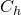

# 32.12.1 Pipe-soil interaction elements


**Product: **Abaqus/Standard  

##### **References**

- ["Pipe-soil interaction element library," Section 32.12.2](pt06ch32s12ael43.md)
- [*PIPE-SOIL INTERACTION](../key/key-link.md#usb-kws-mpipesoilinter)
- [*PIPE-SOIL STIFFNESS](../key/key-link.md#usb-kws-mpipesoilstiff)

### Overview

The pipe-soil interaction elements in Abaqus/Standard:
- can be used to model the interaction between a buried pipeline and the surrounding soil;
- must be used with beam elements, pipe, or elbow elements (see ["Beam modeling: overview," Section 29.3.1](pt06ch29s03abo26.md), and ["Pipes and pipebends with deforming cross-sections: elbow elements," Section 29.5.1](pt06ch29s05alm15.md)); and
- can have linear or nonlinear constitutive behavior.

### Pipe foundation elements

Abaqus/Standard provides two-dimensional (PSI24 and PSI26) and three-dimensional (PSI34 and PSI36) pipe-soil interaction elements for modeling the interaction between a buried pipeline and the surrounding soil.

The pipeline itself is modeled with any of the beam, pipe, or elbow elements in the Abaqus/Standard element library (see ["Beam modeling: overview," Section 29.3.1](pt06ch29s03abo26.md), and ["Pipes and pipebends with deforming cross-sections: elbow elements," Section 29.5.1](pt06ch29s05alm15.md)). The ground behavior and soil-pipe interaction are modeled with the pipe-soil interaction (PSI) elements. These elements have only displacement degrees of freedom at their nodes. One side or edge of the element shares nodes with the underlying beam, pipe, or elbow element that models the pipeline (see [Figure 32.12.1--1](pt06ch32s12alm57.md#pipefound-soil-interaction)). The nodes on the other edge represent a far-field surface, such as the ground surface, and are used to prescribe the far-field ground motion via boundary conditions together with amplitude references as needed.

**Figure 32.12.1–1** Pipe-soil interaction model.


The far-field side and the side that shares nodes with the pipeline are defined by the element connectivity. Care must be taken in attaching the underlying elements to the correct edge of the PSI element, since the connectivity of the pipe-soil element determines the local coordinate system as defined below, and the depth, *H*, of the pipeline below the ground surface. The depth below the surface is measured along the edge of the PSI element as shown in [Figure 32.12.1--1](pt06ch32s12alm57.md#pipefound-soil-interaction) and is updated during geometrically nonlinear analysis.

It is important to note that PSI elements do not discretize the actual domain of the surrounding soil. The extent of the soil domain is reflected through the stiffness of the elements, which is defined by the constitutive model as described later.

The pipe-soil interaction model does not include the density of the surrounding soil medium. Mass can be associated with the model by applying concentrated MASS elements (see ["Point masses," Section 30.1.1](pt06ch30s01alm21.md)) at the nodes of the pipe-soil interaction elements if needed.

### Assigning the pipe-soil interaction behavior to a PSI element

You must assign the pipe-soil interaction behavior to a set of pipe-soil interaction elements.

| **Input File Usage: ** | Use the following option to assign the pipe-soil interaction behavior to a particular element set: |
| --- | --- |
|  | ``` [*PIPE-SOIL INTERACTION](../key/key-link.md#usb-kws-mpipesoilinter), ELSET=*name* ``` Use the following option immediately after the[*PIPE-SOIL INTERACTION](../key/key-link.md#usb-kws-mpipesoilinter) option to define the stiffness behavior for the element set: ``` [*PIPE-SOIL STIFFNESS](../key/key-link.md#usb-kws-mpipesoilstiff) ``` |

### Kinematics and local coordinate system

The deformation of the pipe-soil interaction element is characterized by the relative displacements between the two edges of the element. When the element is “strained” by the relative displacements, forces are applied to the pipeline nodes. These forces can be a linear (elastic) or nonlinear (elastic-plastic) function of the “strains,” depending on the type of constitutive model used for the element. Positive “strains” are defined by


 where 


are the relative displacements between the two edges ( are the far-field displacements, and  are the pipeline displacements),  are local directions, and the index *i* (=1, 2, 3) refers to the three local directions. For two-dimensional elements only the in-plane components of strain ,  exist. For three-dimensional elements all three strain components , , and  exist.

The local orientation system is defined by three orthonormal directions: , , and . The default local directions are defined so that  is the direction along the pipeline (axial direction),  is the direction normal to the plane of the element (transverse horizontal direction), and  is the direction in the plane of the element that defines the transverse vertical behavior. Positive default directions are defined so that  points toward the second pipeline node and  points from the pipeline edge toward the far-field edge, as shown in [Figure 32.12.1--1](pt06ch32s12alm57.md#pipefound-soil-interaction). You can also define these local directions by specifying a local orientation (["Orientations," Section 2.2.5](pt01ch02s02aus15.md)) for the pipe-soil interaction.

In a large-displacement analysis the local coordinate system rotates with the rigid body motion of the underlying pipeline. In a small-displacement analysis the local system is defined by the initial geometry of the PSI element and remains fixed in space during the analysis.

| **Input File Usage: ** | Use the following option to associate a local orientation with a pipe-soil interaction behavior: |
| --- | --- |
|  | ``` [*PIPE-SOIL INTERACTION](../key/key-link.md#usb-kws-mpipesoilinter), ORIENTATION=*name* ``` |

### Constitutive models

The constitutive behavior for a pipe-soil interaction is defined by the force per unit length, or “stress,” at each point along the pipeline, , caused by relative displacement or “strain,” , between that point and the point on the far-field surface: 


where  are state variables (such as plastic strains), and  are temperatures and/or field variables.

You can define these  relationships quite generally by programming them in user subroutine [`UMAT`](../sub/sub-link.md#sub-xsl-umat). Alternatively, you can define the relationships by specifying the data directly. In this case the assumption is that the foundation behavior is separable: 


in which case each of the independent relationships must be defined separately. Abaqus/Standard assumes, by default, that these relationships are symmetric about the origin (as is generally appropriate for the axial and transverse horizontal motions). However, you may give a nonsymmetric behavior for any of the three relative motions (this is usually the case in the vertical direction when the pipeline is not buried too deeply). These models assume that positive “strains” give rise to forces on the pipe that act along the positive directions of the local coordinate system.

### Specifying the constitutive behavior with a user subroutine

To define the  relationships quite generally, you can program them in user subroutine [`UMAT`](../sub/sub-link.md#sub-xsl-umat).

| **Input File Usage: ** | ``` [*PIPE-SOIL STIFFNESS](../key/key-link.md#usb-kws-mpipesoilstiff), TYPE=USER ``` |
| --- | --- |

### Specifying the constitutive behavior directly

Two methods are provided for specifying constitutive behavior data directly. One method is to define the  relationships directly in tabular (piecewise linear) form. The other method is to use ASCE formulae. Forms of these relationships suitable for use with sands and clays are defined in the ASCE Guidelines for the Seismic Design of Oil and Gas Pipeline Systems.

#### Specifying the constitutive behavior directly using tabular input

You can define a linear or nonlinear constitutive model with different behavior in tension and compression using tabular input.

##### Linear model

To define a linear constitutive model, you specify the stiffness as a function of temperature and field variables (see [Figure 32.12.1--2](pt06ch32s12alm57.md#pipefound-matlinear)). You can enter different values for positive and negative “strain.” Abaqus/Standard assumes, by default, that the relationship is symmetric about the origin.

**Figure 32.12.1–2** Linear constitutive model.


| **Input File Usage: ** | ``` [*PIPE-SOIL STIFFNESS](../key/key-link.md#usb-kws-mpipesoilstiff), TYPE=LINEAR ``` |
| --- | --- |

##### Nonlinear model

To define a nonlinear constitutive model, you specify the  relationship as a function of positive and negative relative displacement (“strain”), temperature, and field variables (see [Figure 32.12.1--3](pt06ch32s12alm57.md#pipefound-matnonlinear)). The behavior is assumed symmetric about the origin if only positive or negative data are provided.

**Figure 32.12.1–3** Nonlinear constitutive relationship.


You must provide the data in ascending order of relative displacement; you should provide it over a sufficiently wide range of relative displacement values so that the behavior is defined correctly. The force remains constant outside the range of data points. You must separate positive and negative data by specifying the data point at the origin of the force-relative displacement diagram. The two data points immediately before and after the data point at the origin define the elastic stiffness,  and , and the initial elastic limits,  and , as indicated in [Figure 32.12.1--3](pt06ch32s12alm57.md#pipefound-matnonlinear).

The model provides linear elastic behavior if 


where  and  are the equivalent plastic strains associated with negative and positive deformations, respectively. Inelastic deformation occurs when the relative force exceeds these elastic limits.

Hardening of the model is controlled by independent evolution of  and . The model assumes that  remains constant when the increment in relative displacement is negative, and  remains constant when the increment in relative displacement is positive. The response predicted by this model during a full loading cycle is shown in [Figure 32.12.1--4](pt06ch32s12alm57.md#pipesoil-matcycle) for a simple constitutive law that uses different bilinear behavior associated with positive and negative force. [Figure 32.12.1--4](pt06ch32s12alm57.md#pipesoil-matcycle) shows that the yield stress associated with positive force is updated to , while the initial yield stress associated with negative force, , remains constant during initial loading. Similarly, during subsequent reversed loading the yield stress associated with negative force is updated to , while the yield stress associated with positive force remains constant. Consequently, yielding occurs at  during the next load reversal. Such behavior is appropriate for the directions transverse to the pipeline where it is expected that relative positive motion between the pipe and soil is independent from relative negative motion between the pipe and soil.

**Figure 32.12.1–4** Cyclic loading for a bilinear model.


An isotropic hardening model is used if the behavior is symmetric about the origin (when only positive or negative data are provided). In this case only one equivalent plastic strain variable, , is used, which is updated when either negative or positive inelastic deformation occurs. Such an evolution model is more appropriate along the axial direction where it is expected that positive inelastic deformation influences subsequent negative inelastic deformation.

| **Input File Usage: ** | ``` [*PIPE-SOIL STIFFNESS](../key/key-link.md#usb-kws-mpipesoilstiff), TYPE=NONLINEAR ``` |
| --- | --- |

#### Specifying the constitutive behavior directly using ASCE formulae

Abaqus/Standard also provides analytical models to describe the pipe-soil interaction. These models define the constant ultimate force that can be exerted on the pipeline. In other words, these models describe elastic, perfectly plastic behavior. Forms of these formulae suitable for use with sands and clays are described in detail in the ASCE Guidelines for the Seismic Design of Oil and Gas Pipeline Systems.

The ASCE formulae can be applied in any arbitrary local system by associating an orientation definition with the element. However, these formulae are intended to be used in the default local coordinate system so that the formula for axial behavior is applied along the pipeline axis (the 1-direction), the formula for vertical behavior is applied along the 2-direction, and the formula for horizontal behavior along the 3-direction. You must specify the direction in which the behavior is specified when it is described by ASCE fomulae.

You specify all the parameters in the expressions below, except the depth, *H*, below the surface, which is measured along the edge of the PSI element as shown in [Figure 32.12.1--1](pt06ch32s12alm57.md#pipefound-soil-interaction) and is updated during geometrically nonlinear analysis. Values for the remaining parameters can be found in standard soil mechanics textbooks. Typical values are also provided in the ASCE Guidelines for the Seismic Design of Oil and Gas Pipeline Systems. 

##### Axial behavior

The ultimate axial load for sand, , is given by 


where  is the coefficient of soil pressure at rest, *H* is the depth from the ground surface to the center of the pipeline, *D* is the external diameter of the pipeline,  is the effective unit weight of soil, and  is the interface angle of friction.

The ultimate axial load for clay is given by 


where *S* is the undrained soil shear strength and  is an empirical adhesion factor that relates the undrained soil shear strength to the cohesion, . 

The maximum load is reached at an ultimate relative displacement, , of approximately 2.5 to 5.0 mm (0.1 to 0.2 inches) for sand and approximately 2.5 to 10.0 mm (0.2 to 0.4 inches) for clay. A linear elastic response is assumed for . 

The axial behavior is assumed to be symmetric about the origin. Consequently, only one equivalent plastic strain variable, , describes the evolution of the model. The equivalent plastic strain is updated when either negative or positive inelastic deformation occurs.

| **Input File Usage: ** | Use one of the following options to define the axial behavior: |
| --- | --- |
|  | ``` [*PIPE-SOIL STIFFNESS](../key/key-link.md#usb-kws-mpipesoilstiff), DIRECTION=AXIAL, TYPE=SAND [*PIPE-SOIL STIFFNESS](../key/key-link.md#usb-kws-mpipesoilstiff), DIRECTION=AXIAL, TYPE=CLAY ``` |

##### Transverse vertical behavior

The vertical behavior is described by different relationships for “upward” motion (when the pipeline rises with respect to the ground surface) and “downward” motion. Downward motions give rise to positive relative displacements so that positive forces are applied to the pipeline. Similarly, upward motions give rise to negative relative displacements and pipeline forces. 

The ultimate force for downward motion of the pipe in sand is given by 


where  and  are bearing capacity factors for vertical strip footings, vertically loaded in the downward direction, and  is the total soil unit weight. Other parameters are defined in the previous section. The ultimate force for downward motion of the pipe in clay is given by 


where  is a bearing capacity factor. The ultimate force is reached at a relative displacement of approximately  to  for both sand and clay. 

The ultimate force for upward motion of the pipe in sand is given by 


and for clay by 


where  and  are vertical uplift factors.

The ultimate force is reached at a relative displacement of approximately  to  for sand and  to  for clay.

The transverse vertical behavior is non-symmetric about the origin. Consequently, two equivalent plastic strain variables—one associated with negative relative displacement, , and the other with positive relative displacement, —are used to describe the evolution of the model. The model assumes that  remains constant when the increment in relative displacement is negative, and  remains constant when the increment in relative displacement is positive.

| **Input File Usage: ** | Use one of the following options to define the vertical behavior: |
| --- | --- |
|  | ``` [*PIPE-SOIL STIFFNESS](../key/key-link.md#usb-kws-mpipesoilstiff), DIRECTION=VERTICAL, TYPE=SAND [*PIPE-SOIL STIFFNESS](../key/key-link.md#usb-kws-mpipesoilstiff), DIRECTION=VERTICAL, TYPE=CLAY ``` |

##### Transverse horizontal behavior

The horizontal force-relative displacement relationship for sand is given by 


and for clay by 


where  and  are horizontal bearing capacity factors. Other variables are defined in the previous sections. The ultimate force is reached at a relative displacement of approximately , where  is between 0.07 to 0.1 for loose sand, between 0.03 to 0.05 for medium sand and clay, and between 0.02 to 0.03 for dense sand.

The transverse horizontal behavior is assumed to be symmetric about the origin. Consequently, only one equivalent plastic strain variable, , describes the evolution of the model. The equivalent plastic strain is updated when either negative or positive inelastic deformation occurs.

| **Input File Usage: ** | Use one of the following options to define the horizontal behavior: |
| --- | --- |
|  | ``` [*PIPE-SOIL STIFFNESS](../key/key-link.md#usb-kws-mpipesoilstiff), DIRECTION=HORIZONTAL, TYPE=SAND [*PIPE-SOIL STIFFNESS](../key/key-link.md#usb-kws-mpipesoilstiff), DIRECTION=HORIZONTAL, TYPE=CLAY ``` |

#### Specifying the directions for which the constitutive behavior is defined

If you are defining the constitutive behavior by specifying the data directly, by default an isotropic model is assumed. If the model is not isotropic, you can specify different constitutive relationships in each direction. For two-dimensional nonisotropic models you must specify the behavior in two directions; for three-dimensional nonisotropic models you must specify the behavior in three directions. You must indicate the direction in which the behavior is specified. You can specify the 1-direction, 2-direction, 3-direction, axial direction, vertical direction, or horizontal direction. Abaqus/Standard assumes that the axial direction is equivalent to the 1-direction, the vertical direction is equivalent to the 2-direction, and the horizontal direction is equivalent to the 3-direction.

| **Input File Usage: ** | Use the following option to define an isotropic constitutive model: |
| --- | --- |
|  | ``` [*PIPE-SOIL STIFFNESS](../key/key-link.md#usb-kws-mpipesoilstiff) ``` Use the following option to define the constitutive model in a particular direction: ``` [*PIPE-SOIL STIFFNESS](../key/key-link.md#usb-kws-mpipesoilstiff), DIRECTION=*direction* ``` where *direction* can be 1, 2, 3, AXIAL, VERTICAL, or HORIZONTAL. Repeat the [*PIPE-SOIL STIFFNESS](../key/key-link.md#usb-kws-mpipesoilstiff) option with the DIRECTION parameter as many times as necessary to define the behavior in each direction. |

### Output

The force per unit length in the element local system is available through the “stress” output variable S. Relative deformation is available through the “strain” output variable E. Elastic and plastic “strains” are available through the output variables EE and PE.

Element nodal force (the force the element places on the pipeline nodes, in the global system) is available through element variable NFORC.

#### Additional reference

- Audibert, J. M. E., D. J. Nyman, and T. D. O'Rourke, "Differential Ground Movement Effects on Buried Pipelines," Guidelines for the Seismic Design of Oil and Gas Pipeline Systems, ASCE publication, pp. 151--180, 1984.


