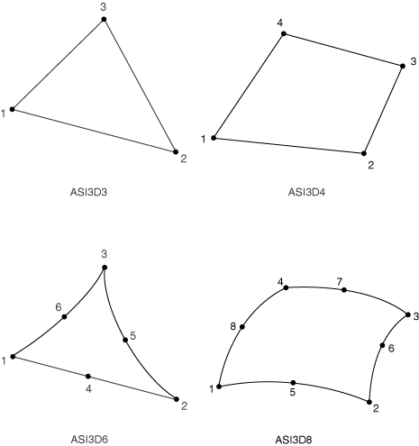
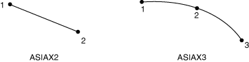

# 32.13.2 Acoustic interface element library


**Products: **Abaqus/Standard  Abaqus/CAE  

##### **References**

- ["Acoustic interface elements," Section 32.13.1](pt06ch32s13alm58.md)
- [*INTERFACE](../key/key-link.md#usb-kws-minterface)

### Overview

This section provides a reference to the acoustic interface elements available in Abaqus/Standard.

### Element types

#### Element for general use

| ASI1 | 1-node |
| --- | --- |
|  |

##### Active degrees of freedom

1, 2, 3, 8

##### Additional solution variables

None.

#### Elements for use in planar models

| ASI2D2 | 2-node linear |
| --- | --- |
|  |

| ASI2D3 | 3-node quadratic |
| --- | --- |
|  |

##### Active degrees of freedom

1, 2, 8

##### Additional solution variables

None.

#### Elements for use in 3D models

| ASI3D3 | 3-node linear |
| --- | --- |
|  |

| ASI3D4 | 4-node linear |
| --- | --- |
|  |

| ASI3D6 | 6-node quadratic |
| --- | --- |
|  |

| ASI3D8 | 8-node quadratic |
| --- | --- |
|  |

##### Active degrees of freedom

1, 2, 3, 8

##### Additional solution variables

None.

#### Elements for use in axisymmetric models

| ASIAX2 | 2-node linear |
| --- | --- |
|  |

| ASIAX3 | 3-node quadratic |
| --- | --- |
|  |

##### Active degrees of freedom

1, 2, 8

##### Additional solution variables

None.

### Nodal coordinates required

General use element: None.

Planar: *X*, *Y*

3D: *X*, *Y*, *Z*

Axisymmetric: *r*, *z*

### Element property definition

For general-use elements, you must define the element's surface area and the direction cosines of the normal to the acoustic fluid-structural interface, pointing into the fluid.

For elements for use in planar models, you must specify the thickness (out-of-plane) of the element. The default is unit thickness if no thickness is specified.

For elements for use in three-dimensional and axisymmetric models, no additional data are required.

| **Input File Usage: ** | ``` [*INTERFACE](../key/key-link.md#usb-kws-minterface) ``` |
| --- | --- |

| **Abaqus/CAE Usage: ** | Property module: **Create Section**: select **Other** as the section **Category** and **Acoustic interface** as the section **Type** |
| --- | --- |
|  | General-use acoustic interface sections are not supported in Abaqus/CAE. |

### Element-based loading

Distributed impedances cannot be applied.

### Element output

None.

### Node ordering on elements

##### Planar


##### 3D



##### Axisymmetric




