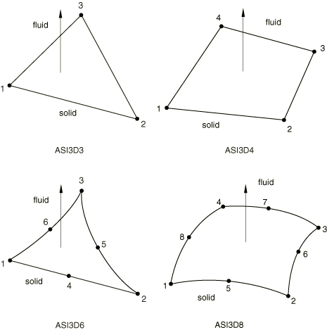

# 32.13.1 Acoustic interface elements


**Products: **Abaqus/Standard  Abaqus/CAE  

##### **References**

- ["Acoustic interface element library," Section 32.13.2](pt06ch32s13ael44.md)
- ["Acoustic, shock, and coupled acoustic-structural analysis," Section 6.10.1](pt03ch06s10at29.md)
- [*INTERFACE](../key/key-link.md#usb-kws-minterface)
- ["Creating acoustic interface sections," Section 12.13.18 of the Abaqus/CAE User's Guide](../usi/usi-link.md#usi-prp-section-acoustic-interface)

### Overview

Acoustic interface elements:
- can be used to couple a model of an acoustic fluid to a structural model containing continuum or structural elements;
- couple the accelerations of the surface of the structural model to the pressure in the acoustic medium;
- can be used in dynamic and steady-state dynamic procedures;
- must be defined with the nodes shared by the acoustic elements and the structural (or solid) elements;
- can be used only in small-displacement simulations and are not intended for use in nonlinear or hydrostatic fluid-structure interactions;
- are ignored in eigenfrequency extraction analyses if the subspace iteration eigensolver is used; and
- if necessary, can be degenerated into triangular elements.

For most problems the surface-based, structural-acoustic capabilities described in ["Mesh tie constraints," Section 35.3.1](pt08ch35s03aus132.md), and in ["Defining tied contact in Abaqus/Standard," Section 36.3.7](pt09ch36s03aus151.md), provide more general and easy to use methods for modeling the interaction between an acoustic fluid and a structure. User-specified acoustic interface elements give you increased control over the coupling specification, at the expense of the convenience of the surface-based procedures.

### Typical applications

The acoustic interface elements are used in simulations where the motion of a solid structure influences the pressure in the acoustic fluid, such as when the vibrations of a car frame produce noise in the passenger compartment; or where the pressure in the fluid affects a neighboring structure, such as when the small-amplitude sloshing of a fluid inside a container affects its response. 

User-specified acoustic interface elements are also useful in problems involving only an acoustic medium because they allow you to specify displacement, velocity, or acceleration boundary conditions directly on the nodes of the acoustic interface elements. In this application, however, you must be aware that the tangential displacements are not coupled to the fluid. Therefore, zero-energy modes may arise involving the displacement degrees of freedom if these nodes are not constrained in the tangential direction. When acoustic interface elements are used to couple fluid and solid elements, this problem does not arise because of the stiffness and inertia of the solid.

### Choosing an appropriate element

The order of the underlying acoustic and structural elements usually dictates which acoustic interface element should be used. The general acoustic interface element, ASI1, can be used in any coupled acoustic-structural simulation; however, normally it is used only with the acoustic link elements (AC1D2 and AC1D3).

### Defining the normal direction of the acoustic-structural interface

The connectivity of the acoustic interface elements and the right-hand rule define the normal direction of the acoustic-structural interface, as shown in ["Acoustic interface element library," Section 32.13.2](pt06ch32s13ael44.md). It is very important that this normal point into the acoustic fluid, as shown in [Figure 32.13.1--1](pt06ch32s13alm58.md#einteracoust-2d-normal) and [Figure 32.13.1--2](pt06ch32s13alm58.md#einteracoust-3d-normal). The one exception is the ASI1 acoustic interface element, where you must define the normal direction.

**Figure 32.13.1–1** Normal directions for two-dimensional and axisymmetric acoustic-structural interface elements.


**Figure 32.13.1–2** Normal directions for three-dimensional acoustic-structural interface elements.



### Defining the acoustic interface element's section properties

You must associate the acoustic interface section definition with a set of acoustic interface elements. This section definition must be used with three-dimensional and axisymmetric acoustic interface elements, even though there are no user-defined geometric properties for these elements.

| **Input File Usage: ** | ``` [*INTERFACE](../key/key-link.md#usb-kws-minterface), ELSET=*element_set_name* ``` |
| --- | --- |

| **Abaqus/CAE Usage: ** | Property module: **Create Section**: select **Other** as the section **Category** and **Acoustic interface** as the section **Type******Assign****Section****: select regions |
| --- | --- |

#### Defining the geometric properties associated with ASI1 elements

The ASI1 elements consist of a single node. Abaqus/Standard cannot calculate the surface area associated with these elements, so you must supply this information. If accurate surface areas are not given, Abaqus/Standard may calculate incorrect accelerations or acoustic fluid pressure at the acoustic-structural interface.

In addition, Abaqus/Standard cannot calculate the direction of the interface normal associated with these elements. You must provide the direction cosines, in the global Cartesian coordinate system, of the interface normal for these elements.

| **Input File Usage: ** | ``` [*INTERFACE](../key/key-link.md#usb-kws-minterface) *surface area*, *X**-direction cosine*, *Y**-direction cosine*, *Z**-direction cosine* ``` |
| --- | --- |

| **Abaqus/CAE Usage: ** | General-use acoustic interface sections are not supported in Abaqus/CAE. |
| --- | --- |

#### Defining the thickness for planar acoustic interface elements

You can specify the thickness of planar acoustic interface elements. The default value is unit thickness.

| **Input File Usage: ** | ``` [*INTERFACE](../key/key-link.md#usb-kws-minterface) *thickness* ``` |
| --- | --- |

| **Abaqus/CAE Usage: ** | Property module: **Create Section**: select **Other** as the section **Category** and **Acoustic interface** as the section **Type**: **Plane stress/strain thickness**: *thickness* |
| --- | --- |

### Using acoustic interface elements when elements with different interpolation orders form the acoustic-structural interface

It is normally assumed that the same order of interpolation will be used for both the acoustic fluid mesh and the structural mesh (at least at the interface surfaces). If this is not the case, suitable MPCs must be applied to the nodes along the acoustic-structural interface to maintain the compatibility in the pressure (MPC type P LINEAR) or displacement fields (MPC type LINEAR).


