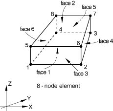

# 32.14.2 Eulerian element library


**Products: **Abaqus/Explicit  Abaqus/CAE  

##### **References**

- ["Eulerian analysis," Section 14.1.1](pt04ch14s01aus90.md)
- [*EULERIAN SECTION](../key/key-link.md#usb-kws-meulsection)

### Overview

This section provides a reference to the Eulerian elements available in Abaqus/Explicit.

### Element types

#### Eulerian stress/displacement element

| EC3D8R | 8-node linear brick, multimaterial, reduced integration with hourglass control |
| --- | --- |
|  |

##### Active degrees of freedom

1, 2, 3

##### Additional solution variables

None.

#### Eulerian thermally coupled element

| EC3D8RT | 8-node thermally coupled linear brick, multimaterial, reduced integration with hourglass control |
| --- | --- |
|  |

##### Active degrees of freedom

1, 2, 3,11

##### Additional solution variables

None.

### Nodal coordinates required

*X*, *Y*, *Z*

### Element property definition

You must specify a list of materials that may be present in the Eulerian element. You can also assign a material instance name to each material (see ["Eulerian section definition" in "Eulerian analysis," Section 14.1.1](pt04ch14s01aus90.md#usb-anl-aeuleriananal-section)).

| **Input File Usage: ** | ``` [*EULERIAN SECTION](../key/key-link.md#usb-kws-meulsection) ``` |
| --- | --- |

| **Abaqus/CAE Usage: ** | Property module: **Create Section**: select **Solid** as the section **Category** and **Eulerian** as the section **Type** |
| --- | --- |

### Element-based loading

### Distributed loads

Distributed loads are available only for Eulerian elements. They are specified as described in ["Distributed loads," Section 34.4.3](pt07ch34s04aus122.md).

**Load ID (*DLOAD):**  BX**Abaqus/CAE Load/Interaction:**  **Body force****Units:**  [FL3](../popups/usb-int-iconventions-unitsym.md)**Description:  **Body force in global *X*-direction.

**Load ID (*DLOAD):**  BY**Abaqus/CAE Load/Interaction:**  **Body force****Units:**  [FL3](../popups/usb-int-iconventions-unitsym.md)**Description:  **Body force in global *Y*-direction.

**Load ID (*DLOAD):**  BZ**Abaqus/CAE Load/Interaction:**  **Body force****Units:**  [FL3](../popups/usb-int-iconventions-unitsym.md)**Description:  **Body force in global *Z*-direction.

**Load ID (*DLOAD):**  BXNU**Abaqus/CAE Load/Interaction:**  **Body force****Units:**  [FL3](../popups/usb-int-iconventions-unitsym.md)**Description:  **Nonuniform body force in global *X*-direction with magnitude supplied via user subroutine [`DLOAD`](../sub/sub-link.md#sub-xsl-dload) in Abaqus/Standard and [`VDLOAD`](../sub/sub-link.md#sub-xsl-vdload) in Abaqus/Explicit.

**Load ID (*DLOAD):**  BYNU**Abaqus/CAE Load/Interaction:**  **Body force****Units:**  [FL3](../popups/usb-int-iconventions-unitsym.md)**Description:  **Nonuniform body force in global *Y*-direction with magnitude supplied via user subroutine [`DLOAD`](../sub/sub-link.md#sub-xsl-dload) in Abaqus/Standard  and [`VDLOAD`](../sub/sub-link.md#sub-xsl-vdload) in Abaqus/Explicit.

**Load ID (*DLOAD):**  BZNU**Abaqus/CAE Load/Interaction:**  **Body force****Units:**  [FL3](../popups/usb-int-iconventions-unitsym.md)**Description:  **Nonuniform body force in global *Z*-direction with magnitude supplied via user subroutine [`DLOAD`](../sub/sub-link.md#sub-xsl-dload) in Abaqus/Standard  and [`VDLOAD`](../sub/sub-link.md#sub-xsl-vdload) in Abaqus/Explicit.

**Load ID (*DLOAD):**  GRAV**Abaqus/CAE Load/Interaction:**  **Gravity****Units:**  [LT2](../popups/usb-int-iconventions-unitsym.md)**Description:  **Gravity loading in a specified direction (magnitude is input as acceleration).

**Load ID (*DLOAD):**  P*n***Abaqus/CAE Load/Interaction:**  **Pressure****Units:**  [FL2](../popups/usb-int-iconventions-unitsym.md)**Description:  **Pressure on face *n*.

**Load ID (*DLOAD):**  P*n*NU**Abaqus/CAE Load/Interaction:**  Not supported**Units:**  [FL2](../popups/usb-int-iconventions-unitsym.md)**Description:  **Nonuniform pressure on face *n* with magnitude supplied via user subroutine [`DLOAD`](../sub/sub-link.md#sub-xsl-dload) in Abaqus/Standard and [`VDLOAD`](../sub/sub-link.md#sub-xsl-vdload) in Abaqus/Explicit.

**Load ID (*DLOAD):**  SBF**Abaqus/CAE Load/Interaction:**  Not supported**Units:**  [FL5T2](../popups/usb-int-iconventions-unitsym.md)**Description:  **Stagnation body force in global *X*-, *Y*-, and *Z*-directions.

**Load ID (*DLOAD):**  SP*n***Abaqus/CAE Load/Interaction:**  Not supported**Units:**  [FL4T2](../popups/usb-int-iconventions-unitsym.md)**Description:  **Stagnation pressure on face *n*.

**Load ID (*DLOAD):**  TRSHR*n***Abaqus/CAE Load/Interaction:**  **Surface traction****Units:**  [FL2](../popups/usb-int-iconventions-unitsym.md)**Description:  **Shear traction on face *n*.

**Load ID (*DLOAD):**  TRVEC*n***Abaqus/CAE Load/Interaction:**  **Surface traction****Units:**  [FL2](../popups/usb-int-iconventions-unitsym.md)**Description:  **General traction on face *n*.

**Load ID (*DLOAD):**  VBF**Abaqus/CAE Load/Interaction:**  Not supported**Units:**  [FL4T](../popups/usb-int-iconventions-unitsym.md)**Description:  **Viscous body force in global *X*-, *Y*-, and *Z*-directions.

**Load ID (*DLOAD):**  VP*n***Abaqus/CAE Load/Interaction:**  Not supported**Units:**  [FL3T](../popups/usb-int-iconventions-unitsym.md)**Description:  **Viscous pressure on face *n*, applying a pressure proportional to the velocity normal to the face and opposing the motion.

### Distributed heat fluxes

Distributed heat fluxes are available only for EC3D8RT elements. They are specified as described in ["Thermal loads," Section 34.4.4](pt07ch34s04aus123.md).

**Load ID (*DFLUX):**  BF**Abaqus/CAE Load/Interaction:**  **Body heat flux****Units:**  [JL3T1](../popups/usb-int-iconventions-unitsym.md)**Description:  **Heat body flux per unit volume.

**Load ID (*DFLUX):**  S*n***Abaqus/CAE Load/Interaction:**  **Surface heat flux****Units:**  [JL2T1](../popups/usb-int-iconventions-unitsym.md)**Description:  **Heat surface flux per unit area into face *n*.

### Film conditions

Film conditions are available only for EC3D8RT elements. They are specified as described in ["Thermal loads," Section 34.4.4](pt07ch34s04aus123.md).

**Load ID (*FILM):**  F*n***Abaqus/CAE Load/Interaction:**  **Surface film condition****Units:**  [JL2T11](../popups/usb-int-iconventions-unitsym.md)**Description:  **Film coefficient and sink temperature (units of ) provided on face *n*.

### Radiation types

Radiation conditions are available only for EC3D8RT elements. They are specified as described in ["Thermal loads," Section 34.4.4](pt07ch34s04aus123.md).

**Load ID (*RADIATE):**  R*n***Abaqus/CAE Load/Interaction:**  **Surface radiation****Units:**  [Dimensionless](../popups/usb-int-iconventions-unitsym.md)**Description:  **Emissivity and sink temperature (units of ) provided on face *n*.

### Surface-based loading

### Distributed loads

Surface-based distributed loads are available for Eulerian elements. They are specified as described in ["Distributed loads," Section 34.4.3](pt07ch34s04aus122.md).

**Load ID (*DSLOAD):**  P**Abaqus/CAE Load/Interaction:**  **Pressure****Units:**  [FL2](../popups/usb-int-iconventions-unitsym.md)**Description:  **Pressure on the element surface. 

**Load ID (*DSLOAD):**  PNU**Abaqus/CAE Load/Interaction:**  **Pressure****Units:**  [FL2](../popups/usb-int-iconventions-unitsym.md)**Description:  **Nonuniform pressure on the element surface with magnitude supplied via user subroutine [`DLOAD`](../sub/sub-link.md#sub-xsl-dload) in Abaqus/Standard and [`VDLOAD`](../sub/sub-link.md#sub-xsl-vdload) in Abaqus/Explicit.

**Load ID (*DSLOAD):**  SP**Abaqus/CAE Load/Interaction:**  **Pressure****Units:**  [FL4T2](../popups/usb-int-iconventions-unitsym.md)**Description:  **Stagnation pressure on the element surface.

**Load ID (*DSLOAD):**  TRSHR**Abaqus/CAE Load/Interaction:**  **Surface traction****Units:**  [FL2](../popups/usb-int-iconventions-unitsym.md)**Description:  **Shear traction on the element surface.

**Load ID (*DSLOAD):**  TRVEC**Abaqus/CAE Load/Interaction:**  **Surface traction****Units:**  [FL2](../popups/usb-int-iconventions-unitsym.md)**Description:  **General traction on the element surface.

**Load ID (*DSLOAD):**  VP**Abaqus/CAE Load/Interaction:**  **Pressure****Units:**  [FL3T](../popups/usb-int-iconventions-unitsym.md)**Description:  **Viscous pressure applied on the element surface. The viscous pressure is proportional to the velocity normal to the element face and opposing the motion.

### Distributed heat fluxes

Surface-based heat fluxes are available only for EC3D8RT elements. They are specified as described in ["Thermal loads," Section 34.4.4](pt07ch34s04aus123.md).

**Load ID (*DSFLUX):**  S**Abaqus/CAE Load/Interaction:**  **Surface heat flux****Units:**  [JL2T1](../popups/usb-int-iconventions-unitsym.md)**Description:  **Heat surface flux per unit area into the element surface.

### Film conditions

Surface-based film conditions are available only for EC3D8RT elements. They are specified as described in ["Thermal loads," Section 34.4.4](pt07ch34s04aus123.md).

**Load ID (*SFILM):**  F**Abaqus/CAE Load/Interaction:**  **Surface film condition****Units:**  [JL2T11](../popups/usb-int-iconventions-unitsym.md)**Description:  **Film coefficient and sink temperature (units of ) provided on the element surface.

### Radiation types

Surface-based radiation conditions are available only for EC3D8RT elements. They are specified as described in ["Thermal loads," Section 34.4.4](pt07ch34s04aus123.md).

**Load ID (*SRADIATE):**  R**Abaqus/CAE Load/Interaction:**  **Surface radiation****Units:**  [Dimensionless](../popups/usb-int-iconventions-unitsym.md)**Description:  **Emissivity and sink temperature (units of ) provided on the element surface.

### Element output

A set of output variables is written for each Eulerian material instance listed in the Eulerian section definition. The output variable names are automatically appended with the material instance names. For example, if you define material instances named “steel” and “tin” and request stress output, the first stress components will be written to separate output variables named “S11_steel” and “S11_tin.”

All output is given in global coordinates.

#### Stress and other tensor components

Stress and other tensors (excluding total strain tensors) are available. All tensors have the same components. For example, the stress components are as follows:

| S11 | , direct stress. |
| --- | --- |

| S22 | , direct stress. |
| --- | --- |

| S33 | , direct stress. |
| --- | --- |

| S12 | , shear stress. |
| --- | --- |

| S13 | , shear stress. |
| --- | --- |

| S23 | , shear stress. |
| --- | --- |

#### Element-averaged quantities

Several output variables are also available as element-averaged quantities. These variables are computed as a volume fraction weighted average of all materials present in the element. Use of these variables can substantially decrease the size of the output database for models with many Eulerian materials. For example:

| SVAVG | Volume fraction averaged stress. |
| --- | --- |

### Node ordering and face numbering on elements

All elements must have eight nodes. Degenerate elements are not supported.



##### Element faces

| Face 1 | 1 -- 2 -- 3 -- 4 face |
| --- | --- |
| Face 2 | 5 -- 8 -- 7 -- 6 face |
| Face 3 | 1 -- 5 -- 6 -- 2 face |
| Face 4 | 2 -- 6 -- 7 -- 3 face |
| Face 5 | 3 -- 7 -- 8 -- 4 face |
| Face 6 | 4 -- 8 -- 5 -- 1 face |

### Numbering of integration points for output

The single integration point is located at the centroid of the element. All materials within the element are evaluated at this integration point.


