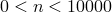
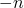

# 32.15.2 User-defined element library


**Products: **Abaqus/Standard  Abaqus/Explicit  

##### **References**

- ["User-defined elements," Section 32.15.1](pt06ch32s15alm60.md)
- ["UEL," Section 1.1.28 of the Abaqus User Subroutines Reference Guide](../sub/sub-link.md#sub-rtn-uuel)
- ["UELMAT," Section 1.1.29 of the Abaqus User Subroutines Reference Guide](../sub/sub-link.md#sub-rtn-uuelmat)
- ["VUEL," Section 1.2.12 of the Abaqus User Subroutines Reference Guide](../sub/sub-link.md#sub-rtn-uexpuel)
- [*MATRIX](../key/key-link.md#usb-kws-mmatrix)
- [*UEL PROPERTY](../key/key-link.md#usb-kws-muelproperty)
- [*USER ELEMENT](../key/key-link.md#usb-kws-muserelement)

### Overview

This section provides a reference to the user-defined elements available in Abaqus/Standard and Abaqus/Explicit.

### Element types

| U*n* | *n* must be a positive integer () that will define the element type uniquely in Abaqus/Standard |
| --- | --- |
|  |

| VU*n* | *n* must be a positive integer () that will define the element type uniquely in Abaqus/Explicit |
| --- | --- |
|  |

##### Active degrees of freedom

As defined in the user element definition.

##### Additional solution variables

You can define solution variables associated with nodes that are not connected to other elements. However, in Abaqus/Standard, definition of constraints with Lagrange multipliers in user elements should be avoided because of potential equation solver problems.

 In Abaqus/Explicit definition of constraints with Lagrange multipliers is not possible because the stable time increment would decrease to infinitesimally small values.

### Nodal coordinates required

None required for linear user elements.

As needed in user subroutines [`UEL`](../sub/sub-link.md#sub-xsl-uel), [`UELMAT`](../sub/sub-link.md#sub-xsl-uelmat), or [`VUEL`](../sub/sub-link.md#sub-xsl-vuel) for general user elements. The maximum number of coordinates per node is specified in the user element definition (see ["Defining the maximum number of coordinates needed at any nodal point" in "User-defined elements," Section 32.15.1](pt06ch32s15alm60.md#usb-elm-euserelem-coords)). The first coordinate entries at each node should correspond to the standard Abaqus convention (*X*, *Y*, *Z* or *r*, *z* for axisymmetric elements).

### Element property definition

For a linear user element the properties are the stiffness and mass, defined via user-defined matrices or read from an Abaqus/Standard results file. If necessary, you can specify Rayleigh damping values for linear user elements in the element property definition.

For a general user element defined via user subroutines [`UEL`](../sub/sub-link.md#sub-xsl-uel), [`UELMAT`](../sub/sub-link.md#sub-xsl-uelmat), or [`VUEL`](../sub/sub-link.md#sub-xsl-vuel), you define the number of element properties in the user element definition and provide the numerical values in the element property definition. The definition of these properties depends on your coding in subroutine [`UEL`](../sub/sub-link.md#sub-xsl-uel), [`UELMAT`](../sub/sub-link.md#sub-xsl-uelmat), or [`VUEL`](../sub/sub-link.md#sub-xsl-vuel).

| **Input File Usage: ** | ``` [*UEL PROPERTY](../key/key-link.md#usb-kws-muelproperty) ``` |
| --- | --- |

### Element-based loading

None for linear user elements.

U*n*: Distributed load or flux whose magnitude is given via distributed load or distributed flux loading definitions (see ["Distributed loads," Section 34.4.3](pt07ch34s04aus122.md), or ["Thermal loads," Section 34.4.4](pt07ch34s04aus123.md)) for a general user element. *n* must be a positive integer that is passed into user subroutines [`UEL`](../sub/sub-link.md#sub-xsl-uel), [`UELMAT`](../sub/sub-link.md#sub-xsl-uelmat), or [`VUEL`](../sub/sub-link.md#sub-xsl-vuel) to identify the particular load type.

U*n*NU: Available in Abaqus/Standard only. Distributed load or flux that is completely defined as equivalent nodal values inside user subroutine [`UEL`](../sub/sub-link.md#sub-xsl-uel) or [`UELMAT`](../sub/sub-link.md#sub-xsl-uelmat) for a general user element. *n* must be a positive integer:  will be passed into subroutine [`UEL`](../sub/sub-link.md#sub-xsl-uel) or [`UELMAT`](../sub/sub-link.md#sub-xsl-uelmat) when such a load is active to identify the load type. The minus sign on *n* indicates that the load is of type NU.

### Element output

For a linear user element there are no stress or strain components since the element only appears as a stiffness and mass.

For a general user element any stress, strain, or other solution-dependent variables within the element must be defined as solution-dependent state variables by your coding within subroutine [`UEL`](../sub/sub-link.md#sub-xsl-uel), [`UELMAT`](../sub/sub-link.md#sub-xsl-uelmat), or [`VUEL`](../sub/sub-link.md#sub-xsl-vuel). In Abaqus/Standard, they can be output using output variable SDV.

Currently element output to the output database is not supported for user-defined elements.

### Node ordering on elements

As defined in the user element definition.


