# 32.15.1 User-defined elements


**Products: **Abaqus/Standard  Abaqus/Explicit  

##### **References**

- ["User-defined element library," Section 32.15.2](pt06ch32s15ael46.md)
- ["UEL," Section 1.1.28 of the Abaqus User Subroutines Reference Guide](../sub/sub-link.md#sub-rtn-uuel)
- ["UELMAT," Section 1.1.29 of the Abaqus User Subroutines Reference Guide](../sub/sub-link.md#sub-rtn-uuelmat)
- ["VUEL," Section 1.2.12 of the Abaqus User Subroutines Reference Guide](../sub/sub-link.md#sub-rtn-uexpuel)
- ["Accessing Abaqus thermal materials," Section 2.1.18 of the Abaqus User Subroutines Reference Guide](../sub/sub-link.md#sub-utl-ugetmaterialht)
- ["Accessing Abaqus materials," Section 2.1.17 of the Abaqus User Subroutines Reference Guide](../sub/sub-link.md#sub-utl-ugetmaterialmech)
- [*MATRIX](../key/key-link.md#usb-kws-mmatrix)
- [*UEL PROPERTY](../key/key-link.md#usb-kws-muelproperty)
- [*USER ELEMENT](../key/key-link.md#usb-kws-muserelement)

### Overview

User-defined elements:
- can be finite elements in the usual sense of representing a geometric part of the model;
- can be feedback links, supplying forces at some points as functions of values of displacement, velocity, etc. at other points in the model;
- can be used to solve equations in terms of nonstandard degrees of freedom;
- can be linear or nonlinear; and
- can access selected materials from the Abaqus material library.

### Assigning an element type key to a user-defined element

You must assign an element type key to a user-defined element. The element type key must be of the form U*n* in Abaqus/Standard and VU*n* in Abaqus/Explicit, where *n* is a positive integer that identifies the element type uniquely.  For example, you can define element types U1, U2, U3, VU1, VU7, etc. In Abaqus/Standard *n* must be less than 10000; while in Abaqus/Explicit *n* must be less than 9000.

The element type key is used to identify the element in the element definition. For general user elements the integer part of the identifier is provided in user subroutines [`UEL`](../sub/sub-link.md#sub-xsl-uel), [`UELMAT`](../sub/sub-link.md#sub-xsl-uelmat) and [`VUEL`](../sub/sub-link.md#sub-xsl-vuel) so that you can distinguish between different element types.

| **Input File Usage: ** | ``` [*USER ELEMENT](../key/key-link.md#usb-kws-muserelement), TYPE=*element_type* ``` |
| --- | --- |

### Invoking user-defined elements

User-defined elements are invoked in the same way as native Abaqus elements: you specify the element type, U*n* or VU*n*, and define element numbers and nodes associated with each element (see ["Defining a model in Abaqus," Section 1.3.1](pt01ch01s03aus03.md)). User elements can be assigned to element sets in the usual way, for cross-reference to element property definitions, output requests, distributed load specifications, etc.

Material definitions (["Material data definition," Section 21.1.2](pt05ch21s01aus109.md)) are relevant only to user-defined elements in Abaqus/Standard. If a material is assigned to a user-defined element (["Assigning an Abaqus material to the user element](pt06ch32s15alm60.md#usb-elm-euserelem-material)”), user subroutine [`UELMAT`](../sub/sub-link.md#sub-xsl-uelmat) will be used to define the element response. User subroutine [`UELMAT`](../sub/sub-link.md#sub-xsl-uelmat) allows access to selected Abaqus materials. If no material definition is specified, all material behavior must be defined in user subroutines [`UEL`](../sub/sub-link.md#sub-xsl-uel) and [`VUEL`](../sub/sub-link.md#sub-xsl-vuel), based on user-defined material constants and on solution-dependent state variables associated with the element and calculated in the same subroutines. For linear user elements all material behavior must be defined through a user-defined stiffness matrix.

| **Input File Usage: ** | Use the following options to invoke a user-defined element: |
| --- | --- |
|  | ``` [*USER ELEMENT](../key/key-link.md#usb-kws-muserelement), TYPE=*element_type* [*ELEMENT](../key/key-link.md#usb-kws-melement), TYPE=*element_type* ``` |

### Defining the active degrees of freedom at the nodes

Any number of user element types can be defined and used in a model. Each user element can have any number of nodes, at each of which a specified set of degrees of freedom is used by the element. The activated degrees of freedom should follow the Abaqus convention (["Conventions," Section 1.2.2](pt01ch01s02aus02.md)). In Abaqus/Standard this is important because the convergence criteria are based on the degrees of freedom numbers. In Abaqus/Explicit the activated degrees of freedom must follow the Abaqus convention because these are the only degrees of freedom that can be updated. 

Abaqus always works in the global system when passing information to or from a user element. Therefore, the user element's stiffness, mass, etc. should always be defined with respect to global directions at its nodes, even if local transformations (["Transformed coordinate systems," Section 2.1.5](pt01ch02s01aus09.md)) are applied to some of these nodes.

You define the ordering of the variables on a user element. The standard and recommended ordering is such that the degrees of freedom at the first node appear first, followed by the degrees of freedom at the second node, etc. For example, suppose that the user-defined element type is a planar beam with three nodes. The element uses degrees of freedom 1, 2, and 6 (, , and ) at its first and last node and degrees of freedom 1 and 2 at its second (middle) node. In this case the ordering of variables on the element is: 

| Element variable number | Node | Degree of freedom |
| --- | --- | --- |
| 1 | 1 | 1 |
| 2 | 1 | 2 |
| 3 | 1 | 6 |
| 4 | 2 | 1 |
| 5 | 2 | 2 |
| 6 | 3 | 1 |
| 7 | 3 | 2 |
| 8 | 3 | 6 |

This ordering will be used in most cases. However, if you define an element matrix that does not have its degrees of freedom ordered in this way, you can change the ordering of the degrees of freedom as outlined below.

You specify the active degrees of freedom at each node of the element. If the degrees of freedom are the same at all of the element's nodes, you specify the list of degrees of freedom only once. Otherwise, you specify a new list of degrees of freedom each time the degrees of freedom at a node are different from those at previous nodes. Thus, different nodes of the element can use different degrees of freedom; this is especially useful when the element is being used in a coupled field problem so that, for example, some of its nodes have displacement degrees of freedom only, while others have displacement and temperature degrees of freedom. This method will produce an ordering of the element variables such that all of the degrees of freedom at the first node appear first, followed by the degrees of freedom at the second node, etc.

In Abaqus/Standard there are two ways to define element variable numbers that order the degrees of freedom on the element differently.

Since the user element can accept repeated node numbers when defining the nodal connectivity for the element, the element can be declared to have one node per degree of freedom on the element. For example, if the element is a planar, 3-node triangle for stress analysis, it has three nodes, each of which has degrees of freedom 1 and 2. If all degrees of freedom 1 are to appear first in the element variables, the element can be defined with six nodes, the first three of which have degree of freedom 1, while nodes 4–6 have degree of freedom 2. The element variables would be ordered as follows: 

| Element variable number | Node | Degree of freedom |
| --- | --- | --- |
| 1 | 1 | 1 |
| 2 | 2 | 1 |
| 3 | 3 | 1 |
| 4 | 4 | 2 |
| 5 | 5 | 2 |
| 6 | 6 | 2 |

Alternatively, the user element variables can be defined so as to order the degrees of freedom on the element in any arbitrary fashion. You specify a list of degrees of freedom for the first node on the element. All nodes with a nodal connectivity number that is less than the next connectivity number for which a list of degrees of freedom is specified will have the first list of degrees of freedom. The second list of degrees of freedom will be used for all nodes until a new list is defined, etc. If a new list of degrees of freedom is encountered with a nodal connectivity number that is less than or equal to that given with the previous list, the previous list's degrees of freedom will be assigned through the last node of the element. This generation of degrees of freedom can be stopped before the last node on the element by specifying a nodal connectivity number with an empty (blank) list of degrees of freedom.

#### Example

The above procedure continues using this new list to define additional degrees of freedom in accordance with the new node and degrees of freedom. For example, consider a 3-node beam that has degrees of freedom 1, 2, and 6 at nodes 1 and 3 and degrees of freedom 1 and 2 at node 2 (middle node). To order degrees of freedom 1 first, followed by 2, followed by 6, the following input could be used:

```
[*USER ELEMENT](../key/key-link.md#usb-kws-muserelement)
1
1, 2
1, 6
2,
3, 6
```
In this case the ordering of the variables on the element is: 

| Element variable number | Node | Degree of freedom |
| --- | --- | --- |
| 1 | 1 | 1 |
| 2 | 2 | 1 |
| 3 | 3 | 1 |
| 4 | 1 | 2 |
| 5 | 2 | 2 |
| 6 | 3 | 2 |
| 7 | 1 | 6 |
| 8 | 3 | 6 |

#### Requirements for activated degrees of freedom in Abaqus/Explicit

There are the following additional requirements with respect to activated degrees of freedom on a user element of type VU*n*: 
- Only degrees of freedom 1 through 6, 8, and 11 can be activated because these are the only degrees of freedom numbers that can be updated in Abaqus/Explicit. (In Abaqus/Standard degrees of freedom 1 through 30 can be used.)
- If one translational degree of freedom is activated at a node, all translational degrees of freedom up to the specified maximum number of coordinates must be activated at that node; moreover, the translational degrees of freedom at the node must be in consecutive order.
- In three-dimensional analyses, if one rotational degree of freedom is activated at a node, all three rotational degrees of freedom must be activated in consecutive order.

For example, if you define a 4-node three-dimensional user element that has translations and rotations active at the first and fourth nodes, temperature only at the second node, and translations and temperature at the third node, the following input could be used: 
```
[*USER ELEMENT](../key/key-link.md#usb-kws-muserelement)
1,2,3,4,5,6
2,11
3,1,2,3,11
4,1,2,3,4,5,6
```

#### Rotation update in geometrically nonlinear analyses

If all three rotational degrees of freedom (4, 5, and 6) are used at a node in a geometrically nonlinear analysis, Abaqus assumes that these rotations are finite rotations. In this case the incremental values of these degrees of freedom are not simply added to the total values: the quaternion update formulae are used instead. Similarly, the corrections are not simply added to the incremental values. The update procedure is described in ["Rotation variables," Section 1.3.1 of the Abaqus Theory Guide](../stm/stm-link.md#stm-int-rotationvars), and is mentioned in ["Conventions," Section 1.2.2](pt01ch01s02aus02.md).

To avoid the rotation update in a geometrically nonlinear analysis in Abaqus/Standard, you may define repeated node numbers in the nodal connectivity of the element such that at least one of the degrees of freedom 4, 5, or 6 is missing from the degree of freedom list at each node.

### Visualizing user-defined elements in Abaqus/CAE

Plotting of user elements is not supported in Abaqus/CAE. However, if the user elements contain displacement degrees of freedom, they can be overlaid with standard elements; and model plots of these standard elements can be displayed, allowing you to see the shape of the user elements. If deformed mesh plots of the user elements are required, the material properties of the overlaying standard elements must be chosen so that the solution is not changed by including them. If this technique is used, nodes of the user element will be tied to nodes of the standard elements. Therefore, degrees of freedom 1, 2, and 3 in the user element must correspond to the displacement degrees of freedom at the nodes of the standard elements.

### Defining a linear user element in Abaqus/Standard

Linear user elements can be defined only in Abaqus/Standard. In the simplest case a linear user element can be defined as a stiffness matrix and, if required, a mass matrix. These matrices can be read from a results file or defined directly.

#### Reading the element matrices from an Abaqus/Standard results file

To read the element matrices from an Abaqus/Standard results file, you must have written the stiffness and/or mass matrices in a previous analysis to the results file as element matrix output (["Element matrix output in Abaqus/Standard" in "Output," Section 4.1.1](pt02ch04s01aus38.md#usb-out-ooutput-elemmatrix)) or substructure matrix output (["Writing the recovery matrix, reduced stiffness matrix, mass matrix, load case vectors, and gravity vectors to a file" in "Defining substructures," Section 10.1.2](pt04ch10s01aus59.md#usb-anl-asuperelementdef-output)).

You must specify the element number, *n*, or substructure identifier, Z*n*, to which the matrices correspond. For models defined in terms of an assembly of part instances (["Defining an assembly," Section 2.10.1](pt01ch02s10aus28.md)), the element numbers written to the results file are internal numbers generated by Abaqus/Standard (see ["Output," Section 4.1.1](pt02ch04s01aus38.md)). A map between these internal numbers and the original element numbers and part instance names is provided in the data file of the analysis from which the element matrix output was written.

In addition, for element matrix output you must specify the step number and increment number at which the element matrix was written. These items are not required if a substructure whose matrix was output during its generation is used.

| **Input File Usage: ** | ``` [*USER ELEMENT](../key/key-link.md#usb-kws-muserelement), FILE=*name*, OLD ELEMENT=*n* or Z*n*, STEP=*n*, INCREMENT=*n* ``` |
| --- | --- |

#### Defining the linear user element by specifying the matrices directly

If you define the stiffness and/or mass matrix directly, you must specify the number of nodes associated with the element.

| **Input File Usage: ** | ``` [*USER ELEMENT](../key/key-link.md#usb-kws-muserelement), LINEAR, NODES=*n* ``` |
| --- | --- |

##### Defining whether or not the element matrices are symmetric

If the element matrices are not symmetric, you can request that Abaqus/Standard use its nonsymmetric equation solution capability (see ["Defining an analysis," Section 6.1.2](pt03ch06s01abo05.md)).

| **Input File Usage: ** | ``` [*USER ELEMENT](../key/key-link.md#usb-kws-muserelement), LINEAR, NODES=*n*, UNSYMM ``` |
| --- | --- |

##### Defining the mass or stiffness matrix

You define the element mass matrix and the element stiffness matrix separately. If the element is a heat transfer element, the “stiffness matrix” is the conductivity matrix and the “mass matrix” is the specific heat matrix.

You can define either one matrix for the element (mass or stiffness) or both types of matrices.

You can read the mass and/or stiffness matrices from a file or define them directly. In either case Abaqus/Standard reads four values per line, using F20 format. This format ensures that the data are read with adequate precision. Data written in E20.14 format can be read under this format.

Start with the first column of the matrix. Start a new line for each column. If you do not specify that the element matrix is unsymmetric, give the matrix entries from the top of each column to the diagonal term only: do not give the terms below the diagonal. If you specify that the element matrix is unsymmetric, give all terms in each column, starting from the top of the column.

| **Input File Usage: ** | Use the following option to define the element mass matrix: |
| --- | --- |
|  | ``` [*MATRIX](../key/key-link.md#usb-kws-mmatrix), TYPE=MASS ``` Use the following option to define the element stiffness matrix: ``` [*MATRIX](../key/key-link.md#usb-kws-mmatrix), TYPE=STIFFNESS ``` Use the following option to read the element mass or stiffness matrix from a file: ``` [*MATRIX](../key/key-link.md#usb-kws-mmatrix), TYPE=MASS or STIFFNESS, INPUT=*file_name* ``` For example, if the matrix is symmetric, the following data lines should be used: ```                      Etc. ``` If the matrix is unsymmetric, the following data lines should be used: ```         … …,      Etc. ``` where *m* is the size of the matrix and  is the entry in the matrix for row *i* column *j*. |

##### Geometrically nonlinear analysis

When a linear user element is used in a geometrically nonlinear analysis, the stiffness matrix provided will not be updated to account for any nonlinear effects such as finite rotations.

#### Defining the element properties

You must associate a property definition with every user element, even though no property values (except Rayleigh damping factors) are associated with linear user elements.

| **Input File Usage: ** | Use the following option to associate a property definition with a user element set: |
| --- | --- |
|  | ``` [*UEL PROPERTY](../key/key-link.md#usb-kws-muelproperty), ELSET=*name* ``` |

##### Defining Rayleigh damping for direct-integration dynamic analysis

You can define the Rayleigh damping factors for direct-integration dynamic analysis (["Implicit dynamic analysis using direct integration," Section 6.3.2](pt03ch06s03at07.md)) for linear user elements. The Rayleigh damping factors are defined as 

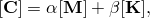

where  is the damping matrix, 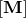 is the mass matrix, 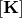 is the stiffness matrix, and  and  are the user-specified damping factors. See ["Material damping," Section 26.1.1](pt05ch26s01abm51.md), for more information on Rayleigh damping.

| **Input File Usage: ** | ``` [*UEL PROPERTY](../key/key-link.md#usb-kws-muelproperty), ELSET=*name*, ALPHA=, BETA= ``` |
| --- | --- |

#### Defining loads

You can apply point loads, moments, fluxes, etc.  to the nodes of linear user-defined elements in the usual way using concentrated loads and concentrated fluxes (["Concentrated loads," Section 34.4.2](pt07ch34s04aus121.md), and ["Thermal loads," Section 34.4.4](pt07ch34s04aus123.md)).

Distributed loads and fluxes cannot be defined for linear user-defined elements.

### Defining a general user element

General user elements are defined in user subroutines [`UEL`](../sub/sub-link.md#sub-xsl-uel) and [`UELMAT`](../sub/sub-link.md#sub-xsl-uelmat) in Abaqus/Standard and in user subroutine [`VUEL`](../sub/sub-link.md#sub-xsl-vuel) in Abaqus/Explicit. *The implementation of user elements in user subroutines is recommended only for advanced users.*

#### Defining the number of nodes associated with the element

You must specify the number of nodes associated with a general user element. You can define “internal” nodes that are not connected to other elements.

| **Input File Usage: ** | ``` [*USER ELEMENT](../key/key-link.md#usb-kws-muserelement), NODES=*n* ``` |
| --- | --- |

#### Defining whether or not the element matrices are symmetric in Abaqus/Standard

If the contribution of the element to the Jacobian operator matrix of the overall Newton method is not symmetric (i.e., the element matrices are not symmetric), you can request that Abaqus/Standard use its nonsymmetric equation solution capability (see ["Defining an analysis," Section 6.1.2](pt03ch06s01abo05.md)).

| **Input File Usage: ** | ``` [*USER ELEMENT](../key/key-link.md#usb-kws-muserelement), NODES=*n*, UNSYMM ``` |
| --- | --- |

#### Defining the maximum number of coordinates needed at any nodal point

You can define the maximum number of coordinates needed in user subroutines [`UEL`](../sub/sub-link.md#sub-xsl-uel), [`UELMAT`](../sub/sub-link.md#sub-xsl-uelmat), or [`VUEL`](../sub/sub-link.md#sub-xsl-vuel) at any node point of the element. Abaqus assigns space to store this many coordinate values at all of the nodes associated with elements of this type. The default maximum number of coordinates at each node is 1.

Abaqus will change the maximum number of coordinates to be the maximum of the user-specified value or the value of the largest active degree of freedom of the user element that is less than or equal to 3. For example, if you specify a maximum number of coordinates of 1 and the active degrees of freedom of the user element are 2, 3, and 6, the maximum number of coordinates will be changed to 3. If you specify a maximum number of coordinates of 2 and the active degrees of freedom of the user element are 11 and 12, the maximum number of coordinates will remain as 2.

| **Input File Usage: ** | ``` [*USER ELEMENT](../key/key-link.md#usb-kws-muserelement), COORDINATES=*n* ``` |
| --- | --- |

#### Defining the element properties

You can define the number of properties associated with a particular user element and then specify their numerical values.

##### Specifying the number of property values required

Any number of properties can be defined to be used in forming a general user element. You can specify the number of integer property values required, *n*, and the number of real (floating point) property values required, *m*; the total number of values required is the sum of these two numbers. The default number of integer property values required is 0 and the default number of real property values required is 0.

Integer property values can be used inside user subroutines [`UEL`](../sub/sub-link.md#sub-xsl-uel), [`UELMAT`](../sub/sub-link.md#sub-xsl-uelmat), and [`VUEL`](../sub/sub-link.md#sub-xsl-vuel) as flags, indices, counters, etc. Examples of real (floating point) property values are the cross-sectional area of a beam or rod, thickness of a shell, and material properties to define the material behavior for the element.

| **Input File Usage: ** | ``` [*USER ELEMENT](../key/key-link.md#usb-kws-muserelement), I PROPERTIES=*n*, PROPERTIES=*m* ``` |
| --- | --- |

##### Specifying the numerical values of element properties

You must associate a user element property definition with each user-defined element, even if no property values are required. The property values specified in the property definition are passed into user subroutines [`UEL`](../sub/sub-link.md#sub-xsl-uel), [`UELMAT`](../sub/sub-link.md#sub-xsl-uelmat), and [`VUEL`](../sub/sub-link.md#sub-xsl-vuel) each time the subroutine is called for the user elements that are in the specified element set.

| **Input File Usage: ** | Use the following option to associate a property definition with a user element set: |
| --- | --- |
|  | ``` [*UEL PROPERTY](../key/key-link.md#usb-kws-muelproperty), ELSET=*name* ``` To define the property values, enter all floating point values on the data lines first, followed immediately by the integer values. Eight values should be entered on all data lines except the last one, which may have fewer than eight values. |

##### Assigning an Abaqus material to the user element

If the Abaqus material library is accessed from a user element, a material must be defined and assigned to the user element.

| **Input File Usage: ** | Use the following option to associate a material with the user element: |
| --- | --- |
|  | ``` [*UEL PROPERTY](../key/key-link.md#usb-kws-muelproperty), MATERIAL=*name* ``` If this option is used, user subroutine [`UELMAT`](../sub/sub-link.md#sub-xsl-uelmat) must be used to define the contribution of the element to the model. Otherwise, user subroutine [`UEL`](../sub/sub-link.md#sub-xsl-uel) must be used. |

##### Assigning an orientation definition

If the Abaqus material library is accessed from a user element, you can associate a material orientation definition (["Orientations," Section 2.2.5](pt01ch02s02aus15.md)) with the user element. The orientation definition specifies a local coordinate system for material calculations in the element. The local coordinate system is assumed to be uniform in a given element and is based on the coordinates at the element centroid.

| **Input File Usage: ** | Use the following option to associate an orientation definition with a user element: |
| --- | --- |
|  | ``` [*UEL PROPERTY](../key/key-link.md#usb-kws-muelproperty), ORIENTATION=*name* ``` |

##### Specifying the element type

If the Abaqus material library is accessed from a user element, the element type must be specified.

| **Input File Usage: ** | Use the following option to define a three-dimensional element in a stress/ displacement or a heat transfer analysis: |
| --- | --- |
|  | ``` [*USER ELEMENT](../key/key-link.md#usb-kws-muserelement), TENSOR=THREED ``` Use the following option to define a two-dimensional element in a heat transfer analysis: ``` [*USER ELEMENT](../key/key-link.md#usb-kws-muserelement), TENSOR=TWOD ``` Use the following option to define a plane strain element in a stress/ displacement analysis: ``` [*USER ELEMENT](../key/key-link.md#usb-kws-muserelement), TENSOR=PSTRAIN ``` Use the following option to define a plane stress element in a stress/ displacement analysis: ``` [*USER ELEMENT](../key/key-link.md#usb-kws-muserelement), TENSOR=PSTRESS ``` |

##### Specifying the number of integration points

If the Abaqus material library is accessed from a user element, the number of integration points must be specified.

| **Input File Usage: ** | Use the following option to specify the number of integration points: |
| --- | --- |
|  | ``` [*USER ELEMENT](../key/key-link.md#usb-kws-muserelement), INTEGRATION=*n* ``` |

#### Defining the number of solution-dependent variables that must be stored within the element

You can define the number of solution-dependent state variables that must be stored within a general user element. The default number of variables is 1.

Examples of such variables are strains, stresses, section forces, and other state variables (for example, hardening measures in plasticity models) used in the calculations within the element. These variables allow quite general nonlinear kinematic and material behavior to be modeled. These solution-dependent state variables must be calculated and updated in user subroutines [`UEL`](../sub/sub-link.md#sub-xsl-uel), [`UELMAT`](../sub/sub-link.md#sub-xsl-uelmat), and [`VUEL`](../sub/sub-link.md#sub-xsl-vuel).

As an example, suppose the element has four numerical integration points, at each of which you wish to store strain, stress, inelastic strain, and a scalar hardening variable to define the material state. Assume that the element is a three-dimensional solid, so that there are six components of stress and strain at each integration point. Then, the number of solution-dependent variables associated with each such element is 4  (6  3 + 1) = 76.

| **Input File Usage: ** | ``` [*USER ELEMENT](../key/key-link.md#usb-kws-muserelement), VARIABLES=*n* ``` |
| --- | --- |

#### Defining the contribution of the element to the model in user subroutine [`UEL`](../sub/sub-link.md#sub-xsl-uel)

For a general user element in Abaqus/Standard, user subroutine [`UEL`](../sub/sub-link.md#sub-xsl-uel) may be coded to define the contribution of the element to the model. Abaqus/Standard calls this routine each time any information about a user-defined element is needed. At each such call Abaqus/Standard provides the values of the nodal coordinates and of all solution-dependent nodal variables (displacements, incremental displacements, velocities, accelerations, etc.) at all degrees of freedom associated with the element, as well as values, at the beginning of the current increment, of the solution-dependent state variables associated with the element. Abaqus/Standard also provides the values of all user-defined properties associated with this element and a control flag array indicating what functions the user subroutine must perform. Depending on this set of control flags, the subroutine must define the contribution of the element to the residual vector, define the contribution of the element to the Jacobian (stiffness) matrix, update the solution-dependent state variables associated with the element, form the mass matrix, and so on. Often, several of these functions must be performed in a single call to the routine.

#### Formulation of an element with user subroutine [`UEL`](../sub/sub-link.md#sub-xsl-uel)

The element's principal contribution to the model during general analysis steps is that it provides nodal forces 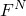 that depend on the values of the nodal variables  and on the solution-dependent state variables  within the element: 


Here we use the term “force” to mean that quantity in the variational statement that is conjugate to the basic nodal variable: physical force when the associated degree of freedom is physical displacement, moment when the associated degree of freedom is a rotation, heat flux when it is a temperature value, and so on. The signs of the forces in  are such that external forces provide positive nodal force values and “internal” forces caused by stresses, internal heat fluxes, etc. in the element provide negative nodal force values. For example, in the case of mechanical equilibrium of a finite element subject to surface tractions  and body forces  with stress , and with interpolation 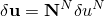,  


In general procedures Abaqus/Standard solves the overall system of equations by Newton's method: 

| *Solve* | 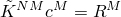, |
| --- | --- |
| *Set* | 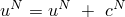, |
| *Iterate* |  |

where  is the residual at degree of freedom *N* and 


is the Jacobian matrix.

During such iterations you must define , which is the element's contribution to the residual, , and 


which is the element's contribution to the Jacobian . By writing the total derivative , we imply that the element's contribution to  should include all direct and indirect dependencies of the  on the . For example, the  will generally depend on ; therefore,  will include terms such as 

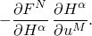

##### Use in transient analysis procedures

In procedures such as transient heat transfer and dynamic analysis, the problem also involves time integration of rates of change of the nodal degrees of freedom. The time integration schemes used by Abaqus/Standard for the various procedures are described in more detail in the [Abaqus Theory Guide](../stm/stm-link.md#stm). For example, in transient heat transfer analysis, the backward difference method is used: 


Therefore, if  depends on  and  (as would be the case if the user element includes thermal energy storage), the Jacobian contribution should include the term 


where  is defined from the time integration procedure as 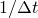.

In all cases where Abaqus/Standard integrates first-order problems in time, the  are never stored because they are readily available as 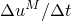, where 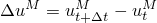. However, for direct, implicit integration of dynamic systems (see ["Implicit dynamic analysis," Section 2.4.1 of the Abaqus Theory Guide](../stm/stm-link.md#stm-anl-dynamics)) Abaqus/Standard requires storage of  and 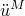. These values are, therefore, passed into subroutine [`UEL`](../sub/sub-link.md#sub-xsl-uel). If the user element contains effects that depend on these time derivatives (damping and inertial effects), its Jacobian contribution will include 

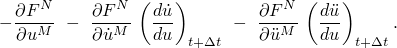

For the Hilber-Hughes-Taylor scheme 

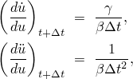

where  and  are the (Newmark) parameters of the integration scheme. For backwark Euler time integration, the same expressions apply with  and  equal to unity. The term  is the element's damping matrix, and  is its mass matrix.

The Hilber-Hughes-Taylor scheme writes the overall dynamic equilibrium equations as 

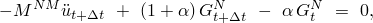

where 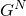 is the total force at degree of freedom *N*, excluding d'Alembert (inertia) forces.  is often referred to as the “static residual.” Therefore, if a user element is to be used with Hilber-Hughes-Taylor time integration, the element's contribution  to the overall residual must be formulated in the same way. Since Abaqus/Standard provides information only at the time point at which [`UEL`](../sub/sub-link.md#sub-xsl-uel) is called, this implies that each time [`UEL`](../sub/sub-link.md#sub-xsl-uel) is called the  array must be used to recover 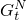 (and 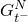 if half-increment residual calculations are required, where 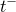 indicates  from the beginning of the previous increment) and used to store 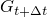 (and  if half-increment residual calculations are required) for use in the next increment. This complication can be avoided if the numerical damping control parameter, , for the dynamic step is set to zero; i.e., if the trapezoidal rule is used for integration of the dynamic equations (see ["Implicit dynamic analysis using direct integration," Section 6.3.2](pt03ch06s03at07.md), for details). This complication is also avoided with the backward Euler time integration operator because dynamic equilibrium is enforced at the end of the step.

If solution-dependent state variables () are used in the element, a suitable time integration method must be coded into subroutine [`UEL`](../sub/sub-link.md#sub-xsl-uel) for these variables. Any of the  associated with the element that are not shared with standard Abaqus/Standard elements may be integrated in time by any suitable technique. If, in such cases, it is necessary to store values of , , etc. at particular points in time, the solution-dependent state variable array, , can be used for this purpose. Abaqus/Standard will still compute and store values of  and 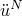 using the formulae associated with whatever time integrator it is using, but these values need not be used. To ensure accurate, stable time integration, you can control the size of the time increment used by Abaqus/Standard.

##### Constraints defined with Lagrange multipliers

Introduction of constraints with Lagrange multipliers should be avoided since Abaqus/Standard cannot detect such variables and avoid eigensolver problems by proper ordering of the equations.

#### Defining the contribution of the element to the model in user subroutine [`UELMAT`](../sub/sub-link.md#sub-xsl-uelmat)

Alternatively, for a general user element in Abaqus/Standard, user subroutine [`UELMAT`](../sub/sub-link.md#sub-xsl-uelmat) may be coded to define the contribution of the element to the model. User subroutine [`UELMAT`](../sub/sub-link.md#sub-xsl-uelmat) is an enhanced version of user subroutine [`UEL`](../sub/sub-link.md#sub-xsl-uel); consequently, all the information provided for user subroutine [`UEL`](../sub/sub-link.md#sub-xsl-uel) is also valid for user subroutine [`UELMAT`](../sub/sub-link.md#sub-xsl-uelmat). The enhancement allows you to access some of the material models from the Abaqus material library from [`UELMAT`](../sub/sub-link.md#sub-xsl-uelmat). [`UELMAT`](../sub/sub-link.md#sub-xsl-uelmat) works only with a subset of procedures for which [`UEL`](../sub/sub-link.md#sub-xsl-uel) is available:
- static;
- direct-integration dynamic;
- frequency extraction;
- steady-state uncouple heat transfer; and
- transient uncouple heat transfer.

User subroutine [`UELMAT`](../sub/sub-link.md#sub-xsl-uelmat) will be called if an Abaqus material model is assigned to a user element (see ["Assigning an Abaqus material to the user element](pt06ch32s15alm60.md#usb-elm-euserelem-material),” above); otherwise, user subroutine [`UEL`](../sub/sub-link.md#sub-xsl-uel) will be called.

#### Accessing Abaqus materials from user subroutine [`UELMAT`](../sub/sub-link.md#sub-xsl-uelmat)

Abaqus allows you to access some of the material models from the Abaqus material library from user subroutine [`UELMAT`](../sub/sub-link.md#sub-xsl-uelmat). The material models are accessed through the utility routines `MATERIAL_LIB_MECH` and `MATERIAL_LIB_HT` (["Accessing Abaqus thermal materials," Section 2.1.18 of the Abaqus User Subroutines Reference Guide](../sub/sub-link.md#sub-utl-ugetmaterialht), and ["Accessing Abaqus materials," Section 2.1.17 of the Abaqus User Subroutines Reference Guide](../sub/sub-link.md#sub-utl-ugetmaterialmech)). Each time user subroutine [`UELMAT`](../sub/sub-link.md#sub-xsl-uelmat) is called with the flags set to values that require computation of the right-hand-side vector and the element Jacobian, the material library must be called for each integration point, where the number of integration points is specified in the element definition (["Specifying the number of integration points" in "User-defined elements," Section 32.15.1](pt06ch32s15alm60.md#usb-elm-euserelem-integration)). The material models that are accessible from user subroutine [`UELMAT`](../sub/sub-link.md#sub-xsl-uelmat) are:
- linear elastic model;
- hyperelastic model;
- Ramberg-Osgood model;
- classical metal plasticity models (Mises and Hill);
- extended Drucker-Prager model;
- modified Drucker-Prager/Cap plasticity model;
- porous metal plasticity model;
- elastomeric foam material model; and
- crushable foam plasticity model.

#### Defining the contribution of the element to the model in user subroutine [`VUEL`](../sub/sub-link.md#sub-xsl-vuel)

For a general user element in Abaqus/Explicit, user subroutine [`VUEL`](../sub/sub-link.md#sub-xsl-vuel) must be coded to define the contribution of the element to the model. Abaqus/Explicit calls this routine each time any information about a user-defined element is needed. At each such call Abaqus/Explicit provides the values of the nodal coordinates and of all solution-dependent nodal variables (displacements, velocities, accelerations, etc.) at all degrees of freedom associated with the element, as well as values of the solution-dependent state variables associated with the element at the beginning of the current increment. The incremental displacements are those obtained in a previous increment. Abaqus/Explicit also provides the values of all user-defined properties associated with this element and a control flag array indicating what functions the user subroutine must perform. Depending on this set of control flags, the subroutine must define the contribution of the element to the internal or external force/flux vector, form the mass/capacity matrix, update the solution-dependent state variables associated with the element, and so on.

The element's principal contribution to the model is that it provides nodal forces 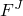 that depend on the values of the nodal variables , the rate of nodal variables , and on the solution-dependent state variables  within the element: 


 In addition, the element mass matrix  can be defined. Optionally, you can also define the external load contribution from the element due to specified distributed loading. In each increment Abaqus/Explicit solves for the accelerations at the end of the increment using 

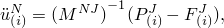

where  is the applied load vector. The solution (velocity, displacement) is then integrated in time using the central difference method 


For coupled temperature/displacement elements the temperatures are computed at the beginning of the increment using 

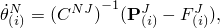

where  is the lumped capcitance matrix,  is the applied nodal source, and  is the internal flux vector. The temperature is integrated in time using the explicit forward-difference integration rule, 


More details can be found in ["Explicit dynamic analysis," Section 6.3.3](pt03ch06s03at08.md) and ["Fully coupled thermal-stress analysis," Section 6.5.3](pt03ch06s05at19.md). The signs of the forces defined in  are such that external forces provide positive nodal force values and “internal” forces caused by stresses, damping effects, internal heat fluxes, etc. in the element provide negative nodal force values. Internal forces due to bulk viscosity are dependent on the scaled mass of the element. The necessary information (bulk viscosity constants and mass scaling factors) is passed into the user subroutine for this purpose.

##### Requirements for defining the mass matrix

As explained in ["Explicit dynamic analysis," Section 6.3.3](pt03ch06s03at08.md), what makes the explicit time integration method efficient is that the mass inversion process is extremely effective. This is due to the fact that most of the nonzero entries in the mass matrix are located on the diagonal positions. The only exception is for rotational degrees of freedom in three-dimensional analyses in which case at each node an anisotropic rotary inertia (symmetric 3  3 tensor) can be defined. In these cases some of the nonzero entries in the mass matrix may be off-diagonal; but the inversion process is local and, hence, very effective. The mass matrix defined in user subroutine [`VUEL`](../sub/sub-link.md#sub-xsl-vuel) must adhere to these requirements as illustrated in detail in ["VUEL," Section 1.2.12 of the Abaqus User Subroutines Reference Guide](../sub/sub-link.md#sub-rtn-uexpuel). If you specify a zero mass matrix or skip the definition of the mass matrix altogether, Abaqus/Explicit issues an error message.

The definition of a realistic mass matrix is not mandatory, but it is strongly recommended. If you choose to not define a realistic mass matrix using the user subroutine, you must provide realistic mass, rotary inertia, heat capacity, etc. at all nodes and at all degrees of freedom associated with the user element. This can be accomplished by various means, such as by defining mass and rotary inertia elements at the nodes or by connecting the user element to other elements for which density, heat capacity, etc. was specified.

Mass is computed only once at the beginning of the analysis. Consequently, the mass of the user element cannot be changed arbitrarily during the analysis. If necessary, mass scaling is applied accordingly to ensure the requested time incrementation.

##### Definition of the stable time increment

Since the central difference operator is conditionally stable, the time increments in Abaqus/Explicit must be somewhat smaller than the stable time increment. You must provide an accurate estimate for the stable time increment associated with the user element. This scalar value is highly dependent on the element formulation, and sophisticated coding may be required inside the user subroutine to obtain a reliable estimate. A conservative estimate will reduce the time increment size for the entire analysis and, hence, lead to longer analysis times.

#### Defining loads

You can apply point loads, moments, fluxes, etc. to the nodes of general user-defined elements in the usual way, using concentrated loads and concentrated fluxes (["Concentrated loads," Section 34.4.2](pt07ch34s04aus121.md), and ["Thermal loads," Section 34.4.4](pt07ch34s04aus123.md)).

You can also define distributed loads and fluxes for general user-defined elements (["Distributed loads," Section 34.4.3](pt07ch34s04aus122.md), and ["Thermal loads," Section 34.4.4](pt07ch34s04aus123.md)). These loads require a load type key. For user-defined elements, you can define load type keys of the forms U*n* and, in Abaqus/Standard, U*n*NU, where *n* is any positive integer.

If the load type key is of the form U*n*, the load magnitude is defined directly and follows the standard Abaqus conventions with respect to its amplitude variation as a function of time. In Abaqus/Standard, if the load key is of the form U*n*NU, all of the load definition will be accomplished inside subroutine [`UEL`](../sub/sub-link.md#sub-xsl-uel) and [`UELMAT`](../sub/sub-link.md#sub-xsl-uelmat). Each time Abaqus/Standard calls subroutine [`UEL`](../sub/sub-link.md#sub-xsl-uel) or [`UELMAT`](../sub/sub-link.md#sub-xsl-uelmat), it tells the subroutine how many distributed loads/fluxes are currently active. For each active load or flux of type U*n* Abaqus/Standard gives the current magnitude and current increment in magnitude of the load. The coding in subroutine [`UEL`](../sub/sub-link.md#sub-xsl-uel) or [`UELMAT`](../sub/sub-link.md#sub-xsl-uelmat) must distribute the loads into consistent equivalent nodal forces and, if necessary, provide their contribution to the Jacobian matrix—the “load stiffness matrix.” 

In Abaqus/Explicit only load keys of  the form U*n* can be used, and they can be used only for distributed loads (however, thermal fluxes can be defined in the coding in subroutine [`VUEL`](../sub/sub-link.md#sub-xsl-vuel)).  Each time Abaqus/Explicit calls subroutine [`VUEL`](../sub/sub-link.md#sub-xsl-vuel), it tells the subroutine which load number is currently active and the current magnitude of the load. The coding in subroutine [`VUEL`](../sub/sub-link.md#sub-xsl-vuel) must distribute the loads into consistent equivalent nodal forces.

#### Defining output

All quantities to be output must be saved as solution-dependent state variables. In Abaqus/Standard, the solution-dependent state variables can be printed or written to the results file using output variable identifier SDV (["Abaqus/Standard output variable identifiers," Section 4.2.1](pt02ch04s02abv01.md)).

The components of solution-dependent state variables that belong to a user element are not available in Abaqus/CAE. You can write output to separate files in a table format that can be accessed in Abaqus/CAE to produce history output.

#### Defining wave kinematic data

A utility routine `GETWAVE` is provided in user subroutine [`UEL`](../sub/sub-link.md#sub-xsl-uel) to access the wave kinematic data defined for an Abaqus/Aqua analysis (["Abaqus/Aqua analysis," Section 6.11.1](pt03ch06s11at30.md)). This utility is discussed in ["Obtaining wave kinematic data in an Abaqus/Aqua analysis," Section 2.1.13 of the Abaqus User Subroutines Reference Guide](../sub/sub-link.md#sub-utl-uwavekinematic), where the arguments to `GETWAVE` and the syntax for its use are defined.

#### Use in contact

Only node-based surfaces (["Node-based surface definition," Section 2.3.3](pt01ch02s03aus18.md)) can be created on user-defined elements. Hence, these elements can be used to define only slave surfaces in a contact analysis. In Abaqus/Explicit the user elements will not be included in the general contact algorithm automatically. Node-based surfaces can be defined using these nodes and then included in the general contact definition.

#### Import of user elements

User elements cannot be imported from an Abaqus/Standard analysis into an Abaqus/Explicit analysis or vice versa. Equivalent user elements can be defined in both products to overcome this limitation. However, the state variables associated with these elements will not be communicated. 


