# 34.1.2 Amplitude curves


**Products: **Abaqus/Standard  Abaqus/Explicit  Abaqus/CFD  Abaqus/CAE  

##### **References**

- ["Prescribed conditions: overview," Section 34.1.1](pt07ch34s01abo31.md)
- [*AMPLITUDE](../key/key-link.md#usb-kws-mamplitude)
- [Chapter 57, "The Amplitude toolset," of the Abaqus/CAE User's Guide](../usi/usi-link.md#usi-amp)

### Overview

An amplitude curve:
- allows arbitrary time (or frequency) variations of load, displacement, and other prescribed variables to be given throughout a step (using step time) or throughout the analysis (using total time);
- can be defined as a mathematical function (such as a sinusoidal variation), as a series of values at points in time (such as a digitized acceleration-time record from an earthquake), as a user-customized definition via user subroutines, or, in Abaqus/Standard, as values calculated based on a solution-dependent variable (such as the maximum creep strain rate in a superplastic forming problem); and
- can be referred to by name by any number of boundary conditions, loads, and predefined fields.

### Amplitude curves

By default, the values of loads, boundary conditions, and predefined fields either change linearly with time throughout the step (ramp function) or they are applied immediately and remain constant throughout the step (step function)—see ["Defining an analysis," Section 6.1.2](pt03ch06s01abo05.md). Many problems require a more elaborate definition, however. For example, different amplitude curves can be used to specify time variations for different loadings. One common example is the combination of thermal and mechanical load transients: usually the temperatures and mechanical loads have different time variations during the step. Different amplitude curves can be used to specify each of these time variations.

Other examples include dynamic analysis under earthquake loading, where an amplitude curve can be used to specify the variation of acceleration with time, and underwater shock analysis, where an amplitude curve is used to specify the incident pressure profile.

Amplitudes are defined as model data (i.e., they are not step dependent). Each amplitude curve must be named; this name is then referred to from the load, boundary condition, or predefined field definition (see ["Prescribed conditions: overview," Section 34.1.1](pt07ch34s01abo31.md)).

| **Input File Usage: ** | ``` [*AMPLITUDE](../key/key-link.md#usb-kws-mamplitude), NAME=*name* ``` |
| --- | --- |

| **Abaqus/CAE Usage: ** | Load or Interaction module: **Create Amplitude**: **Name:** *name* |
| --- | --- |

### Defining the time period

Each amplitude curve is a function of time or frequency. Amplitudes defined as functions of frequency are used in ["Direct-solution steady-state dynamic analysis," Section 6.3.4](pt03ch06s03at09.md), ["Mode-based steady-state dynamic analysis," Section 6.3.8](pt03ch06s03at13.md), and ["Eddy current analysis," Section 6.7.5](pt03ch06s07at24.md).

Amplitudes defined as functions of time can be given in terms of *step time* (default) or in terms of *total time*. These time measures are defined in ["Conventions," Section 1.2.2](pt01ch01s02aus02.md).

| **Input File Usage: ** | Use one of the following options: |
| --- | --- |
|  | ``` [*AMPLITUDE](../key/key-link.md#usb-kws-mamplitude), NAME=*name*, TIME=STEP TIME (default) [*AMPLITUDE](../key/key-link.md#usb-kws-mamplitude), NAME=*name*, TIME=TOTAL TIME ``` |

| **Abaqus/CAE Usage: ** | Load or Interaction module: **Create Amplitude**: any type: **Time span: Step time** or **Total time** |
| --- | --- |

#### Continuation of an amplitude reference in subsequent steps

If a boundary condition, load, or predefined field refers to an amplitude curve and the prescribed condition is not redefined in subsequent steps, the following rules apply:
- If the associated amplitude was given in terms of total time, the prescribed condition continues to follow the amplitude definition.
- If no associated amplitude was given or if the amplitude was given in terms of step time, the prescribed condition remains constant at the magnitude associated with the end of the previous step.

### Specifying relative or absolute data

You can choose between specifying relative or absolute magnitudes for an amplitude curve.

#### Relative data

By default, you give the amplitude magnitude as a multiple (fraction) of the reference magnitude given in the prescribed condition definition. This method is especially useful when the same variation applies to different load types.

| **Input File Usage: ** | ``` [*AMPLITUDE](../key/key-link.md#usb-kws-mamplitude), NAME=*name*, VALUE=RELATIVE ``` |
| --- | --- |

| **Abaqus/CAE Usage: ** | Amplitude magnitudes are always relative in Abaqus/CAE. |
| --- | --- |

#### Absolute data

Alternatively, you can give absolute magnitudes directly. When this method is used, the values given in the prescribed condition definitions will be ignored.

Absolute amplitude values should generally not be used to define temperatures or predefined field variables for nodes attached to beam or shell elements as values at the reference surface together with the gradient or gradients across the section (default cross-section definition; see ["Using a beam section integrated during the analysis to define the section behavior," Section 29.3.6](pt06ch29s03alm11.md), and ["Using a shell section integrated during the analysis to define the section behavior," Section 29.6.5](pt06ch29s06alm19.md)). Because the values given in temperature fields and predefined fields are ignored, the absolute amplitude value will be used to define both the temperature and the gradient and field and gradient, respectively.

| **Input File Usage: ** | ``` [*AMPLITUDE](../key/key-link.md#usb-kws-mamplitude), NAME=*name*, VALUE=ABSOLUTE ``` |
| --- | --- |

| **Abaqus/CAE Usage: ** | Absolute amplitude magnitudes are not supported in Abaqus/CAE. |
| --- | --- |

### Defining the amplitude data

The variation of an amplitude with time can be specified in several ways. The variation of an amplitude with frequency can be given only in tabular or equally spaced form.

#### Defining tabular data

Choose the tabular definition method (default) to define the amplitude curve as a table of values at convenient points on the time scale. Abaqus interpolates linearly between these values, as needed. By default in Abaqus/Standard, if the time derivatives of the function must be computed, some smoothing is applied at the time points where the time derivatives are discontinuous. In contrast, in Abaqus/Explicit no default smoothing is applied (other than the inherent smoothing associated with a finite time increment). You can modify the default smoothing values (smoothing is discussed in more detail below, under the heading “Using an amplitude definition with boundary conditions”); alternatively, a smooth step amplitude curve can be defined (see “Defining smooth step data” below).

If the amplitude varies rapidly—as with the ground acceleration in an earthquake, for example—you must ensure that the time increment used in the analysis is small enough to pick up the amplitude variation accurately since Abaqus will sample the amplitude definition only at the times corresponding to the increments being used.

If the analysis time in a step is less than the earliest time for which data exist in the table, Abaqus applies the earliest value in the table for all step times less than the earliest tabulated time. Similarly, if the analysis continues for step times past the last time for which data are defined in the table, the last value in the table is applied for all subsequent time.

Several examples of tabular input are shown in [Figure 34.1.2--1](pt07ch34s01aus115.md#pamplitude-tabular).

| **Input File Usage: ** | ``` [*AMPLITUDE](../key/key-link.md#usb-kws-mamplitude), NAME=*name*, DEFINITION=TABULAR ``` |
| --- | --- |

| **Abaqus/CAE Usage: ** | Load or Interaction module: **Create Amplitude**: **Tabular** |
| --- | --- |

**Figure 34.1.2–1** Tabular amplitude definition examples.


#### Defining equally spaced data

Choose the equally spaced definition method to give a list of amplitude values at fixed time intervals beginning at a specified value of time. Abaqus interpolates linearly between each time interval. You must specify the fixed time (or frequency) interval at which the amplitude data will be given, . You can also specify the time (or lowest frequency) at which the first amplitude is given, ; the default is =0.0.

If the analysis time in a step is less than the earliest time for which data exist in the table, Abaqus applies the earliest value in the table for all step times less than the earliest tabulated time. Similarly, if the analysis continues for step times past the last time for which data are defined in the table, the last value in the table is applied for all subsequent time.

| **Input File Usage: ** | ``` [*AMPLITUDE](../key/key-link.md#usb-kws-mamplitude), NAME=*name*, DEFINITION=EQUALLY SPACED, FIXED INTERVAL=, BEGIN= ``` |
| --- | --- |

| **Abaqus/CAE Usage: ** | Load or Interaction module: **Create Amplitude**: **Equally spaced**: **Fixed interval:**  |
| --- | --- |
|  | The time (or lowest frequency) at which the first amplitude is given, , is indicated in the first table cell. |

#### Defining periodic data

Choose the periodic definition method to define the amplitude, *a*, as a Fourier series: 


where , *N*, , , , and , , are user-defined constants. An example of this form of input is shown in [Figure 34.1.2--2](pt07ch34s01aus115.md#pamplitude-periodic). 

| **Input File Usage: ** | ``` [*AMPLITUDE](../key/key-link.md#usb-kws-mamplitude), NAME=*name*, DEFINITION=PERIODIC ``` |
| --- | --- |

| **Abaqus/CAE Usage: ** | Load or Interaction module: **Create Amplitude**: **Periodic** |
| --- | --- |

**Figure 34.1.2–2** Periodic amplitude definition example.

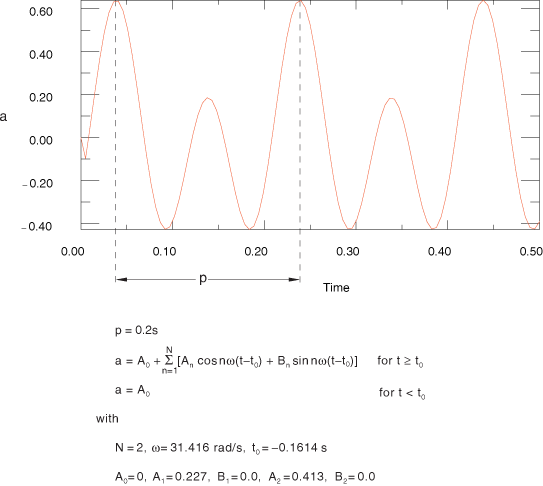

#### Defining modulated data

Choose the modulated definition method to define the amplitude, *a*, as

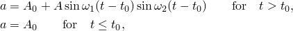

where , *A*, , 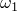, and 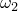 are user-defined constants. An example of this form of input is shown in [Figure 34.1.2--3](pt07ch34s01aus115.md#pamplitude-modulated).

| **Input File Usage: ** | ``` [*AMPLITUDE](../key/key-link.md#usb-kws-mamplitude), NAME=*name*, DEFINITION=MODULATED ``` |
| --- | --- |

| **Abaqus/CAE Usage: ** | Load or Interaction module: **Create Amplitude**: **Modulated** |
| --- | --- |

**Figure 34.1.2–3** Modulated amplitude definition example.

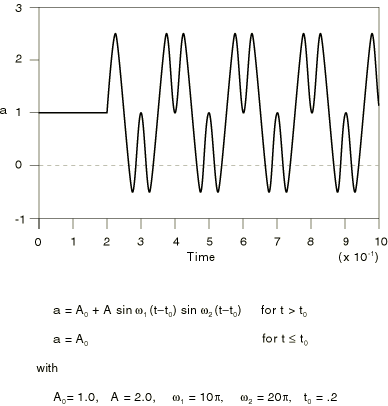

#### Defining exponential decay

Choose the exponential decay definition method to define the amplitude, *a*, as

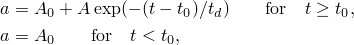

where , *A*, , and 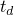 are user-defined constants. An example of this form of input is shown in [Figure 34.1.2--4](pt07ch34s01aus115.md#pamplitude-decay).

| **Input File Usage: ** | ``` [*AMPLITUDE](../key/key-link.md#usb-kws-mamplitude), NAME=*name*, DEFINITION=DECAY ``` |
| --- | --- |

| **Abaqus/CAE Usage: ** | Load or Interaction module: **Create Amplitude**: **Decay** |
| --- | --- |

**Figure 34.1.2–4** Exponential decay amplitude definition example.

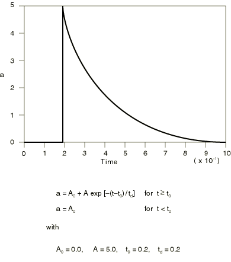

#### Defining smooth step data

Abaqus/Standard and Abaqus/Explicit can calculate amplitudes based on smooth step data. Choose the smooth step definition method to define the amplitude, *a*, between two consecutive data points 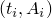 and  as


where 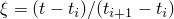. The above function is such that 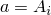 at 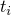, 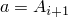 at , and the first and second derivatives of *a* are zero at  and . This definition is intended to ramp up or down smoothly from one amplitude value to another.

The amplitude, *a*, is defined such that 

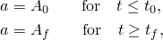

where  and  are the first and last data points, respectively.

Examples of this form of input are shown in [Figure 34.1.2--5](pt07ch34s01aus115.md#pamp-smooth-step1) and [Figure 34.1.2--6](pt07ch34s01aus115.md#pamp-smooth-step2). This definition cannot be used to interpolate smoothly between a set of data points; i.e., this definition cannot be used to do curve fitting.

| **Input File Usage: ** | ``` [*AMPLITUDE](../key/key-link.md#usb-kws-mamplitude), NAME=*name*, DEFINITION=SMOOTH STEP ``` |
| --- | --- |

| **Abaqus/CAE Usage: ** | Load or Interaction module: **Create Amplitude**: **Smooth step** |
| --- | --- |

**Figure 34.1.2–5** Smooth step amplitude definition example with two data points.


**Figure 34.1.2–6** Smooth step amplitude definition example with multiple data points.

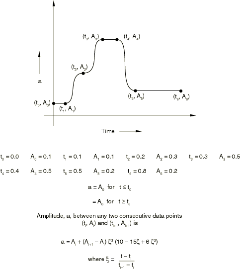

#### Defining a solution-dependent amplitude for superplastic forming analysis

Abaqus/Standard can calculate amplitude values based on a solution-dependent variable. Choose the solution-dependent definition method to create a solution-dependent amplitude curve. The data consist of an initial value, a minimum value, and a maximum value. The amplitude starts with the initial value and is then modified based on the progress of the solution, subject to the minimum and maximum values. The maximum value is typically the controlling mechanism used to end the analysis. This method is used with creep strain rate control for superplastic forming analysis (see ["Rate-dependent plasticity: creep and swelling," Section 23.2.4](pt05ch23s02abm20.md)).

| **Input File Usage: ** | ``` [*AMPLITUDE](../key/key-link.md#usb-kws-mamplitude), NAME=*name*, DEFINITION=SOLUTION DEPENDENT ``` |
| --- | --- |

| **Abaqus/CAE Usage: ** | Load or Interaction module: **Create Amplitude**: **Solution dependent** |
| --- | --- |

#### Defining the bubble load amplitude for an underwater explosion

Two interfaces are available in Abaqus for applying incident wave loads (see ["Incident wave loading due to external sources" in "Acoustic and shock loads," Section 34.4.6](pt07ch34s04aus125.md#usb-prc-pacoustic-incidentwave)). For either interface bubble dynamics can be described using a model internal to Abaqus. A description of this built-in mechanical model and the parameters that define the bubble behavior are discussed in ["Defining bubble loading for spherical incident wave loading" in "Acoustic and shock loads," Section 34.4.6](pt07ch34s04aus125.md#usb-prc-pacoustic-bubble). The related theoretical details are described in ["Loading due to an incident dilatational wave field," Section 6.3.1 of the Abaqus Theory Guide](../stm/stm-link.md#stm-ldc-undexloads).

The preferred interface for incident wave loading due to an underwater explosion specifies bubble dynamics using the UNDEX charge property definition (see ["Defining bubble loading for spherical incident wave loading" in "Acoustic and shock loads," Section 34.4.6](pt07ch34s04aus125.md#usb-prc-pacoustic-bubble)). The alternative interface for incident wave loading uses the bubble definition described in this section to define bubble load amplitude curves. 

An example of the bubble amplitude definition with the following input data is shown in [Figure 34.1.2--7](pt07ch34s01aus115.md#pamp-bubble-load). 

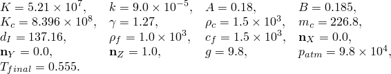

| **Input File Usage: ** | ``` [*AMPLITUDE](../key/key-link.md#usb-kws-mamplitude), NAME=*name*, DEFINITION=BUBBLE ``` |
| --- | --- |

| **Abaqus/CAE Usage: ** | Bubble amplitudes are not supported in Abaqus/CAE. However, bubble loading for an underwater explosion is supported in the Interaction module using the UNDEX charge property definition. |
| --- | --- |

**Figure 34.1.2–7** Bubble amplitude definition example: (a) radius of bubble and (b) depth of bubble center under fluid surface.

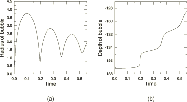

#### Defining an amplitude via a user subroutine

Choose the user definition method to define the amplitude curve via coding in user subroutine [`UAMP`](../sub/sub-link.md#sub-xsl-uamp) (Abaqus/Standard) or  [`VUAMP`](../sub/sub-link.md#sub-xsl-vuamp) (Abaqus/Explicit). You define the value of the amplitude function in time and, optionally, the values of the derivatives and integrals for the function sought to be implemented as outlined in ["UAMP," Section 1.1.19 of the Abaqus User Subroutines Reference Guide](../sub/sub-link.md#sub-rtn-uuamp), and ["VUAMP," Section 1.2.8 of the Abaqus User Subroutines Reference Guide](../sub/sub-link.md#sub-rtn-uexpamp). 

You can use an arbitrary number of properties to calculate the amplitude, and you can use an arbitrary number of state variables that can be updated independently for each amplitude definition.

In Abaqus/Standard user-defined amplitudes are not supported for complex eigenvalue extraction, linear dynamic procedures, and steady-state dynamic analysis with the response computed directly in terms of the physical degrees of freedom.

Moreover, solution-dependent sensors can be used to define the user-customized amplitude. The sensors can be identified via their name, and two utilities allow for the extraction of the current sensor value inside the user subroutine (see ["Obtaining sensor information," Section 2.1.16 of the Abaqus User Subroutines Reference Guide](../sub/sub-link.md#sub-utl-ugetsensor)). Simple control/logical models can be implemented using this feature as illustrated in ["Crank mechanism," Section 4.1.2 of the Abaqus Example Problems Guide](../exa/exa-link.md#exa-mec-crank). 

| **Input File Usage: ** | ``` [*AMPLITUDE](../key/key-link.md#usb-kws-mamplitude), NAME=*name*, DEFINITION=USER, PROPERTIES=*m*, VARIABLES=*n* ``` |
| --- | --- |

| **Abaqus/CAE Usage: ** | Load or Interaction module: **Create Amplitude**: **User**: **Number of variables**: *n* |
| --- | --- |
|  | User-defined amplitude properties are not supported in Abaqus/CAE. |

### Defining an actuator amplitude via co-simulation

The current value of an actuator amplitude can be imported at any given time from a co-simulation with a logical modeling program (see ["Co-simulation: overview," Section 17.1.1](pt04ch17s01abo17.md)). The name specified on the actuator amplitude definition is used as the actuator name for co-simulation purposes. Therefore, at a given time each actuator is associated with one real number—the current value of the amplitude. As with any amplitude definition, the user-specified name can be used in conjunction with any Abaqus feature that can reference an amplitude.

| **Input File Usage: ** | ``` [*AMPLITUDE](../key/key-link.md#usb-kws-mamplitude), NAME=*name*, DEFINITION=ACTUATOR ``` |
| --- | --- |

| **Abaqus/CAE Usage: ** | Load or Interaction module: **Create Amplitude**: **Actuator** |
| --- | --- |

### Using an amplitude definition with boundary conditions

When an amplitude curve is used to prescribe a variable of the model as a boundary condition (by referring to the amplitude from the boundary condition definition), the first and second time derivatives of the variable may also be needed. For example, the time history of a displacement can be defined for a direct integration dynamic analysis step by an amplitude variation; in this case Abaqus must compute the corresponding velocity and acceleration.

When the displacement time history is defined by a piecewise linear amplitude variation (tabular or equally spaced amplitude definition), the corresponding velocity is piecewise constant and the acceleration may be infinite at the end of each time interval given in the amplitude definition table, as shown in [Figure 34.1.2--8](pt07ch34s01aus115.md#pamplitude-smoothing)(a). This behavior is unreasonable. (In Abaqus/Explicit time derivatives of amplitude curves are typically based on finite differences, such as 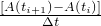, so there is some inherent smoothing associated with the time discretization.)

You can modify the piecewise linear displacement variation into a combination of piecewise linear and piecewise quadratic variations through smoothing. Smoothing ensures that the velocity varies continuously during the time period of the amplitude definition and that the acceleration no longer has singularity points, as illustrated in [Figure 34.1.2--8](pt07ch34s01aus115.md#pamplitude-smoothing)(b).

**Figure 34.1.2–8** Piecewise linear displacement definitions.


When the velocity time history is defined by a piecewise linear amplitude variation, the corresponding acceleration is piecewise constant. Smoothing can be used to modify the piecewise linear velocity variation into a combination of piecewise linear and piecewise quadratic variations. Smoothing ensures that the acceleration varies continuously during the time period of the amplitude definition.

You specify *t*, the fraction of the time interval before and after each time point during which the piecewise linear time variation is to be replaced by a smooth quadratic time variation. The default in Abaqus/Standard is *t*=0.25; the default in Abaqus/Explicit is *t*=0.0. The allowable range is 0.0  *t*  0.5. A value of 0.05 is suggested for amplitude definitions that contain large time intervals to avoid severe deviation from the specified definition.

In Abaqus/Explicit if a displacement jump is specified using an amplitude curve (i.e., the beginning displacement defined using the amplitude function does not correspond to the displacement at that time), this displacement jump will be ignored. Displacement boundary conditions are enforced in Abaqus/Explicit in an incremental manner using the slope of the amplitude curve. To avoid the “noisy” solution that may result in Abaqus/Explicit when smoothing is not used, it is better to specify the velocity history of a node rather than the displacement history (see ["Boundary conditions in Abaqus/Standard and Abaqus/Explicit," Section 34.3.1](pt07ch34s03aus118.md)).

When an amplitude definition is used with prescribed conditions that do not require the evaluation of time derivatives (for example, concentrated loads, distributed loads, temperature fields, etc., or a static analysis), the use of smoothing is ignored.

When the displacement time history is defined using a smooth-step amplitude curve, the velocity and acceleration will be zero at every data point specified, although the average velocity and acceleration may well be nonzero. Hence, this amplitude definition should be used only to define a (smooth) step function.

| **Input File Usage: ** | Use either of the following options: |
| --- | --- |
|  | ``` [*AMPLITUDE](../key/key-link.md#usb-kws-mamplitude), NAME=*name*, DEFINITION=TABULAR, SMOOTH=*t* [*AMPLITUDE](../key/key-link.md#usb-kws-mamplitude), NAME=*name*, DEFINITION=EQUALLY SPACED, SMOOTH=*t* ``` |

| **Abaqus/CAE Usage: ** | Load or Interaction module: **Create Amplitude**: choose **Tabular** or **Equally spaced**: **Smoothing: Specify:** *t* |
| --- | --- |

### Using an amplitude definition with secondary base motion in modal dynamics

When an amplitude curve is used to prescribe a variable of the model as a secondary base motion in a modal dynamics procedure (by referring to the amplitude from the base motion definition during a modal dynamic procedure), the first or second time derivatives of the variable may also be needed. For example, the time history of a displacement can be defined for secondary base motion in a modal dynamics procedure. In this case Abaqus must compute the corresponding acceleration.

The modal dynamics procedure uses an exact solution for the response to a piecewise linear force. Accordingly, secondary base motion definitions are applied as piecewise linear acceleration histories. When displacement-type or velocity-type base motions are used to define displacement or velocity time histories and an amplitude variation using the tabular, equally spaced, periodic, modulated, or exponential decay definitions is used, an algorithmic acceleration is computed based on the tabular data (the amplitude data evaluated at the time values used in the modal dynamics procedure). At the end of any time increment where the amplitude curve is linear over that increment, linear over the previous increment, and the slopes of the amplitude variations over the two increments are equal, this algorithmic acceleration reproduces the exact displacement and velocity for displacement time histories or the exact velocity for velocity time histories.

When the displacement time history is defined using a smooth-step amplitude curve, the velocity and acceleration will be zero at every data point specified, although the average velocity and acceleration may well be nonzero. Hence, this amplitude definition should be used only to define a (smooth) step function.

### Defining multiple amplitude curves

You can define any number of amplitude curves and refer to them from any load, boundary condition, or predefined field definition. For example, one amplitude curve can be used to specify the velocity of a set of nodes, while another amplitude curve can be used to specify the magnitude of a pressure load on the body. If the velocity and the pressure both follow the same time history, however, they can both refer to the same amplitude curve. There is one exception in Abaqus/Standard: only one solution-dependent amplitude (used for superplastic forming) can be active during each step.

### Scaling and shifting amplitude curves

You can scale and shift both time and magnitude when defining an amplitude. This can be helpful for example when your amplitude data need to be converted to a different unit system or when you reuse existing amplitude data to define similar amplitude curves. If both scaling and shifting are applied at the same time, the amplitude values are first scaled and then shifted. The amplitude shifting and scaling can be applied to all amplitude definition types except for solution dependent, bubble, and user; for the actuator amplitude definition type, only scaling and shifting of the amplitude magnitude is supported.

| **Input File Usage: ** | ``` [*AMPLITUDE](../key/key-link.md#usb-kws-mamplitude), NAME=*name*, SHIFTX=*shiftx_value*, SHIFTY=*shifty_value*, SCALEX=*scalex_value*, SCALEY=*scaley_value* ``` |
| --- | --- |

| **Abaqus/CAE Usage: ** | The scaling and shifting of amplitude curves is not supported in Abaqus/CAE. |
| --- | --- |

### Reading the data from an alternate file

The data for an amplitude curve can be contained in a separate file.

| **Input File Usage: ** | ``` [*AMPLITUDE](../key/key-link.md#usb-kws-mamplitude), NAME=*name*, INPUT=*file_name* ``` |
| --- | --- |
|  | If the INPUT parameter is omitted, it is assumed that the data lines follow the keyword line. |

| **Abaqus/CAE Usage: ** | Load or Interaction module: **Create Amplitude**: any type: click mouse button 3 while holding the cursor over the data table, and select **Read from File** |
| --- | --- |

### Baseline correction in Abaqus/Standard

When an amplitude definition is used to define an acceleration history in the time domain (a seismic record of an earthquake, for example), the integration of the acceleration record through time may result in a relatively large displacement at the end of the event. This behavior typically occurs because of instrumentation errors or a sampling frequency that is not sufficient to capture the actual acceleration history. In Abaqus/Standard it is possible to compensate for it by using “baseline correction.”

The baseline correction method allows an acceleration history to be modified to minimize the overall drift of the displacement obtained from the time integration of the given acceleration. It is relevant only with tabular or equally spaced amplitude definitions.

Baseline correction can be defined only when the amplitude is referenced as an acceleration boundary condition during a direct-integration dynamic analysis or as an acceleration base motion in modal dynamics.

| **Input File Usage: ** | Use both of the following options to include baseline correction: |
| --- | --- |
|  | ``` [*AMPLITUDE](../key/key-link.md#usb-kws-mamplitude), DEFINITION=TABULAR or EQUALLY SPACED [*BASELINE CORRECTION](../key/key-link.md#usb-kws-mbasecorrection) ``` The [*BASELINE CORRECTION](../key/key-link.md#usb-kws-mbasecorrection) option must appear immediately following the data lines of the [*AMPLITUDE](../key/key-link.md#usb-kws-mamplitude) option. |

| **Abaqus/CAE Usage: ** | Load or Interaction module: **Create Amplitude**: choose **Tabular** or **Equally spaced**: **Baseline Correction** |
| --- | --- |

#### Effects of baseline correction

The acceleration is modified by adding a quadratic variation of acceleration in time to the acceleration definition. The quadratic variation is chosen to minimize the mean squared velocity during each correction interval. Separate quadratic variations can be added for different correction intervals within the amplitude definition by defining the correction intervals. Alternatively, the entire amplitude history can be used as a single correction interval.

The use of more correction intervals provides tighter control over any “drift” in the displacement at the expense of more modification of the given acceleration trace. In either case, the modification begins with the start of the amplitude variation and with the assumption that the initial velocity at that time is zero.

The baseline correction technique is described in detail in ["Baseline correction of accelerograms," Section 6.1.2 of the Abaqus Theory Guide](../stm/stm-link.md#stm-ldc-baselinecorr).


