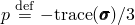
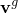

# 34.2.1 Initial conditions in Abaqus/Standard and Abaqus/Explicit


**Products: **Abaqus/Standard  Abaqus/Explicit  Abaqus/CAE  

##### **References**

- ["Prescribed conditions: overview," Section 34.1.1](pt07ch34s01abo31.md)
- [*INITIAL CONDITIONS](../key/key-link.md#usb-kws-minitialcond)
- ["Using the predefined field editors," Section 16.11 of the Abaqus/CAE User's Guide](../usi/usi-link.md#usi-lbi-iceditors)

### Overview

Initial conditions are specified for particular nodes or elements, as appropriate. The data can be provided directly; in an external input file; or, in some cases, by a user subroutine or by the results or output database file from a previous Abaqus analysis.

If initial conditions are not specified, all initial conditions are zero except relative density in the porous metal plasticity model, which will have the value 1.0.

### Specifying the type of initial condition being defined

Various types of initial conditions can be specified, depending on the analysis to be performed. Each type of initial condition is explained below, in alphabetical order.

#### Defining initial acoustic static pressure

In Abaqus/Explicit you can define initial acoustic static pressure values at the acoustic nodes. These values should correspond to static equilibrium and cannot be changed during the analysis. You can specify the initial acoustic static pressure at two reference locations in the model, and Abaqus/Explicit interpolates these data linearly to the acoustic nodes in the specified node set. The linear interpolation is based upon the projected position of each node onto the line defined by the two reference nodes. If the value at only one reference location is given, the initial acoustic static pressure is assumed to be uniform. The initial acoustic static pressure is used only in the evaluation of the cavitation condition (see ["Acoustic medium," Section 26.3.1](pt05ch26s03abm58.md)) when the acoustic medium is capable of undergoing cavitation. 

| **Input File Usage: ** | ``` [*INITIAL CONDITIONS](../key/key-link.md#usb-kws-minitialcond), TYPE=ACOUSTIC STATIC PRESSURE ``` |
| --- | --- |

| **Abaqus/CAE Usage: ** | Initial acoustic static pressure is not supported in Abaqus/CAE. |
| --- | --- |

#### Defining initial normalized concentration

In Abaqus/Standard you can define initial normalized concentration values for use with diffusion elements in mass diffusion analysis (see ["Mass diffusion analysis," Section 6.9.1](pt03ch06s09at28.md)).

| **Input File Usage: ** | ``` [*INITIAL CONDITIONS](../key/key-link.md#usb-kws-minitialcond), TYPE=CONCENTRATION ``` |
| --- | --- |

| **Abaqus/CAE Usage: ** | Initial normalized concentration is not supported in Abaqus/CAE. |
| --- | --- |

#### Defining initially bonded contact surfaces

In Abaqus/Standard you can define initially bonded or partially bonded contact surfaces. This type of initial condition is intended for use with the crack propagation capability (see ["Crack propagation analysis," Section 11.4.3](pt04ch11s04aus69.md)). The surfaces specified have to be different; this type of initial condition cannot be used with self-contact.

If the crack propagation capability is not activated, the bonded portion of the surfaces will not separate. In this case defining initially bonded contact surfaces would have the same effect as defining tied contact, which generates a permanent bond between two surfaces during the entire analysis (["Defining tied contact in Abaqus/Standard," Section 36.3.7](pt09ch36s03aus151.md)).

| **Input File Usage: ** | ``` [*INITIAL CONDITIONS](../key/key-link.md#usb-kws-minitialcond), TYPE=CONTACT ``` |
| --- | --- |

| **Abaqus/CAE Usage: ** | Initially bonded surfaces are not supported in Abaqus/CAE. |
| --- | --- |

#### Defining initial damage initiation

You can define initial values for the damage initiation measure for the ductile, shear, and the Mschenborn and Sonne forming limit diagram based damage initiation criteria (["Damage initiation for ductile metals," Section 24.2.2](pt05ch24s02abm42.md)). This capability is particularly useful in situations where a metal forming operation is carried out in one analysis, which is followed by a separate analysis that subjects the formed metal part to further deformation. The damage initiation measures at the end of the first analysis can be directly specified as initial conditions for the second analysis.

An alternate but approximate way of modeling initial conditions on damage initiation is by specifying the initial values of the equivalent plastic strain. Abaqus computes damage initiation measures based on the specified initial equivalent plastic strain, assuming a linear strain path between the initial (undeformed) state and the final (deformed) state. This approximation does not work well for deformation paths that deviate significantly from linearity in the strain space.

| **Input File Usage: ** | Use the following option to specify the damage initiation measure for the ductile damage initiation criterion: |
| --- | --- |
|  | ``` [*INITIAL CONDITIONS](../key/key-link.md#usb-kws-minitialcond), TYPE=DAMAGE INITIATION, CRITERION=DUCTILE ``` Use the following option to specify the damage initiation measure for the shear damage initiation criterion: ``` [*INITIAL CONDITIONS](../key/key-link.md#usb-kws-minitialcond), TYPE=DAMAGE INITIATION, CRITERION=SHEAR ``` Use the following option to specify the damage initiation measure for the Mschenborn and Sonne forming limit diagram based damage initiation criterion: ``` [*INITIAL CONDITIONS](../key/key-link.md#usb-kws-minitialcond), TYPE=DAMAGE INITIATION, CRITERION=MSFLD ``` |

| **Abaqus/CAE Usage: ** | Defining initial values for the damage initiation measures is not supported in Abaqus/CAE. |
| --- | --- |

##### Defining initial damage initiation for rebars

Initial values for damage initiation can also be defined for rebars within elements for the ductile and shear damage initiation criteria (see ["Defining rebar as an element property," Section 2.2.4](pt01ch02s02aus14.md)).

| **Input File Usage: ** | ``` [*INITIAL CONDITIONS](../key/key-link.md#usb-kws-minitialcond), TYPE=DAMAGE INITIATION, REBAR ``` |
| --- | --- |

| **Abaqus/CAE Usage: ** | Initial damage initiation for rebars is not supported in Abaqus/CAE. |
| --- | --- |

##### Defining initial damage initiation that varies through the thickness of shell elements

Initial values of damage initiation can be defined at each section point through the thickness of shell elements for the ductile and shear damage initiation criteria.

| **Input File Usage: ** | ``` [*INITIAL CONDITIONS](../key/key-link.md#usb-kws-minitialcond), TYPE=DAMAGE INITIATION, SECTION POINTS ``` |
| --- | --- |

| **Abaqus/CAE Usage: ** | Defining initial damage initiation that varies through the thickness of shell elements is not supported in Abaqus/CAE. |
| --- | --- |

#### Define the initial location of an enriched feature

You can specify the initial location of an enriched feature, such as a crack, in an Abaqus/Standard analysis (see ["Modeling discontinuities as an enriched feature using the extended finite element method," Section 10.7.1](pt04ch10s07at36.md)). Two signed distance functions per node are generally required to describe the crack location, including the location of crack tips, in a cracked geometry. The first signed distance function describes the crack surface, while the second is used to construct an orthogonal surface such that the intersection of the two surfaces defines the crack front. The first signed distance function is assigned only to nodes of elements intersected by the crack, while the second is assigned only to nodes of elements containing the crack tips. No explicit representation of the crack is needed because the crack is entirely described by the nodal data. 

| **Input File Usage: ** | ``` [*INITIAL CONDITIONS](../key/key-link.md#usb-kws-minitialcond), TYPE=ENRICHMENT ``` |
| --- | --- |

| **Abaqus/CAE Usage: ** | Interaction module: crack editor: **Crack location**: **Specify**: select region |
| --- | --- |

#### Defining initial values of predefined field variables

You can define initial values of predefined field variables. The values can be changed during an analysis (see ["Predefined fields," Section 34.6.1](pt07ch34s06aus128.md)).

You must specify the field variable number being defined, *n*. Any number of field variables can be used; each must be numbered consecutively (1, 2, 3, etc.). Repeat the initial conditions definition, with a different field variable number, to define initial conditions for multiple field variables. The default is *n*=1.

The definition of initial field variable values must be compatible with the section definition and with adjacent elements, as explained in ["Predefined fields," Section 34.6.1](pt07ch34s06aus128.md).

| **Input File Usage: ** | ``` [*INITIAL CONDITIONS](../key/key-link.md#usb-kws-minitialcond), TYPE=FIELD, VARIABLE=*n* ``` |
| --- | --- |

| **Abaqus/CAE Usage: ** | Initial predefined field variables are not supported in Abaqus/CAE. |
| --- | --- |

##### Initializing predefined field variables with nodal temperature records from a user-specified results file

You can define initial values of predefined field variables using nodal temperature records from a particular step and increment of a results file from a previous Abaqus analysis or from a results file you create (see ["Predefined fields," Section 34.6.1](pt07ch34s06aus128.md)). The previous analysis is most commonly an Abaqus/Standard heat transfer analysis. The use of the `.fil` file extension is optional.

The part (`.prt`) file from the previous analysis is required to read the initial values of predefined field variables from the results file (["Defining an assembly," Section 2.10.1](pt01ch02s10aus28.md)). Both the previous model and the current model must be consistently defined in terms of an assembly of part instances. 

| **Input File Usage: ** | ``` [*INITIAL CONDITIONS](../key/key-link.md#usb-kws-minitialcond), TYPE=FIELD, VARIABLE=*n*, FILE=*file*, STEP=*step*, INC=*inc* ``` |
| --- | --- |

| **Abaqus/CAE Usage: ** | Initial predefined field variables are not supported in Abaqus/CAE. |
| --- | --- |

##### Defining initial predefined field variables using scalar nodal output from a user-specified output database file

  You can define initial values of predefined field variables using scalar nodal output variables from a particular step and increment in the output database file of a previous Abaqus/Standard analysis. For a list of scalar nodal output variables that can be used to initialize a predefined field, see ["Predefined fields," Section 34.6.1](pt07ch34s06aus128.md).

The part (`.prt`) file from the previous analysis is required to read initial values from the output database file (see ["Defining an assembly," Section 2.10.1](pt01ch02s10aus28.md)). Both the previous model and the current model must be defined consistently in terms of an assembly of part instances; node numbering must be the same, and part instance naming must be the same.

The file extension is optional; however, only the output database file can be used for this option.

| **Input File Usage: ** | ``` [*INITIAL CONDITIONS](../key/key-link.md#usb-kws-minitialcond), TYPE=FIELD, VARIABLE=*n*, FILE=*file*, OUTPUT VARIABLE=*scalar nodal output variable*, STEP=*step*, INC=*inc* ``` |
| --- | --- |

| **Abaqus/CAE Usage: ** | Initial predefined field variables are not supported in Abaqus/CAE. |
| --- | --- |

##### Defining initial predefined field variables by interpolating scalar nodal output variables for dissimilar meshes from a user-specified output database file

When the mesh for one analysis is different from the mesh for the subsequent analysis, Abaqus can interpolate scalar nodal output variables (using the undeformed mesh of the original analysis) to predefined field variables that you choose. For a list of supported scalar nodal output variables that can be used to define predefined field variables, see ["Predefined fields," Section 34.6.1](pt07ch34s06aus128.md). This technique can also be used in cases where the meshes match but the node number or part instance naming differs between the analyses. Abaqus looks for the `.odb` extension automatically. The part (`.prt`) file from the previous analysis is required if that analysis model is defined in terms of an assembly of part instances (see ["Defining an assembly," Section 2.10.1](pt01ch02s10aus28.md)).

| **Input File Usage: ** | ``` [*INITIAL CONDITIONS](../key/key-link.md#usb-kws-minitialcond), TYPE=FIELD, VARIABLE=*n*, OUTPUT VARIABLE=*scalar nodal output variable*, INTERPOLATE, FILE=*file*, STEP=*step*, INC=*inc* ``` |
| --- | --- |

| **Abaqus/CAE Usage: ** | Initial predefined field variables are not supported in Abaqus/CAE. |
| --- | --- |

#### Defining initial fluid pressure in fluid-filled structures

You can prescribe initial pressure for fluid-filled structures (see ["Surface-based fluid cavities: overview," Section 11.5.1](pt04ch11s05aus70.md)).

Do not use this type of initial condition to define initial conditions in porous media in Abaqus/Standard; use initial pore fluid pressures instead (see below).

| **Input File Usage: ** | ``` [*INITIAL CONDITIONS](../key/key-link.md#usb-kws-minitialcond), TYPE=FLUID PRESSURE ``` |
| --- | --- |

| **Abaqus/CAE Usage: ** | Load module: **Create Predefined Field**: **Step: Initial**, choose **Other** for the **Category** and **Fluid cavity pressure** for the **Types for Selected Step**; select a fluid cavity interaction; **Fluid cavity pressure**: *pressure* |
| --- | --- |

#### Defining initial values of state variables for plastic hardening

You can prescribe initial equivalent plastic strain and, if relevant, the initial backstress tensor for elements that use one of the metal plasticity (["Inelastic behavior," Section 23.1.1](pt05ch23s01abo20.md)) or Drucker-Prager (["Extended Drucker-Prager models," Section 23.3.1](pt05ch23s03abm30.md)) material models. These initial quantities are intended for materials in a work hardened state; they can be defined directly or by user subroutine [`HARDINI`](../sub/sub-link.md#sub-xsl-hardini). You can also prescribe initial values for the volumetric compacting plastic strain, , for elements that use the crushable foam material model with volumetric hardening (["Crushable foam plasticity models," Section 23.3.5](pt05ch23s03abm34.md)).

You can also specify multiple backstresses for the nonlinear kinematic hardening model. Optionally, you can specify the kinematic shift tensor (backstress) using the full tensor format, regardless of the element type to which the initial conditions are applied.

| **Input File Usage: ** | ``` [*INITIAL CONDITIONS](../key/key-link.md#usb-kws-minitialcond), TYPE=HARDENING, NUMBER BACKSTRESSES=*n*, FULL TENSOR ``` |
| --- | --- |

| **Abaqus/CAE Usage: ** | Load module: **Create Predefined Field**: **Step: Initial**, choose **Mechanical** for the **Category** and **Hardening** for the **Types for Selected Step**; select region; **Number of backstresses**: *n* |
| --- | --- |

##### Defining hardening parameters for rebars

The hardening parameters can also be defined for rebars within elements. Rebars are discussed in ["Defining rebar as an element property," Section 2.2.4](pt01ch02s02aus14.md).

| **Input File Usage: ** | ``` [*INITIAL CONDITIONS](../key/key-link.md#usb-kws-minitialcond), TYPE=HARDENING, REBAR ``` |
| --- | --- |

| **Abaqus/CAE Usage: ** | Load module: **Create Predefined Field**: **Step: Initial**, choose **Mechanical** for the **Category** and **Hardening** for the **Types for Selected Step**; select region; **Definition: Rebar** |
| --- | --- |

##### Defining hardening parameters in user subroutine [`HARDINI`](../sub/sub-link.md#sub-xsl-hardini)

For complicated cases in Abaqus/Standard user subroutine [`HARDINI`](../sub/sub-link.md#sub-xsl-hardini) can be used to define the initial work hardening. In this case Abaqus/Standard will call the subroutine at the start of the analysis for each material point in the model. You can then define the initial conditions at each point as a function of coordinates, element number, etc.

| **Input File Usage: ** | ``` [*INITIAL CONDITIONS](../key/key-link.md#usb-kws-minitialcond), TYPE=HARDENING, USER ``` |
| --- | --- |

| **Abaqus/CAE Usage: ** | Load module: **Create Predefined Field**: **Step: Initial**, choose **Mechanical** for the **Category** and **Hardening** for the **Types for Selected Step**; select region; **Definition: User-defined** |
| --- | --- |

#### Defining elements initially open for tangential fluid flow

You can specify the pore pressure cohesive elements that are initially open for tangential fluid flow (see ["Defining the constitutive response of fluid within the cohesive element gap," Section 32.5.7](pt06ch32s05alm46.md)).

| **Input File Usage: ** | ``` [*INITIAL CONDITIONS](../key/key-link.md#usb-kws-minitialcond), TYPE=INITIAL GAP ``` |
| --- | --- |

| **Abaqus/CAE Usage: ** | Initial gap is not supported in Abaqus/CAE. |
| --- | --- |

#### Defining initial mass flow rates in forced convection heat transfer elements

In Abaqus/Standard you can define the initial mass flow rate through forced convection heat transfer elements. You can specify a predefined mass flow rate field to vary the value of the mass flow rate within the analysis step (see ["Uncoupled heat transfer analysis," Section 6.5.2](pt03ch06s05at18.md)).

| **Input File Usage: ** | ``` [*INITIAL CONDITIONS](../key/key-link.md#usb-kws-minitialcond), TYPE=MASS FLOW RATE ``` |
| --- | --- |

| **Abaqus/CAE Usage: ** | Initial mass flow rate is not supported in Abaqus/CAE. |
| --- | --- |

#### Defining initial values of plastic strain

You can define an initial plastic strain field on elements that use one of the metal plasticity (["Inelastic behavior," Section 23.1.1](pt05ch23s01abo20.md)) or Drucker-Prager (["Extended Drucker-Prager models," Section 23.3.1](pt05ch23s03abm30.md)) material models. The specified plastic strain values will be applied uniformly over the element unless they are defined at each section point through the thickness in shell elements. 

If a local coordinate system is defined (see ["Orientations," Section 2.2.5](pt01ch02s02aus15.md)), the plastic strain components must be given in the local system.

| **Input File Usage: ** | ``` [*INITIAL CONDITIONS](../key/key-link.md#usb-kws-minitialcond), TYPE=PLASTIC STRAIN ``` |
| --- | --- |

| **Abaqus/CAE Usage: ** | Initial plastic strain conditions are not supported in Abaqus/CAE. |
| --- | --- |

##### Defining initial plastic strains for rebars

Initial values of stress can also be defined for rebars within elements ( see ["Defining rebar as an element property," Section 2.2.4](pt01ch02s02aus14.md)).

| **Input File Usage: ** | ``` [*INITIAL CONDITIONS](../key/key-link.md#usb-kws-minitialcond), TYPE=PLASTIC STRAIN, REBAR ``` |
| --- | --- |

| **Abaqus/CAE Usage: ** | Initial plastic strain conditions are not supported in Abaqus/CAE. |
| --- | --- |

#### Defining initial pore fluid pressures in a porous medium

In Abaqus/Standard you can define the initial pore pressure, , for nodes in a coupled pore fluid diffusion/stress analysis (see ["Coupled pore fluid diffusion and stress analysis," Section 6.8.1](pt03ch06s08at26.md)). The initial pore pressure can be defined either directly as an elevation-dependent function or by user subroutine [`UPOREP`](../sub/sub-link.md#sub-xsl-uporep).

##### Elevation-dependent initial pore pressures

When an elevation-dependent pore pressure is prescribed for a particular node set, the pore pressure in the vertical direction (assumed to be the *z*-direction in three-dimensional and axisymmetric models and the *y*-direction in two-dimensional models) is assumed to vary linearly with this vertical coordinate. You must give two pairs of pore pressure and elevation values to define the pore pressure distribution throughout the node set. Enter only the first pore pressure value (omit the second pore pressure value and the elevation values) to define a constant pore pressure distribution.

| **Input File Usage: ** | ``` [*INITIAL CONDITIONS](../key/key-link.md#usb-kws-minitialcond), TYPE=PORE PRESSURE ``` |
| --- | --- |

| **Abaqus/CAE Usage: ** | Load module: **Create Predefined Field**: **Step: Initial**: choose **Other** for the **Category** and **Pore pressure** for the **Types for Selected Step**; select region; **Point 1 distribution: Uniform** or select an analytical field |
| --- | --- |

##### Defining initial pore pressures in user subroutine [`UPOREP`](../sub/sub-link.md#sub-xsl-uporep)

For complicated cases initial pore pressure values can be defined by user subroutine [`UPOREP`](../sub/sub-link.md#sub-xsl-uporep). In this case Abaqus/Standard will make a call to subroutine [`UPOREP`](../sub/sub-link.md#sub-xsl-uporep) at the start of the analysis for all nodes in the model. You can define the initial pore pressure at each node as a function of coordinates, node number, etc.

| **Input File Usage: ** | ``` [*INITIAL CONDITIONS](../key/key-link.md#usb-kws-minitialcond), TYPE=PORE PRESSURE, USER ``` |
| --- | --- |

| **Abaqus/CAE Usage: ** | Load module: **Create Predefined Field**: **Step: Initial**: choose **Other** for the **Category** and **Pore pressure** for the **Types for Selected Step**; select region; **Point 1 distribution: User-defined** |
| --- | --- |

##### Defining initial pore pressure values using nodal pore pressure output from a user-specified output database file

  You can define initial pore pressure values using nodal pore pressure output variables from a particular step and increment in the output database (`.odb`) file of a previous Abaqus/Standard analysis. The file extension is optional; however, only the output database file can be used.

For the same mesh pore pressure mapping, both the previous model and the current model must be defined consistently, including node numbering, which must be the same in both models. If the models are defined in terms of an assembly of part instances, the part instance naming must be the same.

| **Input File Usage: ** | ``` [*INITIAL CONDITIONS](../key/key-link.md#usb-kws-minitialcond), TYPE=PORE PRESSURE, FILE=*file*, STEP=*step*, INC=*inc* ``` |
| --- | --- |

| **Abaqus/CAE Usage: ** | Load module: **Create Predefined Field**: **Step: Initial**: choose **Other** for the **Category** and **Pore pressure** for the **Types for Selected Step**; select region; **Point 1 distribution: From output database file** |
| --- | --- |

##### Interpolating initial pore pressure values for dissimilar pore pressure mapping values in a user-specified output database file

For dissimilar mesh pore pressure mapping, interpolation is required. You can also limit the interpolation region by specifying the source region in the form of an element set from which pore pressure is to be interpolated and the target region in the form of a node set onto which the pore pressure is mapped. 

| **Input File Usage: ** | ``` [*INITIAL CONDITIONS](../key/key-link.md#usb-kws-minitialcond), TYPE=PORE PRESSURE, FILE=*file*, INTERPOLATE, STEP=*step*, INC=*inc* [*INITIAL CONDITIONS](../key/key-link.md#usb-kws-minitialcond), TYPE=PORE PRESSURE, FILE=*file*, INTERPOLATE, STEP=*step*, INC=*inc*, DRIVING ELSETS ``` |
| --- | --- |

| **Abaqus/CAE Usage: ** | You cannot specify the regions where pore pressure values are to be interpolated in Abaqus/CAE. |
| --- | --- |

#### Defining initial pressure stress in a mass diffusion analysis

In Abaqus/Standard you can specify the initial pressure stress, , at the nodes in a mass diffusion analysis (see ["Mass diffusion analysis," Section 6.9.1](pt03ch06s09at28.md)).

| **Input File Usage: ** | ``` [*INITIAL CONDITIONS](../key/key-link.md#usb-kws-minitialcond), TYPE=PRESSURE STRESS ``` |
| --- | --- |

| **Abaqus/CAE Usage: ** | Initial pressure stress is not supported in Abaqus/CAE. |
| --- | --- |

##### Defining initial pressure stress from a user-specified results file

You can define initial values of pressure stress as those values existing at a particular step and increment in the results file of a previous Abaqus/Standard stress/displacement analysis (see ["Predefined fields," Section 34.6.1](pt07ch34s06aus128.md)). The use of the `.fil` file extension is optional. The initial values of pressure stress cannot be read from the results file when the previous model or the current model is defined in terms of an assembly of part instances (["Defining an assembly," Section 2.10.1](pt01ch02s10aus28.md)).

| **Input File Usage: ** | ``` [*INITIAL CONDITIONS](../key/key-link.md#usb-kws-minitialcond), TYPE=PRESSURE STRESS, FILE=*file*, STEP=*step*, INC=*inc* ``` |
| --- | --- |

| **Abaqus/CAE Usage: ** | Initial pressure stress is not supported in Abaqus/CAE. |
| --- | --- |

#### Defining initial void ratios in a porous medium

In Abaqus/Standard you can specify the initial values of the void ratio, *e*, at the nodes of a porous medium (see ["Coupled pore fluid diffusion and stress analysis," Section 6.8.1](pt03ch06s08at26.md)). The initial void ratio can be defined either directly as an elevation-dependent function, by interpolation from a previous output database file, or by user subroutine [`VOIDRI`](../sub/sub-link.md#sub-xsl-voidri).

##### Elevation-dependent initial void ratio

When an elevation-dependent void ratio is prescribed for a particular node set, the void ratio in the vertical direction (assumed to be the *z*-direction in three-dimensional and axisymmetric models and the *y*-direction in two-dimensional models) is assumed to vary linearly with this vertical coordinate.  When the void ratio is specified for a region meshed with fully integrated first-order elements, the nodal values of void ratio are interpolated to the centroid of the element and are assumed to be constant through the element. You must provide two pairs of void ratio and elevation values to define the void ratio throughout the node set. Enter only the first void ratio value (omit the second void ratio value and the elevation values) to define a constant void ratio distribution.

| **Input File Usage: ** | ``` [*INITIAL CONDITIONS](../key/key-link.md#usb-kws-minitialcond), TYPE=RATIO ``` |
| --- | --- |

| **Abaqus/CAE Usage: ** | Load module: **Create Predefined Field**: **Step: Initial**: choose **Other** for the **Category** and **Void ratio** for the **Types for Selected Step**; select region; **Point 1 distribution: Uniform** or select an analytical field |
| --- | --- |

##### Defining void ratio from a user-specified output database

You can define initial void ratios from the output database (`.odb`) file of a previous Abaqus/Standard soil analysis in which the void ratio is requested as output.

| **Input File Usage: ** | ``` [*INITIAL CONDITIONS](../key/key-link.md#usb-kws-minitialcond), TYPE=RATIO, FILE=*file*, STEP=*step*, INC=*inc* ``` |
| --- | --- |

| **Abaqus/CAE Usage: ** | Load module: **Create Predefined Field**: **Step: Initial**: choose **Other** for the **Category** and **Void ratio** for the **Types for Selected Step**; select region; **Point 1 distribution: From output database file** |
| --- | --- |

##### Interpolating initial void ratios from values in a user-specified output database

When you define initial void ratios from the output database (`.odb`) file of a previous Abaqus/Standard soil analysis, you can also limit the interpolation region by specifying the source region in the form of an element set from which void ratios are to be interpolated and the target region in the form of a node set onto which the void ratios are mapped. 

| **Input File Usage: ** | ``` [*INITIAL CONDITIONS](../key/key-link.md#usb-kws-minitialcond), TYPE=RATIO, INTERPOLATE, FILE=*file*, STEP=*step*, INC=*inc*, DRIVING ELSETS ``` |
| --- | --- |

| **Abaqus/CAE Usage: ** | You cannot specify the regions where void ratios are to be interpolated in Abaqus/CAE. |
| --- | --- |

##### Defining void ratios in user subroutine [`VOIDRI`](../sub/sub-link.md#sub-xsl-voidri)

For complicated cases initial values of the void ratios can be defined by user subroutine [`VOIDRI`](../sub/sub-link.md#sub-xsl-voidri). In this case Abaqus/Standard will make a call to subroutine [`VOIDRI`](../sub/sub-link.md#sub-xsl-voidri) at the start of the analysis for each material integration point in the model. You can then define the initial void ratio at each point as a function of coordinates, element number, etc.

| **Input File Usage: ** | ``` [*INITIAL CONDITIONS](../key/key-link.md#usb-kws-minitialcond), TYPE=RATIO, USER ``` |
| --- | --- |

| **Abaqus/CAE Usage: ** | Load module: **Create Predefined Field**: **Step: Initial**: choose **Other** for the **Category** and **Void ratio** for the **Types for Selected Step**; select region; **Point 1 distribution: User-defined** |
| --- | --- |

#### Defining a reference mesh for membrane elements

In Abaqus/Explicit you can specify a reference mesh (initial metric) for membrane elements. This is typically useful in finite element airbag simulations to model the wrinkles that arise from the airbag folding process. A flat mesh may be suitable for the unstressed reference configuration, but the initial state may require a corresponding folded mesh defining the folded state. Defining a reference configuration that is different from the initial configuration may result in nonzero stresses and strains in the initial configuration based on the material definition. If a reference mesh is specified for an element, any initial stress or strain conditions specified for the same element are ignored.

If rebar layers are defined in membrane elements, the angular orientation defined in the reference configuration is updated to obtain the same orientation in the initial configuration.

You can define the reference mesh using either the element numbers and the coordinates of the nodes in each element or the node numbers and the coordinates of the nodes. The coordinates of all of the nodes in the element have to be specified for both methods to have a valid initial condition for that element. The two alternatives are mutually exclusive.

| **Input File Usage: ** | Specifying the reference mesh using element numbers and coordinates of all of the element's nodes: |
| --- | --- |
|  | ``` [*INITIAL CONDITIONS](../key/key-link.md#usb-kws-minitialcond), TYPE=REF COORDINATE ``` Specifying the reference mesh using node numbers and the coordinates of the nodes: ``` [*INITIAL CONDITIONS](../key/key-link.md#usb-kws-minitialcond), TYPE=NODE REF COORDINATE ``` |

| **Abaqus/CAE Usage: ** | The specification of a reference mesh for membrane elements is not supported in Abaqus/CAE. |
| --- | --- |

#### Defining initial relative density

You can specify the initial values of the relative density field for a porous metal plasticity material model (see ["Porous metal plasticity," Section 23.2.9](pt05ch23s02abm25.md)) or equations of state (see ["Equation of state," Section 25.2.1](pt05ch25s02abm50.md)).

| **Input File Usage: ** | ``` [*INITIAL CONDITIONS](../key/key-link.md#usb-kws-minitialcond), TYPE=RELATIVE DENSITY ``` |
| --- | --- |

| **Abaqus/CAE Usage: ** | Initial relative density is not supported in Abaqus/CAE. |
| --- | --- |

#### Defining initial angular and translational velocity

You can prescribe initial velocities in terms of an angular velocity and a translational velocity. This type of initial condition is typically used to define the initial velocity of a component of a rotating machine, such as a jet engine. The initial velocities are specified by giving the angular velocity, ; the axis of rotation, defined from a point *a* at  to a point *b* at ; and a translational velocity, . The initial velocity of node *N* at  is then 


| **Input File Usage: ** | ``` [*INITIAL CONDITIONS](../key/key-link.md#usb-kws-minitialcond), TYPE=ROTATING VELOCITY ``` |
| --- | --- |

| **Abaqus/CAE Usage: ** | Load module: **Create Predefined Field**: **Step: Initial**: choose **Mechanical** for the **Category** and **Velocity** for the **Types for Selected Step** |
| --- | --- |

#### Defining initial saturation for a porous medium

In Abaqus/Standard you can define the initial saturation, *s*, for elements in a coupled pore fluid diffusion/stress analysis (see ["Coupled pore fluid diffusion and stress analysis," Section 6.8.1](pt03ch06s08at26.md)).

| **Input File Usage: ** | ``` [*INITIAL CONDITIONS](../key/key-link.md#usb-kws-minitialcond), TYPE=SATURATION ``` |
| --- | --- |

| **Abaqus/CAE Usage: ** | Load module: **Create Predefined Field**: **Step: Initial**: choose **Other** for the **Category** and **Saturation** for the **Types for Selected Step** |
| --- | --- |

#### Defining the initial values of solution-dependent state variables

You can define initial values of solution-dependent state variables (see ["User subroutines: overview," Section 18.1.1](pt04ch18s01aus104.md)). The initial values can be defined directly or, in Abaqus/Standard, by user subroutine [`SDVINI`](../sub/sub-link.md#sub-xsl-sdvini). Values given directly will be applied uniformly over the element.

| **Input File Usage: ** | ``` [*INITIAL CONDITIONS](../key/key-link.md#usb-kws-minitialcond), TYPE=SOLUTION ``` |
| --- | --- |

| **Abaqus/CAE Usage: ** | Initial solution-dependent variables are not supported in Abaqus/CAE. |
| --- | --- |

##### Defining the initial values of solution-dependent state variables for rebars

The initial values of solution-dependent variables can also be defined for rebars within elements. Rebars are discussed in ["Defining rebar as an element property," Section 2.2.4](pt01ch02s02aus14.md).

| **Input File Usage: ** | ``` [*INITIAL CONDITIONS](../key/key-link.md#usb-kws-minitialcond), TYPE=SOLUTION, REBAR ``` |
| --- | --- |

| **Abaqus/CAE Usage: ** | Initial solution-dependent state variables are not supported in Abaqus/CAE. |
| --- | --- |

##### Defining the initial values of solution-dependent state variables in user subroutine [`SDVINI`](../sub/sub-link.md#sub-xsl-sdvini)

For complicated cases in Abaqus/Standard user subroutine [`SDVINI`](../sub/sub-link.md#sub-xsl-sdvini) can be used to define the initial values of solution-dependent state variables. In this case Abaqus/Standard will make a call to subroutine [`SDVINI`](../sub/sub-link.md#sub-xsl-sdvini) at the start of the analysis for each material integration point in the model. You can then define all solution-dependent state variables at each point as functions of coordinates, element number, etc.

| **Input File Usage: ** | ``` [*INITIAL CONDITIONS](../key/key-link.md#usb-kws-minitialcond), TYPE=SOLUTION, USER ``` |
| --- | --- |

| **Abaqus/CAE Usage: ** | User subroutine [`SDVINI`](../sub/sub-link.md#sub-xsl-sdvini) is not supported in Abaqus/CAE. |
| --- | --- |

#### Defining initial specific energy for equations of state

In Abaqus/Explicit you can specify the initial values of the specific energy for equations of state (see ["Equation of state," Section 25.2.1](pt05ch25s02abm50.md)).

| **Input File Usage: ** | ``` [*INITIAL CONDITIONS](../key/key-link.md#usb-kws-minitialcond), TYPE=SPECIFIC ENERGY ``` |
| --- | --- |

| **Abaqus/CAE Usage: ** | Initial specific energy is not supported in Abaqus/CAE. |
| --- | --- |

#### Defining spud can embedment or spud can preload

In Abaqus/Standard you can define an initial embedment of a spud can. Alternatively, you can define an initial vertical preload of a spud can (see ["Elastic-plastic joints," Section 32.10.1](pt06ch32s10alm55.md)).

| **Input File Usage: ** | Use one of the following options: |
| --- | --- |
|  | ``` [*INITIAL CONDITIONS](../key/key-link.md#usb-kws-minitialcond), TYPE=SPUD EMBEDMENT [*INITIAL CONDITIONS](../key/key-link.md#usb-kws-minitialcond), TYPE=SPUD PRELOAD ``` |

| **Abaqus/CAE Usage: ** | Initial spud can embedment and preload are not supported in Abaqus/CAE. |
| --- | --- |

#### Defining initial stresses

You can define an initial stress field. Initial stresses can be defined directly or, in Abaqus/Standard, by user subroutine [`SIGINI`](../sub/sub-link.md#sub-xsl-sigini). Stress values given directly will be applied uniformly over the element unless they are defined at each section point through the thickness in shell elements.

If a local coordinate system was defined (see ["Orientations," Section 2.2.5](pt01ch02s02aus15.md)), stresses must be given in the local system.

In soils (porous medium) problems the initial effective stress should be given; see ["Coupled pore fluid diffusion and stress analysis," Section 6.8.1](pt03ch06s08at26.md), for a discussion of defining initial conditions in porous media.

If the section properties of beam elements or shell elements are defined by a general section, the initial stress values are applied as initial section forces and moments. In the case of beams initial conditions can be specified only for the axial force, the bending moments, and the twisting moment. In the case of shells initial conditions can be specified only for the membrane forces, the bending moments, and the twisting moment. In both shells and beams initial conditions cannot be prescribed for the transverse shear forces.

Initial stress fields cannot be defined for spring elements. See ["Springs," Section 32.1.1](pt06ch32s01alm37.md), for a discussion of defining initial forces in spring elements. 

Initial stress fields cannot be defined for elements using a fabric material. However, an initial stress and strain state can be introduced in a fabric material made of membrane elements by defining a reference mesh (see ["Defining a reference mesh for membrane elements](pt07ch34s02aus116.md#usb-prc-pinitialcond-refmesh)” above). 

| **Input File Usage: ** | ``` [*INITIAL CONDITIONS](../key/key-link.md#usb-kws-minitialcond), TYPE=STRESS ``` |
| --- | --- |

| **Abaqus/CAE Usage: ** | Load module: **Create Predefined Field**: **Step: Initial**: choose **Mechanical** for the **Category** and **Stress** for the **Types for Selected Step** |
| --- | --- |

##### Defining initial stresses for rebars

Initial values of stress can also be defined for rebars within elements (see ["Defining rebar as an element property," Section 2.2.4](pt01ch02s02aus14.md)).

| **Input File Usage: ** | ``` [*INITIAL CONDITIONS](../key/key-link.md#usb-kws-minitialcond), TYPE=STRESS, REBAR ``` |
| --- | --- |

| **Abaqus/CAE Usage: ** | Initial stress for rebars is not supported in Abaqus/CAE. |
| --- | --- |

##### Defining initial stresses that vary through the thickness of shell elements

Initial values of stress can be defined at each section point through the thickness of shell elements.

| **Input File Usage: ** | ``` [*INITIAL CONDITIONS](../key/key-link.md#usb-kws-minitialcond), TYPE=STRESS, SECTION POINTS ``` |
| --- | --- |

| **Abaqus/CAE Usage: ** | Defining initial stress that varies through the thickness of shell elements is not supported in Abaqus/CAE. |
| --- | --- |

##### Defining initial stresses in user subroutine [`SIGINI`](../sub/sub-link.md#sub-xsl-sigini)

For complicated cases (such as elbow elements) in Abaqus/Standard the initial stress field can be defined by user subroutine [`SIGINI`](../sub/sub-link.md#sub-xsl-sigini). In this case Abaqus/Standard will make a call to subroutine [`SIGINI`](../sub/sub-link.md#sub-xsl-sigini) at the start of the analysis for each material calculation point in the model. You can then define all active stress components at each point as functions of coordinates, element number, etc.

| **Input File Usage: ** | ``` [*INITIAL CONDITIONS](../key/key-link.md#usb-kws-minitialcond), TYPE=STRESS, USER ``` |
| --- | --- |

| **Abaqus/CAE Usage: ** | User subroutine [`SIGINI`](../sub/sub-link.md#sub-xsl-sigini) is not supported in Abaqus/CAE. |
| --- | --- |

##### Defining initial stresses using stress output from a user-specified output database file

  You can define initial stresses using stress output variables from a particular step and increment in the output database (`.odb`) file of a previous Abaqus/Standard analysis.

In this case both the previous model and the current model must be defined consistently. The element numbering and element types must be the same in both models. If the models are defined in terms of an assembly of part instances, part instance naming must be the same.

The file extension is optional; however, only the output database file can be used.

| **Input File Usage: ** | ``` [*INITIAL CONDITIONS](../key/key-link.md#usb-kws-minitialcond), TYPE=STRESS, FILE=*file*, STEP=*step*, INC=*inc* ``` |
| --- | --- |

| **Abaqus/CAE Usage: ** | Load module: **Create Predefined Field**: **Step: Initial**: choose **Mechanical** for the **Category** and **Stress** for the **Types for Selected Step**; select region; **Specification: From output database file** |
| --- | --- |

##### Establishing equilibrium in Abaqus/Standard

When initial stresses are given in Abaqus/Standard (including prestressing in reinforced concrete or interpolation of an old solution onto a new mesh), the initial stress state may not be an exact equilibrium state for the finite element model. Therefore, an initial step should be included to allow Abaqus/Standard to check for equilibrium and iterate, if necessary, to achieve equilibrium.

In a soils analysis (that is, for models containing elements that include pore fluid pressure as a variable) the geostatic stress field procedure (["Geostatic stress state," Section 6.8.2](pt03ch06s08at27.md)) should be used for the equilibrating step. Any initial loading (such as geostatic gravity loads) that contributes to the initial equilibrium should be included in this step definition. The initial time increment and the total time specified in this step should be the same. The initial stresses are applied in full at time zero; and if equilibrium can be achieved, this step will converge in one increment. Therefore, there is no benefit to incrementing.

To achieve equilibrium for all other analyses, a first step using the static procedure (["Static stress analysis," Section 6.2.2](pt03ch06s02at01.md)) should be used. It is recommended that you specify the initial time increment to be equal to the total time specified in this step so that Abaqus/Standard will attempt to find equilibrium in one increment. By default, Abaqus/Standard ramps down the unbalanced stress over the first step. This allows Abaqus/Standard to use automatic incrementation if equilibrium cannot be found in one increment. This ramping is achieved in the following manner: 

1. An additional set of artificial stresses is defined at each material point. These stresses are equal in magnitude to the initial stresses but are of opposite sign. The sum of the material point stresses and these artificial stresses creates zero internal forces at the beginning of the step.
2. The internal artificial stresses are ramped off linearly in time during the first step. Thus, at the end of the step the artificial stresses have been removed completely and the remaining stresses in the material will be the stress state in equilibrium.

You can force Abaqus/Standard to achieve equilibrium in one increment by using a step variation on the initial condition to resolve the unbalanced stress instead of ramping the stress down over the entire step. If Abaqus/Standard cannot achieve equilibrium in one increment, the analysis will terminate.

If the equilibrating step does not converge, it indicates that the initial stress state is so far from equilibrium with the applied loads that significantly large deformations would be generated. This is generally not the intention of an initial stress state; therefore, it suggests that you should recheck the specified initial stresses and loads.

| **Input File Usage: ** | Use one of the following options to specify how the unbalanced stress should be resolved: |
| --- | --- |
|  | ``` [*INITIAL CONDITIONS](../key/key-link.md#usb-kws-minitialcond), TYPE=STRESS, UNBALANCED STRESS=RAMP (default) [*INITIAL CONDITIONS](../key/key-link.md#usb-kws-minitialcond), TYPE=STRESS, UNBALANCED STRESS=STEP ``` |

| **Abaqus/CAE Usage: ** | Initial equilibrium stress is not supported in Abaqus/CAE. |
| --- | --- |

##### Establishing equilibrium in Abaqus/Explicit

Abaqus/Explicit computes the initial acceleration at nodes taking into account the initial stresses, the loads, and the boundary conditions in the initial configuration. For an initially static problem, the specified boundary conditions, the initial stresses, and the initial loading should be consistent with a static equilibrium. Otherwise, the solution is likely to be noisy. The noise may be reduced by introducing a dummy step with a temporary viscous loading to attempt to reestablish a static equilibrium. Alternatively, you can introduce an initial short step in which all degrees of freedom are fixed with boundary conditions (all initial loads should be included in this initial step); in a second step, release all but the actual boundary conditions.

#### Defining elevation-dependent (geostatic) initial stresses

You can define elevation-dependent initial stresses. When a geostatic stress state is prescribed for a particular element set, the stress in the vertical direction (assumed to be the *z*-direction in three-dimensional and axisymmetric models and the *y*-direction in two-dimensional models) is assumed to vary (piecewise) linearly with this vertical coordinate.

For the vertical stress component, you must give two pairs of stress and elevation values to define the stress throughout the element set. For material points lying between the two elevations given, Abaqus will use linear interpolation to determine the initial stress; for points lying outside the two elevations given, Abaqus will use linear extrapolation. In addition, horizontal (lateral) stress components are given by entering one or two “coefficients of lateral stress,” which define the lateral direct stress components as the vertical stress at the point multiplied by the value of the coefficient. In axisymmetric cases only one value of the coefficient of lateral stress is used and, therefore, only one value need be entered.

Geostatic initial stresses are for use with continuum elements only. In Abaqus/Standard elevation-dependent initial stresses should be specified for beams and shells in user subroutine [`SIGINI`](../sub/sub-link.md#sub-xsl-sigini), as explained earlier. In Abaqus/Explicit elevation-dependent initial stresses cannot be specified for beams and shells.

The geostatic stress state specified initially should be in equilibrium with the applied loads (such as gravity) and boundary conditions. An initial step should be included to allow Abaqus to check for equilibrium after this interpolation has been done; see the discussion above on establishing equilibrium when an initial stress field is applied.

| **Input File Usage: ** | ``` [*INITIAL CONDITIONS](../key/key-link.md#usb-kws-minitialcond), TYPE=STRESS, GEOSTATIC ``` |
| --- | --- |

| **Abaqus/CAE Usage: ** | Load module: **Create Predefined Field**: **Step: Initial**: choose **Mechanical** for the **Category** and **Geostatic stress** for the **Types for Selected Step** |
| --- | --- |

#### Defining initial temperatures

You can define initial temperatures at the nodes of either heat transfer or stress/displacement elements. The temperatures of stress/displacement elements can be changed during an analysis (see ["Predefined fields," Section 34.6.1](pt07ch34s06aus128.md)).

The definition of initial temperature values must be compatible with the section definition of the element and with adjacent elements, as explained in ["Predefined fields," Section 34.6.1](pt07ch34s06aus128.md).

| **Input File Usage: ** | ``` [*INITIAL CONDITIONS](../key/key-link.md#usb-kws-minitialcond), TYPE=TEMPERATURE ``` |
| --- | --- |

| **Abaqus/CAE Usage: ** | Load module: **Create Predefined Field**: **Step: Initial**: choose **Other** for the **Category** and **Temperature** for the **Types for Selected Step** |
| --- | --- |

##### Defining initial temperatures from a user-specified results or output database file

You can define initial temperatures as those values existing as nodal temperatures at a particular step and increment in the results or output database file of a previous Abaqus/Standard heat transfer analysis (see ["Predefined fields," Section 34.6.1](pt07ch34s06aus128.md)).

The part (`.prt`) file from the previous analysis is required to read initial temperatures from the results or output database file (see ["Defining an assembly," Section 2.10.1](pt01ch02s10aus28.md)). Both the previous model and the current model must be consistently defined in terms of an assembly of part instances; node numbering must be the same, and part instance naming must be the same.

The file extension is optional; however, if both results and output database files exist, the results file will be used.

| **Input File Usage: ** | ``` [*INITIAL CONDITIONS](../key/key-link.md#usb-kws-minitialcond), TYPE=TEMPERATURE, FILE=*file*, STEP=*step*, INC=*inc* ``` |
| --- | --- |

| **Abaqus/CAE Usage: ** | Load module: **Create Predefined Field**: **Step: Initial**: choose **Other** for the **Category** and **Temperature** for the **Types for Selected Step**: select region: **Distribution: From results or output database file**, **File name:** *file*, **Step:** *step*, and **Increment:** *inc* |
| --- | --- |

##### Interpolating initial temperatures for dissimilar meshes from a user-specified results or output database file

When the mesh for the heat transfer analysis is different from the mesh for the subsequent stress/displacement analysis, Abaqus can interpolate the temperature values from the nodes in the undeformed heat transfer model to the current nodal temperatures. This technique can also be used in cases where the meshes match but the node number or part instance naming differs between the analyses. Only temperatures from an output database file can be used for the interpolation; Abaqus will look for the `.odb` extension automatically. The part (`.prt`) file from the previous analysis is required if that analysis model is defined in terms of an assembly of part instances (see ["Defining an assembly," Section 2.10.1](pt01ch02s10aus28.md)).

| **Input File Usage: ** | ``` [*INITIAL CONDITIONS](../key/key-link.md#usb-kws-minitialcond), TYPE=TEMPERATURE, INTERPOLATE, FILE=*file*, STEP=*step*, INC=*inc* ``` |
| --- | --- |

| **Abaqus/CAE Usage: ** | Load module: **Create Predefined Field**: **Step:** *analysis_step*: choose **Other** for the **Category** and **Temperature** for the **Types for Selected Step**: select region: **Distribution: From results or output database file**, **File name:** *file*, **Mesh compatibility: Incompatible** |
| --- | --- |

##### Interpolating initial temperatures for dissimilar meshes with user-specified regions

When regions of elements in the heat transfer analysis are close or touching, the dissimilar mesh interpolation capability can result in an ambiguous temperature association. For example, consider a node in the current model that lies on or close to a boundary between two adjacent parts in the heat transfer model, and consider a case where temperatures in these parts are different. When interpolating, Abaqus will identify a corresponding parent element at the boundary for this node from the heat transfer analysis. This parent element identification is done using a tolerance-based search method. Hence, in this example the parent element might be found in either of the adjacent parts, resulting in an ambiguous temperature definition at the node. You can eliminate this ambiguity by specifying the source regions from which temperatures are to be interpolated. The source region refers to the heat transfer analysis and is specified by an element set. The target region refers to the current analysis and is specified by a node set.

| **Input File Usage: ** | ``` [*INITIAL CONDITIONS](../key/key-link.md#usb-kws-minitialcond), TYPE=TEMPERATURE, INTERPOLATE, FILE=*file*, STEP=*step*, INC=*inc*, DRIVING ELSETS ``` |
| --- | --- |

| **Abaqus/CAE Usage: ** | You cannot specify the regions where temperatures are to be interpolated in Abaqus/CAE. |
| --- | --- |

##### Interpolating initial temperatures for meshes that differ only in element order from a user-specified results or output database file

If the only difference in the meshes is the element order (first-order elements in the heat transfer model and second-order elements in the stress/displacement model), in Abaqus/Standard you can indicate that midside node temperatures in second-order elements are to be interpolated from corner node temperatures read from the results or output database file of the previous heat transfer analysis using first-order elements. You must ensure that the corner node temperatures are not defined using a mixture of direct data input and reading from the results or output database file, since midside node temperatures that give unrealistic temperature fields may result. In practice, the capability for calculating midside node temperatures is most useful when temperatures generated by a heat transfer analysis are read from the results or output database file for the whole mesh during the stress analysis. Once the midside node capability is activated, the capability will remain active for the rest of the analysis, including for any predefined temperature fields defined to change temperatures during the analysis. The general interpolation and midside node capabilities are mutually exclusive.

| **Input File Usage: ** | ``` [*INITIAL CONDITIONS](../key/key-link.md#usb-kws-minitialcond), TYPE=TEMPERATURE, MIDSIDE, FILE=*file*, STEP=*step*, INC=*inc* ``` |
| --- | --- |

| **Abaqus/CAE Usage: ** | Load module: **Create Predefined Field**: **Step: Initial**: choose **Other** for the **Category** and **Temperature** for the **Types for Selected Step**: select region: **Distribution: From results or output database file**, **File name:** *file*, **Step:** *step*, **Increment:** *inc*, **Mesh compatibility: Compatible**, and toggle on **Interpolate midside nodes** |
| --- | --- |

#### Defining initial velocities for specified degrees of freedom

You can define initial velocities for specified degrees of freedom. When initial velocities are given for dynamic analysis, they should be consistent with all of the constraints on the model, especially time-dependent boundary conditions. Abaqus will ensure that they are consistent with boundary conditions and with multi-point and equation constraints but will not check for consistency with internal constraints such as incompressibility of the material. In case of conflict, boundary conditions take precedence over initial conditions.

Initial velocities must be defined in global directions, regardless of the use of local transformations (["Transformed coordinate systems," Section 2.1.5](pt01ch02s01aus09.md)).

| **Input File Usage: ** | ``` [*INITIAL CONDITIONS](../key/key-link.md#usb-kws-minitialcond), TYPE=VELOCITY ``` |
| --- | --- |

| **Abaqus/CAE Usage: ** | Load module: **Create Predefined Field**: **Step: Initial**: choose **Mechanical** for the **Category** and **Velocity** for the **Types for Selected Step** |
| --- | --- |

#### Defining initial volume fractions for Eulerian elements

You can define initial volume fractions to create material within Eulerian elements in Abaqus/Explicit. By default, these elements are filled with void. See ["Initial conditions" in "Eulerian analysis," Section 14.1.1](pt04ch14s01aus90.md#usb-anl-aeuleriananal-ics), for a description of strategies for initializing Eulerian materials. 

| **Input File Usage: ** | ``` [*INITIAL CONDITIONS](../key/key-link.md#usb-kws-minitialcond), TYPE=VOLUME FRACTION ``` |
| --- | --- |

| **Abaqus/CAE Usage: ** | Load module: **Create Predefined Field**: **Step: Initial**: choose **Other** for the **Category** and **Material Assignment** for the **Types for Selected Step** |
| --- | --- |

### Reading the input data from an external file

The input data for an initial conditions definition can be contained in a separate file. See ["Input syntax rules," Section 1.2.1](pt01ch01s02aus01.md), for the syntax of such file names.

| **Input File Usage: ** | ``` [*INITIAL CONDITIONS](../key/key-link.md#usb-kws-minitialcond), INPUT=*file_name* ``` |
| --- | --- |

| **Abaqus/CAE Usage: ** | Initial conditions cannot be read from a separate file in Abaqus/CAE. |
| --- | --- |

### Consistency with kinematic constraints

Abaqus does not ensure that initial conditions are consistent with multi-point or equation constraints for nodal quantities other than velocity (see ["General multi-point constraints," Section 35.2.2](pt08ch35s02aus130.md), and ["Linear constraint equations," Section 35.2.1](pt08ch35s02aus129.md)). Initial conditions on nodal quantities such as temperature in heat transfer analysis, pore pressure in soils analysis, or acoustic pressure in acoustic analysis must be prescribed to be consistent with any multi-point constraint or equation constraint governing these quantities.

### Spatial interpolation method

When you define initial conditions using a method that interpolates between dissimilar meshes, Abaqus operates by interpolating results from nodes in the old mesh to nodes in the new mesh. For each node:

1. The element (in the old mesh) in which the node lies is found, and the node's location in that element is obtained. (This procedure assumes that all nodes in the new mesh lie within the bounds of the old mesh: warning messages are issued if this is not so.)
2. The initial condition values are then interpolated from the nodes of the element (in the old mesh) to the new node.


