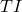
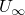
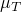
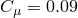
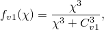
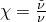
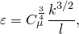
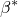

# 34.2.2 Initial conditions in Abaqus/CFD


**Products: **Abaqus/CFD  Abaqus/CAE  

##### **References**

- ["Prescribed conditions: overview," Section 34.1.1](pt07ch34s01abo31.md)
- [*INITIAL CONDITIONS](../key/key-link.md#usb-kws-minitialcond)
- ["Using the predefined field editors," Section 16.11 of the Abaqus/CAE User's Guide](../usi/usi-link.md#usi-lbi-iceditors)

### Overview

In Abaqus/CFD initial conditions for fluid flow simulation are specified using element sets.

### Defining initial velocities

You can define the initial fluid flow velocity in elements; however, if such conditions are omitted, a default value of zero is assumed. Initial velocities must be defined in global directions, regardless of the use of local transformations (see ["Transformed coordinate systems," Section 2.1.5](pt01ch02s01aus09.md)).

For incompressible flow Abaqus/CFD automatically uses the user-defined boundary conditions and tests the specified initial velocity to be sure that the initial velocity field is divergence-free and that the velocity boundary conditions are compatible with the initial velocity field. If they are not, the initial velocity is projected onto a divergence-free subspace, yielding initial conditions that define a well-posed incompressible Navier-Stokes problem. Therefore, in some circumstances, the user-specified initial velocity may be overridden with a velocity that is divergence-free and matches the velocity boundary conditions.

| **Input File Usage: ** | ``` [*INITIAL CONDITIONS](../key/key-link.md#usb-kws-minitialcond), TYPE=VELOCITY, ELEMENT AVERAGE ``` |
| --- | --- |

| **Abaqus/CAE Usage: ** | Load module: **Create Predefined Field**: **Step: Initial**: **Category:** **Fluid**: **Fluid velocity** |
| --- | --- |

### Defining initial density

You can define the initial fluid density in elements. However, if the initial condition is omitted, the material density definition is assumed as default (see ["Density," Section 21.2.1](pt05ch21s02abm01.md)). Similarly, if the initial density is specified on an element set that does not include all fluid elements, the material density is assumed as the default for those elements not contained in the element set.

| **Input File Usage: ** | ``` [*INITIAL CONDITIONS](../key/key-link.md#usb-kws-minitialcond), TYPE=DENSITY, ELEMENT AVERAGE ``` |
| --- | --- |

| **Abaqus/CAE Usage: ** | Load module: **Create Predefined Field**: **Step: Initial**: **Category:** **Fluid**: **Fluid density** |
| --- | --- |

### Initial pressure for incompressible fluid flow

For incompressible flows it is not necessary to prescribe the initial pressure condition since the initial pressure field is computed automatically from the initial velocity field and boundary conditions. This is done to ensure proper starting conditions for incompressible flows.

### Defining initial temperature

If the energy equation is solved, the initial fluid temperature in elements must be defined. 

| **Input File Usage: ** | ``` [*INITIAL CONDITIONS](../key/key-link.md#usb-kws-minitialcond), TYPE=TEMPERATURE, ELEMENT AVERAGE ``` |
| --- | --- |

| **Abaqus/CAE Usage: ** | Load module: **Create Predefined Field**: **Step: Initial**: **Category:** **Fluid**: **Fluid thermal energy** |
| --- | --- |

### Defining initial Spalart-Allmaras turbulent eddy viscosity directly

You can define the initial turbulent eddy viscosity, , directly for use with the Spalart-Allmaras turbulence model. It is recommended that you use a value that is three to five times the kinematic viscosity. The kinematic viscosity is the ratio of the molecular viscosity and density (). For more information, see ["Viscosity," Section 26.1.4](pt05ch26s01abm54.md)

| **Input File Usage: ** | ``` [*INITIAL CONDITIONS](../key/key-link.md#usb-kws-minitialcond), TYPE=TURBNU, ELEMENT AVERAGE ``` |
| --- | --- |

| **Abaqus/CAE Usage: ** | Load module: **Create Predefined Field**: **Step: Initial**: **Category:** **Fluid**: **Fluid turbulence**; **Eddy viscosity**:  |
| --- | --- |

### Defining initial k directly

You can define the initial turbulent kinetic energy, *k*, directly for use with the *k*– and *k*– turbulence models.

| **Input File Usage: ** | ``` [*INITIAL CONDITIONS](../key/key-link.md#usb-kws-minitialcond), TYPE=TURBKE, ELEMENT AVERAGE ``` |
| --- | --- |

| **Abaqus/CAE Usage: ** | Use the following option to specify the initial turbulent kinetic energy for the *k*-- RNG turbulence model: |
| --- | --- |
|  | Load module: **Create Predefined Field**: **Step: Initial**: **Category:** **Fluid**: **Fluid turbulence**; **Turbulent kinetic energy**: *k* The *k*-- realizable and *k*-- turbulence models are not supported in Abaqus/CAE. |

### Defining initial epsilon directly

You can define the initial turbulent kinetic energy dissipation rate, , directly for use with the *k*– turbulence models.

| **Input File Usage: ** | ``` [*INITIAL CONDITIONS](../key/key-link.md#usb-kws-minitialcond), TYPE=TURBEPS, ELEMENT AVERAGE ``` |
| --- | --- |

| **Abaqus/CAE Usage: ** | Use the following option to specify the initial turbulent kinetic energy dissipation rate for the *k*-- RNG turbulence model: |
| --- | --- |
|  | Load module: **Create Predefined Field**: **Step: Initial**: **Category:** **Fluid**: **Fluid turbulence**; **Dissipation rate**:  The *k*-- realizable turbulence model is not supported in Abaqus/CAE. |

### Defining initial omega directly

You can define the initial specific energy dissipation rate, , directly for use with the *k*– turbulence model.

| **Input File Usage: ** | ``` [*INITIAL CONDITIONS](../key/key-link.md#usb-kws-minitialcond), TYPE=TURBOMEGA, ELEMENT AVERAGE ``` |
| --- | --- |

| **Abaqus/CAE Usage: ** | The *k*-- turbulence model is not supported in Abaqus/CAE. |
| --- | --- |

### Defining initial turbulence intensity

You can define the initial turbulence intensity, , for use with the *k*–, *k*–, and Spalart-Allmaras turbulence models.

| **Input File Usage: ** | ``` [*INITIAL CONDITIONS](../key/key-link.md#usb-kws-minitialcond), TYPE=TURBINTENSITY, ELEMENT AVERAGE ``` |
| --- | --- |

| **Abaqus/CAE Usage: ** | Defining the initial turbulence intensity is not supported in Abaqus/CAE. |
| --- | --- |

### Defining initial turbulent length scale

You can define the initial turbulent length scale, , for use with the *k*–, *k*–, and Spalart-Allmaras turbulence models.

| **Input File Usage: ** | ``` [*INITIAL CONDITIONS](../key/key-link.md#usb-kws-minitialcond), TYPE=TURBLENGTHSCALE, ELEMENT AVERAGE ``` |
| --- | --- |

| **Abaqus/CAE Usage: ** | Defining the initial turbulent length scale is not supported in Abaqus/CAE. |
| --- | --- |

### Defining the initial characteristic velocity scale

You can define the initial characteristic velocity scale, , for use with the *k*–, *k*–, and Spalart-Allmaras turbulence models.

| **Input File Usage: ** | ``` [*INITIAL CONDITIONS](../key/key-link.md#usb-kws-minitialcond), TYPE=TURBVELOCITYSCALE, ELEMENT AVERAGE ``` |
| --- | --- |

| **Abaqus/CAE Usage: ** | Defining the initial characteristic velocity scale is not supported in Abaqus/CAE. |
| --- | --- |

### Defining the initial eddy to molecular viscosity ratio

You can define the initial eddy to molecular viscosity ratio, , for use with the *k*–, *k*–, and Spalart-Allmaras turbulence models. The ratio of the eddy to molecular viscosity is defined by 


where  is the eddy viscosity and  is the molecular viscosity. For more information about viscosity see ["Viscosity," Section 26.1.4](pt05ch26s01abm54.md). 

| **Input File Usage: ** | ``` [*INITIAL CONDITIONS](../key/key-link.md#usb-kws-minitialcond), TYPE=TURBVISCOSITYRATIO, ELEMENT AVERAGE ``` |
| --- | --- |

| **Abaqus/CAE Usage: ** | Defining the initial eddy to molecular viscosity ratio is not supported in Abaqus/CAE. |
| --- | --- |

### Defining initial Spalart-Allmaras turbulent eddy viscosity from turbulence properties

You can specify the initial Spalart-Allmaras turbulent eddy viscosity, , using the turbulence properties described above.

#### Using the turbulence intensity, the turbulent length scale, and a characteristic velocity scale

The value of  is obtained from the specified turbulence intensity, ; the turbulent length scale, ; and the characteristic velocity of the problem, ; as


 is a model coefficient that is used in the *k*– models to compute the eddy viscosity  (); it does not exist in the Spalart-Allmaras model. However, the standard *k*–  is included for consistency between turbulence models when the turbulence intensity, velocity scale, and length scale are used to specify initial turbulent conditions. A characteristic velocity scale is required to avoid cases when the initial velocity field is zero.

#### Using the eddy to molecular viscosity ratio

Abaqus/CFD solves the following equation to obtain the value of  using the ratio of the eddy to molecular viscosity: 




where  .

### Defining initial *k* using the turbulence intensity and a characteristic velocity scale

The initial turbulent kinetic energy, *k*, for the *k*– and *k*– turbulence models is obtained using the turbulence intensity, , and a characteristic velocity scale, . Once these quantities are defined as described above, the turbulent kinetic energy is computed internally as


### Defining initial epsilon from turbulence properties

You can specify the initial energy dissipation rate for the *k*– turbulence models using the turbulence properties described above.

#### Using initial k and the eddy to molecular viscosity ratio

The initial  can be specified using the initial *k* and the eddy to molecular viscosity ratio, . Once these quantities are defined, the energy dissipation rate is computed internally as 


 where  is a turbulent model coefficient and  is the fluid kinematic viscosity (). 

#### Using initial k and the turbulent length scale

The initial  can be specified using the initial *k* and the turbulent length scale, .  Once these quantities are defined, the energy dissipation rate is computed internally as



 where  is a turbulent model coefficient.

### Defining initial omega from turbulence properties

You can specify the initial specific energy dissipation rate for the *k*– turbulence model using the turbulence properties described above.

#### Using initial k and the eddy to molecular viscosity ratio

The initial  can be specified using the initial *k* and the eddy to molecular viscosity ratio, . Once these quantities are defined, the specific energy dissipation rate is computed internally as 


#### Using initial k and the turbulent length scale

The initial  can be specified using the initial *k* and the turbulent length scale, .  Once these quantities are defined, the specific energy dissipation rate is computed internally as


 where  is a turbulent model coefficient. 


