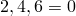
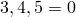
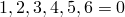
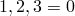
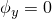
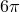

# 34.3.1 Boundary conditions in Abaqus/Standard and Abaqus/Explicit


**Products: **Abaqus/Standard  Abaqus/Explicit  Abaqus/CAE  

##### **References**

- ["Defining a model in Abaqus," Section 1.3.1](pt01ch01s03aus03.md)
- ["Prescribed conditions: overview," Section 34.1.1](pt07ch34s01abo31.md)
- ["VDISP," Section 1.2.1 of the Abaqus User Subroutines Reference Guide](../sub/sub-link.md#sub-rtn-uexpdisp)
- ["DISP," Section 1.1.4 of the Abaqus User Subroutines Reference Guide](../sub/sub-link.md#sub-rtn-udisp)
- [*BOUNDARY](../key/key-link.md#usb-kws-hboundary)
- ["Using the boundary condition editors," Section 16.10 of the Abaqus/CAE User's Guide](../usi/usi-link.md#usi-lbi-bceditors)

### Overview

Boundary conditions:
- can be used to specify the values of all basic solution variables (displacements, rotations, warping amplitude, fluid pressures, pore pressures, temperatures, electrical potentials, normalized concentrations, acoustic pressures, or connector material flow) at nodes;
- can be given as "model" input data (within the initial step in Abaqus/CAE) to define zero-valued boundary conditions;
- can be given as "history" input data (within an analysis step) to add, modify, or remove zero-valued or nonzero boundary conditions; and
- can be defined by the user through subroutines [`DISP`](../sub/sub-link.md#sub-xsl-disp) for Abaqus/Standard and [`VDISP`](../sub/sub-link.md#sub-xsl-vdisp) for Abaqus/Explicit.

Relative motions in connector elements can be prescribed similar to boundary conditions. See ["Connector actuation," Section 31.1.3](pt06ch31s01alm26.md), for more detailed information.

### Prescribing boundary conditions as model data

Only zero-valued boundary conditions can be prescribed as model data (i.e., in the initial step in Abaqus/CAE). You can specify the data using either “direct” or “type” format. As described below, the “type” format is a way of conveniently specifying common types of boundary conditions in stress/displacement analyses. “Direct” format must be used in all other analysis types.

For both “direct” and “type” format you specify the region of the model to which the boundary conditions apply and the degrees of freedom to be restrained. (See ["Conventions," Section 1.2.2](pt01ch01s02aus02.md), for the degree of freedom numbers used in Abaqus.)

Boundary conditions prescribed as model data can be modified or removed during analysis steps.

| **Input File Usage: ** | ``` [*BOUNDARY](../key/key-link.md#usb-kws-hboundary) ``` |
| --- | --- |
|  | Any number of data lines can be used to specify boundary conditions, and in stress/displacement analyses both "direct" and "type" format can be specified with a single use of the [*BOUNDARY](../key/key-link.md#usb-kws-hboundary) option. |

| **Abaqus/CAE Usage: ** | Load module: **Create Boundary Condition**: **Step: Initial** |
| --- | --- |

#### Using the direct format

You can choose to enter the degrees of freedom to be constrained directly.

| **Input File Usage: ** | Either a single degree of freedom or the first and last of a range of degrees of freedom can be specified. |
| --- | --- |
|  | ``` [*BOUNDARY](../key/key-link.md#usb-kws-hboundary) *node or node set*, *degree of freedom* [*BOUNDARY](../key/key-link.md#usb-kws-hboundary) *node or node set*, *first degree of freedom*, *last degree of freedom* ``` For example, ``` [*BOUNDARY](../key/key-link.md#usb-kws-hboundary) EDGE, 1 ``` indicates that all nodes in node set `EDGE` are constrained in degree of freedom 1 (), while the data line ``` EDGE, 1, 4 ``` indicates that all nodes in node set `EDGE` are constrained in degrees of freedom 1--4 (, , , ). |

| **Abaqus/CAE Usage: ** | Load module: **Create Boundary Condition**: **Step: Initial** |
| --- | --- |
|  | Use one of the following options: **Category: Mechanical**; **Displacement/Rotation**, **Velocity/Angular velocity**, or **Acceleration/Angular acceleration**; select regions and toggle on the degree or degrees of freedom **Category: Electrical/Magnetic**; **Electric potential**; select regions **Category: Other**; **Temperature**, **Pore pressure**, **Mass concentration**, **Acoustic pressure**, or **Connector material flow**; select regions If you are specifying a temperature boundary condition for a shell region, you can enter multiple degrees of freedom, from 11 to 31, inclusive. |

#### Using the "type" format in stress/displacement analyses

The type of boundary condition can be specified instead of degrees of freedom. The following boundary condition “types” are available in both Abaqus/Standard and Abaqus/Explicit: 

| XSYMM | Symmetry about a plane  (degrees of freedom ). |
| --- | --- |
| YSYMM | Symmetry about a plane  (degrees of freedom ). |
| ZSYMM | Symmetry about a plane  (degrees of freedom ). |
| ENCASTRE | Fully built-in (degrees of freedom ). |
| PINNED | Pinned (degrees of freedom ). |

The following boundary condition types are available only in Abaqus/Standard:

| XASYMM | Antisymmetry about a plane with  (degrees of freedom 2, 3, 4 ). |
| --- | --- |
| YASYMM | Antisymmetry about a plane with  (degrees of freedom 1, 3, 5 ). |
| ZASYMM | Antisymmetry about a plane with  (degrees of freedom 1, 2, 6 ). |

**Caution:**When boundary conditions are prescribed at a node in an analysis involving finite rotations, at least two rotation degrees of freedom should be constrained. Otherwise, the prescribed rotation at the node may not be what you expect. Therefore, antisymmetry boundary conditions should generally not be used in problems involving finite rotations.

| NOWARP | Prevent warping of an elbow section at a node. |
| --- | --- |
| NOOVAL | Prevent ovalization of an elbow section at a node. |
| NODEFORM | Prevent all cross-sectional deformation (warping, ovalization, and uniform radial expansion) at a node. |

The NOWARP, NOOVAL, and NODEFORM types apply only to elbow elements (["Pipes and pipebends with deforming cross-sections: elbow elements," Section 29.5.1](pt06ch29s05alm15.md)).

For example, applying a boundary condition of type XSYMM to node set `EDGE` indicates that the node set lies on a plane of symmetry that is normal to the *X*-axis (which will be the global *X*-axis or the local *X*-axis if a nodal transformation has been applied at these nodes). This boundary condition is identical to applying a boundary condition using the direct format to degrees of freedom 1, 5, and 6 in node set `EDGE` since symmetry about a plane *X*=constant implies , , and .

Once a degree of freedom has been constrained using a “type” boundary condition as model data, the constraint cannot be modified by using a boundary condition in “direct” format as model data; modifying a constraint in such a way will only produce an error message in the data (`.dat`) file indicating that conflicting boundary conditions exist in the model data.

| **Input File Usage: ** | ``` [*BOUNDARY](../key/key-link.md#usb-kws-hboundary) *node or node set*, *boundary condition type* ``` |
| --- | --- |

| **Abaqus/CAE Usage: ** | Load module: **Create Boundary Condition**: **Step: Initial**: **Symmetry/Antisymmetry/Encastre**: select regions and toggle on the boundary condition type |
| --- | --- |

#### Prescribing boundary conditions at phantom nodes for enriched elements

Phantom nodes for an enriched element can be either colocated with real nodes or located on an element edge between two real corner nodes (see ["Modeling discontinuities as an enriched feature using the extended finite element method," Section 10.7.1](pt04ch10s07at36.md)). For phantom nodes coincident with real nodes, boundary conditions can be specified using the node numbers of the real nodes. For phantom nodes with pore pressure degrees of freedom that are located on an element edge, the boundary conditions can be specified by identifying the phantom nodes in terms of the two real corner node numbers.

| **Input File Usage: ** | Use the following option to specify boundary conditions at a phantom node originally located coincident with the specified real node: |
| --- | --- |
|  | ``` [*BOUNDARY](../key/key-link.md#usb-kws-hboundary), PHANTOM=NODE *node number*, *first degree of freedom*, *last degree of freedom* ``` Use the following option to specify boundary conditions at a phantom node located at an element edge: ``` [*BOUNDARY](../key/key-link.md#usb-kws-hboundary), PHANTOM=EDGE *first corner node number*, *second corner node number*, *first degree of freedom*, *last degree of freedom* ``` |

| **Abaqus/CAE Usage: ** | Prescribing boundary conditions at phantom nodes for enriched elements is not supported in Abaqus/CAE. |
| --- | --- |

### Prescribing boundary conditions as history data

Boundary conditions can be prescribed within an analysis step using either “direct” or “type” format. As with model data boundary conditions, the “type” format can be used only in stress/displacement analyses; whereas, the “direct” format can be used in analysis types.

When using the “direct” format, boundary conditions can be defined as the total value of a variable or, in a stress/displacement analysis, as the value of a variable's velocity or acceleration.

As many boundary conditions as necessary can be defined in a step.

| **Input File Usage: ** | ``` [*BOUNDARY](../key/key-link.md#usb-kws-hboundary) ``` |
| --- | --- |

| **Abaqus/CAE Usage: ** | Load module: **Create Boundary Condition**: **Step: *analysis_step*** |
| --- | --- |

#### Using the direct format

Specify the region of the model to which the boundary conditions apply, the degree or degrees of freedom to be specified (see ["Conventions," Section 1.2.2](pt01ch01s02aus02.md), for the degree of freedom numbers used in Abaqus), and the magnitude of the boundary condition. If the magnitude is omitted, it is the same as specifying a zero magnitude.

In stress/displacement analysis you can specify a velocity history or an acceleration history. The default is a displacement history.

| **Input File Usage: ** | Use either of the following options to prescribe a displacement history: |
| --- | --- |
|  | ``` [*BOUNDARY](../key/key-link.md#usb-kws-hboundary) or [*BOUNDARY](../key/key-link.md#usb-kws-hboundary), TYPE=DISPLACEMENT *node or node set*, *degree of freedom*, *magnitude* *node or node set*, *first degree of freedom*, *last degree of freedom*, *magnitude* ``` Use the following option to prescribe a velocity history (the data lines are the same as above): ``` [*BOUNDARY](../key/key-link.md#usb-kws-hboundary), TYPE=VELOCITY ``` Use the following option to prescribe an acceleration history (the data lines are the same as above): ``` [*BOUNDARY](../key/key-link.md#usb-kws-hboundary), TYPE=ACCELERATION ``` For example, ``` [*BOUNDARY](../key/key-link.md#usb-kws-hboundary), TYPE=VELOCITY EDGE, 1, 1, 0.5 ``` indicates that all nodes in node set `EDGE` have a prescribed velocity magnitude of 0.5 in degree of freedom 1 (). |

| **Abaqus/CAE Usage: ** | Load module: **Create Boundary Condition**: **Step: *analysis_step***: |
| --- | --- |
|  | Select one of the following categories and types: **Category: Mechanical**; **Displacement/Rotation**; select regions; **Distribution: Uniform** or select an analytical field or a discrete field; toggle on the degree or degrees of freedom; *magnitude* **Category: Mechanical**; **Velocity/Angular velocity** or **Acceleration/Angular acceleration**; select regions; **Distribution: Uniform** or select an analytical field; toggle on the degree or degrees of freedom; *magnitude* **Category: Electrical/Magnetic**; **Electric potential**; select regions; **Distribution: Uniform** or select an analytical field; **Method: Specify magnitude**; *magnitude* **Category: Other**; **Temperature**, **Pore pressure**, **Mass concentration**, **Acoustic pressure**, or **Connector material flow**; select regions; **Distribution: Uniform** or select an analytical field; **Method: Specify magnitude**; *magnitude* If you are specifying a temperature boundary condition for a shell region, you can enter multiple degrees of freedom, from 11 to 31, inclusive. |

#### Prescribed displacement

In Abaqus/Standard you can prescribe jumps in displacements. For example, a displacement-type boundary condition is used to apply a prescribed displacement magnitude of 0.5 in degree of freedom 1 () to the nodes in node set `EDGE`. In a second step these nodes can be moved by another 0.5 length units (to a total displacement of 1.0) by applying a prescribed displacement magnitude of 1.0 in degree of freedom 1 to node set `EDGE`. Specifying a prescribed displacement magnitude of 0 (or omitting the magnitude) in degree of freedom 1 in the next step would return the nodes in node set `EDGE` to their original locations.

In contrast, Abaqus/Explicit does not admit jumps in displacements and rotations. Displacement boundary conditions in displacement and rotation degrees of freedom are enforced in an incremental manner using the slope of the amplitude curve (see below). If no amplitude is specified, Abaqus/Explicit will ignore the user-supplied displacement value and enforce a zero velocity boundary condition.

The displacement must remain continuous across steps. If amplitude curves are specified, it is possible, but not valid, to specify a jump in the displacement across a step boundary when using step time for the amplitude definition. Abaqus/Explicit will ignore such jumps in displacement if they are specified.

#### Using the "type" format in stress/displacement analyses

The type of boundary condition can be specified (as history data) instead of degrees of freedom in the same manner as discussed above for model data. The boundary condition “types” that are available as history data are the same as those available as model data.

Once a degree of freedom has been constrained using a “type” boundary condition as history data, the constraint cannot be modified by using a boundary condition in “direct” format. The constraint can be redefined only by using a boundary condition in “direct” format after all previously applied boundary conditions specified using “type” format are removed.

| **Input File Usage: ** | ``` [*BOUNDARY](../key/key-link.md#usb-kws-hboundary) *node or node set*, *boundary condition type* ``` |
| --- | --- |

| **Abaqus/CAE Usage: ** | Load module: **Create Boundary Condition**: **Step: *analysis_step***: **Symmetry/Antisymmetry/Encastre**: select regions and toggle on the boundary condition type |
| --- | --- |

#### Prescribing boundary conditions at phantom nodes for enriched elements

You can specify boundary conditions at phantom nodes as history data in the same manner as discussed above for model data (see ["Modeling discontinuities as an enriched feature using the extended finite element method," Section 10.7.1](pt04ch10s07at36.md), for more information on enriched elements). To specify nonzero boundary conditions, enter the actual magnitude.

| **Input File Usage: ** | Use the following option to specify boundary conditions at a phantom node originally located coincident with the specified real node: |
| --- | --- |
|  | ``` [*BOUNDARY](../key/key-link.md#usb-kws-hboundary), PHANTOM=NODE *node number*, *first degree of freedom*, *last degree of freedom*, *magnitude* ``` Use the following option to specify boundary conditions at a phantom node located at an element edge: ``` [*BOUNDARY](../key/key-link.md#usb-kws-hboundary), PHANTOM=EDGE *first corner node number*, *second corner node number*, *first degree of freedom*, *last degree of freedom*, *magnitude* ``` |

| **Abaqus/CAE Usage: ** | Prescribing boundary conditions at phantom nodes for enriched elements is not supported in Abaqus/CAE. |
| --- | --- |

### Defining boundary conditions that vary with time

The prescribed magnitude of a basic solution variable, a velocity, or an acceleration can vary with time during a step according to an amplitude definition (["Amplitude curves," Section 34.1.2](pt07ch34s01aus115.md)).

When an amplitude definition is used with a boundary condition in a dynamic or modal dynamic analysis, the first and second time derivatives of the constrained variable may be discontinuous. For example, Abaqus will compute the corresponding velocity and acceleration from a given displacement boundary condition.

By default, Abaqus/Standard will smooth the amplitude curve so that the derivatives of the specified boundary condition will be finite. You must ensure that the applied values are correct after smoothing.

Abaqus/Explicit does not apply default smoothing to discontinuous amplitude curves. To avoid the “noisy” solution that may result from discontinuities in Abaqus/Explicit, it is better to specify the velocity history of a node. See ["Amplitude curves," Section 34.1.2](pt07ch34s01aus115.md).

| **Input File Usage: ** | Use both of the following options: |
| --- | --- |
|  | ``` [*AMPLITUDE](../key/key-link.md#usb-kws-mamplitude), NAME=*name* [*BOUNDARY](../key/key-link.md#usb-kws-hboundary), AMPLITUDE=*name* ``` |

| **Abaqus/CAE Usage: ** | Load or Interaction module: **Create Amplitude**: **Name**: *amplitude_name*Load module: **Create Boundary Condition**: **Step: *analysis_step***: ***boundary condition***; **Amplitude**: *amplitude_name* |
| --- | --- |

### Defining boundary condition through user subroutines

 If an amplitude based evolution of a boundary condition is not sufficient, you can define it yourself in a user subroutine. For this purpose, Abaqus/Standard provides the routine [`DISP`](../sub/sub-link.md#sub-xsl-disp); whereas, Abaqus/Explicit provides the routine [`VDISP`](../sub/sub-link.md#sub-xsl-vdisp). The region to which the boundary conditions apply and the constrained degrees of freedom are specified as part of the boundary condition definition. The actual boundary condition is set within the user routine based on a number of variables made available in those routines ( see ["DISP," Section 1.1.4 of the Abaqus User Subroutines Reference Guide](../sub/sub-link.md#sub-rtn-udisp) for [`DISP`](../sub/sub-link.md#sub-xsl-disp) and ["VDISP," Section 1.2.1 of the Abaqus User Subroutines Reference Guide](../sub/sub-link.md#sub-rtn-uexpdisp) for [`VDISP`](../sub/sub-link.md#sub-xsl-vdisp) ). 

Abaqus/Standard allows for an amplitude and a reference magnitude definition for a user-defined boundary condition and you may overwrite the amplitude based boundary value within the [`DISP`](../sub/sub-link.md#sub-xsl-disp) routine. Whereas, Abaqus/Explicit ignores the reference magnitude, but passes in the amplitude value as an argument to the user routine [`VDISP`](../sub/sub-link.md#sub-xsl-vdisp) and you may define the boundary condition to a non-zero value.

| **Input File Usage: ** | ``` [*BOUNDARY](../key/key-link.md#usb-kws-hboundary), USER ``` |
| --- | --- |

| **Abaqus/CAE Usage: ** | Load module: **Create Boundary Condition**: **Step: *analysis_step***; ***boundary condition***; **Distribution: User-defined** |
| --- | --- |

### Boundary condition propagation

By default, all boundary conditions defined in the previous general analysis step remain unchanged in the subsequent general step or in subsequent consecutive linear perturbation steps. Boundary conditions do not propagate between linear perturbation steps. You define the boundary conditions in effect for a given step relative to the preexisting boundary conditions. At each new step the existing boundary conditions can be modified and additional boundary conditions can be specified. Alternatively, you can release all previously applied boundary conditions in a step and specify new ones. In this case any boundary conditions that are to be retained must be respecified.

#### Modifying boundary conditions

When you modify an existing boundary condition, the node or node set must be specified in exactly the same way as previously. For example, if a boundary condition is specified for a node set in one step and for an individual node contained in the set in another step, Abaqus issues an error. You must remove the boundary condition and respecify it to change the way the node or node set is specified.

| **Input File Usage: ** | Use either of the following options to modify an existing boundary condition or to specify an additional boundary condition: |
| --- | --- |
|  | ``` [*BOUNDARY](../key/key-link.md#usb-kws-hboundary) [*BOUNDARY](../key/key-link.md#usb-kws-hboundary), OP=MOD ``` |

| **Abaqus/CAE Usage: ** | Load module: **Create Boundary Condition** or **Boundary Condition Manager**: **Edit** |
| --- | --- |

#### Removing boundary conditions

If you choose to remove any boundary condition in a step, no boundary conditions will be propagated from the previous general step. Therefore, all boundary conditions that are in effect during this step must be respecified. The only exception to this rule is during an eigenvalue buckling prediction procedure, as described in ["Eigenvalue buckling prediction," Section 6.2.3](pt03ch06s02at02.md).

Setting a boundary condition to zero is not the same as removing it.

| **Input File Usage: ** | Use the following option to release all previously applied boundary conditions and to specify new boundary conditions: |
| --- | --- |
|  | ``` [*BOUNDARY](../key/key-link.md#usb-kws-hboundary), OP=NEW ``` If the OP=NEW parameter is used on any [*BOUNDARY](../key/key-link.md#usb-kws-hboundary) option within a step, it must be used on all [*BOUNDARY](../key/key-link.md#usb-kws-hboundary) options in the step. |

| **Abaqus/CAE Usage: ** | Use the following option to remove a boundary condition within a step: |
| --- | --- |
|  | Load module: **Boundary Condition Manager**: **Deactivate** Abaqus/CAE automatically respecifies any boundary conditions that should remain in effect during this step. |

### Fixing degrees of freedom at a point in an Abaqus/Standard analysis

In Abaqus/Standard you can “freeze” specified degrees of freedom at their final values from the last general analysis step. Specifying a zero velocity or zero acceleration boundary condition will have the same effect as fixing the degrees of freedom for displacement or velocity, respectively.

| **Input File Usage: ** | ``` [*BOUNDARY](../key/key-link.md#usb-kws-hboundary), FIXED ``` |
| --- | --- |
|  | The OP=NEW parameter must be used with the FIXED parameter if there are any other [*BOUNDARY](../key/key-link.md#usb-kws-hboundary) options in the same step that have the OP=NEW parameter. Any magnitudes given for the boundary condition are ignored. The FIXED parameter is ignored if it is used in the first step of an analysis. |

| **Abaqus/CAE Usage: ** | Load module; **Create Boundary Condition**; **Step: *analysis_step***; ***boundary condition***; **Method**: **Fixed at Current Position** (available only if a previous general analysis step exists) |
| --- | --- |

### Prescribing boundary conditions in linear perturbation steps

In a linear perturbation step (["General and linear perturbation procedures," Section 6.1.3](pt03ch06s01aus44.md)) the magnitudes of prescribed boundary conditions should be given as the magnitudes of the perturbations about the base state. Boundary conditions given within the model definition are always regarded as part of the base state, even if the first analysis step is a linear perturbation step. The boundary conditions given in a linear perturbation step will not affect subsequent steps.

If a perturbation step does not contain a boundary condition definition, degrees of freedom that are restrained/prescribed in the base state will be restrained in the perturbation step and will have perturbation magnitudes of zero. To prescribe nonzero perturbation magnitudes, you have to modify the existing boundary conditions. You can also fix and prescribe perturbation magnitudes of degrees of freedom that are unrestrained in the base state.

If degrees of freedom that are restrained/prescribed in the base state are released, all restraints that are to remain must be respecified, remembering that all magnitudes will be interpreted as perturbations.

Fixing the degrees of freedom at their final values from the last general analysis step (see previous discussion) has the same effect as modifying the existing boundary conditions to have zero perturbation magnitudes for all specified degrees of freedom.

The antisymmetric buckling modes of a symmetric structure can be found in an eigenvalue buckling prediction analysis by specifying the proper boundary conditions (see ["Eigenvalue buckling prediction," Section 6.2.3](pt03ch06s02at02.md)).

#### Prescribing real and imaginary values in boundary conditions

In steady-state dynamic and matrix generation procedures, a boundary condition can be prescribed using either a real or an imaginary value (see ["Direct-solution steady-state dynamic analysis," Section 6.3.4](pt03ch06s03at09.md), and ["Generating matrices," Section 10.3.1](pt04ch10s03at32.md)). If the real value is prescribed for a degree of freedom (and the imaginary value is not explicitly prescribed), the imaginary value is considered to be zero. Similarly, if the imaginary value is prescribed (and the real value is not explicitly prescribed), the real value is considered to be zero.

#### Prescribed motion in modal superposition procedures

In modal superposition procedures (["Dynamic analysis procedures: overview," Section 6.3.1](pt03ch06s03abo07.md)) prescribed displacements cannot be defined directly using a boundary condition. Instead, the boundary conditions are grouped into bases in a frequency extraction step. Then, the motion of each base is prescribed in the modal superposition step. See ["Natural frequency extraction," Section 6.3.5](pt03ch06s03at10.md), and ["Transient modal dynamic analysis," Section 6.3.7](pt03ch06s03at12.md), for details on this method.

| **Input File Usage: ** | ``` [*BOUNDARY](../key/key-link.md#usb-kws-hboundary), BASE NAME [*BASE MOTION](../key/key-link.md#usb-kws-hbasemotion) ``` |
| --- | --- |

| **Abaqus/CAE Usage: ** | Load module; **Create Boundary Condition**; **Step:** *modal_dynamic_step*, *steady-state_dynamic_step*, or *random_response_step*; **Category: Mechanical**; **Types for Selected Step:** **Displacement base motion** or **Velocity base motion** or **Acceleration base motion** |
| --- | --- |

### Submodeling

When using the submodeling technique, the magnitudes of the boundary conditions in the submodel can be defined by interpolating the values of the prescribed degrees of freedom from the file output results of the global model. See ["Node-based submodeling," Section 10.2.2](pt04ch10s02aus61.md), for details.

### Prescribing large rotations

Sequential finite rotations about different axes of rotation are not additive, which can make direct specification of such rotations challenging. It is much simpler to apply finite-rotation boundary conditions by specifying the rotational velocity versus time. For a discussion of the rotation degrees of freedom and a multiple step finite rotation example that demonstrates why velocity-type boundary conditions are preferred for specifying finite-rotation boundary conditions, see ["Conventions," Section 1.2.2](pt01ch01s02aus02.md).

When velocity-type boundary conditions are used to prescribe rotations, the definition is given in terms of the angular velocity instead of the total rotation. If the angular velocity is associated with a nondefault amplitude, Abaqus calculates the prescribed increment of rotation as the average of the prescribed angular velocities at the beginning and the end of each increment, multiplied by the time increment.

In Abaqus/Explicit displacement-type boundary conditions that refer to an amplitude curve are effectively enforced as velocity boundary conditions using average velocities over time increments as computed by finite differences of values from the amplitude curve. As with prescribed displacements (see ["Prescribed displacement](pt07ch34s03aus118.md#usb-prc-pboundary-prescribed-disp)” above), Abaqus/Explicit does not admit jumps in rotations.

Displacement-type boundary conditions in Abaqus/Standard that constrain just one component of rotation can have essentially no effect on the solution because the two unconstrained rotational degrees of freedom can combine to override the constraint.

#### Example: Using velocity-type boundary conditions to prescribe rotations

For example, if a rotation of  about the *z*-axis is required in a static step, with no rotation about the *x*- and *y*-axes, use a step time (specified as part of the static step definition) of 1.0, and define a velocity-type boundary condition to specify zero velocity for degrees of freedom 4 and 5 and a constant angular velocity of  for degree of freedom 6. Since the default variation for a velocity-type boundary condition in a static procedure is a step, the velocity will be constant over the step. Alternatively, an amplitude reference could be used to specify the desired variation over the step.

```
[*BOUNDARY](../key/key-link.md#usb-kws-hboundary), TYPE=VELOCITY
NODE, 4
NODE, 5
NODE, 6, 6, 18.84955592
```

If, in the next step, the same node should have an additional rotation of  radians about the global *x*-axis, use another static step with a step time of 1.0 and again define a velocity-type boundary condition to prescribe zero velocity for degrees of freedom 5 and 6 and a constant angular velocity of  for degree of freedom 4.

```
[*BOUNDARY](../key/key-link.md#usb-kws-hboundary), TYPE=VELOCITY
NODE, 4, 4, 1.570796327
NODE, 5
NODE, 6
```

### Prescribing radial motion on an axisymmetric model

The radial coordinate for any node in an axisymmetric model must be positive. Therefore, you must make sure that any specified boundary condition does not violate this condition.


