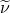

# 34.3.2 Boundary conditions in Abaqus/CFD


**Products: **Abaqus/CFD  Abaqus/CAE  

##### **References**

- ["Distribution definition," Section 2.8.1](pt01ch02s08aus26.md)
- ["Prescribed conditions: overview," Section 34.1.1](pt07ch34s01abo31.md)
- ["Conventions," Section 1.2.2](pt01ch01s02aus02.md)
- [*BOUNDARY](../key/key-link.md#usb-kws-hboundary)
- [*DISTRIBUTION](../key/key-link.md#usb-kws-mdistribution)
- [*FLUID BOUNDARY](../key/key-link.md#usb-kws-hfluidboundary)
- ["Using the boundary condition editors," Section 16.10 of the Abaqus/CAE User's Guide](../usi/usi-link.md#usi-lbi-bceditors)

### Overview

Boundary conditions:
- are used to prescribe the values of all primitive variables involved in a fluid dynamics calculation (e.g., velocities, temperatures, turbulence variables, wall-normal distance, etc.);
- can be given as "history" input data (within an analysis step) to add, modify, or remove zero-valued or nonzero boundary conditions; and
- can be prescribed through the use of a co-simulation region for multiphysics problems.

Computational fluid dynamics problems typically require the prescription of multiple variables such as pressure, temperature, and velocity for boundary conditions. In practice, boundary conditions tend to appear together to collectively define a physical behavior; e.g., no-slip/no-penetration conditions at a wall. In contrast, Neumann conditions (e.g., prescribed heat flux) are specified as loads (see ["Specifying surface-based distributed heat fluxes" in "Thermal loads," Section 34.4.4](pt07ch34s04aus123.md#usb-prc-pthermal-sbdistheatflux)). In the absence of a prescribed boundary condition or load, the default behavior for Abaqus/CFD is to enforce a homogeneous (zero) Neumann condition. For example, if the temperature is not specified at a wall, the default behavior is to automatically specify a perfectly insulated boundary; i.e., zero normal heat flux. Similarly, if the velocity is not prescribed, the normal derivative of the velocity is set to zero.

Combinations of boundary conditions that represent a physical type (for example, an inflow, outflow, or wall behavior) are grouped collectively for ease of use. For more information on Abaqus/CAE groupings, see ["Using the boundary condition editors," Section 16.10 of the Abaqus/CAE User's Guide](../usi/usi-link.md#usi-lbi-bceditors). Alternatively, you can prescribe boundary conditions, including spatially varying conditions, at surfaces, element faces, and nodes.

### Active degrees of freedom

In Abaqus/CFD the active fields (degrees of freedom) are determined by the analysis procedure and the options specified, such as turbulence models and auxiliary transport equations. You specify a boundary condition type and physical type, if applicable, for a fluid boundary condition. Surface-based and node-based boundary conditions and the analysis procedure and additional options required for activation, if any, are listed in [Table 34.3.2--1](pt07ch34s03aus119.md#bc-type-element) and [Table 34.3.2--2](pt07ch34s03aus119.md#bc-type-node), respectively.

**Table 34.3.2–1** Surface-based fluid boundary conditions and activation options.
| Boundary condition type | Description | Incompressible flow | Physical type |
| --- | --- | --- | --- |
| TEMP | Fluid temperature | Energy equation | Velocity inlet, pressure outlet, slip wall, no-slip/no-penetration wall |
| TEMP*n* | Fluid temperature on face *n* | Energy equation | --- |
| TURBEPS | Turbulent energy dissipation rate () | - RNG and realizable models | Velocity inlet, pressure outlet, slip wall |
| TURBEPS*n* | Turbulent energy dissipation rate () on face *n* | - RNG and realizable models | --- |
| TURBKE | Turbulent kinetic energy () | - SST and - RNG and realizable models | Velocity inlet, pressure outlet, slip wall |
| TURBKE*n* | Turbulent kinetic energy () on face *n* | - SST and - RNG and realizable models | --- |
| TURBOMEGA | Specific energy dissipation rate () | - SST model | Velocity inlet, pressure outlet, slip wall |
| TURBOMEGA*n* | Specific energy dissipation rate () on face *n* | - SST model | --- |
| TURBNU | Turbulent kinematic eddy viscosity | Spalart-Allmaras model | Velocity inlet, pressure outlet, slip wall |
| TURBNU*n* | Turbulent kinematic eddy viscosity on face *n* | Spalart-Allmaras model | --- |
| TURBINTENSITY | Turbulence intensity | Spalart-Allmaras, - SST, and - RNG and realizable models | Velocity inlet, pressure outlet, slip wall |
| TURBLENGTHSCALE | Turbulent length scale | Spalart-Allmaras, - SST, and - RNG and realizable models | Velocity inlet, pressure outlet, slip wall |
| TURBVISCOSITYRATIO | Eddy to molecular viscosity ratio | Spalart-Allmaras, - SST, and - RNG and realizable models | Velocity inlet, pressure outlet, slip wall |
| VELX | *x*-velocity | --- | Velocity inlet, slip wall |
| VELX*n* | *x*-velocity on face *n* | --- | --- |
| VELY | *y*-velocity | --- | Velocity inlet, slip wall |
| VELY*n* | *y*-velocity on face *n* | --- | --- |
| VELZ | *z*-velocity | --- | Velocity inlet, slip wall |
| VELZ*n* | *z*-velocity on face *n* | --- | --- |
| VELN | Normal velocity | --- | Velocity inlet |
| VELXNU | *x*-velocity defined via user subroutine | --- | Velocity inlet, slip wall |
| VELYNU | *y*-velocity defined via user subroutine | --- | Velocity inlet, slip wall |
| VELZNU | *z*-velocity defined via user subroutine | --- | Velocity inlet, slip wall |
| PASSIVEOUTFLOW | Passive outflow | --- | Pressure outlet |
| P | Fluid pressure | --- | Pressure outlet |
| PNU | Fluid pressure defined via user subroutine | --- | Pressure outlet |

**Table 34.3.2–2** Node-based fluid boundary conditions.
| Boundary condition type | Description | Incompressible flow |
| --- | --- | --- |
| P | Fluid pressure | --- |
| PVDEP | Fluid pressure that varies with the total volume of fluid crossing the boundary | --- |
| DIST | Wall-distance normal function | --- |

### Prescribing inflow and outflow boundary conditions based on a physical type

You can specify boundary conditions to describe the flow behavior where fluid enters the analysis domain (velocity inlet) and where the fluid leaves the analysis domain (pressure outlet).

#### Inflow boundary conditions

An inflow boundary condition is used to describe the flow behavior at a surface where fluid enters the analysis domain. For incompressible flows, inflow conditions can be prescribed for velocity or pressure, temperature, and turbulence variables. If boundary conditions are not specified explicitly for a variable, a homogeneous Neumann condition is assumed automatically. This corresponds to permitting the variable (e.g., temperature) to vary at the inflow and the incoming fluid to correspond to that local variable. Similarly, if pressure is not specified, its normal derivative at the inflow surface is automatically set to zero. The velocity components can be prescribed independently.

You can specify an amplitude curve (see ["Amplitude curves," Section 34.1.2](pt07ch34s01aus115.md)) to define the time variation of changes in the inflow behavior.

| **Input File Usage: ** | Use the following option to define inflow boundary conditions at surfaces: |
| --- | --- |
|  | ``` [*FLUID BOUNDARY](../key/key-link.md#usb-kws-hfluidboundary), TYPE=PHYSICAL, VELOCITYINLET, SURFACE=*surface name* *boundary condition type label*, *magnitude*, *amplitude name* ``` where *boundary condition type label* is VELX, VELY, VELZ, VELN, VELXNU, VELYNU, VELZNU, TEMP, TURBKE, TURBEPS, TURBOMEGA, TURBNU, TURBINTENSITY, TURBLENGTHSCALE, or TURBVISCOSITYRATIO. |

| **Abaqus/CAE Usage: ** | Use the following option to define the inflow boundary conditions at surfaces: |
| --- | --- |
|  | Load module: **Create Boundary Condition**: **Step**: ***flow_step***: **Category**: **Fluid**: **Fluid inlet/outlet**: select inlet regions; and specify momentum (pressure or velocity), thermal energy (temperature), and turbulence conditions at the inlet or outlet Specifying the specific energy dissipation rate, turbulence intensity, turbulent length scale, and eddy to molecular viscosity ratio is not supported in Abaqus/CAE. |

#### Outflow boundary conditions

An outflow boundary corresponds to a surface where the fluid flow leaves the analysis domain. In Abaqus/CFD outflow conditions are associated with a specified pressure. However, many other flow variables can be prescribed at an outflow boundary as well. Similar to an inflow boundary, when a variable is not specified, its normal derivative is assumed to be zero. As such, convective outflows carry their quantities out of the domain at a fixed level, resulting in essentially nonreflecting boundaries.

You can specify an amplitude curve (see ["Amplitude curves," Section 34.1.2](pt07ch34s01aus115.md)) to define the time variation of changes in the outflow behavior.

| **Input File Usage: ** | Use the following option to define outflow pressure boundary conditions at surfaces: |
| --- | --- |
|  | ``` [*FLUID BOUNDARY](../key/key-link.md#usb-kws-hfluidboundary), TYPE=PHYSICAL, PRESSUREOUTLET, SURFACE=*surface name* *boundary condition type label*, *magnitude*, *amplitude name* ``` where *boundary condition type label* is P, PNU, PASSIVEOUTFLOW, TEMP, TURBKE, TURBEPS, TURBOMEGA, TURBNU, TURBINTENSITY, TURBLENGTHSCALE, or TURBVISCOSITYRATIO. The values of *magnitude* and *amplitude name* are ignored for PASSIVEOUTFLOW. |

| **Abaqus/CAE Usage: ** | Use the following option to define the outflow boundary conditions at surfaces: |
| --- | --- |
|  | Load module: **Create Boundary Condition**: **Step**: ***flow_step***: **Category**: **Fluid**: **Fluid inlet/outlet**: select outlet regions; and specify momentum (pressure or velocity), thermal energy (temperature), and turbulence conditions at the inlet or outlet Specifying the specific energy dissipation rate, turbulence intensity, turbulent length scale, and eddy to molecular viscosity ratio is not supported in Abaqus/CAE. |

### Prescribing wall boundary conditions based on a physical type

Wall boundary conditions are typically associated with the no-slip/no-penetration behavior at a solid surface. However, the behavior at a solid wall may also require the prescription of temperature and, optionally, turbulence variables depending on the flow conditions. In situations where a wall heat flux is required, a heat flux loading must be prescribed in addition to the wall boundary conditions. 

Depending on the physical properties of the wall, the wall boundary conditions can be modified to achieve a variety of physical behaviors that include slip, no-slip, infiltration, symmetry, etc.

#### No-slip/no-penetration wall boundary conditions

A no-slip (and no-penetration) wall is a surface where the fluid adheres to the wall without penetrating it. The velocity components at the wall are all set to zero, unless the wall is moving. The boundary conditions for the different turbulence variables are implemented automatically by the solver.

You can specify an amplitude curve (see ["Amplitude curves," Section 34.1.2](pt07ch34s01aus115.md)) to define the time variation of changes in the wall boundary conditions.

| **Input File Usage: ** | Use the following option to define no-slip/no-penetration wall boundary conditions at surfaces: |
| --- | --- |
|  | ``` [*FLUID BOUNDARY](../key/key-link.md#usb-kws-hfluidboundary), TYPE=PHYSICAL, WALL, SURFACE=*surface name*, SLIP=NO (default) *boundary condition type label*, *magnitude*, *amplitude name* ``` where *boundary condition type label* is TEMP. |

| **Abaqus/CAE Usage: ** | Use the following option to define no-slip/no-penetration wall boundary conditions at surfaces: |
| --- | --- |
|  | Load module: **Create Boundary Condition**: **Step**: ***flow_step***: **Category**: **Fluid**: **Fluid wall condition**: select regions; select **Condition**: **No slip**; and specify thermal energy (temperature) and turbulence conditions at the wall |

#### Slip wall boundary conditions

A slip wall is a surface where the fluid does not adhere to the wall and cannot penetrate it. This wall condition is modeled by specifying the wall-normal fluid velocity equal to the wall velocity (zero if the wall is not moving). This situation also represents a symmetry condition for fluid flow since the in-plane velocities can vary, but the out-of-plane velocity is zero. In cases where a moving boundary is being considered, an associated set of mesh displacement boundary conditions must be prescribed in conjunction with the surface fluid velocity to achieve the proper behavior. If a turbulence model is specified, the wall-normal distance boundary condition must be set to zero at the wall. 

| **Input File Usage: ** | Use the following option to define slip wall boundary conditions at surfaces: |
| --- | --- |
|  | ``` [*FLUID BOUNDARY](../key/key-link.md#usb-kws-hfluidboundary), TYPE=PHYSICAL, WALL, SURFACE=*surface name*, SLIP=YES *boundary condition type label*, *magnitude*, *amplitude name* ``` where *boundary condition type label* is VELX, VELY, VELZ, VELXNU, VELYNU, VELZNU, TEMP, TURBKE, TURBEPS, or TURBOMEGA. For example, use the following settings for a slip wall that is not moving and with the Spalart-Allmaras turbulence model active (wall-normal distance boundary condition and turbulent eddy viscosity set to zero at the wall): ``` [*FLUID BOUNDARY](../key/key-link.md#usb-kws-hfluidboundary), TYPE=PHYSICAL, WALL, SURFACE=`Surface-1`, SLIP=YES VELX, 1.0 VELY, 0.0 VELZ, 0.0 ``` |

| **Abaqus/CAE Usage: ** | Use the following option to define slip wall boundary conditions at surfaces: |
| --- | --- |
|  | Load module: **Create Boundary Condition**: **Step**: ***flow_step***: **Category**: **Fluid**: **Fluid wall condition**: select regions; select **Condition**: **Shear**; and specify velocity, thermal energy (temperature), and turbulence conditions at the wall Specifying the specific energy dissipation rate is not supported in Abaqus/CAE. |

### Prescribing symmetry boundary conditions based on a physical type

A symmetry boundary condition specifies that the same flow conditions exist on both sides of the surface.

| **Input File Usage: ** | Use the following option to define symmetry boundary conditions at surface: |
| --- | --- |
|  | ``` [*FLUID BOUNDARY](../key/key-link.md#usb-kws-hfluidboundary), TYPE=PHYSICAL, SYMMETRY, SURFACE=*surface name* ``` |

| **Abaqus/CAE Usage: ** | Defining symmetry boundary conditions based on a physical type is not supported in Abaqus/CAE. |
| --- | --- |

### Prescribing boundary conditions at surfaces, element faces, and nodes

As an alternative to prescribing boundary conditions based on a physical type, you can prescribe boundary conditions, including spatially varying conditions, at surfaces, element faces, and nodes.

#### Prescribing inflow and outflow boundary conditions

You can specify boundary conditions to describe the flow behavior where fluid enters the analysis domain and where the fluid leaves the analysis domain.

| **Input File Usage: ** | Use the following option to define inflow and outflow boundary conditions at surfaces: |
| --- | --- |
|  | ``` [*FLUID BOUNDARY](../key/key-link.md#usb-kws-hfluidboundary), TYPE=SURFACE *surface name*, *boundary condition type label*, *magnitude* ``` where *boundary condition type label* is VELX, VELY, VELZ, VELXNU, VELYNU, VELZNU, TEMP, TURBKE, TURBEPS, TURBOMEGA, TURBNU, TURBINTENSITY, TURBLENGTHSCALE, TURBVISCOSITYRATIO, P, PNU, or PASSIVEOUTFLOW. The value of *magnitude* is ignored for PASSIVEOUTFLOW. Use the following option to define distributed inflow and outflow boundary conditions at element faces: ``` [*FLUID BOUNDARY](../key/key-link.md#usb-kws-hfluidboundary), TYPE=ELEMENT *element set label*, *boundary condition type label*, *magnitude* ``` where *boundary condition type label* is VELX*n*, VELY*n*, VELZ*n*, TEMP*n*, TURBKE*n*, TURBEPS*n*, TURBOMEGA*n*, or TURBNU*n*. Use the following option to define distributed inflow and outflow boundary conditions at nodes: ``` [*FLUID BOUNDARY](../key/key-link.md#usb-kws-hfluidboundary), TYPE=NODE *node set label*, P, *magnitude* ``` |

| **Abaqus/CAE Usage: ** | Use the following option to define the inflow and outflow boundary conditions at surfaces: |
| --- | --- |
|  | Load module: **Create Boundary Condition**: **Step**: ***flow_step***: **Category**: **Fluid**: **Fluid inlet/outlet**: select inlet regions or outlet regions; and specify momentum (pressure or velocity), thermal energy (temperature), and turbulence conditions at the inlet or outlet Specifying the specific energy dissipation rate, turbulence intensity, turbulent length scale, and eddy to molecular viscosity ratio is not supported in Abaqus/CAE. Defining distributed inflow and outflow boundary conditions at element faces is supported in Abaqus/CAE only for velocity boundary conditions. Use the following option: Load module: **Create Boundary Condition**: **Step**: ***flow_step***: **Category**: **Fluid**: **Fluid inlet/outlet**: select inlet regions or outlet regions; **Momentum**: toggle on **Specify**, and choose **Velocity**; **Distribution**: select an analytical field Defining distributed inflow and outflow boundary conditions at nodes is not supported in Abaqus/CAE. |

#### Prescribing wall boundary conditions

You can specify wall boundary conditions to define the behavior at a solid wall.

| **Input File Usage: ** | Use the following option to define wall boundary conditions at surfaces: |
| --- | --- |
|  | ``` [*FLUID BOUNDARY](../key/key-link.md#usb-kws-hfluidboundary), TYPE=SURFACE *surface name*, *boundary condition type label*, *magnitude* ``` where *boundary condition type label* is VELX, VELY, VELZ, VELXNU, VELYNU, VELZNU, TEMP, TURBKE, TURBEPS, TURBOMEGA, TURBNU, P, PNU or DIST. Use the following option to define distributed wall boundary conditions at element faces: ``` [*FLUID BOUNDARY](../key/key-link.md#usb-kws-hfluidboundary), TYPE=ELEMENT *element set label*, *boundary condition type label*, *magnitude* ``` where *boundary condition type label* is VELX*n*, VELY*n*, VELZ*n*, TEMP*n*, TURBKE*n*, TURBEPS*n*, TURBOMEGA*n*, or TURBNU*n*. Use the following option to define distributed wall boundary conditions at nodes: ``` [*FLUID BOUNDARY](../key/key-link.md#usb-kws-hfluidboundary), TYPE=NODE *node set label*, P, *magnitude* ``` |

| **Abaqus/CAE Usage: ** | Use the following option to define wall boundary conditions at surfaces: |
| --- | --- |
|  | Load module: **Create Boundary Condition**: **Step**: ***flow_step***: **Category**: **Fluid**: **Fluid wall condition**: select regions; select **Condition**: **No slip**, **Shear**, or **Infiltration**; and specify velocity, thermal energy (temperature), and turbulence conditions at the wall Specifying the specific energy dissipation rate is not supported in Abaqus/CAE. Defining distributed wall boundary conditions at elements is supported in Abaqus/CAE only for velocity boundary conditions at a slip wall or infiltration wall. Use the following option to define distributed wall boundary conditions at elements: Load module: **Create Boundary Condition**: **Step**: ***flow_step***: **Category**: **Fluid**: **Fluid wall condition**: select regions; **Velocity**: **Distribution**: select an analytical field Defining distributed wall boundary conditions at nodes is not supported in Abaqus/CAE. |

##### Infiltration wall

Infiltration at a surface permits the fluid to penetrate the surface while maintaining the no-slip condition. This wall condition is modeled by specifying the wall-normal velocity equal to the velocity representing the infiltration velocity, while the wall-tangent fluid velocity is equal to the wall velocity (zero if the wall is not moving). In the special case when a turbulence model is implemented, the wall-normal distance boundary condition must be set to zero at the wall. If the Spalart-Allmaras turbulence model is enabled, you can specify the value of the Spalart-Allmaras turbulent eddy viscosity, , that is allowed at the wall due to infiltration. If the *k*– RNG, *k*– realizable, or *k*– SST model is implemented, you can prescribe values at the wall for the turbulent kinetic energy, *k*, the energy dissipation rate, , and the specific energy dissipation rate, .

##### Prescribed temperature

Temperatures can be prescribed at a wall. By default, if no temperature is prescribed at a wall, a perfectly insulated boundary is specified automatically. For multiphysics applications such as conjugate heat transfer, a variable temperature condition is imposed automatically using a co-simulation region (for more information, see ["Preparing an Abaqus analysis for co-simulation," Section 17.2.1](pt04ch17s02aus98.md)).

##### Defining boundary conditions that vary with time

The prescribed magnitude of the boundary conditions can vary with time during a step according to an amplitude definition (["Amplitude curves," Section 34.1.2](pt07ch34s01aus115.md)).

| **Input File Usage: ** | Use both of the following options to define the prescribed displacement at a moving boundary: |
| --- | --- |
|  | ``` [*AMPLITUDE](../key/key-link.md#usb-kws-mamplitude), NAME=*name* [*BOUNDARY](../key/key-link.md#usb-kws-hboundary), AMPLITUDE=*name* ``` Use both of the following options to define inflow and outflow boundary conditions and wall boundary conditions that vary with time: ``` [*AMPLITUDE](../key/key-link.md#usb-kws-mamplitude), NAME=*name* [*FLUID BOUNDARY](../key/key-link.md#usb-kws-hfluidboundary), AMPLITUDE=*name* ``` |

| **Abaqus/CAE Usage: ** | Load or Interaction module: **Create Amplitude**: **Name**: *amplitude_name*Load module: **Create Boundary Condition**: **Step: *flow_step***: ***boundary condition***; **Amplitude**: *amplitude_name* |
| --- | --- |

### Prescribed displacement

Abaqus/CFD provides the capability to perform both deforming-mesh and fluid-structure interaction (FSI) simulations using an arbitrary Lagrangian-Eulerian (ALE) methodology for the fluid flow. For FSI and deforming-mesh problems, typically some portion of the fluid domain is deformed consistent with a boundary motion. To manage the mesh motion, you must prescribe displacement boundary conditions on the mesh. For FSI problems, displacement boundary conditions are not permitted at the co-simulation region because these conditions are prescribed automatically.

| **Input File Usage: ** | ``` [*BOUNDARY](../key/key-link.md#usb-kws-hboundary) *node or node set*, *first degree of freedom*, *last degree of freedom*, *magnitude* ``` |
| --- | --- |
|  | where *first degree of freedom* is 1 for the *x*-displacement, 2 for the *y*-displacement, or 3 for the *z*-displacement. |

| **Abaqus/CAE Usage: ** | Load module: **Create Boundary Condition**: **Step**: ***flow_step***: **Category**: **Mechanical**: **Displacement/Rotation**: select regions and toggle on the degree or degrees of freedom |
| --- | --- |

### Defining pressure boundary conditions that vary with the total volume of fluid crossing a surface

Abaqus/CFD provides the capability to define pressure boundary conditions that vary with the total volume of fluid crossing a surface. The total volume of fluid crossing the surface is automatically calculated and used to determine the current amplitude of the applied pressure.

| **Input File Usage: ** | Use the following options: |
| --- | --- |
|  | ``` [*DISTRIBUTION TABLE](../key/key-link.md#usb-kws-mdistributiontable), NAME=*table name* [*DISTRIBUTION](../key/key-link.md#usb-kws-mdistribution), LOCATION=NONE, TABLE=*table name*, NAME=*distribution name* [*FLUID BOUNDARY](../key/key-link.md#usb-kws-hfluidboundary), TYPE=SURFACE, DISTRIBUTION=*distribution name* *surface name*, PVDEP, *initial volume* ``` |

| **Abaqus/CAE Usage: ** | Defining pressure boundary conditions that vary with the total volume of fluid crossing a surface is not supported in Abaqus/CAE. |
| --- | --- |

### Boundary condition propagation

By default, all boundary conditions defined in the previous general analysis step remain unchanged in the subsequent general step. You define the boundary conditions in effect for a given step relative to the preexisting boundary conditions. At each new step the existing boundary conditions can be modified and additional boundary conditions can be specified. Alternatively, you can release all previously applied boundary conditions in a step and specify new ones. In this case any boundary conditions that are to be retained must be respecified.

#### Modifying boundary conditions

When you modify an existing boundary condition, the node or node set must be specified in exactly the same way as previously. For example, if a boundary condition is specified for a node set in one step and for an individual node contained in the set in another step, Abaqus issues an error. You must remove the boundary condition and respecify it to change the way the node or node set is specified.

| **Input File Usage: ** | Use one of the following options to modify an existing boundary condition or to specify an additional boundary condition: |
| --- | --- |
|  | ``` [*BOUNDARY](../key/key-link.md#usb-kws-hboundary) [*BOUNDARY](../key/key-link.md#usb-kws-hboundary), OP=MOD [*FLUID BOUNDARY](../key/key-link.md#usb-kws-hfluidboundary) [*FLUID BOUNDARY](../key/key-link.md#usb-kws-hfluidboundary), OP=MOD ``` |

| **Abaqus/CAE Usage: ** | Load module: **Create Boundary Condition** or **Boundary Condition Manager**: **Edit** |
| --- | --- |

#### Removing boundary conditions

If you choose to remove any boundary condition in a step, no boundary conditions will be propagated from the previous general step. In that case, all boundary conditions that are in effect during the step must be respecified.

Setting a boundary condition to zero is not the same as removing it.

| **Input File Usage: ** | Use one of the following options to release all previously applied boundary conditions and to specify new boundary conditions: |
| --- | --- |
|  | ``` [*BOUNDARY](../key/key-link.md#usb-kws-hboundary), OP=NEW ``` If the OP=NEW parameter is used on any [*BOUNDARY](../key/key-link.md#usb-kws-hboundary) option within a step, it must be used on all [*BOUNDARY](../key/key-link.md#usb-kws-hboundary) options in the step. ``` [*FLUID BOUNDARY](../key/key-link.md#usb-kws-hfluidboundary), OP=NEW ``` If the OP=NEW parameter is used on any [*FLUID BOUNDARY](../key/key-link.md#usb-kws-hfluidboundary) option within a step, it must be used on all [*FLUID BOUNDARY](../key/key-link.md#usb-kws-hfluidboundary) options in the step. |

| **Abaqus/CAE Usage: ** | Use the following option to remove a boundary condition within a step: |
| --- | --- |
|  | Load module: **Boundary Condition Manager**: **Deactivate** Abaqus/CAE automatically respecifies any boundary conditions that should remain in effect during this step. |


