# 34.4.3 Distributed loads


**Products: **Abaqus/Standard  Abaqus/Explicit  Abaqus/CFD  Abaqus/CAE  

##### **References**

- ["Applying loads: overview," Section 34.4.1](pt07ch34s04aus120.md)
- [*DLOAD](../key/key-link.md#usb-kws-hdload)
- [*DSLOAD](../key/key-link.md#usb-kws-hdsload)
- ["Defining a pressure load," Section 16.9.3 of the Abaqus/CAE User's Guide](../usi/usi-link.md#usi-lbi-loadeditors-pressure)
- ["Defining a shell edge load," Section 16.9.4 of the Abaqus/CAE User's Guide](../usi/usi-link.md#usi-lbi-loadeditors-shelledge)
- ["Defining a surface traction load," Section 16.9.5 of the Abaqus/CAE User's Guide](../usi/usi-link.md#usi-lbi-loadeditors-surfacetraction)
- ["Defining a pipe pressure load," Section 16.9.6 of the Abaqus/CAE User's Guide](../usi/usi-link.md#usi-lbi-loadeditors-pipepressure)
- ["Defining a body force," Section 16.9.7 of the Abaqus/CAE User's Guide](../usi/usi-link.md#usi-lbi-loadeditors-bodyforce)
- ["Defining a line load," Section 16.9.8 of the Abaqus/CAE User's Guide](../usi/usi-link.md#usi-lbi-loadeditors-line)
- ["Defining a gravity load," Section 16.9.9 of the Abaqus/CAE User's Guide](../usi/usi-link.md#usi-lbi-loadeditors-gravity)
- ["Defining a rotational body force," Section 16.9.11 of the Abaqus/CAE User's Guide](../usi/usi-link.md#usi-lbi-loadeditors-rotate)
- ["Defining a porous drag body force," Section 16.9.24 of the Abaqus/CAE User's Guide](../usi/usi-link.md#usi-lbi-loadeditors-porousdrag)

### Overview

Distributed loads: 
- can be prescribed on element faces, element bodies, or element edges;
- can be prescribed over geometric surfaces or geometric edges;
- require that an appropriate distributed load type be specified---see [Part VI, "Elements](pt06.md)," for definitions of the distributed load types available for particular elements; and
- may be of follower type, which can rotate during a geometrically nonlinear analysis and result in an additional (often unsymmetric) contribution to the stiffness matrix that is generally referred to as the load stiffness.

The procedures in which these loads can be used are outlined in ["Prescribed conditions: overview," Section 34.1.1](pt07ch34s01abo31.md). See ["Applying loads: overview," Section 34.4.1](pt07ch34s04aus120.md), for general information that applies to all types of loading.

Follower loads are discussed further in ["Follower surface loads](pt07ch34s04aus122.md#usb-prc-ploaddistributed-surface-follower)” and ["Follower edge and line loads](pt07ch34s04aus122.md#usb-prc-ploaddistributed-edgeline-follower).” The contribution of follower loads to load stiffness is discussed in ["Improving the rate of convergence in large-displacement implicit analysis](pt07ch34s04aus122.md#usb-prc-ploaddistributed-rateofconvergence).”

In steady-state dynamic analysis both real and imaginary distributed loads can be applied (see ["Direct-solution steady-state dynamic analysis," Section 6.3.4](pt03ch06s03at09.md), and ["Mode-based steady-state dynamic analysis," Section 6.3.8](pt03ch06s03at13.md), for details).

Incident wave loading is used to apply distributed loads for the special case of loads associated with a wave traveling through an acoustic medium. Inertia relief is used to apply inertia-based loading in Abaqus/Standard. These load types are discussed in ["Acoustic and shock loads," Section 34.4.6](pt07ch34s04aus125.md), and ["Inertia relief," Section 11.1.1](pt04ch11s01at37.md), respectively. Abaqus/Aqua load types are discussed in ["Abaqus/Aqua analysis," Section 6.11.1](pt03ch06s11at30.md).

### Defining time-dependent distributed loads

The prescribed magnitude of a distributed load can vary with time during a step according to an amplitude definition, as described in ["Prescribed conditions: overview," Section 34.1.1](pt07ch34s01abo31.md). If different variations are needed for different loads, each load can refer to its own amplitude definition.

### Modifying distributed loads

Distributed loads can be added, modified, or removed as described in ["Applying loads: overview," Section 34.4.1](pt07ch34s04aus120.md).

### Improving the rate of convergence in large-displacement implicit analysis

In large-displacement analyses in Abaqus/Standard some distributed load types introduce unsymmetric load stiffness matrix terms. Examples are hydrostatic pressure, pressure applied to surfaces with free edges, Coriolis force, rotary acceleration force, and distributed edge loads and surface tractions modeled as follower loads. In such cases using the unsymmetric matrix storage and solution scheme for the analysis step may improve the convergence rate of the equilibrium iterations. See ["Defining an analysis," Section 6.1.2](pt03ch06s01abo05.md), for more information on the unsymmetric matrix storage and solution scheme.

### Defining distributed loads in a user subroutine

Nonuniform distributed loads such as a nonuniform body force in the *X*-direction can be defined by means of user subroutine [`DLOAD`](../sub/sub-link.md#sub-xsl-dload) in Abaqus/Standard or [`VDLOAD`](../sub/sub-link.md#sub-xsl-vdload) in Abaqus/Explicit. When an amplitude reference is used with a nonuniform load defined in user subroutine [`VDLOAD`](../sub/sub-link.md#sub-xsl-vdload), the current value of the amplitude function is passed to the user subroutine at each time increment in the analysis. [`DLOAD`](../sub/sub-link.md#sub-xsl-dload) and [`VDLOAD`](../sub/sub-link.md#sub-xsl-vdload) are not available for surface tractions, edge tractions, or edge moments.

In Abaqus/Standard nonuniform distributed surface tractions, edge tractions, and edge moments can be defined by means of user subroutine [`UTRACLOAD`](../sub/sub-link.md#sub-xsl-utracload). User subroutine [`UTRACLOAD`](../sub/sub-link.md#sub-xsl-utracload) allows you to define a nonuniform magnitude for surface tractions, edge tractions, and edge moments, as well as nonuniform loading directions for general surface tractions, shear tractions, and general edge tractions. 

Nonuniform distributed surface tractions, edge tractions, and edge moments are not currently supported in Abaqus/Explicit.

When the user subroutine is used, the external work is calculated based only on the current magnitude of the distributed load since the incremental value for the distributed load is not defined.

### Specifying the region to which a distributed load is applied

As discussed in ["Applying loads: overview," Section 34.4.1](pt07ch34s04aus120.md), distributed loads can be defined as element-based or surface-based. Element-based distributed loads can be prescribed on element bodies, element surfaces, or element edges. Surface-based distributed loads can be prescribed directly on geometric surfaces or geometric edges. 

Three types of distributed loads can be defined: body loads, surface loads, and edge loads. Distributed body loads are always element-based. Distributed surface loads and distributed edge loads can be element-based or surface-based. [Table 34.4.3--1](pt07ch34s04aus122.md#usb-prc-ploaddistributed-region-table) summarizes the regions on which each load type can be prescribed. In Abaqus/CAE distributed loads are specified by selecting the region in the viewport or from a list of surfaces.In the Abaqus input file different options are used depending on the type of region to which the load is applied, as illustrated in the following sections.

**Table 34.4.3–1** Regions on which the different load types can be prescribed.
| Load type | Load definition | Input file region | Abaqus/CAE region |
| --- | --- | --- | --- |
| Body loads | Element-based | Element bodies | Volumetric bodies |
| Surface loads | Element-based | Element surfaces | Surfaces defined as collections of geometric faces or element faces (excluding analytical rigid surfaces) |
| Surface-based | Geometric element-based surfaces |
| Edge loads (including beam line loads) | Element-based | Element edges | Surfaces defined as collections of geometric edges or element edges |
| Surface-based | Geometric edge-based surfaces |

### Body forces

Body loads, such as gravity, centrifugal, Coriolis, and rotary acceleration loads, are applied as element-based loads. The units of a body force are force per unit volume. 

[Table 34.4.3--2](pt07ch34s04aus122.md#bodyloadlabels) lists all of the distributed body load types that are available in Abaqus, along with the corresponding load type labels.

**Table 34.4.3–2** Distributed body load types.
| Load description | Load type label for element-based loads | Abaqus/CAE load type |
| --- | --- | --- |
| Body force in global *X*-, *Y*-, and *Z*-directions | BX, BY, BZ | **Body force** |
| Nonuniform body force in global *X*-, *Y*-, and *Z*-directions | BXNU, BYNU, BZNU | **Body force** |
| Body force in radial and axial directions (only for axisymmetric elements) | BR, BZ |
| Nonuniform body force in radial and axial directions (only for axisymmetric elements) | BRNU, BZNU |
| Viscous body force in global *X*-, *Y*-, and *Z*-directions (available only in Abaqus/Explicit) | VBF | Not supported |
| Stagnation body force in global *X*-, *Y*-, and *Z*-directions (available only in Abaqus/Explicit) | SBF |
| Gravity loading | GRAV | **Gravity** |
| Centrifugal load (magnitude is input as , where  is the mass density per unit volume and  is the angular velocity) | CENT | Not supported |
| Centrifugal load (magnitude is input as , where  is the angular velocity) | CENTRIF | **Rotational body force** |
| Coriolis force | CORIO | **Coriolis force** |
| Rotary acceleration load | ROTA | **Rotational body force** |
| Rotordynamic load | ROTDYNF | Not supported |
| Porous drag load (input is porosity of the medium) | PDBF | **Porous drag body force** |

#### Specifying general body forces

You can specify body forces on any elements in the global *X*-, *Y*-, or *Z*-direction. You can specify body forces on axisymmetric elements in the radial or axial direction.

| **Input File Usage: ** | Use the following option to define a body force in the global *X*-, *Y*-, or *Z*-direction: |
| --- | --- |
|  | ``` [*DLOAD](../key/key-link.md#usb-kws-hdload) *element number or element set*, *load type label*, *magnitude* ``` where *load type label* is BX, BY, BZ, BXNU, BYNU, or BZNU. Use the following option to define a body force in the radial or axial direction on axisymmetric elements: ``` [*DLOAD](../key/key-link.md#usb-kws-hdload) *element number or element set*, *load type label*, *magnitude* ``` where *load type label* is BR, BZ, BRNU, or BZNU. |

| **Abaqus/CAE Usage: ** | Load module: **Create Load**: choose **Mechanical** for the **Category** and **Body force** for the **Types for Selected Step** |
| --- | --- |

#### Specifying viscous body force loads in Abaqus/Explicit

Viscous body force loads are defined by 

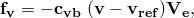

where 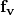 is the viscous force applied to the body; 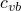 is the viscosity, given as the magnitude of the load;  is the velocity of the point on the body where the force is being applied;  is the velocity of the reference node; and  is the element volume.

Viscous body force loading can be thought of as mass-proportional damping in the sense that it gives a damping contribution proportional to the mass for an element if the coefficient  is chosen to be a small value multiplied by the material density  (see ["Material damping," Section 26.1.1](pt05ch26s01abm51.md)). Viscous body force loading provides an alternative way to define mass-proportional damping as a function of relative velocities and a step-dependent damping coefficient. 

| **Input File Usage: ** | Use the following option to define a viscous body force load: |
| --- | --- |
|  | ``` [*DLOAD](../key/key-link.md#usb-kws-hdload), REF NODE=*reference_node* *element number or element set*, VBF, *magnitude* ``` |

| **Abaqus/CAE Usage: ** | Viscous body force loads are not supported in Abaqus/CAE. |
| --- | --- |

#### Specifying stagnation body force loads in Abaqus/Explicit

Stagnation body force loads are defined by 

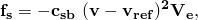

where 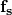 is the stagnation body force applied to the body; 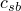 is the factor, given as the magnitude of the load;  is the velocity of the point on the body where the body force is being applied;  is the velocity of the reference node; and  is the element volume. The coefficient  should be very small to avoid excessive damping and a dramatic drop in the stable time increment.

| **Input File Usage: ** | Use the following option to define a stagnation body force load: |
| --- | --- |
|  | ``` [*DLOAD](../key/key-link.md#usb-kws-hdload), REF NODE=*reference_node* *element number or element set*, SBF, *magnitude* ``` |

| **Abaqus/CAE Usage: ** | Stagnation body force loads are not supported in Abaqus/CAE. |
| --- | --- |

#### Specifying gravity loading

Gravity loading (uniform acceleration in a fixed direction) is specified by using the gravity distributed load type and giving the gravity constant as the magnitude of the load. The direction of the gravity field is specified by giving the components of the gravity vector in the distributed load definition. Abaqus uses the user-specified material density (see ["Density," Section 21.2.1](pt05ch21s02abm01.md)), together with the magnitude and direction, to calculate the loading. The magnitude of the gravity load can vary with time during a step according to an amplitude definition, as described in ["Prescribed conditions: overview," Section 34.1.1](pt07ch34s01abo31.md). However, the direction of the gravity field is always applied at the beginning of the step and remains fixed during the step.

 You need not specify an element or an element set as is customary for the specification of other distributed loads. Abaqus/Standard and Abaqus/Explicit automatically collect all elements in the model that have mass contributions (including point mass elements but excluding rigid elements) in an element set called `_Whole_Model_Gravity_Elset` and apply the gravity loads to the elements in this element set. Abaqus/CFD applies the gravity loading to all user-defined elements.

In Abaqus/CFD gravity loading defines the gravity vector used with a Boussinesq-type body force in buoyancy driven flow. You must activate the energy equation for incompressible flow and define thermal expansion to specify the volumetric thermal expansion coefficient (see ["Incompressible fluid dynamic analysis," Section 6.6.2](pt03ch06s06aus48.md), and ["Computation of buoyancy forces in Abaqus/CFD" in "Thermal expansion," Section 26.1.2](pt05ch26s01abm52.md#usb-mat-cthermalbuoyancy)). Gravity loading can be used only in conjunction with the energy equation and will be ignored if used without the energy equation; general body forces can be defined for incompressible flow without the energy equation.

When gravity loading is used with substructures, the density must be defined and unit gravity load vectors must be calculated when the substructure is created (see ["Defining substructures," Section 10.1.2](pt04ch10s01aus59.md)). 

| **Input File Usage: ** | Use the following option to define a gravity load: |
| --- | --- |
|  | ``` [*DLOAD](../key/key-link.md#usb-kws-hdload) *element number or element set*, GRAV, *gravity constant*, *comp1, comp2, comp3* ``` |

| **Abaqus/CAE Usage: ** | Load module: **Create Load**: choose **Mechanical** for the **Category** and **Gravity** for the **Types for Selected Step** |
| --- | --- |

#### Specifying loads due to rotation of the model in Abaqus/Standard

Centrifugal loads, Coriolis forces, rotary acceleration, and rotordynamic loads can be applied in Abaqus/Standard by specifying the appropriate distributed load type in an element-based distributed load definition. These loading options are primarily intended for replicating dynamic loads while performing analyses other than implicit dynamics using direct integration (["Dynamic stress/displacement analysis," Section 6.3](pt03ch06s03.md)). In an implicit dynamic procedure inertia loads due to rotations come about naturally due to the equations of motion. Applying distributed centrifugal, Coriolis, rotary acceleration, and rotordynamic loads in an implicit dynamic analysis may lead to non-physical loads and should be used carefully.

##### Centrifugal loads

Centrifugal load magnitudes can be specified as , where  is the angular velocity in radians per time. Abaqus/Standard uses the specified material density (see ["Density," Section 21.2.1](pt05ch21s02abm01.md)), together with the load magnitude and the axis of rotation, to calculate the loading. Alternatively, a centrifugal load magnitude can be given as , where  is the material density (mass per unit volume) for solid or shell elements or the mass per unit length for beam elements and  is the angular velocity in radians per time. This type of centrifugal load formulation does not account for large volume changes. The two centrifugal load types will produce slightly different local results for first-order elements;  uses a consistent mass matrix, and  uses a lumped mass matrix in calculating the load forces and load stiffnesses.

The magnitude of the centrifugal load can vary with time during a step according to an amplitude definition, as described in ["Prescribed conditions: overview," Section 34.1.1](pt07ch34s01abo31.md). However, the position and orientation of the axis around which the structure rotates, which is defined by giving a point on the axis and the axis direction, are always applied at the beginning of the step and remain fixed during the step. 

| **Input File Usage: ** | Use either of the following options to define a centrifugal load: |
| --- | --- |
|  | ``` [*DLOAD](../key/key-link.md#usb-kws-hdload) *element number or element set*, CENTRIF, , *coord1, coord2, coord3, comp1,* *comp2, comp3* [*DLOAD](../key/key-link.md#usb-kws-hdload) *element number or element set*, CENT, , *coord1, coord2, coord3, comp1, * *comp2, comp3* ``` |

| **Abaqus/CAE Usage: ** | Load module: **Create Load**: choose **Mechanical** for the **Category** and **Rotational body force** for the **Types for Selected Step**: **Load effect: Centrifugal** |
| --- | --- |

##### Coriolis forces

Coriolis force is defined by specifying the Coriolis distributed load type and giving the load magnitude as , where  is the material density (mass per unit volume) for solid and shell elements or the mass per unit length for beam elements and  is the angular velocity in radians per time. The magnitude of the Coriolis load can vary with time during a step according to an amplitude definition, as described in ["Prescribed conditions: overview," Section 34.1.1](pt07ch34s01abo31.md). However, the position and orientation of the axis around which the structure rotates, which is defined by giving a point on the axis and the axis direction, are always applied at the beginning of the step and remain fixed during the step.

In a static analysis Abaqus computes the translational velocity term in the Coriolis loading by dividing the incremental displacement by the current time increment.

The Coriolis load formulation does not account for large volume changes.

| **Input File Usage: ** | Use the following option to define a Coriolis load: |
| --- | --- |
|  | ``` [*DLOAD](../key/key-link.md#usb-kws-hdload) *element number or element set*, CORIO, , *coord1, coord2, coord3, * *comp1, comp2, comp3* ``` |

| **Abaqus/CAE Usage: ** | Load module: **Create Load**: choose **Mechanical** for the **Category** and **Coriolis force** for the **Types for Selected Step** |
| --- | --- |

##### Rotary acceleration loads

Rotary acceleration loads are defined by specifying the rotary acceleration distributed load type and giving the rotary acceleration magnitude, , in radians/time2, which includes any precessional motion effects. The axis of rotary acceleration must be defined by giving a point on the axis and the axis direction. Abaqus/Standard uses the specified material density (see ["Density," Section 21.2.1](pt05ch21s02abm01.md)), together with the rotary acceleration magnitude and axis of rotary acceleration, to calculate the loading. The magnitude of the load can vary with time during a step according to an amplitude definition, as described in ["Prescribed conditions: overview," Section 34.1.1](pt07ch34s01abo31.md). However, the position and orientation of the axis around which the structure rotates are always applied at the beginning of the step and remain fixed during the step.

Rotary acceleration loads are not applicable to axisymmetric elements.

| **Input File Usage: ** | Use the following option to define a rotary acceleration load: |
| --- | --- |
|  | ``` [*DLOAD](../key/key-link.md#usb-kws-hdload) *element number or element set*, ROTA, , *coord1, coord2, coord3, * *comp1, comp2, comp3* ``` |

| **Abaqus/CAE Usage: ** | Load module: **Create Load**: choose **Mechanical** for the **Category** and **Rotational body force** for the **Types for Selected Step**: **Load effect: Rotary acceleration** |
| --- | --- |

##### Specifying general rigid-body acceleration loading in Abaqus/Standard

General rigid-body acceleration loading can be specified in Abaqus/Standard by using a combination of the gravity, centrifugal (), and rotary acceleration load types.

##### Rotordynamic loads in a fixed reference frame

Rotordynamic loads can be used to study the vibrational response of three-dimensional models of axisymmetric structures, such as a flywheel in a hybrid energy storage system, that are spinning about their axes of symmetry in a fixed reference frame (see [Genta, 2005](pt07ch34s04aus122.md#ploaddistributed-genta)). This is in contrast to the centrifugal loads, Coriolis forces, and rotary acceleration loads discussed above, which are formulated in a rotating frame. Rotordynamic loads are, therefore, not intended to be used in conjunction with these other dynamic load types.

The intended workflow for rotordynamic loads is to define the load in a nonlinear static step to establish the centrifugal load effects and load stiffness terms associated with a spinning body. The nonlinear static step can then be followed by a sequence of linear dynamic analyses such as complex eigenvalue extraction and/or a subspace or direct-solution steady-state dynamic analysis to study complex dynamic behaviors (induced by gyroscopic moments) such as critical speeds, unbalanced responses, and whirling phenomena in rotating structures. You do not need to redefine the rotordynamic load in the linear dynamic analyses—the load definition is carried over from the nonlinear static step. The contribution of the gyroscopic matrices in the linear dynamic steps is unsymmetric; therefore, you must use unsymmetric matrix storage as described in ["Defining an analysis," Section 6.1.2](pt03ch06s01abo05.md), during these steps.

Rotordynamic loads are intended only for three-dimensional models of axisymmetric bodies; you must ensure that this modeling assumption is met. Rotordynamic loads are supported for all three-dimensional continuum and cylindrical elements, shell elements, membrane elements, cylindrical membrane elements, beam elements, and rotary inertia elements. The spinning axis defined as part of the load must be the axis of symmetry for the structure. Therefore, beam elements must be aligned with the symmetry axis. In addition, one of the principal directions of each loaded rotary inertia element must be aligned with the symmetry axis, and the inertia components of the rotary inertia elements must be symmetric about this axis. Multiple spinning structures spinning about different axes can be modeled in the same step. The spinning structures can also be connected to non-axisymmetric, non-rotating structures (such as bearings or support structures). 

Rotordynamic loads are defined by specifying the angular velocity, , in radians per time. The magnitude of the rotordynamic load can vary with time during a step according to an amplitude definition, as described in ["Prescribed conditions: overview," Section 34.1.1](pt07ch34s01abo31.md). However, the position and orientation of the axis around which the structure rotates, which is defined by giving a point on the axis and the axis direction, are always applied at the beginning of the step and remain fixed during the step.

| **Input File Usage: ** | Use the following option to define a rotordynamic load: |
| --- | --- |
|  | ``` [*DLOAD](../key/key-link.md#usb-kws-hdload) *element number or element set*, ROTDYNF, , *coord1, coord2, coord3, * *comp1, comp2, comp3* ``` |

| **Abaqus/CAE Usage: ** | Element-based rotordynamic loads are not supported in Abaqus/CAE. |
| --- | --- |

#### Specifying porous drag body force load in Abaqus/CFD

In Abaqus/CFD porous drag loading defines the porous drag body forces (Darcy and inertial drag forces) in flow through porous media (see ["Incompressible fluid dynamic analysis," Section 6.6.2](pt03ch06s06aus48.md)). If the porous drag body forces are activated, permeability of the medium must be defined (see ["Permeability," Section 26.6.2](pt05ch26s06abm64.md)). In addition, if the energy equation for incompressible flow is activated for porous flow problems involving heat transfer, the properties of both the solid and fluid phases of the porous medium must be defined using a fluid section definition. Porous drag loads are defined by specifying the dimensionless porosity,  (ratio of the fluid to the total volume of the porous medium).

| **Input File Usage: ** | Use the following option to define a porous drag body force load: |
| --- | --- |
|  | ``` [*DLOAD](../key/key-link.md#usb-kws-hdload) *element number or element set*, PDBF, *porosity* ``` |

| **Abaqus/CAE Usage: ** | Load module: **Create Load**: choose **Fluid** for the **Category** and **Porous drag body force** for the **Types for Selected Step** |
| --- | --- |

### Surface tractions and pressure loads

General or shear surface tractions and pressure loads can be applied in Abaqus as element-based or surface-based distributed loads. The units of these loads are force per unit area.

[Table 34.4.3--3](pt07ch34s04aus122.md#surfaceloadlabels) lists all of the distributed surface load types that are available in Abaqus, along with the corresponding load type labels. [Part VI, "Elements](pt06.md),” lists the distributed surface load types that are available for particular elements and the Abaqus/CAE load support for each load type. For some element-based loads you must identify the face of the element upon which the load is prescribed in the load type label (for example, P*n* or P*n*NU for continuum elements).

**Table 34.4.3–3** Distributed surface load types.
| Load description | Load type label for element-based loads | Load type label for surface-based loads | Abaqus/CAE load type |
| --- | --- | --- | --- |
| General surface traction | TRVEC*n*, TRVEC | TRVEC | **Surface traction** |
| Shear surface traction | TRSHR*n*, TRSHR | TRSHR |
| Nonuniform general surface traction | TRVEC*n*NU, TRVECNU | TRVECNU | **Surface traction** (surface-based loads only) |
| Nonuniform shear surface traction | TRSHR*n*NU, TRSHRNU | TRSHRNU |
| Pressure | P*n*, P | P | **Pressure** |
| Nonuniform pressure | P*n*NU, PNU | PNU | **Pressure** (surface-based loads only) |
| Hydrostatic pressure (available only in Abaqus/Standard) | HP*n*, HP | HP |
| Viscous pressure (available only in Abaqus/Explicit) | VP*n*, VP | VP |
| Stagnation pressure (available only in Abaqus/Explicit) | SP*n*, SP | SP |
| Hydrostatic internal and external pressure (only for PIPE and ELBOW elements ) | HPI, HPE | N/A | **Pipe pressure** |
| Uniform internal and external pressure (only for PIPE and ELBOW elements ) | PI, PE | N/A |
| Nonuniform internal and external pressure (only for PIPE and ELBOW elements ) | PINU, PENU | N/A |

#### Follower surface loads

By definition, the line of action of a *follower* surface load rotates with the surface in a geometrically nonlinear analysis. This is in contrast to a *non-follower* load, which always acts in a fixed global direction. 

With the exception of general surface tractions, all the distributed surface loads listed in [Table 34.4.3--3](pt07ch34s04aus122.md#surfaceloadlabels) are modeled as follower loads. The hydrostatic and viscous pressures listed in [Table 34.4.3--3](pt07ch34s04aus122.md#surfaceloadlabels) always act normal to the surface in the current configuration, the shear tractions always act tangent to the surface in the current configuration, and the internal and external pipe pressures follow the motion of the pipe elements.

General surface tractions can be specified to be follower or non-follower loads. There is no difference between a follower and a non-follower load in a geometrically linear analysis since the configuration of the body remains fixed. The difference between a follower and non-follower general surface traction is illustrated in the next section through an example.

| **Input File Usage: ** | Use one of the following options to define general surface tractions as follower loads (the default): |
| --- | --- |
|  | ``` [*DLOAD](../key/key-link.md#usb-kws-hdload), FOLLOWER=YES [*DSLOAD](../key/key-link.md#usb-kws-hdsload), FOLLOWER=YES ``` Use one of the following options to define general surface tractions as non-follower loads: ``` [*DLOAD](../key/key-link.md#usb-kws-hdload), FOLLOWER=NO [*DSLOAD](../key/key-link.md#usb-kws-hdsload), FOLLOWER=NO ``` |

| **Abaqus/CAE Usage: ** | Load module: **Create Load**: choose **Mechanical** for the **Category** and **Surface traction** for the **Types for Selected Step**: **Traction: General**, toggle on or off **Follow rotation** |
| --- | --- |

#### Specifying general surface tractions

General surface tractions allow you to specify a surface traction, , acting on a surface *S*. The resultant load, , is computed by integrating  over *S*:


 where   is the magnitude and 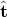 is the direction of the load. To define a general surface traction, you must specify both a load magnitude, , and the direction of the load with respect to the reference configuration, . The magnitude and direction can also be specified in user subroutine [`UTRACLOAD`](../sub/sub-link.md#sub-xsl-utracload). The specified traction directions are normalized by Abaqus and, thus, do not contribute to the magnitude of the load:

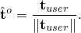

| **Input File Usage: ** | Use one of the following options to define a general surface traction: |
| --- | --- |
|  | ``` [*DLOAD](../key/key-link.md#usb-kws-hdload) *element number or element set*, *load type label*, *magnitude*, *direction components* ``` where *load type label* is TRVEC*n*, TRVEC, TRVEC*n*NU, or TRVECNU. ``` [*DSLOAD](../key/key-link.md#usb-kws-hdsload) *surface name*, TRVEC or TRVECNU, *magnitude*, *direction components* ``` |

| **Abaqus/CAE Usage: ** | Use the following input to define an element-based general surface traction: |
| --- | --- |
|  | Load module: **Create Load**: choose **Mechanical** for the **Category** and **Surface traction** for the **Types for Selected Step**: **Traction: General**, **Distribution**: select an analytical field Use the following input to define a surface-based general surface traction: Load module: **Create Load**: choose **Mechanical** for the **Category** and **Surface traction** for the **Types for Selected Step**: **Traction: General**, **Distribution**: **Uniform** or **User-defined** Nonuniform element-based general surface traction is not supported in Abaqus/CAE. |

##### Defining the direction vector with respect to a local coordinate system

By default, the components of the traction vector are specified with respect to the global directions. You can also refer to a local coordinate system (see ["Orientations," Section 2.2.5](pt01ch02s02aus15.md)) for the direction components of these tractions. See ["Examples: using a local coordinate system to define shear directions](pt07ch34s04aus122.md#usb-prc-ploaddistributed-localcsys)” below for an example of a traction load defined with respect to a local coordinate system. When using local coordinate systems for tractions applied to two-dimensional solid elements, you must ensure that the nonzero components of the loads are applied only in the *X*- and *Y*-directions. Tractions loads in the third direction are not supported (*Z*-direction for plane strain and plane stress elements, -direction for axisymmetric elements). 

| **Input File Usage: ** | Use one of the following options to specify a local coordinate system: |
| --- | --- |
|  | ``` [*DLOAD](../key/key-link.md#usb-kws-hdload), ORIENTATION=*name* [*DSLOAD](../key/key-link.md#usb-kws-hdsload), ORIENTATION=*name* ``` |

| **Abaqus/CAE Usage: ** | Load module: **Create Load**: choose **Mechanical** for the **Category** and **Surface traction** for the **Types for Selected Step**: select **CSYS: Picked** and click **Edit** to pick a local coordinate system, or select **CSYS: User-defined** to enter the name of a user subroutine that defines a local coordinate system |
| --- | --- |

##### Rotation of the traction vector direction

The traction load acts in the fixed direction  in a geometrically linear analysis or if a non-follower load is specified in a geometrically nonlinear analysis (which includes a perturbation step about a geometrically nonlinear base state). 

If a follower load is specified in a geometrically nonlinear analysis, the traction load rotates rigidly with the surface using the following algorithm. The reference configuration traction vector, , is decomposed by Abaqus into two components: a normal component, 


 and a tangential component, 


 where  is the unit reference surface normal and  is the unit projection of  onto the reference surface. The applied traction in the current configuration is then computed as


where  is the normal to the surface in the current configuration and  is the image of  rotated onto the current surface; i.e., , where 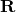 is the standard rotation tensor obtained from the polar decomposition of the local two-dimensional surface deformation gradient 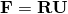. 

##### Examples: follower and non-follower tractions

The following two examples illustrate the difference between applying follower and non-follower tractions in a geometrically nonlinear analysis. Both examples refer to a single 4-node plane strain element (element 1). In Step 1 of the first example a follower traction load is applied to face 1 of element 1, and a non-follower traction load is applied to face 2 of element 1. The element is rotated rigidly 90 counterclockwise in Step 1 and then another 90 in Step 2. As illustrated in [Figure 34.4.3--1](pt07ch34s04aus122.md#traction-example1), the follower traction rotates with face 1, while the non-follower traction on face 2 always acts in the global *x*-direction.

**Figure 34.4.3–1** Follower and non-follower traction loads in a geometrically nonlinear analysis, load applied in Step 1: (a) beginning of Step 1; (b) end of Step 1, beginning of Step 2; (c) end of Step 2.


```
[*STEP](../key/key-link.md#usb-kws-hstep), NLGEOM
 Step 1 - Rotate square 90 degrees
...
[*DLOAD](../key/key-link.md#usb-kws-hdload), FOLLOWER=YES
 1, TRVEC1, 1., 0., -1., 0.
[*DLOAD](../key/key-link.md#usb-kws-hdload), FOLLOWER=NO
 1, TRVEC2, 1., 1., 0., 0.
[*END STEP](../key/key-link.md#usb-kws-hendstep)
[*STEP](../key/key-link.md#usb-kws-hstep), NLGEOM
 Step 2 - Rotate square another 90 degrees
...
[*END STEP](../key/key-link.md#usb-kws-hendstep)
```

In the second example the element is rotated 90 counterclockwise with no load applied in Step 1. In Step 2 a follower traction load is applied to face 1, and a non-follower traction load is applied to face 2. The element is then rotated rigidly by another 90. The direction of the follower load is specified with respect to the original configuration. As illustrated in [Figure 34.4.3--2](pt07ch34s04aus122.md#traction-example2), the follower traction rotates with face 1, while the non-follower traction on face 2 always acts in the global *x*-direction.

**Figure 34.4.3–2** Follower and non-follower traction loads in a geometrically nonlinear analysis, load applied in Step 2: (a) beginning of Step 1; (b) end of Step 1, beginning of Step 2; (c) end of Step 2.


```
[*STEP](../key/key-link.md#usb-kws-hstep), NLGEOM
 Step 1 - Rotate square 90 degrees
...
[*END STEP](../key/key-link.md#usb-kws-hendstep)
[*STEP](../key/key-link.md#usb-kws-hstep), NLGEOM
 Step 2 - Rotate square another 90 degrees
[*DLOAD](../key/key-link.md#usb-kws-hdload), FOLLOWER=YES
 1, TRVEC1, 1., 0., -1., 0.
[*DLOAD](../key/key-link.md#usb-kws-hdload), FOLLOWER=NO
 1, TRVEC2, 1., 1., 0., 0.
...
[*END STEP](../key/key-link.md#usb-kws-hendstep)
```

#### Specifying shear surface tractions

Shear surface tractions allow you to specify a surface force per unit area, , that acts tangent to a surface *S*. The resultant load, , is computed by integrating  over *S*:

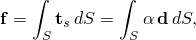

where  is the magnitude and  is a unit vector along the direction of the load. To define a shear surface traction, you must provide both the magnitude, , and a direction, , for the load. The magnitude and direction vector can also be specified in user subroutine [`UTRACLOAD`](../sub/sub-link.md#sub-xsl-utracload). 

Abaqus modifies the traction direction by first projecting the user-specified vector, , onto the surface in the *reference* configuration, 

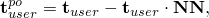

where  is the reference surface normal. The specified traction is applied along the computed traction direction  tangential to the surface: 

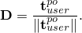

Consequently, a shear traction load is not applied at any point where  is normal to the reference surface. 

The shear traction load acts in the fixed direction 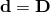 in a geometrically linear analysis. In a geometrically nonlinear analysis (which includes a perturbation step about a geometrically nonlinear base state), the shear traction vector will rotate rigidly; i.e., ,  where  is the standard rotation tensor obtained from the polar decomposition of the local two-dimensional surface deformation gradient . 

| **Input File Usage: ** | Use one of the following options to define a shear surface traction: |
| --- | --- |
|  | ``` [*DLOAD](../key/key-link.md#usb-kws-hdload) *element number or element set*, *load type label*, *magnitude*, *direction components* ``` where *load type label* is TRSHR*n*, TRSHR, TRSHR*n*NU, or TRSHRNU. ``` [*DSLOAD](../key/key-link.md#usb-kws-hdsload) *surface name*, TRSHR or TRSHRNU, *magnitude*, *direction components* ``` |

| **Abaqus/CAE Usage: ** | Use the following input to define an element-based shear surface traction: |
| --- | --- |
|  | Load module: **Create Load**: choose **Mechanical** for the **Category** and **Surface traction** for the **Types for Selected Step**: **Traction: Shear**, **Distribution**: select an analytical field Use the following input to define a surface-based general surface traction: Load module: **Create Load**: choose **Mechanical** for the **Category** and **Surface traction** for the **Types for Selected Step**: **Traction: Shear**, **Distribution**: **Uniform** or **User-defined** Nonuniform element-based shear surface traction is not supported in Abaqus/CAE. |

##### Defining the direction vector with respect to a local coordinate system

By default, the components of the shear traction vector are specified with respect to the global directions. You can also refer to a local coordinate system (see ["Orientations," Section 2.2.5](pt01ch02s02aus15.md)) for the direction components of these tractions. 

| **Input File Usage: ** | Use one of the following options to specify a local coordinate system: |
| --- | --- |
|  | ``` [*DLOAD](../key/key-link.md#usb-kws-hdload), ORIENTATION=*name* [*DSLOAD](../key/key-link.md#usb-kws-hdsload), ORIENTATION=*name* ``` |

| **Abaqus/CAE Usage: ** | Load module: **Create Load**: choose **Mechanical** for the **Category** and **Surface traction** for the **Types for Selected Step**: select **CSYS: Picked** and click **Edit** to pick a local coordinate system, or select **CSYS: User-defined** to enter the name of a user subroutine that defines a local coordinate system |
| --- | --- |

##### Examples: using a local coordinate system to define shear directions

It is sometimes convenient to give shear and general traction directions with respect to a local coordinate system. The following two examples illustrate the specification of the direction of a shear traction on a cylinder using global coordinates in one case and a local cylindrical coordinate system in the other case. The axis of symmetry of the cylinder coincides with the global *z*-axis. A surface named `SURFA` has been defined on the outside of the cylinder.

In the first example the direction of the shear traction, 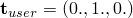, is given in global coordinates. The sense of the resulting shear tractions using global coordinates is shown in [Figure 34.4.3--3](pt07ch34s04aus122.md#sheartract-orient)(a).

**Figure 34.4.3–3** Shear tractions specified using global coordinates (a) and a local cylindrical coordinate system (b).

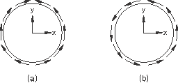

```
[*STEP](../key/key-link.md#usb-kws-hstep)
 Step 1 - Specify shear directions in global coordinates
...
[*DSLOAD](../key/key-link.md#usb-kws-hdsload)
 SURFA, TRSHR, 1., 0., 1., 0.
...
[*END STEP](../key/key-link.md#usb-kws-hendstep)
```

In the second example the direction of the shear traction, , is given with respect to a local cylindrical coordinate system whose axis coincides with the axis of the cylinder. The sense of the resulting shear tractions using the local cylindrical coordinate system is shown in [Figure 34.4.3--3](pt07ch34s04aus122.md#sheartract-orient)(b).

```
[*ORIENTATION](../key/key-link.md#usb-kws-morientation), NAME=CYLIN, SYSTEM=CYLINDRICAL
 0., 0., 0., 0., 0., 1.
...
[*STEP](../key/key-link.md#usb-kws-hstep)
 Step 1 - Specify shear directions in local cylindrical coordinates
...
[*DSLOAD](../key/key-link.md#usb-kws-hdsload), ORIENTATION=CYLIN
 SURFA, TRSHR, 1., 0., 1., 0.
...
[*END STEP](../key/key-link.md#usb-kws-hendstep)
```

#### Resultant loads due to surface tractions

You can choose to integrate surface tractions over the current or the reference configuration by specifying whether or not a constant resultant should be maintained.

In general, the constant resultant method is best suited for cases where the magnitude of the resultant load should not vary with changes in the surface area. However, it is up to you to decide which approach is best for your analysis. An example of an analysis using a constant resultant can be found in ["Distributed traction and edge loads," Section 1.4.18 of the Abaqus Verification Guide](../ver/ver-link.md#ver-elm-tractandedgeloads).

##### Choosing not to have a constant resultant

If you choose not to have a constant resultant, the traction vector is integrated over the surface in the current configuration, a surface that in general deforms in a geometrically nonlinear analysis. By default, all surface tractions are integrated over the surface in the current configuration.

| **Input File Usage: ** | Use one of the following options: |
| --- | --- |
|  | ``` [*DLOAD](../key/key-link.md#usb-kws-hdload), CONSTANT RESULTANT=NO [*DSLOAD](../key/key-link.md#usb-kws-hdsload), CONSTANT RESULTANT=NO ``` |

| **Abaqus/CAE Usage: ** | Load module: **Create Load**: choose **Mechanical** for the **Category** and **Surface traction** for the **Types for Selected Step**: **Traction is defined per unit deformed area** |
| --- | --- |

##### Maintaining a constant resultant

If you choose to have a constant resultant, the traction vector is integrated over the surface in the reference configuration and then held constant.

| **Input File Usage: ** | Use one of the following options: |
| --- | --- |
|  | ``` [*DLOAD](../key/key-link.md#usb-kws-hdload), CONSTANT RESULTANT=YES [*DSLOAD](../key/key-link.md#usb-kws-hdsload), CONSTANT RESULTANT=YES ``` |

| **Abaqus/CAE Usage: ** | Load module: **Create Load**: choose **Mechanical** for the **Category** and **Surface traction** for the **Types for Selected Step**: **Traction is defined per unit undeformed area** |
| --- | --- |

##### Example

The constant resultant method has certain advantages when a traction is used to model a distributed load with a known constant resultant. Consider the case of modeling a uniform dead load, magnitude *p*, acting on a flat plate whose normal is in the -direction in a geometrically nonlinear analysis ([Figure 34.4.3--4](pt07ch34s04aus122.md#dead-tract-load)). 

**Figure 34.4.3–4** Dead load on a flat plate.

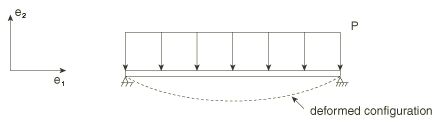

Such a model might be used to simulate a snow load on a flat roof. The snow load could be modeled as a distributed dead traction load . Let 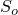 and *S* denote the total surface area of the plate in the reference and current configurations, respectively. With no constant resultant, the total integrated load on the plate, , is 

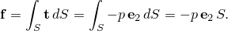

In this case a uniform traction leads to a resultant load that increases as the surface area of the plate increases, which is not consistent with a fixed snow load. With the constant resultant method, the total integrated load on the plate is 

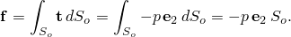

In this case a uniform traction leads to a resultant that is equal to the pressure times the surface area in the reference configuration, which is more consistent with the problem at hand.

#### Specifying pressure loads

Distributed pressure loads can be specified on any two-dimensional, three-dimensional, or axisymmetric elements. Hydrostatic pressure loads can be specified in Abaqus/Standard on two-dimensional, three-dimensional, and axisymmetric elements. Viscous and stagnation pressure loads can be specified in Abaqus/Explicit on any elements.

##### Distributed pressure loads

Distributed pressure loads can be specified on any elements. For beam elements, a positive applied pressure results in a force vector acting along the particular local direction of the section or a global direction, whichever is specified.  For conventional shell elements, the force vector points along the element SPOS normal.  For continuum solid or a continuum shell elements with the distributed load on an explicitly identified facet,  the force vector acts against the  outward normal of that facet. Distributed pressure loads are not supported for pipe and elbow elements.

  Distributed pressure loads can be specified on a surface formed over elements; a positive applied pressure results in a force vector acting against the local surface normal. 

| **Input File Usage: ** | Use one of the following options to define a pressure load: |
| --- | --- |
|  | ``` [*DLOAD](../key/key-link.md#usb-kws-hdload) *element number or element set*, *load type label*, *magnitude* ``` where *load type label* is P*n*, P, P*n*NU, or PNU. ``` [*DSLOAD](../key/key-link.md#usb-kws-hdsload) *surface name*, P or PNU, *magnitude* ``` |

| **Abaqus/CAE Usage: ** | Use the following input to define an element-based pressure load: |
| --- | --- |
|  | Load module: **Create Load**: choose **Mechanical** for the **Category** and **Pressure** for the **Types for Selected Step**: **Distribution**: select an analytical field or a discrete field Use the following input to define a surface-based pressure load: Load module: **Create Load**: choose **Mechanical** for the **Category** and **Pressure** for the **Types for Selected Step**: **Uniform** or **User-defined** Nonuniform element-based pressure loads are not supported in Abaqus/CAE. |

##### Hydrostatic pressure loads on two-dimensional, three-dimensional, and axisymmetric elements in Abaqus/Standard

To define hydrostatic pressure in Abaqus/Standard, give the *Z*-coordinates of the zero pressure level (point *a* in [Figure 34.4.3--5](pt07ch34s04aus122.md#pload-hydrostatic)) and the level at which the hydrostatic pressure is defined (point *b* in [Figure 34.4.3--5](pt07ch34s04aus122.md#pload-hydrostatic)) in an element-based or surface-based distributed load definition. For levels above the zero pressure level, the hydrostatic pressure is zero.

**Figure 34.4.3–5** Hydrostatic pressure distribution.


In planar elements the hydrostatic head is in the *Y*-direction; for axisymmetric elements the *Z*-direction is the second coordinate.

| **Input File Usage: ** | Use one of the following options to define a hydrostatic pressure load: |
| --- | --- |
|  | ``` [*DLOAD](../key/key-link.md#usb-kws-hdload) *element number or element set*, HP*n* or HP, *magnitude*, *Z**-coordinate of point **a*, *Z**-coordinate of point **b* [*DSLOAD](../key/key-link.md#usb-kws-hdsload) *surface name*, HP, *magnitude*, *Z**-coordinate of point **a*, *Z**-coordinate of point **b* ``` |

| **Abaqus/CAE Usage: ** | Use the following input to define a surface-based hydrostatic pressure load: |
| --- | --- |
|  | Load module: **Create Load**: choose **Mechanical** for the **Category** and **Pressure** for the **Types for Selected Step**: **Distribution: Hydrostatic** Element-based hydrostatic pressure loads are not supported in Abaqus/CAE. |

##### Viscous pressure loads in Abaqus/Explicit

Viscous pressure loads are defined by 

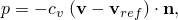

where *p* is the pressure applied to the body;  is the viscosity, given as the magnitude of the load;  is the velocity of the point on the surface where the pressure is being applied;  is the velocity of the reference node; and  is the unit outward normal to the element at the same point.

Viscous pressure loading is most commonly applied in structural problems when you want to damp out dynamic effects and, thus, reach static equilibrium in a minimal number of increments. A common example is the determination of springback in a sheet metal product after forming, in which case a viscous pressure would be applied to the faces of shell elements defining the sheet metal. An appropriate choice for the value of  is important for using this technique effectively.

To compute , consider the infinite continuum elements described in ["Infinite elements," Section 28.3.1](pt06ch28s03alm03.md). In explicit dynamics those elements achieve an infinite boundary condition by applying a viscous normal pressure where the coefficient  is given by ;  is the density of the material at the surface, and  is the value of the dilatational wave speed in the material (the infinite continuum elements also apply a viscous shear traction). For an isotropic, linear elastic material


where  and  are Lam's constants, *E* is Young's modulus, and  is Poisson's ratio. This choice of the viscous pressure coefficient represents a level of damping in which pressure waves crossing the free surface are absorbed with no reflection of energy back into the interior of the finite element mesh.

For typical structural problems it is not desirable to absorb all of the energy (as is the case in the infinite elements). Typically  is set equal to a small percentage (perhaps 1 or 2 percent) of  as an effective way of minimizing ongoing dynamic effects. The  coefficient should have a positive value.

| **Input File Usage: ** | Use one of the following options to define a viscous pressure load: |
| --- | --- |
|  | ``` [*DLOAD](../key/key-link.md#usb-kws-hdload), REF NODE=*reference_node* *element number or element set*, VP*n* or VP, *magnitude* [*DSLOAD](../key/key-link.md#usb-kws-hdsload), REF NODE=*reference_node* *surface name*, VP, *magnitude* ``` |

| **Abaqus/CAE Usage: ** | Use the following input to define a surface-based viscous pressure load: |
| --- | --- |
|  | Load module: **Create Load**: choose **Mechanical** for the **Category** and **Pressure** for the **Types for Selected Step**: **Distribution: Viscous**, toggle on or off **Determine velocity from reference point** Element-based viscous pressure loads are not supported in Abaqus/CAE. |

##### Stagnation pressure loads in Abaqus/Explicit

Stagnation pressure loads are defined by 

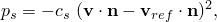

where 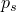 is the stagnation pressure applied to the body;  is the factor, given as the magnitude of the load;  is the velocity of the point on the surface where the pressure is being applied;  is the unit outward normal to the element at the same point; and  is the velocity of the reference node. The coefficient  should be very small to avoid excessive damping and a dramatic drop in the stable time increment.

| **Input File Usage: ** | Use one of the following options to define a stagnation pressure load: |
| --- | --- |
|  | ``` [*DLOAD](../key/key-link.md#usb-kws-hdload), REF NODE=*reference_node* *element number or element set*, SP*n* or SP, *magnitude* [*DSLOAD](../key/key-link.md#usb-kws-hdsload), REF NODE=*reference_node* *element number or element set*, SP, *magnitude* ``` |

| **Abaqus/CAE Usage: ** | Use the following input to define a surface-based stagnation pressure load: |
| --- | --- |
|  | Load module: **Create Load**: choose **Mechanical** for the **Category** and **Pressure** for the **Types for Selected Step**: **Distribution: Stagnation**, toggle on or off **Determine velocity from reference point** Element-based stagnation pressure loads are not supported in Abaqus/CAE. |

##### Pressure on pipe and elbow elements

You can specify external pressure, internal pressure, external hydrostatic pressure, or internal hydrostatic pressure on pipe or elbow elements. When pressure loads are applied, the effective outer or inner diameter must be specified in the element-based distributed load definition.

The loads resulting from the pressure on the ends of the element are included: Abaqus assumes a closed-end condition. Closed-end conditions correctly model the loading at pipe intersections, tight bends, corners, and cross-section changes; in straight sections and smooth bends the end loads of adjacent elements cancel each other precisely. If an open-end condition is to be modeled, a compensating point load should be added at the open end. A case where such an end load must be applied occurs if a pressurized pipe is modeled with a mixture of pipe and beam elements. In that case closed-end conditions generate a physically non-existing force at the transition between pipe and beam elements. Such mixed modeling of a pipe is not recommended. 

For pipe elements subjected to pressure loading, the effective axial force due to the pressure loads can be obtained by requesting output variable ESF1 (see ["Beam element library," Section 29.3.8](pt06ch29s03ael14.md)).

| **Input File Usage: ** | Use the following option to define an external pressure load on pipe or elbow elements: |
| --- | --- |
|  | ``` [*DLOAD](../key/key-link.md#usb-kws-hdload) *element number or element set*, PE or PENU, *magnitude*, *effective outer diameter* ``` Use the following option to define an internal pressure load on pipe or elbow elements: ``` [*DLOAD](../key/key-link.md#usb-kws-hdload) *element number or element set*, PI or PINU, *magnitude*, *effective inner diameter* ``` Use the following option to define an external hydrostatic pressure load on pipe or elbow elements: ``` [*DLOAD](../key/key-link.md#usb-kws-hdload) *element number or element set*, HPE, *magnitude*, *effective outer diameter* ``` Use the following option to define an internal hydrostatic pressure load on pipe or elbow elements: ``` [*DLOAD](../key/key-link.md#usb-kws-hdload) *element number or element set*, HPI, *magnitude*, *effective inner diameter* ``` |

| **Abaqus/CAE Usage: ** | Use the following input to define an external or internal pressure load on pipe or elbow elements: |
| --- | --- |
|  | Load module: **Create Load**: choose **Mechanical** for the **Category** and **Pipe pressure** for the **Types for Selected Step**: **Side**: **External** or **Internal**, **Distribution**: **Uniform**, **User-defined**, or select an analytical field Use the following input to define an external or internal hydrostatic pressure load on pipe or elbow elements: Load module: **Create Load**: choose **Mechanical** for the **Category** and **Pipe pressure** for the **Types for Selected Step**: **Side**: **External** or **Internal**, **Distribution**: **Hydrostatic** |

#### Defining distributed surface loads on plane stress elements

Plane stress theory assumes that the volume of a plane stress element remains constant in a large-strain analysis. When a distributed surface load is applied to an edge of plane stress elements, the current length and orientation of the edge are considered in the load distribution, but the current thickness is not; the original thickness is used.

This limitation can be circumvented only by using three-dimensional elements at the edge so that a change in thickness upon loading is recognized; suitable equation constraints (["Linear constraint equations," Section 35.2.1](pt08ch35s02aus129.md)) would be required to make the in-plane displacements on the two faces of these elements equal. Three-dimensional elements along an edge can be connected to interior shell elements by using a shell-to-solid coupling constraint (see ["Shell-to-solid coupling," Section 35.3.3](pt08ch35s03aus134.md), for details).

### Edge tractions and moments on shell elements and line loads on beam elements

Distributed edge tractions (general, shear, normal, or transverse) and edge moments can be applied to shell elements in Abaqus as element-based or surface-based distributed loads. The units of an edge traction are force per unit length. The units of an edge moment are torque per unit length. References to local coordinate systems are ignored for all edge tractions and moments except general edge tractions.

Distributed line loads can be applied to beam elements in Abaqus as element-based distributed loads. The units of a line load are force per unit length.

[Table 34.4.3--4](pt07ch34s04aus122.md#edgeloadlabels) lists all of the distributed edge and line load types that are available in Abaqus, along with the corresponding load type labels. [Part VI, "Elements](pt06.md),” lists the distributed edge and line load types that are available for particular elements and the Abaqus/CAE load support for each load type. For element-based loads applied to shell elements, you must identify the edge of the element upon which the load is prescribed in the load type label (for example, EDLD*n* or EDLD*n*NU).

#### Follower edge and line loads

By definition, the line of action of a *follower* edge or line load rotates with the edge or line in a geometrically nonlinear analysis. This is in contrast to a *non-follower* load, which always acts in a fixed global direction. 

With the exception of general edge tractions on shell elements and the forces per unit length in the global directions on beam elements, all the edge and line loads listed in [Table 34.4.3--4](pt07ch34s04aus122.md#edgeloadlabels) are modeled as follower loads. The normal, shear, and transverse edge loads listed in [Table 34.4.3--4](pt07ch34s04aus122.md#edgeloadlabels) act in the normal, shear, and transverse directions, respectively, in the current configuration (see [Figure 34.4.3--6](pt07ch34s04aus122.md#edge-loads)). The edge moment always acts about the shell edge in the current configuration. The forces per unit length in the local beam directions rotate with the beam elements.

**Table 34.4.3–4** Distributed edge load types.
| Load description | Load type label for element-based loads | Load type label for surface-based loads | Abaqus/CAE load type |
| --- | --- | --- | --- |
| General edge traction | EDLD*n* | EDLD | **Shell edge load** |
| Normal edge traction | EDNOR*n* | EDNOR |
| Shear edge traction | EDSHR*n* | EDSHR |
| Transverse edge traction | EDTRA*n* | EDTRA |
| Edge moment | EDMOM*n* | EDMOM |
| Nonuniform general edge traction | EDLD*n*NU | EDLDNU | **Shell edge load**(surface-based loads only) |
| Nonuniform normal edge traction | EDNOR*n*NU | EDNORNU |
| Nonuniform shear edge traction | EDSHR*n*NU | EDSHRNU |
| Nonuniform transverse edge traction | EDTRA*n*NU | EDTRANU |
| Nonuniform edge moment | EDMOM*n*NU | EDMOMNU |
| Force per unit length in global *X*-, *Y*-, and *Z*-directions (only for beam elements) | PX, PY, PZ | N/A | **Line load** |
| Nonuniform force per unit length in global *X*-, *Y*-, and *Z*-directions (only for beam elements) | PXNU, PYNU, PZNU | N/A |
| Force per unit length in beam local 1- and 2-directions (only for beam elements) | P1, P2 | N/A |
| Nonuniform force per unit length in beam local 1- and 2-directions (only for beam elements) | P1NU, P2NU | N/A |

**Figure 34.4.3–6** Positive edge loads.

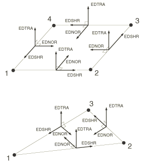

The forces per unit length in the global directions on beam elements are always non-follower loads.

General edge tractions can be specified to be follower or non-follower loads. There is no difference between a follower and a non-follower load in a geometrically linear analysis since the configuration of the body remains fixed.

| **Input File Usage: ** | Use one of the following options to define general edge tractions as follower loads (the default): |
| --- | --- |
|  | ``` [*DLOAD](../key/key-link.md#usb-kws-hdload), FOLLOWER=YES [*DSLOAD](../key/key-link.md#usb-kws-hdsload), FOLLOWER=YES ``` Use one of the following options to define general edge tractions as non-follower loads: ``` [*DLOAD](../key/key-link.md#usb-kws-hdload), FOLLOWER=NO [*DSLOAD](../key/key-link.md#usb-kws-hdsload), FOLLOWER=NO ``` |

| **Abaqus/CAE Usage: ** | Load module: **Create Load**: choose **Mechanical** for the **Category** and **Shell edge load** for the **Types for Selected Step**: **Traction: General**, toggle on or off **Follow rotation** |
| --- | --- |

#### Specifying general edge tractions

General edge tractions allow you to specify an edge load, , acting on a shell edge, *L*. The resultant load, , is computed by integrating  over *L*:

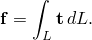

To define a general edge traction, you must provide both a magnitude, , and direction, , for the load. The specified load directions are normalized by Abaqus; thus, they do not contribute to the magnitude of the load. 

If a nonuniform general edge traction is specified, the magnitude, , and direction, , must be specified in user subroutine [`UTRACLOAD`](../sub/sub-link.md#sub-xsl-utracload).

| **Input File Usage: ** | Use one of the following options to define a general edge traction: |
| --- | --- |
|  | ``` [*DLOAD](../key/key-link.md#usb-kws-hdload) *element number or element set*, EDLD*n* or EDLD*n*NU, *magnitude*, *direction components* [*DSLOAD](../key/key-link.md#usb-kws-hdsload) *surface name*, EDLD or EDLDNU, *magnitude*, *direction components* ``` |

| **Abaqus/CAE Usage: ** | Use the following input to define an element-based general edge traction: |
| --- | --- |
|  | Load module: **Create Load**: choose **Mechanical** for the **Category** and **Shell edge load** for the **Types for Selected Step**: **Traction: General**, **Distribution**: select an analytical field Use the following input to define a surface-based general edge traction: Load module: **Create Load**: choose **Mechanical** for the **Category** and **Shell edge load** for the **Types for Selected Step**: **Traction: General**, **Distribution**: **Uniform** or **User-defined** Nonuniform element-based general edge traction is not supported in Abaqus/CAE. |

##### Rotation of the load vector

In a geometrically linear analysis the edge load, , acts in the fixed direction defined by


If a non-follower load is specified in a geometrically nonlinear analysis (which includes a perturbation step about a geometrically nonlinear base state), the edge load, , acts in the fixed direction defined by


If a follower load is specified in a geometrically nonlinear analysis (which includes a perturbation step about a geometrically nonlinear base state), the components must be defined with respect to the reference configuration. The reference edge traction is defined as 


 The applied edge traction, , is computed by rigidly rotating  onto the current edge.

##### Defining the direction vector with respect to a local coordinate system

By default, the components of the edge traction vector are specified with respect to the global directions. You can also refer to a local coordinate system (see ["Orientations," Section 2.2.5](pt01ch02s02aus15.md)) for the direction components of these tractions.

| **Input File Usage: ** | Use one of the following options to specify a local coordinate system: |
| --- | --- |
|  | ``` [*DLOAD](../key/key-link.md#usb-kws-hdload), ORIENTATION=*name* [*DSLOAD](../key/key-link.md#usb-kws-hdsload), ORIENTATION=*name* ``` |

| **Abaqus/CAE Usage: ** | Load module: **Create Load**: choose **Mechanical** for the **Category** and **Shell edge load** for the **Types for Selected Step**: select **CSYS: Picked** and click **Edit** to pick a local coordinate system, or select **CSYS: User-defined** to enter the name of a user subroutine that defines a local coordinate system |
| --- | --- |

#### Specifying shear, normal, and transverse edge tractions

The loading directions of shear, normal, and transverse edge tractions are determined by the underlying elements. A positive shear edge traction acts in the positive direction of the shell edge as determined by the element connectivity. A positive normal edge traction acts in the plane of the shell in the inward direction. A positive transverse edge traction acts in a sense opposite to the facet normal. The directions of positive shear, normal, and transverse edge tractions are shown in [Figure 34.4.3--6](pt07ch34s04aus122.md#edge-loads).

To define a shear, normal, or transverse edge traction, you must provide a magnitude,  for the load.

If a nonuniform shear, normal, or transverse edge traction is specified, the magnitude, , must be specified in user subroutine [`UTRACLOAD`](../sub/sub-link.md#sub-xsl-utracload).

In a geometrically linear step, the shear, normal, and transverse edge tractions act in the tangential, normal, and transverse directions of the shell, as shown in [Figure 34.4.3--6](pt07ch34s04aus122.md#edge-loads). In a geometrically nonlinear analysis the shear, normal, and transverse edge tractions rotate with the shell edge so they always act in the tangential, normal, and transverse directions of the shell, as shown in [Figure 34.4.3--6](pt07ch34s04aus122.md#edge-loads).

| **Input File Usage: ** | Use one of the following options to define a directed edge traction: |
| --- | --- |
|  | ``` [*DLOAD](../key/key-link.md#usb-kws-hdload) *element number or element set*, *directed edge traction label*, *magnitude* [*DSLOAD](../key/key-link.md#usb-kws-hdsload) *surface name*, *directed edge traction label*, *magnitude* ``` For element-based loads the *directed edge traction label* can be EDSHR*n* or EDSHR*n*NU for shear edge tractions, EDNOR*n* or EDNOR*n*NU for normal edge tractions, or EDTRA*n* or EDTRA*n*NU for transverse edge tractions. For surface-based loads the *directed edge traction label* can be EDSHR or EDSHRNU for shear edge tractions, EDNOR or EDNORNU for normal edge tractions, or EDTRA or EDTRANU for transverse edge tractions. |

| **Abaqus/CAE Usage: ** | Use the following input to define an element-based directed edge traction: |
| --- | --- |
|  | Load module: **Create Load**; choose **Mechanical** for the **Category** and **Shell edge load** for the **Types for Selected Step**; **Traction: Normal**, **Transverse**, or **Shear**; **Distribution**: select an analytical field Use the following input to define a surface-based directed edge traction: Load module: **Create Load**; choose **Mechanical** for the **Category** and **Shell edge load** for the **Types for Selected Step**; **Traction: Normal**, **Transverse**, or **Shear**; **Distribution**: **Uniform** or **User-defined** Nonuniform element-based directed edge traction is not supported in Abaqus/CAE. |

#### Specifying edge moments

An edge moment acts about the shell edge with the positive direction determined by the element connectivity. The directions of positive edge moments are shown in [Figure 34.4.3--7](pt07ch34s04aus122.md#edge-moments).

**Figure 34.4.3–7** Positive edge moments.


To define a distributed edge moment, you must provide a magnitude, , for the load.

If a nonuniform edge moment is specified, the magnitude, , must be specified in user subroutine [`UTRACLOAD`](../sub/sub-link.md#sub-xsl-utracload).

An edge moment always acts about the current shell edge in both geometrically linear and nonlinear analyses.

In a geometrically linear step an edge moment acts about the shell edge as shown in [Figure 34.4.3--7](pt07ch34s04aus122.md#edge-moments). In a geometrically nonlinear analysis an edge moment always acts about the shell edge as shown in [Figure 34.4.3--7](pt07ch34s04aus122.md#edge-moments).

| **Input File Usage: ** | Use one of the following options to define an edge moment: |
| --- | --- |
|  | ``` [*DLOAD](../key/key-link.md#usb-kws-hdload) *element number or element set*, EDMOM*n* or EDMOM*n*NU, *magnitude* [*DSLOAD](../key/key-link.md#usb-kws-hdsload) *surface name*, EDMOM or EDMOMNU, *magnitude* ``` |

| **Abaqus/CAE Usage: ** | Use the following input to define an element-based edge moment: |
| --- | --- |
|  | Load module: **Create Load**: choose **Mechanical** for the **Category** and **Shell edge load** for the **Types for Selected Step**: **Traction: Moment**, **Distribution**: select an analytical field Use the following input to define a surface-based edge moment: Load module: **Create Load**: choose **Mechanical** for the **Category** and **Shell edge load** for the **Types for Selected Step**: **Traction: General**, **Distribution**: **Uniform** or **User-defined** Nonuniform element-based edge moments are not supported in Abaqus/CAE. |

#### Resultant loads due to edge tractions and moments

You can choose to integrate edge tractions and moments over the current or the reference configuration by specifying whether or not a constant resultant should be maintained. In general, the constant resultant method is best suited for cases where the magnitude of the resultant load should not vary with changes in the edge length. However, it is up to you to decide which approach is best for your analysis.

##### Choosing not to have a constant resultant

If you choose not to have a constant resultant, an edge traction or moment is integrated over the edge in the current configuration, an edge whose length changes during a geometrically nonlinear analysis.

| **Input File Usage: ** | Use one of the following options: |
| --- | --- |
|  | ``` [*DLOAD](../key/key-link.md#usb-kws-hdload), CONSTANT RESULTANT=NO [*DSLOAD](../key/key-link.md#usb-kws-hdsload), CONSTANT RESULTANT=NO ``` |

| **Abaqus/CAE Usage: ** | Load module: **Create Load**: choose **Mechanical** for the **Category** and **Shell edge load** for the **Types for Selected Step**: **Traction is defined per unit deformed area** |
| --- | --- |

##### Maintaining a constant resultant

If you choose to have a constant resultant, an edge traction or moment is integrated over the edge in the reference configuration, whose length is constant.

| **Input File Usage: ** | Use one of the following options: |
| --- | --- |
|  | ``` [*DLOAD](../key/key-link.md#usb-kws-hdload), CONSTANT RESULTANT=YES [*DSLOAD](../key/key-link.md#usb-kws-hdsload), CONSTANT RESULTANT=YES ``` |

| **Abaqus/CAE Usage: ** | Load module: **Create Load**: choose **Mechanical** for the **Category** and **Shell edge load** for the **Types for Selected Step**: **Traction is defined per unit undeformed area** |
| --- | --- |

#### Specifying line loads on beam elements

You can specify line loads on beam elements in the global *X*-, *Y*-, or *Z*-direction. In addition, you can specify line loads on beam elements in the beam local 1- or 2-direction.

| **Input File Usage: ** | Use the following option to define a force per unit length in the global *X*-, *Y*-, or *Z*-direction on beam elements: |
| --- | --- |
|  | ``` [*DLOAD](../key/key-link.md#usb-kws-hdload) *element number or element set*, *load type label*, *magnitude* ``` where *load type label* is PX, PY, PZ, PXNU, PYNU, or PZNU. Use the following option to define a force per unit length in the beam local 1- or 2-direction: ``` [*DLOAD](../key/key-link.md#usb-kws-hdload) *element number or element set*, *load type label*, *magnitude* ``` where *load type label* is P1, P2, P1NU, or P2NU. |

| **Abaqus/CAE Usage: ** | Load module: **Create Load**: choose **Mechanical** for the **Category** and **Line load** for the **Types for Selected Step** |
| --- | --- |

#### Additional references

- Genta, G., *Dynamics of Rotating Systems, *Springer, 2005.


