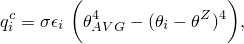
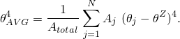

# 34.4.4 Thermal loads


**Products: **Abaqus/Standard  Abaqus/Explicit  Abaqus/CFD  Abaqus/CAE  

##### **References**

- ["Applying loads: overview," Section 34.4.1](pt07ch34s04aus120.md)
- [*CFLUX](../key/key-link.md#usb-kws-hcflux)
- [*DFLUX](../key/key-link.md#usb-kws-hdflux)
- [*DSFLUX](../key/key-link.md#usb-kws-hdsflux)
- [*CFILM](../key/key-link.md#usb-kws-hcfilm)
- [*FILM](../key/key-link.md#usb-kws-hfilm)
- [*SFILM](../key/key-link.md#usb-kws-hsfilm)
- [*FILM PROPERTY](../key/key-link.md#usb-kws-mfilmproperty)
- [*CRADIATE](../key/key-link.md#usb-kws-hcradiate)
- [*RADIATE](../key/key-link.md#usb-kws-hradiate)
- [*SRADIATE](../key/key-link.md#usb-kws-hsradiate)
- ["Defining a concentrated heat flux," Section 16.9.19 of the Abaqus/CAE User's Guide](../usi/usi-link.md#usi-lbi-loadeditors-concheatflux)
- ["Defining a body heat flux," Section 16.9.18 of the Abaqus/CAE User's Guide](../usi/usi-link.md#usi-lbi-loadeditors-bodyheatflux)
- ["Defining a surface heat flux," Section 16.9.17 of the Abaqus/CAE User's Guide](../usi/usi-link.md#usi-lbi-loadeditors-surfheatflux)
- ["Defining a fluid wall boundary condition," Section 16.10.12 of the Abaqus/CAE User's Guide](../usi/usi-link.md#usi-lbi-bceditors-fluid-wall)
- ["Defining a surface film condition interaction," Section 15.13.22 of the Abaqus/CAE User's Guide](../usi/usi-link.md#usi-itn-help-film)
- ["Defining a concentrated film condition interaction," Section 15.13.23 of the Abaqus/CAE User's Guide](../usi/usi-link.md#usi-itn-help-cfilm)
- ["Defining a surface radiative interaction," Section 15.13.24 of the Abaqus/CAE User's Guide](../usi/usi-link.md#usi-itn-help-radiation)
- ["Defining a concentrated radiative interaction," Section 15.13.25 of the Abaqus/CAE User's Guide](../usi/usi-link.md#usi-itn-help-cradiation)

### Overview

Thermal loads can be applied in heat transfer analysis, in fully coupled temperature-displacement analysis, fully coupled thermal-electrical-structural analysis, and in coupled thermal-electrical analysis, as outlined in ["Prescribed conditions: overview," Section 34.1.1](pt07ch34s01abo31.md). The following types of thermal loads are available:
- Concentrated heat flux prescribed at nodes.
- Distributed heat flux prescribed on element faces or surfaces.
- Body heat flux per unit volume.
- Boundary convection defined at nodes, on element faces, or on surfaces.
- Boundary radiation defined at nodes, on element faces, or on surfaces.

See ["Applying loads: overview," Section 34.4.1](pt07ch34s04aus120.md), for general information that applies to all types of loading.

### Modeling thermal radiation

The following types of radiation heat exchange can be modeled using Abaqus: 
- Exchange between a nonconcave surface and a nonreflecting environment. This type of radiation is modeled using boundary radiation loads defined at nodes, on element faces, or on surfaces, as described below.
- Exchange between two surfaces within close proximity of each other in which temperature gradients along the surfaces are not large. This type of radiation is modeled using the gap radiation capability described in ["Thermal contact properties," Section 37.2.1](pt09ch37s02aus174.md).
- Exchange between surfaces that constitute a cavity. This type of radiation is modeled using the cavity radiation capability available in Abaqus/Standard and described in ["Cavity radiation," Section 41.1.1](pt09ch41s01aus187.md), or through the average-temperature radiation condition described in ["Specifying average-temperature radiation conditions](pt07ch34s04aus123.md#usb-prc-pthermal-approxcav)," below.

### Prescribing heat fluxes directly

Concentrated heat fluxes can be prescribed at nodes (or node sets). Distributed heat fluxes can be defined on element faces or surfaces.

#### Specifying concentrated heat fluxes

By default, a concentrated heat flux is applied to degree of freedom 11. For shell heat transfer elements concentrated heat fluxes can be prescribed through the thickness of the shell by specifying degree of freedom 11, 12, 13, etc. Temperature variation through the thickness of shell elements is described in ["Choosing a shell element," Section 29.6.2](pt06ch29s06alm16.md).

| **Input File Usage: ** | ``` [*CFLUX](../key/key-link.md#usb-kws-hcflux) *node number or node set name*, *degree of freedom*, *heat flux magnitude* ``` |
| --- | --- |

| **Abaqus/CAE Usage: ** | Load module: **Create Load**: choose **Thermal** for the **Category** and **Concentrated heat flux** for the **Types for Selected Step**: select region: **Magnitude**: *heat flux magnitude* |
| --- | --- |

#### Defining the values of concentrated nodal flux from a user-specified file

You can define nodal flux using nodal flux output from a particular step and increment in the output database (.`odb`) file of a previous Abaqus analysis. The part (.`prt`) file from the original analysis is also required when reading data from the output database file. In this case both the previous model and the current model must be defined consistently, including node numbering, which must be the same in both models. If the models are defined in terms of an assembly of part instances, part instance naming must be the same. 

| **Input File Usage: ** | ``` [*CFLUX](../key/key-link.md#usb-kws-hcflux), FILE=file, STEP=step, INC=inc ``` |
| --- | --- |

| **Abaqus/CAE Usage: ** | Defining the values of concentrated nodal flux from a user-specified file is not supported in Abaqus/CAE. |
| --- | --- |

#### Specifying element-based distributed heat fluxes

You can specify element-based distributed surface fluxes (on element faces) or body fluxes (flux per unit volume). For surface fluxes you must identify the face of the element upon which the flux is prescribed in the flux label (for example, S*n* or S*n*NU for continuum elements). The distributed flux types available depend on the element type. [Part VI, "Elements](pt06.md),” lists the distributed fluxes that are available for particular elements.

| **Input File Usage: ** | ``` [*DFLUX](../key/key-link.md#usb-kws-hdflux) *element number or element set name*, *load type label*, *flux magnitude* ``` |
| --- | --- |
|  | where *load type label* is S*n*, SPOS, SNEG, S1, S2, or BF |

| **Abaqus/CAE Usage: ** | Use the following input to define a distributed surface flux: |
| --- | --- |
|  | Load module: **Create Load**: choose **Thermal** for the **Category** and **Surface heat flux** for the **Types for Selected Step**: select region: **Distribution**: select an analytical field, **Magnitude**: *flux magnitude* Use the following input to define a distributed body flux: Load module: **Create Load**: choose **Thermal** for the **Category** and **Body heat flux** for the **Types for Selected Step**: select region: **Distribution**: **Uniform** or select an analytical field, **Magnitude**: *flux magnitude* |

#### Specifying surface-based distributed heat fluxes

When you specify distributed surface fluxes on a surface, the surface that contains the element and face information is defined as described in ["Element-based surface definition," Section 2.3.2](pt01ch02s03aus17.md). You must specify the surface name, the heat flux label, and the heat flux magnitude.

| **Input File Usage: ** | ``` [*DSFLUX](../key/key-link.md#usb-kws-hdsflux) *surface name*, S, *flux magnitude* ``` |
| --- | --- |

| **Abaqus/CAE Usage: ** | Use the following input to specify surface-based distributed heat fluxes: |
| --- | --- |
|  | Load module: **Create Load**: choose **Thermal** for the **Category** and **Surface heat flux** for the **Types for Selected Step**: select region: **Distribution**: **Uniform**, **Magnitude**: *flux magnitude* Use the following input to specify surface-based distributed wall heat fluxes in Abaqus/CFD: Load module: **Create Boundary Condition**: **Step**: ***flow_step***: choose **Fluid** for the **Category** and **Fluid wall condition** for the **Types for Selected Step**: select region: **Thermal Energy**: **Specify**: **Heat flux**, **Magnitude**: *flux magnitude* |

#### Modifying or removing heat fluxes

Heat fluxes can be added, modified, or removed as described in ["Applying loads: overview," Section 34.4.1](pt07ch34s04aus120.md).

#### Specifying time-dependent heat fluxes

The magnitude of a concentrated or a distributed heat flux can be controlled by referring to an amplitude curve. If different magnitude variations are needed for different fluxes, the flux definitions can be repeated, with each referring to its own amplitude curve. See ["Prescribed conditions: overview," Section 34.1.1](pt07ch34s01abo31.md), and ["Amplitude curves," Section 34.1.2](pt07ch34s01aus115.md), for details.

#### Defining nonuniform distributed heat flux in a user subroutine

In Abaqus/Standard a nonuniform distributed flux (element-based or surface-based) can be defined in user subroutine [`DFLUX`](../sub/sub-link.md#sub-xsl-dflux). The specified reference magnitude will be passed into user subroutine [`DFLUX`](../sub/sub-link.md#sub-xsl-dflux) as `FLUX(1)`. If the magnitude is omitted, `FLUX(1)` will be passed in as zero.

| **Input File Usage: ** | Use the following option to define a nonuniform element-based heat flux: |
| --- | --- |
|  | ``` [*DFLUX](../key/key-link.md#usb-kws-hdflux) *element number or element set name*, *load type label*, *flux magnitude* ``` where *load type label* is S*n*NU, SPOSNU, SNEGNU, S1NU, S2NU, or BFNU. Use the following option to define a nonuniform surface-based heat flux: ``` [*DSFLUX](../key/key-link.md#usb-kws-hdsflux) *surface name*, SNU, *flux magnitude* ``` For example, for general heat transfer shell elements (["Three-dimensional conventional shell element library," Section 29.6.7](pt06ch29s06ael17.md)) a uniform surface flux of 10.0 per unit area on the top face (SPOS) of shell element 100 can be applied by ``` [*DFLUX](../key/key-link.md#usb-kws-hdflux) 100, SPOS, 10.0 ``` When the variation of the (nonuniform) flux magnitude is defined by means of user subroutine [`DFLUX`](../sub/sub-link.md#sub-xsl-dflux), the distributed flux type label SPOSNU is used. ``` [*DFLUX](../key/key-link.md#usb-kws-hdflux) 100, SPOSNU, *magnitude* ``` |

| **Abaqus/CAE Usage: ** | Use the following input to define a nonuniform element-based body flux: |
| --- | --- |
|  | Load module: **Create Load**: choose **Thermal** for the **Category** and **Body heat flux** for the **Types for Selected Step**: select region: **Distribution: User-defined**, **Magnitude**: *flux magnitude* Use the following input to define a nonuniform surface-based heat flux: Load module: **Create Load**: choose **Thermal** for the **Category** and **Surface heat flux** for the **Types for Selected Step**: select region: **Distribution: User-defined**, **Magnitude**: *flux magnitude* Nonuniform element-based distributed surface fluxes are not supported in Abaqus/CAE. |

### Prescribing boundary convection

Heat flux on a surface due to convection is governed by 


where 

*q*

is the heat flux across the surface,

*h*

is a reference film coefficient,


is the temperature at this point on the surface, and


is a reference sink temperature value.

Heat flux due to convection can be defined on element faces, on surfaces, or at nodes.

#### Specifying element-based film conditions

You can define the sink temperature value, , and the film coefficient, *h*, on element faces. The convection is applied to element edges in two dimensions and to element faces in three dimensions. The edge or face of the element upon which the film is placed is identified by a film load type label and depends on the element type (see [Part VI, "Elements](pt06.md)”). You must specify the element number or element set name, the film load type label, a sink temperature, and a film coefficient.

| **Input File Usage: ** | ``` [*FILM](../key/key-link.md#usb-kws-hfilm) *element number or element set name*, *film load type label*, , *h* ``` |
| --- | --- |

| **Abaqus/CAE Usage: ** | Element-based film conditions are supported in Abaqus/CAE only for the film coefficient. |
| --- | --- |
|  | Interaction module: **Create Interaction**: **Surface film condition**: select region: **Definition**: select an analytical field: **Film coefficient:** *h* |

#### Specifying surface-based film conditions

You can define the sink temperature value, , and the film coefficient, *h*, on a surface. The surface that contains the element and face information is defined as described in ["Element-based surface definition," Section 2.3.2](pt01ch02s03aus17.md). You must specify the surface name, the film load type, a sink temperature, and a film coefficient.

| **Input File Usage: ** | ``` [*SFILM](../key/key-link.md#usb-kws-hsfilm) *surface name*, F or FNU, , *h* ``` |
| --- | --- |

| **Abaqus/CAE Usage: ** | Interaction module: **Create Interaction**: **Surface film condition**: select region: **Definition**: **Embedded Coefficient** or **User-defined**: **Film coefficient:** *h* and **Sink temperature:**  |
| --- | --- |

#### Specifying node-based film conditions

A node-based film condition requires that you define the nodal area for a specified node number or node set; the sink temperature value, ; and the film coefficient, *h*. The associated degree of freedom is 11. For shell type elements where the film is associated with a degree of freedom other than 11, you can specify the concentrated film for a duplicate node that is constrained to the appropriate degree of freedom of the shell node by using an equation constraint (see ["Linear constraint equations," Section 35.2.1](pt08ch35s02aus129.md)).

| **Input File Usage: ** | ``` [*CFILM](../key/key-link.md#usb-kws-hcfilm) *node number or node set name*, *nodal area*, , *h* ``` |
| --- | --- |

| **Abaqus/CAE Usage: ** | Interaction module: **Create Interaction**: **Concentrated film condition**: select region: **Definition**: **Embedded Coefficient**, **User-defined**, or select an analytical field: **Associated nodal area:** *nodal area*, **Film coefficient:** *h*, **Sink temperature:**  |
| --- | --- |

#### Specifying temperature- and field-variable-dependent film conditions

If the film coefficient is a function of temperature, you can specify the film property data separately and specify the name of the property table instead of the film coefficient in the film condition definition.

You can specify multiple film property tables to define different variations of the film coefficient, *h*, as a function of surface temperature and/or field variables. Each film property table must be named. This name is referred to by the film condition definitions.

A new film property table can be defined in a restart step. If a film property table with an existing name is encountered, the second definition is ignored.

| **Input File Usage: ** | For element-based film conditions, use the following options: |
| --- | --- |
|  | ``` [*FILM PROPERTY](../key/key-link.md#usb-kws-mfilmproperty), NAME=*film property table name* [*FILM](../key/key-link.md#usb-kws-hfilm) *element number or element set name*, *film load type label*, , *film property table name* ``` For surface-based film conditions, use the following options: ``` [*FILM PROPERTY](../key/key-link.md#usb-kws-mfilmproperty), NAME=*film property table name* [*SFILM](../key/key-link.md#usb-kws-hsfilm) *surface name*, F, , *film property table name* ``` For node-based film conditions, use the following options: ``` [*FILM PROPERTY](../key/key-link.md#usb-kws-mfilmproperty), NAME=*film property table name* [*CFILM](../key/key-link.md#usb-kws-hcfilm) *node number or node set name*, *nodal area*, , *film property table name* ``` The [*FILM PROPERTY](../key/key-link.md#usb-kws-mfilmproperty) option must appear in the model definition portion of the input file. |

| **Abaqus/CAE Usage: ** | Interaction module: **Create Interaction Property**: **Name**: *film property table name* and **Film** **condition****Create Interaction**: **Surface film condition** or **Concentrated film condition**: select region: **Definition: Property Reference** and **Film interaction property**: *film property table name* |
| --- | --- |

#### Modifying or removing film conditions

Film conditions can be added, modified, or removed as described in ["Applying loads: overview," Section 34.4.1](pt07ch34s04aus120.md).

#### Specifying time-dependent film conditions

For a uniform film both the sink temperature and the film coefficient can be varied with time by referring to amplitude definitions. One amplitude curve defines the variation of the sink temperature, , with time. Another amplitude curve defines the variation of the film coefficient, *h*, with time. See ["Prescribed conditions: overview," Section 34.1.1](pt07ch34s01abo31.md), and ["Amplitude curves," Section 34.1.2](pt07ch34s01aus115.md), for more information.

| **Input File Usage: ** | Use the following options to define time-dependent film conditions: |
| --- | --- |
|  | ``` [*AMPLITUDE](../key/key-link.md#usb-kws-mamplitude), NAME=*temp_amp* [*AMPLITUDE](../key/key-link.md#usb-kws-mamplitude), NAME=*h_amp* [*FILM](../key/key-link.md#usb-kws-hfilm), AMPLITUDE=*temp_amp*, FILM AMPLITUDE=*h_amp* [*SFILM](../key/key-link.md#usb-kws-hsfilm), AMPLITUDE=*temp_amp*, FILM AMPLITUDE=*h_amp* [*CFILM](../key/key-link.md#usb-kws-hcfilm), AMPLITUDE=*temp_amp*, FILM AMPLITUDE=*h_amp* ``` |

| **Abaqus/CAE Usage: ** | Use the following input to define time-dependent film conditions. If you select an analytical field to define the interaction, the analytical field affects only the film coefficient. |
| --- | --- |
|  | Interaction module: **Create Amplitude**: **Name:** *h_amp***Create Amplitude**: **Name:** *temp_amp***Create Interaction**: **Surface film condition** or **Concentrated film condition**: select region: **Definition**: **Embedded Coefficient** or select an analytical field: **Film coefficient amplitude**: *h_amp* and **Sink amplitude**: *temp_amp* |

#### Examples

A uniform, time-dependent film condition can be defined for face 2 of element 3 by

```
[*AMPLITUDE](../key/key-link.md#usb-kws-mamplitude), NAME=sink
 0.0, 0.5, 1.0, 0.9
[*AMPLITUDE](../key/key-link.md#usb-kws-mamplitude), NAME=famp
 0.0, 1.0, 1.0, 22.0
 …
[*STEP](../key/key-link.md#usb-kws-hstep)
** For an Abaqus/Standard analysis:
[*HEAT TRANSFER](../key/key-link.md#usb-kws-hheattrans)
** For an Abaqus/Explicit analysis:
[*DYNAMIC TEMPERATURE-DISPLACEMENT](../key/key-link.md#usb-kws-hexpdynamicthermal), EXPLICIT
 …
[*FILM](../key/key-link.md#usb-kws-hfilm), AMPLITUDE=sink, FILM AMPLITUDE=famp
 3, F2, 90.0, 2.0
```

A uniform, temperature-dependent film coefficient and a time-dependent sink temperature can be defined for face 2 of element 3 by

```
[*AMPLITUDE](../key/key-link.md#usb-kws-mamplitude), NAME=sink
0.0, 0.5, 1.0, 0.9
[*FILM PROPERTY](../key/key-link.md#usb-kws-mfilmproperty), NAME=filmp
 2.0,  80.0
 2.3,  90.0
 8.5, 180.0
 …
[*STEP](../key/key-link.md#usb-kws-hstep)
** For an Abaqus/Standard analysis:
[*HEAT TRANSFER](../key/key-link.md#usb-kws-hheattrans)
** For an Abaqus/Explicit analysis:
[*DYNAMIC TEMPERATURE-DISPLACEMENT](../key/key-link.md#usb-kws-hexpdynamicthermal), EXPLICIT
 …
[*FILM](../key/key-link.md#usb-kws-hfilm), AMPLITUDE=sink
 3, F2, 90.0, filmp
```

A uniform, temperature-dependent film coefficient and a time-dependent sink temperature can be defined for node 2, where the nodal area is 50, by

```
[*AMPLITUDE](../key/key-link.md#usb-kws-mamplitude), NAME=sink
0.0, 0.5, 1.0, 0.9
[*FILM PROPERTY](../key/key-link.md#usb-kws-mfilmproperty), NAME=filmp
 2.0,  80.0
 2.3,  90.0
 8.5, 180.0
 …
[*STEP](../key/key-link.md#usb-kws-hstep)
** For an Abaqus/Standard analysis:
[*HEAT TRANSFER](../key/key-link.md#usb-kws-hheattrans)
** For an Abaqus/Explicit analysis:
[*DYNAMIC TEMPERATURE-DISPLACEMENT](../key/key-link.md#usb-kws-hexpdynamicthermal), EXPLICIT
 …
[*CFILM](../key/key-link.md#usb-kws-hcfilm), AMPLITUDE=sink,
 2, 50, 90.0, filmp
```

#### Defining nonuniform film conditions in a user subroutine

In Abaqus/Standard a nonuniform film coefficient can be defined as a function of position, time, temperature, etc. in user subroutine [`FILM`](../sub/sub-link.md#sub-xsl-film) for element-based, surface-based, as well as node-based film conditions. Amplitude references are ignored if a nonuniform film is prescribed.

| **Input File Usage: ** | Use the following option to define a nonuniform film coefficient for an element-based film condition: |
| --- | --- |
|  | ``` [*FILM](../key/key-link.md#usb-kws-hfilm) *element number or element set name*, F*n*NU ``` Use the following option to define a nonuniform film coefficient for a surface-based film condition: ``` [*SFILM](../key/key-link.md#usb-kws-hsfilm) *surface name*, FNU ``` Use the following option to define a nonuniform film coefficient for a node-based film condition: ``` [*CFILM](../key/key-link.md#usb-kws-hcfilm), USER *node number or node set name*, *nodal area* ``` |

| **Abaqus/CAE Usage: ** | Element-based film conditions to define a nonuniform film coefficient are not supported in Abaqus/CAE. However, similar functionality is available using surface-based film conditions. Use the following option to define a nonuniform film coefficient for a surface-based film condition: |
| --- | --- |
|  | Interaction module: **Create Interaction**: **Surface film condition**: select region: **Definition**: **User-defined** Use the following option to define a nonuniform film coefficient for a node-based film condition: Interaction module: **Create Interaction**: **Concentrated film condition**: select region: **Definition**: **User-defined** |

### Prescribing boundary radiation

Heat flux on a surface due to radiation to the environment is governed by 


where 

*q*

is the heat flux across the surface,


is the emissivity of the surface,


is the Stefan-Boltzmann constant,


is the temperature at this point on the surface,


is an ambient temperature value, and


is the value of absolute zero on the temperature scale being used.

Heat flux due to radiation can be defined on element faces, on surfaces, or at nodes.

#### Specifying element-based radiation

To specify element-based radiation within a heat transfer or coupled temperature-displacement step definition, you must provide the ambient temperature value, , and the emissivity of the surface, . The radiation is applied to element edges in two dimensions and to element faces in three dimensions. The edge or face of the element upon which the radiation occurs is identified by a radiation type label depending on the element type (see [Part VI, "Elements](pt06.md)”).

| **Input File Usage: ** | ``` [*RADIATE](../key/key-link.md#usb-kws-hradiate) *element number or element set name*, R*n*, ,  ``` |
| --- | --- |

| **Abaqus/CAE Usage: ** | Interaction module: **Create Interaction**: **Surface radiation**: select region: **Radiation type: ****To ambient**, **Emissivity distribution:** select an analytical field, **Emissivity:** , and **Ambient temperature:**  |
| --- | --- |

#### Specifying surface-based radiation to ambient

You can apply the radiation to a surface rather than to individual element faces. The surface that contains the element and face information is defined as described in ["Element-based surface definition," Section 2.3.2](pt01ch02s03aus17.md). You must specify the surface name; the radiation load type label, R (or RPOS, RNEG in the case of shells); the ambient temperature value, ; and the emissivity of the surface, .

| **Input File Usage: ** | ``` [*SRADIATE](../key/key-link.md#usb-kws-hsradiate) *surface name*, R, ,  ``` |
| --- | --- |

| **Abaqus/CAE Usage: ** | Interaction module: **Create Interaction**: **Surface radiation**: select region: **Radiation type: ****To ambient**, **Emissivity distribution:** **Uniform**, **Emissivity:** , and **Ambient temperature:**  |
| --- | --- |

#### Specifying node-based radiation to ambient

To specify node-based radiation within a heat transfer or coupled temperature-displacement step definition, you must provide the nodal area for a specified node number or node set; the ambient temperature value, ; and the emissivity of the surface, . The associated degree of freedom is  11. For shell elements where the concentrated radiation is associated with a degree of freedom other than 11, you can specify the required data for a duplicate node that is constrained to the appropriate degree of freedom of the shell node by using an equation constraint.

| **Input File Usage: ** | ``` [*CRADIATE](../key/key-link.md#usb-kws-hcradiate) *node number or node set name*, *nodal area*, ,  ``` |
| --- | --- |

| **Abaqus/CAE Usage: ** | Interaction module: **Create Interaction**: **Concentrated radiation to ambient**: select region: **Associated nodal area:** **Emissivity:**  and **Ambient temperature:**  |
| --- | --- |

#### Specifying time-dependent radiation

The user-specified value of the ambient temperature, , can be varied throughout the step by referring to an amplitude definition. See ["Applying loads: overview," Section 34.4.1](pt07ch34s04aus120.md), and ["Amplitude curves," Section 34.1.2](pt07ch34s01aus115.md), for details.

#### Specifying average-temperature radiation conditions

The average-temperature radiation condition is an approximation to the cavity radiation problem, where the radiative flux per unit area into a facet is



 with the average temperature for the surface being calculated as



The average temperature in the cavity is computed at the beginning of each increment and held constant over the increment. Therefore, the average-temperature radiation condition has some dependency on the increment size, and you need to ensure that the increment size you use is appropriate for your model. If you see large changes in temperature over an increment, you may need to reduce the increment size.

| **Input File Usage: ** | Use the following option to define the average-temperature radiation condition on a surface: |
| --- | --- |
|  | ``` [*SRADIATE](../key/key-link.md#usb-kws-hsradiate) *surface name*, AVG, ,  ``` |

| **Abaqus/CAE Usage: ** | Interaction module: **Create Interaction**: **Surface radiation**: select the surface region: **Radiation type: ****Cavity approximation (3D only)**, **Emissivity:**  |
| --- | --- |

#### Specifying the value of absolute zero

You can specify the value of absolute zero, , on the temperature scale being used; you must specify this value as model data. By default, the value of absolute zero is 0.0.

| **Input File Usage: ** | ``` [*PHYSICAL CONSTANTS](../key/key-link.md#usb-kws-mphysicalconsts), ABSOLUTE ZERO= ``` |
| --- | --- |

| **Abaqus/CAE Usage: ** | Any module: ****Model****Edit Attributes*****model_name*****: **Absolute zero temperature:**  |
| --- | --- |

#### Specifying the value of the Stefan-Boltzmann constant

If boundary radiation is prescribed, you must specify the Stefan-Boltzmann constant, ; this value must be specified as model data.

| **Input File Usage: ** | ``` [*PHYSICAL CONSTANTS](../key/key-link.md#usb-kws-mphysicalconsts), STEFAN BOLTZMANN= ``` |
| --- | --- |

| **Abaqus/CAE Usage: ** | Any module: ****Model****Edit Attributes*****model_name*****: **Stefan-Boltzmann constant:**  |
| --- | --- |

#### Modifying or removing boundary radiation

Boundary radiation conditions can be added, modified, or removed as described in ["Applying loads: overview," Section 34.4.1](pt07ch34s04aus120.md).


