# 34.4.6 Acoustic and shock loads


**Products: **Abaqus/Standard  Abaqus/Explicit  Abaqus/CAE  

##### **References**

- ["Applying loads: overview," Section 34.4.1](pt07ch34s04aus120.md)
- ["Acoustic, shock, and coupled acoustic-structural analysis," Section 6.10.1](pt03ch06s10at29.md)
- [*AMPLITUDE](../key/key-link.md#usb-kws-mamplitude)
- [*BOUNDARY](../key/key-link.md#usb-kws-hboundary)
- [*CLOAD](../key/key-link.md#usb-kws-hcload)
- [*CONWEP CHARGE PROPERTY](../key/key-link.md#usb-kws-mconwepchargeproperty)
- [*IMPEDANCE](../key/key-link.md#usb-kws-himpedance)
- [*IMPEDANCE PROPERTY](../key/key-link.md#usb-kws-mimpedanceprop)
- [*INCIDENT WAVE](../key/key-link.md#usb-kws-hincidentwave)
- [*INCIDENT WAVE FLUID PROPERTY](../key/key-link.md#usb-kws-mincidentwavefluid)
- [*INCIDENT WAVE INTERACTION](../key/key-link.md#usb-kws-hincidentwaveinteraction)
- [*INCIDENT WAVE INTERACTION PROPERTY](../key/key-link.md#usb-kws-mincidentwaveinteractionproperty)
- [*INCIDENT WAVE PROPERTY](../key/key-link.md#usb-kws-mincidentwaveproperty)
- [*INCIDENT WAVE REFLECTION](../key/key-link.md#usb-kws-hincidentwavereflection)
- [*SIMPEDANCE](../key/key-link.md#usb-kws-hsimpedance)
- [*UNDEX CHARGE PROPERTY](../key/key-link.md#usb-kws-mundexchargeproperty)
- ["Defining acoustic impedance," Section 15.13.17 of the Abaqus/CAE User's Guide](../usi/usi-link.md#usi-itn-help-acoustic-imped)
- ["Defining incident waves," Section 15.13.18 of the Abaqus/CAE User's Guide](../usi/usi-link.md#usi-itn-help-incident-wave)
- ["Defining an acoustic impedance interaction property," Section 15.14.6 of the Abaqus/CAE User's Guide](../usi/usi-link.md#usi-itn-help-prop-acoustic-imp)
- ["Defining an incident wave interaction property," Section 15.14.7 of the Abaqus/CAE User's Guide](../usi/usi-link.md#usi-itn-help-prop-incident-wave)

### Overview

Acoustic loads can be applied only in transient or steady-state dynamic analysis procedures. The following types of acoustic loads are available: 
- Boundary impedance defined on element faces or on surfaces.
- Nonreflecting radiation boundaries in exterior problems such as a structure vibrating in an acoustic medium of infinite extent.
- Concentrated pressure-conjugate loads prescribed at acoustic element nodes.
- Temporally and spatially varying pressure loading on acoustic and solid surfaces due to incident waves traveling through the acoustic medium.

### Specified boundary impedance

A boundary impedance specifies the relationship between the pressure of an acoustic medium and the normal motion at the boundary. Such a condition is applied, for example, to include the effect of small-amplitude “sloshing” in a gravity field or the effect of a compressible, possibly dissipative, lining (such as a carpet) between an acoustic medium and a fixed, rigid wall or structure.

The impedance boundary condition at any point along the acoustic medium surface is governed by 


where 

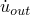

is the acoustic particle velocity in the outward normal direction of the acoustic medium surface,

*p*

is the acoustic pressure,


is the time rate of change of the acoustic pressure,


is the proportionality coefficient between the pressure and the displacement normal to the surface, and 


is the proportionality coefficient between the pressure and the velocity normal to the surface.

This model can be conceptualized as a spring and dashpot in series placed between the acoustic medium and a rigid wall. The spring and dashpot parameters are  and , respectively, defined per unit area of the interface surface. These reactive acoustic boundaries can have a significant effect on the pressure distribution in the acoustic medium, in particular if the coefficients  and  are chosen such that the boundary is energy absorbing. If no impedance, loads, or fluid-solid coupling are specified on the surface of an acoustic mesh, the acceleration of that surface is assumed to be zero. This is equivalent to the presence of a rigid wall at that boundary.

Use of the subspace-based steady-state dynamics procedure is not recommended if reactive acoustic boundaries with strong absorption characteristics are used. Since the effect of  is not taken into account in an eigenfrequency extraction step, the eigenmodes may have shapes that are significantly different from the exact solution.

#### Sloshing of a free surface

To model small-amplitude “sloshing” of a free surface in a gravity field, set  and , where  is the density of the fluid and *g* is the gravitational acceleration (assumed to be directed normal to the surface). This relation holds for small volumetric drag.

#### Acoustic-structural interface

The impedance boundary condition can also be placed at an acoustic-structural interface. In this case the boundary condition can be conceptualized as a spring and dashpot in series placed between the acoustic medium and the structure. The expression for the outward velocity still holds, with  now being the relative outward velocity of the acoustic medium and the structure: 


where  is the velocity of the structure,  is the velocity of the acoustic medium at the boundary, and  is the outward normal to the acoustic medium.

#### Steady-state dynamics

In a steady-state dynamics analysis the expression for the outward velocity can be written in complex form as 


where  is the circular frequency (radians/second) and we define 


The term  is the complex admittance of the boundary, and 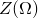 is its complex impedance. Thus, a required complex impedance or admittance value can be entered for a given frequency by specifying the parameters  and .

#### Specifying impedance conditions

You specify impedance coefficient data in an impedance property table. You can describe an impedance table in terms of the admittance parameters,  and , or in terms of the real and imaginary parts of the impedance. In the latter case Abaqus converts the user-defined table of impedance data to the admittance parameter form for the analysis.

The parameters in the table can be specified over a range of frequencies. The required values are interpolated from the table in steady-state harmonic response analysis only; for other analysis types, only the first table entry is used. The name of the impedance property table is referred to from a surface-based or element-based impedance definition. In Abaqus/CAE impedance conditions are always surface-based; surfaces can be defined as collections of geometric faces and edges or collections of element faces and edges.

In a steady-state dynamics analysis you cannot specify impedance conditions on a surface on which incident wave loading is applied.

| **Input File Usage: ** | Use the following option to specify an impedance using a table of admittance parameters (default): |
| --- | --- |
|  | ``` [*IMPEDANCE PROPERTY](../key/key-link.md#usb-kws-mimpedanceprop), NAME=*impedance property table name*, DATA=ADMITTANCE ``` Use the following option to specify an impedance using a table of the real and imaginary parts of the impedance: ``` [*IMPEDANCE PROPERTY](../key/key-link.md#usb-kws-mimpedanceprop), NAME=*impedance property table name*, DATA=IMPEDANCE ``` |

| **Abaqus/CAE Usage: ** | Use the following input to specify an impedance using a table of admittance parameters: |
| --- | --- |
|  | Interaction module: **Create Interaction Property**: **Name**: *impedance property table name* and **Acoustic impedance**: **Data type**: **Admittance** Use the following input to specify an impedance using a table of the real and imaginary parts of the impedance: Interaction module: **Create Interaction Property**: **Name**: *impedance property table name* and **Acoustic impedance**: **Data type**: **Impedance** |

##### Specifying surface-based impedance conditions

You can define the impedance condition on a surface. The impedance is applied to element edges in two dimensions and to element faces in three dimensions. The element-based surface (see ["Element-based surface definition," Section 2.3.2](pt01ch02s03aus17.md)) contains the element and face information.

| **Input File Usage: ** | ``` [*SIMPEDANCE](../key/key-link.md#usb-kws-hsimpedance), PROPERTY=*impedance property table name* *surface name* ``` |
| --- | --- |

| **Abaqus/CAE Usage: ** | Interaction module: **Create Interaction**: **Acoustic impedance**: select surface: **Definition**: **Tabular**, **Acoustic impedance property**: *impedance property table name* |
| --- | --- |

##### Specifying element-based impedance conditions

Alternatively, you can define the impedance condition on element faces. The impedance is applied to element edges in two dimensions and to element faces in three dimensions. The edge or face of the element upon which the impedance is placed is identified by an impedance load type and depends on the element type (see [Part VI, "Elements](pt06.md)”).

| **Input File Usage: ** | ``` [*IMPEDANCE](../key/key-link.md#usb-kws-himpedance), PROPERTY=*impedance property table name* *element number or set name*, *impedance load type label* ``` |
| --- | --- |

| **Abaqus/CAE Usage: ** | Element-based impedance conditions are not supported in Abaqus/CAE. However, similar functionality is available using surface-based impedance conditions. |
| --- | --- |

#### Modifying or removing impedance conditions

Impedance conditions can be added, modified, or removed as described in ["Applying loads: overview," Section 34.4.1](pt07ch34s04aus120.md).

### Radiation boundaries for exterior problems

An exterior problem such as a structure vibrating in an acoustic medium of infinite extent is often of interest. Such a problem can be modeled by using acoustic elements to model the region between the structure and a simple geometric surface (located away from the structure) and applying a radiating (nonreflecting) boundary condition at that surface. The radiating boundary conditions are approximate, so the error in an exterior acoustic analysis is controlled not only by the usual finite element discretization error but also by the error in the approximate radiation condition. In Abaqus the radiation boundary conditions converge to the exact condition in the limit as they become infinitely distant from the radiating structure. In practice, these radiation conditions provide accurate results when the surface is at least one-half wavelength away from the structure at the lowest frequency of interest.

Except in the case of a plane wave absorbing condition with zero volumetric drag, the impedance parameters in Abaqus/Standard are frequency dependent. The frequency-dependent parameters are used in the direct-solution and subspace-based steady-state dynamics procedures. In direct time integration procedures the zero-drag values for the constants  and  are used. These values will give good results when the drag is small. (Small volumetric drag here means 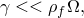 where  is the density of the acoustic medium and  is the circular excitation frequency or sound wave frequency.)

A direct-solution steady-state dynamics procedure (["Direct-solution steady-state dynamic analysis," Section 6.3.4](pt03ch06s03at09.md)) must include both real and complex terms if nonreflecting (also called quiet) boundaries are present, because nonreflecting boundaries represent a form of damping in the system.

Several radiating boundary conditions are implemented as special cases of the impedance boundary condition. The details of the formulation are given in ["Coupled acoustic-structural medium analysis," Section 2.9.1 of the Abaqus Theory Guide](../stm/stm-link.md#stm-anl-acouststruct).

Element-based impedance conditions are not supported in Abaqus/CAE. However, similar functionality is available using surface-based impedance conditions.

#### Planar nonreflecting boundary condition

The simplest nonreflecting boundary condition available in Abaqus assumes that the plane waves are normally incident on the exterior surface. This planar boundary condition ignores the curvature of the boundary and the possibility that waves in the simulation may impinge on the boundary at an arbitrary angle. The planar nonreflecting condition provides an approximation: acoustic waves are transmitted across such a boundary with little reflection of energy back into the acoustic medium. The amount of energy reflected is small if the boundary is far away from major acoustic disturbances and is reasonably orthogonal to the direction of dominant wave propagation. Thus, if an exterior (unbounded domain) problem is to be solved, the nonreflecting boundary should be placed far enough away from the sound source so that the assumption of normally impinging waves is sufficiently accurate. This condition would be used, for example, on the exhaust end of a muffler.

| **Input File Usage: ** | Use either of the following options (default): |
| --- | --- |
|  | ``` [*SIMPEDANCE](../key/key-link.md#usb-kws-hsimpedance), NONREFLECTING=PLANAR [*IMPEDANCE](../key/key-link.md#usb-kws-himpedance), NONREFLECTING=PLANAR ``` |

| **Abaqus/CAE Usage: ** | Use the following input to specify a surface-based planar nonreflecting boundary condition: |
| --- | --- |
|  | Interaction module: **Create Interaction**: **Acoustic impedance**: select surface: **Definition**: **Nonreflecting**, **Nonreflecting type**: **Planar** |

#### Improved nonreflecting boundary condition for plane waves

For the planar nonreflecting boundary condition to be accurate, the plane waves must be normally incident to a planar boundary. However, the angle of incidence is generally unknown in advance. A radiating boundary condition that is exact for plane waves with arbitrary angles of incidence is available in Abaqus. The radiating boundary can have any arbitrary shape. This boundary impedance is implemented only for transient dynamics.

| **Input File Usage: ** | Use either of the following options: |
| --- | --- |
|  | ``` [*SIMPEDANCE](../key/key-link.md#usb-kws-hsimpedance), NONREFLECTING=IMPROVED [*IMPEDANCE](../key/key-link.md#usb-kws-himpedance), NONREFLECTING=IMPROVED ``` |

| **Abaqus/CAE Usage: ** | Use the following input to specify a surface-based improved planar nonreflecting boundary condition: |
| --- | --- |
|  | Interaction module: **Create Interaction**: **Acoustic impedance**: select surface: **Definition**: **Nonreflecting**, **Nonreflecting type**: **Improved planar** |

#### Geometry-based nonreflecting boundary conditions

Four other types of absorbing boundary conditions that take the geometry of the radiating boundary into account are implemented in Abaqus: circular, spherical, elliptical, and prolate spheroidal. These boundary conditions offer improved performance over the planar nonreflecting condition if the nonreflecting surface has a simple, convex shape and is close to the acoustic sources. The various types of absorbing boundaries are selected by defining the required geometric parameters for the element-based or surface-based impedance definition.

The geometric parameters affect the nonreflecting surface impedance. To specify a nonreflecting boundary that is circular in two dimensions or a right circular cylinder in three dimensions, you must specify the radius of the circle. To specify a nonreflecting spherical boundary condition, you must specify the radius of the sphere. To specify a nonreflecting boundary that is elliptical in two dimensions or a right elliptical cylinder in three dimensions or to specify a prolate spheroid boundary condition, you must specify the shape, location, and orientation of the radiating surface. The two parameters specifying the shape of the surface are the semimajor axis and the eccentricity. The semimajor axis, *a*, of an ellipse or prolate spheroid is analogous to the radius of a sphere: it is one-half the length of the longest line segment connecting two points on the surface. The semiminor axis, *b*, is one-half the length of the longest line segment that connects two points on the surface and is orthogonal to the semimajor axis line. The eccentricity, , is defined as .

See ["Acoustic radiation impedance of a sphere in breathing mode," Section 1.11.3 of the Abaqus Benchmarks Guide](../bmk/bmk-link.md#bmk-anl-acousticimpsphere), and ["Acoustic-structural interaction in an infinite acoustic medium," Section 1.11.4 of the Abaqus Benchmarks Guide](../bmk/bmk-link.md#bmk-anl-acouststructabsbc), for benchmark problems showing the use of these conditions.

| **Input File Usage: ** | Use one of the following options: |
| --- | --- |
|  | ``` [*SIMPEDANCE](../key/key-link.md#usb-kws-hsimpedance), NONREFLECTING=CIRCULAR [*SIMPEDANCE](../key/key-link.md#usb-kws-hsimpedance), NONREFLECTING=SPHERICAL [*SIMPEDANCE](../key/key-link.md#usb-kws-hsimpedance), NONREFLECTING=ELLIPTICAL [*SIMPEDANCE](../key/key-link.md#usb-kws-hsimpedance), NONREFLECTING=PROLATE SPHEROIDAL ``` In each case, the [*IMPEDANCE](../key/key-link.md#usb-kws-himpedance) element-based option can be used instead of [*SIMPEDANCE](../key/key-link.md#usb-kws-hsimpedance). |

| **Abaqus/CAE Usage: ** | Use the following input to specify surface-based geometric nonreflecting boundary conditions: |
| --- | --- |
|  | Interaction module: **Create Interaction**: **Acoustic impedance**: select surface: **Definition**: **Nonreflecting**, **Nonreflecting type**: **Circular**, **Spherical**, **Elliptical**, or **Prolate spheroidal** |

##### Combining different radiation conditions in the same problem

Since the radiation boundary conditions for the different shapes are spatially local and do not involve discretization in the infinite exterior domain, an exterior boundary can consist of the combination of several shapes. The appropriate boundary condition can then be applied to each part of the boundary. For example, a circular cylinder can be terminated with hemispheres (see ["Fully and sequentially coupled acoustic-structural analysis of a muffler," Section 9.1.1 of the Abaqus Example Problems Guide](../exa/exa-link.md#exa-aco-muffler)), or an elliptical cylinder can be terminated with prolate spheroidal halves. This modeling technique is most effective if the boundaries between surfaces are continuous in slope as well as displacement, although this is not essential.

### Concentrated pressure-conjugate load

Distributed “loads” on acoustic elements can be interpreted as normal pressure gradients per unit density (dimensions of force per unit mass or acceleration). When used in Abaqus, the applied distributed loads must be integrated over a surface area, yielding a quantity with dimensions of force times area per unit mass (or volumetric acceleration). For analyses in the frequency domain and for transient dynamic analyses where the volumetric drag is zero, this acoustic load is equal to the volumetric acceleration of the fluid on the boundary. For example, a horizontal, flat rigid plate oscillating vertically imposes an acceleration on the acoustic fluid and an acoustic “load” equal to this acceleration times the surface area of the plate. For the transient dynamics formulation in the presence of volumetric drag, however, the specified “load” is slightly different. It is also a force times area per unit mass; but this force effect is partially lost to the volumetric drag, so the resulting volumetric acceleration of the fluid on the boundary is reduced. Noting this distinction for the special case of volumetric drag and transient dynamics, it is nevertheless convenient to refer to acoustic “loads” as volumetric accelerations in general.

An inward volumetric acceleration can be applied by a positive concentrated load on degree of freedom 8 at a node of an acoustic element that is on the boundary of the acoustic medium. In Abaqus/Standard you can specify the in-phase (real) part of a load (default) and the out-of-phase (imaginary) part of a load. Inward particle accelerations (force per unit mass in transient dynamics) on the face of an acoustic element should be lumped to concentrated loads representing inward volumetric accelerations on the nodes of the face in the same way that pressure on a face is lumped to nodal forces on stress/displacement elements.

| **Input File Usage: ** | Use the following option to define the real part of the load: |
| --- | --- |
|  | ``` [*CLOAD](../key/key-link.md#usb-kws-hcload), REAL ``` Use the following option to define the imaginary part of the load: ``` [*CLOAD](../key/key-link.md#usb-kws-hcload), IMAGINARY ``` |

| **Abaqus/CAE Usage: ** | Load module: **Create Load**: choose **Acoustic** for the **Category** and **Inward volume acceleration** for the **Types for Selected Step** |
| --- | --- |

### Incident wave loading due to external sources

Abaqus provides a type of distributed load for loads due to external wave sources. Individual spherical monopole or individual or diffuse planar sources can be defined, subjecting the fluid and solid region of interest to an incident field of waves. Waves produced by an explosion or sound source propagate from the source, impinging on and passing over the structure, producing a temporally and spatially varying load on the structural surface. In the fluid the pressure field is affected by reflections and emissions from the structure as well as by the incident field from the source itself. The incident wave loads on acoustic and/or solid meshes depend on the location of the source node, the properties of the propagating fluid, and the reference time history or frequency dependence specified at the reference (“standoff”) node as indicated in [Figure 34.4.6--1](pt07ch34s04aus125.md#pacoustic-incident-waves).

**Figure 34.4.6–1** Incident wave loading model.


Several distinct modeling methods can be used in Abaqus with incident wave loading, requiring different approaches to applying the incident wave loads. For problems involving solid and structural elements only (for example, where the incident wave field is due to waves in air) the wave loading is applied roughly like a distributed surface load. This might apply to an analysis of blast loads in air on a vehicle or building (see ["Example: airblast loading on a structure](pt07ch34s04aus125.md#usb-prc-pacoustic-incidentwave-airblast),” shown in [Figure 34.4.6--6](pt07ch34s04aus125.md#pacoustic-airblastbldg)). In Abaqus/Explicit the CONWEP model can be used for air blast loading on solid and structural elements, without the need to model the fluid medium. ["Deformation of a sandwich plate under CONWEP blast loading," Section 9.1.9 of the Abaqus Example Problems Guide](../exa/exa-link.md#exa-aco-conwepsandwichplate), is an example of a blast loading problem.

Incident wave loads (with the exception of CONWEP loading) can be applied to beam structures as well; this is a common modeling method for ship whipping analysis and for steel frame buildings subject to blast loads. Incident wave loads can be applied to surfaces defined on two- or three-dimensional beam elements. However, incident wave loads can be applied only to three-dimensional beams for transient dynamic analysis where beam fluid inertia is defined. Incident wave loads cannot be defined on frame elements, line spring elements, three-dimensional open-section beam elements, or three-dimensional Euler-Bernoulli beams.

In underwater explosion analyses (for example, a ship or submerged vehicle subjected to an underwater explosion loading as depicted in [Figure 34.4.6--4](pt07ch34s04aus125.md#pacoustic-subnearfreesurf) and [Figure 34.4.6--5](pt07ch34s04aus125.md#pacoustic-surfaceship)) the fluid is also discretized using a finite element model to capture the effects of the fluid stiffness and inertia. For these problems involving both solid and acoustic elements, two formulations of the acoustic pressure field exist. First, the acoustic elements can be used to model the total pressure in the medium, including the effects of the incident field and the overall system's response. Alternatively, the acoustic elements can be used to model only the response of the medium to the wave loads, not the wave pulse itself. The former case will be referred to as the “total wave” formulation, the latter as the “scattered wave” formulation.

Incident wave interactions are also used to model sound fields impinging on structures or acoustic domains. The acoustic field scattered by a structure or the sound transmitted through the structure may be of interest. Usually, sound scattering and transmission problems are modeled using the scattered formulation with steady-state dynamic procedures. Transient procedures can also be used, in a manner analogous to underwater explosion analysis problems. 

#### Scattered and total wave formulations

The distinction between the total wave formulation and the scattered wave formulation is relevant only when incident wave loads are applied. The total wave formulation is more closely analogous to structural loading than the scattered wave formulation: the boundary of the acoustic medium is specified as a loaded surface, and a time-varying load is applied there, which generates a response in the acoustic medium. This response is equal to the total acoustic pressure in the medium. The scattered wave formulation exploits the fact that when the acoustic medium is linear, the response in the medium can be decomposed into a sum of the incident wave and the scattered field. The total wave formulation must be used when the acoustic medium is nonlinear due to possible fluid cavitation (see ["Loading due to an incident dilatational wave field," Section 6.3.1 of the Abaqus Theory Guide](../stm/stm-link.md#stm-ldc-undexloads)).

[Table 34.4.6--1](pt07ch34s04aus125.md#pacoustic-supported) describes the procedure types for which each formulation is supported.

**Table 34.4.6–1**  Supported procedures for scattered and total wave formulations.
| Procedure | Scattered | Total Wave |
| --- | --- | --- |
| Steady-state dynamics | Yes | No |
| Transient | Yes | Yes |

##### Scattered wave formulation

When the mechanics of a fluid can be described as linear, the observed total acoustic pressure can be decomposed into two components: the known incident wave and the “scattered” wave that is produced by the interaction of the incident wave with structures and/or fluid boundaries. When this superposition is applicable, it is common practice to seek the “scattered” wave field solution directly. When using the scattered wave formulation, the pressures at the acoustic nodes are defined to be only the scattered part of the total pressure. Both acoustic and solid surfaces at the acoustic-structural interface should be loaded in this case.

When using incident wave loads in steady-state dynamic procedures, the scattered wave formulation must be used.

| **Input File Usage: ** | Use the following option to specify the scattered wave formulation (default): |
| --- | --- |
|  | ``` [*ACOUSTIC WAVE FORMULATION](../key/key-link.md#usb-kws-macousticwaveform), TYPE=SCATTERED WAVE ``` |

| **Abaqus/CAE Usage: ** | Any module: ****Model****Edit Attributes*****model_name*****. Toggle on **Specify acoustic wave formulation**: select **Scattered wave** |
| --- | --- |

##### Total wave formulation

The total wave formulation (see ["Coupled acoustic-structural medium analysis," Section 2.9.1 of the Abaqus Theory Guide](../stm/stm-link.md#stm-anl-acouststruct)) is particularly applicable when the acoustic medium is capable of cavitation, rendering the fluid mechanical behavior nonlinear. It should also be used if the problem contains either a curved or a finite extent boundary where the pressure history is prescribed. Only the outer acoustic surfaces should be loaded with the incident wave in this case, and the incident wave source must be located exterior to the fluid model. Any impedance or nonreflecting condition that may exist on this outer acoustic boundary applies only on the part of the acoustic solution that does not include the prescribed incident wave field (that is, only the scattered field is subject to the nonreflecting condition). Thus, the applied incident wave loading will travel into the problem domain without being affected by the nonreflecting conditions on the outer acoustic surface. 

In the total wave formulation the acoustic pressure degree of freedom stands for the total dynamic acoustic pressure, including contributions from incident and scattered waves and, in Abaqus/Explicit, the dynamic effects of fluid cavitation. The pressure degree of freedom does not include the acoustic static pressure, which can be specified as an initial condition (see ["Defining initial acoustic static pressure" in "Initial conditions in Abaqus/Standard and Abaqus/Explicit," Section 34.2.1](pt07ch34s02aus116.md#usb-prc-pinitialcond-acousticstaticpressure)). This acoustic static pressure is used only in determining the cavitation status of the acoustic element nodes and does not apply any static loads to the acoustic or structural mesh at their common wetted interface. It does not apply to analyses using Abaqus/Standard.

| **Input File Usage: ** | Use the following option to specify the total wave formulation: |
| --- | --- |
|  | ``` [*ACOUSTIC WAVE FORMULATION](../key/key-link.md#usb-kws-macousticwaveform), TYPE=TOTAL WAVE ``` |

| **Abaqus/CAE Usage: ** | Any module: ****Model****Edit Attributes*****model_name*****. Toggle on **Specify acoustic wave formulation**: select **Total wave** |
| --- | --- |

#### Initialization of acoustic fields

For transient dynamics, when the total wave formulation is used with the incident wave standoff point located inside the acoustic finite element domain, the acoustic solution is initialized to the values of the incoming incident wave. This initialization is performed automatically, for pressure-based incident wave amplitude definitions only, at the beginning of the first direct-integration dynamic step in an analysis; in restarted analyses, steps are counted from the beginning of the initial analysis. This initialization not only saves computational time but also applies the incident wave loading without significant numerical dissipation or distortion. During the initialization phase all incident wave loading definitions in the first dynamic analysis step are considered, and all acoustic element nodes are initialized to the incident wave field at time zero. Incident wave loads specified with different source locations count as separate load definitions for the purpose of initialization of the acoustic nodes. Any reflections of the incident wave loads are also taken into account during the initialization phase.

#### Describing incident wave loading

To use incident wave loading, you must define the following: 
- information that establishes the direction and other properties of the incident wave,
- the time history or frequency dependence of the source pulse at some reference ("standoff") point,
- the fluid and/or solid surfaces to be loaded, and
- any reflection plane outside the problem domain, such as a seabed in an underwater explosion study, that would reflect the incident wave onto the problem domain.

Two interfaces are available in Abaqus for applying incident wave loads: a preferred interface that is supported in Abaqus/CAE and an alternative interface that has been available in previous releases and is not supported in Abaqus/CAE. The preferred interface is conceptually the same as the alternative interface and uses essentially the same data. The preferred interface options include the term “interaction” to distinguish them from the incident wave and incident wave property options of the alternative interface. Unless otherwise specified, the discussion in this section applies to both of the interfaces. The usages for the preferred interface are included in the discussion; the usages for the alternative interface are described in ["Alternative incident wave loading interface](pt07ch34s04aus125.md#usb-prc-pacoustic-incidentwave-alt),” below. Refer to the example problems discussed at the end of this section to see how the incident wave loading is specified using the preferred interface.

##### Prescribing geometric properties and the speed of the incident wave

You must refer to a property definition for each prescribed incident wave. Incident wave loads in Abaqus may be either planar, spherical, or diffuse. You select a planar incident wave (default), spherical incident wave, or a diffuse field in the incident wave property definition. 

Planar incident waves maintain constant amplitude as they travel in space; consequently, the speed and direction of travel are the critical parameters to define. The speed is defined in the incident wave interaction property definition, and the direction is determined by the locations of the source and standoff points you define as part of the incident wave interaction.

For spherical incident wave definitions, the wave reduces in amplitude as a function of space. By default, the amplitude of a spherical wave is inversely proportional to the distance from the source; this behavior is called “acoustic” propagation. For the preferred interface you can modify the default propagation behavior to define spatial decay of the incident wave field. The dimensionless constants , , and  are used to define the spatial decay as a function of the distance  between the source point and the loaded point and the distance  between the source point and the standoff point:

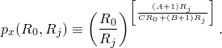

Refer to ["Loading due to an incident dilatational wave field," Section 6.3.1 of the Abaqus Theory Guide](../stm/stm-link.md#stm-ldc-undexloads), for details of the generalized spatial decay formulation.

In Abaqus incident wave interactions can be used to simulate diffuse incident fields. Diffuse fields are characteristic of reverberant spaces or other situations in which waves from many directions strike a surface. For example, reverberant chambers are constructed intentionally in acoustic test facilities for sound transmission loss measurements. The diffuse field model used in Abaqus, as shown in [Figure 34.4.6--2](pt07ch34s04aus125.md#pacoustic-iwidiffuse), allows you to specify a seed number ;  deterministic incident plane waves travel along vectors distributed over a hemisphere so that the incident power per solid angle approximates a diffuse incident field. 

**Figure 34.4.6–2** Diffuse loading model.


The fluid and the solid surfaces where the incident loading acts are specified in the incident wave loading definition. The incoming wave load is further described by the locations of its source point and of a reference (“standoff”) point where the wave amplitude is specified. For information on how to specify these surfaces and the standoff point, see ["Identifying the fluid and the solid surfaces for incident wave loading](pt07ch34s04aus125.md#usb-prc-pacoustic-incidentwave-surfaces),” and ["The standoff point](pt07ch34s04aus125.md#usb-prc-pacoustic-incidentwave-standoff)” below. For a planar wave the specified locations of the source and the standoff points are used to define the direction of wave propagation.

The speed of the incident wave is prescribed by giving the properties for the incident wave-bearing acoustic medium. These specified properties should be consistent with the properties specified for the fluid discretized using acoustic elements.

For the preferred interface you must define nodes corresponding to the source and standoff points for the incident wave; the node numbers or set names must be specified for each incident wave definition. The node set names, if used, must contain only a single node. Neither the source node nor the standoff node should be connected to any elements in the model.

| **Input File Usage: ** | ``` [*INCIDENT WAVE INTERACTION PROPERTY](../key/key-link.md#usb-kws-mincidentwaveinteractionproperty), NAME=*wave property name*, TYPE=PLANE or SPHERE *speed of sound, fluid mass density, A, B, C* [*INCIDENT WAVE INTERACTION](../key/key-link.md#usb-kws-hincidentwaveinteraction), PROPERTY=*wave property name* *fluid surface name*, *source node*, *standoff node*, *reference magnitude* ``` |
| --- | --- |
|  | The constants *A*, *B*, and *C* apply only for spherical incident waves with generalized spatial decay propagation. ``` [*INCIDENT WAVE INTERACTION PROPERTY](../key/key-link.md#usb-kws-mincidentwaveinteractionproperty), NAME=*wave property name*, TYPE=DIFFUSE *speed of sound, fluid mass density* [*INCIDENT WAVE INTERACTION](../key/key-link.md#usb-kws-hincidentwaveinteraction), PROPERTY=*wave property name* *fluid surface name*, *source node*, *standoff node*, *reference magnitude, N* ``` The seed number *N* generates planar incident waves with directions distributed on a hemisphere centered at the standoff point. |

| **Abaqus/CAE Usage: ** | Interaction module: **Create Interaction Property**: **Name**: *wave property name* and **Incident wave**, **Speed of sound in fluid**: *speed of sound*, **Fluid density**: *fluid mass density* |
| --- | --- |
|  | Select one of the following definitions: **Definition**: **Planar** **Definition**: **Spherical**, **Propagation model**: **Acoustic** **Definition**: **Spherical**, **Propagation model**: **Generalized decay**, enter values for **A**, **B**, and **C** **Definition**: **Diffuse**, **Seed number**: *N* **Create Interaction**: **Incident wave**: select the source point, select the standoff point, select the region: **Wave property**: *wave property name*, **Reference magnitude**: *reference magnitude* |

##### Identifying the fluid and the solid surfaces for incident wave loading

In the scattered wave formulation the incident wave loading must be specified on all fluid and solid surfaces that reflect the incident wave with two exceptions:
- those fluid surfaces that have the pressure values directly prescribed using boundary conditions; and
- those fluid surfaces that have symmetry conditions (the symmetry must hold for both the loading and the geometry).

In problems with a fluid-solid interface both surfaces must be specified in the incident wave loading definition for the scattered formulation. See ["Example: submarine close to the free surface](pt07ch34s04aus125.md#usb-prc-pacoustic-incidentwave-subfreesurface),” shown in [Figure 34.4.6--4](pt07ch34s04aus125.md#pacoustic-subnearfreesurf).

When the total pressure-based formulation is specified, the incident wave loading must be specified only on the fluid surfaces that border the infinite region that is excluded from the model. Typically, these surfaces have a nonreflecting radiation condition specified on them, and the implementation ensures that the radiation condition is enforced only on the scattered response of the modeled domain and not on the incident wave itself. See ["Example: submarine close to the free surface](pt07ch34s04aus125.md#usb-prc-pacoustic-incidentwave-subfreesurface),” and ["Example: surface ship](pt07ch34s04aus125.md#usb-prc-pacoustic-incidentwave-surfaceship),” shown in [Figure 34.4.6--4](pt07ch34s04aus125.md#pacoustic-subnearfreesurf) and [Figure 34.4.6--5](pt07ch34s04aus125.md#pacoustic-surfaceship), respectively.

In certain problems, such as blast loads in air, you may decide that the blast wave loads on a structure need to be modeled, but the surrounding fluid medium itself does not. In these problems the incident wave loading is specified only on the solid surfaces since the fluid medium is not modeled. The distinction between the scattered wave formulation and the total wave formulation for handling the incident wave loading is not relevant in these problems since the wave propagation in the fluid medium is of no interest.

##### The standoff point

In transient analyses the standoff point is a reference point used to specify the pulse loading time history: it is the point at which the user-defined pulse history is assumed to apply with no time delay, phase shift, or spreading loss. In steady-state analyses using discrete planar or spherical sources, the standoff point is the point at which the incident field has zero phase.

In transient analyses the standoff point should be defined so that it is closer to the source than any point on the surfaces in the model that would reflect the incident wave. Doing so ensures that all the points on these surfaces will be loaded with the specified time history of the source and that the analysis begins before the wave overtakes any portion of these surfaces. To save analysis time, the standoff point is typically on or near the solid surface where the incoming incident wave would be first deflected (see ["Example: submarine close to the free surface](pt07ch34s04aus125.md#usb-prc-pacoustic-incidentwave-subfreesurface),” shown in [Figure 34.4.6--4](pt07ch34s04aus125.md#pacoustic-subnearfreesurf)). However, the standoff point is a fixed point in the analysis: if the loaded surfaces move before the incident wave loading begins, due to previous analysis steps or geometric adjustments, the surfaces may envelop the specified standoff point. Care should be taken to define a standoff point such that it remains closer to the incident wave source point than any point on the loaded surfaces at the onset of the loading.

When the total wave formulation is used and the incident wave loading is specified in the first step of the analysis in terms of pressure history, Abaqus automatically initializes the pressure and the pressure rate at the acoustic nodes to values based on the incident wave loading. This allows the acoustic analysis to start with the incident waves partially propagated into the problem domain at time zero and assumes that this propagation had taken place with negligible effect of any volumetric dissipative sources such as the fluid drag. When the incident wave loading is specified in terms of the pressure values, the recommendations given above for selecting a standoff point are valid with the total wave formulation as well. However, when the incident wave loading is specified in terms of acceleration values, the automatic initialization is not done and the standoff point should be located near the exterior fluid boundary of the model such that the standoff point is closer to the source than any point on the exterior boundary.  See ["Example: submarine close to the free surface](pt07ch34s04aus125.md#usb-prc-pacoustic-incidentwave-subfreesurface),” and ["Example: surface ship](pt07ch34s04aus125.md#usb-prc-pacoustic-incidentwave-surfaceship),” shown in [Figure 34.4.6--4](pt07ch34s04aus125.md#pacoustic-subnearfreesurf) and [Figure 34.4.6--5](pt07ch34s04aus125.md#pacoustic-surfaceship), respectively.

In steady-state analyses the role of the standoff point is somewhat different. When the incident wave interaction property is of planar or spherical type, you define the real and imaginary parts of the magnitude at the standoff point. Separately, the specified real and imaginary incident waves are taken to have zero phase at the standoff point (combined, these two waves could be equivalent to a single wave with nonzero phase at the standoff). Every location on the loaded surface has a phase shift in the applied pressure or acoustic traction, corresponding to the difference in propagation time between the loaded point and the standoff. This means that an incident wave defined, for example, with a pure real value at the standoff point generates both real and imaginary tractions at all the other points on the loaded surface.

When the incident wave is of diffuse type, the role of the standoff and source points is primarily to orient the loaded surface with respect to the incoming reverberant field. The model used for diffuse incident wave loading applies a set of deterministically defined plane waves, whose directions are defined as vectors connecting the standoff point and an array of points on a hemisphere. This hemisphere is centered at the standoff point, and its apex is the source point. The array of points is set according to the specified seed, , and a deterministic algorithm that arranges  points on the hemisphere. The algorithm concentrates the points so that the incident waves in the diffuse field model are concentrated at normal incidence, with fewer waves at oblique angles. The specified amplitude value and reference magnitude are divided equally among the  incident waves. The orientation of the hemisphere containing the incident waves in the diffuse model is the same for all of the points on the loaded surface—it does not vary with the local normal vector on the surface.

##### Defining the amplitude of the source pulse

For transient analyses the time history to be specified by the user is that observed at the standoff point: histories at a point on the loaded surface are computed from the wave type and the location of that point relative to the standoff point. The time history of the acoustic source pulse can be defined either in terms of the fluid pressure values or the fluid particle acceleration values. Pressure time histories can be used for any type of element, such as acoustic, structural, or solid elements; acceleration time histories are applicable only for acoustic elements. In either case a reference magnitude is specified for any given incident-wave-loaded surface, and a reference to a time-history data table defined by an amplitude curve is specified. The reference magnitude varies with time according to the amplitude definition.

For steady-state dynamic analyses the amplitude definition specified as part of the incident wave interaction definition is interpreted as the frequency dependence of the wave at the standoff point.

Currently the source pulse description in terms of fluid particle acceleration history is limited to planar incident waves acting on fluid surfaces in transient analyses. Further, if an impedance condition is specified on the same fluid surface along with incident wave loading, the source pulse is restricted to the pressure history type even for planar incident waves. The source pulse in terms of pressure history can be used without these limitations; i.e., pressure-history-based incident wave loading can be used with fluid or solid surfaces, with or without impedance, and for both planar and spherical incident waves.

When the source pulse is specified using pressure values and is applied on a fluid surface, the pressure gradient is computed and applied as a pressure-conjugate load on these surfaces. Hence, it is desirable to define the pulse amplitude to begin with a zero value, particularly when the cavitation in the fluid is a concern. If the structural response is of primary concern and the scattered formulation is being used, any initial jump in the pressure amplitude can be addressed by applying additional concentrated loads on the structural nodes that are tied to the acoustic mesh, corresponding to the initial jump in the incident wave pressure amplitude. Clearly, the additional load on any given structural node should be active from the instance the incident wave first arrives at that structural node. However, the scattered wave solution in the fluid still needs careful interpretation taking the initial jump into account.

| **Input File Usage: ** | Use the following option to define the time history in terms of fluid pressure values: |
| --- | --- |
|  | ``` [*INCIDENT WAVE INTERACTION](../key/key-link.md#usb-kws-hincidentwaveinteraction), PRESSURE AMPLITUDE=*amplitude data table name* *solid or fluid surface name*, *source node*, *standoff node*, *reference magnitude* ``` Use the following option to define the time history in terms of fluid particle acceleration values: ``` [*INCIDENT WAVE INTERACTION](../key/key-link.md#usb-kws-hincidentwaveinteraction), ACCELERATION AMPLITUDE=*amplitude data table name* *fluid surface name*, *source node*, *standoff node*, *reference magnitude* ``` Use the following option to define the real part of the loading (default): ``` [*INCIDENT WAVE INTERACTION](../key/key-link.md#usb-kws-hincidentwaveinteraction), REAL ``` Use the following option to define the imaginary part of the loading: ``` [*INCIDENT WAVE INTERACTION](../key/key-link.md#usb-kws-hincidentwaveinteraction), IMAGINARY ``` |

| **Abaqus/CAE Usage: ** | Interaction module: **Create Interaction**: **Incident wave**: select the source point, select the standoff point, select the region: **Reference magnitude**: *reference magnitude* |
| --- | --- |
|  | Use the following options to define the time history in terms of fluid pressure values or fluid particle acceleration values: **Definition**: **Pressure** or **Acceleration**, **Pressure amplitude** or **Acceleration amplitude**: *amplitude data table name* Use the following options to define the real or imaginary part of the loading: Toggle on **Real amplitude** and/or **Imaginary amplitude**: *amplitude data table name* |

##### Defining bubble loading for spherical incident wave loading

An underwater explosion forms a highly compressed gas bubble that interacts with the surrounding water, generating an outward-propagating shock wave. The gas bubble floats upward as it generates these waves changing the relative positions of the source and the loaded surfaces. The loading effects due to bubble formation can be defined for spherical incident wave loading by using a bubble definition in conjunction with the incident wave loading definition.

The bubble dynamics can be described using a model internal to Abaqus or by using tabulated data. Abaqus has a built-in mechanical model of the bubble interacting with the surrounding fluid, which is simulated numerically to generate a set of data prior to running the finite element analysis. You can specify the explosive material parameters, ending time, and other parameters that affect the computation of the bubble amplitude curve used,  as shown in [Table 34.4.6--2](pt07ch34s04aus125.md#bubble-param).  

**Table 34.4.6–2** Parameters that define the bubble behavior.
| Name | Dimensions | Description | Default |
| --- | --- | --- | --- |
|  | [FL2(LM1/3)1+A](../popups/usb-int-iconventions-unitsym.md) | Charge constant | None |
|  | [T/(M](../popups/usb-int-iconventions-unitsym.md)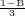[LB)](../popups/usb-int-iconventions-unitsym.md) | Charge constant | None |
|  | Dimensionless | Similitude spatial exponent | None |
|  | Dimensionless | Similitude temporal exponent | None |
| 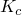 | [F/L2](../popups/usb-int-iconventions-unitsym.md) | Charge constant | None |
|  | Dimensionless | Ratio of specific heats for explosion gas | None |
|  | [M/L3](../popups/usb-int-iconventions-unitsym.md) | Charge material density | None |
|  | [M](../popups/usb-int-iconventions-unitsym.md) | Mass of charge | None |
|  | [L](../popups/usb-int-iconventions-unitsym.md) | Initial charge depth | None |
|  | Dimensionless | *X*-direction cosine of the free surface normal | None |
| 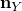 | Dimensionless | *Y*-direction cosine of the free surface normal | None |
|  | Dimensionless | *Z*-direction cosine of the free surface normal | None |
|  | [L/T2](../popups/usb-int-iconventions-unitsym.md) | Acceleration due to gravity | None |
| 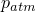 | [F/L2](../popups/usb-int-iconventions-unitsym.md) | Atmospheric pressure at free surface | None |
|  | Dimensionless | Wave effect parameter | 1.0 |
|  | Dimensionless | Bubble drag coefficient | 0.0 |
|  | Dimensionless | Bubble drag exponent | 2.0 |
| 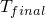 | [T](../popups/usb-int-iconventions-unitsym.md) | Maximum allowable time in bubble simulation | None |
|  | Dimensionless | Maximum allowable number of steps in bubble simulation | 1500 |
|  | Dimensionless | Relative error tolerance parameter for bubble simulation | 1 1011 |
| 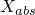 | Dimensionless | Absolute error tolerance parameter for bubble simulation | 1 1011 |
|  | Dimensionless | Error control exponent for bubble simulation | 0.2 |
|  | [M/L3](../popups/usb-int-iconventions-unitsym.md) | Fluid mass density | None |
|  | [L/T](../popups/usb-int-iconventions-unitsym.md) | Fluid speed of sound | None |

 All of the parameters specified affect only the bubble amplitude; other physical parameters in the problem are independent. You can suppress the effects of wave loss in the bubble dynamics and introduce empirical flow drag, if desired. Detailed information about the bubble mechanical model is given in ["Loading due to an incident dilatational wave field," Section 6.3.1 of the Abaqus Theory Guide](../stm/stm-link.md#stm-ldc-undexloads).

In an underwater explosion event a bubble migrates upward toward, and possibly reaches, the free water surface. If the bubble migration reaches the free water surface during the specified analysis time, Abaqus applies loads of zero magnitude after this point.

Model data about the bubble simulation are written to the data (`.dat`) file. During an Abaqus/Standard analysis history data are written each increment to the output database (`.odb`) file. The history data include the radius of the bubble and the bubble depth below the free water surface. For reference, the pressure and acoustic load quantities at the standoff point are also written to the data file; these load terms include the direct plane-wave term and the spherical spreading (“afterflow”) effect (see ["Loading due to an incident dilatational wave field," Section 6.3.1 of the Abaqus Theory Guide](../stm/stm-link.md#stm-ldc-undexloads)). 

For the preferred interface the loading effects due to bubble formation can be defined for spherical incident wave loading using the UNDEX charge property definition. Because the bubble simulation uses spherical symmetry, the incident wave interaction property must define a spherical wave.

| **Input File Usage: ** | Use the following options to specify loading effects due to bubble formation using the UNDEX charge property definition: |
| --- | --- |
|  | ``` [*INCIDENT WAVE INTERACTION PROPERTY](../key/key-link.md#usb-kws-mincidentwaveinteractionproperty), NAME=*wave property name*, TYPE=SPHERE [*UNDEX CHARGE PROPERTY](../key/key-link.md#usb-kws-mundexchargeproperty) *data defining the UNDEX charge* [*INCIDENT WAVE INTERACTION](../key/key-link.md#usb-kws-hincidentwaveinteraction), PROPERTY=*wave property name*, UNDEX *fluid surface name*, *source node*, *standoff node*, *reference magnitude* ``` |

| **Abaqus/CAE Usage: ** | Use the following input to specify loading effects due to bubble formation using the UNDEX charge property definition: |
| --- | --- |
|  | Interaction module: **Create Interaction Property**: **Name**: *wave property name* and **Incident wave**: **Definition**: **Spherical**, **Propagation model**: **UNDEX charge**, enter data defining the UNDEX charge **Create Interaction**: **Incident wave**: **Definition**: **UNDEX**, **Wave property**: *wave property name*, enter data defining the UNDEX charge Use the following input to specify pressure at the standoff point using tabulated data: Load or Interaction module: **Create Amplitude**: **Name**: *pressure* and select **Tabular** Interaction module: **Create Interaction**: **Incident wave**: select the standoff point: **Definition**: **Pressure**, **Pressure amplitude**: *pressure* Use the following input to specify source node location time histories using tabulated data: Load or Interaction module: **Create Amplitude**: **Name**: *name* and select **Tabular** Load module: **Create Boundary Condition**: select step: **Displacement/Rotation** or **Velocity/Angular velocity**: select the source node as the region and toggle on the degree or degrees of freedom, **Amplitude**: *name* |

##### Modeling incident wave loading on a moving structure

To model the effect of relative motion between a structure (such as a ship) and the wave source during the analysis using the preferred interface, the source node may be assigned a velocity. It is assumed that the entire fluid-solid model is moving at a velocity with respect to the source node during the loading and that the speed of the model's motion is low compared to the speed of propagation of the incident wave. That is, the effect of the speed of the source is neglected in the computation of the loads, but the change in position of the source is included. This is equivalent to assuming that the relative motion between the source and the model is at a low Mach number. Relative motion can be specified only for transient analyses.

In addition to prescribing boundary conditions at the source node, a small mass element must be defined at the source node.

| **Input File Usage: ** | Use the following option to assign a velocity to the source node: |
| --- | --- |
|  | ``` [*BOUNDARY](../key/key-link.md#usb-kws-hboundary), TYPE=DISPLACEMENT *or* VELOCITY, AMPLITUDE=*name* *source node*, *degrees of freedom* ``` |

| **Abaqus/CAE Usage: ** | Load module: **Create Boundary Condition**: select step: **Velocity/Angular velocity** or **Displacement/Rotation**: select regions and toggle on the degree or degrees of freedom, **Amplitude**: *name* |
| --- | --- |

##### Specifying the reflection effects

The waves emanating from the source may reflect off plane surfaces, such as seabeds or sea surfaces, before reaching the specified standoff point. Thus, the incident wave loading consists of the waves arriving from a direct path from the source, as well as those arriving from reflections off the planes. In Abaqus an arbitrary number of these planes can be defined, each with its own location, orientation, and reflection coefficient.

If no reflection coefficient is specified, the plane is assumed to be nonreflective; a zero reflected pressure is applied. If a reflection coefficient is specified, the magnitude of the reflected waves are modified by the reflection coefficient  according to the formula: 


Only real values for  are used.

The reflection planes are allowed only for incident waves that are defined in terms of fluid pressure values. Only one reflection off each plane is considered. If the effect of many successive reflections is important, these surfaces should be part of the finite element model. Reflection planes should not be used at a boundary of the finite element model if the total wave formulation is used, since in that case the incident wave will be reflected automatically by that boundary.

| **Input File Usage: ** | Use the following option in conjunction with the [*INCIDENT WAVE INTERACTION](../key/key-link.md#usb-kws-hincidentwaveinteraction) option to define an incident wave reflection plane: |
| --- | --- |
|  | ``` [*INCIDENT WAVE REFLECTION](../key/key-link.md#usb-kws-hincidentwavereflection) ``` |

| **Abaqus/CAE Usage: ** | Incident wave reflections are not supported in Abaqus/CAE. |
| --- | --- |

##### Boundary with prescribed pressure

The acoustic pressure degree of freedom at nodes of acoustic elements can be prescribed using a boundary condition. However, since you can use the nodal acoustic pressure in an Abaqus analysis to refer to the total pressure at that point or to only the scattered component, care must be exercised in some circumstances.

When the total wave formulation is used, a boundary condition alone is sufficient to specify a prescribed total dynamic pressure on a boundary.

In an analysis without incident wave loading, the nodal degree of freedom is generally equal to the total acoustic pressure at that point. Therefore, its value can be prescribed using a boundary condition in a manner consistent with other boundary conditions in Abaqus. For example, you may set the acoustic pressure at all of the nodes at a duct inlet to a prescribed amplitude to analyze the propagation of waves along the duct. The free surface of a body of water can be modeled by setting the acoustic pressure to zero at the surface.

When incident wave loading is used, the scattered wave formulation defines the nodal acoustic degree of freedom to be equal to the scattered pressure. Consequently, a boundary condition definition for this degree of freedom affects the scattered pressure only. The total acoustic pressure at a node is not directly accessible in this formulation. Specification of the total pressure in a scattered formulation analysis is nevertheless required in some instances (for example, when modeling a free surface of a body of water). In this case, one of the following methods should be used.

If the fluid surface with prescribed total pressure is planar, unbroken, and of infinite extent, an incident wave reflection plane and a boundary condition can be used together to model the fact that the total pressure is zero on the free surface. A “soft” incident wave reflection plane coincident with the free surface will make sure that the structure is subjected to the incident wave load reflected off the free surface. A boundary condition setting the acoustic pressure in the surface equal to zero will make sure that any scattered waves emitted by the structure are reflected properly. The scattered wave solution in the fluid must be interpreted taking into consideration the fact that the incident field now includes a reflection of the source as well. If the fluid surface with prescribed total pressure is planar but broken by an object, such as a floating ship, this modeling technique may still be applied. However, the reflected loads due to the incident wave are computed as if the reflection plane passes through the hull of the ship; this approximation neglects some diffraction effects and may or may not be applicable in all situations of interest.

Alternatively, the free surface condition of the fluid can be eliminated by modeling the top layer of the fluid using structural elements, such as membrane elements, instead of acoustic elements. The “structural fluid” surface and the “acoustic fluid” surface are then coupled using either a surface-based mesh tie constraint (["Mesh tie constraints," Section 35.3.1](pt08ch35s03aus132.md)) or, in Abaqus/Standard, acoustic-structural interface elements; and the incident wave loading must be applied on both the “structural fluid” and the “acoustic fluid” surfaces. The material properties of the “structural fluid” elements should be similar to those of the adjacent acoustic fluid. In Abaqus/Explicit the thickness of the “structural fluid” elements must be such that the masses at nodes on either side of the coupling constraint are nearly equal. This modeling technique allows the geometry of the surface on which total pressure is to be prescribed to depart from an unbroken, infinite plane. As a secondary benefit of this technique, you can obtain the velocity profile on the free surface since the displacement degrees of freedom are now activated at the “structural fluid” nodes. If a nonzero pressure boundary condition is desired, it can be applied as a distributed loading on the other side of the “structural fluid” elements. 

| **Input File Usage: ** | Use the following options for the first modeling technique with the default scattered wave formulation: |
| --- | --- |
|  | ``` [*BOUNDARY](../key/key-link.md#usb-kws-hboundary) [*INCIDENT WAVE REFLECTION](../key/key-link.md#usb-kws-hincidentwavereflection) ``` Use the following option for the second modeling technique with the default scattered wave formulation: ``` [*TIE](../key/key-link.md#usb-kws-mtie) [*INCIDENT WAVE INTERACTION](../key/key-link.md#usb-kws-hincidentwaveinteraction) ``` Use the following option with the total wave formulation: ``` [*BOUNDARY](../key/key-link.md#usb-kws-hboundary) ``` |

| **Abaqus/CAE Usage: ** | Load module: **Create BC**: choose **Other** for the **Category** and **Acoustic pressure** for the **Types for Selected Step** |
| --- | --- |

##### Defining air blast loading for incident shock waves using the CONWEP model in Abaqus/Explicit

An explosion in air forms a highly compressed gas mass that interacts with the surrounding air, generating an outward-propagating shock wave. The loading effects due to an explosion in air can be defined, for spherical incident waves (air blast) or hemispherical incident waves (surface blast), by empirical data provided by the CONWEP model in conjunction with the incident wave loading definition.

Unlike an acoustic wave, a blast wave corresponds to a shock wave with discontinuities in pressure, density, etc. across the wave front. [Figure 34.4.6--3](pt07ch34s04aus125.md#pacoustic-blastwavepressure) shows a typical pressure history of a blast wave. 

**Figure 34.4.6–3** Pressure history of a blast wave.

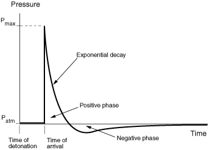

The CONWEP model uses a scaled distance based on the distance of the loading surface from the source of the explosion and the amount of explosive detonated. For a given scaled distance, the model provides the following empirical data: the maximum overpressure (above atmospheric), the arrival time, the positive phase duration, and the exponential decay coefficient for both the incident pressure and the reflected pressure. Using these parameters, the entire time history of both the incident pressure and reflected pressure as shown in [Figure 34.4.6--3](pt07ch34s04aus125.md#pacoustic-blastwavepressure) can be constructed. Use of a standoff point is not required.

The total pressure, 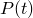, on a surface due to the blast wave is a function of the incident pressure, 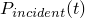, the reflected pressure, 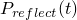, and the angle of incidence, , which is defined as the angle between the normal of the loading surface and the vector that points from the surface to the explosion source. The total pressure is defined as 

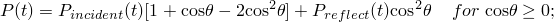


The air blast loading due to the total pressure can be scaled using a magnitude scale factor.

A detonation time can be specified if the explosion does not occur at the start of the analysis. The detonation time needs to be given in total time; see ["Conventions," Section 1.2.2](pt01ch01s02aus02.md), for a description of the time convention. The arrival time at a location is defined as the elapsed time for the wave to arrive at that location after detonation.

The CONWEP empirical data are given in a specific set of units, which must be converted to the units used in the analysis. You will need to specify multiplying factors for conversion of these units to SI units. For the specification of the mass of the explosive in TNT equivalence, you can choose any convenient mass unit, which can be different from the mass unit used in the analysis. For computation of the pressure loading, you will need to specify multiplying factors for conversion of length, time, and pressure units used in the analysis to SI units. Some typical conversion multiplier values are given in [Table 34.4.6--3](pt07ch34s04aus125.md#conversion-multipliers). 

**Table 34.4.6–3** Multipliers used in conjunction with the CONWEP model for conversion to SI units.
| Quantity | Unit | SI Unit | Multiplier for conversion to SI |
| --- | --- | --- | --- |
| Mass | ton | kg | 1000 |
| Mass | lb | kg | 0.45359 |
| Length | mm | m | 0.001 |
| Length | ft | m | 0.3048 |
| Time | msec | sec | 0.001 |
| Pressure | MPa | Pa | 106 |
| Pressure | psi | Pa | 6894.8 |
| Pressure | psf | Pa | 47.88 |

For any given amount of explosive, the CONWEP empirical data are valid only within a range of distances from the source. The minimum distance at which the data are valid corresponds to the charge radius. Thus, the analysis terminates if the distance of any part of the loading surface from the source is less than the charge radius. For distances that are larger than the maximum valid range, linear extrapolation is used up to an extended maximum range where the reflected pressure decreases to zero. No loading is applied beyond the extended maximum range.

The CONWEP empirical data do not account for shadowing by intervening objects or for any effects due to confinement. In the definition of incident wave interaction using the CONWEP model, you cannot use incident wave reflection.

The CONWEP pressure load can be requested as element face variable output to the output database file (see ["Abaqus/Explicit output variable identifiers," Section 4.2.2](pt02ch04s02xbv01.md)).

| **Input File Usage: ** | Use the following options to specify loading effects due to explosion in air using the CONWEP charge property definition: |
| --- | --- |
|  | ``` [*INCIDENT WAVE INTERACTION PROPERTY](../key/key-link.md#usb-kws-mincidentwaveinteractionproperty), NAME=*wave property name*, TYPE=AIR BLAST or SURFACE BLAST [*CONWEP CHARGE PROPERTY](../key/key-link.md#usb-kws-mconwepchargeproperty) *data defining the CONWEP charge* [*INCIDENT WAVE INTERACTION](../key/key-link.md#usb-kws-hincidentwaveinteraction), PROPERTY=*wave property name*, CONWEP *loading surface name*, *source node*, * detonation time*, *magnitude scale factor* ``` |

| **Abaqus/CAE Usage: ** | Use the following options to specify loading effects due to explosion in air using the CONWEP charge property definition: |
| --- | --- |
|  | Interaction module: **Create Interaction Property**: **Name**: *wave property name* and **Incident wave**: **Definition**: **Air blast** or **Surface blast**: enter data defining the CONWEP charge Interaction module: **Create Interaction**: **Name**: *incident wave name* and **Incident wave**: select the source point: **CONWEP (Air/Surface blast)**: select the region: **CONWEP Data**: enter data defining the time of detonation and magnitude scale factor |

#### Modifying or removing incident wave loads

Only the incident wave loads that are specified in a particular step are applied in that step; previous definitions are removed automatically. Consequently, incident wave loads that are active during two subsequent steps should be specified in each step. This is akin to the behavior that can be specified for other types of loads by releasing any load of that type in a step (see ["Applying loads: overview," Section 34.4.1](pt07ch34s04aus120.md)).

#### Alternative incident wave loading interface

In general, the concepts of the alternative incident wave loading interface are the same as the preferred interface; however, the syntax for specifying the incident wave loading is different. The preferred incident wave loading interface is supported in Abaqus/CAE. The alternative interface is not supported in Abaqus/CAE. For conceptual information, see ["Incident wave loading due to external sources](pt07ch34s04aus125.md#usb-prc-pacoustic-incidentwave).”

##### Prescribing the geometric properties and the speed of the incident wave (alternative interface)

Conceptually, the alternative interface is the same as the preferred interface; however, the usages are different. For conceptual information, see ["Prescribing geometric properties and the speed of the incident wave](pt07ch34s04aus125.md#usb-prc-pacoustic-incidentwave-properties).”

| **Input File Usage: ** | ``` [*INCIDENT WAVE PROPERTY](../key/key-link.md#usb-kws-mincidentwaveproperty), NAME=*wave property name*, TYPE=PLANE *or* SPHERE *data lines to specify the location of the acoustic source and the standoff point* [*INCIDENT WAVE FLUID PROPERTY](../key/key-link.md#usb-kws-mincidentwavefluid) *bulk modulus*, *mass density* [*INCIDENT WAVE](../key/key-link.md#usb-kws-hincidentwave), PROPERTY=*wave property name* ``` |
| --- | --- |

| **Abaqus/CAE Usage: ** | The alternative incident wave loading interface is not supported in Abaqus/CAE. |
| --- | --- |

##### Defining the time history of the source pulse (alternative interface)

Conceptually, the alternative interface is the same as the preferred interface; however, the usages are different. For conceptual information, see ["Defining the amplitude of the source pulse](pt07ch34s04aus125.md#usb-prc-pacoustic-incidentwave-source).”

| **Input File Usage: ** | Use the following option to define the time history in terms of fluid pressure values: |
| --- | --- |
|  | ``` [*INCIDENT WAVE](../key/key-link.md#usb-kws-hincidentwave), PRESSURE AMPLITUDE=*amplitude data table name* *solid or fluid surface name*, *reference magnitude* ``` Use the following option to define the time history in terms of fluid particle acceleration values: ``` [*INCIDENT WAVE](../key/key-link.md#usb-kws-hincidentwave), ACCELERATION AMPLITUDE=*amplitude data table * *name* *fluid surface name*, *reference magnitude* ``` |

| **Abaqus/CAE Usage: ** | The alternative incident wave loading interface is not supported in Abaqus/CAE. |
| --- | --- |

##### Defining bubble loading for spherical incident wave loading (alternative interface)

Conceptually, the alternative interface is the same as the preferred interface; however, the usages are different. For conceptual information, see ["Defining bubble loading for spherical incident wave loading](pt07ch34s04aus125.md#usb-prc-pacoustic-bubble).”

To define the bubble dynamics using a model internal to Abaqus, you can specify a bubble amplitude. Use of the bubble loading amplitude is generally similar to the use of any other amplitude in Abaqus.

| **Input File Usage: ** | Use the following options: |
| --- | --- |
|  | ``` [*AMPLITUDE](../key/key-link.md#usb-kws-mamplitude), DEFINITION=BUBBLE, NAME=*name* [*INCIDENT WAVE PROPERTY](../key/key-link.md#usb-kws-mincidentwaveproperty), TYPE=SPHERE, NAME=*wave property name* [*INCIDENT WAVE](../key/key-link.md#usb-kws-hincidentwave), PRESSURE AMPLITUDE=*name* *solid or fluid surface name*, *reference magnitude* ``` |

| **Abaqus/CAE Usage: ** | The alternative incident wave loading interface is not supported in Abaqus/CAE. |
| --- | --- |

##### Specifying the reflection effects (alternative interface)

Conceptually, the alternative interface is the same as the preferred interface; however, the usages are different. For conceptual information, see ["Specifying the reflection effects](pt07ch34s04aus125.md#usb-prc-pacoustic-incidentwave-reflection).”

| **Input File Usage: ** | Use the following option in conjunction with the [*INCIDENT WAVE](../key/key-link.md#usb-kws-hincidentwave) option to define an incident wave reflection plane: |
| --- | --- |
|  | ``` [*INCIDENT WAVE REFLECTION](../key/key-link.md#usb-kws-hincidentwavereflection) ``` |

| **Abaqus/CAE Usage: ** | The alternative incident wave loading interface is not supported in Abaqus/CAE. |
| --- | --- |

##### Modeling incident wave loading on a moving structure (alternative interface)

To model the effect of rigid motion of a structure such as a ship during the incident wave loading history, the standoff point can have a specified velocity. It is assumed that the entire fluid-solid model is moving at this velocity with respect to the source point during the loading and that the speed of the model's motion is low compared to the speed of propagation of the incident wave.

| **Input File Usage: ** | ``` [*INCIDENT WAVE PROPERTY](../key/key-link.md#usb-kws-mincidentwaveproperty), NAME=*wave property name* *data line to specify the velocity of the standoff point* ``` |
| --- | --- |

| **Abaqus/CAE Usage: ** | The alternative incident wave loading interface is not supported in Abaqus/CAE. |
| --- | --- |

#### Example: submarine close to the free surface

The problem shown in [Figure 34.4.6--4](pt07ch34s04aus125.md#pacoustic-subnearfreesurf) has the following features: a free surface , seabed 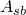 as a reflection plane, a wet solid surface , the fluid surface  that is tied to the solid surface , and the boundary  of the finite modeled domain separating the infinite acoustic medium. The source *S* of the underwater explosion loading is also shown. 

**Figure 34.4.6–4** Incident wave loading on a submarine lying near a free surface.


##### Scattered wave solution

Here the scattered wave response in the acoustic medium is of interest along with that of the structure to the incident wave loading. Cavitation in the fluid is not considered in a scattered wave formulation. Similarly, the initial hydrostatic pressure in the fluid is not modeled.

The zero dynamic acoustic pressure boundary condition on the free surface requires both a “soft” reflection plane coinciding with the free surface  and a zero scattered pressure boundary condition at the nodes on this free surface. The incident wave loading is applied on the fluid surface, , and on the wet solid surface, . The incident wave loading can be only of pressure amplitude type since the loading includes a solid surface.

A good location for the standoff node is marked as *A* in [Figure 34.4.6--4](pt07ch34s04aus125.md#pacoustic-subnearfreesurf). This node is in the fluid, close to the structure, and closer to incident wave source *S* than any portion of the seabed or the free surface. The standoff node's offset from the loaded surfaces is exaggerated for emphasis in the figure.

The radiation condition is specified on the acoustic surface  such that the scattered wave impinging on this boundary with the infinite medium does not reflect back into the computational domain. The seabed is modeled with an incident wave reflection plane on surface . The reflection loss at this seabed surface is modeled using an impedance property.

If the response of the structure in the nonlinear regime is of interest, the initial stress state in the structure should be established using Abaqus/Standard in a static analysis. The stress state in the structure is then imported into Abaqus/Explicit, and the loading on the solid surfaces causing the initial stress state is respecified in the acoustic analysis.

The following template schematically shows some of the Abaqus input file options that are used to solve this problem using the scattered wave formulation:

```
[*HEADING](../key/key-link.md#usb-kws-mheading)
…
[*SURFACE](../key/key-link.md#usb-kws-msurface), NAME= 
*Data lines to define the acoustic surface that is wetting the solid*
[*SURFACE](../key/key-link.md#usb-kws-msurface), NAME= 
*Data lines to define the solid surface that is wetted by the fluid*
[*SURFACE](../key/key-link.md#usb-kws-msurface), NAME= 
*Data lines to define the acoustic surface separating the modeled region from the infinite medium*
[*INCIDENT WAVE INTERACTION PROPERTY](../key/key-link.md#usb-kws-mincidentwaveinteractionproperty), NAME=IWPROP
[*AMPLITUDE](../key/key-link.md#usb-kws-mamplitude), DEFINITION=TABULAR, NAME=PRESSUREVTIME
[*TIE](../key/key-link.md#usb-kws-mtie), NAME=COUPLING
*, * 
[*STEP](../key/key-link.md#usb-kws-hstep)
** For an Abaqus/Standard analysis:
[*DYNAMIC](../key/key-link.md#usb-kws-hdynamic)
** For an Abaqus/Explicit analysis:
[*DYNAMIC](../key/key-link.md#usb-kws-hdynamic), EXPLICIT
** Load the acoustic surface
[*INCIDENT WAVE INTERACTION](../key/key-link.md#usb-kws-hincidentwaveinteraction), PRESSURE AMPLITUDE=PRESSUREVTIME,
PROPERTY=IWPROP
*, source node, standoff node, reference magnitude*
[*INCIDENT WAVE REFLECTION](../key/key-link.md#usb-kws-hincidentwavereflection)
*Data lines for the reflection plane over the seabed , seabed_Q* 
[*INCIDENT WAVE REFLECTION](../key/key-link.md#usb-kws-hincidentwavereflection)
*Data lines for a "soft" reflection plane over the free surface .*
** Load the solid surface
[*INCIDENT WAVE INTERACTION](../key/key-link.md#usb-kws-hincidentwaveinteraction), PRESSURE AMPLITUDE=PRESSUREVTIME,
PROPERTY=IWPROP
*, source node, standoff node, reference magnitude*
[*INCIDENT WAVE REFLECTION](../key/key-link.md#usb-kws-hincidentwavereflection)
*Data lines for the reflection plane over the seabed ,  seabed_Q* 
[*INCIDENT WAVE REFLECTION](../key/key-link.md#usb-kws-hincidentwavereflection)
*Data lines for a "soft" reflection plane over the free surface .*
[*BOUNDARY](../key/key-link.md#usb-kws-hboundary)
** zero pressure boundary condition on the free surface
*Set of nodes on the free surface , 8, 8, 0.0*
[*SIMPEDANCE](../key/key-link.md#usb-kws-hsimpedance)
*, *
[*END STEP](../key/key-link.md#usb-kws-hendstep)
```

##### Total wave solution

Here the total wave response in the acoustic medium is of interest along with that of the structure to the incident wave loading. Cavitation in the fluid may be included. Similarly, a linearly varying initial hydrostatic pressure in the fluid can be specified. 

The zero dynamic acoustic pressure boundary condition on the free surfaces requires only a zero pressure boundary condition at the nodes on this free surface. A reflection plane should not be included along the free surface. The incident wave loading is applied only on the fluid surface, , that separates the modeled region from the surrounding infinite acoustic medium. No incident wave should be applied directly on the structure surfaces. If the incident wave is considered planar, an acceleration-type amplitude can be used with the incident wave loading. Otherwise, a pressure-type amplitude must be used with the incident wave loading.

An ideal location for the standoff node depends on the type of amplitude used for the time history of the incident wave loading. The location *A* shown in [Figure 34.4.6--4](pt07ch34s04aus125.md#pacoustic-subnearfreesurf) can be used if the incident wave loading time history is of pressure amplitude type. Otherwise, the location *B* that is just on the boundary  and closer to the source *S* than any part of either the seabed or the free surface can be used.

The nonreflecting impedance condition is specified on the acoustic surface, , such that the scattered part of the total wave impinging on this boundary with the infinite medium does not reflect back into the computational domain. The seabed is modeled with an incident wave reflection plane on the surface . 

If the response of the structure in the nonlinear regime is of interest, the initial stress state in the structure should be established using Abaqus/Standard in a static analysis. The stress state in the structure is then imported into Abaqus/Explicit, and the loading on the solid surfaces causing the initial stress state is respecified in the acoustic analysis.

The following template schematically shows some of the input file options that are used to solve this problem using the total wave formulation:

```
[*HEADING](../key/key-link.md#usb-kws-mheading)
…
[*ACOUSTIC WAVE FORMULATION](../key/key-link.md#usb-kws-macousticwaveform), TYPE=TOTAL WAVE
[*MATERIAL](../key/key-link.md#usb-kws-mmaterial), NAME=CAVITATING_FLUID
[*ACOUSTIC MEDIUM](../key/key-link.md#usb-kws-macousticmed), BULK MODULUS
*Data lines to define the fluid bulk modulus*
[*ACOUSTIC MEDIUM](../key/key-link.md#usb-kws-macousticmed), CAVITATION LIMIT
*Data lines to define the fluid cavitation limit*
…
[*SURFACE](../key/key-link.md#usb-kws-msurface), NAME= 
*Data lines to define the acoustic surface that is wetting the solid*
[*SURFACE](../key/key-link.md#usb-kws-msurface), NAME= 
*Data lines to define the solid surface that is wetted by the fluid*
[*SURFACE](../key/key-link.md#usb-kws-msurface), NAME= 
*Data lines to define the acoustic surface separating the modeled region from the infinite medium*
[*INCIDENT WAVE INTERACTION PROPERTY](../key/key-link.md#usb-kws-mincidentwaveinteractionproperty), NAME=IWPROP
[*AMPLITUDE](../key/key-link.md#usb-kws-mamplitude), DEFINITION=TABULAR, NAME=PRESSUREVTIME
*Data lines to define the pressure-time history at the standoff point*
[*TIE](../key/key-link.md#usb-kws-mtie), NAME=COUPLING
*, * 
[*INITIAL CONDITIONS](../key/key-link.md#usb-kws-minitialcond), TYPE=ACOUSTIC STATIC PRESSURE
*Data lines to define the initial linear hydrostatic pressure in the fluid*
[*STEP](../key/key-link.md#usb-kws-hstep)
[*DYNAMIC](../key/key-link.md#usb-kws-hdynamic), EXPLICIT
** Load the acoustic surface
[*INCIDENT WAVE INTERACTION](../key/key-link.md#usb-kws-hincidentwaveinteraction), PRESSURE AMPLITUDE=PRESSUREVTIME, 
PROPERTY=IWPROP
*, source node, standoff node, reference magnitude*
[*INCIDENT WAVE REFLECTION](../key/key-link.md#usb-kws-hincidentwavereflection)
*Data lines for the reflection plane over the seabed , seabed_Q* 
[*BOUNDARY](../key/key-link.md#usb-kws-hboundary)
** zero pressure boundary condition on the free surface
*Set of nodes on the free surface , 8, 8, 0.0*
[*SIMPEDANCE](../key/key-link.md#usb-kws-hsimpedance)
*, *
[*END STEP](../key/key-link.md#usb-kws-hendstep)
```

#### Example: submarine in deep water

This problem is similar to the previous example of a submarine close to the free surface except for the following differences. There is no free surface in this problem; and the fluid surface, , and the fluid medium completely enclose the structure. If the structure is sufficiently deep in the water, hydrostatic pressure may be considered uniform instead of varying linearly with depth. Under this assumption, the initial stress state in the structure can be established with a uniform pressure loading all around it, if desired. In addition, if the structure is sufficiently deep in the water, the hydrostatic pressure may be significant compared to the incident wave loading; hence, the cavitation in the fluid may not be of concern.

#### Example: surface ship

Here the effect of underwater explosion loading on a surface ship is of interest (see [Figure 34.4.6--5](pt07ch34s04aus125.md#pacoustic-surfaceship)). 

**Figure 34.4.6–5** Modeling of incident wave loading on a surface ship.


This problem is similar to the previous example of a submarine close to the free surface except for the following differences. The free surface of fluid is not continuous, and a part of the structure is exposed to the atmosphere. A soft reflection plane coinciding with the free surface is not used in this problem as in the submarine problems under the scattered wave formulation. To be able to use the scattered wave formulation in this case, the modeling technique is used in which the free surface is replaced with “structural fluid” elements. A layer of fluid at the free surface is modeled using non-acoustic elements such as membrane elements. These elements are coupled to the underlying acoustic fluid using a mesh tie constraint. The non-acoustic elements have properties similar to the fluid itself since these elements are replacing the fluid medium near the free surface and should have a thickness similar to the height of the adjacent acoustic elements. Incident wave loading with the scattered wave formulation must now be applied on these newly created surfaces as well. This technique has the added advantage of providing the deformed shape of the free surface under the loading.

The following template shows some of the Abaqus input file options used for this case:

```
[*HEADING](../key/key-link.md#usb-kws-mheading)
…
[*SURFACE](../key/key-link.md#usb-kws-msurface), NAME=A01_structuralfluid
*Data lines to define the "structural fluid" surface* 
[*SURFACE](../key/key-link.md#usb-kws-msurface), NAME=A01_acousticfluid
*Data lines to define the adjacent acoustic fluid surface* 
[*SURFACE](../key/key-link.md#usb-kws-msurface), NAME=A02_structuralfluid
*Data lines to define the "structural fluid" surface* 
[*SURFACE](../key/key-link.md#usb-kws-msurface), NAME=A02_acousticfluid
*Data lines to define the adjacent acoustic fluid surface* 
[*SURFACE](../key/key-link.md#usb-kws-msurface), NAME=Asw_solid 
*Data lines to define the actual solid surface that is wetted by the fluid*
[*SURFACE](../key/key-link.md#usb-kws-msurface), NAME=Asw_fluid 
*Data lines to define the actual acoustic surface that is adjacent to the structure*
[*SURFACE](../key/key-link.md#usb-kws-msurface), NAME= 
*Data lines to define the acoustic surface separating the modeled region from the infinite medium*
[*INCIDENT WAVE INTERACTION PROPERTY](../key/key-link.md#usb-kws-mincidentwaveinteractionproperty), NAME=IWPROP
[*AMPLITUDE](../key/key-link.md#usb-kws-mamplitude), DEFINITION=TABULAR, NAME=PRESSUREVTIME
*Data lines to define the pressure-time history at the standoff point*
[*TIE](../key/key-link.md#usb-kws-mtie), NAME=COUPLING
*Asw_fluid, Asw_solid
A01_acousticfluid, A01_structuralfluid
A02_acousticfluid, A02_structuralfluid* 
[*STEP](../key/key-link.md#usb-kws-hstep)
** For an Abaqus/Standard analysis:
[*DYNAMIC](../key/key-link.md#usb-kws-hdynamic)
** For an Abaqus/Explicit analysis:
[*DYNAMIC](../key/key-link.md#usb-kws-hdynamic), EXPLICIT
** Load the acoustic surfaces
[*INCIDENT WAVE INTERACTION](../key/key-link.md#usb-kws-hincidentwaveinteraction), PRESSURE AMPLITUDE=PRESSUREVTIME, 
PROPERTY=IWPROP
*A01_acousticfluid, source point, standoff point, reference magnitude*
[*INCIDENT WAVE REFLECTION](../key/key-link.md#usb-kws-hincidentwavereflection)
*Data lines for the reflection plane over the seabed , seabed_Q*
[*INCIDENT WAVE INTERACTION](../key/key-link.md#usb-kws-hincidentwaveinteraction), PRESSURE AMPLITUDE=PRESSUREVTIME,
PROPERTY=IWPROP
*A02_acousticfluid, source point, standoff point, reference magnitude*
[*INCIDENT WAVE REFLECTION](../key/key-link.md#usb-kws-hincidentwavereflection)
*Data lines for the reflection plane over the seabed , seabed_Q*
[*INCIDENT WAVE INTERACTION](../key/key-link.md#usb-kws-hincidentwaveinteraction), PRESSURE AMPLITUDE=PRESSUREVTIME, 
PROPERTY=IWPROP
*Asw_fluid, source point, standoff point, reference magnitude*
[*INCIDENT WAVE REFLECTION](../key/key-link.md#usb-kws-hincidentwavereflection)
*Data lines for the reflection plane over the seabed , seabed_Q*
** Load the solid surfaces
[*INCIDENT WAVE INTERACTION](../key/key-link.md#usb-kws-hincidentwaveinteraction), PRESSURE AMPLITUDE=PRESSUREVTIME, 
PROPERTY=IWPROP
*A01_structuralfluid, source point, standoff point, reference magnitude*
[*INCIDENT WAVE REFLECTION](../key/key-link.md#usb-kws-hincidentwavereflection)
*Data lines for the reflection plane over the seabed , seabed_Q*
[*INCIDENT WAVE INTERACTION](../key/key-link.md#usb-kws-hincidentwaveinteraction), PRESSURE AMPLITUDE=PRESSUREVTIME, 
PROPERTY=IWPROP
*A02_structuralfluid, source point, standoff point, reference magnitude*
[*INCIDENT WAVE REFLECTION](../key/key-link.md#usb-kws-hincidentwavereflection)
*Data lines for the reflection plane over the seabed , seabed_Q*
[*INCIDENT WAVE INTERACTION](../key/key-link.md#usb-kws-hincidentwaveinteraction), PRESSURE AMPLITUDE=PRESSUREVTIME, 
PROPERTY=IWPROP
*Asw_solid, source point, standoff point, reference magnitude *
[*INCIDENT WAVE REFLECTION](../key/key-link.md#usb-kws-hincidentwavereflection)
*Data lines for the reflection plane over the seabed , seabed_Q* 
[*SIMPEDANCE](../key/key-link.md#usb-kws-hsimpedance)
*, *
[*END STEP](../key/key-link.md#usb-kws-hendstep)
```

Compared to the total wave formulation analysis of a submarine close to the free surface, the following differences are noteworthy. As shown in [Figure 34.4.6--5](pt07ch34s04aus125.md#pacoustic-surfaceship), the free surface with zero dynamic pressure boundary condition is now split into two parts:  and . The fluid surface wetting the ship () and the wetted ship surface (), which are tied together, do not encircle the whole structure. Besides these differences, the modeling considerations for the surface ship problem are similar to the total wave analysis of the submarine near the free surface. 

#### Example: airblast loading on a structure

Here the effect of airblast (explosion in the air) loading on a structure is of interest (see [Figure 34.4.6--6](pt07ch34s04aus125.md#pacoustic-airblastbldg)). 

**Figure 34.4.6–6** Modeling of airblast loading on a structure.

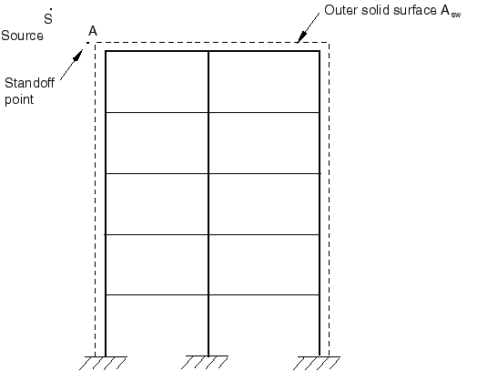

Since the stiffness and inertia of the air medium are negligible, the acoustic medium is not modeled. Rather the incident wave loading is applied directly on the structure itself. The solid surface  where the incident wave loading is applied is shown in [Figure 34.4.6--6](pt07ch34s04aus125.md#pacoustic-airblastbldg). Since the acoustic medium is not modeled, the total wave and the scattered wave formulations are identical.

#### Example: fluid cavitation without incident wave loading

You may be interested in modeling acoustic problems in Abaqus/Explicit where the loading is applied through either prescribed pressure boundaries or specified pressure-conjugate concentrated loads. Choice of the scattered or the total wave formulation is not relevant in these problems even when the acoustic medium is capable of cavitation.


