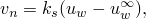
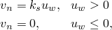
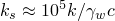
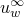

# 34.4.7 Pore fluid flow


**Products: **Abaqus/Standard  Abaqus/CAE  

##### **References**

- ["Applying loads: overview," Section 34.4.1](pt07ch34s04aus120.md)
- [*CFLOW](../key/key-link.md#usb-kws-hcflow)
- [*DFLOW](../key/key-link.md#usb-kws-hdflow)
- [*DSFLOW](../key/key-link.md#usb-kws-hdsflow)
- [*FLOW](../key/key-link.md#usb-kws-hflow)
- [*SFLOW](../key/key-link.md#usb-kws-hsflow)
- ["Defining a surface pore fluid flow," Section 16.9.22 of the Abaqus/CAE User's Guide](../usi/usi-link.md#usi-lbi-loadeditors-surfpore)
- ["Defining a concentrated pore fluid flow," Section 16.9.21 of the Abaqus/CAE User's Guide](../usi/usi-link.md#usi-lbi-loadeditors-concpore)

### Overview

Pore fluid flow can be prescribed in coupled pore fluid diffusion/stress analysis (see ["Coupled pore fluid diffusion and stress analysis," Section 6.8.1](pt03ch06s08at26.md)) and in the geostatic stress field procedure (see ["Geostatic stress state," Section 6.8.2](pt03ch06s08at27.md)). Pore fluid flow can be prescribed by:
- defining seepage coefficients and sink pore pressures on element faces or surfaces;
- defining drainage-only seepage coefficients on element faces or surfaces that are applied only when surface pore pressures are positive; or
- prescribing an outward normal flow velocity directly at nodes, on element faces, or on surfaces.

### Defining pore fluid flow as a function of the current pore pressure in consolidation analysis

In consolidation analysis you can provide seepage coefficients and sink pore pressures on element faces or surfaces to control normal pore fluid flow from the interior of the region modeled to the exterior of the region.

The surface condition assumes that the pore fluid flows in proportion to the difference between the current pore pressure on the surface, , and some reference value of pore pressure, :



where


is the component of the pore fluid velocity in the direction of the outward normal to the surface;


is the seepage coefficient;


is the current pore pressure at this point on the surface; and


is a reference pore pressure value.

#### Specifying element-based pore fluid flow

To define element-based pore fluid flow, specify the element or element set name; the distributed load type; the reference pore pressure, ; and the reference seepage coefficient, . The face of the elements upon which the normal flow is enforced is identified by a seepage distributed load type. The seepage types available depend on the element type (see [Part VI, "Elements](pt06.md)”).

| **Input File Usage: ** | ``` [*FLOW](../key/key-link.md#usb-kws-hflow) *element number or element set name*, Q*n*, ,  ``` |
| --- | --- |

| **Abaqus/CAE Usage: ** | Pore fluid flow cannot be defined as a function of the current pore pressure in Abaqus/CAE. |
| --- | --- |

#### Specifying surface-based pore fluid flow

To define surface-based pore fluid flow, specify a surface name, the seepage flow type, the reference pore pressure, and the reference seepage coefficient. The element-based surface (see ["Element-based surface definition," Section 2.3.2](pt01ch02s03aus17.md)) contains the element and face information.

| **Input File Usage: ** | ``` [*SFLOW](../key/key-link.md#usb-kws-hsflow) *surface name*, Q, ,  ``` |
| --- | --- |

| **Abaqus/CAE Usage: ** | Pore fluid flow cannot be defined as a function of the current pore pressure in Abaqus/CAE. |
| --- | --- |

#### Defining drainage-only flow

Drainage-only flow types can be specified for element-based or surface-based pore fluid flow to indicate that normal pore fluid flow occurs only from the interior to the exterior region of the model. The drainage-only flow surface condition assumes that the pore fluid flows in proportion to the magnitude of the current pore pressure on the surface, , when that pressure is positive:



where


is the component of the pore fluid velocity in the direction of the outward normal to the surface;


is the seepage coefficient; and


is the current pore pressure at this point on the surface.

[Figure 34.4.7--1](pt07ch34s04aus126.md#drainage-porepressure) illustrates this pore pressure–velocity relationship. This surface condition is designed for use with the total pore pressure formulation (see ["Coupled pore fluid diffusion and stress analysis," Section 6.8.1](pt03ch06s08at26.md)), mainly for cases where the phreatic surface intersects an exterior surface that is free to drain. See ["Calculation of phreatic surface in an earth dam," Section 10.1.2 of the Abaqus Example Problems Guide](../exa/exa-link.md#exa-soi-phreaticsurf), for an example of this type of calculation.

**Figure 34.4.7–1** Drainage-only pore pressure–velocity relationship.


When surface pore pressures are negative, the constraint will properly enforce the condition that no fluid can enter the interior region. When surface pore pressures are positive, the constraint will permit fluid flow from the interior to the exterior region of the model. When the seepage coefficient value, , is large, this flow will approximately enforce the requirement that the pore pressure should be zero on a freely draining surface. To achieve this condition, it is necessary to choose the value of  to be much larger than a characteristic seepage coefficient for the material in the underlying elements:


where

*k*

is the permeability of the underlying material;


is the fluid specific weight; and

*c*

is a characteristic length of the underlying elements.

Values of  will be adequate for most analyses. Larger values of  could result in poor conditioning of the model. In all cases the freely draining flow type represents discontinuously nonlinear behavior, and its use may require appropriate solution controls (see ["Commonly used control parameters," Section 7.2.2](pt03ch07s02aus50.md)).

| **Input File Usage: ** | Use the following option to define element-based drainage-only flow: |
| --- | --- |
|  | ``` [*FLOW](../key/key-link.md#usb-kws-hflow) *element number or element set name*, Q*n*D,  ``` Use the following option to define surface-based drainage-only flow: ``` [*SFLOW](../key/key-link.md#usb-kws-hsflow) *surface name*, QD,  ``` |

| **Abaqus/CAE Usage: ** | Pore fluid flow cannot be defined as a function of the current pore pressure in Abaqus/CAE. |
| --- | --- |

#### Modifying or removing seepage coefficients and reference pore pressures

Seepage coefficients and reference pore pressures can be added, modified, or removed as described in ["Applying loads: overview," Section 34.4.1](pt07ch34s04aus120.md).

#### Specifying a time-dependent reference pore pressure

The magnitude of the reference pore pressure, , can be controlled by referring to an amplitude curve. If different variations are needed for different portions of the flow, repeat the flow definition with each referring to its own amplitude curve. See ["Applying loads: overview," Section 34.4.1](pt07ch34s04aus120.md), and ["Amplitude curves," Section 34.1.2](pt07ch34s01aus115.md), for details.

#### Defining nonuniform flow in a user subroutine

To define nonuniform flow, the variation of the reference pore pressure and the seepage coefficient as functions of position, time, pore pressure, etc. can be defined in user subroutine [`FLOW`](../sub/sub-link.md#sub-xsl-flow).

| **Input File Usage: ** | Use the following option to define a nonuniform element-based flow: |
| --- | --- |
|  | ``` [*FLOW](../key/key-link.md#usb-kws-hflow) *element number or element set name*, Q*n*NU ``` Use the following option to define a nonuniform surface-based flow: ``` [*SFLOW](../key/key-link.md#usb-kws-hsflow) *surface name*, QNU ``` |

| **Abaqus/CAE Usage: ** | User subroutine [`FLOW`](../sub/sub-link.md#sub-xsl-flow) is not supported in Abaqus/CAE. |
| --- | --- |

### Prescribing seepage flow velocity and seepage flow directly in consolidation analysis

You can directly prescribe an outward normal flow velocity, , across a surface or an outward normal flow at a node in consolidation analysis.

#### Prescribing element-based seepage flow velocity

To prescribe an element-based seepage flow velocity, specify the element or element set name, the seepage type, and the outward normal flow velocity. The face of the element for which the seepage flow is being defined is identified by the seepage type. The seepage types available depend on the element type (see [Part VI, "Elements](pt06.md)”).

| **Input File Usage: ** | ``` [*DFLOW](../key/key-link.md#usb-kws-hdflow) *element number or element set name*, S*n*,  ``` |
| --- | --- |

| **Abaqus/CAE Usage: ** | Load module: **Create Load**: choose **Fluid** for the **Category** and **Surface pore fluid** for the **Types for Selected Step**: select region: **Distribution**: select an analytical field, **Magnitude**:  |
| --- | --- |

#### Prescribing surface-based seepage flow velocity

To prescribe a surface-based seepage flow velocity, specify a surface name, the seepage flow type, and the pore fluid velocity. The element-based surface (see ["Element-based surface definition," Section 2.3.2](pt01ch02s03aus17.md)) contains the element and face information.

| **Input File Usage: ** | ``` [*DSFLOW](../key/key-link.md#usb-kws-hdsflow) *surface name*, S,  ``` |
| --- | --- |

| **Abaqus/CAE Usage: ** | Load module: **Create Load**: choose **Fluid** for the **Category** and **Surface pore fluid** for the **Types for Selected Step**: select region: **Distribution**: **Uniform**, **Magnitude**:  |
| --- | --- |

#### Prescribing node-based seepage flow

To prescribe node-based seepage flow, specify the node or node set name and the magnitude of the flow per unit time.

| **Input File Usage: ** | ``` [*CFLOW](../key/key-link.md#usb-kws-hcflow) *node number or node set name*, , *magnitude* ``` |
| --- | --- |

| **Abaqus/CAE Usage: ** | Load module: **Create Load**: choose **Fluid** for the **Category** and **Concentrated pore fluid** for the **Types for Selected Step**: select region: **Magnitude**: *magnitude* |
| --- | --- |

#### Prescribing seepage flow at phantom nodes for enriched elements

For an enriched element (see ["Modeling discontinuities as an enriched feature using the extended finite element method," Section 10.7.1](pt04ch10s07at36.md)), you can specify the seepage flow at a phantom node that is originally located coincident with the specified real node.

Alternatively, you can specify the seepage flow at a phantom node located at an element edge between two specified real corner nodes directly.

| **Input File Usage: ** | Use the following option to specify the seepage flow at a phantom node originally located coincident with the specified real node: |
| --- | --- |
|  | ``` [*CFLOW](../key/key-link.md#usb-kws-hcflow), PHANTOM=NODE *node number*, , *magnitude* ``` Use the following option to specify the seepage flow at a phantom node located at an element edge: ``` [*CFLOW](../key/key-link.md#usb-kws-hcflow), PHANTOM=EDGE *first corner node number*, *second corner node number*, *magnitude* ``` |

| **Abaqus/CAE Usage: ** | Prescribing seepage flow at phantom nodes for enriched elements is not supported in Abaqus/CAE |
| --- | --- |

#### Modifying or removing seepage flow velocities and seepage flow

Seepage flow velocities can be added, modified, or removed as described in ["Applying loads: overview," Section 34.4.1](pt07ch34s04aus120.md).

#### Specifying time-dependent flow velocity and flow

The magnitude of the seepage velocity, , can be controlled by referring to an amplitude curve. To specify different variations for different flows, repeat the seepage flow velocity or seepage flow definition with each referring to its own amplitude curve. See ["Applying loads: overview," Section 34.4.1](pt07ch34s04aus120.md), and ["Amplitude curves," Section 34.1.2](pt07ch34s01aus115.md), for details.

#### Defining nonuniform flow velocities in a user subroutine

To define nonuniform element-based or surface-based flow, the variation of the seepage magnitude as a function of position, time, pore pressure, etc. can be defined in user subroutine [`DFLOW`](../sub/sub-link.md#sub-xsl-dflow). If the optional seepage velocity, , is specified directly, this value is passed into user subroutine [`DFLOW`](../sub/sub-link.md#sub-xsl-dflow) in the variable used to define the seepage magnitude.

| **Input File Usage: ** | Use the following option to define nonuniform element-based flow: |
| --- | --- |
|  | ``` [*DFLOW](../key/key-link.md#usb-kws-hdflow) *element number or element set name*, S*n*NU,  ``` Use the following option to define nonuniform surface-based flow: ``` [*DSFLOW](../key/key-link.md#usb-kws-hdsflow) *surface name*, SNU,  ``` |

| **Abaqus/CAE Usage: ** | Use the following input to define nonuniform surface-based flow: |
| --- | --- |
|  | Load module: **Create Load**: choose **Fluid** for the **Category** and **Surface pore fluid** for the **Types for Selected Step**: select region: **Distribution: User-defined**, **Magnitude**:  Nonuniform element-based flow is not supported in Abaqus/CAE. |


