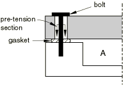
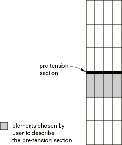
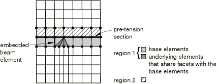
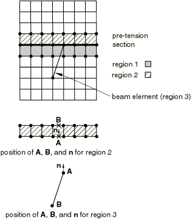
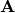

# 34.5.1 Prescribed assembly loads


**Products: **Abaqus/Standard  Abaqus/CAE  

##### **References**

- ["Prescribed conditions: overview," Section 34.1.1](pt07ch34s01abo31.md)
- [*BOUNDARY](../key/key-link.md#usb-kws-hboundary)
- [*CLOAD](../key/key-link.md#usb-kws-hcload)
- [*PRE-TENSION SECTION](../key/key-link.md#usb-kws-mpretension)
- [*SURFACE](../key/key-link.md#usb-kws-msurface)
- [Chapter 22, "Bolt loads," of the Abaqus/CAE User's Guide](../usi/usi-link.md#usi-adv-boltloads)

### Overview

Assembly loads:
- can be used to simulate the loading of fasteners in a structure;
- are applied across user-defined pre-tension sections;
- are applied to pre-tension nodes that are associated with the pre-tension sections; and
- require the specification of pre-tension loads or tightening adjustments.

### Concept of an assembly load

[Figure 34.5.1--1](pt07ch34s05aus127.md#ppretension-assembly-exa) is a simple example that illustrates the concept of an assembly load.

**Figure 34.5.1–1** Example of assembly load.



Container *A* is sealed by pre-tensioning the bolts that hold the lid, which places the gasket under pressure. This pre-tensioning is simulated in Abaqus/Standard by adding a “cutting surface,” or pre-tension section, in the bolt, as shown in [Figure 34.5.1--1](pt07ch34s05aus127.md#ppretension-assembly-exa), and subjecting it to a tensile load. By modifying the elements on one side of the surface, Abaqus/Standard can automatically adjust the length of the bolt at the pre-tension section to achieve the prescribed amount of pre-tension. In later steps further length changes can be prevented so that the bolt acts as a standard, deformable component responding to other loadings on the assembly.

### Modeling an assembly load

Abaqus/Standard allows you to prescribe assembly loads across fasteners that are modeled by continuum, truss, or beam elements. The steps needed to model an assembly load vary slightly depending on the type of elements used to model the fasteners.

#### Modeling a fastener with continuum elements

In continuum elements the pre-tension section is defined as a surface inside the fastener that “cuts” it into two parts (see [Figure 34.5.1--2](pt07ch34s05aus127.md#ppretension-solid)). The pre-tension section can be a group of surfaces for cases where a fastener is composed of several segments.

**Figure 34.5.1–2** Pre-tension section defined using continuum elements.



The element-based surface contains the element and face information (see ["Element-based surface definition," Section 2.3.2](pt01ch02s03aus17.md)). You must convert the surface into a pre-tension section across which pre-tension loads can be applied and assign a controlling node to the pre-tension section.

| **Input File Usage: ** | Use the following options to model an assembly load across a fastener that is modeled with continuum elements: |
| --- | --- |
|  | ``` [*SURFACE](../key/key-link.md#usb-kws-msurface), TYPE=ELEMENT, NAME=*surface_name* [*PRE-TENSION SECTION](../key/key-link.md#usb-kws-mpretension), SURFACE=*surface_name*, NODE=*n* ``` |

| **Abaqus/CAE Usage: ** | Load module: **Create Load**: choose **Mechanical** for the **Category** and **Bolt load** for the **Types for Selected Step** |
| --- | --- |

##### Assigning a controlling node to the pre-tension section

The assembly load is transmitted across the pre-tension section by means of the pre-tension node. The pre-tension node should not be attached to any element in the model. It has only one degree of freedom (degree of freedom 1), which represents the relative displacement at the two sides of the cut in the direction of the normal (see [Figure 34.5.1--3](pt07ch34s05aus127.md#ppretension-normal)). The coordinates of this node are not important.

**Figure 34.5.1–3** Normal to the pre-tension section; this normal should face away from the underlying elements.


##### Defining the normal to the pre-tension section

Abaqus/Standard computes an average normal to the section—in the positive surface direction, facing away from the continuum elements used to generate the surface—to determine the direction along which the pre-tension is applied. You may also specify the normal directly (when the desired direction of loading is different from the average normal to the pre-tension section). The normal is not updated when performing large-displacement analysis.

##### Recognizing elements on either side of the pre-tension section

For all the elements that are connected to the pre-tension section by at least one node, Abaqus/Standard must determine on which side of the pre-tension section each element is located. This process is crucial for the prescribed assembly load to work properly.

The elements used to define the section are referred to as “base elements” in this discussion. All elements on the same side of the section as the base elements are referred to as the “underlying elements.” All elements connected to the section that share faces (or in two-dimensional problems, edges) with the base elements are added to the list of underlying elements. This is a repetitive process that enables Abaqus/Standard to find the underlying elements in almost all meshes—triangles; wedges; tetrahedra; and embedded beams, trusses, shells, and membranes—that were not used in the definition of the surface (see [Figure 34.5.1--4](pt07ch34s05aus127.md#ppretension-underlying)).

**Figure 34.5.1–4** The base elements are used to find the underlying elements.



In most cases this process will group all of the elements that are connected to the section into two regions, as shown in the figure. In rare instances this process may group the elements in more than two regions, in particular if line elements cross over element boundaries. An example is shown in [Figure 34.5.1--5](pt07ch34s05aus127.md#ppretension-add-under); it has three regions, where region 1 is the underlying region. 

**Figure 34.5.1–5** An additional underlying element is found.



For each region other than region 1 an additional step is necessary to determine on which side of the section the region is located. Abaqus/Standard computes an average normal, , for all the nodes of the region that belong to the section; it also computes an average position () of all these nodes. In addition, it computes an average position () of the remaining nodes of the region. If the dot product between the normal  and the vector  is negative, the region is assumed to be an underlying region and is added to region 1. This additional step is illustrated in [Figure 34.5.1--5](pt07ch34s05aus127.md#ppretension-add-under) for regions 2 and 3.

This additional step produces an incorrect separation for the beam element shown in [Figure 34.5.1--6](pt07ch34s05aus127.md#ppretension-no-add-under) since the beam is not found to be an underlying element. 

**Figure 34.5.1–6** An additional underlying element is not found.


If the pre-tension section has an odd shape and one or more line elements that cross over element boundaries are connected to it, consult the list of the underlying elements given in the data (`.dat`) file to make sure that the underlying elements are listed correctly.

Elements that are connected only to the nodes on the pre-tension section, including single-node elements (such as SPRING1, DASHPOT1, and MASS elements) are not included as underlying elements: they are considered to be attached to the other side of the section.

#### Modeling a fastener with truss or beam elements

When a pre-tensioned component is modeled with truss or beam elements, the pre-tension section is reduced to a point. The section is assumed to be located at the last node of the element as defined by the element connectivity (see ["Beam element library," Section 29.3.8](pt06ch29s03ael14.md), and ["Truss element library," Section 29.2.2](pt06ch29s02ael13.md), for a definition of the node ordering for beam and truss elements, respectively), with its normal along the element directed from the first to the last node. As a result, the section is defined entirely by just specifying the element to which an assembly load must be prescribed and associating it with a pre-tension node.

| **Input File Usage: ** | Use the following option to model an assembly load across fasteners modeled with beam or truss elements: |
| --- | --- |
|  | ``` [*PRE-TENSION SECTION](../key/key-link.md#usb-kws-mpretension), ELEMENT=*element_number*, NODE=*n* ``` |

| **Abaqus/CAE Usage: ** | Load module: **Create Load**: choose **Mechanical** for the **Category** and **Bolt load** for the **Types for Selected Step** |
| --- | --- |

As in the case of a surface-based pre-tension section, the node has only one degree of freedom (degree of freedom 1), which represents the relative displacement on the two sides of the cut in the direction of the normal (see [Figure 34.5.1--7](pt07ch34s05aus127.md#ppretension-truss-beam)). The coordinates of the node are not important. 

**Figure 34.5.1–7** Pre-tension section defined using a truss or beam element.


##### Defining the normal to the pre-tension section

Abaqus/Standard computes the normal as the vector from the first to the last node in the connectivity of the underlying element. Alternatively, you can specify the normal to the section directly. This normal is not updated during large-displacement analysis.

### Defining multiple pre-tension sections

You can define multiple pre-tension sections by repeating the pre-tension section definition input. Each pre-tension section should have its own pre-tension node.

### Use with nodal transformations

A local coordinate system (see ["Transformed coordinate systems," Section 2.1.5](pt01ch02s01aus09.md)) cannot be used at a pre-tension node. It can be used at nodes located on pre-tension sections.

### Applying the prescribed assembly load

The pre-tension load is transmitted across the pre-tension section by means of the pre-tension node.

#### Prescribing the pre-tension force

You can apply a concentrated load to the pre-tension node. This load is the self-equilibrating force carried across the pre-tension section, acting in the direction of the normal on the part of the fastener underlying the pre-tension section (the part that contains the elements that were used in the definition of the pre-tension section; see [Figure 34.5.1--8](pt07ch34s05aus127.md#ppretension-load)).

| **Input File Usage: ** | ``` [*CLOAD](../key/key-link.md#usb-kws-hcload) ``` |
| --- | --- |

| **Abaqus/CAE Usage: ** | Load module: **Create Load**: choose **Mechanical** for the **Category** and **Bolt load** for the **Types for Selected Step**: select surface and if, necessary, datum axis: **Method: Apply force** |
| --- | --- |

**Figure 34.5.1–8** The prescribed assembly load is given at the pre-tension node and applied in direction .


#### Prescribing a tightening adjustment

You can prescribe a tightening adjustment of the pre-tension section by using a nonzero boundary condition at the pre-tension node (which corresponds to a prescribed change in the length of the component cut by the pre-tension section in the direction of the normal).

| **Input File Usage: ** | ``` [*BOUNDARY](../key/key-link.md#usb-kws-hboundary) ``` |
| --- | --- |

| **Abaqus/CAE Usage: ** | Load module: **Create Load**: choose **Mechanical** for the **Category** and **Bolt load** for the **Types for Selected Step**: select surface and if, necessary, datum axis: **Method: Adjust length** |
| --- | --- |

#### Controlling the pre-tension node during the analysis

You can maintain the initial adjustment of the pre-tension section by using a boundary condition fixing the degrees of freedom at their current values at the start of the step once an initial pre-tension is applied in the fastener; this technique enables the load across the pre-tension section to change according to the externally applied loads to maintain equilibrium. If the initial adjustment of a section is not maintained, the force in the fastener will remain constant.

When a pre-tension node is not controlled by a boundary condition, make sure that the components of the structure are kinematically constrained; otherwise, the structure could fall apart due to the presence of rigid body modes. Abaqus/Standard will issue a warning message if it does not find any boundary condition or load on a pre-tension node during the first step of the analysis.

### Display of results

Abaqus/Standard automatically adjusts the length of the component at the pre-tension section to achieve the prescribed amount of pre-tension. This adjustment is done by moving the nodes of the underlying elements that lie on the pre-tension section relative to the same nodes when they appear in the other elements connected to the pre-tension section. As a result, the underlying elements will appear shrunk, even though they carry tensile stresses when a pre-tension is applied.

### Limitations when using assembly loads

Assembly loads are subject to the following limitations:
- An assembly load cannot be specified within a substructure.
- If a submodeling analysis is performed (["Submodeling: overview," Section 10.2.1](pt04ch10s02aus60.md)), any pre-tension section should not cross regions where driven nodes are specified. In other words, a pre-tension section should appear either entirely in the region of the global model that is not part of a submodel or entirely in the region of the global model that is part of a submodel. In the latter case, a pre-tension section must also appear in the submodel when the submodel analysis is performed.
- Nodes of a pre-tension section should not be connected to other parts of the body through multi-point constraints (["General multi-point constraints," Section 35.2.2](pt08ch35s02aus130.md)). These nodes can be connected to other parts of the body through equations (["Linear constraint equations," Section 35.2.1](pt08ch35s02aus129.md)). However, an equation connecting a node on the pre-tension section to a node located on the underlying side of the section introduces a constraint that spans across the pre-tension cut and, therefore, interacts directly with the application of the pre-tension load. On the other hand, an equation connecting a node on the pre-tension section to a node on the other side of the section does not influence the application of the pre-tension load.

### Procedures

Any of the Abaqus/Standard procedures that use element types with displacement degrees of freedom can be used. Static analysis is the most likely procedure type to be used when prescribing the initial pre-tension (["Static stress analysis," Section 6.2.2](pt03ch06s02at01.md)). Other analysis types such as coupled temperature-displacement (["Sequentially coupled thermal-stress analysis," Section 16.1.2](pt04ch16s01at39.md)) or coupled thermal-electrical-structural (["Fully coupled thermal-electrical-structural analysis," Section 6.7.4](pt03ch06s07at23.md)) can also be used. Once the initial pre-tension is applied, a static or dynamic analysis (["Dynamic analysis procedures: overview," Section 6.3.1](pt03ch06s03abo07.md)) may, for instance, be used to apply additional loads while maintaining the tightening adjustment.

### Output

The total force across the pre-tension section is the sum of the reaction force at the pre-tension node plus any concentrated load specified at that node. The total force across the pre-tension section is available as output using the output variable identifier TF (see ["Abaqus/Standard output variable identifiers," Section 4.2.1](pt02ch04s02abv01.md)). The forces are along the normal direction. The shear force across the pre-tension section is not available for output.

The tightening adjustment of the pre-tension section is available as the displacement of the pre-tension node. The output of displacement is requested using output identifier U. Only the adjustment normal to the pre-tension section is output since there is no adjustment in any other direction.

The stress distribution across the pre-tension section is not available directly; however, the stresses in the underlying elements can be displayed readily. Alternatively, a tied contact pair can be inserted at the location of the pre-tension section to enable stress distribution output by means of output identifiers CPRESS and CSHEAR. See ["Defining tied contact in Abaqus/Standard," Section 36.3.7](pt09ch36s03aus151.md), for details on defining tied contact.

### Input file template

```
[*HEADING](../key/key-link.md#usb-kws-mheading)
*Prescribed assembly load; example using continuum elements*
…
[*NODE](../key/key-link.md#usb-kws-mnode)
*Optionally define the pre-tension node*
[*SURFACE](../key/key-link.md#usb-kws-msurface), NAME=*name*
*Data lines that specify the elements and their associated faces to define the pre-tension section*
[*PRE-TENSION SECTION](../key/key-link.md#usb-kws-mpretension), SURFACE=*name*, NODE=*pre-tension_node*
**
[*STEP](../key/key-link.md#usb-kws-hstep)
** Application of the pre-tension across the section
[*STATIC](../key/key-link.md#usb-kws-hstatic)
*Data line to control time incrementation*
[*CLOAD](../key/key-link.md#usb-kws-hcload)
*pre-tension_node*, 1, *pre-tension_value*
*or*
[*BOUNDARY](../key/key-link.md#usb-kws-hboundary),AMPLITUDE=*amplitude*
*pre-tension_node*, 1, 1, *tightening adjustment*
[*END STEP](../key/key-link.md#usb-kws-hendstep)
[*STEP](../key/key-link.md#usb-kws-hstep)
** maintain the tightening adjustment and apply new loads
[*STATIC](../key/key-link.md#usb-kws-hstatic) *or* [*DYNAMIC](../key/key-link.md#usb-kws-hdynamic)
*Data line to control time incrementation*
[*BOUNDARY](../key/key-link.md#usb-kws-hboundary),FIXED
*pre-tension_node*, 1, 1
[*BOUNDARY](../key/key-link.md#usb-kws-hboundary)
*Data lines to prescribe other boundary conditions*
[*CLOAD](../key/key-link.md#usb-kws-hcload) *or* [*DLOAD](../key/key-link.md#usb-kws-hdload)
*Data lines to prescribe other loading conditions*
…
[*END STEP](../key/key-link.md#usb-kws-hendstep)
```


