# 35.2.1 Linear constraint equations


**Products: **Abaqus/Standard  Abaqus/Explicit  Abaqus/CAE  

##### **References**

- ["Kinematic constraints: overview," Section 35.1.1](pt08ch35s01abo32.md)
- [*EQUATION](../key/key-link.md#usb-kws-mequation)
- ["Defining equation constraints," Section 15.15.9 of the Abaqus/CAE User's Guide](../usi/usi-link.md#usi-itn-helptopic-equation)

### Overview

A linear multi-point constraint requires that a linear combination of nodal variables is equal to zero; that is, 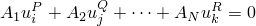, where 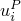 is a nodal variable at node *P*, degree of freedom *i*; and the  are coefficients that define the relative motion of the nodes.

In Abaqus/Explicit linear constraint equations can be used only to constrain mechanical degrees of freedom.

### Defining a linear constraint equation

A linear constraint equation is defined in Abaqus by specifying:
- the number of terms in the equation, *N*;
- the nodes, *P*, and the degrees of freedom, *i*, corresponding to the nodal variables ; and
- the coefficients, .

For example, to impose the equation 

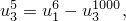

you would first write the equation in the standard form, 

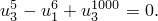

There are three terms in this equation (*N*=3). *P*=5, *i*=3, =1.0, *Q*=6, *j*=1, =1.0, *R*=1000, *k*=3, and =1.0.

| **Input File Usage: ** | ``` [*EQUATION](../key/key-link.md#usb-kws-mequation) *N* *P*, *i*, , *Q*, *j*, , *etc.* ``` |
| --- | --- |
|  | For example, the following input could be used to define the equation constraint above: ``` [*EQUATION](../key/key-link.md#usb-kws-mequation) 3 5, 3, 1.0, 6, 1, -1.0, 1000, 3, 1.0 ``` Either node sets or individual nodes can be specified as input. If node sets are used, corresponding set entries will be matched to each other. If sorted node sets are given as input, you must ensure that the nodes are numbered such that they will match up with each other correctly once sorted. The nodes in an unsorted node set will be used in the order that they are given in defining the set (see ["Node definition," Section 2.1.1](pt01ch02s01aus05.md)). If the first entry is a single node, subsequent entries must be single nodes. If the first entry is a node set, subsequent entries can be either node sets or single nodes. The latter option is useful if a degree of freedom at each of a set of nodes depends on a degree of freedom of a single node, such as may occur in certain symmetry conditions or in the simulation of a rigid body. |

| **Abaqus/CAE Usage: ** | Interaction module: **Create Constraint**: **Equation** |
| --- | --- |
|  | The nodes must be specified as sets. The first set can contain one or more points. Subsequent sets must contain only a single point. |

In Abaqus/Standard the first nodal variable specified ( corresponding to ) will be eliminated to impose the constraint (in the above equation constraint, degree of freedom 3 at node 5 will be eliminated); therefore, it should not be used to apply boundary conditions, nor should it be used in any subsequent multi-point constraint, kinematic coupling constraint, tie constraint, or equation constraint (see ["Kinematic constraints: overview," Section 35.1.1](pt08ch35s01abo32.md)). In addition, the coefficient  should not be set to zero. These restrictions do not apply in Abaqus/Explicit.

In Abaqus/Standard a linear multi-point constraint cannot be used to connect two rigid bodies at nodes other than the reference nodes, since multi-point constraints use degree-of-freedom elimination and the other nodes on a rigid body do not have independent degrees of freedom. In Abaqus/Explicit a rigid body reference node or any other node on a rigid body can be used in an equation constraint definition.

### Use with transformed coordinate systems

If a local coordinate system (["Transformed coordinate systems," Section 2.1.5](pt01ch02s01aus09.md)) is defined for any node involved in the equation, the variables at that node appear in the equation in the local system.

### Use within a part

If an equation constraint is defined at the part (or part instance) level, the nodal variables are transformed initially according to the positioning data given for each instance of the part (see ["Defining an assembly," Section 2.10.1](pt01ch02s10aus28.md)).

**Note:**Equation constraints cannot be defined at the part (or part instance) level in Abaqus/CAE.

### Prescribing a nonhomogeneous constraint

It is sometimes necessary to impose a constraint in the form

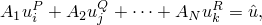

where 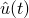 is a prescribed value that may vary with time, *t*. This is easily done by rewriting the equation as

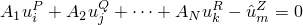

and introducing a node, *Z*, that is not attached to any element in the model. Choosing 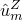 to be some convenient degree of freedom *m* at node *Z* allows the prescribed value  to be imposed through a boundary condition specification. If necessary, an amplitude reference can be provided to give the variation with time (see ["Boundary conditions in Abaqus/Standard and Abaqus/Explicit," Section 34.3.1](pt07ch34s03aus118.md)); such an amplitude reference is required in Abaqus/Explicit for prescribed displacements.

For example, assume that node 1000 in the example above is a “dummy” node that appears only in this equation and is not attached to any other part of the model. Defining a boundary condition to constrain degree of freedom 3 at node 1000 to 12.5 would impose the constraint 

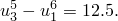

### Constraint forces and global equilibrium

Linear constraint equations introduce constraint forces at all degrees of freedom appearing in the equations. These forces are considered external, but they are not included in reaction force output.  Therefore, the totals provided at the end of the reaction force output tables may reflect an incomplete measure of global equilibrium. 

To illustrate this behavior, consider a spring-supported beam subjected to a concentrated load as shown in [Figure 35.2.1--1](pt08ch35s02aus129.md#peqn-react1).  The static reaction forces are 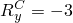 and 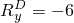.  In [Figure 35.2.1--2](pt08ch35s02aus129.md#peqn-react2) the same structure is subjected to the additional linear constraint equation 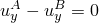, which constrains the beam to remain horizontal.  This introduces constraint forces 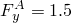  and 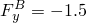, and the new reaction forces are 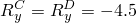.  These reaction forces produce a global force balance in the Y-direction, but since the constraint forces are not included in reaction force output, the global moment balance about point A cannot be verified. 

**Figure 35.2.1–1** Beam with no linear constraints.

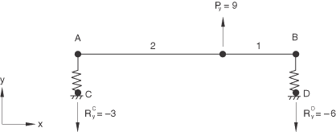

**Figure 35.2.1–2** Beam with linear constraint . Constraint forces 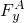 and 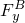 are not included in reaction force output.

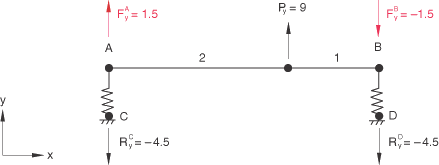

The global force balance can also be incomplete.  This is demonstrated in [Figure 35.2.1--3](pt08ch35s02aus129.md#peqn-react3), where a pulley connection between nodes A and B is represented by the linear constraint equation 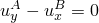.  The constraint forces at the pulley, 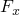 and , are not included in the reaction force output, producing incomplete global force balances in both the *X*- and *Y*-directions.

**Figure 35.2.1–3** Pulley connection represented by the linear constraint . Constraint forces  and  are not included in reaction force output.

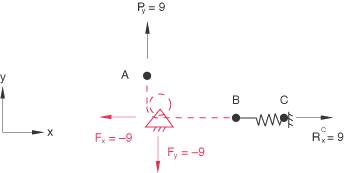

### Obtaining the constraint force

The linear constraint generates constraint forces at all the degrees of freedom involved in the equation. For a given constraint equation these forces are proportional to their respective coefficients. To find the constraint forces, introduce a node *Z* that is not attached to any element in the model; rewrite the constraint equation as 

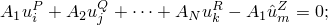

and specify a zero displacement boundary condition at degree of freedom *m* of node *Z*. The reaction force obtained at node *Z* will be equal to the constraint force acting at node *P* in degree of freedom *i*. The constraint force in any term with coefficient 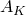 in the constraint equation is obtained by multiplying the constraint force at node *P* in degree of freedom *i* with the ratio 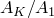. For example, if the equation is 

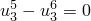

and the forces in the constraint are needed, the equation can be rewritten as 

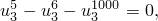

where node 1000 is the fixed “dummy” node. Since the coefficient of 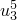 is the opposite of the coefficient of 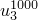, the constraint force at node 5 is the same as the reaction force at node 1000. Since the coefficient of 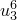 is the same as the coefficient of , the constraint force at node 6 is the opposite of the reaction force at node 1000.

### Defining a constraint in a deformed state

Sometimes we may wish to impose an equation starting at a certain point in the analysis: 

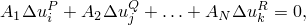

where  represents the change in displacement after time . The equation can be rewritten as 

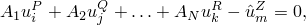

where, again, node *Z* is not attached to any element in the model. Prior to time  (which is assumed to be at the end of a step), degree of freedom *m* of node *Z* is left unrestrained. After time  further changes in  are restrained in Abaqus/Standard by applying a boundary condition fixing the degree of freedom at its current values at the start of the step.

### Reading the data from an alternate input file

The input for a linear constraint equation can be contained in a separate input file.

| **Input File Usage: ** | ``` [*EQUATION](../key/key-link.md#usb-kws-mequation), INPUT=*file_name* ``` |
| --- | --- |
|  | If the INPUT parameter is omitted, it is assumed that the data lines follow the keyword line. |

| **Abaqus/CAE Usage: ** | Interaction module: **Create Constraint**: **Equation**: click mouse button 3 while holding the cursor over the data table, and select **Read from File** |
| --- | --- |


