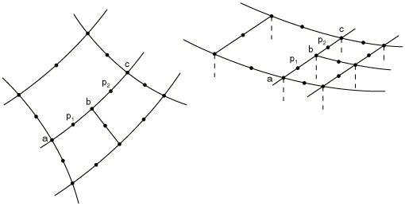
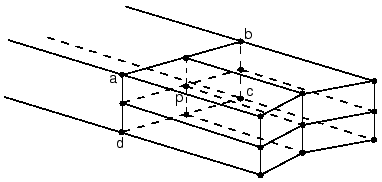
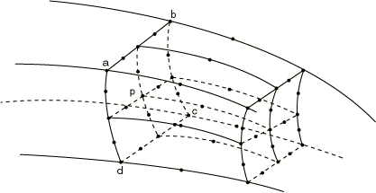
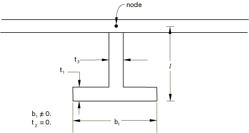
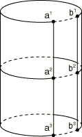
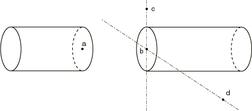
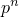

# 35.2.2 General multi-point constraints


**Products: **Abaqus/Standard  Abaqus/Explicit  Abaqus/CAE  

##### **References**

- ["Kinematic constraints: overview," Section 35.1.1](pt08ch35s01abo32.md)
- [*MPC](../key/key-link.md#usb-kws-mmpc)
- ["Defining MPC constraints," Section 15.15.6 of the Abaqus/CAE User's Guide](../usi/usi-link.md#usi-itn-helptopic-multipoint)
- [Chapter 24, "Connectors," of the Abaqus/CAE User's Guide](../usi/usi-link.md#usi-adv-connectors)

### Overview

Multi-point constraints (MPCs):
- allow constraints to be imposed between different degrees of freedom of the model; and
- can be quite general (nonlinear and nonhomogeneous).

The most commonly required constraints are available directly by choosing an MPC type and giving the associated data. The available MPC types are described below; MPCs that are available only in Abaqus/Standard are designated with an (S).

In Abaqus/Standard the constraints can also be given by user subroutine [`MPC`](../sub/sub-link.md#sub-xsl-mpc).

Linear constraints can be given directly by defining a linear constraint equation (see ["Linear constraint equations," Section 35.2.1](pt08ch35s02aus129.md)).

In Abaqus/Explicit some multi-point constraints can be modeled more effectively using rigid bodies (see ["Rigid body definition," Section 2.4.1](pt01ch02s04aus22.md)).

Several MPC types are also available with connector elements (["Connector elements," Section 31.1.2](pt06ch31s01alm25.md)). Although the connector elements impose the same kinematic constraint, connectors do not eliminate degrees of freedom.

MPC constraint forces are not available as output quantities. Therefore, to output the forces required to enforce the constraint specified in an MPC, you should use an equivalent connector element. Connector element force, moment, and kinematic output is readily available and is defined in ["Connector element library," Section 31.1.4](pt06ch31s01ael25.md).

### Identifying the nodes involved in the MPC

For any MPC type, either node sets or individual nodes can be given as input. If the first entry is a node, subsequent entries must be nodes. If the first entry is a node set, subsequent entries can be either node sets or single nodes. The latter option is useful if a degree of freedom at each of a set of nodes depends on a degree of freedom of a single node, such as may occur in certain symmetry conditions or in the simulation of a rigid body.

If node sets are used, corresponding set entries will be constrained to each other. If sorted node sets are given as input, you must ensure that the nodes are numbered such that they will match up correctly when sorted. The nodes in an unsorted node set (see ["Node definition," Section 2.1.1](pt01ch02s01aus05.md)) will be used in the order that they are given in defining the set.

In Abaqus/Standard multi-point constraints cannot be used to connect two rigid bodies at nodes other than the reference nodes, since multi-point constraints use degree-of-freedom elimination and the other nodes on a rigid body do not have independent degrees of freedom. In Abaqus/Explicit a rigid body reference node or any other node on a rigid body can be used in a multi-point constraint definition.

Abaqus/CAE uses connectors to define multi-point constraints between two points and constraints to define multi-point constraints between a point and slave nodes in a region. Set-to-set multi-point constraints and unsorted node sets are not supported in Abaqus/CAE.

| **Input File Usage: ** | ``` [*MPC](../key/key-link.md#usb-kws-mmpc) ``` |
| --- | --- |

| **Abaqus/CAE Usage: ** | Use the following options to define a multi-point constraint between two points: |
| --- | --- |
|  | Interaction module: ****Connector****Geometry****Create Wire Feature**** ****Connector****Section****Create****: **Connection Category**: **MPC**, **MPC type**: select type ****Connector****Assignment****Create****: select wires: **Section**: select MPC connector section Use the following options to define a multi-point constraint between a point and slave nodes in a region: Interaction module: ****Constraint****Create****: **MPC Constraint**: select control point and region; **MPC type**: select type |

### Use with transformed coordinate systems

Local coordinate systems (see ["Transformed coordinate systems," Section 2.1.5](pt01ch02s01aus09.md)) can be defined for any nodes connected to MPCs. Some special considerations apply for user-defined MPCs, as described in ["MPC," Section 1.1.14 of the Abaqus User Subroutines Reference Guide](../sub/sub-link.md#sub-rtn-umpc).

### Defining multiple multi-point constraints at a point

See ["Kinematic constraints: overview," Section 35.1.1](pt08ch35s01abo32.md), for details on how multiple kinematic constraints at a point are treated in Abaqus/Standard and Abaqus/Explicit.

In Abaqus/Standard MPCs are usually imposed by eliminating the degree of freedom at the first node given (the dependent degree of freedom). MPC types BEAM, CYCLSYM, LINK, PIN, REVOLUTE, TIE, and UNIVERSAL are sorted internally by Abaqus/Standard so that the MPC in which a node is used as a dependent node is the last MPC that uses this node. Therefore, groups of these MPCs can be given in any order. However, even for these MPCs, a node can be used only once as a dependent node. In other cases dependent degrees of freedom should not be used subsequently to impose kinematic constraints; this generally precludes the use of the first node in an MPC definition as an independent node in any subsequent multi-point constraint, equation constraint, kinematic coupling constraint, or tie constraint definition.

### Using MPCs in implicit dynamic analysis

In implicit dynamic analysis Abaqus/Standard enforces MPCs rigorously for the displacements. The velocities and accelerations are derived from the displacements with the relations defined by the dynamic integration operator (see ["Implicit dynamic analysis," Section 2.4.1 of the Abaqus Theory Guide](../stm/stm-link.md#stm-anl-dynamics)). For linear MPCs (such as PIN, TIE, and mesh refinement MPCs) and geometrically linear analysis the velocities obtained in this way satisfy the constraint exactly. However, the accelerations satisfy the constraint only approximately. If nonlinear MPCs (such as BEAM, LINK, and SLIDER) are used in geometrically nonlinear analysis, both the velocities and accelerations satisfy the constraint only approximately. In most cases the approximation is quite accurate, but in some cases high frequency oscillations may occur in the accelerations of the nodes involved in the MPC.

### Using nonlinear MPCs in geometrically linear Abaqus/Standard analysis

If a nonlinear MPC is used in a geometrically linear Abaqus/Standard analysis (see ["General and linear perturbation procedures," Section 6.1.3](pt03ch06s01aus44.md)), the MPC is linearized. For example, if MPC LINK is used in a geometrically nonlinear Abaqus/Standard analysis, the distance between the two nodes of the link remains constant. If it is used in a geometrically linear Abaqus/Standard analysis, the distance between the two nodes is held constant after projection onto the direction of the line between the original positions of the nodes. The difference should be noticeable only if the magnitudes of the rotations and displacements are not small.

### Defining MPCs in a user subroutine

In Abaqus/Standard you can define multi-point constraints in user subroutine [`MPC`](../sub/sub-link.md#sub-xsl-mpc).

Constraints defined in user subroutine [`MPC`](../sub/sub-link.md#sub-xsl-mpc) can only use degrees of freedom that also exist on an element somewhere in the same model. For example, if a model contains no elements with rotational degrees of freedom, user subroutine [`MPC`](../sub/sub-link.md#sub-xsl-mpc) cannot use degrees of freedom 4, 5, or 6. This limitation can be overcome by adding a suitable element somewhere in the model to introduce the required degrees of freedom. This element can be added so that it does not affect the response of the model.

Constraints defined in the user subroutine are applied to the transformed degrees of freedom. A boundary nonlinearity occurs in Abaqus/Standard when MPCs are activated/deactivated in a user subroutine.

| **Input File Usage: ** | ``` [*MPC](../key/key-link.md#usb-kws-mmpc), USER ``` |
| --- | --- |

| **Abaqus/CAE Usage: ** | Use one of the following options: |
| --- | --- |
|  | Interaction module: **Create Connector Section**: select **MPC** as the **Connection Category** and **User-defined** as the **MPC Type** Interaction module: **Create Constraint**: **MPC Constraint**; select **User-defined** as the **MPC Type** |

#### Specifying the version of user subroutine [`MPC`](../sub/sub-link.md#sub-xsl-mpc)

You must specify whether the user subroutine will be coded in degree of freedom mode or in nodal mode.

| **Input File Usage: ** | Use one of the following options: |
| --- | --- |
|  | ``` [*MPC](../key/key-link.md#usb-kws-mmpc), USER, MODE=DOF [*MPC](../key/key-link.md#usb-kws-mmpc), USER, MODE=NODE ``` |

| **Abaqus/CAE Usage: ** | Use one of the following options: |
| --- | --- |
|  | Interaction module: **Create Connector Section**: select **MPC** as the **Connection Category** and **User-defined** as the **MPC Type**, choose **DOF-by-DOF** or **Node-by-Node** Interaction module: **Create Constraint**: **MPC Constraint**: select **User-defined** as the **MPC Type**, choose **DOF-by-DOF** or **Node-by-Node** |

### Reading the data from an alternate input file

The input for an MPC definition can be contained in a separate input file.

| **Input File Usage: ** | ``` [*MPC](../key/key-link.md#usb-kws-mmpc), INPUT=*file_name* ``` |
| --- | --- |
|  | If the INPUT parameter is omitted, it is assumed that the data lines follow the keyword line. |

| **Abaqus/CAE Usage: ** | Reading data from an alternate input file is not supported in Abaqus/CAE. |
| --- | --- |

### MPCs for mesh refinement

| LINEAR | This MPC is a standard method for mesh refinement of first-order elements. It applies to all active degrees of freedom at the involved nodes including temperature, pressure, and electrical potential. In Abaqus/Explicit it might be preferable to use a surface-based tie constraint (see ["Mesh tie constraints," Section 35.3.1](pt08ch35s03aus132.md)) for mesh refinement, particularly when one or more of the meshes to be constrained involve shell elements with thickness. |
| --- | --- |
| QUADRATIC(S) | This MPC is a standard method for mesh refinement of second-order elements. It applies to all active degrees of freedom at the involved nodes with the exception of temperature degrees of freedom in coupled temperature-displacement analysis and coupled thermal-electrical-structural analysis and to pressure degrees of freedom in coupled pore pressure analysis. For refinement using second-order pore pressure or coupled-temperature displacement elements, the P LINEAR or T LINEAR MPC must be used in conjunction with this MPC. |
| BILINEAR(S) | This MPC is a standard method for mesh refinement of first-order solid elements in three dimensions. It applies to all active degrees of freedom at the involved nodes including temperature, pressure, and electrical potential. |
| C BIQUAD(S) | This MPC is a standard method for mesh refinement of second-order solid elements in three dimensions. It applies to all active degrees of freedom at the involved nodes with the exception of temperature degrees of freedom in coupled temperature-displacement analysis and coupled thermal-electrical-structural analysis and to pressure degrees of freedom in coupled pore pressure analysis. For refinement using pore pressure or coupled-temperature displacement elements in three dimensions, the P BILINEAR or T BILINEAR MPC must be used in conjunction with this MPC. |
| P LINEAR(S) | This MPC can be used in conjunction with the QUADRATIC MPC for mesh refinement of second-order, fully coupled pore fluid flow-displacement elements. It applies to pressure degrees of freedom only. For acoustic analysis it applies the same constraint as the LINEAR MPC. |
| T LINEAR(S) | This MPC can be used in conjunction with the QUADRATIC MPC for mesh refinement of second-order, fully coupled temperature-displacement and fully coupled thermal-electrical-structural elements. It applies to temperature degrees of freedom only. For heat transfer analysis it applies the same constraint as the LINEAR MPC. |
| P BILINEAR(S) | This MPC can be used in conjunction with the C BIQUAD MPC for mesh refinement of pore fluid flow-displacement elements in three dimensions. It applies to pressure degrees of freedom only. For acoustic analysis it applies the same constraint as the BILINEAR MPC. |
| T BILINEAR(S) | This MPC can be used in conjunction with the C BIQUAD MPC for mesh refinement of fully coupled temperature-displacement and fully coupled thermal-electrical-structural elements in three dimensions. It applies to temperature degrees of freedom only. For heat transfer analysis it applies the same constraint as the BILINEAR MPC. |

#### Using mesh refinement MPCs with shell or beam elements

The Abaqus/Standard shell elements S4R5, S8R5, S9R5, and STRI65 use a penalty method to enforce transverse shear constraints on the edges of the element. The use of mesh refinement MPCs LINEAR and QUADRATIC may, therefore, lead to overconstraining or “shear locking” of the bending behavior. Graded meshes, using the triangular elements as necessary to create a transition zone, are recommended for mesh refinement with these elements.

The shear flexible beam elements in Abaqus/Standard such as B31 or B32 will also “lock” if used as stiffeners along a mesh line where the mesh refinement MPCs are used.

For shell elements in Abaqus/Explicit the rotational degrees of freedom are not constrained by the LINEAR MPC; therefore, a hinge is formed along the line defined by the constrained nodes.

#### Using MPC type LINEAR

MPC type LINEAR is a standard method for mesh refinement of first-order elements. However, in Abaqus/Explicit it might be preferable to use a surface-based tie constraint (see ["Mesh tie constraints," Section 35.3.1](pt08ch35s03aus132.md)) for mesh refinement, particularly when one or more of the meshes to be constrained involve shell elements with thickness.

This MPC constrains each degree of freedom at node *p* to be interpolated linearly from the corresponding degrees of freedom at nodes *a* and *b* (see [Figure 35.2.2--1](pt08ch35s02aus130.md#pmpc-linear)).

**Figure 35.2.2–1** LINEAR type MPC.


##### Input data

Give the nodes *p*, *a*, and *b* as shown in [Figure 35.2.2--1](pt08ch35s02aus130.md#pmpc-linear).

| **Input File Usage: ** | ``` [*MPC](../key/key-link.md#usb-kws-mmpc) LINEAR, *p*, *a*, *b* ``` |
| --- | --- |

| **Abaqus/CAE Usage: ** | Mesh refinement multi-point constraints are not supported in Abaqus/CAE. |
| --- | --- |

#### Using MPC type QUADRATIC

MPC type QUADRATIC is a standard method for mesh refinement of second-order elements. This MPC type is available only in Abaqus/Standard.

This MPC constrains each degree of freedom at node *p* (where *p* is either  or ) to be interpolated quadratically from the corresponding degrees of freedom at nodes *a*, *b*, and *c* ([Figure 35.2.2--2](pt08ch35s02aus130.md#pmpc-quadratic)). For coupled temperature-displacement, coupled thermal-electrical-structural, or pore pressure elements, only the displacement degrees of freedom are constrained.

**Figure 35.2.2–2** QUADRATIC type MPC.



##### Input data

Give the nodes *p*, *a*, *b*, and *c* as shown in [Figure 35.2.2--2](pt08ch35s02aus130.md#pmpc-quadratic), where *p* is either  or .

| **Input File Usage: ** | ``` [*MPC](../key/key-link.md#usb-kws-mmpc) QUADRATIC, *p*, *a*, *b*, *c* ``` |
| --- | --- |

| **Abaqus/CAE Usage: ** | Mesh refinement multi-point constraints are not supported in Abaqus/CAE. |
| --- | --- |

#### Using MPC type BILINEAR

MPC type BILINEAR is a standard method for mesh refinement of first-order solid elements in three dimensions. This MPC type is available only in Abaqus/Standard.

This MPC constrains each degree of freedom at node *p* to be interpolated bilinearly from the corresponding degrees of freedom at nodes *a*, *b*, *c*, and *d* ([Figure 35.2.2--3](pt08ch35s02aus130.md#pmpc-bilinear)).

**Figure 35.2.2–3** BILINEAR type MPC.



##### Input data

Give the nodes *p*, *a*, *b*, *c*, and *d* as shown in [Figure 35.2.2--3](pt08ch35s02aus130.md#pmpc-bilinear).

| **Input File Usage: ** | ``` [*MPC](../key/key-link.md#usb-kws-mmpc) BILINEAR, *p*, *a*, *b*, *c*, *d* ``` |
| --- | --- |

| **Abaqus/CAE Usage: ** | Mesh refinement multi-point constraints are not supported in Abaqus/CAE. |
| --- | --- |

#### Using MPC type C BIQUAD

MPC type C BIQUAD is a standard method for mesh refinement of second-order solid elements in three dimensions. This MPC type is available only in Abaqus/Standard.

This MPC constrains each degree of freedom at node *p* to be interpolated by a constrained biquadratic from the corresponding degrees of freedom at the eight nodes *a*, *b*, *c*, *d*, *e*, *f*, *g*, and *h* ([Figure 35.2.2--4](pt08ch35s02aus130.md#pmpc-cbiquadratic)). For coupled temperature-displacement, coupled thermal-electrical-structural, or pore pressure elements, only the displacement degrees of freedom are constrained.

**Figure 35.2.2–4** C BIQUAD type MPC.


##### Input data

Give the nodes *p*, *a*, *b*, *c*, *d*, *e*, *f*, *g*, and *h* as shown in [Figure 35.2.2--4](pt08ch35s02aus130.md#pmpc-cbiquadratic).

| **Input File Usage: ** | ``` [*MPC](../key/key-link.md#usb-kws-mmpc) C BIQUAD, *p*, *a*, *b*, *c*, *d*, *e*, *f*, *g*, *h* ``` |
| --- | --- |

| **Abaqus/CAE Usage: ** | Mesh refinement multi-point constraints are not supported in Abaqus/CAE. |
| --- | --- |

#### Using MPC types P LINEAR and T LINEAR

The P LINEAR MPC can be used in conjunction with the QUADRATIC MPC for mesh refinement of second-order, fully coupled pore fluid flow-displacement elements.

The T LINEAR MPC can be used in conjunction with the QUADRATIC MPC for mesh refinement of second-order, fully coupled temperature-displacement and  fully coupled thermal-electrical-structural elements.

These MPC types are available only in Abaqus/Standard.

These MPCs constrain the pore pressure (P LINEAR) or temperature (T LINEAR) degree of freedom at node *p* to be interpolated linearly from the degrees of freedom at nodes *a* and *b* ([Figure 35.2.2--5](pt08ch35s02aus130.md#pmpc-plinear)).

**Figure 35.2.2–5** P LINEAR and T LINEAR MPCs.


##### Input data

Give the nodes *p*, *a*, and *b* as shown in [Figure 35.2.2--5](pt08ch35s02aus130.md#pmpc-plinear).

| **Input File Usage: ** | Use the following option to define a P LINEAR MPC: |
| --- | --- |
|  | ``` [*MPC](../key/key-link.md#usb-kws-mmpc) P LINEAR, *p*, *a*, *b* ``` Use the following option to define a T LINEAR MPC: ``` [*MPC](../key/key-link.md#usb-kws-mmpc) T LINEAR, *p*, *a*, *b* ``` |

| **Abaqus/CAE Usage: ** | Mesh refinement multi-point constraints are not supported in Abaqus/CAE. |
| --- | --- |

#### Using MPC types P BILINEAR and T BILINEAR

The P BILINEAR MPC can be used in conjunction with the C BIQUAD MPC for mesh refinement of pore fluid flow-displacement elements in three dimensions.

The T BILINEAR MPC can be used in conjunction with the C BIQUAD MPC for mesh refinement of fully coupled temperature-displacement and  fully coupled thermal-electrical-structural elements in three dimensions.

These MPC types are available only in Abaqus/Standard.

These MPCs constrain the pore pressure (P LINEAR) or temperature (T LINEAR) at node *p* to be interpolated bilinearly from the pore pressure or temperature at nodes *a*, *b*, *c*, and *d* ([Figure 35.2.2--6](pt08ch35s02aus130.md#pmpc-pbilinear)).

**Figure 35.2.2–6** P BILINEAR and T BILINEAR MPCs.



##### Input data

Give the nodes *p*, *a*, *b*, *c*, and *d* as shown in [Figure 35.2.2--6](pt08ch35s02aus130.md#pmpc-pbilinear).

| **Input File Usage: ** | Use the following option to define a P BILINEAR MPC: |
| --- | --- |
|  | ``` [*MPC](../key/key-link.md#usb-kws-mmpc) P BILINEAR, *p*, *a*, *b*, *c*, *d* ``` Use the following option to define a T BILINEAR MPC: ``` [*MPC](../key/key-link.md#usb-kws-mmpc) T BILINEAR, *p*, *a*, *b*, *c*, *d* ``` |

| **Abaqus/CAE Usage: ** | Mesh refinement multi-point constraints are not supported in Abaqus/CAE. |
| --- | --- |

### MPCs for connections and joints

| BEAM | Provide a rigid beam between two nodes to constrain the displacement and rotation at the first node to the displacement and rotation at the second node, corresponding to the presence of a rigid beam between the two nodes. |
| --- | --- |
| CYCLSYM(S) | Constrain nodes to impose cyclic symmetry in a model. |
| ELBOW(S) | Constrain two nodes of ELBOW31 or ELBOW32 elements together, where the cross-sectional direction, , changes (see ["Pipes and pipebends with deforming cross-sections: elbow elements," Section 29.5.1](pt06ch29s05alm15.md)). |
| LINK | Provide a pinned rigid link between two nodes to keep the distance between the two nodes constant. The displacements of the first node are modified to enforce this constraint. The rotations at the nodes, if they exist, are not involved in this constraint. |
| PIN | Provide a pinned joint between two nodes. This MPC makes the displacements equal but leaves the rotations, if they exist, independent of each other. |
| REVOLUTE(S) | Provide a revolute joint. |
| SLIDER | Keep a node on a straight line defined by two other nodes, but allow the possibility of moving along the line and allow the line to change length. |
| TIE | Make all active degrees of freedom equal at two nodes. |
| UNIVERSAL(S) | Provide a universal joint. |
| V LOCAL(S) | Allow the velocity at the constrained node to be expressed in terms of velocity components at the third node defined in a local, body axis system. These local velocity components can be constrained, thus providing prescribed velocity boundary conditions in a rotating, body axis system. |

See ["Connectors: overview," Section 31.1.1](pt06ch31s01abo28.md), for element-based versions of several of these MPCs for connections and joints.

#### Using MPC type BEAM

MPC type BEAM provides a rigid beam between two nodes to constrain the displacement and rotation at the first node to the displacement and rotation at the second node, corresponding to the presence of a rigid beam between the two nodes.

**Figure 35.2.2–7** BEAM type MPC.


##### Input data

Give the nodes *a* and *b* as shown in [Figure 35.2.2--7](pt08ch35s02aus130.md#pmpc-lin-beam).

| **Input File Usage: ** | ``` [*MPC](../key/key-link.md#usb-kws-mmpc) BEAM, *a*, *b* ``` |
| --- | --- |

| **Abaqus/CAE Usage: ** | Use one of the following options: |
| --- | --- |
|  | Interaction module: **Create Connector Section**: select **MPC** as the **Connection Category** and **Beam** as the **MPC Type** Interaction module: **Create Constraint**: **MPC Constraint**; select **Beam** as the **MPC Type** |

##### Constraining a beam stiffener to a shell

The general method of using a beam as a stiffener on a shell is to define the beam and shell elements with separate nodes. These nodes can then be constrained to each other using BEAM type MPCs.

A more economical way, when applicable, is to use the same node for the beam node and the shell node and then define the offset of the center of the cross-section of the beam in the beam section data. [Figure 35.2.2--8](pt08ch35s02aus130.md#pmpc-stiff-shell) shows a T-shaped stiffener attached to a shell, using the I-beam cross-section. This is done by setting *l* (see ["Beam cross-section library," Section 29.3.9](pt06ch29s03abm01.md)) equal to the distance between the node and the underside of the lower flange and setting the thickness of the top flange to zero. This approach can be used with all beam elements that use TRAPEZOID, I, or ARBITRARY beam sections.

**Figure 35.2.2–8** Stiffened shell.



#### Using MPC type CYCLSYM

MPC type CYCLSYM is used to enforce proper constraints on the radial faces bounding a segment of a cyclic symmetric structure (see [Figure 35.2.2--9](pt08ch35s02aus130.md#pmpc-cyclsym)). This MPC type is available only in Abaqus/Standard.

MPC type CYCLSYM imposes the cyclic symmetry by equating radial, circumferential, and axial displacement components (and rotations, if active) at the two nodes (*a* and *b*). The symmetry axis can be defined by the original coordinates of two additional nodes (*c* and *d*) that do not need to be connected to any element in the structure. Scalar degrees of freedom (such as temperature) are made equal.

**Figure 35.2.2–9** MPC type CYCLSYM.


##### Input data

Give the nodes *a*, *b*, and (optionally) node *c* and/or *d* that define the axis of symmetry as shown in [Figure 35.2.2--9](pt08ch35s02aus130.md#pmpc-cyclsym). Node set names can be used instead of the nodes *a* and *b*. If neither *c* nor *d* is given, the global *z*-axis is taken to be the axis of cyclic symmetry. If only node *c* is given, the symmetry axis passes through *c* and is parallel to the global *z*-axis. Thus, node *d* is not needed in two-dimensional cases.

| **Input File Usage: ** | ``` [*MPC](../key/key-link.md#usb-kws-mmpc) CYCLSYM, *a*, *b*, *c*, *d* ``` |
| --- | --- |

| **Abaqus/CAE Usage: ** | Cyclic symmetry multi-point constraints are not supported in Abaqus/CAE. |
| --- | --- |

#### Using MPC type ELBOW

MPC type ELBOW constrains two nodes of ELBOW31 or ELBOW32 elements together, where the cross-sectional direction, , changes (see ["Pipes and pipebends with deforming cross-sections: elbow elements," Section 29.5.1](pt06ch29s05alm15.md)). This MPC type is available only in Abaqus/Standard.

**Figure 35.2.2–10** ELBOW type MPC.


##### Input data

Give the nodes *a* and *b* as shown in [Figure 35.2.2--10](pt08ch35s02aus130.md#pmpc-elbow).

| **Input File Usage: ** | ``` [*MPC](../key/key-link.md#usb-kws-mmpc) ELBOW, *a*, *b* ``` |
| --- | --- |

| **Abaqus/CAE Usage: ** | Use one of the following options: |
| --- | --- |
|  | Interaction module: **Create Connector Section**: select **MPC** as the **Connection Category** and **Elbow** as the **MPC Type** Interaction module: **Create Constraint**: **MPC Constraint**; select **Elbow** as the **MPC Type** |

#### Using MPC type LINK

MPC type LINK provides a pinned rigid link between two nodes to keep the distance between the nodes constant, as shown in [Figure 35.2.2--11](pt08ch35s02aus130.md#pmpc-link). The displacements of the first node are modified to enforce this constraint. The rotations at the nodes, if they exist, are not involved in this constraint.

**Figure 35.2.2–11** MPC type LINK.


##### Input data

Give the nodes *a* and *b* as shown in [Figure 35.2.2--11](pt08ch35s02aus130.md#pmpc-link).

| **Input File Usage: ** | ``` [*MPC](../key/key-link.md#usb-kws-mmpc) LINK, *a*, *b* ``` |
| --- | --- |

| **Abaqus/CAE Usage: ** | Use one of the following options: |
| --- | --- |
|  | Interaction module: **Create Connector Section**: select **MPC** as the **Connection Category** and **Link** as the **MPC Type** Interaction module: **Create Constraint**: **MPC Constraint**; select **Link** as the **MPC Type** |

#### Using MPC type PIN

MPC type PIN provides a pinned joint between two nodes. This MPC makes the global displacements equal but leaves the rotations, if they exist, independent of each other, as shown in [Figure 35.2.2--12](pt08ch35s02aus130.md#pmpc-pin).

**Figure 35.2.2–12** MPC type PIN.


##### Input data

Give the nodes *a* and *b* as shown in [Figure 35.2.2--12](pt08ch35s02aus130.md#pmpc-pin).

| **Input File Usage: ** | ``` [*MPC](../key/key-link.md#usb-kws-mmpc) PIN, *a*, *b* ``` |
| --- | --- |

| **Abaqus/CAE Usage: ** | Use one of the following options: |
| --- | --- |
|  | Interaction module: **Create Connector Section**: select **MPC** as the **Connection Category** and **Pin** as the **MPC Type** Interaction module: **Create Constraint**: **MPC Constraint**; select **Pin** as the **MPC Type** |

#### Using MPC type REVOLUTE

This MPC type is available only in Abaqus/Standard.

A revolute joint is a joint in which relative rotation is allowed between two nodes about an axis that rotates during the motion (see [Figure 35.2.2--13](pt08ch35s02aus130.md#pmpc-revolute)). The axis of the joint is defined in the initial configuration as the line from node *b* to node *c*. If these nodes are coincident, the axis is assumed to be the global *z*-axis. The rotation of the joint axis is that of node *b*.

The relative rotation in the joint is a single variable and is stored as degree of freedom 6 at node *c*. This degree of freedom can be used with other members in the model, but caution should be used because of the nonstandard use of degree of freedom 6. For example, a SPRING1 element (a spring to ground) might be attached to this degree of freedom. Since the degree of freedom measures a *relative* rotation, this spring would then be a torsional spring between nodes *a* and *b*.

The displacements at node *a* are not constrained by the REVOLUTE MPC to be the same as the displacements at node *b*. Thus, the joint definition must usually be completed either by using a PIN type MPC between nodes *a* and *b* or by using suitable stiffness members between these two nodes.

An example of a revolute joint and application of the REVOLUTE MPC is provided in ["Revolute MPC verification: rotation of a crank," Section 1.3.8 of the Abaqus Benchmarks Guide](../bmk/bmk-link.md#bmk-anl-revolutempc). See ["Revolute joint," Section 6.6.3 of the Abaqus Theory Guide](../stm/stm-link.md#stm-ldc-revolutempc), for more details on revolute joints.

**Figure 35.2.2–13** Revolute joint.


##### Input data

Give the nodes *a*, *b*, and *c* as shown in [Figure 35.2.2--13](pt08ch35s02aus130.md#pmpc-revolute). Degree of freedom 6 at node *c* defines the *relative* rotation between nodes *a* and *b*; therefore, this degree of freedom does not obey the standard convention for degrees of freedom in Abaqus.

| **Input File Usage: ** | ``` [*MPC](../key/key-link.md#usb-kws-mmpc) REVOLUTE, *a*, *b*, *c* ``` |
| --- | --- |

| **Abaqus/CAE Usage: ** | Revolute joint multi-point constraints are not supported in Abaqus/CAE. |
| --- | --- |

#### Using MPC type SLIDER

MPC type SLIDER keeps a node on a straight line defined by two other nodes but allows the possibility of moving along the line and allows the line to change length.

When transitioning from multiple layers of solid elements to shells, it is often desirable to constrain the nodes on the free edge of the solid elements to remain in a straight line. (This constraint is consistent with shell theory.) The SLIDER MPC can perform this function without restraining the “thinning” behavior of the solid layers. The SS LINEAR MPC is then used to attach the shell element to this edge.

In Abaqus/Standard when a SLIDER MPC is used with one of the shell-solid MPCs—SS LINEAR, SS BILINEAR, or SSF BILINEAR—it must be given following the shell-solid MPCs.

##### Input data

For each node *p* shown in [Figure 35.2.2--14](pt08ch35s02aus130.md#pmpc-slider-shell-solid) and [Figure 35.2.2--15](pt08ch35s02aus130.md#pmpc-slider-tel-beam), give the nodes *p*, *a*, and *b* for each line of nodes that should remain straight. For each node *q* shown in [Figure 35.2.2--14](pt08ch35s02aus130.md#pmpc-slider-shell-solid), give the nodes *q*, *c*, and *d*, and so on for each line of nodes that should remain straight.

| **Input File Usage: ** | ``` [*MPC](../key/key-link.md#usb-kws-mmpc) SLIDER, *p*, *a*, *b* SLIDER, *q*, *c*, *d* ``` |
| --- | --- |

| **Abaqus/CAE Usage: ** | Slider multi-point constraints are not supported in Abaqus/CAE. |
| --- | --- |

**Figure 35.2.2–14** SLIDER type MPC used at a shell-solid intersection.


**Figure 35.2.2–15** SLIDER type MPC used to model a telescoping beam.


#### Using MPC type TIE

MPC type TIE makes the global displacements and rotations as well as all other active degrees of freedom equal at two nodes. If there are different degrees of freedom active at the two nodes, only those in common will be constrained.

MPC type TIE is usually used to join two parts of a mesh when corresponding nodes on the two parts are to be fully connected (“zipping up” a mesh). For example, when a mesh is generated on a cylindrical body, the solution at the nodes at 0 and those at 360 must be the same. This can be done either by renumbering the nodes on one of the mesh extremes or by using this MPC for each pair of corresponding nodes, as shown in [Figure 35.2.2--16](pt08ch35s02aus130.md#pmpc-tie).

**Figure 35.2.2–16** Example of use of TIE MPC.



##### Input data

Give the nodes *a* and *b* as shown in [Figure 35.2.2--16](pt08ch35s02aus130.md#pmpc-tie).

| **Input File Usage: ** | ``` [*MPC](../key/key-link.md#usb-kws-mmpc) TIE, *a*, *b* ``` |
| --- | --- |

| **Abaqus/CAE Usage: ** | Use one of the following options: |
| --- | --- |
|  | Interaction module: **Create Connector Section**: select **MPC** as the **Connection Category** and **Tie** as the **MPC Type** Interaction module: **Create Constraint**: **MPC Constraint**; select **Tie** as the **MPC Type** |

#### Using MPC type UNIVERSAL

This MPC type is available only in Abaqus/Standard.

A universal joint is a joint in which relative rotation is allowed between two nodes, about two axes that are connected rigidly, and each of which rotates with the rotation of one end of the joint (see [Figure 35.2.2--17](pt08ch35s02aus130.md#pmpc-universal)). Such a joint might be used to couple two shafts that have an angular misalignment. The first axis of the joint, which is attached to node *b*, is defined in the initial configuration as the line from node *b* to node *c*. If these nodes are coincident, the axis is assumed to be the global *z*-axis. The second axis of the joint is at right angles to the first axis and is in the plane defined by the first axis and node *d*.

The relative rotations in the joint are stored as degree of freedom 6 at the nodes *c* and *d*. These degrees of freedom can be used with other members in the model, but caution should be used because of the nonstandard use of degree of freedom 6. For example, a SPRING1 element (a spring to ground) might be attached to one of these degrees of freedom. Since the degree of freedom measures a *relative* rotation, this spring would then be a torsional spring, restraining that component of relative rotation.

The displacements at node *a* are not constrained by the UNIVERSAL MPC to be the same as the displacements at node *b*. Thus, the joint definition must usually be completed either by using a PIN type MPC between nodes *a* and *b* or by using suitable stiffness members between these two nodes.

See ["Universal joint," Section 6.6.4 of the Abaqus Theory Guide](../stm/stm-link.md#stm-ldc-universalmpc), for more details on universal joints.

**Figure 35.2.2–17** Universal joint.



##### Input data

Give the nodes *a*, *b*, *c*, and *d* as shown in [Figure 35.2.2--17](pt08ch35s02aus130.md#pmpc-universal). Degrees of freedom 6 at nodes *c* and *d* define the *relative* rotation in the joint; therefore, these degrees of freedom do not obey the standard convention for degrees of freedom in Abaqus.

| **Input File Usage: ** | ``` [*MPC](../key/key-link.md#usb-kws-mmpc) UNIVERSAL, *a*, *b*, *c*, *d* ``` |
| --- | --- |

| **Abaqus/CAE Usage: ** | Universal joint multi-point constraints are not supported in Abaqus/CAE. |
| --- | --- |

#### Using MPC type V LOCAL

This MPC type is available only in Abaqus/Standard.

As shown in [Figure 35.2.2--18](pt08ch35s02aus130.md#pmpc-vlocal), MPC type V LOCAL constrains the velocity components associated with degrees of freedom 1, 2, and 3 at a first node (*a*) to be equal to the velocity components at a third node (*c*) along local, rotating directions. These local directions rotate according to the rotation at a second node (*b*). In the initial configuration the first local direction is from the second to the third node of the MPC (from *b* to *c*, as indicated by the arrows in [Figure 35.2.2--18](pt08ch35s02aus130.md#pmpc-vlocal)), or it is the global *z*-axis if these nodes coincide. The other local directions are then defined by the standard Abaqus convention for such directions (see ["Conventions," Section 1.2.2](pt01ch01s02aus02.md)). In [Figure 35.2.2--18](pt08ch35s02aus130.md#pmpc-vlocal) this MPC is applied to nodes *d*, *e*, and *f* in the same manner.

MPC type V LOCAL can be useful for defining a complex motion within a model. For example, the MPC can be used to model the steering of an automobile in a dynamic analysis for which the resulting inertial effects are of interest. See ["Local velocity constraint," Section 6.6.5 of the Abaqus Theory Guide](../stm/stm-link.md#stm-ldc-vlocalmpc), for more details on the local velocity constraint.

**Figure 35.2.2–18** Local velocity constraint.


##### Input data

Give the node whose velocity components are constrained (node *a* or *d* in [Figure 35.2.2--18](pt08ch35s02aus130.md#pmpc-vlocal)), the node whose rotation defines the rotation of the local directions (node *b* or *e* in [Figure 35.2.2--18](pt08ch35s02aus130.md#pmpc-vlocal)), and the node whose velocity components are in these local directions (node *c* or *f* in [Figure 35.2.2--18](pt08ch35s02aus130.md#pmpc-vlocal)). Nodes *a* and *b* (or *d* and *e*) can be the same.

| **Input File Usage: ** | ``` [*MPC](../key/key-link.md#usb-kws-mmpc) V LOCAL, *a*, *b*, *c* V LOCAL, *d*, *e*, *f* ``` |
| --- | --- |

| **Abaqus/CAE Usage: ** | Local velocity component multi-point constraints are not supported in Abaqus/CAE. |
| --- | --- |

### MPCs for transitions

| SS LINEAR | Constrain a shell node to a solid node line for linear elements (S4, S4R, S4R5, C3D8, C3D8R, SAX1, CAX4, etc.). |
| --- | --- |
| SS BILINEAR(S) | Constrain a shell node to a solid node line for edge lines on quadratic elements (S8R, S8R5, C3D20, C3D20R, SAX2, CAX8, etc.). |
| SSF BILINEAR(S) | Constrain a midside node of a quadratic shell element (S8R, S8R5) to midface lines on 20-node bricks (C3D20, C3D20R, etc.). |

#### Modeling a shell-to-solid element transition

The SLIDER, SS LINEAR, SS BILINEAR, and SSF BILINEAR MPCs allow for a transition from shell element modeling to solid element modeling on a shell surface. This modeling technique can be used to obtain solutions at shell-solid intersections or other discontinuities, where the local modeling should use full three-dimensional theory but the other parts of the structure can be modeled as shells. The shell-to-solid submodeling capability (["Submodeling: overview," Section 10.2.1](pt04ch10s02aus60.md)) and the surface-based shell-to-solid coupling constraint (["Shell-to-solid coupling," Section 35.3.3](pt08ch35s03aus134.md)) can also be used to obtain more accurate solutions in such cases, with considerably less modeling effort.

In Abaqus/Standard the MPC usage assumes that the interface between the shell and solid elements is a surface containing the normals to the shell along the line of intersection of the meshes, so that the lines of nodes on the solid mesh side of the interface in the normal direction to the surface are straight lines. (Line *a*, , , …, *b* in [Figure 35.2.2--14](pt08ch35s02aus130.md#pmpc-slider-shell-solid) and lines , , …,  in [Figure 35.2.2--19](pt08ch35s02aus130.md#pmpc-sslinear) to [Figure 35.2.2--20](pt08ch35s02aus130.md#pmpc-ssbilinear) should be straight lines.) It also assumes that the nodes of the solid elements are spaced uniformly on the interface surface as indicated in [Figure 35.2.2--14](pt08ch35s02aus130.md#pmpc-slider-shell-solid) and [Figure 35.2.2--19](pt08ch35s02aus130.md#pmpc-sslinear) to [Figure 35.2.2--20](pt08ch35s02aus130.md#pmpc-ssbilinear). For each shell node on the edge use MPC type SS LINEAR, SS BILINEAR, or SSF BILINEAR, as appropriate, to constrain the shell node to the corresponding line or face of solid element nodes through the thickness. Then, use a SLIDER MPC to constrain each interior node on the line through the thickness to remain on the straight line defined by the bottom and top nodes of that line. For an example, see ["Multi-point constraints," Section 5.1.17 of the Abaqus Verification Guide](../ver/ver-link.md#ver-msc-mpc).

The SS BILINEAR and SSF BILINEAR MPCs are not intended for use with the variable node solid elements (C3D27, C3D27H, C3D27R, and C3D27RH).

In Abaqus/Standard MPCs SS LINEAR, SS BILINEAR, and SSF BILINEAR eliminate all displacement components and two of the rotation components at the shell node, and the SLIDER MPC eliminates two displacement components at each interior solid element node in the interface. Therefore, any boundary conditions needed at the interface (such as those required when the shell/solid interface intersects a symmetry plane) should be applied only to the top and bottom nodes on the solid element side of the interface.

#### Using MPC type SS LINEAR

MPC type SS LINEAR constrains a shell corner node to a line of edge nodes on solid elements for linear elements (S4, S4R, or S4R5; C3D8, C3D8R; SAX1; CAX4; etc.).

The constrained nodes need not lie exactly on these lines, but it is suggested that they be in close proximity to the lines for meaningful results.

**Figure 35.2.2–19** SS LINEAR type MPC. 4-node shells to 8-node bricks.


##### Input data

Give the shell node, *S*, then the list of nodes along the corresponding line through the thickness in the solid element mesh. In Abaqus/Explicit only two solid nodes can be given. Referring to [Figure 35.2.2--19](pt08ch35s02aus130.md#pmpc-sslinear), in Abaqus/Standard give *S*, , , …, , and in Abaqus/Explicit give *S*, , , where . The shell node number must be different from the solid mesh node numbers.

| **Input File Usage: ** | In Abaqus/Standard use the following option: |
| --- | --- |
|  | ``` [*MPC](../key/key-link.md#usb-kws-mmpc) SS LINEAR, *S*, , , …,  ``` In Abaqus/Explicit use the following option: ``` [*MPC](../key/key-link.md#usb-kws-mmpc) SS LINEAR, *S*, ,  ``` |

| **Abaqus/CAE Usage: ** | Multi-point constraints for transitions are not supported in Abaqus/CAE. |
| --- | --- |

#### Using MPC type SS BILINEAR

MPC type SS BILINEAR constrains a corner node of a quadratic shell element (S8R, S8R5) to a line of edge nodes on 20-node bricks. This MPC type is available only in Abaqus/Standard.

The constrained node need not lie exactly on the line, but it is suggested that it be in close proximity to the line for meaningful results.

**Figure 35.2.2–20** SS BILINEAR type MPC. Corner of 8-node shell to edge of 20-node bricks.


##### Input data

Give the shell node, *S*, then the list of nodes along the corresponding line through the thickness in the solid element mesh. Referring to [Figure 35.2.2--20](pt08ch35s02aus130.md#pmpc-ssbilinear), give *S*, , ,…, . The shell node number must be different from the solid mesh node numbers.

| **Input File Usage: ** | ``` [*MPC](../key/key-link.md#usb-kws-mmpc) SS BILINEAR, *S*, , , …,  ``` |
| --- | --- |

| **Abaqus/CAE Usage: ** | Multi-point constraints for transitions are not supported in Abaqus/CAE. |
| --- | --- |

#### Using MPC type SSF BILINEAR

MPC type SSF BILINEAR constrains a midside node on a quadratic shell element (S8R, S8R5) to a line of midface nodes on solid 20-node bricks. This MPC type is available only in Abaqus/Standard.

The constrained node need not lie exactly on the line, but it is suggested that it be in close proximity to the line for meaningful results.

**Figure 35.2.2–21** SSF BILINEAR type MPC. Midside of 8-node shell to surface of 20-node bricks.


##### Input data

Give the shell node, *S*, then the list of nodes on the solid face, in the order , ,…,  as shown in [Figure 35.2.2--21](pt08ch35s02aus130.md#pmpc-ssfbilinear).

| **Input File Usage: ** | ``` [*MPC](../key/key-link.md#usb-kws-mmpc) SSF BILINEAR, *S*, , , …,  ``` |
| --- | --- |

| **Abaqus/CAE Usage: ** | Multi-point constraints for transitions are not supported in Abaqus/CAE. |
| --- | --- |


