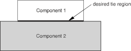
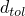
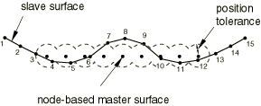
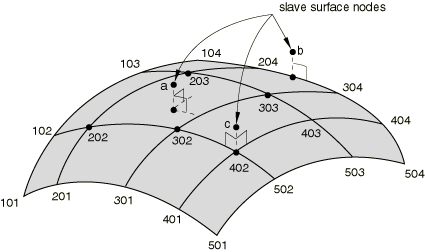
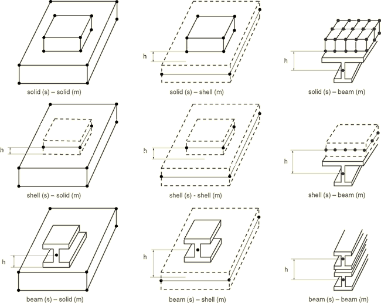
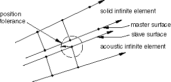

# 35.3.1 Mesh tie constraints


**Products: **Abaqus/Standard  Abaqus/Explicit  Abaqus/CAE  

##### **References**

- ["Surfaces: overview," Section 2.3.1](pt01ch02s03aus16.md)
- [*TIE](../key/key-link.md#usb-kws-mtie)
- ["Defining tie constraints," Section 15.15.1 of the Abaqus/CAE User's Guide](../usi/usi-link.md#usi-itn-help-tied)
- ["Using contact and constraint detection," Section 15.16 of the Abaqus/CAE User's Guide](../usi/usi-link.md#usi-itn-detectioneditor)

### Overview

A surface-based tie constraint: 
- ties two surfaces together for the duration of a simulation;
- can be used only with surface-based constraint definitions;
- can be used in mechanical, coupled temperature-displacement, coupled thermal-electrical-structural, acoustic pressure, coupled acoustic pressure-displacement, coupled pore pressure--displacement, coupled thermal-electrical, or heat transfer simulations;
- can also be used to create a constraint on a surface so that it follows the motion of a three-dimensional beam;
- is useful for mesh refinement purposes, especially for three-dimensional problems;
- allows for rapid transitions in mesh density within the model;
- constrains each of the nodes on the slave surface to have the same motion and the same value of temperature, pore pressure, acoustic pressure, or electrical potential as the point on the master surface to which it is closest;
- will take the initial thickness and offset of shell elements underlying the surface into account by default; and
- eliminates the degrees of freedom of the slave surface nodes that are constrained, where possible.

### Defining a tie constraint for a pair of surfaces

A surface-based tie constraint can be used to make the translational and rotational motion as well as all other active degrees of freedom equal for a pair of surfaces. By default, as discussed below, nodes are tied only where the surfaces are close to one another. One surface in the constraint is designated to be the slave surface; the other surface is the master surface. A name must be assigned to this constraint and may be used in postprocessing with Abaqus/CAE.

| **Input File Usage: ** | ``` [*TIE](../key/key-link.md#usb-kws-mtie), NAME=*name* *slave_surface_name*, *master_surface_name* ``` |
| --- | --- |

| **Abaqus/CAE Usage: ** | Interaction module: **Create Constraint**: **Tie** |
| --- | --- |

### Defining the surfaces to be constrained

Either element-based or node-based surfaces can be used as the slave surface. Any surface type (element-based, node-based, or analytical) can be used as the master surface. You may need to take some surface restrictions into consideration depending on which tie formulation is used and whether the analysis is conducted in Abaqus/Standard or Abaqus/Explicit. Two tie formulations are available: the surface-to-surface formulation, which is used by default in Abaqus/Standard, and the more traditional node-to-surface formulation, which is used by default in Abaqus/Explicit; these formulations are discussed in more detail later in this section. [Table 35.3.1--1](pt08ch35s03aus132.md#table-tie-characteristics) and [Table 35.3.1--2](pt08ch35s03aus132.md#table-tie-surface-characteristics) provide comparisons of surface restrictions for the different formulations and analysis codes.

**Table 35.3.1–1** Comparison of characteristics for surface-based tie formulations.
| Tie formulation | Optimized stress accuracy | Node-based surfaces allowed | Mixture of rigid and deformable subregions allowed | Treatment of nodes/facets shared between master and slave surfaces |
| --- | --- | --- | --- | --- |
| Surface-to-surface (Abaqus/Standard or Abaqus/Explicit) | Yes | Reverts to node-to-surface formulation | No | Eliminated from slave |
| Node-to-surface in Abaqus/Standard | No | Yes | No | Eliminated from slave |
| Node-to-surface in Abaqus/Explicit | No | Yes | Yes | Eliminated from master |

**Table 35.3.1–2** Comparison of element-based surface characteristics allowed for surface-based tie formulations.
| Tie formulation | Surface Characteristics (Yes=allowed, No=not allowed) |
| --- | --- |
| Double-sided | Discontinuous | T-intersection | Edge-based |
| Surface-to-surface (Abaqus/Standard or Abaqus/Explicit) | Master: YesSlave: Yes | Master: YesSlave: Yes | Master: NoSlave: Yes | Reverts to node-to-surface formulation if either surface is edge-based |
| Node-to-surface in Abaqus/Standard | Master: YesSlave: Yes | Master: YesSlave: Yes | Master: NoSlave: Yes | Master: YesSlave: Yes |
| Node-to-surface in Abaqus/Explicit | Master: YesSlave: Yes | Master: YesSlave: Yes | Master: YesSlave: Yes | Master: YesSlave: Yes |

The surface-to-surface formulation generally avoids stress noise at tied interfaces. As indicated in [Table 35.3.1--1](pt08ch35s03aus132.md#table-tie-characteristics) and [Table 35.3.1--2](pt08ch35s03aus132.md#table-tie-surface-characteristics), only a few surface restrictions apply to the surface-to-surface formulation: this formulation reverts to the node-to-surface formulation if a node-based or edge-based surface is used. The surface-to-surface formulation does not allow for a mixture of rigid and deformable portions of a surface, and the master surface must not contain T-intersections. Any nodes shared between the slave and master surfaces will not be tied with the surface-to-surface formulation. The same comments apply to both Abaqus/Standard and Abaqus/Explicit in these tables for the surface-to-surface formulation.

With the more traditional node-to-surface formulation additional surface restrictions apply in Abaqus/Standard but fewer restrictions apply in Abaqus/Explicit in comparison to the surface-to-surface formulation. Relatively stringent restrictions on master surface connectivity for the node-to-surface tie formulation in Abaqus/Standard are indicated in [Table 35.3.1--2](pt08ch35s03aus132.md#table-tie-surface-characteristics): the master surface must be simply connected and must not contain complex intersections such as T-intersections (see ["Defining contact pairs in Abaqus/Standard," Section 36.3.1](pt09ch36s03aus145.md), for examples of surfaces with various connectivity characteristics).

Differences with the node-to-surface formulation in Abaqus/Explicit are apparent in [Table 35.3.1--1](pt08ch35s03aus132.md#table-tie-characteristics): partially rigid surfaces can be used and the treatment of shared portions of slave and master surfaces is unique to this case. Nodes and faces that are shared between the master and slave surfaces are eliminated automatically from the master surface in this case if the paired surfaces are either both element-based or both node-based, enabling the possibility of tying multiple slave surfaces (defined over various regions of the model) to a common master surface defined over the entire model. This is a convenient way to define tie constraints in large models, as it eliminates the need for defining specialized master surfaces for each surface pairing; however, you must still take care that slave surfaces do not include portions of the opposing surface to which they should be tied (for example, no tie constraints will be generated if the master and slave surfaces are identical). In the node-to-surface formulation in Abaqus/Explicit all facets attached to nodes that are common between slave and master surfaces are excluded from being tied to slave nodes. Sometimes when meshes are transitioned from one type of element to another type or from one element size to another element size, common nodes may exist at the interface of the two regions. Typically, a tie constraint is defined at the interface of the two zones to stitch the two meshes together. In a situation like this common nodes may get tied to a neighboring facet on the interface and may cause undesirable mesh distortion due to the tie adjustment. One possible way to avoid the undesirable mesh distortion is to specify a very small position tolerance for the tie pair. Another situation that may arise when common nodes occur between the slave and master surfaces at the interface of mesh transition zones is that slave nodes in the vicinity of the common node may not get tied. This happens due to the exclusion of master facets attached to the common nodes. Therefore, care must be taken to ensure that elements in different mesh zones do not share common nodes at the interface. For all such common nodes, duplicate nodes occupying the same physical location should be defined.

| **Input File Usage: ** | Use the [*SURFACE](../key/key-link.md#usb-kws-msurface) option to define the slave and master surfaces used in the constraint (see ["Surfaces: overview," Section 2.3.1](pt01ch02s03aus16.md)): |
| --- | --- |
|  | ``` [*SURFACE](../key/key-link.md#usb-kws-msurface), NAME=*slave_surface_name* [*SURFACE](../key/key-link.md#usb-kws-msurface), NAME=*master_surface_name* ``` |

| **Abaqus/CAE Usage: ** | In Abaqus/CAE you can select one or more faces directly in the viewport when you are prompted to select a surface. In addition, you can define surfaces as collections of faces and edges using the Surface toolset. |
| --- | --- |

### Specifying the subset of slave nodes to be constrained

By default, Abaqus uses a position tolerance criterion to determine the constrained nodes based on the distance between the slave nodes and the master surface. Alternatively, you can specify a node set containing the slave nodes to be constrained regardless of their distance to the master surface.

#### Using the position tolerance criterion

The default position tolerance criterion ensures that nodes are tied only where the slave and master surfaces are close to one another in the initial configuration. For example, consider the case shown in [Figure 35.3.1--1](pt08ch35s03aus132.md#tietwocomponents). Surfaces `Comp1_surf` and `Comp2_surf` are defined to cover all exposed faces of Component 1 and Component 2, respectively. These two surfaces can be used as the slave and master surfaces in a tie constraint to tie the two components in the desired region, because only the nodes at the initial interface between the two surfaces are tied.

**Figure 35.3.1–1** Example of two components to be tied together.



The default value of the position tolerance, , typically results in desired tie constraints with little effort. Details regarding the calculation of distances between surfaces and default values of the position tolerances are provided below. You can modify the position tolerance if desired.

| **Input File Usage: ** | Use the following option to use the default position tolerance: |
| --- | --- |
|  | ``` [*TIE](../key/key-link.md#usb-kws-mtie) ``` Use the following option to specify a position tolerance: ``` [*TIE](../key/key-link.md#usb-kws-mtie), POSITION TOLERANCE=*distance* ``` |

| **Abaqus/CAE Usage: ** | Interaction module: **Create Constraint**: **Tie**: **Position Tolerance**: **Specify distance** |
| --- | --- |

##### Calculating the distance between surfaces

The following factors influence the calculation of the distance between surfaces for a particular slave node:
- Shell thickness. By default, calculations of distances between surfaces account for shell thickness and offset effects for element-based slave or master surfaces: the distance is measured from the actual top or bottom side of the surface, whichever is closer to the other surface. Alternatively, you can specify that surface thicknesses and offsets should be ignored, which also has implications for nodal position adjustments for resolving initial gaps (discussed later). | **Input File Usage: ** | Use the following option to ignore surface thicknesses and offsets in the distance calculations: | | --- | --- | | | ``` [*TIE](../key/key-link.md#usb-kws-mtie), NO THICKNESS ``` | | **Abaqus/CAE Usage: ** | Interaction module: **Create Constraint**: **Tie**: **Exclude shell element thickness** | | --- | --- |
- Whether the surface-to-surface or node-to-surface constraint formulation (discussed below) is used. If a position tolerance is in effect, a constraint is generated at a slave node for either formulation if the distance between the surfaces, as calculated at the slave node, does not exceed . Additional slave nodes may be tied if the surface-to-surface constraint formulation is used along with an element-based slave surface and a master surface that is not node-based, because the following addendum to the position tolerance criterion applies in such cases: if the distance between the surfaces is within  over a significant portion of a slave face (or segment in two dimensions) that forms an angle of less than 30 with the master surface, all slave nodes attached to such a face (or segment) are considered to satisfy the position tolerance.
- The types of surfaces involved (element-based, node-based, or analytical).

##### Position tolerance for an element-based master surface

The default position tolerance for element-based master surfaces is 5% or 10% of the typical master facet diagonal length for the node-to-surface and surface-to-surface tie formulations, respectively. When using an element-based master surface, the distance between surfaces for a particular point on a slave surface is based on the closest point on the master surface (which may be on the edge of the master surface or within a facet). [Figure 35.3.1--2](pt08ch35s03aus132.md#surfbasedtie-element) 

**Figure 35.3.1–2** Tolerance region around an element-based master surface with no thickness.


shows an example with no thickness: nodes 2–14 satisfy the position tolerance criterion for the node-to-surface and surface-to-surface constraint formulations. Significant portions of the end slave segments (that is, the segment connecting nodes 1 and 2 and the segment connecting nodes 14 and 15) are within the position tolerance shown, so nodes 1 and 15 would also satisfy the position tolerance criterion for the surface-to-surface constraint formulation except for the fact that the angle between the slave and master surfaces is slightly greater than 30 at those locations.

##### Position tolerance for a node-based master surface

 The default position tolerance for a node-based master surface is based on the average distance between nodes in the master surface. The distance between the surfaces for a particular slave node is based on the closest master node. If this distance is less than the position tolerance, Abaqus will create a tie constraint between the slave node, the closest master node, and other master nodes in similar proximity to the slave node. For mismatched meshes across a tied interface, the distance between slave and master nodes can be much larger than the “normal” distance between the surfaces, which can lead to confusion when using a position tolerance criterion with a node-based master surface. [Figure 35.3.1--3](pt08ch35s03aus132.md#surfbasedtie-node) shows how the tolerance region is defined around a node-based master surface. The surface-to-surface constraint formulation reverts to the node-to-surface constraint formulation for a node-based master surface. 

**Figure 35.3.1–3** Tolerance region around a node-based master surface with no thickness.



##### Position tolerance for an analytical rigid master surface

The default position tolerance for tie constraints between an element-based slave surface and an analytical rigid master surface is 5% or 10% of the typical slave facet diagonal length for the node-to-surface and surface-to-surface tied formulations, respectively. The default position tolerance for tie constraints between a node-based slave surface and an analytical rigid master surface is 5% of the typical distance between slave nodes. When using an analytical rigid master surface, the distance between surfaces for a particular point on the slave surface is based on the closest point on the master surface.

#### Specifying the constrained nodes directly

This method allows you direct control over which slave nodes are tied.

| **Input File Usage: ** | ``` [*TIE](../key/key-link.md#usb-kws-mtie), TIED NSET=*node_set_label* ``` |
| --- | --- |

| **Abaqus/CAE Usage: ** | Specifying the constrained nodes directly is not supported in Abaqus/CAE. |
| --- | --- |

#### Unconstrained nodes in tie constraint pairs

Abaqus does not constrain slave nodes to the master surface unless they are included in the tied node set or within the tolerance distance from the master surface at the start of the analysis, as discussed above. Any slave nodes not satisfying these criteria will remain unconstrained for the duration of the simulation; they will never interact with the master surface as part of the tie constraint. In mechanical simulations an unconstrained slave node can penetrate the master surface freely unless contact is defined between the slave node and master surface. The general contact algorithm in Abaqus/Explicit will generate contact exclusions automatically for slave node–master surface combinations corresponding to constrained nodes of tie constraint pairs, but no such contact exclusions are generated for nodes outside the position tolerance of the constraints. In a thermal, acoustic, electrical, or pore pressure simulation an unconstrained slave node will not exchange heat, fluid pressure, electrical current, or pore fluid pressure with the master surface.

##### Determining which slave nodes have been tied and which slave nodes have not been tied

For each tie constraint pair, Abaqus creates a node set comprising slave nodes that will be tied and a node set comprising slave nodes that will be left unconstrained. These node sets are available for display during postprocessing in Abaqus/CAE, where they are listed as internal node sets.

In addition, Abaqus prints a table in the data (`.dat`) file listing each slave node and the master surface nodes to which it will be tied if model definition data are requested (see ["Controlling the amount of analysis input file processor information written to the data file" in "Output," Section 4.1.1](pt02ch04s01aus38.md#usb-out-ooutput-data-control)). If a constraint cannot be formed for a given slave node, Abaqus/Standard issues a warning message in the data file.

In Abaqus/Explicit you can also request two nodal field output variables: TIEDSTATUS will help you identify the constrained and unconstrained slave nodes, and TIEADJUST will help you visualize the adjustment performed at the nodes (see ["Abaqus/Explicit output variable identifiers," Section 4.2.2](pt02ch04s02xbv01.md)). A tied node that participates in more than one tie definition as a slave as well as a master is shown as “tied” regardless of whether it got tied as a slave node or as a master node.

When creating a model with surface-based tie constraints, it is important to use the information provided by Abaqus to identify any unconstrained nodes and to make any necessary modifications to the model to constrain them.

### Constraining the rotational degrees of freedom

By default, Abaqus will constrain the rotational degrees of freedom when they exist on both slave and master surfaces (see [Figure 35.3.1--4](pt08ch35s03aus132.md#surfbasedtie-algorithm)). 

**Figure 35.3.1–4** Surface-based tie algorithm.


You can specify that the rotational degrees of freedom should not be tied.

| **Input File Usage: ** | ``` [*TIE](../key/key-link.md#usb-kws-mtie), NO ROTATION ``` |
| --- | --- |

| **Abaqus/CAE Usage: ** | Interaction module: **Create Constraint**: **Tie**: toggle off **Tie rotational DOFs if applicable** |
| --- | --- |

### Constraining the faces of a cyclic symmetric structure in Abaqus/Standard

You can enforce proper constraints on the faces bounding a repetitive sector of a cyclic symmetric structure (see ["Analysis of models that exhibit cyclic symmetry," Section 10.4.3](pt04ch10s04at34.md)). This makes it possible to define a single sector of the cyclic symmetry model together with its axis of cyclic symmetry to define the behavior of the 360 model. Cyclic symmetry models can be used within the following procedures: static; quasi-static; eigenfrequency extraction, based on the Lanczos solver technique; steady-state dynamics, based on modal superposition; and heat transfer. If an eigenfrequency extraction is performed on a cyclic symmetric model, the nodes involved in the cyclic symmetry constraint cannot be used in any other constraint (e.g., multi-point constraints, equations, rigid bodies, couplings, or kinematic couplings).

| **Input File Usage: ** | ``` [*TIE](../key/key-link.md#usb-kws-mtie), CYCLIC SYMMETRY ``` |
| --- | --- |
|  | This parameter can be used only with the [*CYCLIC SYMMETRY MODEL](../key/key-link.md#usb-kws-mcycsymmodel) option. |

| **Abaqus/CAE Usage: ** | Interaction module: ****Interaction****Create****: **Cyclic symmetry** |
| --- | --- |

### The surface-based tie constraint formulation

Abaqus uses the criteria discussed above to determine which slave nodes will be tied to the master surface. Abaqus then forms constraints between these slave nodes and the nodes on the master surface. A key aspect in forming the constraint for each slave node is determining the tie coefficients. These coefficients are used to interpolate quantities from the master nodes to the tie point. Abaqus can use one of two approaches to generate the coefficients: the “surface-to-surface” approach or the “node-to-surface” approach.

If an analysis carried out with Abaqus/Standard is imported into Abaqus/Explicit or vice-versa, the tie constraints are not imported and must be redefined. If the imported analysis is essentially a continuation of the original analysis, it is important that the tie constraints are as similar as possible. Hence, you should make sure that the same constraint type is used. If the default approach was used in the original Abaqus/Standard analysis, the surface-to-surface approach should be specified in the Abaqus/Explicit analysis. Similarly, if the default approach was used in the original Abaqus/Explicit analysis, the node-to-surface approach should be specified in the Abaqus/Standard analysis.

#### The "surface-to-surface" approach

The “surface-to-surface” approach minimizes numerical noise for tied interfaces involving mismatched meshes. The surface-to-surface approach enforces constraints in an average sense over a finite region, rather at discrete points as in the traditional node-to-surface approach. The surface-to-surface formulation for surface-based tie constraints is similar to the surface-to-surface contact formulation (see ["Contact formulations in Abaqus/Standard," Section 38.1.1](pt09ch38s01aus177.md)); however, a fundamental difference is that each surface-based tie constraint involves only one slave node (and multiple master nodes), whereas each surface-to-surface contact constraint involves multiple slave nodes.

 The surface-to-surface approach is used by default in Abaqus/Standard with exceptions noted below, and it is optional in Abaqus/Explicit. For the case of infinite acoustic elements tied to shell elements in Abaqus/Standard the added cost of the surface-to-surface approach can be quite significant; therefore, the node-to-surface approach is used by default in this case. If the surface-to-surface approach is “on by default” or explicitly specified, Abaqus automatically reverts to the node-to-surface approach for individual tie constraints in the following circumstances:
- if either of the surfaces being tied is node-based;
- if the projection along the slave surface normal direction does not intersect the master surface; or
- if single-sided slave and master surfaces have surface normals in approximately the same direction.

Abaqus/Explicit may automatically add a small amount of artificial mass to the model to maintain numerical stability if the surface-to-surface approach is specified.

 The surface-to-surface approach generally involves more master nodes per constraint than the node-to-surface approach, which tends to increase the solver bandwidth in Abaqus/Standard and, therefore, can increase solution cost. In most applications the extra cost is fairly small, but the cost can become significant in some cases. The following factors (especially in combination) can lead to the surface-to-surface approach being quite costly:
- A large fraction of tied nodes (degrees of freedom) in the model
- The master surface being more refined than the slave surface
- Multiple layers of tied shells, such that the master surface of one tie constraint acts as the slave surface of another tie constraint

| **Input File Usage: ** | ``` [*TIE](../key/key-link.md#usb-kws-mtie), TYPE=SURFACE TO SURFACE ``` |
| --- | --- |

| **Abaqus/CAE Usage: ** | Interaction module: **Create Constraint**: **Tie**: **Discretization method: Surface to surface** |
| --- | --- |

#### The "node-to-surface" approach

The traditional “node-to-surface” approach (which is used by default in Abaqus/Explicit and is optional in Abaqus/Standard) sets the coefficients equal to the interpolation functions at the point where the slave node projects onto the master surface. This approach is somewhat more efficient and robust for complex surfaces.

For the node-to-surface method of establishing the tie coefficients with an element-based master surface, the point on the surface closest to each slave node is calculated and used to determine the master nodes that are going to form the constraint (see [Figure 35.3.1--5](pt08ch35s03aus132.md#surfbasedtie-constraint)). For example, nodes 202, 203, 302, and 303 are used to constrain node *a*; nodes 204 and 304 are used to constrain node *b*; and node 402 is used to constrain node *c*. 

**Figure 35.3.1–5** Searching for the points on an element-based master surface that are closest to nodes *a*, *b*, and *c*.



| **Input File Usage: ** | ``` [*TIE](../key/key-link.md#usb-kws-mtie), TYPE=NODE TO SURFACE ``` |
| --- | --- |

| **Abaqus/CAE Usage: ** | Interaction module: **Create Constraint**: **Tie**: **Discretization method: Node to surface** |
| --- | --- |

#### Choosing the slave and master surfaces of a surface-based tie constraint

The choice of slave and master surfaces can have a significant effect on the accuracy of the solution, in particular if the “node-to-surface” approach is used. The effect is much less (and the accuracy generally better) for the “surface-to-surface” approach. In either case, if both surfaces in a constraint pair are deformable surfaces, the master surface should be chosen as the surface with the coarser mesh for best accuracy.

In Abaqus/Standard a rigid surface cannot act as a slave surface in a tie constraint. To comply with this rule, the capability to automatically resolve overconstraints in Abaqus/Standard (see ["Overconstraint checks," Section 35.6.1](pt08ch35s06aus138.md)) will modify tie constraint definitions in the following cases:
- Tie constraints between two surfaces of the same rigid body are removed.
- Tie constraints between two surfaces of two rigid bodies are replaced by a BEAM-type connector between the respective rigid body reference nodes.
- Tie constraints specified with a purely rigid slave surface and a purely deformable master surface are modified to reverse the master and slave assignments unless this is not possible due to other modeling restrictions (in which case an error message is issued).

These methods are not applied if the slave surface that you specified is partially rigid and partially deformable; Abaqus/Standard issues an error message in such cases.

In acoustic, structural-acoustic, and elastic wave propagation problems care should be exercised when tying meshes of highly dissimilar refinement. If two media have different wave speeds, the optimal meshes for each of the media will have different characteristic element lengths: the faster medium will have larger elements. If surfaces of these meshes are used in a tie constraint, the surface of the finer mesh (of the slower medium) should be designated as the slave. Nevertheless, in the region near the tied surfaces, the physical wave phenomena in *both* fast and slow media will typically have length scales characteristic of the slower medium; that is, of the shortest length scale in the physical problem. Therefore, if these phenomena are important, the mesh of the faster medium should be refined to the scale of the slower medium in the vicinity of the contact region.

### Adjusting the surfaces and considering offsets

By default, with the exceptions mentioned below, Abaqus will automatically reposition the slave nodes to be tied in the initial configuration without causing strain to resolve gaps such that the surfaces are just touching, accounting for any shell thickness (unless you have specified that thickness should not be accounted for, as discussed above in the context of the position tolerance criterion) but not accounting for beam or membrane thickness. One exception is that no adjustments are made where tied surfaces are closer together than the combined half-shell thickness. All adjustments are performed such that the slave and master surfaces are never pushed apart; that is, the reference surfaces will only become closer as a result of the adjustments.

It is recommended that you allow the automatic adjustments to occur, especially if neither surface has rotations; in this case a constant offset vector is used, so incorrect behavior of the constraint under rigid body rotation can occur when slave nodes are not lying exactly on the master surface. Adjustments are not made if the slave surface belongs to a substructure or when either the slave or master surface is a beam element-based surface; in the latter cases you should locate the beam element nodes with the desired offset from the other surface.

| **Input File Usage: ** | ``` [*TIE](../key/key-link.md#usb-kws-mtie), ADJUST=YES *or* NO ``` |
| --- | --- |

| **Abaqus/CAE Usage: ** | Interaction module: **Create Constraint**: **Tie**: toggle **Adjust slave node initial position** |
| --- | --- |

#### Criteria for adjustment

A slave node is considered for adjustment if both of the following conditions are met:
- The slave node satisfies whatever criterion is in effect for generating a constraint (either because it satisfies the position tolerance criterion or belongs to the specified node set of constrained slave nodes, as previously discussed).
- The slave node is more than the combined thickness of the slave and master surfaces away from its projection point on the master reference surface, accounting for any offset of the element reference surfaces from the respective element midsurfaces.

For an element-based master surface a slave node will be moved toward the closest point on the master surface; for a node-based master surface a slave node will be moved toward the closest master node. The corrected position of an adjusted slave node is determined from the combined effects of shell element thickness and any specified reference surface offset relative to the shell midsurface of either slave or master surfaces. [Figure 35.3.1--6](pt08ch35s03aus132.md#tiedshellelems) shows the adjusted slave node position in an example with two shell element-based surfaces tied together (in this example one of the element reference surfaces is offset from the element midsurface). It is assumed that the surfaces were farther apart than shown in [Figure 35.3.1--6](pt08ch35s03aus132.md#tiedshellelems) prior to the adjustment; otherwise, the slave nodes would not have been adjusted.

**Figure 35.3.1–6** Adjusted slave node position for two shell element-based surfaces tied together. The slave shell element has an offset of 0.5.


Adjustments are made only for slave nodes that are included in the user-specified tied node set or that meet the tolerance criteria described above. 

#### Adjustments for overlapping constraints

Nodal adjustments for tie constraints are processed sequentially in the order of the constraint definitions at the start of an analysis. If different constraint or contact definitions involve the same nodes, some adjustments may cause lack of compliance for contact or constraint definitions that were previously processed.  These conflicts are less likely to occur in Abaqus/Explicit because the adjustments in Abaqus/Explicit are automatically processed in the chaining order discussed in ["Overlapping constraints](pt08ch35s03aus132.md#usb-cni-ptiedconstraint-overlap).” These conflicts can be avoided in Abaqus/Standard in some cases by changing the processing order of constraint and contact definitions: nodes in common between different contact or constraint definitions should be processed first as slave nodes and later as master nodes.

| **Input File Usage: ** | To change the processing order of constraint and contact definitions, change the order of the definitions in the input file. Constraint and contact definitions are processed in the order in which they appear. |
| --- | --- |

| **Abaqus/CAE Usage: ** | To change the processing order of constraint and contact definitions, change the names of the constraints and interactions in the model. Constraints and interactions are processed alphabetically according to their name. |
| --- | --- |

#### Accounting for an offset between tied surfaces

Abaqus allows a gap to exist between tied surfaces. Such gaps may exist if you prevent nodal adjustments for tied surfaces. A gap between the reference surfaces may remain due to the presence of shell thickness even if nodal adjustments are performed. [Figure 35.3.1--7](pt08ch35s03aus132.md#tieconstraints) shows some cases where an offset between the reference surfaces may be desirable for tied surface pairs to account for shell or beam thickness. 

**Figure 35.3.1–7** Tie constraints being applied between surfaces based on various element types (h = offset between slave and master surfaces).



Rigid body motion is properly accounted for when the nodes are separated by a finite distance when at least one of the surfaces is based on shell or beam elements; when the master surface is an analytical rigid surface; or, in the case of node-based surfaces, when the nodes on at least one surface have active rotational degrees of freedom. 

The nature of the constraint on translational motion between surfaces in Abaqus depends on whether there is an offset between the surfaces and on which surfaces have rotational degrees of freedom, as discussed below.

##### Neither surface has rotational degrees of freedom

If neither surface has rotational degrees of freedom, the global translational degrees of freedom of the slave node and the closest point on the master surface are constrained to be the same. When an offset exists, Abaqus will enforce the constraint through the fixed offset like a PIN-type MPC when the nodes in the MPC are not coincident. Because the fixed offset does not rotate, the surface-based constraint will not represent rigid body rotation correctly. The constraint will represent rigid body motion correctly when the offset is zero. This behavior can be ensured by specifying that all tied slave nodes should be moved onto the master surface.

##### Only one surface has rotational degrees of freedom

If the slave surface has rotational degrees of freedom and the master surface does not, the translational motion is constrained at the closest point on the master reference surface. When the reference surfaces are offset, a moment will be applied to each slave node based on the constraint force times the offset distance. Similarly, if the master surface has rotational degrees of freedom and the slave surface does not, the translational motion is constrained at each slave node and a moment will be applied to the relevant nodes on the master surface if an offset exists. In either case the surface-based constraint will behave correctly under rigid body rotation regardless of the amount of offset.

##### Both surfaces have rotational degrees of freedom

If both surfaces have rotational degrees of freedom, are not offset, and the rotations are tied, each slave node is constrained to the master surface like a TIE-type MPC. If an offset exists between the surfaces, the constraint acts like a BEAM-type MPC between the slave node and the closest point on the master reference surface.

If the rotations are not tied, Abaqus allows you to choose the location of the translational constraint. It can be enforced at the master reference surface, the slave reference surface, or anywhere in between. The location of the translational constraint enforcement for surfaces where the rotations are not tied will affect the distribution of moment to each of the surfaces. The most physically reasonable choice is to locate the constraint at the point where the actual top or bottom sides of each surface meet. The constraint then models a perfect adhesive between the surfaces, which transfers shear stress to each surface. Abaqus will choose the location of the translational constraint as follows:
- If the master surface is shell element-based, the translational constraint is enforced on the top or bottom side of the master surface.
- If the slave surface is shell element-based and the master surface is not, the translational constraint is enforced at the top or bottom side of the slave surface.
- Otherwise, the translational constraint is enforced at the master reference surface.

To override these default locations, you can specify a constraint ratio for the tie constraint equal to the fractional distance between the master reference surface and the slave node at which the translational constraint should act. 

**Figure 35.3.1–8** Use of a constraint ratio to prescribe the location of the translational constraint.


[Figure 35.3.1--8](pt08ch35s03aus132.md#usb-constraintratio) shows an example of the use of a constraint ratio to prescribe the location of the translational constraint between two shell surfaces that are tied together with no rotational constraints. The distance between the master reference surface and the slave reference surface is *b*. The prescribed constraint ratio, *r*, is then used to locate the translational constraint at a distance *a* from the master reference surface. All distances are measured along the vector between the slave node and its projection point onto the master reference surface. The constraint behavior is then similar to that of two rigid beams pinned together, as shown.

| **Input File Usage: ** | ``` [*TIE](../key/key-link.md#usb-kws-mtie), CONSTRAINT RATIO=*value* ``` |
| --- | --- |

| **Abaqus/CAE Usage: ** | Interaction module: **Create Constraint**: **Tie**: **Constraint ratio** |
| --- | --- |

### Constraining a surface to a three-dimensional beam

The master surface for a tie constraint can be based on three-dimensional beam elements. For this case each slave node is projected onto the line formed by the nodes of the beam elements in the undeformed configuration to find the projection point. During the subsequent analysis the motion of each slave node is rigidly constrained to the motion (translation and rotation) of its projection point; i.e., each slave node and its projection point are connected by a rigid beam. Constraining other elements to a beam element-based master surface allows modeling of interactions between the surface of a (complex) beam section and its surroundings, without having to model the beam with continuum and/or shell elements. This feature can be particularly useful for modeling acoustic-structural interactions.

**Note:**Abaqus/CAE currently does not support master surfaces based on beam elements.

### Use of tie constraints in non-mechanical simulations

The surface-based tie constraint capability can be used in models where the nodal degrees of freedom on both the slave and master surfaces include electrical potential, pore pressure, acoustic pressure, and/or temperature. Except for the type of nodal degree of freedom being constrained, Abaqus uses exactly the same formulation for the tie constraint in nonmechanical simulations as it does for mechanical simulations. In general, degrees of freedom common to both surfaces are tied, and any other degrees of freedom are unconstrained.

The case of structural-acoustic constraints is the exception to this rule. Here, appropriate relations between the acoustic pressure on the fluid surface and displacements on the solid surface are formed internally (see ["Acoustic, shock, and coupled acoustic-structural analysis," Section 6.10.1](pt03ch06s10at29.md)). The displacements and/or pressure degrees of freedom on the surfaces are the only ones affected; rotations are ignored by the tie constraint in this case.

The internally computed structural-acoustic coupling conditions use surface areas and normal directions associated with the slave surface elements. The slave surface for structural-acoustic tie constraints cannot be a node-based surface. In two-dimensional analyses the out-of-plane thickness of the slave elements is required. Generally, this thickness is the thickness specified on the section definition for the slave surface elements. However, when beam elements form the slave surface in a tie constraint pair with acoustic elements, a unit thickness in the out-of-plane direction is assumed for the beams.

In Abaqus/Standard you can define coupling between solid medium and acoustic medium infinite elements along the surfaces that extend to infinity. These surfaces are defined using the edges of the acoustic elements and sides numbered “2” and higher of the solid medium infinite elements. The infinite surfaces of solid medium and acoustic infinite elements can be coupled only through the use of a surface-based tie constraint. As shown in [Figure 35.3.1--9](pt08ch35s03aus132.md#usb-infinite-element-acoustic-coupling), the acoustic infinite elements must be the slave elements and the edges of the acoustic infinite elements should lie within the specified position tolerance to the solid medium infinite element base facets. 

**Figure 35.3.1–9** Use of a surface-based tie constraint to prescribe the coupling between solid medium and acoustic medium infinite elements.



If the base facets of acoustic infinite elements are to be coupled to solid medium finite elements, to solid medium infinite elements, or to structural elements, either a surface-based tie constraint or acoustic-structural interaction elements can be used. Surfaces defined on solid medium infinite elements cannot be used in a surface-based tie constraint in Abaqus/Explicit.

[Table 35.3.1--3](pt08ch35s03aus132.md#table-slave-master-pairings) enumerates all possible cases. For other slave-master pairings not listed in this table, an error message will be issued.

**Table 35.3.1–3** Possible slave-master surface pairings.
| Slave Surface | Master Surface | Degrees of Freedom Tied |
| --- | --- | --- |
| Acoustic | Acoustic | Acoustic pressure |
| Acoustic | Stress | Translations |
| Stress | Acoustic | Acoustic pressure |
| Stress | Stress | Translations and/or rotations |
| Heat-Stress | Stress | Translations and/or rotations |
| Stress | Heat-Stress | Translations and/or rotations |
| Heat-Stress | Heat-Stress | Temperature, translations and/or rotations |
| The following surface pairings are available only in Abaqus/Standard: |
| Heat transfer | Heat transfer | Temperature |
| Electrical-Heat | Heat transfer | Temperature |
| Heat transfer | Electrical-Heat | Temperature |
| Electrical-Heat | Electrical-Heat | Temperature and electric potential |
| Pore-Stress | Pore-Stress | Pore pressure and translations |
| Pore-Stress | Stress | Translations |
| Stress | Pore-Stress | Translations |

### Tie constraints versus tied contact in Abaqus/Standard

There are the following advantages to using a surface-based tie constraint in Abaqus/Standard instead of defining tied contact as discussed in ["Defining tied contact in Abaqus/Standard," Section 36.3.7](pt09ch36s03aus151.md):
- Degrees of freedom of the slave surface nodes will be eliminated.
- The tie constraint is more efficient in terms of the size of the fronts of the operator matrix because fewer master surface nodes are associated with each slave node.
- Rotational degrees of freedom as well as translational degrees of freedom can be tied.
- Tie constraints are much more general since they allow the use of general surfaces.
- Surface offsets and shell thickness are taken into account.

### Overlapping constraints

In a model with multiple tie constraint definitions it is possible that the slave and master surfaces of different tie constraint definitions may intersect. If two tie constraint definitions have part or all of their master surfaces in common or if the surfaces tied are layered (i.e., the master surface of one tie constraint definition acts as the slave surface of a subsequent tie constraint definition), Abaqus will attempt to chain the constraint definitions together. This will reduce the number of degrees of freedom and lower the computational expense, resulting in faster run times. However, in a model with multiple tie constraint definitions if nodes on the slave surface of one tie constraint definition are part of the slave surface of other tie constraint definitions, an overconstraint occurs. In most cases the overconstraint is due to the existence of redundant constraints, and it is safe to eliminate this redundancy. However, the overconstraint may also be due to conflicting constraints, in which case the problem is due to a modeling error that you should correct. Simulation results will vary depending on which constraint is removed to avoid an overconstraint if the overlapping constraints are not identical. It is recommended that, wherever possible, you order the slave and master surfaces of the constraint definitions to avoid intersecting slave surfaces. See ["Adjustments for overlapping constraints](pt08ch35s03aus132.md#usb-cni-ptiedconstraint-adjust-overlap)” for a discussion of initial strain-free adjustments for overlapping constraints.

#### Overconstrained slave nodes in Abaqus/Standard

If an overconstraint occurs, Abaqus/Standard issues an error message unless the constraints are redundant or nearly redundant, as discussed below. As discussed previously, each tie constraint involves a single slave node and a set of master nodes with nonzero tie coefficents. Abaqus/Standard considers tie constraints involving the same slave node to be nearly redundant if at least one node is common among the respective sets of master nodes with nonzero tie coefficients. In such cases, rather than issuing an error message, Abaqus/Standard issues a warning message and only enforces one of the constraints.

The surface-based tie constraint is imposed in Abaqus/Standard by eliminating the degrees of freedom on the slave surface; therefore, nodes on the slave surface should not be used to apply boundary conditions, nor should they be used in any subsequent tie, multi-point, equation, or kinematic coupling constraint (see ["Overconstraint checks," Section 35.6.1](pt08ch35s06aus138.md), for a more complete discussion of overconstraints in Abaqus/Standard).

#### Overconstrained slave nodes in Abaqus/Explicit

In contrast, Abaqus/Explicit treats overconstraints with a penalty method, thus enforcing the constraints in an average sense; the computational cost of the analysis may increase in these cases.

In addition, if the slave surface for a tie constraint definition in Abaqus/Explicit is part of a rigid body while the master surface comprises a deformable element- or node-based surface and the master surface acts as the slave surface in a subsequent tie constraint definition, the resolution of the resulting constraints can prove to be computationally intensive. It is recommended that, wherever possible, you order the slave and master surfaces of the constraint definitions to avoid such a situation.

#### Nullifying the tie constraint on slave nodes due to element deletion in Abaqus/Explicit

In Abaqus/Explicit tie constraints are nullified as underlying elements of tied surfaces are deleted due to material point failure. The tie constraint between a slave node and its corresponding master nodes is deleted when either all the elements attached to the slave node are deleted or the master element to which the slave node is tied is deleted.

### Limitations

The following limitations exist for tie constraints:
- Surface-based tie constraints cannot be used to connect gasket elements that model thickness-direction behavior only.
- A rigid surface cannot act as a slave surface in a constraint pair in Abaqus/Standard.
- A slave node of a tie constraint cannot act as a slave node of another constraint in Abaqus/Standard.
- Tie constraints cannot be used to tie infinite elements to finite elements in Abaqus/Explicit. To couple infinite and finite elements in Abaqus/Explicit, the elements must share nodes.
- The axisymmetric solid Fourier elements with nonlinear, asymmetric deformation cannot form element-based surfaces; therefore, such surfaces cannot be used in tie constraints.
- In Abaqus/Standard, tie constraints cannot be used to connect nodes included in a node-based surface or nodes included in an element-based surface defined using an element edge identifier if such nodes have more than one temperature degree of freedom.


