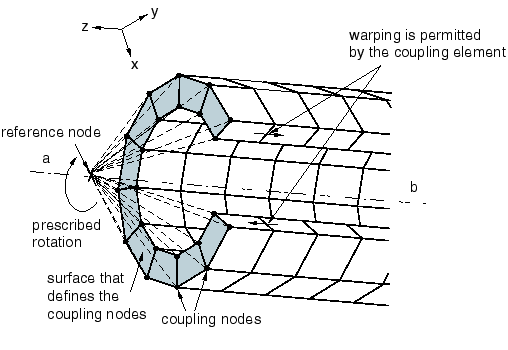
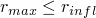
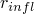
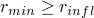
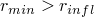
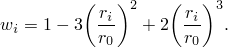

# 35.3.2 Coupling constraints


**Products: **Abaqus/Standard  Abaqus/Explicit  Abaqus/CAE  

##### **References**

- ["Surfaces: overview," Section 2.3.1](pt01ch02s03aus16.md)
- [*COUPLING](../key/key-link.md#usb-kws-mcoupling)
- [*KINEMATIC](../key/key-link.md#usb-kws-mkinematic)
- [*DISTRIBUTING](../key/key-link.md#usb-kws-mdistributing)
- ["Defining coupling constraints," Section 15.15.4 of the Abaqus/CAE User's Guide](../usi/usi-link.md#usi-itn-helptopic-coupling)

### Overview

The surface-based coupling constraint:
- couples the motion of a collection of nodes on a surface to the motion of a reference node;
- is of type kinematic when the group of nodes is coupled to the rigid body motion defined by the reference node;
- is of type distributing when the group of nodes can be constrained to the rigid body motion defined by a reference node in an average sense by allowing control over the transmission of forces through weight factors specified at the coupling nodes;
- automatically selects the coupling nodes located on a surface lying within a region of influence;
- can be used with two- or three-dimensional stress/displacement elements; and
- can be used in geometrically linear and nonlinear analysis.

### Surface-based coupling definitions

The surface-based coupling constraint in Abaqus provides coupling between a reference node and a group of nodes referred to as the “coupling nodes.” This option provides the same functionality as the kinematic coupling constraint and the distributing coupling elements (DCOUP2D, DCOUP3D) in Abaqus/Standard with a surface-based user interface. The coupling nodes are selected automatically by specifying a surface and an optional influence region. The procedure used to define the coupling nodes is discussed below.

For a distributing coupling constraint, the distributing weight factors are calculated automatically if the surface is an element-based surface. In such a case the weight factors are based on the tributary area at each coupling node, except for a surface along a shell edge, where the weight factors are based on the tributary edge length. Furthermore, the distributing weight factors can be modified using one of several weighting methods, which allow the forces transferred to the coupling nodes to vary inversely with the radial distance from the reference node.

### Typical applications

The coupling constraint is useful when a group of coupling nodes is constrained to the rigid body motion of a single node. The coupling constraint can be employed effectively in the following applications:
- To apply loads or boundary conditions to a model. [Figure 35.3.2--1](pt08ch35s03aus133.md#kinematic) illustrates the use of a kinematic coupling constraint to prescribe a twisting motion to a model without constraining the radial motion. **Figure 35.3.2--1** Kinematic coupling constraint.  [Figure 35.3.2--2](pt08ch35s03aus133.md#distributing) illustrates a distributing coupling constraint used to prescribe a displacement and rotation condition on a boundary where relative motion between the nodes on the boundary is required. In this example a twist is prescribed at the end of the structure that is expected to warp and/or deform within the end surface. **Figure 35.3.2--2** Distributing coupling constraint. 
- To distribute loads on a model, where the load distribution can be described with a moment-of-inertia expression. Examples of such cases include the classic bolt-pattern and weld-pattern distribution expressions.
- To apply dimensionality transitions between continuum and structural elements. For example, a distributing coupling allows flexible coupling between structural and solid elements.
- To model end conditions. For example, modeling a rigid end plate or modeling plane sections of a solid to remain planar can be done easily with a kinematic coupling definition.
- To simplify modeling of complex constraints. In a kinematic coupling definition the degrees of freedom that participate in the constraint may be selected individually in a local coordinate system.
- To model interactions with other constraints, such as connector elements. For example, a hinged part may be modeled more realistically by two distributing coupling definitions, whose reference nodes are connected by a hinge connector element. The load transfer then occurs between two "clouds" of nodes, rather than between two single nodes. ["Substructure analysis of a one-piston engine model," Section 4.1.10 of the Abaqus Example Problems Guide](../exa/exa-link.md#exa-mec-onepistoneng), illustrates this use of connector elements in conjunction with coupling constraints to model a one-piston engine.

### Defining the coupling constraint

Defining a coupling constraint requires the specification of the reference node (also called the constraint control point), the coupling nodes, and the constraint type. The coupling constraint associates the reference node with the coupling nodes. A name must be assigned to the constraint and may be used in postprocessing with Abaqus/CAE. A node number or node set name may be specified for the reference node. If a node set is specified, the node set must contain exactly one node. The reference node for a kinematic coupling constraint has both translational and rotational degrees of freedom. The surface on which the coupling nodes are located can be node-based; element-based; or, in Abaqus/Explicit, a combination of both surface types. You can specify an optional radius of influence that limits the coupling nodes to a specific region on the surface. Details on how coupling nodes are defined by specifying an influence region are discussed below.

The constraint type can be either kinematic or distributing, as discussed below.

| **Input File Usage: ** | Use the following options: |
| --- | --- |
|  | ``` [*COUPLING](../key/key-link.md#usb-kws-mcoupling), CONSTRAINT NAME=*name*, REF NODE=*n*, SURFACE=*surface* [*KINEMATIC](../key/key-link.md#usb-kws-mkinematic) *or* [*DISTRIBUTING](../key/key-link.md#usb-kws-mdistributing) ``` |

| **Abaqus/CAE Usage: ** | Interaction module: **Create Constraint**: **Coupling**: **Coupling type**: **Kinematic**, **Continuum distributing**, or **Structural distributing** |
| --- | --- |

### Specifying a region of influence

By default, coupling nodes belonging to the entire surface are selected for the coupling definition. You can limit the coupling nodes to lie within a spherical region centered about the reference node by defining a radius of influence.

The procedure by which coupling nodes are selected for the constraint definition depends on the surface type:
- For a node-based surface, all the nodes defined by the surface definition that fall within the influence region are selected for the coupling definitions.
- For an element-based surface, the surface facets that are either fully or partially inscribed by the influence region are determined. All nodes belonging to these facets, whether or not these nodes fall within the influence region, are selected for the coupling nodes. When the influence radius is less than the distance to the closest coupling node, Abaqus selects all nodes belonging to the closest facet. If the projection of the reference node on the surface falls on an edge or a vertex of multiple facets, all nodes belonging to these facets adjoining the edge or vertex are included in the coupling definition. In the case where the influence radius is less than the distance to the closest coupling node, adjacent surface faces must have consistent normal directions; otherwise, Abaqus issues an error message.
- A distributing coupling constraint must include at least two coupling nodes. If fewer than two coupling nodes are found, Abaqus issues an error message during input file preprocessing.

| **Input File Usage: ** | ``` [*COUPLING](../key/key-link.md#usb-kws-mcoupling), CONSTRAINT NAME=*name*, REF NODE=*n*, SURFACE=*surface*, INFLUENCE RADIUS=*r* ``` |
| --- | --- |

| **Abaqus/CAE Usage: ** | Interaction module: **Create Constraint**: **Coupling**: **Influence radius**: **Specify** |
| --- | --- |

### Kinematic coupling constraints

Kinematic coupling constrains the motion of the coupling nodes to the rigid body motion of the reference node. The constraint can be applied to user-specified degrees of freedom at the coupling nodes with respect to the global or a local coordinate system.

Kinematic constraints are imposed by eliminating degrees of freedom at the coupling nodes.  In Abaqus/Standard once any combination of displacement degrees of freedom at a coupling node is constrained, additional displacement constraints—such as MPCs, boundary conditions, or other kinematic coupling definitions—cannot be applied to any coupling node involved in a kinematic coupling constraint. The same limitation applies for rotational degrees of freedom. This restriction does not apply in Abaqus/Explicit. See ["Kinematic constraints: overview," Section 35.1.1](pt08ch35s01abo32.md), for more information.

| **Input File Usage: ** | Use both of the following options to define a kinematic coupling constraint: |
| --- | --- |
|  | ``` [*COUPLING](../key/key-link.md#usb-kws-mcoupling) [*KINEMATIC](../key/key-link.md#usb-kws-mkinematic) *first dof*, *last dof* ``` For example, the following coupling constraint is used to constrain degrees of freedom 1, 2, and 6 on surface `surfA` to reference node 1000: ``` [*COUPLING](../key/key-link.md#usb-kws-mcoupling), CONSTRAINT NAME=C1, REF NODE=1000, SURFACE=surfA [*KINEMATIC](../key/key-link.md#usb-kws-mkinematic) 1, 2 6, ``` |

| **Abaqus/CAE Usage: ** | Interaction module: **Create Constraint**: **Coupling**: **Coupling type**: **Kinematic**: toggle on the degrees of freedom |
| --- | --- |

#### Translational degrees of freedom

Translational degrees of freedom are constrained by eliminating the specified degrees of freedom at the coupling nodes. When all translational degrees of freedom are specified, the coupling nodes follow the rigid body motion of the reference node.

#### Rotational degrees of freedom

Rotational degrees of freedom are constrained by eliminating the specified degrees of freedom at the coupling nodes.

All combinations of selected rotational degrees of freedom result in rotational behavior identical to existing MPC types:
- Selection of three rotational degrees of freedom along with three displacement degrees of freedom is equivalent to MPC type BEAM.
- Selection of two rotational degrees of freedom is equivalent to MPC type REVOLUTE in Abaqus/Standard.
- Selection of one rotational degree of freedom is equivalent to MPC type UNIVERSAL in Abaqus/Standard.

In Abaqus/Standard internal nodes are created by the kinematic coupling to enforce the constraints that are equivalent to MPC types REVOLUTE and UNIVERSAL. These nodes have the same degrees of freedom as the additional nodes used in these MPC types and are included in the residual check for nonlinear analysis.

#### Specifying a local coordinate system

The kinematic coupling constraint can be specified with respect to a local coordinate system instead of the global coordinate system (see ["Orientations," Section 2.2.5](pt01ch02s02aus15.md)). [Figure 35.3.2--1](pt08ch35s03aus133.md#kinematic) illustrates the use of a local coordinate system to constrain all but the radial translation degrees of freedom of the coupling nodes to the reference node. In this example a local cylindrical coordinate system is defined that has its axis coincident with the structure's axis. The coupling node constraints are then specified in this local coordinate system.

| **Input File Usage: ** | ``` [*COUPLING](../key/key-link.md#usb-kws-mcoupling), ORIENTATION=*local* ``` |
| --- | --- |
|  | For example, the following input is used to specify the kinematic coupling constraint shown in [Figure 35.3.2--1](pt08ch35s03aus133.md#kinematic): ``` [*ORIENTATION](../key/key-link.md#usb-kws-morientation), SYSTEM=CYLINDRICAL, NAME=COUPLEAXIS 0.0, -1.0, 0.0, 0.0, 1.0, 0.0 [*COUPLING](../key/key-link.md#usb-kws-mcoupling), REF NODE=500, SURFACE=Endcap, ORIENTATION=COUPLEAXIS [*KINEMATIC](../key/key-link.md#usb-kws-mkinematic) 2, 3 ``` |

| **Abaqus/CAE Usage: ** | Interaction module: **Create Constraint**: **Coupling**: **Edit**: select local coordinate system |
| --- | --- |

#### Constraint direction and finite rotation

In geometrically nonlinear analysis steps the coordinate system in which the constrained degrees of freedom are specified will rotate with the reference node regardless of whether the constrained degrees of freedom are specified in the global coordinate system or in a local coordinate system.

### Distributing coupling constraints

Distributing coupling constrains the motion of the coupling nodes to the translation and rotation of the reference node. This constraint is enforced in an average sense in a way that enables control of the transmission of loads through weight factors at the coupling nodes. Forces and moments at the reference node are distributed either as a coupling node-force distribution only (default) or as a coupling node-force and moment distribution. The constraint distributes loads such that the resultants of the forces (and moments) at the coupling nodes are equivalent to the forces and moments at the reference node. For cases of more than a few coupling nodes, the distribution of forces/moments is not determined by equilibrium alone, and distributing weight factors are used to define the force distribution.

The moment constraint between the rotation degrees of freedom at the reference node and the average rotation of the cloud nodes can be released in one direction in a two-dimensional analysis and one, two, or three directions in a three-dimensional analysis. In a three-dimensional analysis you can specify the moment constraint directions in the global coordinate system or in a local coordinate system. All available translational degrees of freedom at the reference node are always coupled to the average translation of the coupling nodes.

In a three-dimensional Abaqus/Standard analysis if all three moment constraints are released by specifying only degrees of freedom 1 through 3, only translation degrees of freedom will be activated on the reference node. If only one or two rotation degrees of freedom have been released, all three rotation degrees of freedom are activated at the reference node. In this case you must ensure that proper constraints have been placed on the unconstrained rotation degrees of freedom to avoid numerical singularities. Most often this is accomplished by using boundary conditions or by attaching the reference node to an element such as a beam or shell that will provide rotational stiffness to the unconstrained rotation degrees of freedom.

In Abaqus/Explicit releasing one or more of the moment constraints may lead to significant computational performance degradation. This is also the case when other constraints intersect the cloud of coupling nodes. In these cases, the degradation in performance is particularly noticeable when a large number of such distributed couplings are present in the model or when the size of the constrained “cloud” is large. For that matter, when the modeling conditions mentioned above are encountered, the size of the coupling nodes cloud is limited to 1000. To alleviate the released moment constraint issue, the following modeling technique can be used (also available in Abaqus/Standard): constrain all moments in the distributed coupling and use an appropriate connector element at the reference node (such as REVOLUTE, HINGE, CARDAN or BUSHING) to model released moments at the coupling's reference node. This technique has also the advantage of being able to specify finite compliance such as elasticity, plasticity or damage in the “released” rotational component.

| **Input File Usage: ** | ``` [*DISTRIBUTING](../key/key-link.md#usb-kws-mdistributing) *first dof*, *last dof* ``` |
| --- | --- |
|  | If no degrees of freedom are specified, all available degrees of freedom are coupled. If you specify one or more rotation degrees of freedom but not all available translation degrees of freedom, Abaqus issues a warning message and adds all available translation degrees of freedom to the constraint. For example, the following coupling constraint is used to constrain degrees of freedom 1--5 on the reference node 1000 to the average translation and rotation of surface `surfA`: ``` [*COUPLING](../key/key-link.md#usb-kws-mcoupling), CONSTRAINT NAME=C1, REF NODE=1000, SURFACE=surfA [*DISTRIBUTING](../key/key-link.md#usb-kws-mdistributing) 1, 5 ``` In this example the moment constraint between the reference node and the coupling nodes will be released in the 6-direction but will be enforced in the 4- and 5-directions. This provides a "revolute-like" rotation connection between the reference node and the coupling nodes (see ["General multi-point constraints," Section 35.2.2](pt08ch35s02aus130.md)). |

| **Abaqus/CAE Usage: ** | Interaction module: **Create Constraint**: **Coupling**: **Coupling type**: **Continuum distributing** or **Structural distributing**: toggle on the rotational degrees of freedom (Abaqus/CAE automatically constrains the translational degrees of freedom) |
| --- | --- |

#### Node-based surface

User-defined weight factors are used for node-based surfaces. The cross-sectional areas specified in the surface definition are used as the weight factors (see ["Node-based surface definition," Section 2.3.3](pt01ch02s03aus18.md)).

#### Element-based surface

For element-based surfaces the weight factors are calculated by Abaqus. The default weight distribution is based on the tributary surface area at each coupling node, except for a surface along a shell edge where the weight distribution is based on the tributary edge length. The procedure used to calculate the default weight factors is designed to ensure that if a radius of influence is prescribed, the default weight distribution varies smoothly with the influence radius.

##### Calculating the default distributing weight factors

The procedure to calculate the distributing weight factors depends on whether or not an influence radius is specified.
- If no influence radius is specified, the entire surface is used in the coupling definition. In this case all nodes located on the surface are included in the coupling definition and the distributing weight factor at each coupling node is equal to the tributary surface area.
- If an influence radius is specified, the default distributing weight factors at the coupling nodes are calculated as follows: 1. A "participation factor" is calculated for each surface facet. The participation factor is defined below. 2. The tributary nodal area (or tributary edge length along a shell edge) at each facet node is computed and is multiplied by the facet participation factor. 3. The coupling node distributing weight factor is computed as the sum of the corresponding facet nodal areas (calculated above) for all joining facets.

##### Calculating the facet participation factor

The participation factor defines the proportion of the facet's area that contributes to the distributing weight factors when an influence radius is specified. The participation factor varies between zero and one. 

To define the participation factor, the distance of the facet node closest to the reference node, , and the distance of the facet node farthest from the reference node, , are calculated.
- If , where  is the influence radius, all facet nodes lie within the influence region; and a participation factor of one is used.
- If , none of the facet nodes lie within the influence region; and the participation factor is set to zero.
- If , the facet is partially inscribed in the influence region; and the facet is assigned a participation factor equal to .

If all coupling nodes fall outside the influence radius (i.e.,  for all facets), Abaqus selects all nodes belonging to the closest facets (as outlined under “Specifying a region of influence”) and uses a participation factor equal to one.

#### Weighting methods

You can modify the default weight distribution defined above. Various weighting methods are provided that monotonically decrease with radial distance from the reference node. For each case the default weight distribution that is based on the tributary surface area (or tributary edge length along a shell edge) is scaled by the weight factor . If the weighting method is not specified, a uniform weighting method is used in which all weight factors are equal to 1.0.

##### Linearly decreasing weight distribution

A linearly decreasing weighting scheme 


where  is the weight factor at coupling node *i*,  is the coupling node radial distance from the reference node, and  is the distance to the furthest coupling node.

| **Input File Usage: ** | ``` [*DISTRIBUTING](../key/key-link.md#usb-kws-mdistributing), WEIGHTING METHOD=LINEAR ``` |
| --- | --- |

| **Abaqus/CAE Usage: ** | Interaction module: **Create Constraint**: **Coupling**: **Coupling type**: **Continuum distributing** or **Structural distributing**: **Weighting method**: **Linear** |
| --- | --- |

##### Quadratic polynomial weight distribution

A quadratic polynomial weight distribution defined by


| **Input File Usage: ** | ``` [*DISTRIBUTING](../key/key-link.md#usb-kws-mdistributing), WEIGHTING METHOD=QUADRATIC ``` |
| --- | --- |

| **Abaqus/CAE Usage: ** | Interaction module: **Create Constraint**: **Coupling**: **Coupling type**: **Continuum distributing** or **Structural distributing**: **Weighting method**: **Quadratic** |
| --- | --- |

##### Monotonically decreasing weight distribution

A monotonically decreasing weight distribution according to the cubic polynomial



| **Input File Usage: ** | ``` [*DISTRIBUTING](../key/key-link.md#usb-kws-mdistributing), WEIGHTING METHOD=CUBIC ``` |
| --- | --- |

| **Abaqus/CAE Usage: ** | Interaction module: **Create Constraint**: **Coupling**: **Coupling type**: **Continuum distributing** or **Structural distributing**: **Weighting method**: **Cubic** |
| --- | --- |

#### Specifying a local coordinate system

The distributing coupling constraint can be specified with respect to a local coordinate system instead of the global coordinate system (see ["Orientations," Section 2.2.5](pt01ch02s02aus15.md)). [Figure 35.3.2--2](pt08ch35s03aus133.md#distributing) illustrates the use of a local coordinate system to release the moment constraints between the reference node and the coupling nodes in the local 4- and 6-directions, providing a “universal-like” rotation connection. In this example a local rectangular coordinate system is defined that has its local *y*-axis coincident with the global *z*-axis. The moment constraint is specified in this local coordinate system.

| **Input File Usage: ** | ``` [*COUPLING](../key/key-link.md#usb-kws-mcoupling), ORIENTATION=*local* ``` |
| --- | --- |
|  | For example, the following input is used to specify the distributing coupling constraint shown in [Figure 35.3.2--2](pt08ch35s03aus133.md#distributing): ``` [*ORIENTATION](../key/key-link.md#usb-kws-morientation), SYSTEM=RECTANGULAR, NAME=COUPLEAXIS 0.0, 1.0, 0.0, 0.0, 0.0, 1.0 [*COUPLING](../key/key-link.md#usb-kws-mcoupling), REF NODE=500, SURFACE=Endcap, ORIENTATION=COUPLEAXIS [*DISTRIBUTING](../key/key-link.md#usb-kws-mdistributing) 1, 3 5, 5 ``` |

| **Abaqus/CAE Usage: ** | Interaction module: **Create Constraint**: **Coupling**: **Edit**: select local coordinate system |
| --- | --- |

#### Defining the surface coupling method

There are two methods available to couple the motion of the reference node to the average motion of the coupling nodes: the continuum coupling method and the structural coupling method. The continuum coupling method is used by default. 

##### Continuum coupling method

The default continuum coupling method couples the translation and rotation of the reference node to the average translation of the coupling nodes. The constraint distributes the forces and moments at the reference node as a coupling nodes force distribution only. No moments are distributed at the coupling nodes. The force distribution is equivalent to the classic bolt pattern force distribution when the weight factors are interpreted as bolt cross-section areas. The constraint enforces a rigid beam connection between the attachment point and a point located at the weighted center of position of the coupling nodes. For further details, see ["Distributing coupling elements," Section 3.9.8 of the Abaqus Theory Guide](../stm/stm-link.md#stm-elm-distcouplingelem). 

| **Input File Usage: ** | ``` [*DISTRIBUTING](../key/key-link.md#usb-kws-mdistributing), COUPLING=CONTINUUM ``` |
| --- | --- |

| **Abaqus/CAE Usage: ** | Interaction module: **Create Constraint**: **Coupling**: **Coupling type**: **Continuum distributing** |
| --- | --- |

##### Structural coupling method

The structural coupling method couples the translation and rotation of the reference node to the translation and the rotation motion of the coupling nodes. The method is particularly suited for bending-like applications of shells when the coupling constraint spans small patches of nodes and the reference node is chosen to be on or very close to the constrained surface. The constraint distributes forces and moments at the reference node as a coupling node-force and moment distribution. For this coupling method to be active, all rotation degrees of freedom at all coupling nodes must be active (as would be the case when the constraint is applied to a shell surface) and the constraints must be specified in all degrees of freedom (default). In addition, for the constraint to be meaningful, the local (or global) *z*-axis used in the constraint should be such that it is parallel to the average normal direction of the constrained surface.

With respect to translations, the constraint enforces a rigid beam connection between the reference node and a moving point that remains at all times in the vicinity of the constrained surface. The location of this moving point is determined by the approximate current curvature of the surface, the current location of the weighted center of position of the coupling nodes (see ["Distributing coupling elements," Section 3.9.8 of the Abaqus Theory Guide](../stm/stm-link.md#stm-elm-distcouplingelem)), and the *z*-axis used in the constraint. This choice avoids unrealistic contact interactions if multiple distributed coupling constraints are used to fasten pairs of shell surfaces (see ["Breakable bonds," Section 37.1.9](pt09ch37s01aus173.md), for more details). 

With respect to rotations, the constraint is different along different local directions. Along the *z*-axis (twist direction), the constraint is identical to the one enforced via the continuum coupling method (see ["Distributing coupling elements," Section 3.9.8 of the Abaqus Theory Guide](../stm/stm-link.md#stm-elm-distcouplingelem)). By contrast, the rotational constraint in the plane perpendicular to the *z*-axis relates the in-plane reference node rotations to the in-plane rotations of the coupling nodes in the immediate vicinity of the reference node. This choice provides a more realistic (compliant) response when the constrained surface is small and deforms primarily in a bending mode.

| **Input File Usage: ** | ``` [*DISTRIBUTING](../key/key-link.md#usb-kws-mdistributing), COUPLING=STRUCTURAL ``` |
| --- | --- |

| **Abaqus/CAE Usage: ** | Interaction module: **Create Constraint**: **Coupling**: **Coupling type**: **Structural distributing** |
| --- | --- |

#### Moment release and finite rotation

In geometrically nonlinear analysis steps the coordinate system of the degrees of freedom that define the moment release rotates with the reference node regardless of whether the global coordinate system or a local coordinate system is used.

#### Colinear coupling node arrangements

The distributing coupling constraint transmits moments at the reference node as a force distribution among the coupling nodes, even if these nodes have rotational degrees of freedom. Thus, when the coupling node arrangement is colinear, the constraint is not capable of transmitting all components of a moment at the reference node. Specifically, the moment component that is parallel to the colinear coupling node arrangement will not be transmitted. When this case arises, a warning message is issued that identifies the axis about which the element will not transmit a moment.

### Limitations

- A distributing coupling constraint cannot be used with axisymmetric elements with asymmetric deformation. This element type is not compatible with the distributing coupling constraint.
- If a distributing coupling constraint is used with axisymmetric elements with twist, the constraint will not include the twist degree of freedom 5 in those elements. It will involve only the displacement degrees of freedom 1 and 2.
- A distributing coupling definition with a large number of coupling nodes produces a large wavefront in Abaqus/Standard. This may result in significant memory usage and a long solution time to solve the finite element equilibrium equations.
- A distributing coupling constraint cannot involve more than 46,000 degrees of freedom in Abaqus/Standard, which implies an upper limit of 23,000 nodes per constraint for two-dimensional and axisymmetric cases and an upper limit of 15,333 nodes per constraint for three-dimensional cases.


