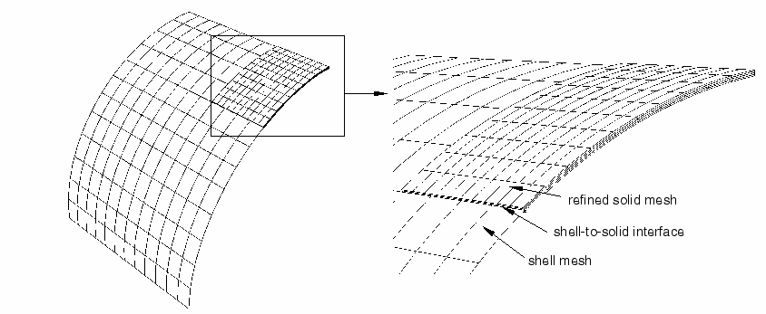
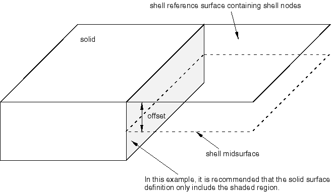

# 35.3.3 Shell-to-solid coupling


**Products: **Abaqus/Standard  Abaqus/Explicit  Abaqus/CAE  

##### **References**

- ["Coupling constraints," Section 35.3.2](pt08ch35s03aus133.md)
- ["Surfaces: overview," Section 2.3.1](pt01ch02s03aus16.md)
- [*SHELL TO SOLID COUPLING](../key/key-link.md#usb-kws-mshelltosolidcoupling)
- ["Defining shell-to-solid coupling constraints," Section 15.15.7 of the Abaqus/CAE User's Guide](../usi/usi-link.md#usi-itn-helptopic-stscoup)

### Overview

Surface-based shell-to-solid coupling:
- allows for a transition from shell element modeling to solid element modeling;
- is most useful when local modeling should use a full three-dimensional analysis but other parts of the structure can be modeled as shells;
- uses a set of internally defined distributing coupling constraints to couple the motion of a "line" of nodes along the edge of a shell model to the motion of a set of nodes on a solid surface;
- automatically selects the coupling nodes located on a solid surface lying within a region of influence;
- can be used with three-dimensional stress/displacement shell and solid (continuum) elements;
- does not require any alignment between the solid and shell element meshes; and
- can be used in geometrically linear and nonlinear analysis.

### Shell-to-solid coupling

Shell-to-solid coupling in Abaqus is a surface-based technique for coupling shell elements to solid elements. [Figure 35.3.3--1](pt08ch35s03aus134.md#shelltosolid1) illustrates two examples taken from ["Shell-to-solid submodeling and shell-to-solid coupling of a pipe joint," Section 1.1.10 of the Abaqus Example Problems Guide](../exa/exa-link.md#exa-sta-shellsolidpipe), and ["The pinched cylinder problem," Section 2.3.2 of the Abaqus Benchmarks Guide](../bmk/bmk-link.md#bmk-elm-pinchcyl). Shell-to-solid coupling is intended to be used for mesh refinement studies where local modeling requires a relatively fine through-the-thickness solid mesh coupled to the edge of a shell mesh, as shown in [Figure 35.3.3--2](pt08ch35s03aus134.md#shelltosolidinter1). In such a case Abaqus will assemble constraints that couple the displacement and rotation of each shell node to the average displacement and rotation of the solid surface in the vicinity of the shell node.

**Figure 35.3.3–1** Typical examples of shell-to-solid coupling.


**Figure 35.3.3–2** Shell-to-solid interface.



As shown in [Figure 35.3.3--2](pt08ch35s03aus134.md#shelltosolidinter1), the coupling occurs along a shell-to-solid interface defined by two user-specified surfaces: an edge-based shell surface and an element- or node-based solid surface (see ["Surfaces: overview," Section 2.3.1](pt01ch02s03aus16.md)). The shell surface ([Figure 35.3.3--3](pt08ch35s03aus134.md#shelltosolid2)) is referred to as the “shell edge.” 

**Figure 35.3.3–3** Shell and solid surfaces.


The shell element edges that define the edge-based shell surface are referred to as “edge facets.” The edge facets are either linear or parabolic segments depending if the underlying shell elements are linear or quadratic.

The shell-to-solid coupling is enforced by the automatic creation of an internal set of distributing coupling constraints (see ["Coupling constraints," Section 35.3.2](pt08ch35s03aus133.md)) between nodes on the shell edge and nodes on the solid surface. Abaqus uses default or user-defined distance and tolerance parameters (discussed below) to determine which nodes on the shell edge will be coupled to which nodes on the solid surface. For each shell node involved in the coupling, a distinct internal distributing coupling constraint is created with the shell node acting as the reference node and the associated solid nodes acting as the coupling nodes. Each internal constraint distributes the forces and moments acting at its shell node as forces acting on the related set of coupling surface nodes in a self-equilibrating manner. The resulting line of constraints enforces the shell-to-solid coupling.

### Defining shell-to-solid coupling

Defining a shell-to-solid coupling constraint requires the specification of a constraint name, an edge-based shell surface, and an element- or node-based solid surface.

| **Input File Usage: ** | ``` [*SHELL TO SOLID COUPLING](../key/key-link.md#usb-kws-mshelltosolidcoupling), CONSTRAINT NAME=*name* *shell_surface*, *solid_surface* ``` |
| --- | --- |

| **Abaqus/CAE Usage: ** | Interaction module: **Create Constraint**: **Shell-to-solid coupling** |
| --- | --- |

Abaqus automatically determines which nodes on the two surfaces participate in the coupling and creates appropriate internal distributed coupling constraints. You can also control which nodes on the two surfaces participate in the coupling by specifying a position tolerance and/or influence distance as described below.

The resulting coupling constraint definitions are printed to the data file when model definition data are requested (see ["Controlling the amount of analysis input file processor information written to the data file" in "Output," Section 4.1.1](pt02ch04s01aus38.md#usb-out-ooutput-data-control)). Abaqus will also create an internal node set that contains all the solid nodes included in the coupling; the node set can be visualized using the Visualization module of Abaqus/CAE. The name of the internal node set is the name assigned to the coupling constraint.

#### Controlling the shell nodes included in the coupling

A *position tolerance* determines the absolute distance from the solid surface within which all shell nodes to be included in the coupling must lie. Shell nodes that lie outside this tolerance are not coupled to the solid surface.

When using an element-based solid surface, the defined distance between a shell node and the solid surface is the projected distance measured along a line extending from the shell node to the closest point on the solid surface (which may be on the edge of the solid surface). The default position tolerance when using an element-based solid surface is 5% of the length of a typical facet on the shell edge.

For a node-based solid surface the defined distance of a shell node to the surface is the distance to the closest node on the solid surface. The default position tolerance when using a node-based solid surface is based on the average distance between nodes on the solid surface.

You can specify a nondefault position tolerance for element- or node-based solid surfaces..

| **Input File Usage: ** | ``` [*SHELL TO SOLID COUPLING](../key/key-link.md#usb-kws-mshelltosolidcoupling), POSITION TOLERANCE=*distance* ``` |
| --- | --- |

| **Abaqus/CAE Usage: ** | Interaction module: **Create Constraint**: **Shell-to-solid coupling**: select the surfaces: choose **Specify distance** for the **Position Tolerance** |
| --- | --- |

#### Controlling the solid nodes included in the coupling

A geometric tolerance, which is referred to as the *influence distance*, is defined for each edge facet. For a given node or element facet on the solid surface to be included in the coupling constraint, its perpendicular distance from at least one edge facet must be less than or equal to the influence distance defined for that edge facet. The default influence distance for an edge facet is half the thickness of the underlying shell element. The default automatically accounts for any offset or nodal thickness included with the shell element's cross-section definition. You can specify a nondefault influence distance.

| **Input File Usage: ** | ``` [*SHELL TO SOLID COUPLING](../key/key-link.md#usb-kws-mshelltosolidcoupling), INFLUENCE DISTANCE=*distance* ``` |
| --- | --- |

| **Abaqus/CAE Usage: ** | Interaction module: **Create Constraint**: **Shell-to-solid coupling**: select the surfaces: choose **Specify value** for the **Influence Distance** |
| --- | --- |

A user-defined influence distance is optional in all cases except when an edge facet involved in the coupling is associated with a general arbitrary elastic shell section definition in which you specified the general stiffness. In this case since the shell thickness is not defined directly, you must supply an influence distance.

### Computation of the internal coupling constraints

This section outlines the basic procedure used by Abaqus to compute the internal shell-to-solid coupling constraints.

A single distinct internal distributing coupling constraint is created for each shell node that lies within the position tolerance from the solid surface. Internal coupling constraints are not created for shell nodes that lie outside this tolerance. The shell node acts as the reference node, and a set of nodes on the solid surface act as the coupling nodes. Abaqus finds the coupling nodes on the solid surface and computes the weight factors for the internal constraints by considering each shell edge facet separately. The following procedure is carried out for each edge facet:

1. Abaqus finds all nodes on the solid element surface that lie within the region of influence (discussed below) of the current edge facet. These nodes are included in the coupling constraint.
2. Abaqus then computes a set of weight factors for the solid nodes. A weight factor is a measure of both the tributary area of the solid node contained within the region of influence and the relative position of the solid node with respect to each shell node. The tributary areas for node-based surfaces are the cross-sectional areas that you specified when you defined the surface. For element-based surfaces the tributary areas are calculated by Abaqus. The sum of all the weight factors in each coupling constraint is a measure of the total tributary area of the solid surface that is contained within the region of influence.
3. The above procedure is carried out for all the shell edge facets contained within the shell surface. If a shell node belongs to more than one edge facet, all the coupling nodes and weight factors are combined into a single distributing constraint definition. The resulting line of constraints along the shell edge enforces the shell-to-solid coupling.

There are two situations in which a shell node might satisfy the position tolerance but no coupling constraint is defined. If a shell node lies within the position tolerance but is not connected by an edge facet to at least one other shell node that also satisfies the tolerance, a coupling constraint is not created for this shell node. In this case it may be necessary to increase the position tolerance. Alternatively, if  nonzero weight factors are not computed for at least two solid nodes associated with the shell node, a coupling constraint is not created for this shell node. The most likely cause for zero weight factors is that the influence distance is too small. In the case of a node-based surface, zero weights might also arise if the default cross-sectional area is used. For shell-to-solid coupling the default area is zero.

#### The region of influence for an edge facet

The region of influence of an edge facet is defined by a cylindrical volume whose centerline is the edge facet and whose radius is the edge facet's influence distance. The ends of the cylindrical volume are defined by two bounding planes whose normals are the shell tangents at the two ends of the edge facet (see [Figure 35.3.3--4](pt08ch35s03aus134.md#shelltosolid3)). 

**Figure 35.3.3–4** Regions of influence for an edge facet.


In this example a region of influence is constructed for shell edge 2–3. For a node-based solid surface only the nodes that lie within or on the boundary of the region of influence are assigned to the current edge facet and included in the coupling definition. For an element-based solid surface each solid facet node is associated with part of the facet surface. If the part of the facet assigned to a given solid node falls within the region of influence, that node is included in the coupling definition. 

#### Using the normal on an element-based solid surface to restrict solid nodes that are used in the coupling

In the case of an element-based solid surface Abaqus will compare the normal of each solid facet within the region of influence to the normal of the solid surface closest to the centerline of the cylindrical volume (see [Figure 35.3.3--4](pt08ch35s03aus134.md#shelltosolid3)). In general, if the normal of a surface facet is not within 20 of the normal at the centerline, the nodes on the solid surface facet are not included in the coupling definition. For the case illustrated in [Figure 35.3.3--4](pt08ch35s03aus134.md#shelltosolid3) this check would prevent nodes on the top and bottom surface of the solid mesh from being coupled to the shell nodes even if the influence distance was arbitrarily large and the solid surface definition included all sides of the solid geometry. This check is not used if the centerline is on or near a feature edge of the solid mesh where the normal is not well defined (see the discussion about shell offsets below).

### Comments, restrictions, and modeling recommendations for shell-to-solid coupling

- The shell-to-solid coupling formulation assumes that the interface surface between the shell and solid elements is normal to the shell. Therefore, while the solid surface can be curved in a direction tangent to the shell edge, it should be straight in the direction along the shell normals. This is an assumption on the geometry of the surfaces, not on the mesh. It is not necessary for the nodes on the solid surface to line up with each other or to line up with the shell nodes.
- The shell-to-solid coupling capability is designed for analyses where the solid mesh is fine with respect to the shell thickness. It is recommended that at least two solid elements be included through the thickness at a shell-to-solid interface. Along the shell-to-solid interface the length of a shell edge facet should in general be of the same order as the characteristic surface dimension of a solid element facet.
- An assumption used in the design of the shell-to-solid coupling algorithms is that the weight factors are based upon accurate nodal tributary areas, such as those automatically computed by Abaqus when an element-based surface is used. Therefore, it is generally recommended that an element-based solid surface be used instead of a node-based solid surface. However, in cases where the shell and solid meshes align with each other, it is sometimes advantageous to use a node-based solid surface especially when a homogenous solution is expected.
- [Figure 35.3.3--5](pt08ch35s03aus134.md#shelltosolid8) illustrates some recommended modeling practices for shell-to-solid coupling. If the shell reference surface is not offset, the shell edge should be centrally located with respect to the thickness direction of the solid ([Figure 35.3.3--5](pt08ch35s03aus134.md#shelltosolid8)(a)). The solid surface should include only the portion needed for the coupling (the shaded region shown in [Figure 35.3.3--5](pt08ch35s03aus134.md#shelltosolid8)(a)). **Figure 35.3.3--5** Modeling recommendations for the shell-to-solid interface. 
- The shell-to-solid interface can be defined around geometric feature angles (corners),  ([Figure 35.3.3--5](pt08ch35s03aus134.md#shelltosolid8)(b)). However, it is recommended that the feature angles satisfy 60 <  < 300. In addition, as illustrated in [Figure 35.3.3--5](pt08ch35s03aus134.md#shelltosolid8)(b), at least two shell element edges should be included between each feature angle.
- If an offset is defined for the shell section and the reference shell edge is placed at or near a feature edge on the solid surface ([Figure 35.3.3--6](pt08ch35s03aus134.md#shelltosolid9)), the solid surface should include only the side of the solid that you want to be included in the coupling definition. **Figure 35.3.3--6** Modeling recommendations for the shell-to-solid interface with a shell offset.  For example, if the top of the solid in [Figure 35.3.3--6](pt08ch35s03aus134.md#shelltosolid9) is included in the surface definition, Abaqus includes nodes on the top of the surface in the coupling constraint, which is not what you intended. You intended only that the shell be coupled to the shaded region of the solid in [Figure 35.3.3--6](pt08ch35s03aus134.md#shelltosolid9). Therefore, the solid surface definition should include only this region.
- Care must be taken in interpreting the local stress and strain fields in the immediate vicinity of the shell-to-solid interface. This is especially true if the shell-to-solid interface includes corners or edges. The interface should be placed at least a distance more than the shell thickness away from the region in the solid mesh where the stress and strain fields are of interest.
- The shell-to-solid interface should be located in a region of the model where shell theory is a valid modeling approximation.
- Corners or kinks may exist in models made of shell elements. At such corners or kinks the shell elements only approximate the distribution of the material away from the midsurface of the shell. While the global moments and forces between the shell and solid models are transferred correctly, the local stress and displacement fields in the region of the shell-to-solid interface may be inaccurate.
- Only displacement degrees of freedom in the solid elements and displacement and rotation degrees of freedom in the shell elements are coupled in shell-to-solid coupling. Shell-to-solid coupling does not couple other degrees of freedom such as temperature, pressure, etc.
- Shell-to-solid coupling can be used to couple three-dimensional shells to all three-dimensional continuum elements except cylindrical elements (["Cylindrical solid element library," Section 28.1.5](pt06ch28s01ael04.md)).


