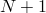

# 35.3.4 Mesh-independent fasteners


**Products: **Abaqus/Standard  Abaqus/Explicit  Abaqus/CAE  

##### **References**

- ["Surfaces: overview," Section 2.3.1](pt01ch02s03aus16.md)
- ["Coupling constraints," Section 35.3.2](pt08ch35s03aus133.md)
- ["Connector elements," Section 31.1.2](pt06ch31s01alm25.md)
- [*FASTENER](../key/key-link.md#usb-kws-mfastener)
- [*FASTENER PROPERTY](../key/key-link.md#usb-kws-mfastenerproperty)
- ["About fasteners," Section 29.1 of the Abaqus/CAE User's Guide](../usi/usi-link.md#usi-eng-fastener-overview)

### Overview

The mesh-independent fastener capability: 
- is a convenient method to define a point-to-point connection between two or more surfaces such as a spot weld or rivet connection;
- uses spatial coordinates of fastener locations to define point-to-point connections independent of underlying meshes;
- combines either connector elements or BEAM MPCs with distributing coupling constraints to provide a connection that can be located anywhere between two or more surfaces regardless of the mesh refinement or location of nodes on each surface;
- can be used to connect both deformable and rigid element-based surfaces;
- can model either rigid, elastic, or inelastic connections with failure by using the generality of connector behavior definitions; and
- is available only in three dimensions.

### Introduction

Many applications require modeling of point-to-point connections between parts. These connections may be in the form of spot welds, rivets, screws, bolts, or other types of fastening mechanisms. There may be hundreds or even thousands of these connections in a large system model such as an automobile or airframe.

 The fastener can be located anywhere between the parts that are to be connected regardless of the mesh. In other words, the location of the fastener can be independent of the location of the nodes on the surfaces to be connected. Instead, the attachment to each of the parts being connected is distributed to several nodes in the surfaces to be connected in the neighborhood of the fastening points. [Figure 35.3.4--1](pt08ch35s03aus135.md#aspotweld-project) shows a typical one-layer and two-layer fastener configuration. 

**Figure 35.3.4–1** Typical one-layer and two-layer fastener configuration.


Each layer connects two fastening points using either a connector element or a BEAM MPC. Each fastening point is connected to the surface using a distributing coupling constraint that couples the displacement and rotation of each fastening point to the average displacement and rotation of the nearby nodes.

The mesh-independent fastener capability in Abaqus is designed to model these connections in a convenient manner. The fastener automatically:
- determines the locations of nodes and orientations of connector elements or BEAM MPCs between two or more surfaces;
- generates distributing coupling constraints to attach the connector elements or BEAM MPCs to each surface in a mesh-independent manner; and
- calculates weights for the distributing coupling constraints that complete the mesh-independent connection.

For an example of the use of mesh-independent fasteners, see ["Buckling of a column with spot welds," Section 1.2.3 of the Abaqus Example Problems Guide](../exa/exa-link.md#exa-sta-bucklespotweld). Mesh-independent fasteners are referred to as point-based fasteners by Abaqus/CAE. For more information, see ["About fasteners," Section 29.1 of the Abaqus/CAE User's Guide](../usi/usi-link.md#usi-eng-fastener-overview). It is also possible to assemble fasteners in Abaqus/CAE using connector elements, coupling constraints, etc. For further details, see ["About assembled fasteners," Section 29.1.3 of the Abaqus/CAE User's Guide](../usi/usi-link.md#usi-eng-fastener-overview-assm).

### Fastener interactions

Fasteners are defined in groups called interactions, which are assigned names. Each interaction defines one or more fasteners. The number of individual fasteners is equal to the number of positioning points used to locate the fasteners. Fastening points on each surface are found by considering the position of the positioning point as discussed in subsequent sections.

Fasteners can be defined using connector elements or BEAM MPCs. BEAM MPCs allow modeling of perfectly rigid connectors between components; while connector elements allow you to model much more complex behavior, such as deformable connectors that include the effects of elasticity, damage, plasticity, and friction.

| **Input File Usage: ** | ``` [*FASTENER](../key/key-link.md#usb-kws-mfastener), INTERACTION NAME=*name* ``` |
| --- | --- |

| **Abaqus/CAE Usage: ** | Interaction module: ****Special****Fasteners****Create****: **Name**: *name*, **Type**: **Point-based** |
| --- | --- |

#### Defining fasteners using BEAM MPCs

For modeling perfectly rigid connections you need not define fasteners using connector elements. Instead, Abaqus can internally generate BEAM MPCs connecting the fastening points of the fasteners. In this approach you assign a reference node set containing a list of user-defined nodes to the fastener interaction. The nodes in this reference node set will be used as positioning points to locate the fasteners. If single-layer fasteners are to be modeled, Abaqus generates single BEAM MPCs with each node in the reference node set becoming the first node of the BEAM MPC. The second node of each BEAM MPC will be generated internally by Abaqus. If multi-layer fasteners are to be defined, Abaqus generates linked sets of BEAM MPCs with each node in the reference node set becoming the first node of the first BEAM MPC in each linked set. The subsequent nodes in each linked set will be generated internally by Abaqus. For multi-layer fasteners each linked set contains as many BEAM MPCs as the number of layers in the fastener.

| **Input File Usage: ** | Use the following options: |
| --- | --- |
|  | ``` [*FASTENER](../key/key-link.md#usb-kws-mfastener), INTERACTION NAME=*name*, REFERENCE NODE SET=*node set label* [*NSET](../key/key-link.md#usb-kws-mnset), NSET=*node set label* ``` |

| **Abaqus/CAE Usage: ** | Interaction module: ****Special****Fasteners****Create****: **Point-based**: select positioning points: **Property**: **Section**: **Rigid MPC** |
| --- | --- |

#### Defining fasteners using connector elements

Using connector elements as the basis for a point-to-point connection allows for very complex behavior to be modeled with fasteners. Like other uses of connector elements, the connection can be fully rigid or may allow for unconstrained relative motion in local connector components. In addition, deformable behavior can be specified using a connector behavior definition that can include the effects of elasticity, damping, plasticity, damage, and friction. There are two methods to define fasteners that use connector elements to model the behavior between fastening points. For both methods the fastener interaction refers to an element set containing the connector elements. You must specify a connector section definition that refers to this element set. You should be careful when specifying the connector orientation (if needed) as discussed below in ["Defining the fastener orientation](pt08ch35s03aus135.md#usb-cni-afastener-orientation).”

##### Defining the connector elements directly

The most controlled approach to specifying fasteners using connector elements is to define the connector elements explicitly and associate them with an element set. The fastener interaction refers to the element set. Each fastener in the fastener interaction corresponds to one or more connector elements depending on the number of layers of the fastener (see [Figure 35.3.4--2](pt08ch35s03aus135.md#aspotweld-connectors)). 

**Figure 35.3.4–2** Single- and multi-layer fasteners modeled with connector elements.


A single connector element is associated with each layer, and the two nodes of the connector element correspond to the fastening points of the two adjacent surfaces. When specifying a multi-layer fastener, the connector elements for each layer should share nodes with the connector elements of adjacent layers.

For a single-layer fastener the positioning point used to locate the fastener and its fastening points is taken as the nodal coordinates of the first node of the connector element. For a multi-layer fastener the positioning point is taken as the first node of the first connector in a linked set of connectors with as many members as layers. Examples of defining a single-layer and multi-layer fastener are included at the end of this section.

| **Input File Usage: ** | Use the following options: |
| --- | --- |
|  | ``` [*FASTENER](../key/key-link.md#usb-kws-mfastener), INTERACTION NAME=*name*, ELSET=*element set label* *blank line* [*ELEMENT](../key/key-link.md#usb-kws-melement), TYPE=CONN3D2, ELSET=*element set label* [*CONNECTOR SECTION](../key/key-link.md#usb-kws-mconnectorsection), ELSET=*element set label* ``` |

| **Abaqus/CAE Usage: ** | For point-based fasteners in Abaqus/CAE, you cannot define the connector elements directly; the connector elements are generated by Abaqus. |
| --- | --- |

##### Connector elements generated by Abaqus

In this approach you do not need to explicitly define the connector elements that connect the fastening points of the fastener. The fastener interaction refers to an empty element set. You must specify a connector section definition that refers to this element set. In addition, you assign a reference node set containing a list of user-defined nodes to the fastener interaction. The nodes in this reference node set are used as positioning points to locate the fasteners. 

If single-layer fasteners are to be modeled, Abaqus generates single connector elements with each node in the reference node set becoming the first node of a connector element. The second node of each connector element will be generated internally by Abaqus. If multi-layer fasteners are to be defined, Abaqus generates linked sets of connector elements with each node in the reference node set becoming the first node of the first connector element in each linked set. The subsequent nodes in each linked set will be generated internally by Abaqus. For multi-layer fasteners each linked set contains as many connector elements as the number of layers in the fastener. The connector elements are given internally generated element numbers and assigned to the named user-specified element set. You can use this element set to request output for these connector elements. However, this element set should not be included in another element set definition.

| **Input File Usage: ** | Use the following options: |
| --- | --- |
|  | ``` [*FASTENER](../key/key-link.md#usb-kws-mfastener), INTERACTION NAME=*name*, ELSET=*element set label*, REFERENCE NODE SET=*node set label* *blank line* [*NSET](../key/key-link.md#usb-kws-mnset), NSET=*node set label* [*CONNECTOR SECTION](../key/key-link.md#usb-kws-mconnectorsection), ELSET=*element set label* ``` |

| **Abaqus/CAE Usage: ** | Interaction module: ****Special****Fasteners****Create****: **Point-based**: select positioning points: **Property**: **Section**: **Connector section**: select connector section |
| --- | --- |

##### Example: using connector elements to define single-layer fasteners directly

To define a single-layer fastener directly using connector elements:
- Define two connector elements with user element numbers 100 and 200 and user-defined node numbers 1, 2 and 3, 4, respectively, and include them in an element set. Nodes 1 and 3 act as the positioning points for the two fasteners (see [Figure 35.3.4--2](pt08ch35s03aus135.md#aspotweld-connectors)).
- Refer to the element set in the fastener interaction and connector section definitions.
- Assign section properties to the fasteners. Suppose in this example that relative displacements between the fastening points are to be allowed. Therefore, the fasteners must be assigned a section that has available components of motion; for example, a CARTESIAN section can be used.
- The relative displacement between the fastening points gives rise to elastic deformations. Hence, the material between the fasteners is modeled as linear elastic with a spring stiffness of 10000 using connector elasticity.

The following input can be used:
```
[*FASTENER](../key/key-link.md#usb-kws-mfastener), INTERACTION NAME=*fastinter*, ELSET=*fastconn*, PROPERTY=*fastprop*
*blank line*
surface1, surface2
[*ELEMENT](../key/key-link.md#usb-kws-melement), TYPE=CONN3D2, ELSET=*fastconn*
100, 1, 2
200, 3, 4
[*CONNECTOR SECTION](../key/key-link.md#usb-kws-mconnectorsection), ELSET=*fastconn*, BEHAVIOR=*behav*
CARTESIAN, 
[*CONNECTOR BEHAVIOR](../key/key-link.md#usb-kws-mconnectorbehavior), NAME=*behav*
[*CONNECTOR ELASTICITY](../key/key-link.md#usb-kws-mconnectorelasticity), COMPONENT=*1*
10000,
[*CONNECTOR ELASTICITY](../key/key-link.md#usb-kws-mconnectorelasticity), COMPONENT=*2*
10000,
[*CONNECTOR ELASTICITY](../key/key-link.md#usb-kws-mconnectorelasticity), COMPONENT=*3*
10000,
```

##### Example: using connector elements to define multi-layer fasteners directly

To define a multi-layer fastener directly using connector elements:
- Define two linked sets of connector elements with each linked set containing exactly two connectors. The first linked set comprises element numbers 100 and 101, with node numbers 1, 2 and 2, 3, respectively. The second linked set comprises element numbers 200 and 201, with node numbers 4, 5 and 5, 6, respectively. Include the connector elements in an element set. Nodes 1 and 4 act as the positioning points for the two fasteners (see [Figure 35.3.4--2](pt08ch35s03aus135.md#aspotweld-connectors)).
- Refer to the element set in the fastener interaction and connector section definitions
- Assign section properties to the fasteners. Suppose in this example that rigid beam-type behavior between the fastening points is to be modeled; in that case the fasteners must be assigned a BEAM section.

The following input can be used:
```
[*FASTENER](../key/key-link.md#usb-kws-mfastener), INTERACTION NAME=*fastinter*, ELSET=*fastconn*, PROPERTY=*fastprop*
*blank line*
surface1, surface2, surface3
[*ELEMENT](../key/key-link.md#usb-kws-melement), TYPE=CONN3D2, ELSET=*fastconn*
100, 1, 2
101, 2, 3
200, 4, 5
201, 5, 6
[*CONNECTOR SECTION](../key/key-link.md#usb-kws-mconnectorsection), ELSET=*fastconn*
BEAM, 
```

### Specifying the positioning points, projection method, and fastening points

Each interaction defines one or more fasteners. The number of individual fasteners is equal to the number of positioning points used to locate the fasteners. Positioning points are nodes defined at the fastener locations and assigned as a reference node set to the interaction.

In general, a positioning point should be located as close to the surfaces being connected as possible. The reference node specifying the positioning point can be one of the nodes on the connected surfaces or can be defined separately. Abaqus determines the actual points where the fastener layers attach to the surfaces that are being connected by first projecting the positioning point onto the closest surface. Abaqus offers the following projection methods to find fastening points on the specified surfaces to form fasteners:
- Face-to-face
- Face-to-edge
- Edge-to-face
- Edge-to-edge
- Connector direction

 The choice of method depends on how the surfaces are oriented relative to each other.

#### Fastening surfaces that are nearly parallel to each other

Most commonly the surfaces to be fastened together are nearly parallel to each other; in which case the fastening points are located on element facets away from the periphery of the surfaces. The face-to-face projection method is most appropriate for such situations. It is also the default projection method. 

In the face-to-face projection method, Abaqus projects each positioning point onto the closest surface along a directed line segment normal to the surface. Alternatively, you can specify the projection direction. Specifying the direction may be useful when two-dimensional drawings are used to identify the positioning point locations and those locations are known precisely in two dimensions but not in a third. For this case the direction specified is typically the normal to the plane of the drawing.

Once the fastening point on the closest surface has been identified, Abaqus determines the points on the other surface or surfaces to be connected by projecting the first fastening point onto the other surfaces along the fastener normal direction, which is typically normal to the closest surface. [Figure 35.3.4--3](pt08ch35s03aus135.md#aspotweld-config) shows the two ways of locating the projection points. When surfaces to be fastened are not exactly parallel, Abaqus sometimes sets attachment points to be at the closest facet edges or corner on the surface, rather than along the fastener normal direction.

**Figure 35.3.4–3** Directed and normal projection to locate the fastening points for the face-to-face projection method.


The location of the positioning point (a node in the reference node set) might not coincide with the locations of the fastening points found by Abaqus. Hence, the coordinates of the node at the positioning point may change from their user-prescribed values when the node is shifted to a fastening point. If the node at the positioning point is part of the connectivity of a user-defined element, this can cause the element whose connectivity includes that node to undergo unacceptable initial distortions. In such situations it is recommended that you define the node at the positioning point separately. In general, you should not specify this node to be one of the nodes of the connected surfaces.

| **Input File Usage: ** | Use the following option to allow Abaqus to define the projection direction: |
| --- | --- |
|  | ``` [*FASTENER](../key/key-link.md#usb-kws-mfastener), REFERENCE NODE SET=*node set label*, ATTACHMENT METHOD=FACETOFACE (default) *blank line* ``` Use the following option to define the projection direction directly: ``` [*FASTENER](../key/key-link.md#usb-kws-mfastener), REFERENCE NODE SET=*node set label*, ATTACHMENT METHOD=FACETOFACE (default) *x-component, y-component, z-component* ``` |

| **Abaqus/CAE Usage: ** | Use the following input to allow Abaqus to define the projection direction: |
| --- | --- |
|  | Interaction module: ****Special****Fasteners****Create****: **Point-based**: select positioning points: **Domain** tabbed page: **Direction vector**: **Default**, **Criteria** tabbed page: **Attachment method**: **Face-to-Face** Use the following input to define the projection direction directly: Interaction module: ****Special****Fasteners****Create****: **Point-based**: select positioning points: **Domain** tabbed page: **Direction vector**: **Specify**, **Criteria** tabbed page: **Attachment method**: **Face-to-Face** |

#### Fastening nearly perpendicular surfaces

When you need to fasten surfaces that are perpendicular or nearly perpendicular to each other; i.e., forming a T-intersection, the face-to-edge or the edge-to-face projection methods are appropriate choices. [Figure 35.3.4--4](pt08ch35s03aus135.md#aspotweld-fe-ef-nls) shows attachments for the face-to-edge and edge-to-face projection methods.

**Figure 35.3.4–4** Face-to-edge and edge-to-face projection methods to locate fastening points for surfaces that form T-intersections.


##### Creating the first fastening point on a face

In the face-to-edge projection method Abaqus projects the positioning point onto the closest surface along a directed line segment normal to the surface. The subsequent fastening points are found by searching for the closest points on the remaining specified surfaces. The closest fastening point may fall on the edge or a corner of a surface. 

| **Input File Usage: ** | ``` [*FASTENER](../key/key-link.md#usb-kws-mfastener), REFERENCE NODE SET=*node set label*, ATTACHMENT METHOD=FACETOEDGE *blank line* ``` |
| --- | --- |

| **Abaqus/CAE Usage: ** | Interaction module: ****Special****Fasteners****Create****: **Point-based**: select positioning points: **Criteria**: **Attachment method**: **Face-to-Edge** |
| --- | --- |

##### Creating the first fastening point on an edge

In the edge-to-face projection method, the first fastening point is found by searching for the closest point on the specified surface or surfaces. The closest point may be on the edge or corner of the surface. For subsequent fastening points Abaqus projects the previous fastening point along a directed line segment normal to the surface. 

| **Input File Usage: ** | ``` [*FASTENER](../key/key-link.md#usb-kws-mfastener), REFERENCE NODE SET=*node set label*, ATTACHMENT METHOD=EDGETOFACE *blank line* ``` |
| --- | --- |

| **Abaqus/CAE Usage: ** | Interaction module: ****Special****Fasteners****Create****: **Point-based**: select positioning points: **Criteria**: **Attachment method**: **Edge-to-Face** |
| --- | --- |

#### Fastening abutting surfaces

When it is desired to form fasteners between surfaces that are butting against each other, the edge-to-edge projection method is appropriate. In this method the first as well as the subsequent fastening points are located by searching for the closest point on the specified surface or surfaces. The fastening points in this method may be located on the edge of a surface. [Figure 35.3.4--5](pt08ch35s03aus135.md#aspotweld-ee-nls) shows attachments for the edge-to-edge projection method. 

**Figure 35.3.4–5** Edge-to-edge projection method to locate fastening points for abutting surfaces.


| **Input File Usage: ** | ``` [*FASTENER](../key/key-link.md#usb-kws-mfastener), REFERENCE NODE SET=*node set label*, ATTACHMENT METHOD=EDGETOEDGE *blank line* ``` |
| --- | --- |

| **Abaqus/CAE Usage: ** | Interaction module: ****Special****Fasteners****Create****: **Point-based**: select positioning points: **Criteria**: **Attachment method**: **Edge-to-Edge** |
| --- | --- |

#### Fastening surfaces that are not parallel

When fastening surfaces that are not parallel to one another, you can control the precise location and direction of the fastener. To define the location and direction, prescribe a connector element for each fastener with nodes at a specific location. Abaqus maintains the location and the direction of the connector element.

| **Input File Usage: ** | ``` [*FASTENER](../key/key-link.md#usb-kws-mfastener), ELSET=*element set label*, ATTACHMENT METHOD=CONNECTORDIRECTION *blank line* ``` |
| --- | --- |

| **Abaqus/CAE Usage: ** | Selecting a connector to control the location and direction of the fastener is not supported in Abaqus/CAE. |
| --- | --- |

### Specifying the surfaces to be fastened

Once the positioning points have been specified, the surfaces to be fastened can be specified using two different approaches. In the first approach you directly specify the surfaces that are to be connected with a fastener. In the second approach you specify a search zone, and Abaqus automatically identifies the surfaces that are to be connected. However, in the second approach Abaqus does not distinguish between coincident facets. Hence, if coincident facets are to be fastened, you should specify distinct surfaces containing each of the coincident facets and use the first approach. Only element-based surfaces defined on faces can be fastened together (see ["Element-based surface definition," Section 2.3.2](pt01ch02s03aus17.md), and ["Operating on surfaces," Section 2.3.6](pt01ch02s03aus21.md)).

#### Forming fasteners on user-specified surfaces

If you specify multiple surfaces as part of the interaction definition, the surfaces to be fastened are restricted to these surfaces. In general, specifying multiple surfaces is the preferred way of defining fasteners; this method leads to a more precise fastener construct definition. The number of layers of each fastener is one less than the number of surfaces specified. One fastening point is found on each surface.

| **Input File Usage: ** | ``` [*FASTENER](../key/key-link.md#usb-kws-mfastener) *first data line* *surface1, surface2, surface3, etc.* ``` |
| --- | --- |

| **Abaqus/CAE Usage: ** | Interaction module: ****Special****Fasteners****Create****: **Point-based**: **Domain**: **Approach**: **Fasten specified surfaces by proximity**, select surfaces |
| --- | --- |
|  | When you select multiple surfaces for a single surface region, Abaqus/CAE combines the multiple surfaces using the single-surface search method, as described in ["Forming fasteners on surfaces inside a user-specified search zone](pt08ch35s03aus135.md#usb-cni-afastener-zone)" below. |

#### Controlling connectivity of fasteners on user-specified surfaces

By default, the connectivity of the fastening points is determined by their relative position along the fastener projection direction. For example, the default connectivity for the two-layer example shown in [Figure 35.3.4--1](pt08ch35s03aus135.md#aspotweld-project) connects fastening point A to point B (layer 1) and point B to point C (layer 2).

You can control the connectivity of the fastening points when the fasteners are formed on user-specified surfaces. You can specify that the connectivity of the fastening points be defined by the order in which you specified their associated surfaces.

| **Input File Usage: ** | ``` [*FASTENER](../key/key-link.md#usb-kws-mfastener), UNSORTED *first data line* *surface1, surface2, surface3, etc.* ``` |
| --- | --- |
|  | If user-specified surfaces are not included on the data lines, the UNSORTED parameter is ignored. |

| **Abaqus/CAE Usage: ** | Interaction module: ****Special****Fasteners****Create****: **Point-based**: **Domain**: **Approach**: **Fasten in specified order**, select surfaces |
| --- | --- |

#### Forming fasteners on surfaces inside a user-specified search zone

If you do not specify any surfaces as part of the interaction definition, Abaqus searches for fastening points on all element facets that fall within a sphere of user-specified radius *R* with its center at the positioning point. If you do not specify the search radius, Abaqus computes a default search radius based on five times the facet thickness (for shell element facets) or the characteristic element length (for other element types) in the vicinity of each positioning point.

To refine the search, you can specify a single surface definition that will limit the facet search to element facets belonging to that surface. In this case you must define a collective surface that includes at least each connected surface. A combined surface can also be used (see ["Operating on surfaces," Section 2.3.6](pt01ch02s03aus21.md), for a discussion on combining surfaces).

To refine the search further, you can specify a positive integer value, *N*, for the number of layers of each fastener. Abaqus searches for the  fastening points closest to the positioning point. If BEAM MPCs are used to model the fastener, a warning message is issued if the requisite number of fastening points is not found. However, if connector elements are used to model the fastener and the requisite number of fastening points is not found, Abaqus issues an error message. Thus, when specifying the number of layers, you should ensure that the search radius has been specified such that  fastening points can be found.

If multiple surfaces are listed as part of the fastener definition, the number of layers for each fastener is ignored. If a user-specified search radius is used for the multiple surface case, Abaqus searches for fastening points on all facets belonging to each of the listed surfaces that fall within a sphere of user-specified radius *R* with its center at the positioning point. Facets of the listed multiple surfaces that lie outside this sphere are not included in the search. A maximum of 15 layers can be specified for a particular fastener definition.

You should always examine the fastener definitions that Abaqus created to make sure that they are appropriate for your model.

| **Input File Usage: ** | ``` [*FASTENER](../key/key-link.md#usb-kws-mfastener), SEARCH RADIUS=*R*, NUMBER OF LAYERS=*N* *first data line* ``` |
| --- | --- |

| **Abaqus/CAE Usage: ** | Interaction module: ****Special****Fasteners****Create****: **Point-based**: **Criteria**: **Search radius**: **Specify**: *R*, **Maximum layers for projection**: **Specify**: *N* |
| --- | --- |

### Defining the radius of influence

Each fastening point is associated with a group of nodes on the surface in the immediate neighborhood of the fastening point called a region of influence. The motion of the fastening point is then coupled in a weighted sense to the motion of the nodes in this region by a distributed coupling constraint. Several weighting options are available and are discussed in the next section.

To define the region of influence, Abaqus computes an internal radius of influence based on the geometric properties of the fastener, the characteristic length of the connected facets, and the type of weighting function used. The default radius of influence is always chosen to be the largest of the internally computed radius of influence, the physical fastener radius, and the distance of the projection point to the closest node. You can also specify the desired radius of influence. However, Abaqus overrides a user-specified radius of influence that is smaller than the computed default radius of influence. In any case each region of influence will contain a minimum of three nodes.

| **Input File Usage: ** | ``` [*FASTENER](../key/key-link.md#usb-kws-mfastener), RADIUS OF INFLUENCE=*distance* *blank line* ``` |
| --- | --- |

| **Abaqus/CAE Usage: ** | Interaction module: ****Special****Fasteners****Create****: **Point-based**: **Adjust**: **Influence radius**: **Specify**: *distance* |
| --- | --- |

### Defining the weighting method

The weighting methods available for the distributed coupling constraints created for a fastener interaction are the same as those available for the surface-based coupling constraints in Abaqus (see ["Coupling constraints," Section 35.3.2](pt08ch35s03aus133.md)). Besides an area-based uniform weighting scheme, various weighting methods are provided that monotonically decrease with radial distance from the fastening point: linear, quadratic, and cubic polynomial weight distributions. By default, Abaqus uses the uniform weighting method. You can modify the default weighting distribution.

The default radius of influence calculated by Abaqus is larger for higher-order weighting methods since the resulting weights for nodes away from the fastening point contribute comparatively little to the motion of the fastening point. Hence, to ensure that there is a sufficient “smearing” effect, it becomes necessary to increase the number of nodes in the region of influence by increasing the size of the default radius of influence. In comparison, for a uniform weighting scheme, surface nodes away from the fastening point contribute significantly to the motion of the fastening point. For this case the default radius of influence chosen can be comparatively small, since even with a small number of nodes in the region of influence, the smearing effect is sufficiently strong. If fewer than three cloud nodes are found, increasing the radius of influence may help in forming the fastener by including more nodes in the cloud of coupling nodes.

| **Input File Usage: ** | Use the following option to specify a uniform weight distribution: |
| --- | --- |
|  | ``` [*FASTENER](../key/key-link.md#usb-kws-mfastener), WEIGHTING METHOD=UNIFORM *blank line* ``` Use the following option to specify a linear weight distribution: ``` [*FASTENER](../key/key-link.md#usb-kws-mfastener), WEIGHTING METHOD=LINEAR *blank line* ``` Use the following option to specify a quadratic polynomial weight distribution: ``` [*FASTENER](../key/key-link.md#usb-kws-mfastener), WEIGHTING METHOD=QUADRATIC *blank line* ``` Use the following option to specify a cubic polynomial weight distribution: ``` [*FASTENER](../key/key-link.md#usb-kws-mfastener), WEIGHTING METHOD=CUBIC *blank line* ``` |

| **Abaqus/CAE Usage: ** | Interaction module: ****Special****Fasteners****Create****: **Point-based**: **Formulation**: **Weighting method**: **Uniform**, **Linear**, **Quadratic**, or **Cubic** |
| --- | --- |

### Defining the fastener orientation

Each fastener is formulated in a local coordinate system that rotates with the motion of the fastener. By default, Abaqus defines the local system by projecting the global coordinate system onto the surfaces that are being fastened according to the usual convention for surfaces in space (see ["Conventions," Section 1.2.2](pt01ch01s02aus02.md)). Local directions specified in this manner are such that the local *z*-axis for each fastener is normal to the surface that is closest to the reference node for the fastener.

You can override the default local system by specifying a local coordinate system for the fastener interaction. Generally, the user-defined orientation should be such that the local *z*-axis of the orientation is approximately normal to the surfaces that are being connected and the local *x*- and *y*-axes are approximately tangent to the surfaces that are being connected. By default, Abaqus adjusts the user-defined orientation such that the local *z*-axis for each fastener is normal to the surface that is closest to the reference node for the fastener. In cases where you wish to define the local directions precisely, you can specify that Abaqus should not adjust them.

Fasteners support only rectangular, cylindrical, and spherical orientation definitions. Additional rotations defined as part of the orientation definition are ignored. 

In geometrically nonlinear analysis steps the local directions rotate with the motion of the fastener reference node.

#### Local coordinate system when connector elements are used

If a connector element is used to model a fastener, the local coordinate system defined on the connector section, , operates on the local coordinate system for the fastener, , to determine the final local coordinate system of the connector element, . In other words, 


In the above equations  and  are assumed to be orthogonal rotation matrices with the local 1-, 2-, and 3-directions being the first, second, and third rows, respectively. The local coordinate system for a connector element modeling a fastener should be specified with respect to the local coordinate system of the fastener. The orientation displayed in the Visualization module of Abaqus/CAE (Abaqus/Viewer) is   at all fastener locations unless you specify not to write the orientations to the database; in this case, only  is displayed. If connector field output is requested, field output for additional nodal rotation at the connector nodes is generated automatically to ensure that the appropriate connector orientation directions are displayed as the analysis progresses. Otherwise, the orientation  computed at the beginning of the analysis is displayed at all times with the updated orientations used for computation purposes.

For example, suppose you use a HINGE connector and want the released rotational degree of freedom, which is in the connector's local 1-direction, to be normal to the surfaces that are being fastenened. If the default local coordinate system is used for the fastener (local 3-direction normal to the surface), the local 1-direction for the connector should be set to (0., 0., 1.); i.e., the local 3-direction of the fastener. When compounded with the local coordinate system for the fastener, the local 1-direction for the connector will be normal to the surface. See ["Mesh-independent spot welds," Section 5.1.16 of the Abaqus Verification Guide](../ver/ver-link.md#ver-msc-meshindepspotweld), for an example of a compounded orientation.

| **Input File Usage: ** | ``` [*FASTENER](../key/key-link.md#usb-kws-mfastener), ORIENTATION=*orientation name*, ADJUST ORIENTATION=NO *blank line* ``` |
| --- | --- |

| **Abaqus/CAE Usage: ** | Interaction module: ****Special****Fasteners****Create****: **Point-based**: **Adjust**: **Fastener CSYS**: **Edit**: select local coordinate system, toggle off **Adjust CSYS to make local Z-axis normal to closest surface** |
| --- | --- |

##### Clarifications regarding the computation of 

A few clarifications regarding the default definition of  are necessary for a precise understanding of the behavior when connector elements are used to model fasteners. The positioning point is always projected on the closest surface to be fastened. Therefore, the choice of coordinates of the reference node relative to the stack of surfaces to be fastened determines which surface is used to compute the local directions. Typically this choice does not matter much in realistic applications because the surfaces to be fastened are more or less parallel to each other in the fastener area.

The projection of the reference node on the closest surface generates a fastening point for the connector element. The local *z*-axis for each fastener  () is normal to the surface at this fastening point. The fastening point generated on the closest surface is by default the first fastening point and, therefore, the first connector node. The precise direction into which the local *z*-axis is pointing is chosen such that the dot product with the unit vector pointing from the first node of the connector to the second node of the connector is positive. As explained above, you can control the connectivity of the fastening points in the connectors by specifying unsorted surfaces. Therefore, you can control the precise direction the local *z*-axis is pointing along the surface normal by either selecting appropriate coordinates for the reference node and/or by using unsorted surfaces.

The two tangential directions in  are computed by default according to the usual convention for surfaces in space (see ["Conventions," Section 1.2.2](pt01ch01s02aus02.md)). The global *X*-axis is projected onto the closest surface at the location of the fastening point to determine the local *x*-axis in . If the global *X*-axis is within 0.1 degrees of being normal to the surface, the local *x*-axis in  is the projection of the global *Z*-axis on the closest surface. The local *y*-axis in  is then at right angles to the local *x*-axis and *z*-axis so that the three local axes form a right-handed set. 

 In the rare cases when the default definition of  does not suit your application, you can always specify the orientation directly. If you define the orientation directly Abaqus will first check the local *x*- and *y*-axes you specified to determine which of these two is closest to the plane of the current facet. If the local *x*-axis is closest Abaqus will recompute the local *y*-axis as the normalized cross product of the facet normal and the specified *x*-axis and then compute the new  local *x*-axis as the normalized cross product of the recomputed *y*-axis and the facet normal. If the local *y*-axis is closest Abaqus will recompute the local *x*-axis as the normalized cross product of the specified *y*-axis and the facet normal and then compute the new  local *y*-axis as the normalized cross product of the facet normal and the recomputed *x*-axis.

##### Common modeling practices

In most applications the default choice for  combined with a choice of global system for  at both connector nodes would result in a  that is most suitable. The connection type that you choose depends on several modeling considerations, but very often the BUSHING connection type offers the best choice.  To simplify the discussion, consider that only two surfaces are being fastened, a very common situation as illustrated in the spot weld example in ["Connector functions for coupled behavior," Section 31.2.4](pt06ch31s02alm30.md). For this common choice,  has the local *z*-axis normal to the closest surface and pointing from the first fastening point (first connector node) toward the second fastening point (second connector node). This choice ensures that for a fastener subjected to a tension load (fastened plates pulled apart) a positive force always develops in the connector along the local *z*-axis (CTF3) regardless of the choice of coordinates for the positioning point and/or use of unsorted surfaces. Conversely, if a compression load is applied (fastened plates pressed against each other), a negative force develops in the connector. 

In most cases, the behavior in the tangential plane defined by the local *x*- and local *y*-axes is isotropic; therefore, the precise orientation of these two axes is of less interest to you. The spot weld example in ["Connector functions for coupled behavior," Section 31.2.4](pt06ch31s02alm30.md), illustrates such a typical case where the (isotropic) magnitude of two in-plane forces () and of the two moments  () are used in the kinetic behavior of the connector element.

If you need to specify anisotropic behavior in the tangential plane, you need to understand precisely how the directions in  are defined.  As explained above, the choice of coordinates for the positioning point relative to the stack of surfaces to be fastened and/or use of unsorted surfaces determines the precise direction of the default local axes. In most cases you have two common modeling choices. In the first case you can specify the coordinates of the positioning points to be exactly on or very close to the surface onto which the first fastening points (connector nodes) are to be placed and use the default sorted surfaces. In this case you do not need to specify the surfaces to be fastened individually. However, in many practical situations imprecise geometry for the surfaces to be fastened and/or inexact coordinates of the fastener reference nodes make the consistent placement of the reference nodes in the vicinity of one particular surface very hard to accomplish. The second modeling technique consists of using sorted surfaces. The exact location of the reference node with respect to the surface stack to be fastened is not that important because the first fastening point is always on the first specified surface. In this case you do have to specify two or more individual surfaces to be fastened. In the rare cases when neither of these modeling techniques suits your application, you can specify the fastener orientation directly to match your needs exactly.

### Defining the surface coupling method

There are two methods available to couple the motion of each fastening point to the motion of the associated coupling nodes on the fastened surfaces: the continuum coupling method and the structural coupling method. The continuum coupling method is used by default.

In many cases when the pair of fastened surfaces are close to each other, unrealistic contact interactions may occur between the two surfaces if the continuum coupling method is used. This is particularly the case in shell bending applications. Moreover, in many situations the continuum coupling method can yield an overly stiff response if the two surfaces are pried apart, especially when the fastener radius is small. The structural coupling method can be used to alleviate these issues.

#### Continuum coupling method

The default continuum coupling method couples the translation and rotation of each fastening point to the average translation of the group of coupling nodes on each of the fastened surfaces. The constraint distributes the forces and moments at the fastening point as a coupling node-force distribution only. The force distribution is equivalent to the classic bolt pattern force distribution when the weight factors are interpreted as bolt cross-section areas. For each pair of fastening point and group of coupling nodes, the constraint enforces a rigid beam connection between the fastening point and a point located at the weighted center of position of the coupling nodes. The formulation is discussed in detail in ["Distributing coupling elements," Section 3.9.8 of the Abaqus Theory Guide](../stm/stm-link.md#stm-elm-distcouplingelem). 

| **Input File Usage: ** | ``` [*FASTENER](../key/key-link.md#usb-kws-mfastener), COUPLING=CONTINUUM ``` |
| --- | --- |

| **Abaqus/CAE Usage: ** | Interaction module: ****Special****Fasteners****Create****: **Point-based**: **Formulation**: **Coupling type**: **Continuum distributing** |
| --- | --- |

#### Structural coupling method

The structural coupling method couples the translation and rotation of each fastening point to the translation and the rotation motion of the group of coupling nodes on each of the fastened surfaces. The constraint distributes forces and moments at the fastening point as coupling nodes forces and moments. For this coupling method to be active, all rotation degrees of freedom at all coupling nodes must be active (as would be the case when shells are fastened together) and all degrees of freedom must be constrained (which is the default; see ["Defining fastener properties](pt08ch35s03aus135.md#usb-cni-afastener-dfastprop)” below). 

With respect to translations, for each pair of fastening point and group of coupling nodes, the constraint enforces a rigid beam connection between the fastening point and a moving point that remains at all times in the vicinity of the fastened surface. The location of this moving point is determined by the current curvature of the surface, the current location of the weighted center of position of the coupling nodes, and the fastener projection direction. This choice avoids unrealistic contact interactions between the fastened surfaces when the surfaces are close to each other (typically the case).

With respect to rotations, for each pair of fastening point and group of coupling nodes, the constraint is different along different local directions. Along the projection direction (the twist direction), the constraint is identical to the one enforced via the continuum coupling method (see ["Distributing coupling elements," Section 3.9.8 of the Abaqus Theory Guide](../stm/stm-link.md#stm-elm-distcouplingelem)). By contrast, the rotational constraint in the plane perpendicular to the projection direction relates the in-plane fastening point rotations to the in-plane rotations of the coupling nodes in the immediate vicinity of the fastening point. This choice provides a more realistic response when the fastened surfaces are pried apart.

| **Input File Usage: ** | ``` [*FASTENER](../key/key-link.md#usb-kws-mfastener), COUPLING=STRUCTURAL ``` |
| --- | --- |

| **Abaqus/CAE Usage: ** | Interaction module: ****Special****Fasteners****Create****: **Point-based**: **Formulation**: **Coupling type**: **Structural distributing** |
| --- | --- |

### Defining fastener properties

Each fastener interaction definition must refer to a property, which defines the geometric section properties of the fastener.

| **Input File Usage: ** | Use both of the following options: |
| --- | --- |
|  | ``` [*FASTENER](../key/key-link.md#usb-kws-mfastener), PROPERTY=*fastener property name* [*FASTENER PROPERTY](../key/key-link.md#usb-kws-mfastenerproperty), NAME=*fastener property name* ``` |

| **Abaqus/CAE Usage: ** | Interaction module: ****Special****Fasteners****Create****: **Point-based**: **Property** |
| --- | --- |

#### Geometric section quantities

Fasteners are assumed to have a circular projection onto the connected surfaces. You are required to specify the radius of the fastener.

| **Input File Usage: ** | ``` [*FASTENER PROPERTY](../key/key-link.md#usb-kws-mfastenerproperty) *r* ``` |
| --- | --- |

| **Abaqus/CAE Usage: ** | Interaction module: ****Special****Fasteners****Create****: **Point-based**: **Property**: **Physical radius**: *r* |
| --- | --- |

#### Mass

In many cases fasteners may add mass to the assembly. To model the added mass, specify an additional mass that is assigned to each fastener and lumped to the fastening points.

| **Input File Usage: ** | ``` [*FASTENER PROPERTY](../key/key-link.md#usb-kws-mfastenerproperty), MASS=*mass value* ``` |
| --- | --- |

| **Abaqus/CAE Usage: ** | Interaction module: ****Special****Fasteners****Create****: **Point-based**: **Property**: **Additional mass**: *mass value* |
| --- | --- |

#### Releasing degrees of freedom on fasteners using connector elements

For fasteners modeled with connector elements, translational as well as rotational degrees of freedom can be released by prescribing connector section types that have unconstrained (available) degrees of freedom. For example, a HINGE connector can be used to release the rotational degree of freedom in the connector's local 1-direction.

#### Releasing degrees of freedom on fasteners using BEAM MPCs

For fasteners modeled with BEAM MPCs, the moment constraint between the rotation degrees of freedom at the fastening points and the average rotation of the coupling nodes can be released in one, two, or three directions. You can specify the moment constraint directions in the default local coordinate system or a user-defined local coordinate system. The three translational degrees of freedom at the fastening points are always coupled to the average translation of the coupling nodes. You specify the degrees of freedom of the fastening point to be coupled to the average motion of the coupling nodes as part of the fastener property definition.

If no degrees of freedom are specified as part of the fastener property definition, all six degrees of freedom are coupled. If you specify one or more degrees of freedom but not all available translation degrees of freedom, Abaqus issues a warning message and adds all the available translation degrees of freedom to the constraint. If a user-specified local orientation is specified for the fastener interaction, the local degrees of freedom are with respect to the user-defined coordinate system.

| **Input File Usage: ** | ``` [*FASTENER PROPERTY](../key/key-link.md#usb-kws-mfastenerproperty) *section properties* *first dof*, *last dof* ``` |
| --- | --- |
|  | For example, if the default local coordinate system is used, the following property definition would release the relative rotation constraint of the connected parts about the surface normal: ``` [*FASTENER PROPERTY](../key/key-link.md#usb-kws-mfastenerproperty) *section properties* 1, 5 ``` The above property definition might be used to approximate a riveted connection. |

| **Abaqus/CAE Usage: ** | Abaqus/CAE always constrains all translational degrees of freedom in a fastener. Use the following input to remove constraints on the rotational degrees of freedom: |
| --- | --- |
|  | Interaction module: ****Special****Fasteners****Create****: **Point-based**: **Formulation**: toggle off **UR1**, **UR2**, or **UR3** |

### Overconstraints in fasteners modeled with BEAM MPCs

There are several instances in which a model with fasteners modeled with BEAM MPCs might be overconstrained. Described below are two potential overconstraints that Abaqus automatically attempts to detect and resolve during solver input file processing.

#### Fasteners and rigid bodies

Fasteners can be used to connect both deformable and rigid element-based surfaces. However, if the fasteners are modeled with BEAM MPCs, potential overconstraints may arise if more than one rigid surface is involved in a given fastener definition. Abaqus automatically attempts to remove these types of overconstraints by allowing at most one rigid surface in any individual fastener definition. A warning message is generated if an overconstraint of this type is detected.

For example, suppose surfaces A and C in [Figure 35.3.4--1](pt08ch35s03aus135.md#aspotweld-project) are part of the same rigid body, and surface B is deformable. Abaqus automatically removes either surface A or surface C from the fastener definition and only forms the fastener between the deformable surface and the remaining rigid surface. If surface A and surface C belong to two separate rigid bodies, their respective rigid body reference nodes will be joined by an internally generated BEAM MPC. 

In another example, suppose all three surfaces in [Figure 35.3.4--1](pt08ch35s03aus135.md#aspotweld-project) are rigid. In this case no fastener will be formed, and the unique rigid body reference nodes for surfaces A, B, and C will be joined by beam MPCs. Unresolvable overconstraints may arise if inconsistent kinematic constraints (such as displacement boundary conditions) are placed on rigid body reference nodes that have been joined by BEAM MPCs. In this case you must modify the model to resolve the overconstraints. Possible courses of action include removing some of the rigid surfaces from the fastener definitions or removing inconsistent kinematic conditions on the rigid body reference nodes.

The above-described procedure to resolve overconstraints with fasteners and rigid bodies will preserve the kinematics of the original model. In Abaqus/Standard you can bypass the overconstraint checks and prevent automatic model modifications in the model preprocessor (see ["Overconstraint checks," Section 35.6.1](pt08ch35s06aus138.md)).

#### Overlapping fasteners

Potential overconstraints exist with rigid fasteners if all the coupling nodes of any associated distributing coupling element are wholly contained within one or more other fastener definitions. This can happen if the spacing between positioning points is small compared to the typical element size in a mesh (which is often the case in automotive models). To avoid overconstraints in this situation, Abaqus uses a penalty formulation for all fastener distributing coupling elements that satisfy the above criteria. The penalty distributing coupling formulation relaxes, to a small degree, the constraint between the motion of the distributing coupling element reference node and its coupling nodes.

### Output

If fasteners are modeled using connector elements, connector element output variables can be used to request output for fasteners (see ["Connector elements," Section 31.1.2](pt06ch31s01alm25.md)). No fastener output is available if the fasteners are modeled using BEAM MPCs.


