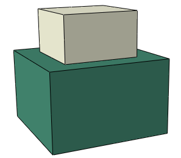

# 36.2.1 Defining general contact interactions in Abaqus/Standard


**Products: **Abaqus/Standard  Abaqus/CAE  

##### **References**

- ["Contact interaction analysis: overview," Section 36.1.1](pt09ch36s01abo33.md)
- [*CONTACT](../key/key-link.md#usb-kws-hcontact)
- [*CONTACT INCLUSIONS](../key/key-link.md#usb-kws-hcontactinclusions)
- [*CONTACT EXCLUSIONS](../key/key-link.md#usb-kws-hcontactexclusions)
- ["Defining general contact," Section 15.13.1 of the Abaqus/CAE User's Guide](../usi/usi-link.md#usi-itn-help-general)

### Overview

 Abaqus/Standard provides two algorithms for modeling contact and interaction problems: the general contact algorithm and the contact pair algorithm. See ["Contact interaction analysis: overview," Section 36.1.1](pt09ch36s01abo33.md), for a comparison of the two algorithms. This section describes how to include general contact in an Abaqus/Standard analysis, how to specify the regions of the model that may be involved in general contact interactions, and how to obtain output from a general contact analysis.

The general contact algorithm in Abaqus/Standard:
- is specified as part of the model definition;
- allows very simple definitions of contact with very few restrictions on the types of surfaces involved;
- uses sophisticated tracking algorithms to ensure that proper contact conditions are enforced efficiently;
- can be used simultaneously with the contact pair algorithm (i.e., some interactions can be modeled with the general contact algorithm, while others are modeled with the contact pair algorithm);
- can be used with two- or three-dimensional surfaces; and
- uses the finite-sliding, surface-to-surface contact formulation.

### Defining a general contact interaction

The definition of a general contact interaction consists of specifying:
- the general contact algorithm and defining the contact domain (i.e., the surfaces that interact with one another), as described in this section;
- the contact surface properties (["Surface properties for general contact in Abaqus/Standard," Section 36.2.2](pt09ch36s02aus140.md));
- the mechanical contact property models (["Contact properties for general contact in Abaqus/Standard," Section 36.2.3](pt09ch36s02aus141.md));
- the controls associated with the initial contact state (["Controlling initial contact status in Abaqus/Standard," Section 36.2.4](pt09ch36s02aus142.md)); and
- the algorithmic contact controls (["Numerical controls for general contact in Abaqus/Standard," Section 36.2.6](pt09ch36s02aus144.md)).

An example of an analysis that uses general contact to define contact between the various components of an assembly is described in ["Impact analysis of a pawl-ratchet device," Section 2.1.17 of the Abaqus Example Problems Guide](../exa/exa-link.md#exa-dyn-pawlratchet).

### Surfaces used for general contact

The general contact algorithm in Abaqus/Standard allows for quite general characteristics in the surfaces that it uses, as discussed in ["Contact interaction analysis: overview," Section 36.1.1](pt09ch36s01abo33.md). For detailed information on defining surfaces in Abaqus/Standard for use with the general contact algorithm, see ["Element-based surface definition," Section 2.3.2](pt01ch02s03aus17.md).

A convenient method of specifying the contact domain is using cropped surfaces. Such surfaces can be used to perform “contact in a box” by using a contact domain that is enclosed in a specified rectangular box in the original configuration. For more information, see ["Operating on surfaces," Section 2.3.6](pt01ch02s03aus21.md).

In addition, Abaqus/Standard automatically defines an all-inclusive surface that is convenient for prescribing the contact domain, as discussed later in this section. The all-inclusive automatically defined surface includes all element-based surface facets.

The general contact algorithm in Abaqus/Standard offers capabilities to model surface-to-surface contact, edge-to-surface contact, and edge-to-edge contact. The surface-to-surface contact formulation is used as the primary formulation and can use the edge-to-surface and edge-to-edge formulations as supplementary formulations. The edge-to-surface contact formulation is also used to model contact between segments of beam or truss elements and faceted surfaces. Similarly, the edge-to-edge contact formulation also supports contact between segments of beam or truss elements. See ["Considerations for edge-to-surface contact](pt09ch36s02aus139.md#usb-cni-acontactgeneralstd-e-to-s),” and ["Considerations for edge-to-edge contact](pt09ch36s02aus139.md#usb-cni-acontactgeneralstd-e-to-e),” below, for more information. 

The general contact algorithm does not consider contact involving analytical surfaces or node-based surfaces, although these surface types can be included in contact pairs in analyses that also use general contact.

### Including general contact in an analysis

General contact in Abaqus/Standard is defined at the beginning of an analysis. Only one general contact definition can be specified, and this definition is in effect for every step of the analysis.

| **Input File Usage: ** | Use the following option to indicate the beginning of a general contact definition: |
| --- | --- |
|  | ``` [*CONTACT](../key/key-link.md#usb-kws-hcontact) ``` This option can appear only once in the model definition. |

| **Abaqus/CAE Usage: ** | Interaction module: **Create Interaction**: **Step:** **Initial**, **General contact (Standard)** |
| --- | --- |

### Defining the general contact domain

You specify the regions of the model that can potentially come into contact with each other by defining general contact inclusions and exclusions. Only one contact inclusions definition and one contact exclusions definition are allowed in the model definition.

All contact inclusions in an analysis are applied first, then all contact exclusions are applied, regardless of the order in which they are specified. The contact exclusions take precedence over the contact inclusions. The general contact algorithm will consider only those interactions specified by the contact inclusions definition and not specified by the contact exclusions definition.

General contact interactions typically are defined by specifying self-contact for the default automatically generated surface provided by Abaqus/Standard. All surfaces used in the general contact algorithm can span multiple unattached bodies, so self-contact in this algorithm is not limited to contact of a single body with itself. For example, self-contact of a surface that spans two bodies implies contact between the bodies as well as contact of each body with itself.

#### Specifying contact inclusions

Define contact inclusions to specify the regions of the model that should be considered for contact purposes.

##### Specifying "automatic" contact for the entire model

You can specify self-contact for a default unnamed, all-inclusive surface defined automatically by Abaqus/Standard. This default surface contains, with the exceptions noted below, all exterior element faces. This is the simplest way to define the contact domain. 

The default surface does not include faces that belong only to cohesive elements. In fact, the default surface is generated as if cohesive elements were not present. See ["Modeling with cohesive elements," Section 32.5.3](pt06ch32s05alm42.md), for further discussion of contact modeling issues related to cohesive elements.

| **Input File Usage: ** | Use both of the following options to specify "automatic" contact for the entire model: |
| --- | --- |
|  | ``` [*CONTACT](../key/key-link.md#usb-kws-hcontact) [*CONTACT INCLUSIONS](../key/key-link.md#usb-kws-hcontactinclusions), ALL EXTERIOR ``` The [*CONTACT INCLUSIONS](../key/key-link.md#usb-kws-hcontactinclusions) option should have no data lines when the ALL EXTERIOR parameter is used. |

| **Abaqus/CAE Usage: ** | Interaction module: **Create Interaction**: **General contact (Standard)**: **Included surface pairs: All* with self** |
| --- | --- |

##### Specifying individual contact interactions

Alternatively, you can define the general contact domain directly by specifying the individual contact surface pairings. Self-contact will be modeled only if the two surfaces specified in a pair overlap (or are identical) and will be modeled only in the overlapping region. In some cases computational performance and robustness can be improved by including only portions of surfaces in the general contact domain that will experience contact during an analysis.

Multiple surface pairings can be included in the contact domain. All of the surfaces specified must be element-based surfaces.

| **Input File Usage: ** | Use both of the following options to specify individual contact interactions: |
| --- | --- |
|  | ``` [*CONTACT](../key/key-link.md#usb-kws-hcontact) [*CONTACT INCLUSIONS](../key/key-link.md#usb-kws-hcontactinclusions) *surface_1*, *surface_2* ``` At least one data line must be specified when the ALL EXTERIOR parameter is omitted. Either or both of the data line entries can be left blank, but each data line must contain at least a comma; an error message will be issued for empty data lines. If the first surface name is omitted, the default unnamed, all-inclusive, automatically generated surface is assumed. If the second surface name is omitted or is the same as the first surface name, contact between the first surface and itself is assumed. Leaving both data line entries blank is equivalent to using the ALL EXTERIOR parameter. |

| **Abaqus/CAE Usage: ** | Interaction module: **Create Interaction**: **General contact (Standard)**: **Included surface pairs: Selected surface pairs: Edit**, select the surfaces in the columns on the left, and click the arrows in the middle to transfer them to the list of included pairs |
| --- | --- |

##### Examples

The following input specifies that contact should be enforced between the default all-inclusive, automatically generated surface and *surface_2*, including self-contact in any overlap regions: 

```
[*CONTACT](../key/key-link.md#usb-kws-hcontact)
[*CONTACT INCLUSIONS](../key/key-link.md#usb-kws-hcontactinclusions)
 , *surface_2*
```
Either of the following methods can be used to define self-contact for *surface_1*:
```
[*CONTACT](../key/key-link.md#usb-kws-hcontact)
[*CONTACT INCLUSIONS](../key/key-link.md#usb-kws-hcontactinclusions)
*surface_1*, 
```
or
```
[*CONTACT](../key/key-link.md#usb-kws-hcontact)
[*CONTACT INCLUSIONS](../key/key-link.md#usb-kws-hcontactinclusions)
*surface_1*, *surface_1*
```

#### Specifying contact exclusions

You can refine the contact domain definition by specifying the regions of the model to exclude from contact. Possible motivations for specifying contact exclusions include:
- avoiding physically unreasonable contact interactions;
- improving computational performance by excluding parts of the model that are not likely to interact.

Contact will be ignored for all the surface pairings specified, even if these interactions are specified directly or indirectly in the contact inclusions definition.

Multiple surface pairings can be excluded from the contact domain. All of the surfaces specified must be element-based surfaces. Keep in mind that surfaces can be defined to span multiple unattached bodies, so self-contact exclusions are not limited to exclusions of single-body contact.

| **Input File Usage: ** | Use both of the following options to specify contact exclusions: |
| --- | --- |
|  | ``` [*CONTACT](../key/key-link.md#usb-kws-hcontact) [*CONTACT EXCLUSIONS](../key/key-link.md#usb-kws-hcontactexclusions) *surface_1*, *surface_2* ``` Either or both of the data line entries can be left blank. If the first surface name is omitted, the default unnamed, all-inclusive, automatically generated surface is assumed. If the second surface name is omitted or is the same as the first surface name, contact between the first surface and itself is excluded from the contact domain. |

| **Abaqus/CAE Usage: ** | Interaction module: **Create Interaction**: **General contact (Standard)**: **Excluded surface pairs: Edit**, select the surfaces in the columns on the left, and click the arrows in the middle to transfer them to the list of excluded pairs |
| --- | --- |

##### Automatically generated contact exclusions

Abaqus/Standard automatically generates contact exclusions for general contact in some situations.
- Contact exclusions are generated automatically for interactions that are defined with the contact pair algorithm or surface-based tie constraints to avoid redundant (and possibly inconsistent) enforcement of these interaction constraints. For example, if a contact pair is defined for `surface_1` and `surface_2` and "automatic" general contact is defined for the entire model, Abaqus/Standard generates a contact exclusion for general contact between `surface_1` and `surface_2` so that interactions between these surfaces are modeled only with the contact pair algorithm. These automatically generated contact exclusions are in effect throughout the analysis.
- Abaqus/Standard automatically generates contact exclusions for self-contact of each rigid body in the model, because it is not possible for a rigid body to contact itself.
- When you specify pure master-slave contact surface weighting for a particular general contact surface pair, contact exclusions are generated automatically for the master-slave orientation opposite to that specified (see ["Numerical controls for general contact in Abaqus/Standard," Section 36.2.6](pt09ch36s02aus144.md), for more information on this type of contact exclusion).
- Abaqus/Standard assigns default pure master-slave roles for contact involving disconnected bodies within the general contact domain, and contact exclusions are generated by default for the opposite master-slave orientations. Options to override the default pure master-slave assignments with alternative pure master-slave assignments or balanced master-slave assignments are discussed in ["Numerical controls for general contact in Abaqus/Standard," Section 36.2.6](pt09ch36s02aus144.md).
- Contact exclusions are generated automatically for portions of surfaces that are severely overclosed in the initial configuration of the model. See ["Controlling initial contact status in Abaqus/Standard," Section 36.2.4](pt09ch36s02aus142.md), for more information.

##### Examples

The following input specifies that the contact domain is based on self-contact of an all-inclusive, automatically generated surface but that contact (including self-contact in any overlap regions) should be ignored between the all-inclusive, automatically generated surface and *surface_2*:

```
[*CONTACT](../key/key-link.md#usb-kws-hcontact)
[*CONTACT INCLUSIONS](../key/key-link.md#usb-kws-hcontactinclusions), ALL EXTERIOR
[*CONTACT EXCLUSIONS](../key/key-link.md#usb-kws-hcontactexclusions)
 , *surface_2*
```

Either of the following methods can be used to exclude self-contact for *surface_1* from the contact domain:

```
[*CONTACT EXCLUSIONS](../key/key-link.md#usb-kws-hcontactexclusions)
*surface_1*,
```
or
```
[*CONTACT EXCLUSIONS](../key/key-link.md#usb-kws-hcontactexclusions)
*surface_1*, *surface_1*
```

### Considerations for edge-to-surface contact

The general contact algorithm can consider three-dimensional edge-to-surface contact. In addition to modeling contact between segments of beam or truss elements and faceted surfaces, it is more effective at resolving some interactions than the surface-to-surface contact formulation. When used as a supplement to the surface-to-surface contact formulation, the edge-to-surface contact formulation is intended to avoid localized penetration of a feature's edge of one surface into a relatively smooth portion of another surface when the normal directions of the respective surface facets in the active contact region form an oblique angle. The model shown in [Figure 36.2.1--1](pt09ch36s02aus139.md#edge-surface-needed) will benefit from supplementary edge-to-surface contact enforcement because the active contact zone corresponds to a feature edge during some periods of the insertion loading. Supplementary edge-to-surface contact enforcement is not necessary for the model shown in [Figure 36.2.1--2](pt09ch36s02aus139.md#edge-surface-notneeded) because the surface-to-surface contact formulation is able to adequately resist the penetrations. 

**Figure 36.2.1–1** Snap-fit example involving feature edge-to-surface contact with an oblique angle between surface normals in the contact region.


**Figure 36.2.1–2** Example with feature-edges at the perimeter of an active contact region that has opposing surface normals.



The contact edges representing beam and truss elements have a circular cross-section, regardless of the actual cross-section of the beam or truss element. The radius of a contact edge representing a truss element is derived from the cross-sectional area specified on the truss section definition (it is equal to the radius of a solid circular section with an equivalent cross-sectional area). For beams with circular cross-sections, the radius of the contact edge is equivalent to the section radius. For beams with non-circular cross-sections, the radius of the contact edge is equal to the radius of a circumscribed circle around the section. Edge-to-surface contact for beam or truss elements is activated by including the associated surfaces into the general contact domain. By default, the all-inclusive surface contains surfaces based on beam or truss elements.

By default, when a surface is used in a general contact interaction, all applicable facets are included in the contact definition along with edges of solid and shell elements with feature angles of at least 45. See ["Feature edges" in "Surface properties for general contact in Abaqus/Standard," Section 36.2.2](pt09ch36s02aus140.md#usb-cni-asurfacepropassignstd-featedge), for a discussion of controls related to which feature edges are considered for edge-to-surface contact. Edge-to-surface contact constraints never participate in thermal, electrical, or pore pressure contact properties. For example, in a coupled temperature-displacement analysis, surface-to-surface constraints can influence mechanical and thermal interactions; but, if edge-to-surface constraints are included, they will only help resist penetrations.

The contact area associated with a feature edge depends on the mesh size; therefore, contact pressures (in units of force per area) associated with edge-to-surface contact are mesh dependent.

Both surface-to-surface and edge-to-surface contact constraints may be active at the same nodes. To help avoid numerical overconstraint issues, edge-to-surface contact constraints are always enforced with a penalty method.

### Considerations for edge-to-edge contact

The general contact algorithm can optionally consider edge-to-edge contact. Feature edges on solid and shell-like surfaces, shell perimeter edges, and edges representing beams (and trusses) can be included. 

Two edge-to-edge contact formulations are available. The first formulation, initially developed for contact between beams with thickness, uses a radial direction of one of the beams as the contact direction (similar to what is done for tube-to-tube contact elements, which are discussed in ["Tube-to-tube contact elements," Section 40.3.1](pt09ch40s03alm65.md)). This formulation applies not only to beam edges but also to shell perimeter edges that have shell thicknesses associated with them. The other formulation bases the contact normal direction on the cross product between the two respective edges considered for contact; this formulation primarily focuses on contact between nonparallel edges. 

In addition to choosing a contact formulation, you must specify a feature angle criterion to activate feature and perimeter edges to participate in edge-to-edge contact. See ["Feature edges" in "Surface properties for general contact in Abaqus/Standard," Section 36.2.2](pt09ch36s02aus140.md#usb-cni-asurfacepropassignstd-featedge), for a discussion of controls related to which feature edges are considered for edge-to-edge contact. If only beam edges are present, specifying the contact formulation alone is sufficient.

Beam-to-beam contact cannot be used to model contact between beam-like elements that share nodes with underlying solid or shell elements (for example, beam elements that are used to model stringers).

| **Input File Usage: ** | Use the following option to activate both formulations for edge-to-edge contact: |
| --- | --- |
|  | ``` [*CONTACT FORMULATION](../key/key-link.md#usb-kws-hcontformulation), TYPE=EDGE TO EDGE, FORMULATION=BOTH ``` Use the following option to deactivate edge-to-edge contact: ``` [*CONTACT FORMULATION](../key/key-link.md#usb-kws-hcontformulation), TYPE=EDGE TO EDGE, FORMULATION=NO (default) ``` Use the following option to activate the radial edge-to-edge contact formulation: ``` [*CONTACT FORMULATION](../key/key-link.md#usb-kws-hcontformulation), TYPE=EDGE TO EDGE, FORMULATION=RADIAL ``` Use the following option to activate the formulation based on the cross product of the edge directions for edge-to-edge contact: ``` [*CONTACT FORMULATION](../key/key-link.md#usb-kws-hcontformulation), TYPE=EDGE TO EDGE, FORMULATION=CROSS ``` |

| **Abaqus/CAE Usage: ** | Modeling edge-to-edge contact is not supported in Abaqus/CAE. |
| --- | --- |

### Output

Output variables associated with contact fall into two categories: nodal variables (sometimes called constraint variables) and whole surface variables. In addition, Abaqus outputs an array of diagnostic information associated with contact interactions, as discussed in ["Contact diagnostics in an Abaqus/Standard analysis," Section 39.1.1](pt09ch39s01aus183.md), and internal surfaces generated for general contact.

For more detailed discussions of variables associated with thermal, electrical, and pore fluid analyses, see the sections on the related contact properties in [Chapter 37, "Contact Property Models](pt09ch37.md).”

#### General contact domain and component surfaces

Abaqus/Standard generates the following internal surfaces associated with general contact: 
- `General_Contact_Faces`,
- `General_Contact_Edges`,
- `General_Contact_Faces_*k*`, and
- `General_Contact_Edges_*k*`,

where `*k*` corresponds to an automatically assigned “component number.” The two internal surfaces for general contact without a component number contain all surface faces and all feature edges, respectively, included in the general contact domain. 

Each feature edge component surface, `General_Contact_Edges_*k*`, has a subset of face edges (satisfying the feature edge criteria) of the corresponding face component surface, `General_Contact_Faces_*k*`. The face component surfaces have no nodes in common with each other. By default, a lowered-numbered face-based component surface will act as a master surface to a higher-numbered face-based component surface for the surface-to-surface formulation. Component numbers do not influence what is considered by the edge-to-surface formulation. Component surfaces are referred to in diagnostic messages for both formulation types.

Internal surfaces can be viewed using display groups in the Visualization module of Abaqus/CAE. Internal surface names generated by Abaqus/Standard should not be used in model definitions.

#### Nodal contact variables

Nodal contact variables can be contoured on contact surfaces in the Visualization module of Abaqus/CAE. Nodal contact variables include contact pressure and force, frictional shear stress and force, relative tangential motion (slip) of the surfaces during contact, clearance between surfaces, heat or fluid flux per unit area, and fluid pressure. Many of the nodal contact variables written to the output database (`.odb`) file are often available for all contact nodes, regardless of whether they act as slave or master nodes.  Other nodal contact variables are available only at nodes acting as slave nodes.  Most contact output to the data (`.dat`) file, results (`.fil`) file, and the utility subroutine `GETVRMAVGATNODE` is associated with individual constraints. For contact output to the output database (`.odb`) file, some filtering is applied to reduce contact output noise.

##### Contact pressure

The contact pressure distribution is of key interest in many Abaqus analyses. You can view the contact pressure on all contact surfaces except for analytical rigid surfaces and discrete rigid surfaces based on rigid-type elements (the latter restriction does not apply to general contact). You can view a contour plot of the contact pressure error indicator next to a contour plot of the contact pressure to gain perspective on local accuracy of the contact pressure solution in regions where the contact pressure solution is of interest (see ["Selection of error indicators influencing adaptive remeshing," Section 12.3.2](pt04ch12s03aus84.md), for further discussion of error indicator output).

In some cases you may observe the contact pressure extending beyond the actual contact zone due to the following factors:
- The contour plots are constructed by interpolating nodal values, which can cause nonzero values to appear within portions of facets outside of the contact region. For example, this effect is often noticeable at corners, such as when two same-sized, aligned blocks are in contact---if the contact surfaces wrap around the corners, the contact pressure contours will extend slightly around the corners.
- To minimize contact stress noise within a region of active contact, Abaqus/Standard computes nodal contact stresses as weighted averages of values associated with active contact constraints in which a node participates. Some filtering is applied to reduce the contact stress values reported for nodes on the fringe of the active contact region (that only weakly participate in contact constraints), but this filtering is not "perfect," which can result in the contact zone size appearing somewhat exaggerated. Similarly, contact status output will also be affected at nodes that lie on the fringe of the active contact region. In such cases the contact status may be reported as closed at nodes in the exaggerated region even though it is open.

Due to these factors, trying to infer the contact force distribution from the contact stress distribution can be somewhat misleading. Instead, you can request nodal contact force output, which accurately represents the contact force distribution present in the analysis.

##### Contact stresses due to edge-to-surface and edge-to-edge interactions

For edge-to-surface contact and for edge-to-edge contact with the radial formulation where the active contact is along a line, the output variable CLINELOAD can be requested to the output database (`.odb`) in Abaqus/Standard. This contact load has units of force per length and is mesh independent. Contact stresses (in units of force per area) solely due to edge-to-surface contact (CSTRESSETOS) can be output for visualizing regions where the edge-to-surface constraints are active. The edge-to-surface formulation computes contact stresses in units of force per area by dividing contact force per edge length by a representative surface facet length. Since the contact area depends on the mesh size, edge-to-surface contact stresses are mesh dependent. For edge-to-edge contact using the cross product formulation where the active contact region is idealized as a point, the mesh-independent output variable CPOINTLOAD (with units of force) can be requested.

Contact stresses (CSTRESS) contain contributions from surface-to-surface, edge-to-surface, and edge-to-edge constraints, if active. While accumulating contributions from edge-to-surface and edge-to-edge contact constraints, the constraint values are divided by either a representative surface facet length or its squared value to appropriately scale them to have units of force per area.

Edges represent a discontinuity in the surface smoothness, and the true contact stress solution near an edge is commonly characterized by a strong gradient. Error indicators output for contact stresses (CSTRESSERI) are typically quite high for regions in which constraints involving edges are significant.

#### Whole surface variables

Whole surface variables are only marginally supported for general contact in Abaqus/Standard because these variable are associated with the overall general contact domain by default rather than individual surfaces associated with general contact. The only way to limit whole surface variables to be affected by a portion of the general contact domain is to specify a node set in the output request. Whole surface variables are computed as sums over all nodes (or optionally limited to a particular node set) of general contact while acting as slave nodes. For example, CFN is the total force acting on slave nodes due to contact pressure. CFN and other whole surface variables for general contact are typically of little utility, because contributions to the variable from different interactions within general contact will often cancel one another and the net result will typically depend on internal assignments of master and slave roles.

#### Requesting output

Certain contact variables must be requested as a group. For example, to output the clearance between surfaces (COPEN), you must request the variable CDISP (contact displacements). CDISP outputs both COPEN and CSLIP (tangential motion of the surfaces during contact). A complete listing of available contact variables and identifiers is given in ["Abaqus/Standard output variable identifiers," Section 4.2.1](pt02ch04s02abv01.md).

Output requests can be limited by specifying a node set containing a subset of the nodes acting as slave nodes for some general contact interactions. Instructions on forming these output requests are available in the following sections:
- To request output to the data (`.dat`) file, see ["Surface output from Abaqus/Standard" in "Output to the data and results files," Section 4.1.2](pt02ch04s01aus39.md#usb-out-oprintfile-surface).
- To request output to the output database (`.odb`) file, see ["Surface output in Abaqus/Standard and Abaqus/Explicit" in "Output to the output database," Section 4.1.3](pt02ch04s01aus40.md#usb-out-odboutput-surface).

#### Output of tangential results

Abaqus reports the values of tangential variables (frictional shear stress, viscous shear stress, and relative tangential motion) with respect to the local tangent directions defined on the surfaces. The definition of local tangent directions is explained in ["Local tangent directions on a surface" in "Contact formulations in Abaqus/Standard," Section 38.1.1](pt09ch38s01aus177.md#usb-cni-acontactpairform-slipdir). These directions do not always correspond to the global coordinate system, and they rotate with the contact pair in a geometrically nonlinear analysis. 

Abaqus/Standard calculates tangential results at each constraint point by taking the scalar product of the variable's vector and a local tangent direction,  or , associated with the constraint point. The number at the end of a variable's name indicates whether the variable corresponds to the first or second local tangent direction. For example, CSHEAR1 is the frictional shear stress component in the first local tangent direction, while CSHEAR2 is the frictional shear stress component in the second local tangent direction.

##### Definition of accumulated incremental relative motion (slip)

Abaqus/Standard defines the incremental relative motion (also known as slip) as the scalar product of the incremental relative nodal displacement vector and a local tangent direction. The incremental relative nodal displacement vector measures the motion of a slave node relative to the motion of the master surface. The incremental slip is accumulated only when the slave node is contacting the master surface. The sums of all such incremental slips during the analysis are reported as CSLIP1 and CSLIP2. Details about the calculation of this quantity can be found in ["Small-sliding interaction between bodies," Section 5.1.1 of the Abaqus Theory Guide](../stm/stm-link.md#stm-ifc-smslidcontact); ["Finite-sliding interaction between deformable bodies," Section 5.1.2 of the Abaqus Theory Guide](../stm/stm-link.md#stm-ifc-slidecontactelem); and ["Finite-sliding interaction between a deformable and a rigid body," Section 5.1.3 of the Abaqus Theory Guide](../stm/stm-link.md#stm-ifc-defbodyrigidsurf).

#### Extending the range for which contact opening output is provided for gaps

To reduce computational costs, detailed computations to monitor potential points of interaction are avoided by default where surfaces are separated by a distance greater than the minimum gap distance at which contact forces (or thermal fluxes, etc.) may be transmitted. Therefore, contact opening (COPEN) output is typically not provided where surfaces are opened by more than a small amount compared to surface facet dimensions. You can extend the range for which Abaqus/Standard provides contact opening output; COPEN will be provided up to gap distances equal to a specified “tracking thickness.” Using this control may increase computational cost due to extra contact tracking computations, especially if you specify a large tracking thickness value.

| **Input File Usage: ** | [*SURFACE INTERACTION](../key/key-link.md#usb-kws-hsurfaceinteraction), TRACKING THICKNESS=*value* |
| --- | --- |

| **Abaqus/CAE Usage: ** | You cannot adjust the default tracking thickness in Abaqus/CAE. |
| --- | --- |

#### Whole model contact-related energy variables

The contact-related energy variables, shown in [Table 36.2.1--1](pt09ch36s02aus139.md#table-contact-energy), are available in Abaqus/Standard (see ["Abaqus/Standard output variable identifiers," Section 4.2.1](pt02ch04s02abv01.md)). An example of using the contact-related energies is provided in ["Energy computations in a contact analysis," Section 1.1.25 of the Abaqus Example Problems Guide](../exa/exa-link.md#exa-sta-contactenergy). 

**Table 36.2.1–1** Contact-related energy output variables.
| Description | Output variable |
| --- | --- |
| Frictional dissipation | ALLFD |
| Elastic contact energy | Energy stored among all penalty springs and "softened" contact constraints associated with normal contact constraints | ALLCCEN |
| Energy stored among all penalty springs associated with tangential contact constraints | ALLCCET |
| Energy stored among all penalty springs and "softened" contact constraints associated with normal and tangential contact constraints (equal to the sum of ALLCCEN and ALLCCET) | ALLCCE |
| Energy dissipation associated with contact stabilization and contact damping | Normal contact direction for the whole model | ALLCCSDN |
| Tangential contact direction for the whole model | ALLCCSDT |
| Whole model (equal to the sum of ALLCCSDN and ALLCCSDT) | ALLCCSD |
| Energy associated with contact constraint "discontinuity work" | Accounts for the portion of the work done by contact forces when contact conditions change that is not accounted for by other contact energy variables | ALLCCDW |

The output variables ALLSD and ALLVD also account for dissipative energies associated with contact stabilization and contact damping.

The elastic contact energies and dissipative energies associated with contact stabilization and contact damping are associated with numerical effects that would be zero in idealized situations, such as infinite penalty stiffness or zero stabilization stiffness. Significant values of these output variables compared to other physically based energies in a model, such as internal energy (ALLIE), are sometimes indicative of solution inaccuracy. The contact constraint discontinuity work will tend to zero as the time increment size becomes very small. However, as discussed in ["Energy computations in a contact analysis," Section 1.1.25 of the Abaqus Example Problems Guide](../exa/exa-link.md#exa-sta-contactenergy), it is quite common for ALLCCDW to have a significant value without causing solution inaccuracy.

The modified external work (ALLWK + ALLCCDW) is often representative of the physical external work in contact problems in terms of being equal to the sum of the stored and dissipated energies (see ["Energy computations in a contact analysis," Section 1.1.25 of the Abaqus Example Problems Guide](../exa/exa-link.md#exa-sta-contactenergy)). Consider a particular contact constraint having a gap distance, , in one increment and becoming closed with contact force, , in the next increment (see [Figure 36.2.1--3](pt09ch36s02aus139.md#onepoint)). A trapezoidal rule for integrating the work done by the contact force multiplies the average force by the relative incremental motion. In this case the resulting contribution to ALLCCDW is negative . This energy contribution is nonphysical and would disappear in the numerics as the time increment tends to zero. When contact opens up, similar behavior happens with sign reversals. Numerical integration for ALLWK is also limited with respect to accounting accurately for sudden changes in external forces. Summing ALLWK and ALLCCDW often cancels the respective nonphysical energy contributions, and the net effect on the total energy balance ETOTAL is zero.

**Figure 36.2.1–3** One contact point example to illustrate contributions to ALLCCDW.


