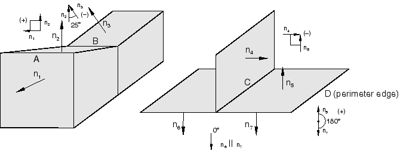
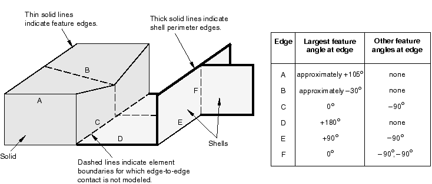
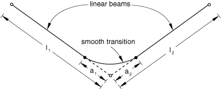
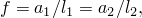

# 36.2.2 Surface properties for general contact in Abaqus/Standard


**Products: **Abaqus/Standard  Abaqus/CAE  

##### **References**

- ["Defining general contact interactions in Abaqus/Standard," Section 36.2.1](pt09ch36s02aus139.md)
- [*CONTACT](../key/key-link.md#usb-kws-hcontact)
- [*SURFACE PROPERTY ASSIGNMENT](../key/key-link.md#usb-kws-hsurfpropassign)
- ["Specifying surface property assignments for general contact," Section 15.13.5 of the Abaqus/CAE User's Guide](../usi/usi-link.md#usi-itn-help-general-surfprop)

### Overview

Surface property assignments:
- can be used to specify geometric corrections for regions of a surface;
- can be used to change the contact thickness used for regions of a surface based on structural elements or to add a contact thickness for regions of a surface based on solid elements;
- can be used to specify surface offsets for regions of a surface based on shell, membrane, rigid, and surface elements;
- can be applied selectively to particular regions within a general contact domain; and
- cannot be applied to analytical rigid surfaces.

### Assigning surface properties

You can assign nondefault surface properties to surfaces involved in general contact interactions. These properties are considered only when the surfaces are involved in general contact interactions; they are not considered when the surfaces are involved in other interactions such as contact pairs. The general contact algorithm does not consider surface properties specified as part of the surface definition.

Surface properties for general contact in Abaqus/Standard are assigned at the beginning of an analysis and cannot be modified across steps.

The surface names used to specify the regions with nondefault surface properties do not have to correspond to the surface names used to specify the general contact domain. In many cases the contact interaction will be defined for a large domain, while nondefault surface properties will be assigned to a subset of this domain. Any surface property assignments for regions that fall outside the general contact domain will be ignored. The last assignment will take precedence if the specified regions overlap.

| **Input File Usage: ** | ``` [*SURFACE PROPERTY ASSIGNMENT](../key/key-link.md#usb-kws-hsurfpropassign), PROPERTY ``` |
| --- | --- |
|  | This option must be used in conjunction with the [*CONTACT](../key/key-link.md#usb-kws-hcontact) option and should appear at most once for each value of the PROPERTY parameter discussed below; the data line can be repeated as often as necessary to assign surface properties to different regions. |

| **Abaqus/CAE Usage: ** | Interaction module: **Create Interaction**: **General contact (Standard)**: **Surface Properties** |
| --- | --- |

### Surface geometry correction

By default, contact calculations are based on unsmoothed, faceted representations of the finite element surfaces in a general contact domain. An optional contact smoothing technique simulates a more realistic representation of curved surfaces in the contact calculations, resulting in improved contact stress and pressure accuracy. This contact smoothing technique is discussed in ["Smoothing contact surfaces in Abaqus/Standard," Section 38.1.3](pt09ch38s01aus179.md).

### Surface thickness

The default surface thickness is equal to the original parent element thickness. Alternatively, you can specify a value for the surface thickness or a thickness scaling factor. A nonzero thickness can be assigned to solid element surfaces; for example, to model the effect of a finite thickness surface coating.

#### Using the original parent element thickness

The default surface thickness is equal to the original parent element thickness.

| **Input File Usage: ** | ``` [*SURFACE PROPERTY ASSIGNMENT](../key/key-link.md#usb-kws-hsurfpropassign), PROPERTY=THICKNESS *surface*, ORIGINAL (default) ``` |
| --- | --- |
|  | If the surface name is omitted, a default surface that encompasses the entire general contact domain is assumed. |

| **Abaqus/CAE Usage: ** | Interaction module: **Create Interaction**: **General contact (Standard)**: **Surface Properties**: **Surface thickness assignments: Edit**: Select surface, click the arrows to transfer surface to list of thickness assignments, and enter ORIGINAL in the **Thickness** column. |
| --- | --- |

#### Specifying a value for the surface thickness

You can specify the surface thickness value directly.

| **Input File Usage: ** | ``` [*SURFACE PROPERTY ASSIGNMENT](../key/key-link.md#usb-kws-hsurfpropassign), PROPERTY=THICKNESS *surface*, *value* ``` |
| --- | --- |
|  | If the surface name is omitted, a default surface that encompasses the entire general contact domain is assumed. |

| **Abaqus/CAE Usage: ** | Interaction module: **Create Interaction**: **General contact (Standard)**: **Surface Properties**: **Surface thickness assignments: Edit**: Select surface, click the arrows to transfer surface to list of thickness assignments, and enter a value for the surface thickness magnitude in the **Thickness** column. |
| --- | --- |

#### Applying a scale factor to the surface thickness

You can apply a scale factor to any value of the surface thickness. For example, if you specify that the original parent element thickness should be used for `surf1` and apply a scale factor of 0.5, a value of one half the original parent element thickness will be used for `surf1` when it is involved in a general contact interaction (all other surfaces included in the general contact domain will use the default original parent element thickness). Scaling the surface thickness in this way can be used to avoid initial overclosures in some situations. Abaqus/Standard will automatically adjust surface positions to resolve initial overclosures (see ["Controlling initial contact status in Abaqus/Standard," Section 36.2.4](pt09ch36s02aus142.md)) associated with general contact. However, if nodal position adjustments are undesirable (for example, if they would introduce an imperfection in an otherwise flat part, resulting in an unrealistic buckling mode), you may prefer to reduce the surface thickness and avoid the overclosures entirely.

| **Input File Usage: ** | ``` [*SURFACE PROPERTY ASSIGNMENT](../key/key-link.md#usb-kws-hsurfpropassign), PROPERTY=THICKNESS *surface*, *value or label*, *scale_factor* ``` |
| --- | --- |
|  | If the surface name is omitted, a default surface that encompasses the entire general contact domain is assumed. |

| **Abaqus/CAE Usage: ** | Interaction module: **Create Interaction**: **General contact (Standard)**: **Surface Properties**: **Surface thickness assignments: Edit**: Select surface, click the arrows to transfer surface to list of thickness assignments, and enter a **Scale Factor**. |
| --- | --- |

### Surface offset

A surface offset is the distance between the midplane of a thin body and its reference plane (defined by the nodal coordinates and element connectivities). It is computed by multiplying the offset fraction (specified as a fraction of the surface thickness) by the surface thickness and the element facet normal. This defines the position of the midsurface and, thus, the position of the body with respect to the reference surface; the coordinates of the nodes on the reference surface are not modified. Surface offsets can be specified only for surfaces defined on shell and similar elements (i.e., membrane, rigid, and surface elements). Surface offsets specified for other elements (e.g., solid or beam elements) will be ignored. By default, surface offsets specified in element section definitions will be used in the general contact algorithm.

You specify the surface offset as a fraction of the surface thickness. The surface offset fraction can be set equal to the offset fraction used for the surface's parent elements or to a specified value.  Surface offsets specified for general contact do not change the element integration.

| **Input File Usage: ** | Use the following option to use the surface offset fraction from the surface's parent elements (default): |
| --- | --- |
|  | ``` [*SURFACE PROPERTY ASSIGNMENT](../key/key-link.md#usb-kws-hsurfpropassign), PROPERTY=OFFSET FRACTION *surface*, ORIGINAL ``` Use the following option to specify a value for the surface offset fraction: ``` [*SURFACE PROPERTY ASSIGNMENT](../key/key-link.md#usb-kws-hsurfpropassign), PROPERTY=OFFSET FRACTION *surface*, *offset* ``` The offset can be specified as a value or a label (SPOS or SNEG). Specifying SPOS is equivalent to specifying a value of 0.5; specifying SNEG is equivalent to specifying a value of 0.5. |

| **Abaqus/CAE Usage: ** | Interaction module: **Create Interaction**: **General contact (Standard)**: **Surface Properties**: **Shell/Membrane offset assignments: Edit**: Select surface, and click the arrows to transfer surface to list of offset assignments. In the **Offset Fraction** column, enter ORIGINAL to use the surface offset fraction from the surface's parent elements, enter SPOS to use a surface offset fraction of 0.5, enter SNEG to use a surface offset fraction of 0.5, or enter a value for the surface offset fraction. |
| --- | --- |

### Feature edges

Feature edges of a model are defined on beam and truss elements and on edges of faces (perimeter and otherwise) of solid and structural elements. General contact in Abaqus/Standard includes an edge-to-surface contact formulation and an edge-to-edge contact formulation (as supplements to the surface-to-surface formulation), as discussed in ["Defining general contact interactions in Abaqus/Standard," Section 36.2.1](pt09ch36s02aus139.md). By default, the edge-to-surface contact formulation considers “edges” of beam and truss elements, perimeter edges, and edges corresponding to initial geometric feature angles of 45 and higher. You can control the feature edge criterion globally or locally for both edge-to-surface and edge-to-edge contact. Feature edge criteria have no effect on “edges” of beam and truss elements—they are activated by their inclusion in the contact domain. 

Some aspects of the contact property assignment options apply only to the surface-to-surface formulation (see ["Contact properties for general contact in Abaqus/Standard," Section 36.2.3](pt09ch36s02aus141.md), for further discussion of contact properties for general contact). The edge-to-surface and edge-to-edge formulations always use the penalty enforcement method and only involve displacement degrees of freedom. For example, the edge-to-surface formulation or the cross edge-to-edge formulation does not contribute to thermal gap conductance across a contact interface.

#### Specifying a cutoff feature angle

The feature angle is the angle formed between normals of two facets connected to an edge. The angles between facets are based on the initial configuration. A negative angle results at concave meetings of facets; therefore, these edges are never included in the contact domain. [Figure 36.2.2--1](pt09ch36s04aus156.md#feature-angles) shows some examples of how the feature angle is calculated for different edges.

**Figure 36.2.2–1** Calculating the feature angle.



The feature angle for edge A is 90 (the angle between  and ); the feature angle for edge B is 25 (the angle between  and ). Edge C forms a T-intersection with three facets (shown in two dimensions in [Figure 36.2.2--2](pt09ch36s04aus156.md#t-intersection-angles)); its feature angles are 0, 90, and 90. 

**Figure 36.2.2–2** Feature angles for a T-intersection (for example, edge C in [Figure 36.2.2--1](pt09ch36s04aus156.md#feature-angles)).


Perimeter edges (for example, edge D in [Figure 36.2.2--1](pt09ch36s04aus156.md#feature-angles)) can be thought of as a special type of feature edge where the feature angle is 180.

If a feature angle criterion is in effect (by default or because you specified it), geometric edges of solid and shell bodies with feature angles greater than or equal to the specified angle are included in the general contact domain. The contact inclusion and exclusion options (discussed in ["Defining general contact interactions in Abaqus/Standard," Section 36.2.1](pt09ch36s02aus139.md)) apply to the surface-to-surface contact formulation, the edge-to-surface contact formulation, and the edge-to-edge contact formulation (and further control which portions of surfaces may interact with either formulation). The sign of the feature angle is considered when determining whether or not a geometric feature edge should be included in the general contact domain. For example, if a cutoff feature angle of 20 were specified, edge A would be activated as a feature edge in the contact model (because the feature angle of 90 is greater than the cutoff of 20) but edges B and C would not be activated (because the feature angle at edge B is 25 and the maximum feature angle at edge  C is 0, which are both less than the cutoff of 20). The cutoff feature angle cannot be set to less than 0 or more than 180. Specifying a small cutoff feature angle (for example, less than 20) may considerably increase run time without a major impact on the results compared to a larger cutoff angle (> 20). The default feature angle cutoff for edge-to-surface contact is 45, while the default is not to include feature edges in edge-to-edge contact. The criterion for including edges for edge-to-surface contact can be different from the criterion for including edges for edge-to-edge contact; the two are completely independent.

[Figure 36.2.2--3](pt09ch36s04aus156.md#feature-edges) illustrates further how the feature angle is used to determine which geometric feature edges are activated in the general contact domain. 

**Figure 36.2.2–3** Feature edges activated in the general contact domain for a cutoff feature angle of 45.



The table to the right of the figure lists the feature angle values for various edges in the model. Edges connected to shell facets, but not on the shell perimeter, have more than one corresponding feature angle. The largest feature angle at an edge is compared to the default or specified cutoff feature angle. For example, if the default cutoff feature angle of 45 is in effect, edges A, D, and E would be considered for edge-to-surface contact, while edges B, C, and F would be ignored for edge-to-surface contact.

| **Input File Usage: ** | ``` [*SURFACE PROPERTY ASSIGNMENT](../key/key-link.md#usb-kws-hsurfpropassign), PROPERTY=FEATURE EDGE CRITERIA *surface*, *feature_angle_value_edge_to_surface*, , *feature_angle_value_edge_to_edge* ``` |
| --- | --- |
|  | If the surface name is omitted, a default surface that encompasses the entire general contact domain is assumed. |

| **Abaqus/CAE Usage: ** | Use the following options to specify the cutoff feature angle for edge-to-surface contact: |
| --- | --- |
|  | Interaction module: **Create Interaction**: **General contact (Standard)**: **Surface Properties**: **Feature edge criteria assignments: Edit**: Select the surface, click the arrows to transfer the surface to the list of feature assignments, and enter a numerical value for the cutoff feature angle (in degrees) in the **Feature Edge Criteria** column Controlling the cutoff feature angle for edge-to-edge contact is not supported in Abaqus/CAE. |

#### Specifying that only perimeter edges should be activated

You can specify that only perimeter edges should be considered by the edge-to-surface and/or edge-to-edge formulation globally or in a local region. Perimeter edges occur on “physical” perimeters of shell elements and on “artificial” edges that occur when a subset of exposed facets on a body are included in the general contact domain. The classification of an edge as being on the perimeter of the contact domain (or as a geometric edge with a particular feature angle) is based on the contact inclusion and contact exclusion definitions and the mesh characteristics. When structural elements share nodes with continuum elements, the perimeter edges will not be activated on the structural elements because the criterion to designate them as such is no longer satisfied.

| **Input File Usage: ** | ``` [*SURFACE PROPERTY ASSIGNMENT](../key/key-link.md#usb-kws-hsurfpropassign), PROPERTY=FEATURE EDGE CRITERIA *surface*, PERIMETER EDGES, , PERIMETER EDGES ``` |
| --- | --- |
|  | If the surface name is omitted, a default surface that encompasses the entire general contact domain is assumed. |

| **Abaqus/CAE Usage: ** | Use the following options to specify that only perimeter edges should be included for edge-to-surface contact: |
| --- | --- |
|  | Interaction module: **Create Interaction**: **General contact (Standard)**: **Surface Properties**: **Feature edge criteria assignments: Edit**: Select the surface, click the arrows to transfer the surface to the list of feature assignments, and enter PERIMETER in the **Feature Edge Criteria** column Specifying that only perimeter edges should be included for edge-to-edge contact is not supported in Abaqus/CAE. |

#### Specifying that feature edges should not be included

You can specify that no edges should be considered by the edge-to-surface formulation globally or in a local region. However, doing so does not deactivate “contact edges” associated with beam and truss elements. By default, feature edges are not included for edge-to-edge contact. 

| **Input File Usage: ** | ``` [*SURFACE PROPERTY ASSIGNMENT](../key/key-link.md#usb-kws-hsurfpropassign), PROPERTY=FEATURE EDGE CRITERIA *surface*, NO FEATURE EDGES ``` |
| --- | --- |
|  | If the surface name is omitted, a default surface that encompasses the entire general contact domain is assumed. |

| **Abaqus/CAE Usage: ** | Use the following options to specify that no feature edges are included for edge-to-surface contact: |
| --- | --- |
|  | Interaction module: **Create Interaction**: **General contact (Standard)**: **Surface Properties**: **Feature edge criteria assignments: Edit**: Select the surface, click the arrows to transfer the surface to the list of feature assignments, and enter NONE in the **Feature Edge Criteria** column |

### Smoothing beam segments

For radial beam-to-beam contact, Abaqus/Standard smooths any discontinuous transitions between two beams (or trusses). This smoothing is shown in [Figure 36.2.2--4](pt09ch36s02aus140.md#beam-lin-smoothing) for first-order beams and in [Figure 36.2.2--5](pt09ch36s02aus140.md#beam-quad-smoothing) for second-order beams. 

**Figure 36.2.2–4** Smoothing between linear beams.



**Figure 36.2.2–5** Smoothing between quadratic beams.


#### Controlling the degree of smoothing

You can control the degree of smoothing by specifying a fraction *f*. The default value of *f* is 0.2. 



where  and  are the lengths of the beam elements that join at the surface node and  (see [Figure 36.2.2--4](pt09ch36s02aus140.md#beam-lin-smoothing) and [Figure 36.2.2--5](pt09ch36s02aus140.md#beam-quad-smoothing)). Abaqus/Standard constructs either a parabolic or a cubic segment between two points at distances  and  from the node at which the discontinuity exists; this smoothed segment is used in the contact calculations. Thus, the contact geometry differs from the beam element geometry. This smoothing does not occur where three or more beams share the same node.

| **Input File Usage: ** | ``` [*SURFACE PROPERTY ASSIGNMENT](../key/key-link.md#usb-kws-hsurfpropassign), PROPERTY=BEAM SMOOTHING *surface*, *value* ``` |
| --- | --- |
|  | If the surface name is omitted, a surface consisting of all beam segments in the entire general contact domain is assumed. |

| **Abaqus/CAE Usage: ** | Controlling the degree of smoothing for beam segments is not supported in Abaqus/CAE. |
| --- | --- |


