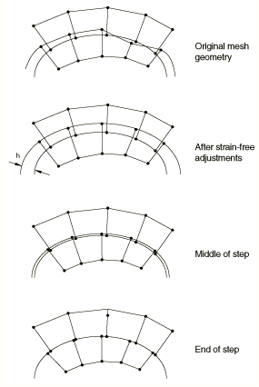
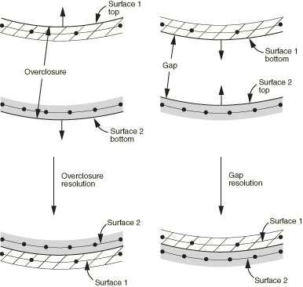

# 36.2.4 Controlling initial contact status in Abaqus/Standard


**Products: **Abaqus/Standard  Abaqus/CAE  

##### **References**

- ["Defining general contact interactions in Abaqus/Standard," Section 36.2.1](pt09ch36s02aus139.md)
- [*CONTACT INITIALIZATION ASSIGNMENT](../key/key-link.md#usb-kws-hcontinitassign)
- [*CONTACT INITIALIZATION DATA](../key/key-link.md#usb-kws-hcontactinitdata)
- ["Creating contact initializations," Section 15.12.4 of the Abaqus/CAE User's Guide](../usi/usi-link.md#usi-itn-helptopic-initialization)
- ["Specifying and modifying contact initialization assignments for general contact," Section 15.13.3 of the Abaqus/CAE User's Guide](../usi/usi-link.md#usi-itn-help-general-initassign)

### Overview

Contact initialization controls for general contact in Abaqus/Standard:
- can be used to specify whether initial overclosures should be resolved without generating stresses and strains or treated as interference fits that are gradually resolved over multiple increments; and
- can be used to specify nondefault search zones that determine which nodes are affected in the case of strain-free adjustments or interference fits.

Abaqus/Standard initializes the contact state based on the gap or penetration state observed in the initial geometry. Small initial contact overclosures are resolved by default using strain-free adjustments to the positions of surface nodes. You can define alternative contact initialization methods and then assign them to contact interactions. For example, you can choose to have initial overclosures for certain interactions treated as interference fits.

### Default contact initialization method

By default, the general contact algorithm adjusts the initial positions of surface nodes during preprocessing to remove small initial surface overclosures without generating strains or stresses in the model, as shown in [Figure 36.2.4--1](pt09ch36s02aus142.md#aadjustsurf-adj). These adjustments are intended to correct only minor mismatches associated with mesh generation. 

**Figure 36.2.4–1** Configuration of contact surfaces after strain-free adjustments to resolve overclosure.


General contact automatically assigns master and slave roles for contact interactions, as discussed in ["Numerical controls for general contact in Abaqus/Standard," Section 36.2.6](pt09ch36s02aus144.md). Abaqus/Standard calculates an overclosure tolerance based on the size of the underlying element facets on a slave surface. Slave surfaces in a particular interaction are repositioned onto the associated master surface (using strain-free adjustments) if the two surfaces are initially overclosed by a distance smaller than the calculated tolerance. Initial gaps between surfaces remain unchanged by default adjustments. If a portion of a slave surface is initially overclosed by a distance greater than the calculated tolerance, Abaqus/Standard automatically generates a contact exclusion for this surface portion and its associated master surface. Therefore, general contact does not create interactions between surfaces (or portions of surfaces) that are severely overclosed in the initial configuration of the model, and these surfaces can freely penetrate each other throughout the analysis.

General contact uses the finite-sliding, surface-to-surface contact formulation, so penetration/gap calculations are computed as averages over finite regions; therefore, it is possible for penetrations and gaps to be present at individual surface nodes after the adjustments. The default adjustments will not resolve initial crossings of two reference surfaces associated with shells or membranes, although techniques to resolve such cases are discussed in ["Assigning contact initializations to shell surfaces](pt09ch36s02aus142.md#usb-cni-agenlcontinitializationstd-shells).”

### Defining alternative contact initialization methods

You can define alternative contact initialization methods if the default behavior is not desired. For example, you may want to increase the tolerance for deep penetrations or specify that certain openings should be adjusted to a “just touching” status. Furthermore, some analyses call for initial overclosures to be treated as interference fits rather than resolved with strain-free adjustments. To modify the contact initialization behavior, you must define one or more alternate contact initialization methods and then identify which surface pairings are to use which methods.

You assign a name to each contact initialization method. This name is used in the assignment of a contact initialization method to specific surface pairings (see ["Assigning contact initialization methods](pt09ch36s02aus142.md#usb-cni-agenlcontinitializationstd-assign)” below).

| **Input File Usage: ** | ``` [*CONTACT INITIALIZATION DATA](../key/key-link.md#usb-kws-hcontactinitdata), NAME=*contact_initialization_method_name* ``` |
| --- | --- |

| **Abaqus/CAE Usage: ** | Interaction module: ****Interaction****Contact Initialization****Create****: **Name:** *contact_initialization_method_name* |
| --- | --- |

#### Increasing the search zones for strain-free adjustments

As discussed above in ["Default contact initialization method](pt09ch36s02aus142.md#usb-cni-agenlcontinitializationstd-default),” initial gaps and large initial overclosures between surfaces are not adjusted by the default contact initialization methods. You can optionally specify nondefault search distances both above and below the surfaces in an interaction; slave surfaces that lie within these search distances are repositioned directly onto their associated master surface using strain-free nodal adjustments. Abaqus/Standard takes shell thickness into account when calculating these search distances.

Specifying a search distance above a surface is used to close small initial gaps between surfaces. Specifying a search distance below a surface is used to increase the default overclosure tolerance that Abaqus/Standard uses when performing strain-free adjustments; if you specify a search distance smaller than the default overclosure tolerance, Abaqus/Standard uses the default tolerance instead. As with the default initialization behavior, contact exclusions are created for initial overclosures that are larger than the specified search zone.

Increasing the extent of the search zones for strain-free adjustments can potentially increase the computational cost of an analysis. It is not generally recommended that you specify a large search zone since this may cause mesh distortion when nodes are repositioned over large distances.

| **Input File Usage: ** | ``` [*CONTACT INITIALIZATION DATA](../key/key-link.md#usb-kws-hcontactinitdata), SEARCH ABOVE=*a*, SEARCH BELOW=*b* ``` |
| --- | --- |

| **Abaqus/CAE Usage: ** | Interaction module: ****Interaction****Contact Initialization****Create****: **Resolve with strain-free adjustments**: **Ignore overclosures greater than:** *b*, **Ignore initial openings greater than:** *a* |
| --- | --- |

#### Specifying an initial clearance distance

By default, the strain-free adjustments discussed above will adjust initial nodal positions such that surfaces are “just-touching” (with zero penetration/separation). Alternatively, Abaqus/Standard can make the adjustments to achieve an initial clearance distance that you specify. The adjustments will occur only for regions that satisfy the search zone tolerances, as discussed above. Mesh distortion can occur if large strain-free adjustments are necessary to achieve the specified initial clearance distance.

| **Input File Usage: ** | ``` [*CONTACT INITIALIZATION DATA](../key/key-link.md#usb-kws-hcontactinitdata), INITIAL CLEARANCE=*h* ``` |
| --- | --- |

| **Abaqus/CAE Usage: ** | Interaction module: ****Interaction****Contact Initialization****Create****: **Specify clearance distance:** *h* |
| --- | --- |

#### Modeling interference fits

Optionally, the general contact algorithm in Abaqus/Standard can treat initial overclosures as interference fits. The general contact algorithm uses a shrink-fit method to gradually resolve the interference distance over the first step of the analysis (if multiple load increments are used for the first step) as shown in [Figure 36.2.4--2](pt09ch36s02aus142.md#acontact-interfer-grad), such that the fraction of the interference resolved up to and including a particular increment approximately corresponds to the fraction of the step completed. Stresses and strains are generated as the interference is resolved. Gradually resolving interference over several increments improves robustness (compared to always resolving the full interference in the first increment, which is the default for contact pairs) for cases in which a nonlinear response occurs for “interference-fit loading.” It is generally recommended that you do not apply other loads while the interference fit is being resolved.

**Figure 36.2.4–2** Gradual resolution of contact interference fit.


Because contact conditions are enforced in an average sense in a region around each constraint location for the surface-to-surface contact formulation used by general contact in Abaqus/Standard, penetrations or gaps may be observed at slave nodes when surface-to-surface constraints are in a zero-penetration state.

| **Input File Usage: ** | ``` [*CONTACT INITIALIZATION DATA](../key/key-link.md#usb-kws-hcontactinitdata), INTERFERENCE FIT ``` |
| --- | --- |

| **Abaqus/CAE Usage: ** | Interaction module: ****Interaction****Contact Initialization****Create****: **Treat as interference fits** |
| --- | --- |

##### Increasing the tolerance for interference fits

Abaqus/Standard calculates an overclosure tolerance based on the size of the underlying element facets on a slave surface (see ["Default contact initialization method](pt09ch36s02aus142.md#usb-cni-agenlcontinitializationstd-default)” above). An interference fit between two surfaces affects only those slave surfaces that are overclosed by a distance smaller than the calculated tolerance; contact is ignored entirely for surfaces that are overclosed by a distance greater than the calculated tolerance.

Optionally, you can redefine the overclosure tolerance to include larger overclosures in the interference fit. If you specify a tolerance that is smaller than the default calculated tolerance, Abaqus/Standard uses the default calculated tolerance instead.

| **Input File Usage: ** | ``` [*CONTACT INITIALIZATION DATA](../key/key-link.md#usb-kws-hcontactinitdata), INTERFERENCE FIT, SEARCH BELOW=*b* ``` |
| --- | --- |

| **Abaqus/CAE Usage: ** | Interaction module: ****Interaction****Contact Initialization****Create****: **Treat as interference fits**: **Ignore overclosures greater than:** *b* |
| --- | --- |

##### Specifying the interference distance

By default, the interference distance is implied by the initial overclosure of the mesh; alternatively, you can specify the interference distance. In this case Abaqus/Standard first makes strain-free adjustments of nodal positions such that the initial overclosure in the adjusted configuration corresponds to the specified interference distance and then invokes the shrink fit method discussed above, as depicted in [Figure 36.2.4--3](pt09ch36s02aus142.md#acontact-interfer-grad2). Mesh distortion can occur if large strain-free adjustments are necessary to achieve the specified interference distance.

**Figure 36.2.4–3** Treatment of a specified interference distance that differs from the interference implied by the original mesh.



The search region for the strain-free adjustments and subsequent shrink fit resolution is at least at large as the search region for the case discussed previously in which the interference distance is not specified. The search region will include overclosures at least as large as the specified interference fit and openings at least as large as the optionally specified search distance above a surface.

| **Input File Usage: ** | ``` [*CONTACT INITIALIZATION DATA](../key/key-link.md#usb-kws-hcontactinitdata), INTERFERENCE FIT=*h*, SEARCH ABOVE=*a*, SEARCH BELOW=*b* ``` |
| --- | --- |

| **Abaqus/CAE Usage: ** | Interaction module: ****Interaction****Contact Initialization****Create****: **Treat as interference fits**: **Specify interference distance:** *h*: **Ignore overclosures greater than:** *b*, **Ignore initial openings greater than:** *a* |
| --- | --- |

##### Deactivating friction while resolving interference fits

The presence of a friction model can degrade the robustness of resolving interference fits. It is generally recommended that you temporarily deactivate friction models while Abaqus/Standard resolves interference fits. You can deactivate the friction model in the first step while interference fits are resolved using the “change friction” method discussed in ["Changing friction properties during an Abaqus/Standard analysis" in "Frictional behavior," Section 37.1.5](pt09ch37s01aus169.md#usb-cni-afriction-change-std).

##### Cases in which interference fit resolution with contact pairs is preferred

Large interferences may be difficult to resolve with the finite-sliding, surface-to-surface formulation. Using this formulation, overclosures tend to be resolved along the slave facet normal directions; using the node-to-surface formulation, which is available only with the contact pair algorithm, overclosures tend to be resolved along the master surface normal directions. [Figure 36.2.4--4](pt09ch36s02aus142.md#rnb-chp-interffitcompare) illustrates a case where differing normal directions lead to undesirable tangential motion during an interference fit. In some cases it may be preferable to resolve large initial overclosures with node-to-surface discretization using the contact pair algorithm (see ["Modeling contact interference fits in Abaqus/Standard," Section 36.3.4](pt09ch36s03aus148.md)).

**Figure 36.2.4–4** Comparison of contact formulations in an example with a large interference fit.


### Assigning contact initialization methods

You can assign contact initialization methods to selected surface pairings.

The surface names used in the assignment of contact initialization methods do not have to correspond to the surface names used to specify the general contact domain. In many cases nondefault contact initialization methods will be assigned to a subset of the overall general contact domain. Any contact initialization assignments for regions that fall outside of the general contact domain are ignored. The last assignment takes precedence if the specified interactions overlap.

| **Input File Usage: ** | Use the following option to assign contact inititialization methods: |
| --- | --- |
|  | ``` [*CONTACT INITIALIZATION ASSIGNMENT](../key/key-link.md#usb-kws-hcontinitassign) *surface_1*, *surface_2*, *contact_initialization_method_name* ``` This option must be used in conjunction with the [*CONTACT](../key/key-link.md#usb-kws-hcontact) option. The data line can be repeated as often as necessary to assign contact initialization methods to different regions. If the first surface name is omitted, a default surface that encompasses the entire general contact domain is assumed. If the second surface name is omitted or is the same as the first surface name, contact between the first surface and itself is assumed. Keep in mind that surfaces can be defined to span multiple unattached bodies, so self-contact is not limited to contact of a single body with itself. If the contact initialization method name is omitted, the default contact initialization method in Abaqus/Standard is assumed. If a contact initialization method name is specified, it must also appear as the value of the NAME parameter on a [*CONTACT INITIALIZATION DATA](../key/key-link.md#usb-kws-hcontactinitdata) option in the model portion of the input file. |

| **Abaqus/CAE Usage: ** | Interaction module: **Create Interaction**: **General contact (Standard)**: **Contact Properties**: **Initialization assignments: Edit**: select the surfaces and the initialization in the columns on the left, and click the arrows in the middle to transfer them to the list of contact initialization assignments |
| --- | --- |

#### Assigning contact initializations to shell surfaces

The surfaces in a contact initialization assignment can be either single- or double-sided. Single-sided surfaces must have consistent surface normal orientations for adjacent faces. Strain-free adjustments will not move surface nodes past the reference surface of the opposing surface if the assignment of a contact initialization method is made with double-sided surfaces.

Using single-sided surfaces in the assignment of a contact initialization method for shells or membranes provides enhanced control over contact initialization for cases in which shell or membrane reference surfaces are initially crossed or are initially on the wrong side of each other. [Figure 36.2.4--5](pt09ch36s02aus142.md#rnb-chpinter-sfadoublesided) shows examples of adjustments for nearby segments of shell surfaces. For the case shown on the left it is assumed that single-sided surfaces with normal directions pointing away from each another are used in the assignment of the contact initialization method. In this case nodes are moved across the opposing reference surface during the strain-free adjustments.

For the case shown on the right in [Figure 36.2.4--5](pt09ch36s02aus142.md#rnb-chpinter-sfadoublesided) it is assumed that single-sided surfaces with normal directions pointing toward each other are used in the assignment of the contact initialization method. In this case an initial gap is observed between the single-sided surfaces (which is also the case if double-sided surfaces are used in the contact initialization assignment). No strain-free adjustments will be made by default for openings such as this; however, if a nondefault contact initialization method is specified with an initial opening search tolerance set to a value exceeding the initial separation distance, strain-free adjustments will close the gap as shown in the figure (without moving nodes past the opposing reference surface). 

#### Examples

The following contact initialization assignments are specified below as model data in a general contact analysis:
- a global assignment of `shrink_fit` to the entire general contact domain;
- a local assignment of `shrink_fit_local` to contact between surfaces `surface_A` and `surface_B`---the search zone is specified explicitly to increase the default overclosure tolerance;
- a local assignment of the default Abaqus contact initialization method to contact between `surface_C` and `surface_D`; and
- a local assignment of `sfa_pickside` to contact between double-sided surfaces `surface_1` and `surface_2` by specifying one side of each surface, `surface_1_TOP` and `surface_2_BOTTOM`, in the data lines (see bottom left of [Figure 36.2.4--5](pt09ch36s02aus142.md#rnb-chpinter-sfadoublesided)). **Figure 36.2.4--5** Strain-free adjustments during contact initialization for single-sided shell surfaces. 

```
[*CONTACT INITIALIZATION DATA](../key/key-link.md#usb-kws-hcontactinitdata), NAME=shrink_fit, INTERFERENCE FIT
[*CONTACT INITIALIZATION DATA](../key/key-link.md#usb-kws-hcontactinitdata), NAME=shrink_fit_local,
   INTERFERENCE FIT, SEARCH BELOW = 15.0
[*CONTACT INITIALIZATION DATA](../key/key-link.md#usb-kws-hcontactinitdata), NAME=sfa_pickside, 
   SEARCH BELOW = 10.0
…
[*CONTACT](../key/key-link.md#usb-kws-hcontact)
[*CONTACT INCLUSIONS](../key/key-link.md#usb-kws-hcontactinclusions), ALL EXTERIOR
[*CONTACT INITIALIZATION ASSIGNMENT](../key/key-link.md#usb-kws-hcontinitassign)
 , , shrink_fit 
surface_A, surface_B, shrink_fit_local
surface_C, surface_D, 
surface_1_TOP, surface_2_BOTTOM, sfa_pickside

```


