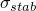
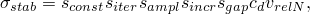
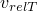
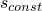
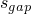
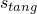
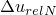
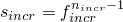
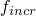

# 36.2.5 Stabilization for general contact in Abaqus/Standard


**Products: **Abaqus/Standard  Abaqus/CAE  

##### **References**

- ["Defining general contact interactions in Abaqus/Standard," Section 36.2.1](pt09ch36s02aus139.md)
- [*CONTACT](../key/key-link.md#usb-kws-hcontact)
- [*CONTACT STABILIZATION](../key/key-link.md#usb-kws-hcontactstab)
- ["Creating contact stabilization definitions," Section 15.12.5 of the Abaqus/CAE User's Guide](../usi/usi-link.md#usi-itn-helptopic-stabilization)
- ["Specifying and modifying contact stabilization assignments for general contact," Section 15.13.4 of the Abaqus/CAE User's Guide](../usi/usi-link.md#usi-itn-help-general-stabilassign)

### Overview

Contact stabilization for general contact in Abaqus/Standard:
- is often helpful in stabilizing unconstrained rigid body modes in static analyses;
- can be applied selectively to particular regions within a general contact domain; and
- can vary over time.

### Stabilization based on viscous damping of relative motion between surfaces

Contact stabilization is based on viscous damping opposing incremental relative motion between nearby surfaces, in the same manner as contact damping (see ["Contact damping," Section 37.1.3](pt09ch37s01aus167.md)). The most common purpose of contact stabilization is to stabilize otherwise unconstrained “rigid body motion” before contact closure and friction restrain such motions. A goal of artificial stabilization, such as contact stabilization, is to provide enough stabilization to enable a robust, efficient simulation without degrading the accuracy of the results. In most cases contact stabilization is not activated by default (an exception is discussed in ["Contact at a single point" in "Common difficulties associated with contact modeling in Abaqus/Standard," Section 39.1.2](pt09ch39s01aus184.md#usb-cni-acontacttrouble-pointstab)), so you will generally need to activate contact stabilization if convergence problems associated with unconstrained rigid body modes may be present in your analysis. Once activated, contact stabilization is highly automated.

The following expressions for the normal pressure, , and shear stress, , associated with contact stabilization involve many semi-automated factors to facilitate achieving the desired stabilization characteristics:




where


is a damping coefficient;

 and 

are the relative normal and tangential velocities, respectively, between nearby points on opposing contact surfaces;



is a constant scale factor;


is an iteration-dependent scale factor;


is a time-dependent scale factor;


is a scale factor based on the increment number;



is a scale factor based on the separation distance; and



is a constant scale factor for tangential stabilization.

The damping coefficient and relative velocities are computed by Abaqus/Standard. The damping coefficient is equal to a fixed, small fraction, , times a representative stiffness of elements underlying the contact surfaces, , times the time period of the step, . Relative velocities in a static analysis are computed by dividing relative incremental displacements,  and , by the time increment size, .

Therefore, the following contact stabilization expressions apply to statics:


where the portions within brackets can be thought of as stabilization stiffnesses (representing resistance to relative motion between nearby surfaces). The stabilization stiffness is inversely proportional to the time increment size, which is a desirable characteristic. Stabilization stiffness increases if the time increment size is reduced, which happens automatically in Abaqus/Standard if convergence difficulties occur for a particular time increment size.

### Assigning stabilization to interactions

Contact stabilization assignments for specific interactions within general contact can be made globally or locally and are specified as part of step definitions. In most cases you only need to specify which interactions are eligible for contact stabilization without adjusting the scale factors discussed previously.

| **Input File Usage: ** | Use the following option to specify which interactions should use contact stabilization: |
| --- | --- |
|  | ``` [*CONTACT STABILIZATION](../key/key-link.md#usb-kws-hcontactstab) *surf_1*, *surf_2* ``` If the first surface name is omitted, a default surface that encompasses the entire general contact domain is assumed. If the second surface name is omitted, contact between the first surface and itself is assumed. |

| **Abaqus/CAE Usage: ** | Use the following options to assign contact stabilization definitions to individual surface pairs: |
| --- | --- |
|  | Interaction module: **Create Interaction**: **General contact (Standard)**: **Contact Properties**: **Stabilization assignments: Edit**: select the surfaces and the stabilization name in the columns on the left, and click the arrows in the middle to transfer them to the list of contact stabilization assignments |

### Specifying stabilization scale factors

In some cases you may want to adjust one or more scale factors associated with contact stabilization. You can use multiple instances of this option to achieve different scale factor settings for different general contact interactions.

#### Constant scale factors

As shown in the expressions above for the stabilization pressure and shear stress, the scale factor  applies to normal and tangential stabilization, whereas the scale factor  applies only to tangential stabilization. The default setting of the constant scale factor  is unity for the specified interactions. 

The default setting of  is zero such that no tangential stabilization stiffness exists by default for the specified interactions. Normal-direction-only contact stabilization is adequate in many cases. Other analyses can benefit from tangential stabilization stiffness; however, if you specify a nonzero setting of , keep in mind that tangential contact stabilization often absorbs significant energy if large relative tangential motion occurs between nearby surfaces. Large energy absorbed by stabilization is one indication that analysis results are likely to be significantly affected by the stabilization. Normal contact stabilization is much less likely to absorb significant energy and, thus, tends to have less influence on the results.

| **Input File Usage: ** | ``` [*CONTACT STABILIZATION](../key/key-link.md#usb-kws-hcontactstab), SCALE FACTOR=, TANGENT FRACTION= ``` |
| --- | --- |

| **Abaqus/CAE Usage: ** | Interaction module: ****Interaction****Contact Stabilization****Create****: **Scale factor:** , **Tangential factor:**  |
| --- | --- |

#### Iteration-dependent scale factors

To reduce or eliminate the likelihood of contact stabilization significantly influencing the reported solution, scale factors can be introduced that vary across iterations of an increment. Having more stabilization in effect during the early iterations of an increment can be helpful to avoid numerical problems prior to establishing active contact regions. Having less or no stabilization in effect during the later iterations can be helpful to improve the accuracy of the final converged iteration of an increment. 

You can specify these scale factors. For example, specifying “1,0” results in the scale factor being unity during initial iterations (until various convergence measures are satisfied or nearly satisfied) and then the scale factor being reset to zero (effectively turning off stabilization) for the final iterations until convergence checks are again satisfied.

| **Input File Usage: ** | ``` [*CONTACT STABILIZATION](../key/key-link.md#usb-kws-hcontactstab), SCALE FACTOR=USER ADAPTIVE ``` |
| --- | --- |

#### Time-dependent scale factors

The scale factors  and   control time-dependence of the contact stabilization. By default,  is equal to the fraction of the step remaining. The other factor varies according to , where  is a per-increment reduction factor (equal to 0.1 by default) and  is the increment number within a step. These defaults imply that the stabilization is reduced by more than an order of magnitude in successive increments of the same size and that no stabilization is applied in the final increment of a step. The defaults are appropriate for most cases in which contact stabilization is intended to provide stabilization in initial increments while contact is being established.

Two options are provided for adjusting the time-dependent scale factors: you can refer to an amplitude curve that will govern , and you can specify the value of  (recall the expression  given previously). For example, if unstable modes remain after contact is established, you may want  and  to remain equal to unity throughout a step for certain interactions, which can be accomplished by referring to an amplitude with a constant value of one and setting the per-increment reduction factor, , equal to one.

| **Input File Usage: ** | ``` [*AMPLITUDE](../key/key-link.md#usb-kws-mamplitude), NAME=*name* [*CONTACT STABILIZATION](../key/key-link.md#usb-kws-hcontactstab), AMPLITUDE=*name*, REDUCTION PER INCREMENT= ``` |
| --- | --- |

| **Abaqus/CAE Usage: ** | Load or Interaction module: **Create Amplitude**: **Name:** *name* Interaction module: ****Interaction****Contact Stabilization****Create****: **Reduction factor:** , **Amplitude:** *name* |
| --- | --- |

##### Resetting time-dependent scale factors in subsequent steps

Contact stabilization definitions do not affect subsequent steps unless an amplitude reference is specified. If an amplitude based on the total time is specified, the same amplitude curve continues to govern the variation of  in subsequent steps until a new contact stabilization definition is assigned to the interaction. If an amplitude based on the step time is specified, the amplitude curve governs  for a single step and  remains constant (at the ending value) in subsequent steps until a new contact stabilization definition is assigned to the interaction. In both cases you can also reset the contact stabilization definition to remove stabilization from a step. Resetting ensures that contact stabilization options from prior steps do not affect the current step.

| **Input File Usage: ** | ``` [*CONTACT STABILIZATION](../key/key-link.md#usb-kws-hcontactstab), RESET ``` |
| --- | --- |

| **Abaqus/CAE Usage: ** | Load or Interaction module: **Create Amplitude**: **Name:** *name* Interaction module: ****Interaction****Contact Stabilization****Create****: **Reset values from previous steps** |
| --- | --- |

#### Gap-dependent scale factor

The scale factor  controls contact stabilization as a function of the local separation distance between surfaces. By default, this factor is unity for zero gap distance and is zero when the gap distance is greater than or equal to a characteristic surface dimension. You can control the gap distance at which  becomes zero. Specifying a large value for this threshold distance is not recommended because of the tendency to increase solution cost per iteration (due to increased connectivity) as the threshold distance increases.

| **Input File Usage: ** | ``` [*CONTACT STABILIZATION](../key/key-link.md#usb-kws-hcontactstab), RANGE=*distance* ``` |
| --- | --- |

| **Abaqus/CAE Usage: ** | Interaction module: ****Interaction****Contact Stabilization****Create****: **Zero stabilization distance:** **Specify:** *distance* |
| --- | --- |

### Hierarchy of contact stabilization definitions

The interface discussed above is the recommended method for specifying contact stabilization for general contact; however, contact stabilization can be introduced for general contact interactions in two other ways. The order of precedence in cases of overlap is as follows:
- First priority is given to the contact stabilization assignment options discussed in this section.
- Second priority is given to the contact stabilization assignment options discussed in ["Automatic stabilization of rigid body motions in contact problems" in "Adjusting contact controls in Abaqus/Standard," Section 36.3.6](pt09ch36s03aus150.md#usb-cni-acontacttrouble-stabilize).
- Third priority is given to the default contact stabilization discussed in ["Contact at a single point" in "Common difficulties associated with contact modeling in Abaqus/Standard," Section 39.1.2](pt09ch39s01aus184.md#usb-cni-acontacttrouble-pointstab).


