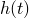
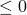
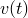
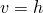
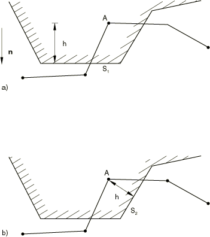

# 36.3.4 Modeling contact interference fits in Abaqus/Standard


**Products: **Abaqus/Standard  Abaqus/CAE  

##### **References**

- ["Defining contact pairs in Abaqus/Standard," Section 36.3.1](pt09ch36s03aus145.md)
- [*CONTACT INTERFERENCE](../key/key-link.md#usb-kws-hcontactinterfer)
- ["Specifying interference fit options" in "Defining surface-to-surface contact," Section 15.13.7 of the Abaqus/CAE User's Guide](../usi/usi-link.md#usi-itn-help-interferencefit)

### Overview

Interference fits in Abaqus/Standard:
- occur by default when the contact formulation computes overclosures between surfaces in the initial configuration of a model;
- are resolved in the first increment of a step by default;
- can be gradually resolved over multiple increments;
- result in stresses and strains in a model as overclosures are resolved;
- can be specified for both surface-based contact pairs and contact elements; and
- cannot be specified for self-contact.

Abaqus/Standard offers alternative methods to resolve initial overclosures with strain-free adjustments and to model specific overclosures or clearances different from those calculated from the initial configuration. These methods are discussed in ["Adjusting initial surface positions and specifying initial clearances in Abaqus/Standard contact pairs," Section 36.3.5](pt09ch36s03aus149.md).

### Resolving excessive initial overclosures

If there are large overclosures in the initial configuration of model, Abaqus/Standard may not be able to resolve the interference fit in a single increment. Abaqus/Standard provides alternative methods that allow overclosures to be resolved gradually over multiple increments.

The default contact constraint imposed at each constraint location is that the current penetration  is . Penetration exists when  is positive. To alter this constraint, you can specify an allowable interference, , that will be ramped down over the course of a step. The specified allowable interference modifies the contact constraint as follows: 


Thus, specifying a positive value for  causes Abaqus/Standard to ignore penetrations up to that magnitude. [Figure 36.3.4--1](pt09ch36s03aus148.md#acontact-interfer-fit) illustrates a typical interference fit problem. 

**Figure 36.3.4–1** Interference fit with contact surfaces.


If the penetration in the model is , you may declare  or request an automatic shrink fit. In either case Abaqus/Standard will consider the two bodies to be just in contact at the start of the simulation. As the allowable interference, , is decreased during the step, Abaqus/Standard pushes the surfaces apart until there is no more allowable penetration.

There are three different ways in which to specify the allowable interference, . By default, in all cases the value of the specified allowable interference is applied instantaneously at the start of the step and then ramped down to zero linearly over the step, unless you specify an amplitude reference that defines a particular allowable interference-time variation. It is recommended that you specify allowable interferences in a step separate from the rest of the analysis; additional loads may adversely affect the resolution of the interference fit and the response to loading with partially-resolved interferences may be non-physical. Once the overclosures are resolved, you can continue the analysis in a new step.

When the contact interference is specified, output variable COPEN does not reflect the actual overclosure value during the step; it reflects the actual value only at the end of the step.

You must specify the contact pairs or contact elements at which the allowable interference should apply.

| **Input File Usage: ** | Use the following option to define an allowable interference for contact pairs: |
| --- | --- |
|  | ``` [*CONTACT INTERFERENCE](../key/key-link.md#usb-kws-hcontactinterfer), TYPE=CONTACT PAIR *slave surface*, *master surface*,  ... ``` Use the following option to define an allowable interference for contact elements: ``` [*CONTACT INTERFERENCE](../key/key-link.md#usb-kws-hcontactinterfer), TYPE=ELEMENT *contact element set*,  ... ``` |

| **Abaqus/CAE Usage: ** | Interaction module: interaction editor: **Interference Fit**: **Gradually remove slave node overclosure during the step**, **Uniform allowable interference**, **Magnitude at start of step:**  |
| --- | --- |
|  | Element-based contact is not supported in Abaqus/CAE. |

#### Using a nondefault amplitude curve for the allowable interference

You can define a time-varying allowable contact interference by creating an amplitude curve (see ["Amplitude curves," Section 34.1.2](pt07ch34s01aus115.md), for details) and then referring to this curve from the contact interference definition. The amplitude will be ignored, however, if the Riks method (see ["Unstable collapse and postbuckling analysis," Section 6.2.4](pt03ch06s02at03.md)) is used.

| **Input File Usage: ** | ``` [*CONTACT INTERFERENCE](../key/key-link.md#usb-kws-hcontactinterfer), AMPLITUDE=*amplitude_curve_name* ``` |
| --- | --- |

| **Abaqus/CAE Usage: ** | Interaction module: interaction editor: **Interference Fit**: **Gradually remove slave node overclosure during the step**, **Uniform allowable interference**, **Amplitude:** *amplitude_curve_name* |
| --- | --- |

#### Removing or modifying the allowable contact interferences

By default, only the allowable contact interferences defined or redefined by a particular contact interference definition will be modified. Alternatively, you can specify that all previously defined allowable contact interferences should be removed from the model and only those defined with this definition will remain.

| **Input File Usage: ** | Use the following option to add or modify an allowable contact interference definition: |
| --- | --- |
|  | ``` [*CONTACT INTERFERENCE](../key/key-link.md#usb-kws-hcontactinterfer), OP=MOD ``` Use the following option to remove all previously defined allowable contact interferences: ``` [*CONTACT INTERFERENCE](../key/key-link.md#usb-kws-hcontactinterfer), OP=NEW ``` |

| **Abaqus/CAE Usage: ** | Contact interferences in Abaqus/CAE propagate along with the interaction for which they are defined. You cannot remove all previously defined contact interferences at once in Abaqus/CAE. |
| --- | --- |

#### Specifying the same allowable contact interference for an entire surface

A single allowable interference  can be specified for every node on the slave surface or every slave node in the specified set of contact elements. The concepts of slave nodes for the various families of contact elements are discussed in their respective sections. The specified allowable contact interferences are included in the current penetrations of the slave nodes reported in the message file when you request detailed contact printout. Thus, any slave node that penetrates the master surface by less than the allowable interference will be reported as being open.

#### Using the automatic "shrink" fit method

This method is applicable only during the first step of an analysis and requires no interference value. With this method Abaqus/Standard assigns a different  to each slave node that is equal to that node's initial penetration (or zero if the point is initially open) except for the finite-sliding, surface-to-surface formulation, in which case the same value of , corresponding to the maximum penetration of the contact pair, is assigned to all constraints that are initially closed. These automatically calculated allowable contact interferences are not included in the current penetrations reported in the message file when detailed contact printout is requested.

When the automatic “shrink” fit method is used, only the default amplitude curve, a linear ramp to zero magnitude, can be used.

| **Input File Usage: ** | ``` [*CONTACT INTERFERENCE](../key/key-link.md#usb-kws-hcontactinterfer), SHRINK ``` |
| --- | --- |

| **Abaqus/CAE Usage: ** | Interaction module: interaction editor: **Interference Fit**: **Gradually remove slave node overclosure during the step**, **Automatic shrink fit** |
| --- | --- |

#### Applying an allowable contact interference with a shift vector

In this method you specify a uniform allowable interference  and a direction . The allowable interference value, , defines the magnitude of a shift vector. A relative shift  is applied to the slave nodes before Abaqus/Standard determines the contact conditions. In certain applications, such as contact simulations of threaded connectors, shifting the surfaces in a specified direction is more effective than simply allowing an interference.

[Figure 36.3.4--2](pt09ch36s03aus148.md#acontact-dir-def) illustrates the potential difference that can result when using an allowable contact interference with a shift vector rather than using a uniform allowable contact interference. In case (a) a shift direction  is defined as well as an allowable interference , while in case (b) the standard approach is used, with an allowable interference . 

**Figure 36.3.4–2** Effect of direction definition on interference accommodation: a) with direction, b) without direction.



The magnitude of  is the same in both cases, but it is less than the penetration in case (a) and more than the penetration in case (b). In case (a) contact is detected immediately for slave node *A*, and the penetration is resolved with that node sliding along segment  because node *A* is shifted in the direction  before Abaqus/Standard checks for contact. After the shift Abaqus/Standard determines that node *A* is closest to segment  and moves the node onto that segment. In case (b) slave node *A* detects contact with segment  because that is the closest segment when node *A* remains in its initial position. Thus, node *A* will slide along segment  if no shift direction is provided.

| **Input File Usage: ** | ``` [*CONTACT INTERFERENCE](../key/key-link.md#usb-kws-hcontactinterfer) *slave surface*, *master surface*, , **X*-direction cosine of , *Y*-direction cosine of , *Z*-direction cosine of * ... ``` |
| --- | --- |

| **Abaqus/CAE Usage: ** | Interaction module: interaction editor: **Interference Fit**: **Gradually remove slave node overclosure during the step**, **Uniform allowable interference**, **Magnitude at start of step:** , **Along direction:**  |
| --- | --- |

### Interference fits for surface-to-surface discretization

Because contact conditions are enforced in an average sense in a region around each constraint location for surface-to-surface contact, penetrations or gaps may be observed at slave nodes when surface-to-surface constraints are in a zero-penetration state.

Large interferences may be difficult to resolve with the finite-sliding, surface-to-surface formulation. Using this formulation, overclosures tend to be resolved along the slave facet normal directions; using node-to-surface contact, overclosures tend to be resolved along the master surface normal directions. [Figure 36.3.4--3](pt09ch36s03aus148.md#rnb-chpinter-interffitcompare) illustrates a case where differing normal directions lead to undesirable tangential motion during an interference fit. In some cases it may be preferable to resolve large initial overclosures with node-to-surface discretization.

**Figure 36.3.4–3** Comparison of contact formulations in an example with a large interference fit.


### Friction and contact interferences

Frequently, an actual assembly process is modeled as an interference fit problem. If frictional interface properties are desired, they should usually be introduced after the initial interference has been resolved. The initial interference problem should be modeled under frictionless conditions since the physical assembly process is not typically modeled exactly. Friction can be introduced in subsequent steps (see ["Changing friction properties during an Abaqus/Standard analysis" in "Frictional behavior," Section 37.1.5](pt09ch37s01aus169.md#usb-cni-afriction-change-std)).


