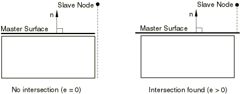

# 36.3.8 Extending master surfaces and slide lines


**Product: **Abaqus/Standard  

##### **References**

- ["Defining contact pairs in Abaqus/Standard," Section 36.3.1](pt09ch36s03aus145.md)
- ["Common difficulties associated with contact modeling in Abaqus/Standard," Section 39.1.2](pt09ch39s01aus184.md)
- [*CONTACT PAIR](../key/key-link.md#usb-kws-hcontactpair)
- [*SLIDE LINE](../key/key-link.md#usb-kws-mslideline)

### Overview

Extending the master surface or a slide line:
- can prevent nodes from "falling off" or getting trapped behind the master surface (or slide line) in finite-sliding problems;
- allows the slave node to find a master surface when the slave node has no intersection with the master surface at the start of the analysis in small- and infinitesimal-sliding problems;
- can avoid numerical roundoff difficulties associated with contact modeling;
- should not be used in lieu of proper contact modeling techniques;
- should not be used to reduce the number of underlying elements of a contact surface;
- applies only at the perimeter of a master surface in three dimensions and at the ends of a master surface in two dimensions; and
- applies only to contact pairs that use a node-to-surface discretization.

### Extending the master surface for small-sliding, node-to-surface contact

If a slave node cannot find an intersection with the master surface at the start of the analysis, it will be free to penetrate the master surface because no local tangent plane will be formed. This type of problem, which typically occurs for node-to-surface contact when the slave node is aligned with the end or perimeter of the master surface (which does not wrap around the corner of the rectangular body), is illustrated in [Figure 36.3.8--1](pt09ch36s03aus152.md#aextsurf-small-slide) and may be caused by numerical roundoff errors when a preprocessor is used to generate the nodal coordinates. There are no extensions to master faces in the interior of a surface. If the master surface in [Figure 36.3.8--1](pt09ch36s03aus152.md#aextsurf-small-slide) were defined such that it wrapped around the corner of the body, no extensions to the master surface would be required because the slave node would project onto the master surface using the projection method discussed in ["Using the small-sliding tracking approach" in "Contact formulations in Abaqus/Standard," Section 38.1.1](pt09ch38s01aus177.md#usb-cni-acontactpairform-smsliding). Cases such as that shown in [Figure 36.3.8--1](pt09ch36s03aus152.md#aextsurf-small-slide) are not problematic for the small-sliding, surface-to-surface formulation because the constraint formulation considers the region of the slave surface near a slave node.

**Figure 36.3.8–1** Slave node fails to find an intersection with the master surface for small-sliding, node-to-surface contact if *e*=*0*.



For node-to-surface contact you can specify the size of the extension zone, *e*, as a fraction of the end segment or facet edge length (see [Figure 36.3.8--2](pt09ch36s03aus152.md#aextsurf-finite-slide)). If *e* is set to zero, Abaqus will not extend the ends. The value given must lie between 0.0 and 0.2. The default value is 0.1 for node-to-surface contact; surface extensions are not available for surface-to-surface contact.

| **Input File Usage: ** | ``` [*CONTACT PAIR](../key/key-link.md#usb-kws-hcontactpair), SMALL SLIDING, EXTENSION ZONE=*e* ``` |
| --- | --- |

**Figure 36.3.8–2** Definition of size of extension zone.


### Extending the master surface or slide line in finite-sliding, node-to-surface contact

To prevent slave nodes from “falling off” or getting trapped behind a master surface, an open surface or slide line can be extended beyond its perimeter edges (in three dimensions) or end nodes (in two dimensions) for finite-sliding, node-to-surface contact.

You can specify the size of the extension zone, *e*, as a fraction of the end segment or facet edge length (see [Figure 36.3.8--2](pt09ch36s03aus152.md#aextsurf-finite-slide)). The geometry in the extension zone is extrapolated from the end segment or facet edge. If *e* is set to zero, Abaqus/Standard will not extend the ends. The value given must lie between 0.0 and 0.2. The default value is 0.1 for node-to-surface contact. Surface extensions are not available for surface-to-surface contact; for finite-sliding, surface-to-surface contact, constraints are located within slave faces, and “falling off” will not occur until nearly the entire slave facet slides off the master surface. Extensions for finite-sliding, node-to-surface contact should be considered only if other modeling techniques to prevent “falling off” are not feasible and when the slave node is expected to travel in the extended zone for a short period of the solution phase or during nonconverged iterations.

| **Input File Usage: ** | Use either of the following options: |
| --- | --- |
|  | ``` [*CONTACT PAIR](../key/key-link.md#usb-kws-hcontactpair), EXTENSION ZONE=*e* [*SLIDE LINE](../key/key-link.md#usb-kws-mslideline), ELSET=*element_set_name*, EXTENSION ZONE=*e* ``` |


