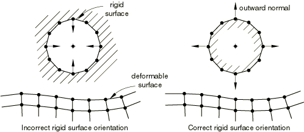
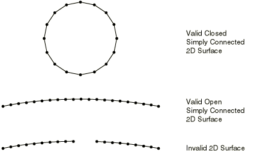

# 36.5.1 Defining contact pairs in Abaqus/Explicit


**Products: **Abaqus/Explicit  Abaqus/CAE  

##### **References**

- ["Element-based surface definition," Section 2.3.2](pt01ch02s03aus17.md)
- ["Node-based surface definition," Section 2.3.3](pt01ch02s03aus18.md)
- ["Analytical rigid surface definition," Section 2.3.4](pt01ch02s03aus19.md)
- ["Contact interaction analysis: overview," Section 36.1.1](pt09ch36s01abo33.md)
- [*CONTACT CONTROLS](../key/key-link.md#usb-kws-hcontactcontrols)
- [*CONTACT PAIR](../key/key-link.md#usb-kws-hcontactpair)
- [*SURFACE](../key/key-link.md#usb-kws-msurface)
- ["Defining surface-to-surface contact," Section 15.13.7 of the Abaqus/CAE User's Guide](../usi/usi-link.md#usi-itn-help-surftosurf)
- ["Defining self-contact," Section 15.13.8 of the Abaqus/CAE User's Guide](../usi/usi-link.md#usi-itn-help-self)

### Overview

Abaqus/Explicit provides two algorithms for modeling contact and interaction problems: the general contact algorithm and the contact pair algorithm. See ["Contact interaction analysis: overview," Section 36.1.1](pt09ch36s01abo33.md), for a comparison of the two algorithms. This section describes how to define contact pairs with surfaces for contact simulations in Abaqus/Explicit.

Contact pairs in Abaqus/Explicit: 
- are part of the history definition of the model and can be created, modified, and removed from step to step (unlike Abaqus/Standard, where contact pairs are model data);
- use sophisticated tracking algorithms to ensure that proper contact conditions are enforced efficiently;
- can be used simultaneously with the general contact algorithm (i.e., some interactions can be modeled with contact pairs, while others are modeled with the general contact algorithm);
- can be formed using a pair of rigid or deformable surfaces or a single deformable surface;
- do not have to use surfaces with matching meshes;
- cannot be formed with one two-dimensional surface and one three-dimensional surface; and
- cannot be used for self-contact where the surface is composed of both first-order elements and second-order elements.

### Defining a contact pair interaction

The definition of a contact pair interaction in Abaqus/Explicit consists of specifying:
- the contact pair algorithm and the surfaces that interact with one another, as described in this section;
- the contact surface properties (["Assigning surface properties for contact pairs in Abaqus/Explicit," Section 36.5.2](pt09ch36s05aus161.md));
- the mechanical contact property models (["Assigning contact properties for contact pairs in Abaqus/Explicit," Section 36.5.3](pt09ch36s05aus162.md));
- the contact formulation (["Contact formulations for contact pairs in Abaqus/Explicit," Section 38.2.2](pt09ch38s02aus181.md));
- the contact constraint enforcement method (["Contact constraint enforcement methods in Abaqus/Explicit," Section 38.2.3](pt09ch38s02aus182.md)); and
- the algorithmic contact controls (["Common difficulties associated with contact modeling using contact pairs in Abaqus/Explicit," Section 39.2.2](pt09ch39s02aus186.md)).

### Defining a contact pair containing two surfaces

To define a contact pair, you must indicate which pairs of surfaces will interact with each other. The order in which the surfaces are specified is important only when a nondefault weighting factor is specified (see ["Contact surface weighting" in "Contact formulations for contact pairs in Abaqus/Explicit," Section 38.2.2](pt09ch38s02aus181.md#usb-cni-acontactpair-exppair), for details). See ["Element-based surface definition," Section 2.3.2](pt01ch02s03aus17.md); ["Node-based surface definition," Section 2.3.3](pt01ch02s03aus18.md); and ["Analytical rigid surface definition," Section 2.3.4](pt01ch02s03aus19.md), for information on defining surfaces for use in contact pairs.

| **Input File Usage: ** | ``` [*CONTACT PAIR](../key/key-link.md#usb-kws-hcontactpair) *surface_1_name*, *surface_2_name* ``` |
| --- | --- |

| **Abaqus/CAE Usage: ** | Interaction module: **Create Interaction**: **Surface-to-surface contact (Explicit)**: select the first surface, click **Surface**, select the second surface |
| --- | --- |

### Defining self-contact

Define contact between a single surface and itself by specifying only a single surface or by specifying the same surface twice.

| **Input File Usage: ** | Use either of the following options: |
| --- | --- |
|  | ``` [*CONTACT PAIR](../key/key-link.md#usb-kws-hcontactpair) *surface_1,* [*CONTACT PAIR](../key/key-link.md#usb-kws-hcontactpair) *surface_1, surface_1* ``` |

| **Abaqus/CAE Usage: ** | Interaction module: **Create Interaction**: **Self-contact (Explicit)**: select the surface or **Surface-to-surface contact (Explicit)**: select the surface, click **Surface**, select the surface again |
| --- | --- |

#### Limitations with self-contact

The following limitations are enforced for a contact pair with self-contact:
- The balanced master-slave contact algorithm will always be used for the contact pair (a nondefault weighting factor cannot be specified for the contact pair).
- A contact thickness must be considered for self-contact surfaces on shell or membrane elements (see ["Element-based surface definition," Section 2.3.2](pt01ch02s03aus17.md)); i.e., a zero surface thickness (see ["Forcing zero surface thickness and offset" in "Assigning surface properties for contact pairs in Abaqus/Explicit," Section 36.5.2](pt09ch36s05aus161.md#usb-cni-acontactpairsurfaces-nothick)) causes Abaqus/Explicit to issue an error message. By default, the contact thickness is equal to the current thickness.
- The contact thickness for self-contact should not exceed the edge lengths or diagonal lengths of the facets. You can reduce the contact thickness, if necessary; see ["Controlling the effects of surface thickness and offset in contact calculations" in "Assigning surface properties for contact pairs in Abaqus/Explicit," Section 36.5.2](pt09ch36s05aus161.md#usb-cni-acontactpairsurfaces-controlthick).
- A specialized finite-sliding tracking algorithm must be used. The use of the small-sliding contact formulation is not supported and causes Abaqus/Explicit to issue an error message.
- Contact will be recognized between any node on a self-contact surface and any other point on the same surface, including either side of shells or membranes (i.e., self-contact on shells and membranes is independent of the face identifier specified in the surface definition).

### Removing and adding contact pairs

Removal and addition of contact pairs:
- can be used to simulate complicated forming processes where multiple tools need to interact with the workpiece at different stages;
- can be used to extend surfaces to prevent one surface from sliding off another;
- can result in significant computational savings by eliminating unnecessary contact searches; and
- can be used to change the definition of a contact pair.

#### Adding contact pairs

By default, the contact pairs specified are added to the list of active contact pairs in the model.

Initial penetrations should be avoided for contact pairs introduced after the first step, as large nodal accelerations and severe element distortions can result (see ["Adjusting initial surface positions and specifying initial clearances for contact pairs in Abaqus/Explicit," Section 36.5.4](pt09ch36s05aus163.md)). Redefining a contact pair by deleting it and adding it in the same step can also lead to problems, because the “state” information associated with the slave nodes in contact will be reinitialized. For example, a penalty contact slave node with a penetration past the midsurface of a double-sided master surface would be allowed to pass through the master surface if the contact state were reinitialized.

| **Input File Usage: ** | ``` [*CONTACT PAIR](../key/key-link.md#usb-kws-hcontactpair), OP=ADD ``` |
| --- | --- |

| **Abaqus/CAE Usage: ** | Interaction module: **Create Interaction** |
| --- | --- |

#### Removing contact pairs

Removal of contact pairs is a useful technique for simulating complicated forming processes where multiple tools will contact the same workpiece. Removing a contact pair once it is no longer needed eliminates the need to monitor the contact conditions and reduces the cost of the simulation.

| **Input File Usage: ** | ``` [*CONTACT PAIR](../key/key-link.md#usb-kws-hcontactpair), OP=DELETE ``` |
| --- | --- |

| **Abaqus/CAE Usage: ** | Interaction module: interaction manager: **Deactivate** |
| --- | --- |

### General restrictions on surfaces used in contact pairs

The following general restrictions (in addition to those discussed in ["Element-based surface definition," Section 2.3.2](pt01ch02s03aus17.md)) apply to all surfaces used in contact pairs:
- The surface normals of a surface must point toward the other surface that it may contact except when the surface is double-sided, as discussed below.
- Element-based surfaces should not be used in contact pairs if the underlying elements may fail (see ["Dynamic failure models," Section 23.2.8](pt05ch23s02abm24.md), for more information). Use general contact (["Defining general contact interactions in Abaqus/Explicit," Section 36.4.1](pt09ch36s04aus155.md)) or node-based surfaces (["Node-based surface definition," Section 2.3.3](pt01ch02s03aus18.md)) in such cases.
- The surface must be continuous, as discussed below.
- Continuum and structural elements cannot be mixed in the same surface definition.
- Deformable elements cannot be combined with elements that are part of a rigid body to define a single surface.

These restrictions do not apply to surfaces used with the general contact algorithm (["Defining general contact interactions in Abaqus/Explicit," Section 36.4.1](pt09ch36s04aus155.md)).

The following restrictions apply to the surfaces forming a kinematic contact pair:
- Rigid surfaces must always be the master surface.
- Slave surfaces must be part of a deformable body.
- A node-based surface can be used only as a slave surface.

The following restrictions apply to the surfaces forming a penalty contact pair:- Analytical rigid surfaces must always be the master surface.
- A node-based surface can be used only as a slave surface.

#### Orienting the surface's normal

The orientation of a surface's normal can be critical for the proper detection of contact between two contacting surfaces. At the point of closest proximity the normals of a single-sided master surface forming the contact pair should always point toward the slave surface. If, in the initial configuration of the model, a single-sided master surface's normal points away from its slave surface, Abaqus/Explicit will detect that the slave surface penetrates the master surface. Abaqus/Explicit will attempt to resolve this initial overclosure of the contact pair with strain-free displacements before the start of the simulation (see ["Adjusting initial surface positions and specifying initial clearances for contact pairs in Abaqus/Explicit," Section 36.5.4](pt09ch36s05aus163.md)). Abaqus/Explicit may have difficulty with the simulation if the overclosure is too severe. In most of these cases the analysis will terminate immediately, and an error message about severely distorted elements will be issued.

You must give particular attention to checking that analytical rigid surfaces or single-sided surfaces created on shell, membrane, or rigid elements have the proper orientation. Surface orientation errors can often be quickly and easily detected by running a data check analysis (["Abaqus/Standard, Abaqus/Explicit, and Abaqus/CFD execution," Section 3.2.2](pt01ch03s02abx02.md)) and inspecting the deformed configuration in Abaqus/CAE. If large displacements have occurred, they may be due to an incorrect surface orientation.

The proper and improper orientation of a rigid and deformable surface is shown in [Figure 36.5.1--1](pt09ch36s05aus160.md#asurfover-exp-good-bad-rigid).

**Figure 36.5.1–1** Example of proper and improper surface orientation with a rigid surface.



It is not necessary for the normals of all of the underlying shell or membrane elements to have a consistent positive orientation for a double-sided surface: if possible, Abaqus/Explicit will define the surface such that its facets have consistent normals, even if the underlying elements do not have consistent normals. The facet normals will be the same as the element normals if the element normals are all consistent; otherwise, an arbitrary positive orientation is chosen for the surface. For double-sided surfaces the positive orientation is significant only with respect to the sign of the contact pressure output variable, CPRESS, as discussed in ["Element-based surface definition," Section 2.3.2](pt01ch02s03aus17.md).

#### Defining a continuous surface

A contact pair surface cannot be made up of two or more disconnected regions. The definition of analytical rigid surfaces automatically ensures that these surfaces are continuous. However, care must be taken to define surfaces formed with elements so that they are continuous across element edges in three-dimensional models or through nodes in two-dimensional models. This continuity requirement has several implications for what constitutes a valid or invalid surface definition. In two dimensions the surface must be either a simple, nonintersecting curve with two terminal ends or a closed loop. [Figure 36.5.1--2](pt09ch36s05aus160.md#asurfover-exp-good-bad-2d) shows examples of valid and invalid two-dimensional surfaces for use in contact pairs.

**Figure 36.5.1–2** Valid and invalid 2D surfaces.



In three dimensions an edge of an element face belonging to a valid surface may be either on the perimeter of the surface or shared by one other face. Two element faces forming a contact pair surface cannot be joined just at a shared node; they must be joined across a common element edge. An element edge cannot be shared by more than two surface facets. [Figure 36.5.1--3](pt09ch36s05aus160.md#asurfover-exp-good-bad-3d) illustrates valid and invalid three-dimensional surfaces for use in contact pairs.

**Figure 36.5.1–3** Valid and invalid 3D surfaces.


The continuity requirement applies to both automatically generated free surfaces and surfaces defined with element face identifiers (see ["Element-based surface definition," Section 2.3.2](pt01ch02s03aus17.md)). [Figure 36.5.1--4](pt09ch36s05aus160.md#aexpsurfover-auto-free-surf) shows an automatically generated free surface resulting from the specification of an element set consisting of two disjointed groups of elements. The resulting surface is not continuous since it is composed of two disjoint open curves.

**Figure 36.5.1–4** Automatic free surface generation.


### Restrictions for two-dimensional contact simulations

The following restrictions apply when defining a contact simulation for two-dimensional (planar) or axisymmetric problems:
- A contact pair cannot involve a planar surface and an axisymmetric surface. This restriction applies only to deformable and element-based rigid surfaces.
- Defining a contact pair that contains two surfaces formed by planar elements of different sizes in the out-of-plane direction ("depth") is not recommended and will result in a warning message. In such a case frictional stresses are calculated based on a weighted average depth, with the weighting for the first surface equal to the user-specified contact surface weighting factor. The out-of-plane thickness for two-dimensional beam element-based surfaces is always assumed to be one. As a result, the contact pressure acting on such a surface can be considered as a line force as well.
- When more than one contact pair involves contact between the same rigid surface formed by planar elements and different planar deforming surfaces, the deforming surfaces must all have the same depth; otherwise, a warning message will be issued. The depth value used for calculating contact stresses will then be taken from one of these deforming surfaces, but this choice cannot be predicted.

### Limitations in contact simulations with three-dimensional beam and truss elements

Element-based surfaces cannot be formed on three-dimensional beam or truss elements, so node-based surfaces must be used to define a surface on these elements. Because a node-based surface must be used, a surface on three-dimensional beam or truss elements must always form the slave surface in a pure master-slave contact pair. Therefore, it is not possible to have two three-dimensional beam or truss structures contact each other.

### Output

You can write the contact surface variables associated with the interaction of contact pairs to the Abaqus output database (`.odb`) file. The surface variables for a mechanical contact analysis include contact pressure and force, frictional shear stress and force, relative tangential motion (slip) of the surfaces during contact, whole surface resultant quantities (i.e., force, moment, center of pressure, and total area in contact), the status of bonded nodes, and the maximum torque transmitted about the *z*-axis of axisymmetric elements.

Additional discussion on requesting contact surface output can be found in ["Surface output in Abaqus/Standard and Abaqus/Explicit" in "Output to the output database," Section 4.1.3](pt02ch04s01aus40.md#usb-out-odboutput-surface). Output from thermal interactions is discussed in ["Thermal contact properties," Section 37.2.1](pt09ch37s02aus174.md).

#### Field output

The generic variables CSTRESS, CFORCE, FSLIP, and FSLIPR are valid field output requests for Abaqus/Explicit. If CSTRESS is requested for a contact pair, the variables CPRESS (contact pressure), CSHEAR1 (contact traction in the local 1-direction), and, if the contact interaction is three-dimensional, CSHEAR2 (contact traction in the local 2-direction) can be contoured in Abaqus/CAE for each discrete (i.e., non-analytical) surface in a contact pair.

Contours of contact pressure (CPRESS) on surfaces used with the contact pair algorithm will be displayed using the convention that a positive pressure represents compressive contact on the positive side of the surface. The positive side of the surface can be determined by drawing the surface normals in the Visualization module of Abaqus/CAE. Following this convention, the sign of CPRESS will be reversed for contact on the negative (back) side of a double-sided surface, so negative values of CPRESS may be seen if contact occurs on the back side of a double-sided surface. If contact from separate contact pairs occurs on both sides of the double-sided surface at the same point, the value of CPRESS is given for each contact pair separately.

If CFORCE is requested for a contact pair, the variables CNORMF (normal contact force) and CSHEARF (shear contact force) can be plotted as vectors in a symbol plot in Abaqus/CAE for each discrete (i.e., non-analytical) surface in a contact pair.

If FSLIPR is requested, FSLIPR (the magnitude of the slip rate for slave nodes in contact) can be contoured in Abaqus/CAE for each slave surface in a contact pair. In addition, for three-dimensional contact interactions involving an analytical rigid surface and for all two-dimensional contact interactions, components of net slip rate based on local tangent directions (FSLIPR1 and, in three dimensions, FSLIPR2) can also be contoured in Abaqus/CAE for each slave surface in a contact pair if FSLIPR is requested. All of the slip rate variables associated with FSLIPR are zero whenever a slave node is not in contact.

If FSLIP is requested, FSLIPEQ (the length of the overall slip path for a slave node while it is in contact) can be contoured in Abaqus/CAE for each slave surface in a contact pair. In addition, for three-dimensional contact interactions involving an analytical rigid surface and for all two-dimensional contact interactions, components of net slip (FSLIP1 and, in three dimensions, FSLIP2) can also be contoured in Abaqus/CAE for each slave surface in a contact pair if FSLIP is requested. These slip variables are equivalent to the slip rate variables integrated over time: FSLIPEQ, FSLIP1, and FSLIP2 are equivalent to FSLIPR, FSLIPR1, and FSLIPR2 integrated over time, respectively. Therefore, these slip variables account only for relative motions that occur while slave nodes are in contact.

#### History output

Several whole surface contact variables are available as history output. These variables record the contact state of a surface as a set of force (CFN, CFS, and CFT) and moment (CMN, CMS, and CMT) resultants with respect to the origin. Additional variables give the center of pressure (XN, XS, and XT) on the surface (defined as the point closest to the centroid of the surface that lies on the line of action of the resultant force for which the resultant moment is minimal). The last letter of each variable name (except the variable CAREA) denotes which contact force distribution on the surface is used to calculate the resultant: the letter N denotes that the normal contact forces are used to derive the resultant quantity; the letter S denotes that the shear contact forces are used to derive the resultant quantity; and the letter T denotes that the sum of the normal and shear contact forces are used to derive the resultant quantity. These history output variables will be written twice to the output database once for each surface involved in the contact pair.

Each total moment output variable will not necessarily equal the cross product of the respective center of force vector and resultant force vector. Forces acting on two different nodes of a surface may have components acting in opposite directions, such that these nodal force components generate a net moment but not a net force; therefore, the total moment may not arise entirely from the resultant force. The center of force output variables tend to be most meaningful when the surface nodal forces act in approximately the same direction.

The total area in contact at a given time can be requested using output variable CAREA, defined as the sum of all the facets where there is contact force. The contact area reported by CAREA is generally slightly larger than the true contact area for reasonably meshed contact surfaces; therefore, interpretation of CAREA should be done with care. The discrepancy between the CAREA output and the true contact area decreases as the mesh density increases. Using contact inclusions or exclusions to limit CAREA output to smaller contact surfaces may also reduce the discrepancy in some cases. Since the CAREA output is an approximation of the true contact area, deriving force or stress values using this output may not yield accurate values; requesting contact force and stress directly is the most appropriate way to obtain accurate results.

Detailed history output on the status of bonded surfaces is available from an Abaqus/Explicit simulation. Details can be found in ["Breakable bonds," Section 37.1.9](pt09ch37s01aus173.md).

#### Obtaining the "maximum torque" that can be transmitted about the *z*-axis in an axisymmetric analysis

When modeling surface-based contact with axisymmetric (CAX) elements, Abaqus/Explicit can calculate the maximum torque (output variable CTRQ) that can be transmitted about the *z*-axis. The maximum torque, *T*, is defined as 


where *p* is the pressure transmitted across the interface, *r* is the radius to a point on the interface, and *s* is the current distance along the interface in the *r*–*z* plane. This definition of “torque” effectively assumes a friction coefficient of unity.


