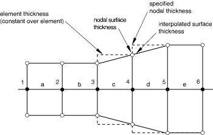
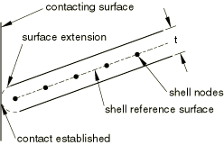
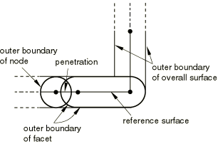

# 36.5.2 Assigning surface properties for contact pairs in Abaqus/Explicit


**Products: **Abaqus/Explicit  Abaqus/CAE  

##### **References**

- ["Defining contact pairs in Abaqus/Explicit," Section 36.5.1](pt09ch36s05aus160.md)
- [*CONTACT PAIR](../key/key-link.md#usb-kws-hcontactpair)
- [*SURFACE](../key/key-link.md#usb-kws-msurface)
- ["Specifying geometric properties for mechanical contact property options" in "Defining a contact interaction property," Section 15.14.1 of the Abaqus/CAE User's Guide](../usi/usi-link.md#usi-itn-help-prop-contact-mech-geometric)

### Overview

This section describes how to modify the surface properties for contact interactions in Abaqus/Explicit defined with the contact pair algorithm, including the surface thickness and offset.

### Shell, membrane, or rigid element thickness and shell or rigid element offset

To define surfaces on shell, membrane, or rigid elements such that they are in contact at the start of the analysis, the element thicknesses must be considered when defining the nodal coordinates; otherwise, the surfaces in the contact pair will be overclosed. Surface thickness and surface offset are properties that are inherited from underlying shell and membrane elements by default. For a surface based on rigid elements, the default surface thickness and offset correspond to the thickness and offset defined for the rigid body to which the elements belong (see ["Rigid elements," Section 30.3.1](pt06ch30s03alm23.md)). The surface thickness and offset are zero for surfaces based on solid elements.

By default, the nodal thickness for surfaces based on shell, membrane, or rigid elements equals the minimum thickness of the surrounding elements (see [Figure 36.5.2--1](pt09ch36s05aus161.md#adefsurf-cont-thick1) and [Table 36.5.2--1](pt09ch36s05aus161.md#table-adefsurf-thick1)). The surface thickness within a facet is interpolated from the nodal values; the interpolated surface thickness never extends past the specified element or nodal thickness, which may be significant with respect to initial overclosures.

If a spatially varying nodal thickness is defined for the underlying elements (see ["Nodal thicknesses," Section 2.1.3](pt01ch02s01aus07.md)), the nodal surface thickness may not correspond exactly to the specified nodal thickness (see node 4 in [Figure 36.5.2--2](pt09ch36s05aus161.md#adefsurf-cont-thick2) and [Table 36.5.2--2](pt09ch36s05aus161.md#table-adefsurf-thick2)). The nodal surface thickness distribution will tend to be more diffuse than the specified nodal thickness distribution (because the specified nodal thicknesses are averaged to compute the element thicknesses, and the minimum of the surrounding element thicknesses is the nodal surface thickness).

Effects of surface thickness and offsets, as well as methods for modifying the surface thickness and for avoiding surface offsets, are discussed below.

**Figure 36.5.2–1** Continuous variation of surface thickness across facet boundaries.


**Table 36.5.2–1** Thicknesses corresponding to [Figure 36.5.2--1](pt09ch36s05aus161.md#adefsurf-cont-thick1).
| node | element | specified element thickness | nodal surface thickness (minimum of adjacent element thicknesses) |
| --- | --- | --- | --- |
| 1 |  |  | 0.5 |
|  | a | 0.5 |  |
| 2 |  |  | 0.5 |
|  | b | 0.5 |  |
| 3 |  |  | 0.5 |
|  | c | 0.9 |  |
| 4 |  |  | 0.9 |
|  | d | 0.9 |  |
| 5 |  |  | 0.9 |

**Figure 36.5.2–2** Small discrepancy between the nodal surface thickness and the specified nodal thickness.



**Table 36.5.2–2** Thicknesses corresponding to [Figure 36.5.2--2](pt09ch36s05aus161.md#adefsurf-cont-thick2).
| node | element | specified nodal thickness | element thickness (average of specified nodal thickness) | nodal surface thickness (minimum of adjacent element thicknesses) |
| --- | --- | --- | --- | --- |
| 1 |  | 0.5 |  | 0.5 |
|  | a |  | 0.5 |  |
| 2 |  | 0.5 |  | 0.5 |
|  | b |  | 0.5 |  |
| 3 |  | 0.5 |  | 0.5 |
|  | c |  | 0.7 |  |
| 4 |  | 0.9 |  | 0.7 |
|  | d |  | 0.9 |  |
| 5 |  | 0.9 |  | 0.9 |
|  | e |  | 0.9 |  |
| 6 |  | 0.9 |  | 0.9 |

#### Effects of surface thickness and offsets

Accounting for thickness in the contact pair algorithm will cause the surface to extend past the parent element boundary in the plane of the element by an amount equal to one-half its thickness. For example, this surface extension, which is semi-circular in shape, will cause contact to be established between the edge of a shell and an opposing surface before the node on the shell boundary reaches the opposing surface. The extension is present for both single-sided and double-sided surfaces. [Figure 36.5.2--3](pt09ch36s05aus161.md#adefsurf-edge-contact) demonstrates this concept. Such “bull-nose” extensions are avoided when the general contact algorithm (["Defining general contact interactions in Abaqus/Explicit," Section 36.4.1](pt09ch36s04aus155.md)) is used. The effect of a shell or rigid offset on a surface is shown in [Figure 36.5.2--4](pt09ch36s05aus161.md#adeform-offset1). Poorly defined surfaces can result near corners if large offsets are present, as shown in [Figure 36.5.2--5](pt09ch36s05aus161.md#adeform-offset2). You should consider this when defining a model. A warning message will be issued if the offset magnitude is greater than one-half of any of the parent shell element edge lengths. However, at acute corners it is possible for an offset less than one-half of the parent element size to result in a poorly defined contact surface (and in this case no warning will be given).

**Figure 36.5.2–3** Extension of contact surface for edge contact without zero surface thickness.



**Figure 36.5.2–4** Extension of contact surface if a shell offset is present.


**Figure 36.5.2–5** Example of a poorly defined surface near a corner when a large shell offset is present.


#### Controlling the effects of surface thickness and offset in contact calculations

You can control the thickness and offset used in the contact calculations only; they do not affect surface-based constraints. These settings are intended primarily for self-contact surfaces since you cannot force zero thickness for these surfaces, as described below.

Self-contact surfaces should not contain facets that are thicker than their edge or diagonal lengths. Extremely large thicknesses will cause nodes to appear to be penetrating nearby facets in even a flat self-contact surface due to the algorithmic use of a semi-circular tube with a radius of half the contact thickness around the edge of each facet (see [Figure 36.5.2--6](pt09ch36s05aus161.md#adeform-offset4)).

**Figure 36.5.2–6** Undesired penetration resulting from a large thickness in a self-contact surface.



You can scale the effective thickness used for all of the facets on a surface by a single factor, *f*. Alternatively, you can adjust only the thicknesses for surface facets in which the thickness to minimum edge or diagonal length ratio exceeds a specified value, *r*; the amount by which a facet thickness is adjusted may vary during an analysis because of changes in the facet size. If the thickness to element size ratio exceeds 1.0 in the initial configuration for a self-contact surface, an error message recommending that you adjust the thickness will be issued.

You should not specify extremely small values for *f* or *r* for double-sided surfaces or surfaces that will be involved in self-contact since these surfaces must have a contact thickness that is significant compared to the facet size. For surfaces involved only in two-surface contact it is acceptable to set *f*=0.0; however, it is computationally more efficient to use the method described below to force a zero surface thickness. It is also possible to enforce the offset but not the thickness in the surface model by setting the scale factor, *f*, equal to zero.

| **Input File Usage: ** | Use the following option to scale the surface thickness by a single factor: |
| --- | --- |
|  | ``` [*SURFACE](../key/key-link.md#usb-kws-msurface), NAME=*name*, SCALE THICK=*f* ``` Use the following option to adjust the thickness to element size ratios: ``` [*SURFACE](../key/key-link.md#usb-kws-msurface), NAME=*name*, MAX RATIO=*r* ``` |

| **Abaqus/CAE Usage: ** | You cannot scale the thickness of a contact surface in Abaqus/CAE. |
| --- | --- |

#### Forcing zero surface thickness and offset

You can force the surface thickness and offset to be zero, rather than inherit the thickness and offset of underlying shell, membrane, or rigid elements. In this case the contact surface is taken as the reference surface (see [Figure 36.5.2--7](pt09ch36s05aus161.md#adeform-no-thick)). 

**Figure 36.5.2–7** Contact surface with zero thickness and offset.


You cannot ignore the thickness for a surface that is used as a contact surface for single-surface (self) contact. If one of the surfaces in a contact pair is a double-sided surface, zero thickness can be forced on only one of the two surfaces: at least one surface in a contact pair involving double-sided surfaces must have a nonzero thickness. The ability to force zero surface thickness is useful for performing parameter studies on the thickness or offset of a model since you can change the thickness and offset without also having to move the mesh to control the initial separation between the surfaces.

| **Input File Usage: ** | ``` [*SURFACE](../key/key-link.md#usb-kws-msurface), NAME=*name*, NO THICK ``` |
| --- | --- |

| **Abaqus/CAE Usage: ** | You cannot force a surface thickness to be zero in Abaqus/CAE. |
| --- | --- |

##### Example

Contact calculations are generally most accurate with the default treatment of thickness and offset. However, when a shell offset of half the original shell thickness has been specified, forcing zero surface thickness will give an accurate representation of one side of the surface. This approach can be more accurate near a corner (especially on the exterior side of a corner) than if the offset and thickness are enforced for the surface, as shown in [Figure 36.5.2--8](pt09ch36s05aus161.md#adeform-offset3).

**Figure 36.5.2–8** Forcing zero surface thickness when the shell offset is half the original shell thickness.


#### Forcing zero surface offset

For situations in which it is desirable to ignore the effect of the offset but when it is still necessary to model the thickness in the contact calculations, you can force only the surface offset to be zero without affecting the surface thickness. In this case the contact surface is the outside surface of an imaginary shell, membrane, or rigid element whose midsurface is at the reference surface (see [Figure 36.5.2--9](pt09ch36s05aus161.md#adeform-no-offset)). 

**Figure 36.5.2–9** Contact surface with zero offset.


This method could be used for a self-contact surface that would be poorly defined if the offset were enforced (thickness must be enforced for self-contact surfaces). 

| **Input File Usage: ** | ``` [*SURFACE](../key/key-link.md#usb-kws-msurface), NAME=*name*, NO OFFSET ``` |
| --- | --- |

| **Abaqus/CAE Usage: ** | You cannot force a surface offset to be zero in Abaqus/CAE. |
| --- | --- |

### Defining additional contact thicknesses for a contact pair interaction

You can specify a contact offset for a contact pair interaction in addition to any element thicknesses or midsurface offsets already defined for the elements underlying the contact pair surfaces. For small sliding this includes contact offsets defined by initial clearances (see ["Specifying initial clearance values precisely" in "Adjusting initial surface positions and specifying initial clearances for contact pairs in Abaqus/Explicit," Section 36.5.4](pt09ch36s05aus163.md#usb-cni-aexpadjustsurfaces-clearance)). The specified offset value will be applied as an additional thickness of a layer separating the two surfaces, not as an additional thickness for each surface in the contact pair. This value can be positive or negative. This technique is often used in conjunction with softened behavior (see ["Contact pressure-overclosure relationships," Section 37.1.2](pt09ch37s01aus166.md)) to model the thickness of a thin layer between two contacting surfaces.

| **Input File Usage: ** | ``` [*SURFACE INTERACTION](../key/key-link.md#usb-kws-hsurfaceinteraction), PAD THICKNESS=*value* ``` |
| --- | --- |

| **Abaqus/CAE Usage: ** | Interaction module: contact property editor: ****Mechanical****Geometric Properties****: toggle on **Thickness of interfacial layer (Explicit):** *value* |
| --- | --- |


