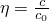

# 37.1.3 Contact damping


**Products: **Abaqus/Standard  Abaqus/Explicit  Abaqus/CAE  

##### **References**

- ["Mechanical contact properties: overview," Section 37.1.1](pt09ch37s01aus165.md)
- [*CONTACT DAMPING](../key/key-link.md#usb-kws-hcontactdamping)
- ["Creating interaction properties," Section 15.12.2 of the Abaqus/CAE User's Guide](../usi/usi-link.md#usi-itn-helptopic-createprop)

### Overview

Contact damping:
- can be defined to oppose the relative motion between the interacting surfaces (in addition to the contact pressure-overclosure relationships discussed in ["Contact pressure-overclosure relationships," Section 37.1.2](pt09ch37s01aus166.md), and the friction models discussed in ["Frictional behavior," Section 37.1.5](pt09ch37s01aus169.md));
- can affect both the motion normal and tangential to the surfaces;
- in the normal direction is proportional to the relative velocity between the surfaces;
- in the tangential direction is proportional to the relative tangential velocity in Abaqus/Standard and to the "elastic slip rate" associated with friction (see ["Frictional behavior," Section 37.1.5](pt09ch37s01aus169.md), for a discussion of elastic slip) in Abaqus/Explicit---hence, in Abaqus/Explicit it does not resist the bulk of tangential sliding;
- is not applicable for linear perturbation procedures;
- in Abaqus/Standard it contributes to the force and stiffness definition and should generally be used only when it is otherwise impossible to obtain a solution---the best method for allowing a viscous pressure and shear stress to be transmitted between the contact surfaces in Abaqus/Standard to reduce convergence difficulties due to the sudden violation of contact constraints (common in some snap-through and buckling problems involving contact) is to specify the damping on a step-by-step basis using contact controls, as discussed in ["Automatic stabilization of rigid body motions in contact problems" in "Adjusting contact controls in Abaqus/Standard," Section 36.3.6](pt09ch36s03aus150.md#usb-cni-acontacttrouble-stabilize); and
- can be useful in Abaqus/Explicit to reduce solution noise---a small amount of viscous contact damping is used by default for softened contact and penalty contact in Abaqus/Explicit, as discussed below.

### Defining viscous contact damping for relative motions of surfaces

In Abaqus/Standard the damping coefficient, , is a function of surface clearance, as shown in [Figure 37.1.3--1](pt09ch37s01aus167.md#anormal-viscous-damp). The damping coefficient is defined as a proportionality constant with units of pressure divided by velocity.

**Figure 37.1.3–1** Damping coefficient-clearance relationship for viscous damping in Abaqus/Standard.


In Abaqus/Explicit the damping coefficient will remain at the specified constant value while the surfaces are in contact and at zero otherwise. The damping coefficient can be defined as a proportionality constant with units of pressure divided by velocity or as a unitless fraction of critical damping.

To define viscous damping, you must include it in a contact property definition.

| **Input File Usage: ** | Use both of the following options for surface-based contact: |
| --- | --- |
|  | ``` [*SURFACE INTERACTION](../key/key-link.md#usb-kws-hsurfaceinteraction), NAME=*interaction_property_name* [*CONTACT DAMPING](../key/key-link.md#usb-kws-hcontactdamping) ``` Use both of the following options for element-based contact in Abaqus/Standard: ``` [*INTERFACE](../key/key-link.md#usb-kws-minterface) or [*GAP](../key/key-link.md#usb-kws-mgap), ELSET=*name* [*CONTACT DAMPING](../key/key-link.md#usb-kws-hcontactdamping) ``` |

| **Abaqus/CAE Usage: ** | Interaction module: contact property editor: ****Mechanical****Damping**** |
| --- | --- |
|  | Element-based contact is not supported in Abaqus/CAE. |

#### Damping and pressure-overclosure relationships

In Abaqus/Standard the viscous damping relationship can be used with any contact relationship (see ["Contact pressure-overclosure relationships," Section 37.1.2](pt09ch37s01aus166.md)). 

In Abaqus/Explicit contact damping is not available for hard kinematic contact. Softened kinematic contact and all penalty contact will have default damping in the form of a critical damping fraction with  = 0.03.

#### Specifying the damping coefficient such that the damping force is directly proportional to the rate of relative motion between the surfaces

You can specify damping directly in terms of the damping coefficient with units of pressure per velocity such that the damping forces will be calculated with , where *A* is the nodal area and  is the rate of relative motion between the two surfaces.

For contact involving element-based surfaces and for element-based contact (available only in Abaqus/Standard), the damping coefficient is specified in terms of contact pressure. For contact involving a node-based surface or nodal contact elements (such as GAP elements and ITT elements) for which an area or length dimension has not been defined,  must be specified as force per velocity. For slave surfaces on beam-type elements, specify  as force per unit length per velocity.

| **Input File Usage: ** | Use the following syntax in Abaqus/Standard: |
| --- | --- |
|  | ``` [*CONTACT DAMPING](../key/key-link.md#usb-kws-hcontactdamping), DEFINITION=DAMPING COEFFICIENT , ,  ``` Use the following syntax in Abaqus/Explicit: ``` [*CONTACT DAMPING](../key/key-link.md#usb-kws-hcontactdamping), DEFINITION=DAMPING COEFFICIENT  ``` |

| **Abaqus/CAE Usage: ** | Use the following syntax in Abaqus/Standard: |
| --- | --- |
|  | Interaction module: contact property editor: ****Mechanical****Damping****: **Definition: Damping coefficient**, **Linear** or **Bilinear**, **Damping Coeff.** , **Clearance** *c* and  (=0 for **Linear** and  for **Bilinear**) Use the following syntax in Abaqus/Explicit: Interaction module: contact property editor: ****Mechanical****Damping****: **Definition: Damping coefficient**, **Step**, **Damping Coeff.**  |

#### Specifying the damping coefficient as a fraction of critical damping in Abaqus/Explicit

In Abaqus/Explicit you can specify a unitless damping coefficient in terms of the fraction of critical damping associated with the contact stiffness; this method is not available in Abaqus/Standard. The damping forces will be calculated with , where *m* is the nodal mass,  is the nodal contact stiffness (in units of ), and  is the rate of relative motion between the two surfaces.

| **Input File Usage: ** | ``` [*CONTACT DAMPING](../key/key-link.md#usb-kws-hcontactdamping), DEFINITION=CRITICAL DAMPING FRACTION *critical damping fraction* ``` |
| --- | --- |

| **Abaqus/CAE Usage: ** | Interaction module: contact property editor: ****Mechanical****Damping****: **Definition: Critical damping fraction**, **Crit. Damping Fraction** *critical damping fraction* |
| --- | --- |

#### Specifying the tangential damping coefficient

You can specify the ratio of the tangential damping coefficient to the normal damping coefficient, also called the tangent fraction.

The tangential damping uses the same form of damping as the normal damping. Tangential damping can be specified only in conjunction with normal damping. If tangential damping is activated in Abaqus/Standard, the damping stress is proportional to the relative tangential velocity. In Abaqus/Explicit tangential damping will be ignored if hard kinematic contact is used in the tangential direction or if friction is not defined. As stated previously, damping in the tangential direction in Abaqus/Explicit is proportional to the elastic slip rate (see ["Frictional behavior," Section 37.1.5](pt09ch37s01aus169.md)) rather than the total rate of relative sliding.

For Abaqus/Standard the default value for the tangent fraction is 0.0; therefore, by default, the damping coefficient for the tangential direction is zero. For Abaqus/Explicit the default value for the tangent fraction is 1.0; therefore, by default, the damping coefficient for the tangential direction is equal to the damping coefficient for the normal direction. Furthermore, in Abaqus/Explicit softened contact and hard penalty contact have a default critical damping fraction of 0.03.

| **Input File Usage: ** | ``` [*CONTACT DAMPING](../key/key-link.md#usb-kws-hcontactdamping), TANGENT FRACTION=*value* ``` |
| --- | --- |

| **Abaqus/CAE Usage: ** | Interaction module: contact property editor: ****Mechanical****Damping****: **Tangent fraction:** **Specify value:** *value* |
| --- | --- |

### Choosing the appropriate coefficients for viscous damping in Abaqus/Standard

In Abaqus/Standard the appropriate magnitude for the local contact damping factor, , is problem-dependent. In some cases a simple calculation can be used to determine the magnitude; in other cases a reasonable value for  must be determined by trial and error. A reasonable value is one that has minimal impact on the solution prior to the unstable behavior in the model. A preliminary value can be found by looking at the contact pressures and velocities in the model before damping is added, as described below.

It may be difficult to determine the nodal velocities prior to the unstable behavior if output was not requested frequently. In such a situation the information in the message (`.msg`) file can be used to estimate the peak nodal velocity. By default, Abaqus/Standard provides the peak nodal displacement increment at every converged increment in this file. This displacement increment can be used along with the time increment to calculate a peak nodal velocity for the model. Although this velocity may not be very close to the actual relative velocity of the surfaces, it should be within an order of magnitude and is a reasonable value to use in calculating an initial viscous damping coefficient.

The maximum contact pressure between the surfaces also needs to be estimated. The viscous damping coefficient should then be set to a value that is a few orders of magnitude less than the ratio of the estimated maximum contact pressure over the calculated nodal velocity.

If it is not feasible to obtain the pressure and velocities as discussed above, a high damping value should be used initially and repeated analyses should be performed with smaller and smaller values. An appropriate value for  is one that is large enough to enable the analysis to get past any unstable response but not so large that the results at earlier or later times are affected significantly. ["Snap-through buckling analysis of circular arches," Section 1.2.1 of the Abaqus Example Problems Guide](../exa/exa-link.md#exa-sta-snapbuckling), demonstrates how the magnitude of the damping coefficient can be determined using the methods explained above.

The following example outlines how the value might be chosen for a typical case. Consider a simple modification to the two-dimensional Euler column buckling problem: add rigid surfaces parallel and on either side of the column so that the beam will contact the surfaces when it buckles. As the axial load is increased beyond the buckling load, the column will flatten out against the surface. Then, the midpoint of contact will lift off the surface and the beam will buckle into a higher mode. [Figure 37.1.3--2](pt09ch37s01aus167.md#anormal-euler-exa) shows this shape.

**Figure 37.1.3–2** Constrained Euler buckling example for viscous damping.


When the column first buckles, the contact force, *F*, that the column exerts on one of the rigid surfaces can be approximated as 


where *h* is the separation distance between the rigid surfaces, *l* is the beam length, *P* is the applied load, and  is the buckling load.

The approximation of the contact force entails the assumption that a single point comes into contact and that the shape of the buckled column does not change. The units of  are contact force per velocity, assuming that a node-based surface is used in this model. The velocity of the column, *v*, at the point of contact can be approximated as 


where  is the time increment. These estimates for the contact force and the column velocity give a value for the damping coefficient: 


This value can be used as a starting value, but different values should be tested.


