# 37.2.1 Thermal contact properties


**Products: **Abaqus/Standard  Abaqus/Explicit  Abaqus/CAE  

##### **References**

- ["Contact interaction analysis: overview," Section 36.1.1](pt09ch36s01abo33.md)
- ["User-defined interfacial constitutive behavior," Section 37.1.6](pt09ch37s01aus170.md)
- ["GAPCON," Section 1.1.10 of the Abaqus User Subroutines Reference Guide](../sub/sub-link.md#sub-rtn-ugapcon)
- [*GAP](../key/key-link.md#usb-kws-mgap)
- [*GAP CONDUCTANCE](../key/key-link.md#usb-kws-mgapconduct)
- [*GAP HEAT GENERATION](../key/key-link.md#usb-kws-mgapheatgener)
- [*GAP RADIATION](../key/key-link.md#usb-kws-mgapradiation)
- [*INTERFACE](../key/key-link.md#usb-kws-minterface)
- [*SURFACE INTERACTION](../key/key-link.md#usb-kws-hsurfaceinteraction)
- ["Creating interaction properties," Section 15.12.2 of the Abaqus/CAE User's Guide](../usi/usi-link.md#usi-itn-helptopic-createprop)

### Overview

Thermal interaction at the surface of a body:
- can be included in heat transfer problems (["Uncoupled heat transfer analysis," Section 6.5.2](pt03ch06s05at18.md); ["Fully coupled thermal-stress analysis," Section 6.5.3](pt03ch06s05at19.md); ["Fully coupled thermal-electrical-structural analysis," Section 6.7.4](pt03ch06s07at23.md); and ["Coupled thermal-electrical analysis," Section 6.7.3](pt03ch06s07at22.md));
- can involve conductive heat transfer between surfaces;
- can involve radiative heat transfer between surfaces when the surfaces are separated by a narrow gap;
- in Abaqus/Standard can involve convective heat flow across the boundary layer between a solid surface and a moving fluid;
- can involve heat generated by frictional work in fully coupled thermal-mechanical or fully coupled thermal-electrical-structural simulations; and
- in Abaqus/Standard can involve heat generated by an electrical current (Joule heating) in fully coupled thermal-electrical and fully coupled thermal-electrical-structural analyses.

General radiative heat transfer between surfaces is not discussed in this section. For information on modeling these types of problems in Abaqus/Standard, see ["Cavity radiation," Section 41.1.1](pt09ch41s01aus187.md). The thermal contact property models described here are for bodies in close proximity or in contact. For these problems gap radiation may be more efficient and robust than cavity radiation.

### Including thermal properties in a contact property definition

All of the thermal properties discussed in this section—gap conductance, gap radiation, and gap heat generation—can be included in a contact property definition for both surface-based contact and element-based contact. All three types of thermal properties can be included in the same contact property definition.

The thermal contact property model between two surfaces can also be completely defined through user subroutine [`UINTER`](../sub/sub-link.md#sub-xsl-uinter), [`VUINTER`](../sub/sub-link.md#sub-xsl-vuinter), or [`VUINTERACTION`](../sub/sub-link.md#sub-xsl-vuinteraction) (see ["User-defined interfacial constitutive behavior," Section 37.1.6](pt09ch37s01aus170.md)).

| **Input File Usage: ** | Use the following options for surface-based contact: |
| --- | --- |
|  | ``` [*SURFACE INTERACTION](../key/key-link.md#usb-kws-hsurfaceinteraction), NAME=*name* [*GAP CONDUCTANCE](../key/key-link.md#usb-kws-mgapconduct) [*GAP RADIATION](../key/key-link.md#usb-kws-mgapradiation) [*GAP HEAT GENERATION](../key/key-link.md#usb-kws-mgapheatgener) ``` Use the following options for element-based contact in Abaqus/Standard: ``` [*INTERFACE](../key/key-link.md#usb-kws-minterface) or [*GAP](../key/key-link.md#usb-kws-mgap), ELSET=*name* [*GAP CONDUCTANCE](../key/key-link.md#usb-kws-mgapconduct) [*GAP RADIATION](../key/key-link.md#usb-kws-mgapradiation) [*GAP HEAT GENERATION](../key/key-link.md#usb-kws-mgapheatgener) ``` Use the following option for user-defined, surface-based contact: ``` [*SURFACE INTERACTION](../key/key-link.md#usb-kws-hsurfaceinteraction), USER ``` |

| **Abaqus/CAE Usage: ** | Interaction module: contact property editor: ****Thermal****Thermal Conductance****, **Heat Generation**, and/or **Radiation** |
| --- | --- |
|  | Element-based contact and user-defined surface-based contact are not supported in Abaqus/CAE. |

### Thermal contact considerations in Abaqus/Explicit

Gap conductance and gap radiation are enforced in Abaqus/Explicit with an explicit algorithm analogous to the penalty method for mechanical contact interaction. Therefore, gap conductance and gap radiation can influence the stability condition; although in a fully coupled temperature-displacement analysis the mechanical portion of the system usually governs the overall stability condition (see ["Fully coupled thermal-stress analysis," Section 6.5.3](pt03ch06s05at19.md)). Extremely large values of gap conductance or gap radiation can result in a decrease in the stable time increment, which will be accounted for by the automatic time incrementation algorithm in Abaqus/Explicit.

Gap heat generation is applied within whichever algorithm (kinematic or penalty) is used to enforce the mechanical contact constraints. Gap heat generation has no effect on the stable time increment.

Thermal contact fluxes may be inaccurate during increments in which mesh adaptivity occurs if the mechanical contact constraints are enforced kinematically, because mesh adjustments occur in Abaqus/Explicit between the determination of the mechanical contact state for kinematic contact and the calculation of thermal contact fluxes. For example, mesh adjustments for adaptivity may cause discontinuity in the contact pressure: for pressure-dependent gap conductance, the gap conduction coefficient will be set based on the pressure determined by the kinematic contact algorithm prior to the mesh adjustment, even though the thermal contact flux is applied after the mesh adjustment. The significance of this inaccuracy on the solution will depend on the size and frequency of the mesh adjustments and the degree of variation in the conduction coefficient. This inaccuracy can be avoided by enforcing the mechanical contact constraints with the penalty method.

Thermal contact for general contact works analogously to thermal contact for contact pairs. Gap conductance, gap radiation, and gap heat generation can all be specified and incorporated in general contact definitions through contact property assignments. As discussed above, large values of gap conductance or gap radiation can result in performance degradation, particularly since more surfaces are typically involved in general contact than in contact pairs. Thermal contact properties cannot be specified for general contact involving edge-to-edge contact or Eulerian elements. Thermal contact properties are ignored when shell elements are used to define surfaces involved in a contact pair definition. In these cases general contact should be used.

### Modeling conductance between surfaces

The conductive heat transfer between the contact surfaces is assumed to be defined by 

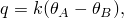

where *q* is the heat flux per unit area crossing the interface from point *A* on one surface to point *B* on the other,  and  are the temperatures of the points on the surfaces, and *k* is the gap conductance. Point *A* is a node on the slave surface; and point *B* is the location on the master surface contacting the slave node or, if the surfaces are not in contact, the location on the master surface with a surface normal that intersects the slave node.

You can define *k* directly or, in Abaqus/Standard, in user subroutine [`GAPCON`](../sub/sub-link.md#sub-xsl-gapcon).

#### Defining the gap conductance directly

When defining *k* directly, define it as 

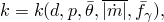

where

*d*

is the clearance between *A* and *B*,

*p*

is the contact pressure transmitted across the interface between *A* and *B*,


is the average of the surface temperatures at *A* and *B*,


is the average of the magnitudes of the mass flow rates per unit area of the contact surfaces at *A* and *B* (this variable is not considered in an Abaqus/Explicit analysis), and


is the average of any predefined field variables at *A* and *B*.

##### Defining gap conductance as a function of clearance

You can create a table of data defining the dependence of *k* on the variables listed above. The default in Abaqus is to make *k* a function of the clearance *d*. When *k* is a function of gap clearance, *d*, the tabular data must start at zero clearance (closed gap) and define *k* as *d* increases. At least two pairs of 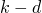 points must be given to define *k* as a function of the clearance. The value of *k* drops to zero immediately after the last data point, so there is no heat conductance when the clearance is greater than the value corresponding to the last data point. If gap conductance is not also defined as a function of contact pressure, *k* will remain constant at the zero clearance value for all pressures, as shown in [Figure 37.2.1--1](pt09ch37s02aus174.md#athermalinteraction-gaps)(a).

| **Input File Usage: ** | ``` [*GAP CONDUCTANCE](../key/key-link.md#usb-kws-mgapconduct) , *d*,  ``` |
| --- | --- |

| **Abaqus/CAE Usage: ** | Interaction module: contact property editor: ****Thermal****Thermal Conductance****: **Definition: Tabular**, **Use only clearance-dependency data** |
| --- | --- |

**Figure 37.2.1–1** Examples of input data to define the gap conductance as a function of clearance or contact pressure.


##### Defining gap conductance as a function of contact pressure

You can define *k* as a function of the contact pressure, *p*. When *k* is a function of contact pressure at the interface, the tabular data must start at zero contact pressure (or, in the case of contact that can support a tensile force, the data point with the most negative pressure) and define *k* as *p* increases. The value of *k* remains constant for contact pressures outside of the interval defined by the data points. If gap conductance is not also defined as a function of clearance, *k* is zero for all positive values of clearance and discontinuous at zero clearance, as shown in [Figure 37.2.1--1](pt09ch37s02aus174.md#athermalinteraction-gaps)(b).

| **Input File Usage: ** | ``` [*GAP CONDUCTANCE](../key/key-link.md#usb-kws-mgapconduct), PRESSURE , *p*,  ``` |
| --- | --- |

| **Abaqus/CAE Usage: ** | Interaction module: contact property editor: ****Thermal****Thermal Conductance****: **Definition: Tabular**, **Use only pressure-dependency data** |
| --- | --- |

##### Gap conductance as a function of both clearance and contact pressure

*k* can depend on both clearance and pressure. A discontinuity in *k* is allowed at  and . At the state of zero clearance and zero pressure the value of *k* corresponding to the zero pressure data point is used, as shown in [Figure 37.2.1--2](pt09ch37s02aus174.md#athermalinteraction-gappres)(a). 

**Figure 37.2.1–2** Examples of input data to define the gap conductance as a function of both clearance and contact pressure.


In the case of no-separation contact, once contact occurs the conductance is always evaluated based on the portion of the curve that defines the pressure dependence. The gap conductance, *k*, remains constant for contact pressures outside of the interval defined by the data points, as shown in [Figure 37.2.1--2](pt09ch37s02aus174.md#athermalinteraction-gappres)(b). The pressure dependence of *k* is extended into the negative pressure region even if no data points with negative pressure are included.

| **Input File Usage: ** | ``` [*GAP CONDUCTANCE](../key/key-link.md#usb-kws-mgapconduct) , *d*,  [*GAP CONDUCTANCE](../key/key-link.md#usb-kws-mgapconduct), PRESSURE , *p*,  ``` |
| --- | --- |
|  | For example, the following input defines 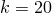 for the zero clearance data point and  for the zero pressure data point: ``` [*SURFACE INTERACTION](../key/key-link.md#usb-kws-hsurfaceinteraction), NAME=*name* [*GAP CONDUCTANCE](../key/key-link.md#usb-kws-mgapconduct) 20.0, 0.0 10.0, 0.1 … [*GAP CONDUCTANCE](../key/key-link.md#usb-kws-mgapconduct), PRESSURE 50.0, 0.0 65.0, 100.0 70.0, 250.0 … ``` |

| **Abaqus/CAE Usage: ** | Interaction module: contact property editor: ****Thermal****Thermal Conductance****: **Definition: Tabular**, **Use both clearance- and pressure-dependency data** |
| --- | --- |

##### Using gap conductance to model convective heat transfer from a surface in Abaqus/Standard

Generally, mass flow rates are defined in Abaqus/Standard (see ["Forced convection through the mesh" in "Uncoupled heat transfer analysis," Section 6.5.2](pt03ch06s05at18.md#usb-anl-aheattransfer-forcedconvection)) only for nodes associated with forced convection elements. However, they can be defined for any node in a model. By using the dependence of *k* on the average mass flow rate at the interface (in addition to other dependencies), it is possible for the contact property definition to simulate convective heat transfer to the boundary layer between a solid and a moving fluid. If mass flow rates are given only for nodes on one side of the interface, which is typically the case when simulating convective heat transfer, the average mass flow rate 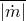 used to define *k* will be half the magnitude specified.

| **Input File Usage: ** | ``` [*GAP CONDUCTANCE](../key/key-link.md#usb-kws-mgapconduct) *k*, *d*, ,  ``` |
| --- | --- |

| **Abaqus/CAE Usage: ** | Interaction module: contact property editor: ****Thermal****Thermal Conductance****: **Definition**: **Tabular**, **Clearance Dependency** and/or **Pressure Dependency**, toggle on **Use mass flow rate-dependent data (Standard only)** |
| --- | --- |

##### Defining gap conductance to be a function of predefined field variables

In addition to the dependencies mentioned previously, the gap conductance can be dependent on any number of predefined field variables, . To make the gap conductance depend on field variables, at least two data points are required for each field variable value.

| **Input File Usage: ** | ``` [*GAP CONDUCTANCE](../key/key-link.md#usb-kws-mgapconduct), DEPENDENCIES=*n* *k*, *d*, , ,  ``` |
| --- | --- |

| **Abaqus/CAE Usage: ** | Interaction module: contact property editor: ****Thermal****Thermal Conductance****: **Definition: Tabular**, **Clearance Dependency** and/or **Pressure Dependency**, **Number of field variables:** *n* |
| --- | --- |

#### Defining the gap conductance using user subroutine [`GAPCON`](../sub/sub-link.md#sub-xsl-gapcon)

In Abaqus/Standard *k* can be defined in user subroutine [`GAPCON`](../sub/sub-link.md#sub-xsl-gapcon). In this case there is greater flexibility in specifying the dependencies of *k*. It is no longer necessary to define *k* as a function of the average of the two surface's temperatures, mass flow rates, or field variables. 


| **Input File Usage: ** | ``` [*GAP CONDUCTANCE](../key/key-link.md#usb-kws-mgapconduct), USER ``` |
| --- | --- |

| **Abaqus/CAE Usage: ** | Interaction module: contact property editor: ****Thermal****Thermal Conductance****: **Definition: User-defined** |
| --- | --- |

#### Defining the gap conductance to be strongly dependent on temperature

If *k* depends strongly on temperature, the unsymmetric terms in the calculations start to become increasingly important in Abaqus/Standard. Using the unsymmetric matrix storage and solution scheme for the step may improve the convergence rate in the analysis (see ["Defining an analysis," Section 6.1.2](pt03ch06s01abo05.md)).

#### Temperature and field-variable dependence of gap conductance for structural elements

Temperature and field-variable distributions in beam and shell elements can generally include gradients through the cross-section of the element. Contact between these elements occurs at the reference surface; therefore, temperature and field-variable gradients in the element are not considered when determining gap conductance, even in cases where the properties are also clearance dependent.

### Modeling radiation between surfaces when the gap is small

Abaqus assumes that radiative heat transfer between closely spaced contact surfaces occurs in the direction of the normal between the surfaces. In models using surface-based contact this normal corresponds to the master surface normal (see ["Contact formulations in Abaqus/Standard," Section 38.1.1](pt09ch38s01aus177.md); ["Defining contact pairs in Abaqus/Explicit," Section 36.5.1](pt09ch36s05aus160.md); and ["Surfaces: overview," Section 2.3.1](pt01ch02s03aus16.md)). In models using the contact elements available in Abaqus/Standard the element's connectivity defines the normal direction.

The gap radiation functionality in Abaqus is intended for modeling radiation between surfaces across a narrow gap. A more general capability for modeling radiation is available in Abaqus/Standard (see ["Cavity radiation," Section 41.1.1](pt09ch41s01aus187.md)).

Radiative heat transfer is defined as a function of clearance between the surfaces through the effective view factor. Abaqus maintains the radiative heat flux even when the surfaces are in contact. This causes only a minor inaccuracy since normally the heat flux from conduction is much larger than the radiative heat flux.

Abaqus defines the heat flow per unit surface area between corresponding points as 

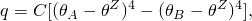

where *q* is the heat flux per unit surface area crossing the gap at this point from surface *A* to surface *B*,  and  are the temperatures of the two surfaces,  is the absolute zero on the temperature scale being used, and the coefficient *C* is given by

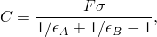

where  is the Stefan-Boltzmann constant,  and  are the surface emissivities, and *F* is the effective view factor, which corresponds to viewing the master surface from the slave surface.

The view factor *F* must be defined as a function of the clearance, *d*, and should have a value between 0.0 and 1.0. At least two pairs of  points are required to define the view factor, and the tabular data must start at zero clearance (closed gap) and define the view factor as the clearance increases. The value of *F* drops to zero immediately after the last data point, so there is no radiative heat transfer when the clearance is greater than the value corresponding to the last data point (see [Figure 37.2.1--3](pt09ch37s02aus174.md#athermalinteraction-view)).

**Figure 37.2.1–3** Example of input data to define the view factor as a function of clearance.


| **Input File Usage: ** | ``` [*GAP RADIATION](../key/key-link.md#usb-kws-mgapradiation) ,  ,  ,  … ``` |
| --- | --- |

| **Abaqus/CAE Usage: ** | Interaction module: contact property editor: ****Thermal****Radiation****: **Emissivity of master surface:** , **Emissivity of slave surface:** , **View factor** and **Clearance** |
| --- | --- |

#### Specifying the value of absolute zero

You must specify the value of .

| **Input File Usage: ** | ``` [*PHYSICAL CONSTANTS](../key/key-link.md#usb-kws-mphysicalconsts), ABSOLUTE ZERO= ``` |
| --- | --- |

| **Abaqus/CAE Usage: ** | Any module: ****Model****Edit Attributes*****model_name*****: **Absolute zero temperature:**  |
| --- | --- |

#### Specifying the Stefan-Boltzmann constant

You must specify the Stefan-Boltzmann constant, .

| **Input File Usage: ** | ``` [*PHYSICAL CONSTANTS](../key/key-link.md#usb-kws-mphysicalconsts), STEFAN BOLTZMANN= ``` |
| --- | --- |

| **Abaqus/CAE Usage: ** | Any module: ****Model****Edit Attributes*****model_name*****: **Stefan-Boltzmann constant:**  |
| --- | --- |

#### Improving convergence in Abaqus/Standard

Since the heat flux due to radiation is a strongly nonlinear function of the temperature, the radiation equations are strongly nonsymmetric and using the unsymmetric matrix storage and solution scheme for the step may improve the convergence rate in Abaqus/Standard (see ["Defining an analysis," Section 6.1.2](pt03ch06s01abo05.md)).

### Modeling heat generated by nonthermal surface interactions

In fully coupled temperature-displacement, fully coupled thermal-electrical-structural, or coupled thermal-electrical simulations, Abaqus allows for heat generation due to the dissipation of energy created by the mechanical or electrical interaction of contacting surfaces. The source of the heat in a fully coupled temperature-displacement analysis and a fully coupled thermal-electrical-structural analysis is frictional sliding; the source in a coupled thermal-electrical and a fully coupled thermal-electrical-structural analysis simulation is the flow of electrical current across the interface surfaces. By default, Abaqus releases all of the dissipated energy as heat between the surfaces and distributes it equally between the two interacting surfaces.

You can specify the fraction of dissipated energy converted into heat,  (default is 1.0), and the weighting factor, *f* (default is 0.5), for distribution of the heat between the interacting surfaces.  often includes a factor to convert mechanical energy into thermal energy.

*f* = 1.0 indicates that all of the generated heat flows into the first (slave) surface of the contact pair. *f* = 0.0 indicates that all of the generated heat flows into the opposite (master) surface. Unless valid experimental data suggest otherwise, it is best to assume the default value of *f* = 0.5 because this value evenly distributes the generated heat between the surfaces.

If user subroutine [`UINTER`](../sub/sub-link.md#sub-xsl-uinter), [`VUINTER`](../sub/sub-link.md#sub-xsl-vuinter), or [`VUINTERACTION`](../sub/sub-link.md#sub-xsl-vuinteraction) is used to define the interfacial constitutive behavior, all gap heat generation effects will be turned off; you must supply an additional heat flux in the user subroutine to model these effects.

| **Input File Usage: ** | ``` [*GAP HEAT GENERATION](../key/key-link.md#usb-kws-mgapheatgener) , *f* ``` |
| --- | --- |

| **Abaqus/CAE Usage: ** | Interaction module: contact property editor: ****Thermal****Heat Generation****: **Specify:**  and *f* |
| --- | --- |

#### Heat generated due to frictional sliding

In coupled thermal-mechanical and coupled thermal-electrical-structural surface interactions, the rate of frictional energy dissipation is given by 

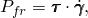

where 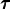 is the frictional stress and  is the slip rate. The amount of this energy released as heat on each surface is assumed to be 


where  and *f* are defined above. The heat flux into the slave surface is 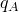, and the heat into the master surface is .

#### Heat generated due to flow of electrical current in Abaqus/Standard

In a coupled thermal-electrical analysis (see ["Coupled thermal-electrical analysis," Section 6.7.3](pt03ch06s07at22.md)) and a fully coupled thermal-electrical-structural analysis (see ["Fully coupled thermal-electrical-structural analysis," Section 6.7.4](pt03ch06s07at23.md)), the rate of electrical energy dissipated by electric current flowing across the interface is 

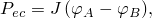

where *J* is the electrical current density and  and  are the electrical potentials on the two surfaces. The amount of this energy released as heat on each of the interface surfaces is assumed to be 


where  and *f* are defined in the same way as for frictional dissipation. Again, the heat flux into the slave surface is , and the heat into the master surface is .

### Surface-based interaction variables for thermal contact property models

Abaqus provides many output variables related to the thermal interaction of surfaces. In Abaqus/Standard the values of these variables are always given at the nodes of the slave surface. In Abaqus/Explicit these variables can be output for master and slave surfaces, although they are not available for analytical surfaces. The variables are available only for simulations that use surface-based contact definitions. They can be requested as surface output to the data, results, or output database files (see ["Surface output from Abaqus/Standard" in "Output to the data and results files," Section 4.1.2](pt02ch04s01aus39.md#usb-out-oprintfile-surface), and ["Surface output in Abaqus/Standard and Abaqus/Explicit" in "Output to the output database," Section 4.1.3](pt02ch04s01aus40.md#usb-out-odboutput-surface), for details).

#### Surface-based interaction variables for heat fluxes

The following variables are available for any simulation in which heat transfer can occur (fully coupled temperature-displacement, fully coupled thermal-electrical-structural, coupled thermal-electrical, or pure heat transfer analyses):

| HFL | Heat flux per unit area leaving the surface. |
| --- | --- |

| HFLA | HFL multiplied by the nodal area. |
| --- | --- |

| HTL | Time integrated HFL. |
| --- | --- |

| HTLA | Time integrated HFLA. |
| --- | --- |

Abaqus/Standard provides all of these variables by default whenever surface output is requested to the data or results file and thermal surface interactions are present.

These variables can also be displayed in contour plots in the Visualization module of Abaqus/CAE (Abaqus/Viewer).

#### Surface-based interaction variables for heat generated by frictional sliding

The following variables are available for fully coupled temperature-displacement simulations in which there is frictional interaction between contacting surfaces or user subroutine [`UINTER`](../sub/sub-link.md#sub-xsl-uinter), [`VUINTER`](../sub/sub-link.md#sub-xsl-vuinter), or [`VUINTERACTION`](../sub/sub-link.md#sub-xsl-vuinteraction) is used:

| SFDR | Heat flux per unit area entering the surface due to frictional dissipation (includes heat flux to both surfaces,  and ). When user subroutine [`UINTER`](../sub/sub-link.md#sub-xsl-uinter), [`VUINTER`](../sub/sub-link.md#sub-xsl-vuinter), or [`VUINTERACTION`](../sub/sub-link.md#sub-xsl-vuinteraction) is used to define the interfacial thermal constitutive behavior, this quantity represents the heat flux resulting from the total energy dissipation due to friction and other dissipative effects. The effects of gap heat generation are turned off. |
| --- | --- |

| SFDRA | SFDR multiplied by the nodal area. |
| --- | --- |

| SFDRT | Time integrated SFDR. |
| --- | --- |

| SFDRTA | Time integrated SFDRA. |
| --- | --- |

| WEIGHT | Weighting factor, *f*, for heat flux distribution between the surfaces (available only in Abaqus/Standard; not available when the constitutive behavior of the interface is defined using user subroutine [`UINTER`](../sub/sub-link.md#sub-xsl-uinter)). |
| --- | --- |

Abaqus/Standard does not provide these variables by default when surface output is requested to the data or results file; you must specify the variable identifiers.

Contour plots of these variables can also be created in the Visualization module of Abaqus/CAE (Abaqus/Viewer).

#### Surface-based interaction variables for heat generated by electrical currents

The following variables are available for any coupled thermal-electrical and any fully coupled thermal-electrical-structural simulation:

| SJD | Heat flux per unit area generated by the electrical current, includes heat flux to both surfaces ( and ). |
| --- | --- |

| SJDA | SJD multiplied by area. |
| --- | --- |

| SJDT | Time integrated SJD. |
| --- | --- |

| SJDTA | Time integrated SJDA. |
| --- | --- |

| WEIGHT | Weighting factor, *f*, for heat flux distribution between the surfaces. |
| --- | --- |

Abaqus/Standard does not provide these variables by default when surface output is requested to the data or results file; you must specify the variable identifiers.

Contour plots of these variables can also be plotted in the Visualization module of Abaqus/CAE (Abaqus/Viewer).

### Thermal interaction variables for thermal gap elements

Abaqus/Standard provides the heat flux per unit area across the thermal gap elements as output. Request element output of the variable identifier HFL to the data, results, or output database file (see ["Element output" in "Output to the data and results files," Section 4.1.2](pt02ch04s01aus39.md#usb-out-oprintfile-elementoutput), and ["Element output" in "Output to the output database," Section 4.1.3](pt02ch04s01aus40.md#usb-out-odboutput-elementoutput), for details). The only nonzero component will be HFL1: there is no heat flux tangential to the interface defined by the gap element. A positive value of HFL1 indicates heat flowing in the direction of the normal to the master surface side of the element (see ["Gap contact elements," Section 40.2.1](pt09ch40s02alm64.md), for the definition of this normal for DGAP elements).

Contours of the heat flux across the thermal contact elements can be plotted using Abaqus/CAE.

### Thermal interactions involving rigid bodies

Various factors to consider when modeling thermal interactions involving rigid bodies are discussed in ["Rigid body definition," Section 2.4.1](pt01ch02s04aus22.md). For example, Abaqus/Standard does not allow modeling of thermal interactions with analytical rigid surfaces.

### Modeling thermal interactions with node-based surfaces

The following limitations apply to fully coupled thermal-electrical-structural and fully coupled thermal-stress analyses (see ["Fully coupled thermal-stress analysis," Section 6.5.3](pt03ch06s05at19.md)) in Abaqus/Standard:
- No heat flow will occur across a contact pair involving a node-based surface.
- No heat generation will occur for a contact pair involving a node-based surface.

 These limitations do not apply to Abaqus/Explicit and do not apply to other analysis types involving thermal interactions in Abaqus/Standard (see ["Heat transfer analysis procedures: overview," Section 6.5.1](pt03ch06s05abo08.md)).

However, when allowed, use node-based surfaces for thermal interactions with caution: Abaqus calculates the thermal interaction between bodies in terms of nodal heat fluxes that must consider the actual contact surface area associated with each node. In Abaqus/Standard this area must be specified precisely for each node in the node-based surface to calculate the correct heat fluxes; in Abaqus/Explicit a unit area is assigned to each node of a node-based surface (see ["Node-based surface definition," Section 2.3.3](pt01ch02s03aus18.md)).

### Thermal interactions between surfaces with nodes containing multiple temperature degrees of freedom

When the surfaces involved in a thermal interaction are defined on shell elements that have multiple temperature degrees of freedom at each node, the choice of the temperature degree of freedom at a given node for the thermal interaction depends on how the surface is defined. For an element-based surface the temperature degree of freedom closest to the surface is chosen; i.e., the first temperature degree of freedom at the node for the bottom surface and the last temperature degree of freedom at the node for the top surface. For a node-based surface the first temperature degree of freedom at the node is always chosen for a thermal interaction.


